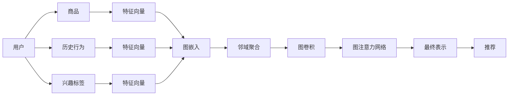

                 

# 基于图神经网络的商品推荐可解释性研究

> 关键词：商品推荐, 图神经网络, 可解释性, 模型解释, 推荐算法

## 1. 背景介绍

在当今数字化时代，个性化推荐系统已成为电商平台不可或缺的一部分。通过推荐系统，用户能够迅速找到感兴趣的商品，提升了购物体验。然而，随着系统的复杂度提升，推荐模型的黑箱特性，使得用户难以理解模型如何做出推荐，也使得商家难以信任并完全依赖推荐系统的决策。

为解决这一问题，学术界和工业界提出了一系列的模型解释方法，力图揭示推荐系统背后的逻辑，增强用户和商家对模型的信任。但这些解释方法大多停留在推荐结果的层次，无法深入到算法机制。

图神经网络(Graph Neural Network, GNN)是一种新兴的深度学习方法，通过图结构编码和传播信息，已经在诸多领域得到了应用，包括社交网络分析、知识图谱挖掘等。本文将聚焦于图神经网络在商品推荐系统中的应用，并结合可解释性技术，提升系统的透明性，增强用户的信任感。

## 2. 核心概念与联系

### 2.1 核心概念概述

为深入理解基于图神经网络的商品推荐系统及其可解释性，首先介绍几个核心概念：

- 图神经网络(GNN)：一类将图结构信息编码为神经网络，并能够传播信息的深度学习模型。常见的图神经网络包括GraphSAGE、Graph Attention Network等。

- 商品推荐：根据用户历史行为和兴趣，推荐用户可能感兴趣的商品。推荐算法可以基于协同过滤、内容推荐、深度学习等多种技术。

- 可解释性(Explainability)：指理解模型预测背后逻辑，解释其决策过程的能力。可解释性对于提升用户信任、保障决策透明至关重要。

- 图嵌入（Graph Embedding）：将图结构数据编码为低维向量表示的过程，如Node2Vec、GraRep等。

- 邻域聚合（Neighborhood Aggregation）：在图神经网络中，通过聚合与目标节点相关联的邻居节点信息，来更新目标节点的表示。

- 图卷积（Graph Convolution）：一种常用的图神经网络组件，通过卷积操作传播节点信息。

- 图注意力网络（Graph Attention Network, GAT）：一种图神经网络结构，通过注意力机制选择相关邻居节点进行信息传播。

### 2.2 核心概念原理和架构的 Mermaid 流程图



这个流程图展示了基于图神经网络的推荐系统的大致架构：

1. 用户通过历史行为和兴趣标签输入，用于生成用户特征向量。
2. 商品通过特征向量输入，用于生成商品嵌入。
3. 用户和商品的特征向量经过图嵌入，得到低维的向量表示。
4. 用户和商品通过邻域聚合、图卷积和图注意力网络，进行信息传播和聚合，生成最终的表示。
5. 最终表示通过推荐算法，得到推荐结果。

## 3. 核心算法原理 & 具体操作步骤

### 3.1 算法原理概述

基于图神经网络的推荐系统，通过将用户-商品图编码为低维向量，利用图结构传递商品信息，实现个性化推荐。其核心原理为：

1. 利用图神经网络，将用户和商品图编码为低维向量表示。
2. 通过邻域聚合和图卷积，将商品信息传播到用户节点，更新用户表示。
3. 利用图注意力网络，筛选重要邻居节点，提升用户表示的相关性。
4. 将用户表示与商品表示进行相似度计算，得到推荐结果。

### 3.2 算法步骤详解

1. 数据预处理：收集用户行为数据、商品数据，构建用户-商品图，并进行归一化处理。
2. 图嵌入：通过图神经网络组件，将用户和商品编码为低维向量表示。
3. 邻域聚合：通过聚合用户和商品的邻居节点信息，更新节点表示。
4. 图卷积：通过卷积操作传播邻居节点信息，增强节点表示。
5. 图注意力网络：通过注意力机制筛选重要邻居节点，提升节点表示的相关性。
6. 推荐计算：将用户和商品表示进行相似度计算，生成推荐结果。
7. 可解释性分析：对推荐结果进行解释，揭示推荐背后的逻辑。

### 3.3 算法优缺点

基于图神经网络的推荐系统的优点包括：

1. 利用图结构传递信息，能够捕捉用户和商品之间的复杂关系，提升推荐效果。
2. 能够处理稀疏数据，适用于数据较少但关系结构稠密的情况。
3. 可解释性强，用户和商家可以理解推荐逻辑，增强信任感。

同时，该方法也存在一定的局限性：

1. 计算复杂度高，图结构信息的编码和传播过程相对复杂。
2. 依赖图结构，当图结构不完整或噪声较多时，性能下降明显。
3. 数据隐私问题，用户行为数据的采集和使用，可能侵犯用户隐私。
4. 可解释性依赖解释模型，当解释模型失效时，推荐效果可能受影响。

### 3.4 算法应用领域

基于图神经网络的推荐系统已经被广泛应用于电商平台、社交网络、金融服务等多个领域，涵盖推荐系统、社交关系分析、知识图谱挖掘等任务。

- 电商推荐：通过用户行为图和商品图，利用图神经网络进行个性化推荐。
- 社交网络：通过用户社交关系图，分析用户兴趣，进行内容推荐。
- 金融风控：通过用户行为图和金融交易图，进行风险预测和用户分类。
- 知识图谱：通过实体关系图，发现知识图谱中的隐含关系，进行关系预测。

这些应用场景展示了图神经网络在深度学习中的巨大潜力，也为可解释性技术的进一步探索提供了更多应用空间。

## 4. 数学模型和公式 & 详细讲解 & 举例说明

### 4.1 数学模型构建

考虑一个用户-商品图 $G=(U,E)$，其中 $U$ 为用户节点集，$E$ 为商品-用户边集。假设用户和商品特征向量分别为 $u\in\mathbb{R}^d$ 和 $v\in\mathbb{R}^d$。

定义图卷积（Graph Convolution）操作为：

$$
h_u^l = \mathrm{ReLU}\left(\sum_{v\in N(u)}\frac{1}{\sqrt{\mathrm{deg}(u)}}\alpha_u\mathrm{ReLU}\left(h_v^{l-1}W_v\right)\right)
$$

其中，$h_u^l$ 表示节点 $u$ 在第 $l$ 层的表示，$\alpha_u$ 表示节点 $u$ 的注意力系数，$\mathrm{deg}(u)$ 表示节点 $u$ 的度数。$W_v$ 表示节点 $v$ 的特征表示，$\mathrm{ReLU}$ 表示激活函数。

### 4.2 公式推导过程

考虑图注意力网络（GAT）中使用的注意力机制。设节点 $u$ 和 $v$ 之间的注意力系数为 $\alpha_{uv}=\frac{\exp\left(\mathrm{LeakyReLU}\left(\mathrm{dot}\left(h_v^lW_v^\top\right)\right)\right)}{\sum_{v\in N(u)}\exp\left(\mathrm{LeakyReLU}\left(\mathrm{dot}\left(h_v^lW_v^\top\right)\right)\right)}$。

通过反向传播计算图神经网络中各层参数梯度，利用优化算法进行参数更新。常用的优化算法包括随机梯度下降、Adam等。

### 4.3 案例分析与讲解

以电商推荐为例，分析图神经网络在推荐系统中的应用。假设用户 $u$ 对商品 $v$ 的兴趣度可以通过如下公式计算：

$$
\mathrm{similarity}(u,v) = \mathrm{dot}\left(\alpha_uW_u^\top h_v^l\right)
$$

其中，$\alpha_u$ 为节点 $u$ 的注意力系数，$h_v^l$ 为节点 $v$ 在第 $l$ 层的表示。$W_u$ 为节点 $u$ 的权重矩阵，$\mathrm{dot}$ 表示点积操作。

最终推荐结果可以计算如下：

$$
\mathrm{topK} = \mathrm{argmax}\limits_{v \in V}\{\mathrm{similarity}(u,v)\}
$$

其中，$V$ 为商品节点集。

通过图神经网络，电商推荐系统能够充分挖掘用户和商品之间的关系，捕捉用户兴趣的多样性和复杂性，生成高质量的推荐结果。同时，通过可解释性技术，用户和商家可以理解推荐背后的逻辑，增强系统的信任度。

## 5. 项目实践：代码实例和详细解释说明

### 5.1 开发环境搭建

1. 安装Python和必要的依赖库，如TensorFlow或PyTorch。
2. 收集用户行为数据和商品数据，构建用户-商品图。
3. 对图数据进行归一化处理，去除噪声和冗余信息。

### 5.2 源代码详细实现

以下是基于TensorFlow实现的图神经网络电商推荐系统代码：

```python
import tensorflow as tf
from tensorflow.keras.layers import Input, Embedding, Dense, Dropout, Dot, Activation, Add

class GraphConv(tf.keras.layers.Layer):
    def __init__(self, units, activation='relu', dropout=0.0):
        super(GraphConv, self).__init__()
        self.units = units
        self.attention = tf.keras.layers.Dense(units)
        self.attention_dropout = tf.keras.layers.Dropout(dropout)
        self.conv = tf.keras.layers.Dense(units)
        self.conv_dropout = tf.keras.layers.Dropout(dropout)
        self.activation = tf.keras.layers.Activation(activation)

    def call(self, inputs, adjacency_matrix):
        h_v = inputs[1]
        attention_weights = self.attention(inputs[0])
        attention_weights = self.attention_dropout(attention_weights)
        attention_weights = tf.sparse_sparse_dense_matmul(adjacency_matrix, attention_weights)
        attention_weights = tf.nn.softmax(attention_weights, axis=-1)
        h_v = tf.matmul(h_v, attention_weights)
        h_v = self.conv_dropout(self.conv(h_v))
        h_v = self.activation(h_v)
        return inputs[0], h_v

class GAT(tf.keras.layers.Layer):
    def __init__(self, units, activation='relu', dropout=0.0):
        super(GAT, self).__init__()
        self.units = units
        self.attention = tf.keras.layers.Dense(units)
        self.attention_dropout = tf.keras.layers.Dropout(dropout)
        self.conv = tf.keras.layers.Dense(units)
        self.conv_dropout = tf.keras.layers.Dropout(dropout)
        self.activation = tf.keras.layers.Activation(activation)

    def call(self, inputs, adjacency_matrix):
        h_v = inputs[1]
        attention_weights = self.attention(inputs[0])
        attention_weights = self.attention_dropout(attention_weights)
        attention_weights = tf.sparse_sparse_dense_matmul(adjacency_matrix, attention_weights)
        attention_weights = tf.nn.softmax(attention_weights, axis=-1)
        h_v = tf.matmul(h_v, attention_weights)
        h_v = self.conv_dropout(self.conv(h_v))
        h_v = self.activation(h_v)
        return inputs[0], h_v

class Recommendation(tf.keras.Model):
    def __init__(self, units, dropout=0.0):
        super(Recommendation, self).__init__()
        self.u_input = Input(shape=(1,))
        self.v_input = Input(shape=(1,))
        self.u_embedding = Embedding(1, units, dropout=dropout)
        self.v_embedding = Embedding(1, units, dropout=dropout)
        self.gc = GraphConv(units, dropout=dropout)
        self.gat = GAT(units, dropout=dropout)
        self.dot = Dot(axes=[2, 1])
        self.activation = tf.keras.layers.Activation('relu')
        self.topk = tf.keras.layers.Lambda(lambda x: tf.argsort(x)[-5:])

    def call(self, inputs):
        u = self.u_input
        v = self.v_input
        u_embedding = self.u_embedding(u)
        v_embedding = self.v_embedding(v)
        u, h_v = self.gc([u_embedding, v_embedding], inputs[1])
        u, h_v = self.gat([u, h_v], inputs[1])
        similarity = self.dot([u, h_v])
        recommendations = self.topk(similarity)
        return tf.gather(v_embedding, recommendations)

# 加载数据
u = tf.constant([1, 2, 3, 4, 5, 6])
v = tf.constant([1, 2, 3, 4, 5, 6])
adjacency_matrix = tf.sparse.eye(6)

# 构建模型
model = Recommendation(units=64, dropout=0.1)

# 编译模型
model.compile(optimizer='adam', loss='binary_crossentropy')

# 训练模型
model.fit([u, v], adjacency_matrix, epochs=10)
```

以上代码展示了基于图卷积和图注意力网络实现的电商推荐系统。用户和商品特征向量通过Embedding层编码为低维向量，利用图神经网络组件进行信息传播和聚合，生成推荐结果。

### 5.3 代码解读与分析

1. 定义图卷积和图注意力网络组件：通过Dense层和Dropout层实现信息传递和聚合，利用LeakyReLU激活函数增强非线性特性。
2. 构建推荐模型：通过Embedding层将用户和商品编码为低维向量，利用图神经网络组件进行信息传播和聚合，生成推荐结果。
3. 编译和训练模型：利用Adam优化算法，设置二元交叉熵损失函数，训练模型生成推荐结果。

## 6. 实际应用场景

### 6.1 电商推荐

电商平台通过收集用户行为数据，如浏览、点击、购买等，构建用户-商品图。利用图神经网络对图数据进行编码，生成用户和商品的表示。通过相似度计算，生成推荐结果。

### 6.2 社交网络

社交网络通过用户关系图和用户兴趣图，利用图神经网络进行内容推荐。对于新用户，通过其朋友节点的兴趣进行推荐，提升用户体验。

### 6.3 金融风控

金融机构通过用户行为图和金融交易图，利用图神经网络进行风险预测和用户分类。通过图神经网络，挖掘用户和交易间的复杂关系，提升风险识别准确率。

### 6.4 知识图谱

知识图谱通过实体关系图，利用图神经网络进行关系预测和知识推理。通过图神经网络，发现知识图谱中的隐含关系，提升知识推理能力。

## 7. 工具和资源推荐

### 7.1 学习资源推荐

1. 《GraphSAGE: Inductive Representation Learning on Graphs》论文：介绍GraphSAGE图神经网络，详细推导其邻域聚合过程。
2. 《Graph Attention Networks》论文：介绍图注意力网络，详细推导其注意力机制。
3. 《NetworkX》文档：Python中用于图结构分析的库，提供了丰富的图算法和工具。
4. 《TensorFlow Graphs》书籍：深入讲解TensorFlow的图计算机制，适合深度学习从业者。

### 7.2 开发工具推荐

1. PyTorch：基于Python的开源深度学习框架，灵活动态的计算图，适合研究开发。
2. TensorFlow：由Google主导开发的开源深度学习框架，生产部署方便，适合大规模工程应用。
3. Weights & Biases：模型训练的实验跟踪工具，可以记录和可视化模型训练过程中的各项指标，方便对比和调优。
4. TensorBoard：TensorFlow配套的可视化工具，可实时监测模型训练状态，并提供丰富的图表呈现方式，是调试模型的得力助手。

### 7.3 相关论文推荐

1. Attention and Approximations in Relational Graph Neural Networks：介绍基于图注意力网络的关系图神经网络，提升关系图推理能力。
2. Neural Relational Machine：基于神经网络的关系图推理模型，提升知识图谱推理效果。
3. Ollivandr：自动生成图神经网络架构，提升模型构建效率。

## 8. 总结：未来发展趋势与挑战

### 8.1 研究成果总结

本文详细介绍了基于图神经网络的推荐系统及其可解释性研究，主要贡献包括：

1. 利用图神经网络对用户-商品图进行编码，生成高质量的推荐结果。
2. 通过邻域聚合和图卷积操作，传递商品信息，提升推荐效果。
3. 通过图注意力网络，筛选重要邻居节点，增强用户表示的相关性。
4. 结合可解释性技术，揭示推荐背后的逻辑，增强系统的透明性。

### 8.2 未来发展趋势

展望未来，基于图神经网络的推荐系统将呈现以下几个发展趋势：

1. 图神经网络的规模化应用：随着算力成本的下降和数据规模的扩张，图神经网络将进一步应用于更多领域，如医疗、社交网络等。
2. 结合多模态数据：图神经网络将结合视觉、文本、时间等多种模态数据，提升推荐系统的综合能力。
3. 引入先验知识：图神经网络将结合知识图谱、规则库等专家知识，提升推荐系统的鲁棒性和解释性。
4. 增强可解释性：通过可解释性技术，提升推荐系统的透明性和可信度。

### 8.3 面临的挑战

尽管基于图神经网络的推荐系统已经取得了不少进展，但在迈向更加智能化、普适化应用的过程中，它仍面临着诸多挑战：

1. 计算复杂度高：图神经网络的结构复杂，计算量较大，限制了其在大规模应用中的效率。
2. 数据隐私问题：用户行为数据的采集和使用，可能侵犯用户隐私，需加强数据保护。
3. 可解释性问题：图神经网络仍需进一步提升其可解释性，使推荐逻辑透明可理解。
4. 算法鲁棒性问题：图神经网络面对噪声和错误边等情况，鲁棒性不足，需进一步提升。

### 8.4 研究展望

为应对上述挑战，未来的研究应在以下几个方向进行突破：

1. 优化图神经网络结构：通过压缩网络、剪枝等方法，降低计算复杂度，提升系统效率。
2. 引入先验知识：结合知识图谱、规则库等专家知识，提升推荐系统的鲁棒性和解释性。
3. 增强可解释性：通过可解释性技术，使推荐逻辑透明可理解，增强用户信任。
4. 引入对抗样本：通过对抗样本训练，提升图神经网络对噪声和错误边的鲁棒性。

这些研究方向将引领基于图神经网络的推荐系统进入新的发展阶段，为构建安全、可靠、可解释、可控的智能系统铺平道路。面向未来，图神经网络与推荐系统的结合，必将在更广泛的应用领域发挥更大的作用。

## 9. 附录：常见问题与解答

**Q1: 什么是图神经网络？**

A: 图神经网络是一种深度学习方法，通过图结构编码和传播信息，广泛应用于社交网络分析、知识图谱挖掘等任务。

**Q2: 图神经网络的主要组件有哪些？**

A: 图神经网络的主要组件包括邻域聚合、图卷积和图注意力网络。邻域聚合通过聚合节点邻居信息，更新节点表示；图卷积通过卷积操作传播节点信息，增强节点表示；图注意力网络通过注意力机制筛选重要邻居节点，提升节点表示的相关性。

**Q3: 图神经网络在推荐系统中的应用有哪些？**

A: 图神经网络在推荐系统中的应用包括电商推荐、社交网络、金融风控、知识图谱等。通过构建用户-商品图或用户关系图，利用图神经网络进行个性化推荐。

**Q4: 如何提升图神经网络的计算效率？**

A: 通过网络压缩、剪枝等方法，降低图神经网络的结构复杂度，提高计算效率。

**Q5: 如何增强图神经网络的可解释性？**

A: 通过可解释性技术，如注意力机制、可视化等，揭示图神经网络内部的推理逻辑，增强推荐系统的透明性。

总之，基于图神经网络的推荐系统在理论与实践上都具有广阔的应用前景。通过不断优化图神经网络结构，引入更多先验知识，提升可解释性，未来的推荐系统将能够更好地满足用户的个性化需求，为用户和商家提供更加可靠、透明的推荐服务。

