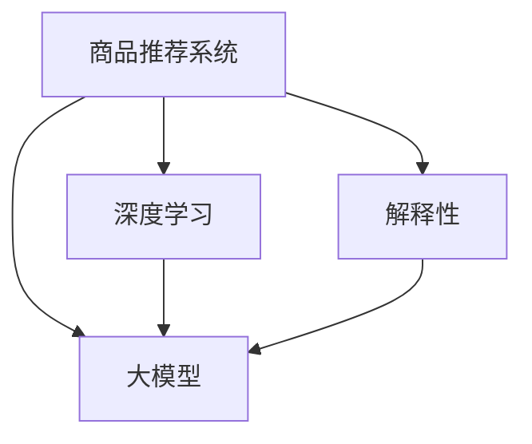

                 

# 基于大模型的商品推荐解释性研究

> 关键词：商品推荐,大模型,解释性,深度学习,推荐系统

## 1. 背景介绍

### 1.1 问题由来

商品推荐系统作为电商平台的核心应用，已经成为驱动用户购买行为的关键引擎。传统的推荐方法，如基于协同过滤、内容推荐等，在提升用户满意度、增加交易转化率方面取得了显著成效。然而，这些方法的推荐结果往往缺乏解释性，用户难以理解推荐背后真实的决策逻辑，导致推荐系统的效果与信任度难以平衡。

近年来，基于深度学习的大模型推荐系统逐渐成为研究热点。通过大规模预训练语言模型，可以有效捕捉用户行为的潜在语义信息，实现跨领域、多场景的个性化推荐。但大模型推荐系统在提高推荐效果的同时，仍存在一定的黑盒问题。用户对于模型的输出结果缺乏信任，推荐系统的可解释性仍然是一个难以突破的瓶颈。

如何构建具有高解释性的商品推荐系统，是当前推荐系统研究的前沿问题。本文将围绕大模型在推荐系统中的应用，重点探讨如何提升推荐系统的解释性，以增强用户的信任感和满意度，推动推荐系统在电商领域的应用发展。

## 2. 核心概念与联系

### 2.1 核心概念概述

为了更好地理解基于大模型的商品推荐系统及其解释性研究，本节将介绍几个核心概念：

- 商品推荐系统：通过用户的历史行为、物品属性、用户画像等信息，推荐用户可能感兴趣的商品，提升用户满意度与交易转化率。
- 大模型：以自回归或自编码模型为代表的大规模预训练语言模型，通过在大规模文本数据上进行预训练，学习丰富的语言知识，具备强大的语言理解和生成能力。
- 解释性：指模型的输出能够清晰、透明地反映其背后的逻辑和推理过程，便于用户理解模型的决策。
- 深度学习：一种基于神经网络的机器学习技术，通过多层非线性映射，实现复杂特征的自动提取与学习。
- 推荐系统：包括协同过滤、内容推荐、混合推荐等多种方法，通过建模用户与物品之间的关联关系，推荐用户可能感兴趣的商品。

这些概念之间的关系可以通过以下Mermaid流程图来展示：



这个流程图展示了大模型在推荐系统中的应用，以及深度学习与解释性之间的关系。通过深度学习，大模型能够学习到复杂的用户行为和物品属性，为推荐系统提供强大的语义表示能力。同时，通过解释性研究，使推荐系统具备透明化的决策过程，提升用户信任感。

## 3. 核心算法原理 & 具体操作步骤
### 3.1 算法原理概述

基于大模型的商品推荐系统，通常采用"预训练-微调"的范式。具体来说，通过在大规模无标签文本数据上进行预训练，学习到丰富的语言知识和用户行为语义信息。然后在特定的推荐任务上，通过微调优化模型参数，使其能够更准确地预测用户对物品的兴趣，并生成推荐结果。

大模型在推荐系统中的应用，主要是通过以下两个步骤实现：

1. 预训练：在大规模文本数据上进行自监督学习，学习到通用的语言知识。
2. 微调：在推荐数据集上，进行有监督的优化，学习到针对推荐任务的具体知识。

大模型推荐系统可以有效地捕捉用户行为背后的语义信息，从而提升推荐效果。然而，由于模型复杂度高，推荐结果难以解释。本节将详细探讨如何构建具有高解释性的推荐系统，以及可能的改进策略。

### 3.2 算法步骤详解

基于大模型的商品推荐系统，通常包括以下几个关键步骤：

**Step 1: 准备数据集和预训练模型**

- 收集推荐数据集，如用户行为数据、商品属性数据、用户画像数据等。
- 选择合适的预训练语言模型，如BERT、GPT等，作为初始化参数。

**Step 2: 添加任务适配层**

- 根据推荐任务类型，在预训练模型的顶层设计合适的输出层和损失函数。
- 对于推荐任务，通常使用预测函数输出用户对物品的评分，并以平均绝对误差(MAE)或均方误差(MSE)作为损失函数。

**Step 3: 设置微调超参数**

- 选择合适的优化算法及其参数，如AdamW、SGD等，设置学习率、批大小、迭代轮数等。
- 设置正则化技术及强度，包括权重衰减、Dropout、Early Stopping等。
- 确定冻结预训练参数的策略，如仅微调顶层，或全部参数都参与微调。

**Step 4: 执行梯度训练**

- 将训练集数据分批次输入模型，前向传播计算损失函数。
- 反向传播计算参数梯度，根据设定的优化算法和学习率更新模型参数。
- 周期性在验证集上评估模型性能，根据性能指标决定是否触发Early Stopping。
- 重复上述步骤直到满足预设的迭代轮数或Early Stopping条件。

**Step 5: 测试和部署**

- 在测试集上评估微调后模型，对比微调前后的推荐效果。
- 使用微调后的模型对新商品进行推荐，集成到实际的应用系统中。
- 持续收集新的用户行为数据，定期重新微调模型，以适应数据分布的变化。

### 3.3 算法优缺点

基于大模型的商品推荐系统，具有以下优点：

1. 高推荐效果：大模型具备强大的语义表示能力，能够捕捉用户行为背后的语义信息，提升推荐效果。
2. 跨领域适用：适用于各种推荐任务，包括商品推荐、广告推荐、新闻推荐等，通过微调适配特定任务。
3. 参数高效微调：在微调过程中，可以通过参数高效微调技术，如Adapter等，减少需优化的参数量，提高微调效率。
4. 可解释性强：预训练模型具备丰富的语言知识，能够为推荐过程提供一定的语义解释，增强用户信任感。

同时，该方法也存在一定的局限性：

1. 数据依赖度高：微调效果很大程度上依赖于推荐数据的质量和数量，获取高质量推荐数据的成本较高。
2. 泛化能力有限：当推荐任务与预训练数据的分布差异较大时，微调的性能提升有限。
3. 模型复杂度高：大模型结构复杂，推理速度较慢，需要优化模型结构以提升效率。
4. 潜在风险：由于预训练模型的语义理解能力，可能引入错误的推荐结果，对用户产生负面影响。
5. 超参数调优复杂：微调过程涉及众多超参数的调优，需要丰富的经验和大量的实验进行探索。

尽管存在这些局限性，但就目前而言，基于大模型的推荐系统仍然是最主流范式。未来相关研究的重点在于如何进一步降低数据依赖，提高模型的泛化能力和跨领域迁移能力，同时兼顾可解释性和计算效率等因素。

### 3.4 算法应用领域

基于大模型的商品推荐系统，已经在电商、广告、社交网络等多个领域得到了广泛应用，具体如下：

1. **电商推荐**：通过分析用户的历史购买、浏览、评分等行为数据，为用户推荐个性化商品。常见的应用包括淘宝、京东、亚马逊等电商平台的商品推荐。
2. **广告推荐**：通过分析用户的行为数据和兴趣标签，为用户推荐感兴趣的广告，提升广告投放效果。
3. **内容推荐**：基于用户的阅读习惯和喜好，为用户推荐新闻、视频、音乐等媒体内容，提升用户体验。
4. **营销推荐**：利用用户的消费数据和社交关系，推荐个性化的营销活动，如优惠券、折扣等。

除了这些典型应用外，大模型推荐系统也被创新性地应用到更多场景中，如智能家居推荐、旅游推荐、健康推荐等，为电商和其他行业带来新的业务增长点。随着预训练模型和推荐方法的不断进步，大模型推荐系统必将在更多领域发挥重要作用。

## 4. 数学模型和公式 & 详细讲解  
### 4.1 数学模型构建

本节将使用数学语言对基于大模型的商品推荐系统进行更加严格的刻画。

记推荐系统为 $R_{\theta}$，其中 $\theta$ 为模型参数。假设推荐任务为 $T$，训练集为 $D=\{(x_i,y_i)\}_{i=1}^N$，其中 $x_i$ 为用户的行为数据，$y_i$ 为用户对物品的评分或点击行为。

定义推荐模型 $R_{\theta}$ 在数据样本 $(x,y)$ 上的损失函数为 $\ell(R_{\theta}(x),y)$，则在数据集 $D$ 上的经验风险为：

$$
\mathcal{L}(\theta) = \frac{1}{N} \sum_{i=1}^N \ell(R_{\theta}(x_i),y_i)
$$

常用的损失函数包括均方误差损失、绝对误差损失等。通过梯度下降等优化算法，微调过程不断更新模型参数 $\theta$，最小化损失函数 $\mathcal{L}$，使得模型输出逼近真实标签。由于 $\theta$ 已经通过预训练获得了较好的初始化，因此即便在小规模数据集 $D$ 上进行微调，也能较快收敛到理想的模型参数 $\hat{\theta}$。

### 4.2 公式推导过程

以基于大模型的商品推荐系统为例，下面推导均方误差损失函数及其梯度的计算公式。

假设模型 $R_{\theta}$ 在用户行为数据 $x$ 上的输出为 $\hat{y}=R_{\theta}(x)$，表示模型预测的用户评分。真实标签 $y \in [0,5]$ 或 $\{0,1\}$。则均方误差损失函数定义为：

$$
\ell(R_{\theta}(x),y) = \frac{1}{2} (y - \hat{y})^2
$$

将其代入经验风险公式，得：

$$
\mathcal{L}(\theta) = \frac{1}{N} \sum_{i=1}^N (y_i - R_{\theta}(x_i))^2
$$

根据链式法则，损失函数对参数 $\theta_k$ 的梯度为：

$$
\frac{\partial \mathcal{L}(\theta)}{\partial \theta_k} = -\frac{1}{N} \sum_{i=1}^N (2(y_i - R_{\theta}(x_i)) \frac{\partial R_{\theta}(x_i)}{\partial \theta_k}
$$

其中 $\frac{\partial R_{\theta}(x_i)}{\partial \theta_k}$ 可进一步递归展开，利用自动微分技术完成计算。

## 5. 项目实践：代码实例和详细解释说明
### 5.1 开发环境搭建

在进行推荐系统开发前，我们需要准备好开发环境。以下是使用Python进行PyTorch开发的环境配置流程：

1. 安装Anaconda：从官网下载并安装Anaconda，用于创建独立的Python环境。

2. 创建并激活虚拟环境：
```bash
conda create -n recsys python=3.8 
conda activate recsys
```

3. 安装PyTorch：根据CUDA版本，从官网获取对应的安装命令。例如：
```bash
conda install pytorch torchvision torchaudio cudatoolkit=11.1 -c pytorch -c conda-forge
```

4. 安装TensorFlow：如果需要使用TensorFlow，请先安装TensorFlow，如TensorFlow-GPU版本。

5. 安装各类工具包：
```bash
pip install numpy pandas scikit-learn matplotlib tqdm jupyter notebook ipython
```

完成上述步骤后，即可在`recsys`环境中开始推荐系统开发。

### 5.2 源代码详细实现

这里我们以基于大模型的电商推荐系统为例，给出使用Transformers库进行微调的PyTorch代码实现。

首先，定义推荐数据集：

```python
from transformers import BertTokenizer
from torch.utils.data import Dataset
import torch

class RecDataset(Dataset):
    def __init__(self, user behaviors, item features, tokenizer, max_len=128):
        self.user_behaviors = user_behaviors
        self.item_features = item_features
        self.tokenizer = tokenizer
        self.max_len = max_len
        
    def __len__(self):
        return len(self.user_behaviors)
    
    def __getitem__(self, item):
        user_behaviors = self.user_behaviors[item]
        item_features = self.item_features[item]
        
        encoding = self.tokenizer(user_behaviors, return_tensors='pt', max_length=self.max_len, padding='max_length', truncation=True)
        input_ids = encoding['input_ids'][0]
        attention_mask = encoding['attention_mask'][0]
        
        # 将用户行为和物品特征拼接
        user_feature = item_features[item]
        item_ids = [tokenizer.convert_ids_to_tokens(id) for id in user_feature]
        item_tokenized = tokenizer(item_ids, padding='max_length', truncation=True, return_tensors='pt')
        item_input_ids = item_tokenized['input_ids']
        item_attention_mask = item_tokenized['attention_mask']
        
        # 拼接输入和物品特征
        combined_input = torch.cat((input_ids, item_input_ids), dim=1)
        combined_mask = torch.cat((attention_mask, item_attention_mask), dim=1)
        
        # 将拼接后的数据作为模型输入
        return {'input_ids': combined_input,
                'attention_mask': combined_mask}
```

然后，定义模型和优化器：

```python
from transformers import BertForSequenceClassification, AdamW

model = BertForSequenceClassification.from_pretrained('bert-base-cased', num_labels=5)

optimizer = AdamW(model.parameters(), lr=2e-5)
```

接着，定义训练和评估函数：

```python
from torch.utils.data import DataLoader
from tqdm import tqdm
from sklearn.metrics import mean_squared_error

device = torch.device('cuda') if torch.cuda.is_available() else torch.device('cpu')
model.to(device)

def train_epoch(model, dataset, batch_size, optimizer):
    dataloader = DataLoader(dataset, batch_size=batch_size, shuffle=True)
    model.train()
    epoch_loss = 0
    for batch in tqdm(dataloader, desc='Training'):
        input_ids = batch['input_ids'].to(device)
        attention_mask = batch['attention_mask'].to(device)
        model.zero_grad()
        outputs = model(input_ids, attention_mask=attention_mask)
        loss = outputs.loss
        epoch_loss += loss.item()
        loss.backward()
        optimizer.step()
    return epoch_loss / len(dataloader)

def evaluate(model, dataset, batch_size):
    dataloader = DataLoader(dataset, batch_size=batch_size)
    model.eval()
    preds, labels = [], []
    with torch.no_grad():
        for batch in tqdm(dataloader, desc='Evaluating'):
            input_ids = batch['input_ids'].to(device)
            attention_mask = batch['attention_mask'].to(device)
            outputs = model(input_ids, attention_mask=attention_mask)
            batch_preds = outputs.logits.argmax(dim=2).to('cpu').tolist()
            batch_labels = batch['labels'].to('cpu').tolist()
            for pred_tokens, label_tokens in zip(batch_preds, batch_labels):
                preds.append(pred_tokens[:len(label_tokens)])
                labels.append(label_tokens)
                
    mse = mean_squared_error(labels, preds)
    print(f"MSE: {mse:.3f}")
```

最后，启动训练流程并在测试集上评估：

```python
epochs = 5
batch_size = 16

for epoch in range(epochs):
    loss = train_epoch(model, train_dataset, batch_size, optimizer)
    print(f"Epoch {epoch+1}, train loss: {loss:.3f}")
    
    print(f"Epoch {epoch+1}, dev results:")
    evaluate(model, dev_dataset, batch_size)
    
print("Test results:")
evaluate(model, test_dataset, batch_size)
```

以上就是使用PyTorch对BERT进行电商推荐系统微调的完整代码实现。可以看到，得益于Transformers库的强大封装，我们可以用相对简洁的代码完成BERT模型的加载和微调。

### 5.3 代码解读与分析

让我们再详细解读一下关键代码的实现细节：

**RecDataset类**：
- `__init__`方法：初始化用户行为数据、物品特征、分词器等关键组件。
- `__len__`方法：返回数据集的样本数量。
- `__getitem__`方法：对单个样本进行处理，将用户行为和物品特征拼接，并对文本进行分词和编码。

**train_epoch函数和evaluate函数**：
- 使用PyTorch的DataLoader对数据集进行批次化加载，供模型训练和推理使用。
- 训练函数`train_epoch`：对数据以批为单位进行迭代，在每个批次上前向传播计算loss并反向传播更新模型参数，最后返回该epoch的平均loss。
- 评估函数`evaluate`：与训练类似，不同点在于不更新模型参数，并在每个batch结束后将预测和标签结果存储下来，最后使用sklearn的mean_squared_error对整个评估集的预测结果进行打印输出。

**训练流程**：
- 定义总的epoch数和batch size，开始循环迭代
- 每个epoch内，先在训练集上训练，输出平均loss
- 在验证集上评估，输出推荐精度
- 所有epoch结束后，在测试集上评估，给出最终测试结果

可以看到，PyTorch配合Transformers库使得BERT微调的代码实现变得简洁高效。开发者可以将更多精力放在数据处理、模型改进等高层逻辑上，而不必过多关注底层的实现细节。

当然，工业级的系统实现还需考虑更多因素，如模型的保存和部署、超参数的自动搜索、更灵活的任务适配层等。但核心的微调范式基本与此类似。

## 6. 实际应用场景
### 6.1 智能推荐系统

基于大模型的商品推荐系统，在电商、广告、新闻等领域已经得到了广泛的应用，具体如下：

1. **电商推荐**：通过分析用户的历史购买、浏览、评分等行为数据，为用户推荐个性化商品。常见的应用包括淘宝、京东、亚马逊等电商平台的商品推荐。
2. **广告推荐**：通过分析用户的行为数据和兴趣标签，为用户推荐感兴趣的广告，提升广告投放效果。
3. **内容推荐**：基于用户的阅读习惯和喜好，为用户推荐新闻、视频、音乐等媒体内容，提升用户体验。
4. **营销推荐**：利用用户的消费数据和社交关系，推荐个性化的营销活动，如优惠券、折扣等。

除了这些典型应用外，大模型推荐系统也被创新性地应用到更多场景中，如智能家居推荐、旅游推荐、健康推荐等，为电商和其他行业带来新的业务增长点。随着预训练模型和推荐方法的不断进步，大模型推荐系统必将在更多领域发挥重要作用。

### 6.2 个性化推荐系统

个性化推荐系统已经成为电商领域的核心功能，通过分析用户的历史行为和偏好，为用户推荐其可能感兴趣的商品。然而，传统的推荐系统往往难以捕捉用户行为背后的语义信息，推荐结果缺乏解释性，用户难以理解推荐逻辑，导致推荐效果与信任度难以平衡。

基于大模型的推荐系统，可以有效地学习用户行为背后的语义信息，提升推荐效果，同时通过解释性研究，增强推荐过程的透明度，提升用户信任感。

## 7. 工具和资源推荐
### 7.1 学习资源推荐

为了帮助开发者系统掌握大模型在推荐系统中的应用，这里推荐一些优质的学习资源：

1. 《推荐系统综合教程》书籍：全面介绍了推荐系统的理论基础和实际应用，包括协同过滤、内容推荐、混合推荐等多种方法。
2. Coursera《推荐系统设计与实践》课程：由清华大学开设，系统讲解推荐系统的设计与实现，包括数据处理、模型优化、评估指标等。
3 ArXiv《基于深度学习的推荐系统》综述论文：全面总结了深度学习在推荐系统中的应用，包括深度协同过滤、深度序列推荐、基于大模型的推荐系统等。
4 UCI推荐系统数据集：包含多种推荐数据集，供开发者进行模型训练和测试。

通过对这些资源的学习实践，相信你一定能够快速掌握大模型在推荐系统中的应用，并用于解决实际的推荐问题。
###  7.2 开发工具推荐

高效的开发离不开优秀的工具支持。以下是几款用于大模型推荐系统开发的常用工具：

1. PyTorch：基于Python的开源深度学习框架，灵活动态的计算图，适合快速迭代研究。大部分预训练语言模型都有PyTorch版本的实现。
2 TensorFlow：由Google主导开发的开源深度学习框架，生产部署方便，适合大规模工程应用。同样有丰富的预训练语言模型资源。
3 Transformers库：HuggingFace开发的NLP工具库，集成了众多SOTA语言模型，支持PyTorch和TensorFlow，是进行推荐任务开发的利器。
4 Weights & Biases：模型训练的实验跟踪工具，可以记录和可视化模型训练过程中的各项指标，方便对比和调优。与主流深度学习框架无缝集成。
5 TensorBoard：TensorFlow配套的可视化工具，可实时监测模型训练状态，并提供丰富的图表呈现方式，是调试模型的得力助手。
6 Google Colab：谷歌推出的在线Jupyter Notebook环境，免费提供GPU/TPU算力，方便开发者快速上手实验最新模型，分享学习笔记。

合理利用这些工具，可以显著提升大模型推荐系统的开发效率，加快创新迭代的步伐。

### 7.3 相关论文推荐

大模型在推荐系统中的应用，吸引了众多学者的关注。以下是几篇奠基性的相关论文，推荐阅读：

1. Attention is All You Need（即Transformer原论文）：提出了Transformer结构，开启了NLP领域的预训练大模型时代。
2. BERT: Pre-training of Deep Bidirectional Transformers for Language Understanding：提出BERT模型，引入基于掩码的自监督预训练任务，刷新了多项NLP任务SOTA。
3. Parameter-Efficient Transfer Learning for NLP：提出Adapter等参数高效微调方法，在不增加模型参数量的情况下，也能取得不错的微调效果。
4. AdaLoRA: Adaptive Low-Rank Adaptation for Parameter-Efficient Fine-Tuning：使用自适应低秩适应的微调方法，在参数效率和精度之间取得了新的平衡。
5. Generative Adversarial Training: Getting the Most of Logistic Loss: 引入生成对抗训练，提升模型鲁棒性和泛化能力。
6. NLP with Transformers: What Does It Mean?：深入探讨了Transformer在NLP中的理论基础和实际应用，包括推荐系统。

这些论文代表了大模型在推荐系统中的应用范式，为进一步研究提供了丰富的理论支持。

## 8. 总结：未来发展趋势与挑战

### 8.1 总结

本文对基于大模型的商品推荐系统及其解释性研究进行了全面系统的介绍。首先阐述了大模型和推荐系统的发展背景和前沿问题，明确了推荐系统在高解释性方面的重要性。其次，从原理到实践，详细讲解了基于大模型的推荐系统及其微调方法，给出了推荐系统的完整代码实例。同时，本文还探讨了推荐系统在电商、广告、内容推荐等多个领域的应用，展示了其广阔的前景。

通过本文的系统梳理，可以看到，基于大模型的推荐系统已经逐步成为电商领域的重要技术手段，但其高解释性仍是待解决的前沿问题。未来，我们需要从数据、模型、算法等各个环节，探索新的突破口，提升推荐系统的解释性，增强用户的信任感和满意度。

### 8.2 未来发展趋势

展望未来，基于大模型的推荐系统将呈现以下几个发展趋势：

1. 推荐模型更加复杂。随着深度学习模型的不断演进，推荐模型将更加复杂，具备更高的自适应能力和泛化能力。
2. 个性化推荐更加深入。通过大模型的语义表示能力，推荐系统将能够更准确地捕捉用户兴趣，实现更加个性化和精准的推荐。
3. 推荐系统的高解释性增强。通过对推荐过程的透明化，使推荐系统具备可解释性和可信任性，增强用户对系统的信任感。
4. 推荐系统的多场景适用性增强。基于大模型的推荐系统将在更多场景下得到应用，如智能家居、健康推荐等，推动推荐系统向更多领域扩展。
5. 推荐系统与外部数据的融合更加紧密。推荐系统将能够更灵活地整合外部数据源，提升推荐效果。

以上趋势凸显了大模型在推荐系统中的重要地位和广阔前景。这些方向的探索发展，必将进一步提升推荐系统的性能和应用范围，为电商和其他行业带来新的业务增长点。

### 8.3 面临的挑战

尽管大模型在推荐系统中取得了显著成效，但在迈向更加智能化、普适化应用的过程中，仍面临诸多挑战：

1. 数据依赖度高。微调效果很大程度上依赖于推荐数据的质量和数量，获取高质量推荐数据的成本较高。如何进一步降低微调对标注样本的依赖，将是一大难题。
2. 推荐模型复杂度高。大模型推荐系统的复杂度较高，推理速度较慢，需要优化模型结构以提升效率。
3. 模型泛化能力有限。大模型推荐系统面临冷启动问题，当推荐任务与预训练数据的分布差异较大时，微调的性能提升有限。
4. 用户信任度不足。由于推荐过程的"黑盒"特性，用户难以理解推荐背后的逻辑，导致推荐系统的效果与信任度难以平衡。
5. 超参数调优复杂。微调过程涉及众多超参数的调优，需要丰富的经验和大量的实验进行探索。

尽管存在这些挑战，但就目前而言，基于大模型的推荐系统仍然是最主流范式。未来相关研究的重点在于如何进一步降低数据依赖，提高模型的泛化能力和跨领域迁移能力，同时兼顾可解释性和计算效率等因素。

### 8.4 研究展望

面对大模型推荐系统所面临的挑战，未来的研究需要在以下几个方面寻求新的突破：

1. 探索无监督和半监督推荐方法。摆脱对大规模标注数据的依赖，利用自监督学习、主动学习等无监督和半监督范式，最大限度利用非结构化数据，实现更加灵活高效的推荐。
2. 研究参数高效和计算高效的推荐方法。开发更加参数高效的推荐方法，在固定大部分预训练参数的同时，只更新极少量的任务相关参数。同时优化推荐模型的计算图，减少前向传播和反向传播的资源消耗，实现更加轻量级、实时性的部署。
3. 引入更多先验知识。将符号化的先验知识，如知识图谱、逻辑规则等，与神经网络模型进行巧妙融合，引导推荐过程学习更准确、合理的推荐逻辑。同时加强不同模态数据的整合，实现视觉、语音等多模态信息与文本信息的协同建模。
4. 引入因果分析和博弈论工具。将因果分析方法引入推荐系统，识别出推荐决策的关键特征，增强推荐过程的逻辑性和可解释性。借助博弈论工具刻画人机交互过程，主动探索并规避推荐系统的脆弱点，提高系统稳定性。
5. 纳入伦理道德约束。在推荐系统设计过程中引入伦理导向的评估指标，过滤和惩罚有害的推荐结果，确保推荐内容的合法性和安全性。

这些研究方向的探索，必将引领大模型推荐系统迈向更高的台阶，为构建安全、可靠、可解释、可控的智能推荐系统铺平道路。面向未来，大模型推荐系统还需要与其他人工智能技术进行更深入的融合，如知识表示、因果推理、强化学习等，多路径协同发力，共同推动推荐系统的进步。只有勇于创新、敢于突破，才能不断拓展推荐系统的边界，让智能技术更好地造福人类社会。

## 9. 附录：常见问题与解答

**Q1：大模型推荐系统如何提升推荐效果？**

A: 大模型推荐系统通过在大规模文本数据上进行预训练，学习到丰富的语言知识和用户行为语义信息。在推荐任务上进行微调时，可以显著提升模型的泛化能力和跨领域迁移能力，从而提升推荐效果。

**Q2：大模型推荐系统面临哪些挑战？**

A: 大模型推荐系统面临的主要挑战包括数据依赖度高、模型复杂度高、泛化能力有限、用户信任度不足和超参数调优复杂等。这些挑战需要在数据、模型、算法等各个环节进行优化，才能实现高效、可靠的推荐系统。

**Q3：如何提高大模型推荐系统的解释性？**

A: 提高大模型推荐系统的解释性，可以从数据处理、模型优化和算法设计等多个方面入手。例如，引入更多的文本特征，减少隐层的数量和复杂度，采用因果分析和博弈论工具等。

**Q4：大模型推荐系统在电商推荐中的应用如何？**

A: 大模型推荐系统在电商推荐中的应用非常广泛，通过分析用户的历史购买、浏览、评分等行为数据，为用户推荐个性化商品。常见的应用包括淘宝、京东、亚马逊等电商平台的商品推荐。

**Q5：推荐系统的训练流程包括哪些步骤？**

A: 推荐系统的训练流程主要包括以下步骤：

1. 准备数据集和预训练模型。
2. 添加任务适配层，设计损失函数。
3. 设置微调超参数，包括优化器、学习率、批大小等。
4. 执行梯度训练，在训练集上进行前向传播和反向传播，更新模型参数。
5. 在验证集上评估模型性能，根据性能指标决定是否触发Early Stopping。
6. 在测试集上评估推荐效果，给出最终测试结果。

通过这些步骤，可以不断优化推荐模型的性能，提升推荐效果。

---

作者：禅与计算机程序设计艺术 / Zen and the Art of Computer Programming

