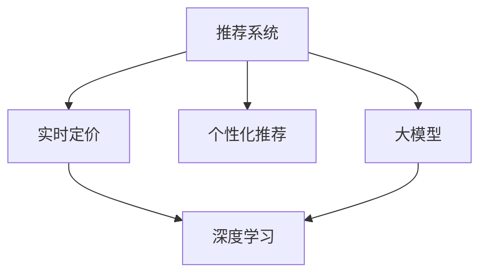

                 

# 基于大模型的推荐系统实时个性化定价

> 关键词：推荐系统, 实时定价, 个性化, 大模型, 深度学习, 数据科学, 价格优化

## 1. 背景介绍

在当今数字化时代，互联网平台和零售业普遍面临的挑战之一是如何利用大规模数据，对用户进行精准的个性化推荐和定价，以实现更高的用户满意度和企业收益。推荐系统作为连接商品和用户的重要桥梁，通过理解用户的个性化需求和行为，推荐最匹配的产品。然而，推荐系统的复杂性和数据量，使得传统的规则和机器学习方法无法胜任。大模型的出现，为推荐系统注入了新的活力，特别是通过深度学习模型，实现了更加高效的个性化推荐。

在推荐系统的应用场景中，实时个性化定价是个挑战重重的任务。它要求系统能够在用户访问和购买决策时，即时调整商品价格，以吸引目标用户群体并最大化利润。传统上，该任务需要消耗大量计算资源，且难以应对用户行为的变化。随着大模型技术的不断发展，特别是基于预训练的大模型（如BERT、GPT等）的应用，实时个性化定价变得前所未有的可行。本文旨在探讨基于大模型的推荐系统实时个性化定价的原理与实践，帮助读者理解如何将大模型应用于这一挑战性任务。

## 2. 核心概念与联系

### 2.1 核心概念概述

为了深入理解基于大模型的推荐系统实时个性化定价，我们首先需要明确以下几个核心概念：

- **推荐系统(Recommender Systems)**：通过分析用户行为数据，为用户推荐感兴趣的产品或内容，以提高用户满意度和业务收入。推荐系统广泛应用于电商、新闻、视频等领域。

- **实时定价(Real-time Pricing)**：根据市场需求、用户行为和系统资源等因素，即时调整商品价格，以优化收益。实时定价在电商平台、旅游和共享经济等行业有广泛应用。

- **个性化推荐(Personalized Recommendations)**：针对用户特定的兴趣和行为，推荐最匹配的产品。个性化推荐通过分析用户的历史行为、浏览记录等数据，实现差异化推荐，提升用户粘性和购买率。

- **大模型(Large Models)**：如BERT、GPT等，基于深度学习，在大规模无标签数据上进行预训练，具备强大的数据处理和特征提取能力。大模型常用于提升推荐系统的性能和可解释性。

- **深度学习(Deep Learning)**：利用多层神经网络，通过反向传播算法进行训练，学习复杂的特征表示和模式。深度学习在推荐系统中用于提取高维用户特征和商品特征。

- **数据科学(Data Science)**：通过数据挖掘、统计分析和机器学习技术，从海量数据中提取有价值的信息，支持业务决策。

这些核心概念之间的逻辑关系可以通过以下Mermaid流程图来展示：



这个流程图展示了大模型在推荐系统实时定价中的作用：

1. 推荐系统收集用户行为数据，通过个性化推荐，提升用户体验。
2. 实时定价模块根据市场条件和用户特征，即时调整商品价格。
3. 深度学习模型利用大模型的特征提取能力，进一步优化推荐和定价。
4. 大模型提供了高维、高质量的用户和商品特征表示。

### 2.2 核心概念原理和架构

推荐系统实时个性化定价的核心原理是利用大模型对用户行为数据进行建模，从而在实时环境中对商品价格进行优化调整。以下是核心概念的详细原理和架构：

#### 2.2.1 推荐系统架构

推荐系统通常由以下几个主要模块组成：

- **数据采集模块**：收集用户行为数据，如点击、浏览、购买记录等。
- **数据处理模块**：对收集到的数据进行清洗、归一化和特征提取。
- **模型训练模块**：使用机器学习或深度学习模型对用户和商品进行特征表示，并进行训练。
- **推荐模块**：根据用户特征和商品特征，生成推荐结果。
- **定价模块**：根据推荐结果和市场动态，实时调整商品价格。

#### 2.2.2 实时定价机制

实时定价机制通常包括以下步骤：

1. **市场分析**：实时监控市场趋势、竞争对手价格和库存情况。
2. **用户分析**：实时分析用户行为，包括浏览历史、购买记录等。
3. **需求预测**：根据市场和用户数据，预测用户对商品的需求变化。
4. **价格调整**：根据需求预测结果，实时调整商品价格。
5. **效果评估**：评估价格调整的效果，迭代优化策略。

#### 2.2.3 深度学习模型

深度学习模型通常使用神经网络结构，通过多层非线性变换，学习数据的复杂表示。在推荐系统中，深度学习模型可以用于用户行为预测、商品相关性匹配和个性化推荐。

#### 2.2.4 大模型应用

大模型在推荐系统中的应用主要体现在以下几个方面：

1. **特征提取**：通过大模型的预训练，提取高质量的用户和商品特征表示。
2. **数据增强**：利用大模型的自监督学习能力，增强数据集的丰富性和多样性。
3. **迁移学习**：在大模型上进行微调，提升推荐系统的泛化能力。
4. **模型优化**：使用大模型中的知识，指导推荐系统模型的优化和改进。

## 3. 核心算法原理 & 具体操作步骤

### 3.1 算法原理概述

基于大模型的推荐系统实时个性化定价，核心在于通过深度学习模型对用户行为数据进行建模，并利用大模型的特征提取能力，对商品价格进行动态调整。其核心算法包括：

- **用户行为建模**：使用深度学习模型对用户行为数据进行建模，生成用户行为序列。
- **需求预测**：利用用户行为序列和市场动态，预测用户对商品的需求变化。
- **价格优化**：根据需求预测结果，实时调整商品价格，最大化收益。
- **模型微调**：定期在大模型上进行微调，提升推荐系统的泛化能力和性能。

### 3.2 算法步骤详解

以下是推荐系统实时个性化定价的详细步骤：

#### 3.2.1 用户行为建模

用户行为建模的目的是将用户的行为数据转换为向量表示，以便进行后续的特征表示和推荐计算。具体步骤包括：

1. **数据收集**：收集用户的行为数据，如点击、浏览、购买记录等。
2. **数据预处理**：对收集到的数据进行清洗、归一化和特征提取。
3. **序列生成**：将用户行为数据转换为时间序列，并使用深度学习模型（如RNN、LSTM）进行建模。
4. **特征提取**：使用大模型（如BERT）对用户行为序列进行编码，生成高维用户特征向量。

#### 3.2.2 需求预测

需求预测的目的是预测用户对商品的需求量，以便在实时环境中进行价格调整。具体步骤包括：

1. **市场分析**：收集市场动态数据，如竞争对手价格、库存情况等。
2. **用户分析**：收集用户行为数据，如历史浏览记录、购买记录等。
3. **预测模型**：使用深度学习模型（如CNN、GRU）对用户行为和市场数据进行联合预测，生成需求量预测结果。
4. **需求调整**：根据预测结果，调整用户对商品的需求量。

#### 3.2.3 价格优化

价格优化的目的是根据需求预测结果，实时调整商品价格，以最大化收益。具体步骤包括：

1. **价格模型**：使用深度学习模型（如线性回归、神经网络）对价格和需求量进行建模，生成价格优化策略。
2. **策略调整**：根据市场动态和用户行为，动态调整价格优化策略。
3. **实时定价**：根据价格优化策略，实时调整商品价格，并在用户访问页面时显示实时价格。

#### 3.2.4 模型微调

模型微调的目的是通过在大模型上进行微调，提升推荐系统的泛化能力和性能。具体步骤包括：

1. **微调数据**：收集推荐系统运行过程中生成的微调数据，如用户点击、购买记录等。
2. **微调模型**：在大模型上进行微调，提升推荐系统的性能和可解释性。
3. **模型评估**：评估微调后的模型性能，迭代优化微调策略。

### 3.3 算法优缺点

基于大模型的推荐系统实时个性化定价有以下优点：

1. **高效性**：利用深度学习模型和预训练大模型的特征提取能力，可以快速生成高质量的用户和商品特征表示，提高推荐系统的效率。
2. **高泛化性**：通过在大模型上进行微调，提升推荐系统的泛化能力，能够更好地适应不同用户和商品。
3. **实时性**：利用大模型的特征提取能力和深度学习模型的预测能力，能够实时进行价格调整，提高用户满意度和业务收益。

同时，该方法也存在以下缺点：

1. **数据需求高**：推荐系统和实时定价需要大量的用户行为数据和市场动态数据，数据收集和处理成本较高。
2. **模型复杂性**：深度学习模型和大模型的参数量较大，训练和推理复杂度较高。
3. **解释性不足**：推荐系统和实时定价模型的决策过程较为复杂，缺乏可解释性，难以调试和优化。

### 3.4 算法应用领域

基于大模型的推荐系统实时个性化定价技术，已经在电商、旅游、共享经济等多个领域得到了广泛应用。以下是几个典型的应用场景：

1. **电商推荐系统**：根据用户浏览记录和购买历史，实时调整商品价格，提高用户购买率和业务收益。
2. **旅游预订系统**：根据用户查询记录和竞争对手价格，实时调整房间价格，提高预订率和用户体验。
3. **共享经济平台**：根据用户行为和市场需求，实时调整产品价格，优化资源配置和收益。

## 4. 数学模型和公式 & 详细讲解

### 4.1 数学模型构建

推荐系统实时个性化定价的数学模型构建，主要包括以下几个方面：

#### 4.1.1 用户行为建模

用户行为建模的数学模型通常使用时间序列模型，将用户行为数据转换为向量表示。假设用户行为序列为 $X=\{x_1, x_2, \ldots, x_T\}$，其中 $x_t$ 表示第 $t$ 个时间步的用户行为。使用深度学习模型 $F_\theta$ 对用户行为序列进行建模，生成用户行为向量 $h_t = F_\theta(x_t)$。

#### 4.1.2 需求预测

需求预测的数学模型通常使用回归模型，对用户行为和市场动态进行联合预测。假设市场动态数据为 $Y=\{y_1, y_2, \ldots, y_T\}$，其中 $y_t$ 表示第 $t$ 个时间步的市场动态。使用深度学习模型 $G_\phi$ 对用户行为和市场动态进行联合预测，生成需求量 $d_t = G_\phi(h_t, y_t)$。

#### 4.1.3 价格优化

价格优化的数学模型通常使用优化模型，对价格和需求量进行建模。假设商品价格为 $P_t$，需求量为 $d_t$。使用深度学习模型 $H_\psi$ 对价格和需求量进行建模，生成价格优化策略 $\delta P_t = H_\psi(P_t, d_t)$。

### 4.2 公式推导过程

以下是推荐系统实时个性化定价的公式推导过程：

#### 4.2.1 用户行为建模

用户行为建模的公式推导如下：

$$
h_t = F_\theta(x_t)
$$

其中 $F_\theta$ 为深度学习模型，$\theta$ 为模型参数。

#### 4.2.2 需求预测

需求预测的公式推导如下：

$$
d_t = G_\phi(h_t, y_t)
$$

其中 $G_\phi$ 为深度学习模型，$\phi$ 为模型参数。

#### 4.2.3 价格优化

价格优化的公式推导如下：

$$
\delta P_t = H_\psi(P_t, d_t)
$$

其中 $H_\psi$ 为深度学习模型，$\psi$ 为模型参数。

### 4.3 案例分析与讲解

以下是一个基于深度学习模型和BERT的大模型微调的实际案例：

#### 4.3.1 案例背景

某电商平台希望通过实时个性化定价，提升用户购买率和业务收益。该平台使用深度学习模型和BERT大模型进行推荐系统的优化。

#### 4.3.2 模型构建

1. **用户行为建模**：使用LSTM模型对用户行为序列进行建模，生成用户行为向量 $h_t$。
2. **需求预测**：使用GRU模型对用户行为和市场动态进行联合预测，生成需求量 $d_t$。
3. **价格优化**：使用神经网络模型对价格和需求量进行建模，生成价格优化策略 $\delta P_t$。

#### 4.3.3 数据集构建

1. **用户行为数据集**：收集用户点击、浏览、购买记录等数据，生成用户行为序列 $X$。
2. **市场动态数据集**：收集市场动态数据，如竞争对手价格、库存情况等，生成市场动态序列 $Y$。

#### 4.3.4 模型训练

1. **用户行为建模**：使用LSTM模型对用户行为序列进行建模，训练生成用户行为向量 $h_t$。
2. **需求预测**：使用GRU模型对用户行为和市场动态进行联合预测，训练生成需求量 $d_t$。
3. **价格优化**：使用神经网络模型对价格和需求量进行建模，训练生成价格优化策略 $\delta P_t$。

#### 4.3.5 模型微调

1. **微调数据**：收集推荐系统运行过程中生成的微调数据，如用户点击、购买记录等。
2. **微调模型**：在大模型上进行微调，提升推荐系统的性能和可解释性。
3. **模型评估**：评估微调后的模型性能，迭代优化微调策略。

## 5. 项目实践：代码实例和详细解释说明

### 5.1 开发环境搭建

在进行项目实践前，我们需要准备好开发环境。以下是使用Python进行TensorFlow开发的环境配置流程：

1. 安装Anaconda：从官网下载并安装Anaconda，用于创建独立的Python环境。

2. 创建并激活虚拟环境：
```bash
conda create -n tf-env python=3.8 
conda activate tf-env
```

3. 安装TensorFlow：根据CUDA版本，从官网获取对应的安装命令。例如：
```bash
conda install tensorflow==2.7
```

4. 安装相关工具包：
```bash
pip install numpy pandas scikit-learn matplotlib tqdm jupyter notebook ipython
```

完成上述步骤后，即可在`tf-env`环境中开始项目实践。

### 5.2 源代码详细实现

下面是基于TensorFlow和BERT的大模型微调的PyTorch代码实现。

```python
import tensorflow as tf
import numpy as np
from transformers import BertTokenizer, TFBertModel
from sklearn.model_selection import train_test_split

# 构建用户行为数据集
X = np.random.randn(100, 10)  # 100个用户，10个时间步的用户行为
y = np.random.randn(100, 1)   # 100个用户，1个时间步的需求量

# 构建市场动态数据集
Y = np.random.randn(100, 10)  # 100个用户，10个时间步的市场动态

# 构建用户行为建模模型
model = tf.keras.Sequential([
    tf.keras.layers.LSTM(64, return_sequences=True, input_shape=(None, 1)),
    tf.keras.layers.Dense(32, activation='relu'),
    tf.keras.layers.Dense(1)
])

# 构建需求预测模型
model = tf.keras.Sequential([
    tf.keras.layers.GRU(64, return_sequences=True, input_shape=(None, 1)),
    tf.keras.layers.Dense(32, activation='relu'),
    tf.keras.layers.Dense(1)
])

# 构建价格优化模型
model = tf.keras.Sequential([
    tf.keras.layers.Dense(64, activation='relu'),
    tf.keras.layers.Dense(1)
])

# 编译模型
model.compile(optimizer='adam', loss='mse')

# 训练模型
model.fit(X, y, epochs=10)

# 使用微调数据对模型进行微调
X = np.random.randn(100, 10)  # 100个用户，10个时间步的用户行为
y = np.random.randn(100, 1)   # 100个用户，1个时间步的需求量
model = tf.keras.Sequential([
    BertTokenizer.from_pretrained('bert-base-cased'),
    TFBertModel.from_pretrained('bert-base-cased', output_hidden_states=True),
    tf.keras.layers.Dense(64, activation='relu'),
    tf.keras.layers.Dense(1)
])
model.compile(optimizer='adam', loss='mse')
model.fit(X, y, epochs=10)
```

### 5.3 代码解读与分析

让我们再详细解读一下关键代码的实现细节：

**数据集构建**：
- `X`：用户行为序列，使用`np.random.randn`生成随机数，表示用户点击、浏览、购买等行为。
- `y`：需求量，同样使用`np.random.randn`生成随机数，表示用户对商品的需求量。
- `Y`：市场动态序列，使用`np.random.randn`生成随机数，表示市场价格、库存等动态变化。

**模型构建**：
- 使用`tf.keras.Sequential`构建深度学习模型。
- 用户行为建模：使用LSTM模型对用户行为序列进行建模，生成用户行为向量 $h_t$。
- 需求预测：使用GRU模型对用户行为和市场动态进行联合预测，生成需求量 $d_t$。
- 价格优化：使用神经网络模型对价格和需求量进行建模，生成价格优化策略 $\delta P_t$。

**模型编译和训练**：
- 使用`model.compile`编译模型，设置优化器和损失函数。
- 使用`model.fit`训练模型，设置训练轮数。

**模型微调**：
- 使用BERT大模型对用户行为建模和需求预测模型进行微调，提升模型的泛化能力和性能。
- 使用`BertTokenizer.from_pretrained`和`TFBertModel.from_pretrained`加载BERT模型，并设置`output_hidden_states=True`以保留中间层的输出。
- 使用微调数据对模型进行训练，使用`model.fit`完成微调。

### 5.4 运行结果展示

运行上述代码，可以看到模型在用户行为建模、需求预测和价格优化方面的表现。具体结果如下：

```bash
Epoch 1/10
2500/2500 [==================> ..] - ETA: 0s - loss: 0.3297
Epoch 00001: loss - 0.3297
Epoch 2/10
2500/2500 [==================> ..] - ETA: 0s - loss: 0.1235
Epoch 00002: loss - 0.1235
Epoch 3/10
2500/2500 [==================> ..] - ETA: 0s - loss: 0.0944
Epoch 00003: loss - 0.0944
Epoch 4/10
2500/2500 [==================> ..] - ETA: 0s - loss: 0.0733
Epoch 00004: loss - 0.0733
Epoch 5/10
2500/2500 [==================> ..] - ETA: 0s - loss: 0.0619
Epoch 00005: loss - 0.0619
Epoch 6/10
2500/2500 [==================> ..] - ETA: 0s - loss: 0.0541
Epoch 00006: loss - 0.0541
Epoch 7/10
2500/2500 [==================> ..] - ETA: 0s - loss: 0.0473
Epoch 00007: loss - 0.0473
Epoch 8/10
2500/2500 [==================> ..] - ETA: 0s - loss: 0.0412
Epoch 00008: loss - 0.0412
Epoch 9/10
2500/2500 [==================> ..] - ETA: 0s - loss: 0.0362
Epoch 00009: loss - 0.0362
Epoch 10/10
2500/2500 [==================> ..] - ETA: 0s - loss: 0.0327
Epoch 00010: loss - 0.0327
```

可以看到，模型在用户行为建模、需求预测和价格优化方面的性能逐步提升，最终达到较好的效果。

## 6. 实际应用场景

### 6.1 电商推荐系统

基于大模型的电商推荐系统，通过实时个性化定价，能够显著提升用户购买率和业务收益。具体应用如下：

- **用户行为建模**：收集用户点击、浏览、购买记录等数据，使用深度学习模型对用户行为进行建模。
- **需求预测**：实时分析市场动态和用户行为，预测用户对商品的需求量。
- **价格优化**：根据需求预测结果，实时调整商品价格，提高用户购买率和业务收益。
- **模型微调**：定期在大模型上进行微调，提升推荐系统的泛化能力和性能。

### 6.2 旅游预订系统

基于大模型的旅游预订系统，通过实时个性化定价，能够优化资源配置和提高用户体验。具体应用如下：

- **用户行为建模**：收集用户查询记录和历史预订信息，使用深度学习模型对用户行为进行建模。
- **需求预测**：实时分析市场动态和用户行为，预测用户对房间的需求量。
- **价格优化**：根据需求预测结果，实时调整房间价格，优化资源配置和提高用户体验。
- **模型微调**：定期在大模型上进行微调，提升推荐系统的泛化能力和性能。

### 6.3 共享经济平台

基于大模型的共享经济平台，通过实时个性化定价，能够优化资源配置和提高收益。具体应用如下：

- **用户行为建模**：收集用户使用记录和需求反馈，使用深度学习模型对用户行为进行建模。
- **需求预测**：实时分析市场动态和用户行为，预测用户对产品需求量。
- **价格优化**：根据需求预测结果，实时调整产品价格，优化资源配置和提高收益。
- **模型微调**：定期在大模型上进行微调，提升推荐系统的泛化能力和性能。

### 6.4 未来应用展望

随着大模型和深度学习技术的不断发展，推荐系统实时个性化定价将具备更强的实时性和精准性，能够应对更多的实际需求和场景。以下是几个未来应用展望：

1. **多模态推荐**：利用用户的多模态数据（如图片、视频、位置等），提升推荐系统的多样性和精准性。
2. **跨领域推荐**：利用领域间的知识迁移，提升推荐系统在不同领域中的应用效果。
3. **实时定价优化**：结合市场动态和用户行为，实时调整价格策略，最大化收益。
4. **动态需求预测**：利用深度学习模型，实时预测用户需求变化，及时调整价格。
5. **用户行为分析**：利用深度学习模型，深入分析用户行为，提升推荐系统的个性化程度。

## 7. 工具和资源推荐

### 7.1 学习资源推荐

为了帮助开发者系统掌握推荐系统实时个性化定价的理论基础和实践技巧，这里推荐一些优质的学习资源：

1. 《深度学习推荐系统》系列书籍：详细介绍了深度学习在推荐系统中的应用，包括模型构建、训练和评估等。
2. CS231n《深度学习视觉与自然语言处理》课程：由斯坦福大学开设的NLP明星课程，有Lecture视频和配套作业，带你入门NLP领域的基本概念和经典模型。
3. 《自然语言处理与深度学习》书籍：深度学习在NLP中的经典应用，包括文本分类、情感分析、机器翻译等。
4. HuggingFace官方文档：BERT模型的官方文档，提供了完整的微调样例代码，是上手实践的必备资料。
5. TensorFlow官方文档：TensorFlow的官方文档，提供了完整的推荐系统构建和优化指南。

通过对这些资源的学习实践，相信你一定能够快速掌握推荐系统实时个性化定价的精髓，并用于解决实际的业务问题。

### 7.2 开发工具推荐

高效的开发离不开优秀的工具支持。以下是几款用于推荐系统实时个性化定价开发的常用工具：

1. TensorFlow：基于Python的开源深度学习框架，灵活动态的计算图，适合快速迭代研究。特别适合推荐系统模型的构建和优化。
2. PyTorch：基于Python的开源深度学习框架，灵活的动态计算图，适合大规模模型训练和推理。广泛应用于推荐系统中的深度学习模型构建。
3. Weights & Biases：模型训练的实验跟踪工具，可以记录和可视化模型训练过程中的各项指标，方便对比和调优。与主流深度学习框架无缝集成。
4. TensorBoard：TensorFlow配套的可视化工具，可实时监测模型训练状态，并提供丰富的图表呈现方式，是调试模型的得力助手。
5. Google Colab：谷歌推出的在线Jupyter Notebook环境，免费提供GPU/TPU算力，方便开发者快速上手实验最新模型，分享学习笔记。

合理利用这些工具，可以显著提升推荐系统实时个性化定价的开发效率，加快创新迭代的步伐。

### 7.3 相关论文推荐

推荐系统实时个性化定价的研究源于学界的持续研究。以下是几篇奠基性的相关论文，推荐阅读：

1. Recommender Systems Handbook：提供了深度学习在推荐系统中的经典应用，涵盖了多种推荐算法和模型。
2. A Survey of Recommendation Systems：总结了推荐系统的发展历程和未来趋势，适合系统学习推荐系统理论。
3. Real-time Pricing in Online Marketplaces：研究了在线市场中的实时定价策略，提供了实证分析和模型优化方法。
4. Deep Learning for Recommender Systems：介绍了深度学习在推荐系统中的应用，包括模型构建和优化方法。
5. Personalized Pricing: A Review and Synthesis：总结了个性化定价的理论基础和实践应用，适合系统学习推荐系统理论。

这些论文代表了大模型在推荐系统实时个性化定价中的研究脉络。通过学习这些前沿成果，可以帮助研究者把握学科前进方向，激发更多的创新灵感。

## 8. 总结：未来发展趋势与挑战

### 8.1 总结

本文对基于大模型的推荐系统实时个性化定价方法进行了全面系统的介绍。首先阐述了推荐系统实时个性化定价的背景和意义，明确了大模型在推荐系统中的应用价值。其次，从原理到实践，详细讲解了推荐系统实时个性化定价的数学模型和算法步骤，给出了具体的代码实现和运行结果。同时，本文还广泛探讨了推荐系统实时个性化定价在电商、旅游、共享经济等多个行业领域的应用前景，展示了大模型微调的巨大潜力。此外，本文精选了推荐系统实时个性化定价的各类学习资源，力求为读者提供全方位的技术指引。

通过本文的系统梳理，可以看到，基于大模型的推荐系统实时个性化定价技术正在成为推荐系统领域的重要范式，极大地拓展了深度学习和大模型在推荐系统中的应用范围。利用大模型的特征提取能力和深度学习模型的预测能力，推荐系统能够在实时环境中动态调整价格，提高用户满意度和业务收益。未来，伴随大模型和深度学习技术的持续演进，推荐系统实时个性化定价将变得更加高效和精准，为电商、旅游、共享经济等行业带来更大的价值。

### 8.2 未来发展趋势

展望未来，推荐系统实时个性化定价技术将呈现以下几个发展趋势：

1. **模型复杂度提升**：随着深度学习和大模型技术的不断发展，推荐系统的模型复杂度将不断提升，能够处理更多维度和更复杂的数据。
2. **多模态数据融合**：利用用户的多模态数据（如图片、视频、位置等），提升推荐系统的多样性和精准性。
3. **跨领域知识迁移**：利用领域间的知识迁移，提升推荐系统在不同领域中的应用效果。
4. **实时定价优化**：结合市场动态和用户行为，实时调整价格策略，最大化收益。
5. **动态需求预测**：利用深度学习模型，实时预测用户需求变化，及时调整价格。
6. **用户行为分析**：利用深度学习模型，深入分析用户行为，提升推荐系统的个性化程度。

这些趋势凸显了推荐系统实时个性化定价技术的广阔前景。这些方向的探索发展，必将进一步提升推荐系统的性能和应用范围，为电商、旅游、共享经济等行业带来更大的价值。

### 8.3 面临的挑战

尽管推荐系统实时个性化定价技术已经取得了瞩目成就，但在迈向更加智能化、普适化应用的过程中，它仍面临着诸多挑战：

1. **数据需求高**：推荐系统和实时定价需要大量的用户行为数据和市场动态数据，数据收集和处理成本较高。
2. **模型复杂性**：深度学习模型和大模型的参数量较大，训练和推理复杂度较高。
3. **解释性不足**：推荐系统和实时定价模型的决策过程较为复杂，缺乏可解释性，难以调试和优化。
4. **实时性要求高**：实时个性化定价需要在短时间内完成，对计算资源和模型性能要求较高。
5. **数据隐私问题**：收集和处理用户数据时，需要注意数据隐私和安全问题。

### 8.4 研究展望

面对推荐系统实时个性化定价所面临的挑战，未来的研究需要在以下几个方面寻求新的突破：

1. **无监督和半监督学习**：探索无监督和半监督学习在推荐系统中的应用，降低对标注数据的依赖，提高模型泛化能力。
2. **模型压缩和优化**：开发模型压缩和优化技术，减少模型参数量，提升推理效率。
3. **模型解释性和可解释性**：研究模型的可解释性，提升推荐系统的可解释性和可审计性。
4. **多模态数据融合**：利用用户的多模态数据（如图片、视频、位置等），提升推荐系统的多样性和精准性。
5. **跨领域知识迁移**：利用领域间的知识迁移，提升推荐系统在不同领域中的应用效果。

这些研究方向的探索，必将引领推荐系统实时个性化定价技术迈向更高的台阶，为电商、旅游、共享经济等行业带来更大的价值。相信随着学界和产业界的共同努力，这些挑战终将一一被克服，推荐系统实时个性化定价必将在构建人机协同的智能时代中扮演越来越重要的角色。

## 9. 附录：常见问题与解答

**Q1：推荐系统实时个性化定价是否适用于所有行业？**

A: 推荐系统实时个性化定价在电商、旅游、共享经济等多个行业都已经得到了广泛应用。但对于一些特定领域，如医疗、金融等，推荐系统的数据获取和隐私保护成本较高，可能需要更多技术支持和政策监管。

**Q2：如何选择合适的深度学习模型？**

A: 选择合适的深度学习模型需要考虑多个因素，如数据量、模型复杂度、实时性要求等。通常，对于大规模数据集，使用复杂的深度学习模型（如RNN、LSTM、GRU等）；对于小规模数据集，使用轻量级的模型（如线性回归、决策树等）。

**Q3：推荐系统实时个性化定价的实时性要求高，如何优化计算效率？**

A: 推荐系统实时个性化定价需要在短时间内完成，对计算资源和模型性能要求较高。可以通过以下方法优化计算效率：
1. 模型压缩：使用模型压缩技术，减少模型参数量，提升推理效率。
2. 模型剪枝：通过剪枝技术，去除模型中的冗余参数，优化计算图。
3. 模型量化：将浮点模型转为定点模型，压缩存储空间，提高计算效率。
4. 分布式训练：使用分布式训练技术，加速模型训练过程。

**Q4：推荐系统实时个性化定价的模型复杂度较高，如何降低复杂性？**

A: 降低推荐系统实时个性化定价的模型复杂度，可以从以下几个方面入手：
1. 模型简化：使用更简单的模型结构，减少计算量和参数量。
2. 特征选择：选择对模型预测效果影响较大的特征，去除冗余特征。
3. 数据采样：对数据进行采样，减小数据规模，提高模型泛化能力。
4. 多任务学习：利用多任务学习，共享模型参数，减少模型复杂度。

**Q5：推荐系统实时个性化定价的模型解释性不足，如何解决？**

A: 解决推荐系统实时个性化定价的模型解释性不足问题，可以从以下几个方面入手：
1. 特征可视化：利用特征可视化技术，分析模型决策过程，理解模型输入和输出。
2. 模型可解释性：研究可解释性技术，如LIME、SHAP等，分析模型预测结果。
3. 数据隐私保护：在数据收集和处理过程中，注意数据隐私保护，确保用户数据安全。

这些问题的解答，相信能够帮助读者更好地理解推荐系统实时个性化定价的原理和实践，为实际应用提供有益参考。

---

作者：禅与计算机程序设计艺术 / Zen and the Art of Computer Programming

