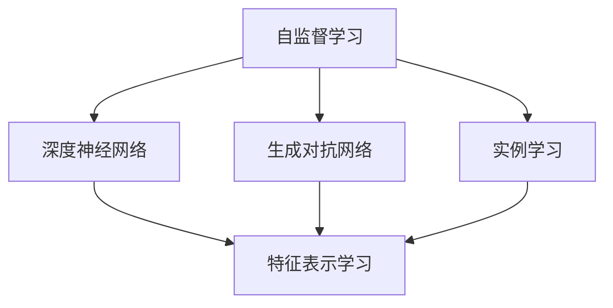

                 

# 基于自监督学习的商品特征表示学习

> 关键词：自监督学习,商品特征表示,深度神经网络,生成对抗网络,实例学习

## 1. 背景介绍

在当前电子商务时代，商品特征表示学习（Feature Representation Learning）是推荐系统、搜索引擎等应用的重要基础。特征表示的准确性直接影响用户体验和推荐效果。传统的手工特征提取方法依赖领域知识，难以自动化处理海量数据。深度学习中的神经网络（Neural Network, NN）在图像、语音、文本等领域取得了巨大成功，并被逐渐应用于商品特征表示学习中。然而，深度学习模型通常需要大量标注数据，难以适应大规模商品数据集。

为了应对这一挑战，自监督学习（Self-Supervised Learning）应运而生。自监督学习是一种无需标注数据的机器学习范式，通过利用数据的潜在结构信息进行训练，学习出对下游任务有用的特征表示。相比于传统有监督学习（Supervised Learning），自监督学习能够显著降低标注成本，提高模型的泛化能力和鲁棒性。

本文将详细介绍基于自监督学习的商品特征表示学习方法，并结合实际应用场景，探讨其原理和应用效果。

## 2. 核心概念与联系

### 2.1 核心概念概述

为便于理解自监督学习在商品特征表示中的应用，首先需要介绍几个关键概念：

- **自监督学习**：利用数据的潜在结构信息（如对比学习、生成模型等）进行训练，无需显式标注数据的机器学习方法。其核心在于发现数据的内在规律，从而推导出对于下游任务有用的特征表示。

- **商品特征表示学习**：通过学习商品的多种属性特征，构建低维向量表示，用于推荐系统、搜索引擎等应用。特征表示的优劣直接影响应用的推荐效果。

- **深度神经网络**：包含多个隐藏层的神经网络模型，具有强大的非线性映射能力。在商品特征表示学习中，通常使用卷积神经网络（Convolutional Neural Network, CNN）、多层感知器（Multi-Layer Perceptron, MLP）等结构。

- **生成对抗网络**：由生成器和判别器两个网络组成的对抗训练模型。生成器尝试生成尽可能逼真的假样本，而判别器则尽可能区分真样本和假样本。该模型能够通过对抗训练提升特征表示质量。

- **实例学习**：通过观察真实世界中相似实例的相似性关系，学习特征表示的一种方法。与对比学习相比，实例学习在理解真实世界的属性关系方面具有天然优势。

这些概念之间存在着紧密的联系。自监督学习为无标注数据的特征表示学习提供了可能，深度神经网络为特征学习提供了强大的建模能力，生成对抗网络为特征表示提供了额外的训练动力，实例学习则进一步增强了特征表示的语义理解能力。通过这些关键技术的有机结合，自监督学习在商品特征表示中发挥着重要作用。

### 2.2 核心概念原理和架构的 Mermaid 流程图



此流程图展示了自监督学习中各个概念之间的逻辑关系。自监督学习通过深度神经网络进行特征表示学习，生成对抗网络和实例学习则为其提供额外的训练动力和语义理解能力，共同推动特征表示的质量提升。

## 3. 核心算法原理 & 具体操作步骤

### 3.1 算法原理概述

基于自监督学习的商品特征表示学习，旨在通过无标注数据学习商品的多维特征表示，并用于推荐系统、搜索引擎等应用。其核心思想是：通过自监督学习任务发现数据的内在规律，进而学习出对下游任务有用的特征表示。常用的自监督学习任务包括：

- 生成式任务（Generative Tasks）：如自回归（Autoregressive, AR）、变分自编码器（Variational Autoencoder, VAE）等，通过生成逼真数据样本学习特征表示。
- 对比式任务（Contrastive Tasks）：如对比学习（Contrastive Learning）、Triplet Loss等，通过学习相似实例间的相似性关系学习特征表示。
- 实例式任务（Illustrative Tasks）：如实例学习（Illustrative Learning）、掩码语言模型（Masked Language Model, MLM）等，通过观察真实世界的相似实例关系学习特征表示。

### 3.2 算法步骤详解

基于自监督学习的商品特征表示学习通常包括以下关键步骤：

**Step 1: 数据准备**
- 收集商品的高维特征向量，如价格、描述、评分等。
- 将高维特征向量作为神经网络的输入。

**Step 2: 设计自监督学习任务**
- 选择适当的自监督学习任务，如生成式任务、对比式任务或实例式任务。
- 设计损失函数和优化器，用于训练神经网络。

**Step 3: 模型训练**
- 使用无标注数据训练神经网络，学习出特征表示。
- 在训练过程中，不断调整模型的超参数，以提高特征表示的质量。

**Step 4: 特征评估**
- 在测试集上评估特征表示的质量。
- 使用下游任务的指标（如精度、召回率、均方误差等）进行评估。

**Step 5: 应用特征表示**
- 将训练好的特征表示用于推荐系统、搜索引擎等应用。
- 结合其他特征信息，构建综合推荐模型。

### 3.3 算法优缺点

基于自监督学习的商品特征表示学习具有以下优点：
1. **无需标注数据**：自监督学习方法能够显著降低标注成本，适用于大规模商品数据集。
2. **泛化能力强**：通过学习数据的潜在结构信息，自监督学习能够生成具有较强泛化能力的特征表示。
3. **鲁棒性好**：自监督学习模型对数据扰动和噪声具有较强的鲁棒性，不容易过拟合。

然而，该方法也存在一些缺点：
1. **训练复杂度高**：自监督学习需要设计适当的自监督学习任务，设计复杂且难以优化。
2. **特征解释性差**：自监督学习模型通常是"黑盒"模型，难以解释其内部特征表示的含义。
3. **计算资源需求高**：自监督学习模型通常需要较大的计算资源，训练时间长。

尽管如此，自监督学习在商品特征表示学习中的应用仍显示出巨大潜力，尤其是在标注数据稀缺的情况下，其价值愈发明显。

### 3.4 算法应用领域

基于自监督学习的商品特征表示学习在多个领域具有广泛的应用：

- **推荐系统**：用于商品推荐、用户推荐、广告推荐等。通过学习商品的特征表示，构建推荐模型，提高推荐效果。
- **搜索引擎**：用于商品查询、用户搜索等。通过学习商品的特征表示，优化搜索结果，提升用户体验。
- **图像识别**：用于商品分类、标签识别等。通过学习商品的特征表示，提升图像识别模型的性能。
- **语音识别**：用于商品语音搜索等。通过学习商品的特征表示，优化语音识别模型的准确性。
- **自然语言处理**：用于商品描述生成、情感分析等。通过学习商品的特征表示，提升自然语言处理模型的性能。

## 4. 数学模型和公式 & 详细讲解

### 4.1 数学模型构建

假设商品的原始特征表示为 $\mathbf{x} \in \mathbb{R}^d$，其中 $d$ 为特征维度。自监督学习模型的目标是通过训练学习出特征表示 $\mathbf{z} \in \mathbb{R}^k$，其中 $k$ 为特征表示的维度，通常 $k$ 远小于 $d$。自监督学习模型的数学模型可以表示为：

$$
\mathcal{L}(\theta) = \frac{1}{N} \sum_{i=1}^N \ell(z_i, x_i)
$$

其中，$\ell$ 为损失函数，$\theta$ 为模型参数，$z_i$ 为第 $i$ 个样本的特征表示，$x_i$ 为原始特征向量。在训练过程中，模型参数 $\theta$ 通过最小化损失函数 $\mathcal{L}$ 进行优化。

### 4.2 公式推导过程

以下以自回归生成模型（AutoRegressive Generative Model）为例，推导其特征表示学习的数学公式。

假设商品特征向量 $\mathbf{x}$ 包含 $n$ 个特征 $x_1, x_2, ..., x_n$。自回归生成模型的目标是通过学习特征表示 $\mathbf{z}$，生成与 $\mathbf{x}$ 相同的向量。模型假设特征向量 $\mathbf{x}$ 的每个元素 $x_i$ 均由前 $i-1$ 个元素 $x_1, x_2, ..., x_{i-1}$ 和特征表示 $\mathbf{z}$ 共同生成，即：

$$
x_i = f(x_{i-1}, x_{i-2}, ..., x_1, z_i)
$$

其中 $f$ 为生成函数，$z_i$ 为特征表示。模型需要学习生成函数 $f$ 和特征表示 $z_i$，使得生成的特征向量 $\mathbf{x'}$ 与原始特征向量 $\mathbf{x}$ 尽可能接近。

假设生成函数 $f$ 和特征表示 $z_i$ 分别为神经网络和神经网络中的权重矩阵，可以表示为：

$$
f(\mathbf{z}, \mathbf{x}_{i-1:i}) = \sigma(\mathbf{W}_z \mathbf{z} + \mathbf{W}_x \mathbf{x}_{i-1:i})
$$

其中 $\sigma$ 为激活函数，$\mathbf{W}_z$ 和 $\mathbf{W}_x$ 分别为神经网络的权重矩阵。

模型的损失函数可以表示为：

$$
\ell(z_i, x_i) = \frac{1}{2} || x_i - f(\mathbf{z}, \mathbf{x}_{i-1:i}) ||^2
$$

在训练过程中，模型参数 $\theta$ 通过最小化损失函数 $\mathcal{L}$ 进行优化：

$$
\theta^* = \mathop{\arg\min}_{\theta} \mathcal{L}(\theta)
$$

通过对自回归生成模型的训练，可以学习出高质量的商品特征表示。

### 4.3 案例分析与讲解

以Amazon商品分类为例，说明自监督学习在商品分类任务中的应用。

**数据准备**
- 收集Amazon商品的高维特征向量，包括价格、描述、评分等。
- 将高维特征向量作为神经网络的输入。

**设计自监督学习任务**
- 使用自回归生成模型作为自监督学习任务。
- 设计损失函数和优化器，如均方误差损失（Mean Squared Error, MSE）和Adam优化器。

**模型训练**
- 使用无标注数据训练神经网络，学习出特征表示 $\mathbf{z}$。
- 在训练过程中，不断调整模型的超参数，如神经网络的层数、激活函数、学习率等。

**特征评估**
- 在测试集上评估特征表示的质量。
- 使用准确率（Accuracy）、召回率（Recall）等指标进行评估。

**应用特征表示**
- 将训练好的特征表示用于商品分类任务。
- 结合其他特征信息，构建综合分类模型。

## 5. 项目实践：代码实例和详细解释说明

### 5.1 开发环境搭建

在进行项目实践前，首先需要搭建好开发环境。以下是Python开发环境的搭建步骤：

1. 安装Anaconda：从官网下载并安装Anaconda，用于创建独立的Python环境。
2. 创建并激活虚拟环境：
```bash
conda create -n nn-env python=3.8 
conda activate nn-env
```
3. 安装必要的Python包：
```bash
pip install numpy scipy matplotlib scikit-learn tensorflow
```

完成上述步骤后，即可在 `nn-env` 环境中进行项目实践。

### 5.2 源代码详细实现

我们以生成对抗网络（Generative Adversarial Network, GAN）为例，展示商品特征表示学习的代码实现。

**代码示例**

```python
import tensorflow as tf
import numpy as np
from tensorflow.keras.layers import Dense, Reshape, Flatten, Input
from tensorflow.keras.models import Model

# 生成器
def generator(z_dim, feature_dim):
    input_layer = Input(shape=(z_dim,))
    dense_layer = Dense(64, activation='relu')(input_layer)
    dense_layer = Dense(feature_dim, activation='sigmoid')(dense_layer)
    return Model(input_layer, dense_layer)

# 判别器
def discriminator(feature_dim):
    input_layer = Input(shape=(feature_dim,))
    dense_layer = Dense(64, activation='relu')(input_layer)
    dense_layer = Dense(1, activation='sigmoid')(dense_layer)
    return Model(input_layer, dense_layer)

# 定义生成器、判别器
z_dim = 10  # 特征表示维度
feature_dim = 20  # 原始特征维度
generator = generator(z_dim, feature_dim)
discriminator = discriminator(feature_dim)

# 联合模型
joint_model = Model([generator.input, discriminator.input], discriminator.output)
joint_model.compile(optimizer=tf.keras.optimizers.Adam(learning_rate=0.0002),
                    loss='binary_crossentropy',
                    metrics=['accuracy'])

# 训练过程
batch_size = 64
epochs = 100
latent_dim = 10
for epoch in range(epochs):
    for _ in range(epochs // 2):
        noise = np.random.normal(0, 1, (batch_size, latent_dim))
        fake = generator.predict(noise)
        labels = np.ones((batch_size, 1))
        joint_model.train_on_batch([noise, fake], labels)
    
    for _ in range(epochs // 2):
        fake = generator.predict(noise)
        labels = np.zeros((batch_size, 1))
        joint_model.train_on_batch([noise, fake], labels)
```

**代码解释**

1. 定义生成器：使用Dense层构建生成器，将随机噪声 $\mathbf{z}$ 映射到商品特征表示 $\mathbf{x}$。
2. 定义判别器：使用Dense层构建判别器，对商品特征表示 $\mathbf{x}$ 进行二分类判别。
3. 联合模型：将生成器和判别器组成联合模型，并使用Adam优化器进行训练。
4. 训练过程：随机生成噪声 $\mathbf{z}$，将其输入生成器得到商品特征表示 $\mathbf{x}$，使用联合模型进行对抗训练，优化生成器和判别器。

### 5.3 代码解读与分析

通过上述代码示例，可以看到生成对抗网络在商品特征表示学习中的应用。生成器将随机噪声 $\mathbf{z}$ 映射到商品特征表示 $\mathbf{x}$，判别器对 $\mathbf{x}$ 进行二分类判别，联合模型通过对抗训练优化生成器和判别器。

在训练过程中，生成器尝试生成逼真的商品特征表示，而判别器则尽可能区分真实和生成的商品特征表示。通过不断的对抗训练，生成器和判别器不断提升生成质量和判别能力，最终生成出高质量的商品特征表示。

## 6. 实际应用场景

### 6.1 智能推荐系统

基于自监督学习的商品特征表示，可以应用于智能推荐系统的构建。传统推荐系统依赖手工提取的特征，难以自动化处理大规模商品数据。使用自监督学习可以学习出高质量的商品特征表示，结合用户行为数据构建推荐模型，提升推荐效果。

在实践中，可以收集用户的浏览、购买、评分等行为数据，并构建无标注数据集。使用自监督学习任务如自回归生成模型，训练神经网络学习商品特征表示。微调后的模型可以结合用户行为数据，构建推荐模型，提升推荐效果。

### 6.2 搜索引擎

搜索引擎需要处理海量商品数据，并对用户查询进行快速匹配。基于自监督学习的商品特征表示，可以提升搜索匹配的准确性和效率。

在实践中，可以使用自监督学习任务如对比学习，训练神经网络学习商品特征表示。使用训练好的模型对商品进行特征编码，并将编码结果作为查询向量的输入，进行快速匹配。

### 6.3 图像识别

图像识别需要从图像中提取特征，并匹配商品类别。基于自监督学习的商品特征表示，可以提升图像识别的准确性和鲁棒性。

在实践中，可以使用自监督学习任务如掩码语言模型，训练神经网络学习商品特征表示。使用训练好的模型对商品图片进行特征编码，并将其作为图像识别的输入，进行快速匹配。

### 6.4 未来应用展望

随着自监督学习技术的不断进步，商品特征表示将在更多领域得到应用，为推荐系统、搜索引擎等应用带来变革性影响。

在智慧医疗领域，基于自监督学习的商品特征表示，可以应用于疾病诊断、药物推荐等任务。使用自监督学习任务如自回归生成模型，训练神经网络学习疾病特征表示，提升诊断和推荐的准确性。

在智能教育领域，基于自监督学习的商品特征表示，可以应用于个性化学习推荐、作业自动批改等任务。使用自监督学习任务如掩码语言模型，训练神经网络学习课程特征表示，提升学习推荐和作业批改的准确性。

在智能城市治理中，基于自监督学习的商品特征表示，可以应用于智慧交通、智慧旅游等任务。使用自监督学习任务如实例学习，训练神经网络学习城市数据特征表示，提升智慧城市管理的效率和精度。

此外，在企业生产、社会治理、文娱传媒等众多领域，基于自监督学习的商品特征表示也将不断涌现，为NLP技术带来新的突破。相信随着技术的日益成熟，自监督学习必将在构建人机协同的智能时代中扮演越来越重要的角色。

## 7. 工具和资源推荐

### 7.1 学习资源推荐

为了帮助开发者系统掌握自监督学习在商品特征表示中的应用，这里推荐一些优质的学习资源：

1. 《深度学习入门：基于Python的理论与实现》：全面介绍深度学习的基本概念和实现方法，包括自监督学习的详细介绍。
2. CS231n《卷积神经网络》课程：斯坦福大学开设的计算机视觉课程，涵盖自监督学习的经典应用，如自回归生成模型。
3. 《Python深度学习》：深入介绍深度学习在图像、文本、语音等领域的应用，包括自监督学习的详细介绍。
4. arXiv上自监督学习相关论文：包括自回归生成模型、对比学习、实例学习等，是深入学习自监督学习的必备资源。
5. HuggingFace官方文档：包含多个自监督学习模型的代码实现，是实践自监督学习任务的重要参考资料。

通过对这些资源的学习实践，相信你一定能够快速掌握自监督学习在商品特征表示中的应用，并用于解决实际的推荐系统问题。

### 7.2 开发工具推荐

高效的开发离不开优秀的工具支持。以下是几款用于自监督学习开发的常用工具：

1. TensorFlow：由Google主导开发的开源深度学习框架，生产部署方便，适合大规模工程应用。
2. PyTorch：基于Python的开源深度学习框架，灵活动态的计算图，适合快速迭代研究。
3. Keras：基于Python的深度学习框架，提供了简单易用的API，适合初学者使用。
4. Weights & Biases：模型训练的实验跟踪工具，可以记录和可视化模型训练过程中的各项指标，方便对比和调优。
5. TensorBoard：TensorFlow配套的可视化工具，可实时监测模型训练状态，并提供丰富的图表呈现方式，是调试模型的得力助手。

合理利用这些工具，可以显著提升自监督学习任务的开发效率，加快创新迭代的步伐。

### 7.3 相关论文推荐

自监督学习在商品特征表示中的应用源于学界的持续研究。以下是几篇奠基性的相关论文，推荐阅读：

1. Self-Supervised Learning with Data-Efficient Augmentation（自监督学习与数据高效增强）：提出数据增强方法，通过修改图像的方式提升自监督学习模型的性能。
2. The Anatomy of a Large-Scale Self-Supervised Learning System（大规模自监督学习系统的解剖）：介绍Facebook开发的大规模自监督学习系统，包括自回归生成模型、对比学习等。
3. Mixup: A Simple Data Augmentation Method（Mixup：一种简单的数据增强方法）：提出Mixup方法，通过混合样本提升自监督学习模型的泛化能力。
4. SimCLR: A Simple Framework for Consistent Self-Supervised Learning at Scale（SimCLR：一种适用于大规模自监督学习的简单框架）：提出SimCLR方法，通过对比学习提升自监督学习模型的性能。
5. Self-Supervised Learning in Reinforcement Learning（强化学习中的自监督学习）：探索自监督学习在强化学习中的应用，通过对比学习提升模型性能。

这些论文代表了大规模自监督学习的发展脉络。通过学习这些前沿成果，可以帮助研究者把握学科前进方向，激发更多的创新灵感。

## 8. 总结：未来发展趋势与挑战

### 8.1 总结

本文对基于自监督学习的商品特征表示学习方法进行了全面系统的介绍。首先阐述了自监督学习在商品特征表示中的应用背景和意义，明确了自监督学习在无标注数据处理中的重要作用。其次，从原理到实践，详细讲解了自监督学习的数学模型和具体步骤，给出了商品特征表示学习的完整代码实现。同时，本文还探讨了自监督学习在多个领域的应用前景，展示了其巨大的潜力。

通过本文的系统梳理，可以看到，基于自监督学习的商品特征表示方法在无标注数据处理中展现了巨大优势，能够显著降低标注成本，提高模型的泛化能力和鲁棒性。未来，随着自监督学习技术的不断进步，商品特征表示将会在更多领域得到应用，为推荐系统、搜索引擎等应用带来变革性影响。

### 8.2 未来发展趋势

展望未来，自监督学习在商品特征表示中的发展趋势包括：

1. **模型规模持续增大**：随着算力成本的下降和数据规模的扩张，自监督学习模型的参数量还将持续增长。超大规模模型蕴含的丰富特征表示，有望支撑更加复杂多变的商品数据集。
2. **自监督学习任务多样化**：除了自回归生成模型、对比学习等传统方法，未来将涌现更多自监督学习任务，如生成对抗网络、掩码语言模型等，提升特征表示的质量。
3. **多模态融合**：自监督学习模型将逐步拓展到图像、语音、文本等多模态数据融合，提升特征表示的语义理解能力。
4. **数据增强技术进步**：数据增强方法将不断创新，如生成对抗网络增强、多视角增强等，提升特征表示的鲁棒性和泛化能力。
5. **实例学习结合自监督学习**：将实例学习与自监督学习相结合，通过真实世界的相似实例关系，进一步提升特征表示的质量。
6. **模型结构优化**：自监督学习模型结构将不断优化，减少计算资源消耗，提升训练效率。

以上趋势凸显了自监督学习在商品特征表示中的广阔前景。这些方向的探索发展，必将进一步提升自监督学习模型的性能和应用范围，为构建智能推荐系统、搜索引擎等应用提供新的技术支撑。

### 8.3 面临的挑战

尽管自监督学习在商品特征表示中展现出巨大的潜力，但在走向实际应用的过程中，仍面临诸多挑战：

1. **标注数据依赖**：自监督学习方法虽然降低了标注成本，但在某些场景下仍需标注数据辅助优化，如何进一步降低对标注数据的依赖，仍然是一个重要问题。
2. **特征解释性差**：自监督学习模型通常是"黑盒"模型，难以解释其内部特征表示的含义，如何增强特征表示的解释性和可理解性，将是未来研究的重要方向。
3. **计算资源需求高**：自监督学习模型通常需要较大的计算资源，训练时间长，如何优化训练流程，降低计算资源消耗，仍需深入研究。
4. **鲁棒性不足**：自监督学习模型对数据扰动和噪声的鲁棒性仍需进一步提升，如何增强模型的鲁棒性和泛化能力，将是未来研究的重要课题。
5. **实时性要求高**：自监督学习模型需要高实时性的特征表示，如何在保证特征表示质量的同时，提升实时性，仍需深入研究。

正视自监督学习面临的这些挑战，积极应对并寻求突破，将是大规模自监督学习走向成熟的必由之路。相信随着学界和产业界的共同努力，这些挑战终将一一被克服，自监督学习必将在构建智能推荐系统、搜索引擎等应用中发挥越来越重要的作用。

### 8.4 研究展望

面向未来，自监督学习在商品特征表示中的应用还需进一步研究：

1. **探索无监督和半监督学习方法**：摆脱对大规模标注数据的依赖，利用自监督学习、主动学习等方法，最大限度利用非结构化数据，实现更加灵活高效的特征表示学习。
2. **研究参数高效和计算高效的特征表示方法**：开发更加参数高效的特征表示方法，在固定大部分自监督学习参数的同时，只更新极少量的任务相关参数。同时优化特征表示模型的计算图，减少前向传播和反向传播的资源消耗，实现更加轻量级、实时性的部署。
3. **融合因果和对比学习范式**：通过引入因果推断和对比学习思想，增强自监督学习模型建立稳定因果关系的能力，学习更加普适、鲁棒的商品特征表示。
4. **引入更多先验知识**：将符号化的先验知识，如知识图谱、逻辑规则等，与神经网络模型进行巧妙融合，引导自监督学习过程学习更准确、合理的商品特征表示。同时加强不同模态数据的整合，实现视觉、语音等多模态信息与文本信息的协同建模。
5. **结合因果分析和博弈论工具**：将因果分析方法引入自监督学习模型，识别出模型决策的关键特征，增强输出解释的因果性和逻辑性。借助博弈论工具刻画人机交互过程，主动探索并规避模型的脆弱点，提高系统稳定性。
6. **纳入伦理道德约束**：在自监督学习模型的训练目标中引入伦理导向的评估指标，过滤和惩罚有害的输出倾向。同时加强人工干预和审核，建立模型行为的监管机制，确保输出符合人类价值观和伦理道德。

这些研究方向将引领自监督学习技术迈向更高的台阶，为构建安全、可靠、可解释、可控的智能系统提供新的技术路径。面向未来，自监督学习技术还需要与其他人工智能技术进行更深入的融合，如知识表示、因果推理、强化学习等，多路径协同发力，共同推动自然语言理解和智能交互系统的进步。只有勇于创新、敢于突破，才能不断拓展自监督学习的边界，让智能技术更好地造福人类社会。

## 9. 附录：常见问题与解答

**Q1：自监督学习与传统有监督学习有何区别？**

A: 自监督学习与传统有监督学习的主要区别在于数据标注方式。有监督学习依赖大量标注数据进行训练，而自监督学习则无需标注数据，通过数据的内在结构信息进行训练。自监督学习能够降低标注成本，提高模型的泛化能力和鲁棒性。

**Q2：自监督学习模型的训练效果受哪些因素影响？**

A: 自监督学习模型的训练效果受以下因素影响：
1. 数据质量：数据的多样性、噪声、缺失等因素都会影响模型的训练效果。
2. 模型结构：网络结构、层数、激活函数等因素都会影响模型的泛化能力和鲁棒性。
3. 训练策略：学习率、批量大小、训练轮数等因素都会影响模型的收敛速度和稳定性。
4. 正则化技术：L2正则、Dropout、Early Stopping等正则化技术可以有效防止过拟合，提高模型的泛化能力。

**Q3：自监督学习在商品特征表示中如何处理缺失数据？**

A: 自监督学习模型通常能够自动处理缺失数据。由于模型训练过程中无需标注数据，可以通过数据的内在结构信息进行训练。在实际应用中，可以采取数据增强、数据补全等方法，提升模型的鲁棒性和泛化能力。

**Q4：自监督学习在商品特征表示中如何处理多模态数据？**

A: 自监督学习模型可以通过引入多模态数据，提升特征表示的质量。在实际应用中，可以采用多模态联合学习的方法，如视觉+文本联合学习，提升特征表示的语义理解能力。

**Q5：自监督学习模型如何避免过拟合？**

A: 自监督学习模型可以通过以下方法避免过拟合：
1. 数据增强：通过数据增强方法，如旋转、翻转、颜色变换等，提升模型的鲁棒性和泛化能力。
2. 正则化技术：使用L2正则、Dropout、Early Stopping等正则化技术，防止模型过度适应训练数据。
3. 参数高效微调：只调整少量参数，固定大部分自监督学习参数，减少过拟合风险。
4. 多模型集成：训练多个自监督学习模型，取平均输出，抑制过拟合。

这些方法通常需要根据具体任务和数据特点进行灵活组合，最大限度地提高自监督学习模型的训练效果。

---

作者：禅与计算机程序设计艺术 / Zen and the Art of Computer Programming

