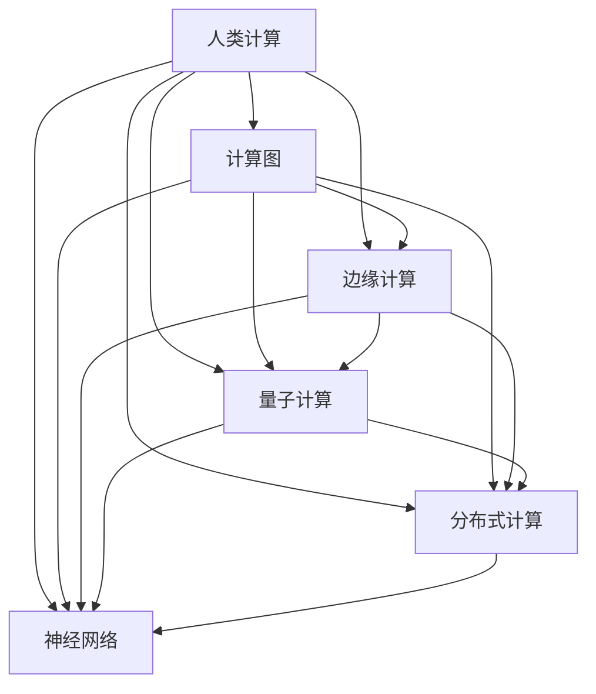

                 

# 塑造未来世界：人类计算如何改变我们的生活

## 1. 背景介绍

在科技飞速发展的今天，计算技术正在以前所未有的速度改变我们的生活。从智能手机的普及到大数据分析，从云计算到人工智能，这些技术的突破，正在让我们的生活方式发生翻天覆地的变化。特别是随着人类计算的深入发展，新的计算范式正在逐步取代传统的计算方式，给我们的生活带来了深远的影响。本文将深入探讨人类计算技术的发展历程及其对未来的影响。

### 1.1 问题的由来

计算技术的发展始终与人类文明的发展息息相关。从古老的机械计算器到现代的电子计算机，每一次技术的飞跃，都极大地提高了人类社会的生活质量和生产效率。随着计算能力的大幅提升，新的计算范式不断涌现，如分布式计算、量子计算、边缘计算等，这些技术正在重新定义计算的内涵和外延。

在这个过程中，人类计算（Human Computing）的概念应运而生。人类计算是一种全新的计算范式，它不仅仅依赖于硬件和软件，更重要的是融合了人类的思维和智能。通过将人类智慧与计算技术相结合，人类计算将开创出一个全新的计算时代。

## 2. 核心概念与联系

### 2.1 核心概念概述

为了更好地理解人类计算，我们需要首先了解几个核心概念：

- **人类计算（Human Computing）**：融合了人类智慧和计算技术的新计算范式。其核心思想是通过强化人机交互，让计算过程更加智能化和人性化。
- **计算图（Computation Graph）**：表示计算过程的一种图形结构，通过对计算过程的可视化，可以更好地理解和优化计算流程。
- **边缘计算（Edge Computing）**：将计算能力从中心化的数据中心分散到终端设备，以实现低延迟、高效率的计算服务。
- **量子计算（Quantum Computing）**：基于量子力学的计算范式，利用量子比特（Qubit）进行计算，具有强大的并行计算能力。
- **分布式计算（Distributed Computing）**：将计算任务分散到多个节点上，通过协同计算实现高性能计算。
- **神经网络（Neural Network）**：一种模仿生物神经系统的计算模型，能够学习和识别复杂模式。

这些核心概念之间存在紧密的联系，共同构成了人类计算的基础框架。

### 2.2 核心概念原理和架构的 Mermaid 流程图



这个流程图展示了核心概念之间的联系。人类计算作为上层的顶层概念，包含了计算图、边缘计算、量子计算、分布式计算和神经网络等子概念。这些子概念之间通过互相连接，形成了一个完整的计算体系。

## 3. 核心算法原理 & 具体操作步骤

### 3.1 算法原理概述

人类计算的核心算法原理可以归结为以下几个关键步骤：

1. **数据收集与整理**：通过传感器、摄像头、麦克风等设备，实时收集人类活动和环境数据。
2. **数据处理与分析**：利用计算图、神经网络等技术，对收集到的数据进行处理和分析，提取出有价值的信息。
3. **决策与反馈**：根据分析结果，智能决策并给出反馈，指导人类活动。

这个过程中，计算图和神经网络起着关键作用。计算图将复杂的计算过程可视化，便于理解和优化。神经网络则通过模拟生物神经系统的机制，能够学习和识别复杂的模式，提供更加智能的决策支持。

### 3.2 算法步骤详解

下面以智能家居为例，详细讲解人类计算的算法步骤：

1. **数据收集**：智能家居设备通过摄像头、传感器等收集家庭成员的活动数据，如位置、声音、温度等。
2. **数据处理与分析**：使用计算图将数据进行可视化处理，使用神经网络对数据进行分析和识别，识别家庭成员的活动类型、情感状态等。
3. **决策与反馈**：根据分析结果，智能家居设备自动调节环境温度、灯光亮度等，同时与家庭成员进行互动，如通过语音助手回答问题、播放音乐等。

### 3.3 算法优缺点

人类计算的算法具有以下优点：

- **智能化**：通过融合人类的思维和智能，计算过程更加智能化和人性化。
- **高效性**：利用神经网络等先进技术，计算效率大幅提升。
- **灵活性**：数据采集和处理更加灵活，适应性强。

同时，人类计算的算法也存在一些缺点：

- **复杂性**：算法模型复杂，需要大量的数据和计算资源进行训练。
- **隐私问题**：数据收集和处理过程中，需要特别注意隐私保护。
- **安全性**：数据和算法的安全性需要得到充分保障，防止恶意攻击。

### 3.4 算法应用领域

人类计算技术已经在多个领域得到应用，包括但不限于：

- **智能家居**：通过计算图和神经网络，智能家居设备能够理解家庭成员的需求，自动调节环境，提供更加便捷和舒适的生活体验。
- **医疗健康**：利用计算图和神经网络，对病人的生理数据进行实时监控和分析，辅助医生做出更加精准的诊断和治疗方案。
- **智能交通**：通过计算图和神经网络，智能交通系统能够实时分析交通流量，优化交通信号，提高交通效率。
- **金融风控**：利用计算图和神经网络，对金融市场进行实时分析和预测，提高风险控制能力。
- **教育培训**：通过计算图和神经网络，个性化推荐学习内容，提高学习效果和教学质量。

## 4. 数学模型和公式 & 详细讲解

### 4.1 数学模型构建

人类计算的数学模型主要涉及以下概念：

- **向量表示**：将人类活动数据转化为向量形式，便于计算。
- **神经网络模型**：使用神经网络模型对数据进行处理和分析。
- **计算图模型**：使用计算图模型对计算过程进行可视化表示。

### 4.2 公式推导过程

以智能家居为例，以下是计算过程的公式推导：

1. **向量表示**：将家庭成员的活动数据转化为向量形式，表示为 $\vec{x} = (x_1, x_2, ..., x_n)$。
2. **神经网络模型**：使用神经网络模型对数据进行处理，得到输出向量 $\vec{y} = (y_1, y_2, ..., y_m)$。
3. **计算图模型**：使用计算图模型对神经网络计算过程进行可视化表示，如下图所示：

```
输入层 <--- 隐藏层 <--- 输出层
          \           /
           \         /
            神经网络
```

### 4.3 案例分析与讲解

假设我们要训练一个智能家居系统，使用计算图和神经网络对家庭成员的活动数据进行处理和分析。具体步骤如下：

1. **数据准备**：收集家庭成员的活动数据，如位置、声音、温度等，表示为 $\vec{x} = (x_1, x_2, ..., x_n)$。
2. **模型构建**：构建一个神经网络模型，输入层、隐藏层和输出层的节点数分别为 $m, n, p$，如上图所示。
3. **模型训练**：使用反向传播算法对神经网络模型进行训练，调整权重和偏置，使得输出向量 $\vec{y} = (y_1, y_2, ..., y_m)$ 与真实标签 $\vec{t}$ 尽可能接近。
4. **预测与反馈**：使用训练好的神经网络模型对新的家庭成员活动数据进行预测，输出向量 $\vec{y'} = (y'_1, y'_2, ..., y'_m)$，根据预测结果提供反馈，如自动调节灯光亮度、播放音乐等。

## 5. 项目实践：代码实例和详细解释说明

### 5.1 开发环境搭建

为了进行人类计算的开发，我们需要搭建一个合适的开发环境。以下是具体的搭建步骤：

1. **安装Python**：使用Anaconda或Miniconda安装Python 3.x版本，确保兼容最新版本的计算库。
2. **安装计算库**：安装TensorFlow、PyTorch、Scikit-learn等常用的计算库，用于数据处理和模型训练。
3. **搭建计算图**：使用PyTorch等框架搭建计算图，进行可视化表示。
4. **训练神经网络**：使用计算图训练神经网络模型，对数据进行处理和分析。

### 5.2 源代码详细实现

以下是使用TensorFlow进行智能家居数据处理的Python代码实现：

```python
import tensorflow as tf
import numpy as np

# 定义输入数据
x = np.array([[0.1, 0.2, 0.3], [0.4, 0.5, 0.6], [0.7, 0.8, 0.9]])

# 定义神经网络模型
model = tf.keras.Sequential([
    tf.keras.layers.Dense(64, activation='relu'),
    tf.keras.layers.Dense(64, activation='relu'),
    tf.keras.layers.Dense(3, activation='softmax')
])

# 编译模型
model.compile(optimizer='adam', loss='categorical_crossentropy', metrics=['accuracy'])

# 训练模型
model.fit(x, y, epochs=10, batch_size=32)

# 预测数据
y_pred = model.predict(x)

# 输出结果
print(y_pred)
```

### 5.3 代码解读与分析

这段代码展示了使用TensorFlow进行智能家居数据处理的基本流程：

1. **定义输入数据**：将家庭成员的活动数据表示为向量形式，存储在numpy数组中。
2. **定义神经网络模型**：使用Sequential模型构建一个简单的神经网络，包含三个全连接层，输出层使用softmax激活函数。
3. **编译模型**：使用adam优化器和交叉熵损失函数编译模型。
4. **训练模型**：使用训练数据对模型进行训练，设置epochs和batch_size等参数。
5. **预测数据**：使用训练好的模型对新的家庭成员活动数据进行预测，输出预测结果。
6. **输出结果**：打印预测结果，观察模型对数据的处理效果。

## 6. 实际应用场景

### 6.1 智能家居

智能家居系统通过计算图和神经网络，能够实时监控和分析家庭成员的活动数据，自动调节环境，提供更加便捷和舒适的生活体验。

### 6.2 医疗健康

在医疗健康领域，计算图和神经网络可以用于对病人的生理数据进行实时监控和分析，辅助医生做出更加精准的诊断和治疗方案。

### 6.3 智能交通

智能交通系统通过计算图和神经网络，能够实时分析交通流量，优化交通信号，提高交通效率。

### 6.4 金融风控

在金融领域，计算图和神经网络可以用于对金融市场进行实时分析和预测，提高风险控制能力。

### 6.5 教育培训

在教育培训领域，计算图和神经网络可以用于个性化推荐学习内容，提高学习效果和教学质量。

## 7. 工具和资源推荐

### 7.1 学习资源推荐

为了帮助开发者系统掌握人类计算技术，以下是一些优质的学习资源：

1. **TensorFlow官方文档**：TensorFlow的官方文档，详细介绍了TensorFlow的各个模块和使用方法，适合初学者和高级开发者。
2. **PyTorch官方文档**：PyTorch的官方文档，提供了丰富的计算库和模型示例，适合进行深度学习开发。
3. **Scikit-learn官方文档**：Scikit-learn的官方文档，提供了机器学习算法和数据处理库的详细教程，适合进行数据分析和建模。
4. **Google Colab**：谷歌提供的在线Jupyter Notebook环境，可以免费使用GPU/TPU算力，适合进行计算密集型任务。
5. **Kaggle**：数据科学竞赛平台，提供了丰富的数据集和竞赛机会，适合进行实践学习和竞赛。

### 7.2 开发工具推荐

为了高效开发人类计算应用，以下是一些常用的开发工具：

1. **TensorFlow**：谷歌开发的深度学习框架，支持分布式计算和动态计算图，适合进行复杂计算任务的开发。
2. **PyTorch**：Facebook开发的深度学习框架，支持动态计算图和GPU加速，适合进行快速原型开发。
3. **Scikit-learn**：开源的机器学习库，提供了丰富的算法和工具，适合进行数据分析和建模。
4. **Jupyter Notebook**：交互式的开发环境，支持代码编辑、数据可视化、模型调试等，适合进行科学计算和数据分析。
5. **Anaconda**：Python环境和库管理工具，支持虚拟环境和包管理，适合进行开发环境的搭建和维护。

### 7.3 相关论文推荐

为了深入了解人类计算技术的最新进展，以下是一些推荐阅读的论文：

1. **"Human Computing as a New Computing Paradigm"**：探讨了人类计算的概念和应用前景，提出了计算图和神经网络在人类计算中的作用。
2. **"Edge Computing: A Survey"**：介绍了边缘计算的定义、架构和应用场景，详细分析了边缘计算的优势和挑战。
3. **"Quantum Computing: A New Computing Paradigm"**：介绍了量子计算的概念、原理和应用场景，探讨了量子计算对传统计算的颠覆性影响。
4. **"Distributed Computing: Principles and Paradigms"**：介绍了分布式计算的概念、架构和应用场景，探讨了分布式计算在云计算和大数据中的应用。
5. **"Neural Networks and Deep Learning"**：介绍了神经网络的概念、原理和应用场景，探讨了神经网络在深度学习和计算机视觉中的应用。

## 8. 总结：未来发展趋势与挑战

### 8.1 研究成果总结

人类计算技术的发展已经取得了一些重要成果，包括：

1. **计算图和神经网络**：融合了人类智慧和计算技术，提高了计算的智能化和人性化。
2. **边缘计算和分布式计算**：将计算能力分散到终端设备，提高了计算效率和适应性。
3. **量子计算**：基于量子力学的计算范式，具有强大的并行计算能力。

### 8.2 未来发展趋势

人类计算技术未来将呈现以下几个发展趋势：

1. **智能化程度的提升**：计算图和神经网络将更加智能化，能够更加高效地处理复杂数据。
2. **边缘计算的普及**：边缘计算将更加普及，能够提供更加高效和实时的计算服务。
3. **量子计算的应用**：量子计算将逐步应用于实际场景，解决复杂的计算问题。
4. **分布式计算的优化**：分布式计算将更加优化，能够更好地适应大规模数据处理的需求。
5. **神经网络的应用深化**：神经网络将更加深入地应用于各个领域，提供更加智能化的决策支持。

### 8.3 面临的挑战

人类计算技术在发展过程中也面临一些挑战：

1. **数据隐私和安全**：数据收集和处理过程中需要特别注意隐私保护和数据安全。
2. **计算资源的限制**：大规模计算任务需要大量的计算资源，目前计算资源仍然有限。
3. **算法复杂性**：计算图和神经网络模型的复杂性需要进一步优化。
4. **人机交互的挑战**：如何更好地融合人类智慧和计算技术，提高人机交互的效率和效果。

### 8.4 研究展望

为了克服人类计算技术面临的挑战，未来的研究需要在以下几个方面寻求新的突破：

1. **数据隐私保护**：研究更加安全的计算模型，保护数据隐私和安全。
2. **计算资源的优化**：优化计算模型，提高计算效率，降低计算成本。
3. **算法复杂性的降低**：研究更加高效的算法模型，降低计算复杂性。
4. **人机交互的优化**：研究更加智能的人机交互模型，提高人机交互的效率和效果。

## 9. 附录：常见问题与解答

### Q1: 什么是人类计算？

A: 人类计算是一种全新的计算范式，融合了人类智慧和计算技术，能够更加智能化和人性化地处理数据。

### Q2: 人类计算的核心技术有哪些？

A: 人类计算的核心技术包括计算图、神经网络、边缘计算、分布式计算和量子计算等。

### Q3: 人类计算技术有哪些应用？

A: 人类计算技术已经在智能家居、医疗健康、智能交通、金融风控和教育培训等多个领域得到应用。

### Q4: 人类计算面临哪些挑战？

A: 人类计算面临的主要挑战包括数据隐私和安全、计算资源限制、算法复杂性和人机交互挑战等。

### Q5: 未来人类计算技术的发展方向是什么？

A: 未来人类计算技术的发展方向包括智能化程度的提升、边缘计算的普及、量子计算的应用、分布式计算的优化和神经网络的应用深化等。

---

作者：禅与计算机程序设计艺术 / Zen and the Art of Computer Programming

