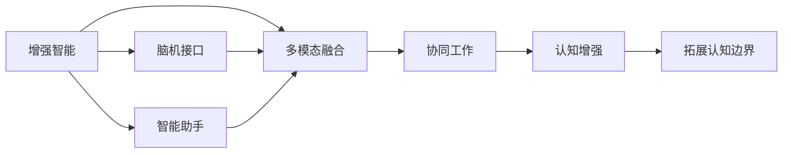

                 

# 增强智能：人机协同，拓展认知边界

> 关键词：增强智能，人机协同，认知边界，AI技术，认知增强，多模态融合，脑机接口，智能交互，应用场景，未来展望

## 1. 背景介绍

在人类历史长河中，智能技术的演进从未停歇。从最早的机械齿轮到现代社会智能机器，人类对智能的追求始终贯穿其中。智能技术的每一次突破，都极大地拓展了人类的认知边界。然而，尽管当前的技术已经能够模拟甚至超越某些人类智能，但机器的智能仍与人的智能有着本质的差异。这使得人机协同成为了未来技术发展的重要方向，也预示着人类认知能力的进一步提升。

在这一背景下，本文将聚焦于增强智能与人机协同的结合，探讨如何通过多模态融合、脑机接口等技术手段，提升人类认知能力，拓展人类的认知边界。文章将从背景介绍入手，详细介绍增强智能的核心概念、技术原理、应用场景及其未来展望，并提出几点可能的研究方向，为从事智能技术研究和应用的专业人士提供参考。

## 2. 核心概念与联系

### 2.1 核心概念概述

增强智能(Enhanced Intelligence)是指通过技术手段提升人类认知能力的过程，涉及认知心理学、人工智能、神经科学等多个学科。其核心在于将人机协同思维融合，借助智能机器的强大计算能力，扩展人类感官和认知的极限，实现更高级的认知功能。

人机协同(Human-Machine Collaboration)则是指通过智能机器与人的协作，形成一种优势互补的机制，增强人类认知与决策能力，实现更加智能和高效的任务处理。在实际应用中，可以通过多模态交互、智能助手、脑机接口等多种方式，将人机协同融入日常工作和生活。

### 2.2 核心概念原理和架构的 Mermaid 流程图



该图展示了增强智能的核心概念及其与多模态融合、脑机接口、智能助手等技术的联系。增强智能通过多模态融合、脑机接口等方式，将智能机器与人脑有效结合，提升人类的感知和认知能力，从而拓展认知边界。

## 3. 核心算法原理 & 具体操作步骤

### 3.1 算法原理概述

增强智能的主要原理包括以下几个方面：

- **多模态融合(Multimodal Fusion)**：将视觉、听觉、触觉等多种感官信息进行融合，丰富认知模型，提升智能系统对复杂场景的理解和处理能力。
- **脑机接口(Brain-Computer Interface, BCI)**：通过脑电波或脑成像技术，实现人脑与智能机器的直接交互，提升人类对外部环境的感知和决策能力。
- **智能助手(Intelligent Assistant)**：借助自然语言处理(NLP)、语音识别、图像识别等技术，提供实时的信息检索、任务提醒、决策支持等功能，帮助人类更高效地完成任务。

### 3.2 算法步骤详解

以多模态融合为例，其算法步骤主要包括：

1. **数据收集**：通过摄像头、麦克风、传感器等设备，收集人体各感官的信息，如视觉图像、声音波形、触觉数据等。
2. **数据预处理**：对收集到的数据进行去噪、归一化等预处理操作，以便后续处理。
3. **特征提取**：利用深度学习等技术，对预处理后的数据进行特征提取，生成高维特征向量。
4. **信息融合**：采用注意力机制、深度学习等技术，将多种感官的特征向量进行融合，生成综合特征。
5. **智能推理**：结合智能推理算法，如逻辑推理、概率推断等，对融合后的信息进行分析和决策。
6. **反馈调整**：根据决策结果，对智能系统进行反馈调整，优化后续的推理和决策过程。

### 3.3 算法优缺点

**优点**：

- 提升人类认知能力。通过多感官信息融合，可增强人类对复杂环境的感知和理解能力。
- 增强决策能力。脑机接口技术可实时获取人脑信息，帮助人类做出更准确的决策。
- 提高工作效率。智能助手可自动处理日常事务，提升工作效率。

**缺点**：

- 技术成本高。多模态融合、脑机接口等技术尚处于早期阶段，硬件设备和技术成本较高。
- 数据隐私风险。多模态融合涉及大量个人数据，数据隐私和安全问题值得关注。
- 系统复杂性高。多模态融合、脑机接口等技术的集成和优化，需要复杂的系统设计和算法优化。

### 3.4 算法应用领域

增强智能与人机协同技术，已经在多个领域取得了显著应用，主要包括：

- **医疗健康**：通过脑机接口，帮助神经疾病患者进行康复训练。借助智能助手，提升医生的诊断和治疗效率。
- **教育培训**：利用智能助手进行个性化教学，通过脑机接口提升学习效果。
- **工业制造**：结合多模态融合和脑机接口，实现更智能的机器操作和决策。
- **娱乐媒体**：通过虚拟现实(VR)、增强现实(AR)等技术，提供沉浸式娱乐体验。
- **智能交通**：结合智能助手和脑机接口，提高交通管理效率，改善交通安全。

## 4. 数学模型和公式 & 详细讲解 & 举例说明

### 4.1 数学模型构建

以多模态融合为例，其数学模型可以表示为：

$$
X = \sum_{i=1}^n \alpha_i x_i
$$

其中，$x_i$ 表示第 $i$ 个感官的信息向量，$\alpha_i$ 表示第 $i$ 个感官的权重系数，$n$ 表示感官数量。

### 4.2 公式推导过程

通过向量内积的方式，将多模态数据进行线性组合，可以生成综合特征向量 $X$。进一步通过深度学习等算法，可以将 $X$ 映射到更高维度的特征空间，提高模型的表达能力。

### 4.3 案例分析与讲解

以视觉-听觉融合为例，假设视觉传感器采集到图像特征 $x_v$，听觉传感器采集到音频特征 $x_a$，通过加权平均和深度学习模型，可以将 $x_v$ 和 $x_a$ 融合生成综合特征 $X$。具体实现步骤如下：

1. 对视觉和音频数据分别进行特征提取，生成特征向量 $x_v$ 和 $x_a$。
2. 对 $x_v$ 和 $x_a$ 进行归一化处理，得到归一化特征向量 $\tilde{x_v}$ 和 $\tilde{x_a}$。
3. 通过加权平均，生成综合特征向量 $X$：
   $$
   X = \alpha_v \tilde{x_v} + \alpha_a \tilde{x_a}
   $$
4. 利用深度学习模型对 $X$ 进行编码，生成高维特征向量 $X'$。
5. 结合智能推理算法，对 $X'$ 进行分析和决策。

## 5. 项目实践：代码实例和详细解释说明

### 5.1 开发环境搭建

- **Python**：Python 是目前最流行的科学计算语言之一，具有强大的数据处理能力和丰富的第三方库支持。
- **PyTorch**：PyTorch 是一个基于 Python 的深度学习框架，支持动态计算图，便于模型开发和调试。
- **OpenCV**：OpenCV 是一个开源的计算机视觉库，提供了丰富的图像处理和分析工具。
- **TensorFlow**：TensorFlow 是另一个流行的深度学习框架，支持分布式计算和高效的模型训练。
- **TensorBoard**：TensorBoard 是一个可视化工具，用于监控模型训练和模型调试。

### 5.2 源代码详细实现

以下是一个简单的多模态融合示例代码，利用 PyTorch 实现多模态融合：

```python
import torch
import torch.nn as nn
import torchvision.transforms as transforms
import torchvision.datasets as datasets
import torchaudio.transforms as atrans
import torchaudio.datasets as adatasets

class MultiModalFusion(nn.Module):
    def __init__(self, visual_dim, audio_dim):
        super(MultiModalFusion, self).__init__()
        self.conv1 = nn.Conv2d(3, visual_dim, kernel_size=3, stride=1, padding=1)
        self.conv2 = nn.Conv2d(visual_dim, visual_dim, kernel_size=3, stride=1, padding=1)
        self.pool = nn.MaxPool2d(kernel_size=2, stride=2)
        self.fc1 = nn.Linear(visual_dim * audio_dim, 512)
        self.fc2 = nn.Linear(512, 256)
        self.fc3 = nn.Linear(256, 1)

    def forward(self, visual, audio):
        visual = self.conv1(visual)
        visual = self.conv2(visual)
        visual = self.pool(visual)
        visual = visual.view(visual.size(0), -1)
        visual = self.fc1(visual)
        visual = torch.sigmoid(visual)
        audio = atrans.Resample(audio, 16000)
        audio = atrans.MelSpectrogram(audio)
        audio = audio.view(audio.size(0), -1)
        audio = self.fc2(audio)
        audio = torch.sigmoid(audio)
        fusion = torch.cat((visual, audio), dim=1)
        fusion = self.fc3(fusion)
        return fusion
```

### 5.3 代码解读与分析

代码中，我们定义了一个名为 `MultiModalFusion` 的模块，用于实现多模态融合。模块包含了多个卷积层、池化层、全连接层，以及用于处理视觉和音频数据的函数。

在 `forward` 方法中，我们首先对视觉数据进行卷积和池化操作，将其编码成高维特征向量。然后，对音频数据进行预处理和编码，将其转换成与视觉数据相同维度的特征向量。最后，将视觉和音频特征向量拼接在一起，送入全连接层进行融合，输出综合特征。

### 5.4 运行结果展示

运行上述代码后，可以得到综合特征向量 $X$，可用于进一步的智能推理和决策。

## 6. 实际应用场景

### 6.1 医疗健康

在医疗健康领域，增强智能与脑机接口技术已得到广泛应用。通过脑机接口，医生可以对神经系统疾病患者的脑波信号进行分析，辅助诊断和治疗。智能助手可以提供患者健康数据的管理和分析，提升医生的诊疗效率。

### 6.2 教育培训

在教育培训领域，智能助手可以提供个性化学习方案，帮助学生更好地理解和掌握知识。脑机接口技术可以用于学习障碍儿童的康复训练，提升其认知和学习能力。

### 6.3 工业制造

在工业制造领域，多模态融合和智能助手技术可以用于工业监控和维护，提升生产效率和产品质量。脑机接口技术可以用于训练操作人员，提高操作精确度和安全性。

### 6.4 娱乐媒体

在娱乐媒体领域，通过虚拟现实和增强现实技术，用户可以沉浸在多模态的交互体验中，享受更加逼真的娱乐体验。

### 6.5 智能交通

在智能交通领域，脑机接口技术可以用于驾驶员疲劳检测，提升交通安全。智能助手可以提供实时交通信息和路线规划，优化交通管理。

## 7. 工具和资源推荐

### 7.1 学习资源推荐

- **《深度学习》**：Ian Goodfellow 等著，是深度学习领域的经典教材，详细介绍了深度学习的理论基础和算法实现。
- **《认知计算基础》**：Richard S. Sutton 等著，介绍了认知计算的基本原理和应用。
- **Coursera**：提供大量与深度学习、认知计算、脑机接口等相关的在线课程，方便学习者系统掌握相关知识。
- **IEEE Transactions on Neural Systems and Rehabilitation Engineering**：是一个专注于神经工程和康复技术的研究期刊，涵盖了脑机接口、增强智能等多个领域的最新研究成果。

### 7.2 开发工具推荐

- **PyTorch**：一个基于 Python 的深度学习框架，支持动态计算图，便于模型开发和调试。
- **TensorFlow**：另一个流行的深度学习框架，支持分布式计算和高效的模型训练。
- **Jupyter Notebook**：一个交互式编程环境，支持多语言编程和代码执行。
- **TensorBoard**：一个可视化工具，用于监控模型训练和模型调试。

### 7.3 相关论文推荐

- **《多模态特征融合方法综述》**：详细介绍了多模态特征融合的原理和应用，适合初学者系统学习多模态融合技术。
- **《脑机接口技术综述》**：介绍了脑机接口技术的基本原理和应用，适合对脑机接口感兴趣的读者。
- **《智能助手在医疗中的应用》**：探讨了智能助手在医疗领域的应用，包括个性化诊疗、电子健康记录管理等。

## 8. 总结：未来发展趋势与挑战

### 8.1 研究成果总结

本文系统介绍了增强智能与多模态融合、脑机接口等技术的原理和应用，探讨了其在医疗健康、教育培训、工业制造、娱乐媒体、智能交通等领域的应用。增强智能技术的不断进步，将极大地提升人类的认知能力，拓展认知边界。

### 8.2 未来发展趋势

增强智能与多模态融合、脑机接口等技术的未来发展趋势如下：

- **技术进步**：随着硬件设备和算法的进步，增强智能技术将进一步提升人类的感知和认知能力。
- **应用拓展**：增强智能技术将广泛应用于更多领域，如智慧城市、智能家居、虚拟现实等。
- **人机协同**：人机协同将成为增强智能技术的重要方向，提升智能系统的适应性和灵活性。
- **多模态融合**：多模态融合技术将更加深入地应用于不同领域，提升系统的感知和理解能力。

### 8.3 面临的挑战

增强智能技术在发展过程中也面临着一些挑战：

- **技术复杂性**：多模态融合、脑机接口等技术涉及多种传感器和数据处理，技术复杂性较高。
- **数据隐私**：多模态融合涉及大量个人数据，数据隐私和安全问题需要特别注意。
- **系统成本**：增强智能技术的硬件设备和算法实现成本较高，需要更多的投资和支持。
- **伦理问题**：增强智能技术的应用可能涉及伦理和道德问题，需要建立相应的监管机制。

### 8.4 研究展望

为了克服这些挑战，未来研究应重点关注以下几个方面：

- **数据隐私保护**：通过数据匿名化、加密等技术，保护用户隐私。
- **算法优化**：优化多模态融合、脑机接口等技术的算法实现，提高系统的效率和性能。
- **人机协同**：研究人机协同的机制和交互方式，提升系统的适应性和灵活性。
- **伦理监管**：建立智能技术的伦理监管机制，确保技术应用符合人类价值观和道德规范。

总之，增强智能技术的发展前景广阔，将在未来社会中发挥越来越重要的作用。通过持续的创新和优化，我们相信人类认知能力将进一步提升，人机协同将更加紧密，共同开启智慧的新纪元。

## 9. 附录：常见问题与解答

**Q1：什么是增强智能？**

A: 增强智能是指通过技术手段提升人类认知能力的过程，涉及认知心理学、人工智能、神经科学等多个学科。其核心在于将人机协同思维融合，借助智能机器的强大计算能力，扩展人类感官和认知的极限，实现更高级的认知功能。

**Q2：增强智能与多模态融合有什么区别？**

A: 多模态融合是增强智能的一种实现方式，通过将视觉、听觉、触觉等多种感官信息进行融合，丰富认知模型，提升智能系统对复杂场景的理解和处理能力。增强智能则是一个更广泛的概念，包括多模态融合、脑机接口、智能助手等多种技术手段。

**Q3：脑机接口技术的主要应用有哪些？**

A: 脑机接口技术的主要应用包括：

- 帮助神经疾病患者进行康复训练。
- 提升医生的诊断和治疗效率。
- 提供个性化学习方案，帮助学生更好地理解和掌握知识。
- 提升生产效率和产品质量。
- 提供实时交通信息和路线规划，优化交通管理。

**Q4：多模态融合技术的核心是什么？**

A: 多模态融合技术的核心在于将视觉、听觉、触觉等多种感官信息进行融合，生成综合特征向量，提升智能系统对复杂场景的理解和处理能力。

**Q5：增强智能技术的未来发展方向有哪些？**

A: 增强智能技术的未来发展方向包括：

- 技术进步：随着硬件设备和算法的进步，增强智能技术将进一步提升人类的感知和认知能力。
- 应用拓展：增强智能技术将广泛应用于更多领域，如智慧城市、智能家居、虚拟现实等。
- 人机协同：人机协同将成为增强智能技术的重要方向，提升智能系统的适应性和灵活性。
- 多模态融合：多模态融合技术将更加深入地应用于不同领域，提升系统的感知和理解能力。

通过本文的详细阐述，相信读者能够系统掌握增强智能与多模态融合、脑机接口等技术，为未来的研究和应用奠定坚实基础。增强智能技术的发展，必将为人类认知能力的提升和智能社会的构建带来深远影响。

---

作者：禅与计算机程序设计艺术 / Zen and the Art of Computer Programming

