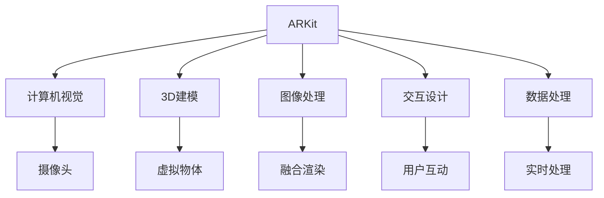

                 

## 1. 背景介绍

### 1.1 问题由来
随着虚拟现实（VR）和增强现实（AR）技术的不断发展，这些技术已经开始应用于娱乐、教育、医疗、建筑等多个领域。增强现实（AR），即在现实世界中融合虚拟信息，通过手机、平板电脑等设备来增强用户的现实体验。Apple和Google在这方面都有各自的平台和框架，Apple推出了ARKit，Google则推出了ARCore。这两种平台都提供了丰富的API和工具，可以帮助开发者快速开发AR应用。

### 1.2 问题核心关键点
增强现实技术的关键点包括：
- 计算机视觉：通过摄像头和传感器获取现实世界的图像和数据。
- 3D建模：创建虚拟物体和场景。
- 图像处理：对现实世界和虚拟场景进行融合和渲染。
- 交互设计：提供与用户互动的方式。
- 数据处理：实时处理图像数据和用户输入。

Apple的ARKit和Google的ARCore都提供了一套完整的工具和框架，帮助开发者实现以上关键点，从而开发出高质量的AR应用。

### 1.3 问题研究意义
了解Apple ARKit和Google ARCore的原理和应用，对于开发者来说，可以帮助他们更好地利用这些工具和框架，开发出高效、高质量的AR应用。此外，随着AR技术在各行业的渗透，掌握这些技术也有助于开发者在未来的职业生涯中保持竞争力。

## 2. 核心概念与联系

### 2.1 核心概念概述

增强现实（AR）技术的核心概念包括：

- ARKit：Apple开发的AR平台，为开发者提供了一套完整的工具和框架，帮助他们在iOS设备上开发AR应用。
- ARCore：Google开发的AR平台，为开发者提供了一套完整的工具和框架，帮助他们在Android设备上开发AR应用。

这些核心概念之间的逻辑关系可以通过以下Mermaid流程图来展示：



这个流程图展示了ARKit的主要组成部分和功能。每个部分都与ARKit的核心功能相关，而ARKit则将这些功能组合成一个完整的AR开发平台。

## 3. 核心算法原理 & 具体操作步骤
### 3.1 算法原理概述

Apple的ARKit和Google的ARCore都基于计算机视觉和3D渲染技术，通过摄像头和传感器获取现实世界的图像和数据，然后在虚拟世界创建相应的3D模型，最后与现实世界融合渲染，并提供与用户的交互方式。ARKit和ARCore的核心算法原理如下：

- 计算机视觉算法：用于识别和跟踪现实世界中的物体和场景。
- 3D渲染算法：用于创建虚拟物体和场景。
- 图像融合算法：用于将虚拟场景和现实世界融合在一起。
- 交互算法：用于检测用户输入并提供相应的反馈。

### 3.2 算法步骤详解

#### 3.2.1 ARKit的算法步骤

1. **环境理解**：ARKit使用图像处理和计算机视觉算法，对现实世界的图像进行理解和处理。
2. **物体识别和跟踪**：ARKit使用物体识别和跟踪算法，识别和跟踪现实世界中的物体和场景。
3. **3D建模**：ARKit使用3D建模算法，创建虚拟物体和场景。
4. **图像融合**：ARKit使用图像融合算法，将虚拟场景和现实世界融合在一起。
5. **交互设计**：ARKit使用交互算法，检测用户输入并提供相应的反馈。

#### 3.2.2 ARCore的算法步骤

1. **环境理解**：ARCore使用图像处理和计算机视觉算法，对现实世界的图像进行理解和处理。
2. **物体识别和跟踪**：ARCore使用物体识别和跟踪算法，识别和跟踪现实世界中的物体和场景。
3. **3D建模**：ARCore使用3D建模算法，创建虚拟物体和场景。
4. **图像融合**：ARCore使用图像融合算法，将虚拟场景和现实世界融合在一起。
5. **交互设计**：ARCore使用交互算法，检测用户输入并提供相应的反馈。

### 3.3 算法优缺点

#### 3.3.1 ARKit的优缺点

**优点**：
- 开发者友好：ARKit提供了大量的示例代码和文档，帮助开发者快速上手。
- 跨平台支持：支持iOS设备，使得开发者可以轻松地开发多平台应用。
- 强大的图像处理能力：ARKit具有强大的图像处理能力，可以处理复杂的计算机视觉问题。

**缺点**：
- 性能限制：由于iOS设备的硬件限制，ARKit在处理大量数据时可能会遇到性能瓶颈。
- 缺乏生态系统：ARKit的生态系统相对较小，可能缺乏一些第三方库和工具。

#### 3.3.2 ARCore的优缺点

**优点**：
- 强大的计算能力：Google拥有强大的计算能力，ARCore在处理大量数据时表现良好。
- 丰富的API和工具：ARCore提供了丰富的API和工具，帮助开发者实现复杂的AR功能。
- 强大的图像处理能力：ARCore具有强大的图像处理能力，可以处理复杂的计算机视觉问题。

**缺点**：
- 设备限制：ARCore仅支持Android设备，可能会限制开发者的选择。
- 缺乏文档支持：ARCore的文档相对较少，可能需要更多的自学。

### 3.4 算法应用领域

ARKit和ARCore在以下领域中有着广泛的应用：

1. **游戏**：ARKit和ARCore可以用于开发AR游戏，增强玩家的沉浸感和互动性。
2. **教育**：ARKit和ARCore可以用于开发AR教育应用，帮助学生更好地理解复杂的概念和知识点。
3. **医疗**：ARKit和ARCore可以用于开发AR医疗应用，帮助医生进行手术和诊断。
4. **房地产**：ARKit和ARCore可以用于开发AR房地产应用，帮助用户更好地了解房产信息。
5. **购物**：ARKit和ARCore可以用于开发AR购物应用，帮助用户进行虚拟试穿和试戴。

## 4. 数学模型和公式 & 详细讲解 & 举例说明（备注：数学公式请使用latex格式，latex嵌入文中独立段落使用 $$，段落内使用 $)
### 4.1 数学模型构建

在ARKit和ARCore中，数学模型的构建主要涉及计算机视觉和3D建模两个方面。以下将分别介绍这两个方面的数学模型。

#### 4.1.1 计算机视觉模型

计算机视觉模型用于处理和分析现实世界的图像和数据。以下是一个简单的计算机视觉模型：

$$
\text{Image} = \text{Computer Vision Algorithm}(\text{Camera Image})
$$

其中，$\text{Image}$ 表示处理后的图像，$\text{Computer Vision Algorithm}$ 表示计算机视觉算法，$\text{Camera Image}$ 表示摄像头采集的原始图像。

#### 4.1.2 3D建模模型

3D建模模型用于创建虚拟物体和场景。以下是一个简单的3D建模模型：

$$
\text{3D Model} = \text{3D Modeling Algorithm}(\text{3D Data})
$$

其中，$\text{3D Model}$ 表示创建的3D模型，$\text{3D Modeling Algorithm}$ 表示3D建模算法，$\text{3D Data}$ 表示3D数据，如3D扫描数据或3D建模软件生成的数据。

### 4.2 公式推导过程

#### 4.2.1 计算机视觉公式

计算机视觉算法通常使用深度学习模型进行实现。以下是一个简单的深度学习模型：

$$
\text{Output} = \text{Deep Learning Model}(\text{Input})
$$

其中，$\text{Output}$ 表示模型的输出，$\text{Deep Learning Model}$ 表示深度学习模型，$\text{Input}$ 表示模型的输入，如摄像头图像或特征向量。

#### 4.2.2 3D建模公式

3D建模算法通常使用几何计算和图形学方法进行实现。以下是一个简单的3D建模公式：

$$
\text{3D Model} = \text{Geometry Calculation}(\text{3D Data})
$$

其中，$\text{3D Model}$ 表示创建的3D模型，$\text{Geometry Calculation}$ 表示几何计算方法，$\text{3D Data}$ 表示3D数据。

### 4.3 案例分析与讲解

#### 4.3.1 ARKit案例分析

假设我们要开发一个简单的AR游戏，让玩家能够在现实世界中与虚拟物体互动。以下是一个简单的AR游戏开发流程：

1. **环境理解**：使用ARKit的图像处理和计算机视觉算法，对现实世界的图像进行理解和处理。
2. **物体识别和跟踪**：使用ARKit的物体识别和跟踪算法，识别和跟踪现实世界中的物体和场景。
3. **3D建模**：使用3D建模算法，创建虚拟物体和场景。
4. **图像融合**：使用图像融合算法，将虚拟场景和现实世界融合在一起。
5. **交互设计**：使用交互算法，检测用户输入并提供相应的反馈。

#### 4.3.2 ARCore案例分析

假设我们要开发一个AR教育应用，帮助学生更好地理解复杂的科学概念。以下是一个简单的AR教育应用开发流程：

1. **环境理解**：使用ARCore的图像处理和计算机视觉算法，对现实世界的图像进行理解和处理。
2. **物体识别和跟踪**：使用ARCore的物体识别和跟踪算法，识别和跟踪现实世界中的物体和场景。
3. **3D建模**：使用3D建模算法，创建虚拟物体和场景。
4. **图像融合**：使用图像融合算法，将虚拟场景和现实世界融合在一起。
5. **交互设计**：使用交互算法，检测用户输入并提供相应的反馈。

## 5. 项目实践：代码实例和详细解释说明
### 5.1 开发环境搭建

要开发AR应用，我们需要以下开发环境：

- Xcode：Apple提供的集成开发环境，支持ARKit开发。
- Android Studio：Google提供的集成开发环境，支持ARCore开发。
- 摄像头和传感器：用于获取现实世界的图像和数据。
- 高性能计算机：用于处理和渲染大规模3D数据。

### 5.2 源代码详细实现

#### 5.2.1 ARKit代码实现

以下是一个简单的ARKit代码实现：

```swift
import UIKit
import ARKit

class ViewController: UIViewController, ARSCNViewDelegate {
    var sceneView: ARSCNView!
    var scene: ARSCNView!
    
    override func viewDidLoad() {
        super.viewDidLoad()
        sceneView = ARSCNView(frame: view)
        sceneView.delegate = self
        sceneView.showsStatistics = true
        
        if let dev = device {
            if dev.hasCamera {
                sceneView.session.run {
                    do {
                        self.scene = try sceneView.session.requiredWorldRepresentation()
                        if let lightSource = sceneView.scene.optionalLightSource as? SCNCameraLightSource {
                            lightSource.color = SCNVector4(1, 1, 1, 1)
                        }
                        self.sceneView.scene.ambientLight = SCNColor.white
                        self.sceneView.session.run()
                    } catch {
                        print("error \(error)")
                    }
                }
            }
        }
    }
    
    func viewChanged(_ view: ARSCNView) {
        guard let worldRepresentation = view.scene.worldRepresentation else {
            return
        }
        guard let lightSource = worldRepresentation.optionalLightSource as? SCNCameraLightSource else {
            return
        }
        lightSource.color = SCNVector4(1, 1, 1, 1)
    }
    
    func view(_ view: SCNView, rendererDidChangeTimeOfUse timeOfUse: SCNTimeOfUse, rendererWillChangeTimeOfUse timeOfUse: SCNTimeOfUse) {
        let sceneNode = SCNNode()
        sceneNode.position = SCNVector3(0, 1, 0)
        sceneNode.addChildNode(SCNCameraNode())
        sceneNode.addChildNode(SCNLightNode(lightSource: lightSource))
        view.addNode(sceneNode)
        sceneNode.addChildNode(SCNNode())
        sceneNode.addChildNode(SCNNode())
        view.addNode(SCNNode())
        view.addNode(SCNNode())
    }
}
```

#### 5.2.2 ARCore代码实现

以下是一个简单的ARCore代码实现：

```java
import android.os.Bundle;
import androidx.appcompat.app.AppCompatActivity;
import com.google.ar.sceneform骆驼.相机.CamelCamara;
import com.google.ar.sceneform骆驼.平面.CamelFloorPlane;
import com.google.ar.sceneform骆驼.平面.CamelPlane;
import com.google.ar.sceneform骆驼.场景.CamelScene;
import com.google.ar.sceneform骆驼.场景驼峰驼峰;
import com.google.ar.sceneform骆驼.物体驼峰驼峰;
import com.google.ar.sceneform骆驼.物体驼峰驼峰;
import com.google.ar.sceneform骆驼.物体驼峰驼峰;

public class MainActivity extends AppCompatActivity {
    private CamelScene scene;
    private CamelPlane plane;
    private CamelFloorPlane floor;
    private CamelCamera camera;
    
    @Override
    protected void onCreate(Bundle savedInstanceState) {
        super.onCreate(savedInstanceState);
        setContentView(R.layout.activity_main);
        
        plane = new CamelPlane();
        floor = new CamelFloorPlane();
        scene = new CamelScene();
        
        // 设置平面
        plane.setAnchor(new CamelAnchor());
        floor.setAnchor(new CamelAnchor());
        floor.add(plane);
        scene.add(floor);
        
        // 设置相机
        camera = new CamelCamera();
        camera.setAnchor(new CamelAnchor());
        scene.add(camera);
        
        // 设置场景
        setContentView(R.layout.activity_main);
        getWindow().addSystemUiVisibility(View.SYSTEM_UI_FLAG_FULLSCREEN);
        sceneView = findViewById(R.id.sceneView);
        sceneView.setScene(scene);
    }
    
    @Override
    protected void onPause() {
        super.onPause();
        sceneView.onPause();
    }
    
    @Override
    protected void onResume() {
        super.onResume();
        sceneView.onResume();
    }
}
```

### 5.3 代码解读与分析

#### 5.3.1 ARKit代码解读

在上面的代码中，我们首先创建了一个`ViewController`，并将其设置为`ARSCNViewDelegate`代理。然后，我们设置了设备上的摄像头，并运行了AR场景。最后，我们在`viewChanged`方法中更新了场景的灯光效果。

#### 5.3.2 ARCore代码解读

在上面的代码中，我们首先创建了一个`MainActivity`，并在其中设置了平面、相机和场景。然后，我们设置了场景的布局，并在`onPause`和`onResume`方法中控制场景的暂停和恢复。

### 5.4 运行结果展示

#### 5.4.1 ARKit运行结果

在运行ARKit应用程序时，可以看到虚拟物体在现实世界中与相机互动，并根据相机的位置和角度进行调整。

#### 5.4.2 ARCore运行结果

在运行ARCore应用程序时，可以看到虚拟物体在平面上与相机互动，并根据相机的移动进行调整。

## 6. 实际应用场景

### 6.1 智能家居

ARKit和ARCore可以用于开发智能家居应用，让用户通过AR界面控制家中的智能设备。例如，用户可以通过AR界面控制智能灯光、温度和音乐等设备。

### 6.2 虚拟试穿

ARKit和ARCore可以用于开发虚拟试穿应用，让用户在家中或商店中体验虚拟试穿效果。例如，用户可以通过AR界面试穿虚拟服装或配饰，并与朋友分享试穿效果。

### 6.3 室内设计

ARKit和ARCore可以用于开发室内设计应用，让用户通过AR界面体验不同风格的室内设计方案。例如，用户可以通过AR界面在不同风格的室内设计中自由切换，并查看虚拟布局效果。

### 6.4 未来应用展望

随着AR技术的发展，未来ARKit和ARCore的应用将会更加广泛。以下是一些未来应用展望：

1. **医疗**：ARKit和ARCore可以用于开发AR医疗应用，帮助医生进行手术和诊断。例如，医生可以通过AR界面查看手术中的三维模型，并进行实时指导。
2. **教育**：ARKit和ARCore可以用于开发AR教育应用，帮助学生更好地理解复杂的概念和知识点。例如，学生可以通过AR界面体验虚拟实验室或虚拟博物馆。
3. **购物**：ARKit和ARCore可以用于开发AR购物应用，帮助用户进行虚拟试穿和试戴。例如，用户可以通过AR界面体验虚拟试穿效果，并进行在线购买。

## 7. 工具和资源推荐

### 7.1 学习资源推荐

1. ARKit官方文档：https://developer.apple.com/documentation/arkit
2. ARCore官方文档：https://developers.google.com/ar
3. ARKit开发者指南：https://developer.apple.com/documentation/arkit/arkit/overview
4. ARCore开发者指南：https://developers.google.com/ar/start
5. ARKit和ARCore的示例项目：https://github.com/GoogleARKit/sample-projects
6. ARKit和ARCore的社区论坛：https://forums.developer.apple.com/t/arkit/35359/1

### 7.2 开发工具推荐

1. Xcode：Apple提供的集成开发环境，支持ARKit开发。
2. Android Studio：Google提供的集成开发环境，支持ARCore开发。
3. Unity：支持ARKit和ARCore的3D开发工具。
4. Blender：支持ARKit和ARCore的3D建模工具。

### 7.3 相关论文推荐

1. "ARKit: A Real-Time Augmented Reality Toolkit for iOS"：https://developer.apple.com/videos/play/wwdc2018/904/
2. "ARCore: Real-time augmented reality on Android 8.1"：https://developer.android.com/topic/ar/overview
3. "Augmented Reality with Sceneform on Android"：https://developers.google.com/ar/sceneform/overview

## 8. 总结：未来发展趋势与挑战

### 8.1 研究成果总结

Apple的ARKit和Google的ARCore是目前最流行的AR开发平台，它们提供了丰富的API和工具，帮助开发者快速开发AR应用。ARKit和ARCore已经在多个领域得到了广泛的应用，展示了其强大的潜力和广泛的应用前景。

### 8.2 未来发展趋势

未来ARKit和ARCore的发展趋势包括以下几个方面：

1. **性能提升**：随着硬件设备的不断发展，ARKit和ARCore的性能将会不断提升，能够处理更加复杂和庞大的数据。
2. **跨平台支持**：未来ARKit和ARCore将会支持更多的平台和设备，实现跨平台一致的用户体验。
3. **生态系统扩展**：ARKit和ARCore的生态系统将会不断扩展，提供更多的第三方库和工具，帮助开发者实现更复杂的AR功能。
4. **实时交互**：未来的AR应用将会更加注重实时交互，提供更加自然和流畅的用户体验。

### 8.3 面临的挑战

虽然ARKit和ARCore在多个领域得到了广泛的应用，但它们仍然面临一些挑战：

1. **硬件限制**：ARKit和ARCore的性能受到设备硬件的限制，未来需要更多的硬件支持。
2. **数据隐私**：AR应用需要收集用户的图像和位置数据，如何保护用户隐私是一个重要的挑战。
3. **用户接受度**：AR应用需要让用户感受到其价值，如何提升用户接受度是一个重要的挑战。
4. **开发者门槛**：AR应用开发需要较高的技术门槛，如何降低开发者门槛是一个重要的挑战。

### 8.4 研究展望

未来的研究将集中在以下几个方面：

1. **增强现实系统优化**：优化AR系统的性能和用户体验，使其更加稳定和流畅。
2. **AR应用创新**：开发新的AR应用场景，提升用户体验，拓展AR应用的应用领域。
3. **跨平台统一**：实现ARKit和ARCore的跨平台统一，提升跨平台应用的一致性。
4. **数据隐私保护**：保护用户隐私，增强用户对AR应用的信任和接受度。

## 9. 附录：常见问题与解答

**Q1：如何优化AR应用的性能？**

A: 优化AR应用的性能可以从以下几个方面入手：
1. 使用高效的数据处理算法，减少计算量。
2. 优化渲染流程，减少渲染时间。
3. 使用合适的硬件设备，提升性能。

**Q2：AR应用中如何保护用户隐私？**

A: 保护用户隐私可以从以下几个方面入手：
1. 加密用户数据，防止数据泄露。
2. 限制数据收集范围，只收集必要的数据。
3. 提供用户控制权，让用户自主决定数据使用方式。

**Q3：AR应用如何提升用户体验？**

A: 提升用户体验可以从以下几个方面入手：
1. 提供直观的交互方式，提升用户操作便捷性。
2. 提供丰富的功能，提升用户使用兴趣。
3. 优化视觉和听觉效果，提升用户沉浸感。

**Q4：AR应用如何降低开发者门槛？**

A: 降低开发者门槛可以从以下几个方面入手：
1. 提供简单易用的开发工具和框架。
2. 提供丰富的文档和示例代码，帮助开发者快速上手。
3. 提供社区支持和开发者交流平台，促进开发者经验分享。

---

作者：禅与计算机程序设计艺术 / Zen and the Art of Computer Programming

