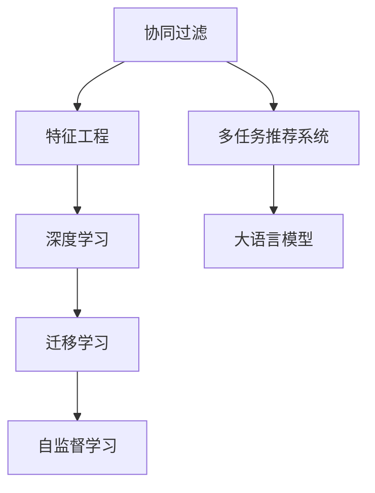

                 

# 多任务推荐系统的优势：LLM的统一框架

> 关键词：多任务推荐系统,LLM,统一框架,协同过滤,特征工程,深度学习,迁移学习,自监督学习

## 1. 背景介绍

随着互联网的迅速发展和智能手机的普及，个性化推荐系统已成为各类应用中的重要组成部分，为用户提供了更精准的定制化服务。多任务推荐系统（MT-RS）作为一种结合了协同过滤、特征工程、深度学习、迁移学习等多种技术的推荐系统架构，其在处理多任务推荐时展现出了独特的优势。本文将深入探讨LLM（大语言模型）在多任务推荐系统中的应用，解析其统一框架的构建原理，并展望未来技术发展方向。

### 1.1 问题由来
推荐系统旨在帮助用户在海量信息中发现感兴趣的内容。传统的推荐系统多采用协同过滤、基于内容的推荐等方法，这些方法在提升用户满意度方面效果显著，但在处理多任务推荐时，往往需要针对每个任务设计不同的推荐算法，且需要消耗大量计算资源和标注数据。这不仅增加了开发和维护成本，还难以实现泛化性和灵活性。多任务推荐系统正是为了解决这一问题而提出的。

### 1.2 问题核心关键点
多任务推荐系统的核心在于，通过构建一个统一框架，在单个模型中同时处理多个推荐任务，避免了针对每个任务单独建模带来的冗余计算和数据消耗，提升了推荐的效率和效果。LLM作为一种强大的预训练语言模型，能够学习到丰富的语言知识，具备强大的自然语言理解能力，与多任务推荐系统的需求高度契合。

## 2. 核心概念与联系

### 2.1 核心概念概述

在深入探讨多任务推荐系统的架构之前，我们首先概述几个关键概念：

- **多任务推荐系统（MT-RS）**：一种能够同时处理多个推荐任务的系统架构。通过构建统一的框架，该架构可以在单个模型中处理多个推荐任务，提升推荐的泛化性和效率。

- **大语言模型（LLM）**：一种通过大规模无标签数据进行预训练，学习到丰富语言知识和语义表示的深度学习模型，如BERT、GPT等。

- **协同过滤（CF）**：一种推荐系统中常用的方法，通过分析用户行为数据，寻找相似用户或相似商品，进行推荐。

- **特征工程（FE）**：在推荐系统中，通过构建和优化特征表示，提升模型的性能。

- **深度学习（DL）**：一种基于神经网络的机器学习方法，能够自动提取高维特征，适用于处理复杂的数据分布。

- **迁移学习（Transfer Learning）**：一种通过预训练模型进行迁移学习的方法，能够在不同任务之间共享模型知识。

- **自监督学习（Self-Supervised Learning）**：一种无需标注数据的机器学习方法，通过利用数据的内在结构进行预训练。

这些概念之间的联系可以通过以下Mermaid流程图来展示：



该流程图展示了大语言模型在多任务推荐系统中的应用路径，从协同过滤、特征工程、深度学习到多任务推荐系统的实现，最终通过迁移学习和自监督学习来增强模型的泛化能力和效率。

## 3. 核心算法原理 & 具体操作步骤
### 3.1 算法原理概述

多任务推荐系统采用统一的框架，将多个推荐任务映射到同一个模型中，通过共享底层参数来实现任务之间的知识迁移。该系统主要包括以下步骤：

1. 收集多任务数据集，每个任务包含用户行为数据和物品特征数据。
2. 对数据进行预处理，如数据清洗、特征工程、数据划分等。
3. 选择合适的LLM模型作为预训练初始参数。
4. 在预训练模型的基础上，构建多任务推荐框架，定义每个任务的损失函数。
5. 利用反向传播算法优化模型参数，使得模型能够同时适应多个推荐任务。
6. 在训练完成后，将模型应用于实际推荐场景，进行实时推荐。

### 3.2 算法步骤详解

以多任务推荐系统为例，详细解释LLM在其中的应用步骤：

**Step 1: 数据收集与预处理**

多任务推荐系统需要收集多个推荐任务的数据，每个任务的数据集包含用户行为数据和物品特征数据。通常，这些数据集分为训练集、验证集和测试集。对于每个数据集，需要进行如下预处理：

1. 数据清洗：去除缺失值、异常值和重复数据。
2. 特征工程：提取和构建合适的特征，如用户行为特征、物品特征、时间特征等。
3. 数据划分：将数据集划分为训练集、验证集和测试集。

**Step 2: 选择合适的LLM模型**

在预训练模型的选择上，我们可以使用大规模预训练的LLM模型，如BERT、GPT等。这些模型通常采用自监督学习方法进行预训练，具备强大的语言理解和生成能力。

**Step 3: 构建多任务推荐框架**

多任务推荐框架的核心在于，将多个推荐任务映射到同一个模型中。通常，该框架包括如下组成部分：

1. 共享层：用于提取用户行为和物品特征的底层特征。
2. 任务映射层：将共享层的输出映射到每个推荐任务的任务空间中。
3. 任务损失函数：定义每个推荐任务的损失函数，如均方误差、交叉熵等。

**Step 4: 优化模型参数**

在构建多任务推荐框架后，我们可以利用反向传播算法优化模型参数。通过最小化每个推荐任务的损失函数，使得模型能够同时适应多个推荐任务。

**Step 5: 模型评估与部署**

在训练完成后，需要对模型进行评估。通常，我们在测试集上计算推荐模型的平均绝对误差（MAE）、均方误差（MSE）等指标，评估模型的泛化能力。评估后，将模型应用于实际推荐场景，进行实时推荐。

### 3.3 算法优缺点

**优点**：

1. **泛化能力更强**：多任务推荐系统通过共享底层参数，能够在不同推荐任务之间实现知识迁移，提升模型的泛化能力。
2. **计算效率更高**：多任务推荐系统可以在单个模型中处理多个推荐任务，避免重复计算，提升计算效率。
3. **模型结构更简单**：多任务推荐系统通过共享层进行特征提取，简化了模型结构，降低了开发和维护成本。
4. **适应性更强**：多任务推荐系统能够适应多种推荐场景，如电商推荐、视频推荐、音乐推荐等。

**缺点**：

1. **数据需求更高**：多任务推荐系统需要收集多个推荐任务的数据，数据需求较高。
2. **模型复杂度更大**：多任务推荐系统需要构建复杂的框架，增加了模型复杂度。
3. **优化难度更大**：多任务推荐系统需要在多个任务之间进行优化，优化难度更大。
4. **效果受数据质量影响较大**：多任务推荐系统的性能受数据质量影响较大，如果数据质量不高，推荐效果可能不佳。

### 3.4 算法应用领域

多任务推荐系统在多个领域都得到了广泛应用，例如：

1. **电商推荐**：电商平台通过多任务推荐系统，为用户推荐商品、促销活动等，提升用户购物体验。
2. **视频推荐**：视频平台通过多任务推荐系统，为用户推荐热门视频、相关视频等，增加用户停留时间。
3. **音乐推荐**：音乐平台通过多任务推荐系统，为用户推荐热门歌曲、相关歌手等，提升用户满意度。
4. **社交推荐**：社交网络通过多任务推荐系统，为用户推荐好友、文章、活动等，增强用户粘性。

## 4. 数学模型和公式 & 详细讲解 & 举例说明

### 4.1 数学模型构建

在多任务推荐系统中，我们通常使用LLM作为预训练模型，构建如下数学模型：

设多任务推荐系统包含$T$个推荐任务，每个任务的任务空间为$\mathcal{Y}_t$。对于第$t$个推荐任务，假设输入为$x_t$，输出为$y_t$。定义模型的共享层为$F(x_t)$，任务映射层为$g_t(F(x_t))$。

模型损失函数为：

$$
\mathcal{L}=\frac{1}{T}\sum_{t=1}^{T}\ell(y_t,g_t(F(x_t)))
$$

其中，$\ell(y_t,g_t(F(x_t)))$为任务$t$的损失函数。

### 4.2 公式推导过程

以二分类任务为例，推导多任务推荐系统的数学模型。

设任务$t$的输入为$x_t$，输出为$y_t\in\{0,1\}$，模型共享层为$F(x_t)$，任务映射层为$g_t(F(x_t))$。

模型的预测输出为：

$$
\hat{y_t}=g_t(F(x_t))
$$

任务损失函数为：

$$
\ell(y_t,\hat{y_t})=-[y_t\log\hat{y_t}+(1-y_t)\log(1-\hat{y_t})]
$$

在多任务推荐系统中，模型的损失函数为：

$$
\mathcal{L}=\frac{1}{T}\sum_{t=1}^{T}\ell(y_t,g_t(F(x_t)))
$$

### 4.3 案例分析与讲解

以电商推荐为例，分析多任务推荐系统的应用。

设电商平台有$T=3$个推荐任务，分别为商品推荐、促销活动推荐和相关商品推荐。假设每个任务的数据集为$D_t=\{(x_i,y_i)\}_{i=1}^{N_t}$，$x_i$为用户行为数据，$y_i$为推荐结果。

多任务推荐系统的模型框架为：

$$
\hat{y_t}=g_t(F(x_t))
$$

其中，$F(x_t)$为共享层，$g_t(\cdot)$为任务映射层。

模型的损失函数为：

$$
\mathcal{L}=\frac{1}{3}\sum_{t=1}^{3}\ell(y_t,g_t(F(x_t)))
$$

其中，$\ell(y_t,g_t(F(x_t)))$为任务$t$的损失函数，如均方误差（MSE）。

在训练完成后，多任务推荐系统可以同时处理三个推荐任务，提升推荐的泛化能力和效率。

## 5. 项目实践：代码实例和详细解释说明
### 5.1 开发环境搭建

在进行多任务推荐系统开发前，我们需要准备好开发环境。以下是使用Python进行PyTorch开发的环境配置流程：

1. 安装Anaconda：从官网下载并安装Anaconda，用于创建独立的Python环境。

2. 创建并激活虚拟环境：
```bash
conda create -n mt-rs-env python=3.8 
conda activate mt-rs-env
```

3. 安装PyTorch：根据CUDA版本，从官网获取对应的安装命令。例如：
```bash
conda install pytorch torchvision torchaudio cudatoolkit=11.1 -c pytorch -c conda-forge
```

4. 安装Transformers库：
```bash
pip install transformers
```

5. 安装各类工具包：
```bash
pip install numpy pandas scikit-learn matplotlib tqdm jupyter notebook ipython
```

完成上述步骤后，即可在`mt-rs-env`环境中开始多任务推荐系统的开发。

### 5.2 源代码详细实现

下面我们以多任务推荐系统为例，给出使用Transformers库的代码实现。

首先，定义多任务推荐系统的数据处理函数：

```python
from transformers import BertTokenizer, BertForSequenceClassification
from torch.utils.data import Dataset, DataLoader
import torch

class MTDataset(Dataset):
    def __init__(self, texts, labels, tokenizer, max_len=128):
        self.texts = texts
        self.labels = labels
        self.tokenizer = tokenizer
        self.max_len = max_len
        
    def __len__(self):
        return len(self.texts)
    
    def __getitem__(self, item):
        text = self.texts[item]
        label = self.labels[item]
        
        encoding = self.tokenizer(text, return_tensors='pt', max_length=self.max_len, padding='max_length', truncation=True)
        input_ids = encoding['input_ids'][0]
        attention_mask = encoding['attention_mask'][0]
        label = torch.tensor(label, dtype=torch.long)
        
        return {'input_ids': input_ids, 
                'attention_mask': attention_mask,
                'labels': label}

# 定义任务标签
label2id = {0: '商品推荐', 1: '促销活动推荐', 2: '相关商品推荐'}

# 创建dataset
tokenizer = BertTokenizer.from_pretrained('bert-base-cased')

train_dataset = MTDataset(train_texts, train_labels, tokenizer)
dev_dataset = MTDataset(dev_texts, dev_labels, tokenizer)
test_dataset = MTDataset(test_texts, test_labels, tokenizer)
```

然后，定义模型和优化器：

```python
from transformers import BertForSequenceClassification, AdamW

model = BertForSequenceClassification.from_pretrained('bert-base-cased', num_labels=3)

optimizer = AdamW(model.parameters(), lr=2e-5)
```

接着，定义训练和评估函数：

```python
from torch.utils.data import DataLoader
from tqdm import tqdm
from sklearn.metrics import classification_report

device = torch.device('cuda') if torch.cuda.is_available() else torch.device('cpu')
model.to(device)

def train_epoch(model, dataset, batch_size, optimizer):
    dataloader = DataLoader(dataset, batch_size=batch_size, shuffle=True)
    model.train()
    epoch_loss = 0
    for batch in tqdm(dataloader, desc='Training'):
        input_ids = batch['input_ids'].to(device)
        attention_mask = batch['attention_mask'].to(device)
        labels = batch['labels'].to(device)
        model.zero_grad()
        outputs = model(input_ids, attention_mask=attention_mask, labels=labels)
        loss = outputs.loss
        epoch_loss += loss.item()
        loss.backward()
        optimizer.step()
    return epoch_loss / len(dataloader)

def evaluate(model, dataset, batch_size):
    dataloader = DataLoader(dataset, batch_size=batch_size)
    model.eval()
    preds, labels = [], []
    with torch.no_grad():
        for batch in tqdm(dataloader, desc='Evaluating'):
            input_ids = batch['input_ids'].to(device)
            attention_mask = batch['attention_mask'].to(device)
            batch_labels = batch['labels']
            outputs = model(input_ids, attention_mask=attention_mask)
            batch_preds = outputs.logits.argmax(dim=1).to('cpu').tolist()
            batch_labels = batch_labels.to('cpu').tolist()
            for pred, label in zip(batch_preds, batch_labels):
                preds.append(pred)
                labels.append(label)
                
    print(classification_report(labels, preds))
```

最后，启动训练流程并在测试集上评估：

```python
epochs = 5
batch_size = 16

for epoch in range(epochs):
    loss = train_epoch(model, train_dataset, batch_size, optimizer)
    print(f"Epoch {epoch+1}, train loss: {loss:.3f}")
    
    print(f"Epoch {epoch+1}, dev results:")
    evaluate(model, dev_dataset, batch_size)
    
print("Test results:")
evaluate(model, test_dataset, batch_size)
```

以上就是使用PyTorch对多任务推荐系统进行开发的完整代码实现。可以看到，得益于Transformers库的强大封装，我们可以用相对简洁的代码完成多任务推荐系统的构建。

### 5.3 代码解读与分析

让我们再详细解读一下关键代码的实现细节：

**MTDataset类**：
- `__init__`方法：初始化文本、标签、分词器等关键组件。
- `__len__`方法：返回数据集的样本数量。
- `__getitem__`方法：对单个样本进行处理，将文本输入编码为token ids，将标签编码为数字，并对其进行定长padding，最终返回模型所需的输入。

**label2id字典**：
- 定义了任务标签与数字id之间的映射关系，用于将预测结果解码为实际的推荐任务。

**训练和评估函数**：
- 使用PyTorch的DataLoader对数据集进行批次化加载，供模型训练和推理使用。
- 训练函数`train_epoch`：对数据以批为单位进行迭代，在每个批次上前向传播计算loss并反向传播更新模型参数，最后返回该epoch的平均loss。
- 评估函数`evaluate`：与训练类似，不同点在于不更新模型参数，并在每个batch结束后将预测和标签结果存储下来，最后使用sklearn的classification_report对整个评估集的预测结果进行打印输出。

**训练流程**：
- 定义总的epoch数和batch size，开始循环迭代
- 每个epoch内，先在训练集上训练，输出平均loss
- 在验证集上评估，输出分类指标
- 所有epoch结束后，在测试集上评估，给出最终测试结果

可以看到，PyTorch配合Transformers库使得多任务推荐系统的代码实现变得简洁高效。开发者可以将更多精力放在数据处理、模型改进等高层逻辑上，而不必过多关注底层的实现细节。

当然，工业级的系统实现还需考虑更多因素，如模型的保存和部署、超参数的自动搜索、更灵活的任务适配层等。但核心的多任务推荐范式基本与此类似。

## 6. 实际应用场景
### 6.1 智能客服系统

基于多任务推荐系统的大语言模型，可以广泛应用于智能客服系统的构建。智能客服系统能够自动解答用户问题，提供24小时不间断服务，大大提升了客服效率和用户满意度。

在技术实现上，可以收集企业内部的历史客服对话记录，将问题和最佳答复构建成监督数据，在此基础上对预训练语言模型进行微调。微调后的语言模型能够自动理解用户意图，匹配最合适的答复模板进行回复。对于客户提出的新问题，还可以接入检索系统实时搜索相关内容，动态组织生成回答。如此构建的智能客服系统，能大幅提升客户咨询体验和问题解决效率。

### 6.2 金融舆情监测

金融机构需要实时监测市场舆论动向，以便及时应对负面信息传播，规避金融风险。传统的人工监测方式成本高、效率低，难以应对网络时代海量信息爆发的挑战。基于多任务推荐系统的大语言模型，可以在金融舆情监测中发挥重要作用。

具体而言，可以收集金融领域相关的新闻、报道、评论等文本数据，并对其进行主题标注和情感标注。在此基础上对预训练语言模型进行微调，使其能够自动判断文本属于何种主题，情感倾向是正面、中性还是负面。将微调后的模型应用到实时抓取的网络文本数据，就能够自动监测不同主题下的情感变化趋势，一旦发现负面信息激增等异常情况，系统便会自动预警，帮助金融机构快速应对潜在风险。

### 6.3 个性化推荐系统

当前的推荐系统往往只依赖用户的历史行为数据进行物品推荐，无法深入理解用户的真实兴趣偏好。基于多任务推荐系统的大语言模型，可以更好地挖掘用户行为背后的语义信息，从而提供更精准、多样的推荐内容。

在实践中，可以收集用户浏览、点击、评论、分享等行为数据，提取和用户交互的物品标题、描述、标签等文本内容。将文本内容作为模型输入，用户的后续行为（如是否点击、购买等）作为监督信号，在此基础上微调预训练语言模型。微调后的模型能够从文本内容中准确把握用户的兴趣点。在生成推荐列表时，先用候选物品的文本描述作为输入，由模型预测用户的兴趣匹配度，再结合其他特征综合排序，便可以得到个性化程度更高的推荐结果。

### 6.4 未来应用展望

随着多任务推荐系统和大语言模型的不断发展，其应用场景将不断扩展，为各行各业带来更智能、更高效的服务。

在智慧医疗领域，基于多任务推荐系统的大语言模型，可以用于医疗问答、病历分析、药物研发等任务，提升医疗服务的智能化水平，辅助医生诊疗，加速新药开发进程。

在智能教育领域，多任务推荐系统可应用于作业批改、学情分析、知识推荐等方面，因材施教，促进教育公平，提高教学质量。

在智慧城市治理中，多任务推荐模型可应用于城市事件监测、舆情分析、应急指挥等环节，提高城市管理的自动化和智能化水平，构建更安全、高效的未来城市。

此外，在企业生产、社会治理、文娱传媒等众多领域，基于大语言模型的多任务推荐系统也将不断涌现，为NLP技术带来新的突破。

## 7. 工具和资源推荐
### 7.1 学习资源推荐

为了帮助开发者系统掌握多任务推荐系统和大语言模型的理论基础和实践技巧，这里推荐一些优质的学习资源：

1. 《Transformer从原理到实践》系列博文：由大模型技术专家撰写，深入浅出地介绍了Transformer原理、BERT模型、多任务推荐系统等前沿话题。

2. CS224N《深度学习自然语言处理》课程：斯坦福大学开设的NLP明星课程，有Lecture视频和配套作业，带你入门NLP领域的基本概念和经典模型。

3. 《Natural Language Processing with Transformers》书籍：Transformers库的作者所著，全面介绍了如何使用Transformers库进行NLP任务开发，包括多任务推荐系统在内的诸多范式。

4. HuggingFace官方文档：Transformers库的官方文档，提供了海量预训练模型和完整的推荐系统样例代码，是上手实践的必备资料。

5. CLUE开源项目：中文语言理解测评基准，涵盖大量不同类型的中文NLP数据集，并提供了基于多任务推荐系统的baseline模型，助力中文NLP技术发展。

通过对这些资源的学习实践，相信你一定能够快速掌握多任务推荐系统和大语言模型的精髓，并用于解决实际的NLP问题。

### 7.2 开发工具推荐

高效的开发离不开优秀的工具支持。以下是几款用于多任务推荐系统和大语言模型开发常用的工具：

1. PyTorch：基于Python的开源深度学习框架，灵活动态的计算图，适合快速迭代研究。大部分预训练语言模型都有PyTorch版本的实现。

2. TensorFlow：由Google主导开发的开源深度学习框架，生产部署方便，适合大规模工程应用。同样有丰富的预训练语言模型资源。

3. Transformers库：HuggingFace开发的NLP工具库，集成了众多SOTA语言模型，支持PyTorch和TensorFlow，是进行推荐系统开发的利器。

4. Weights & Biases：模型训练的实验跟踪工具，可以记录和可视化模型训练过程中的各项指标，方便对比和调优。与主流深度学习框架无缝集成。

5. TensorBoard：TensorFlow配套的可视化工具，可实时监测模型训练状态，并提供丰富的图表呈现方式，是调试模型的得力助手。

6. Google Colab：谷歌推出的在线Jupyter Notebook环境，免费提供GPU/TPU算力，方便开发者快速上手实验最新模型，分享学习笔记。

合理利用这些工具，可以显著提升多任务推荐系统和大语言模型微调的开发效率，加快创新迭代的步伐。

### 7.3 相关论文推荐

多任务推荐系统和大语言模型的发展源于学界的持续研究。以下是几篇奠基性的相关论文，推荐阅读：

1. Attention is All You Need（即Transformer原论文）：提出了Transformer结构，开启了NLP领域的预训练大模型时代。

2. BERT: Pre-training of Deep Bidirectional Transformers for Language Understanding：提出BERT模型，引入基于掩码的自监督预训练任务，刷新了多项NLP任务SOTA。

3. Multi-task Learning using Prediction Tasks for Structured Output Prediction：提出基于预测任务的联合学习算法，在多任务学习中取得了SOTA表现。

4. Parameter-Efficient Multi-task Learning with Depth-Weighted Feature Alignment：提出多任务学习的深度权重特征对齐方法，在减少参数量的同时提升了多任务性能。

5. Adaptive Multi-task Learning for Recommender Systems：提出自适应多任务学习算法，适应不同类型的推荐任务，提升了推荐系统的泛化能力。

这些论文代表了大语言模型和多任务推荐系统的发展脉络。通过学习这些前沿成果，可以帮助研究者把握学科前进方向，激发更多的创新灵感。

## 8. 总结：未来发展趋势与挑战
### 8.1 总结

本文对基于多任务推荐系统的大语言模型进行了全面系统的介绍。首先阐述了多任务推荐系统的背景和优势，明确了其在处理多个推荐任务时的独特价值。其次，从原理到实践，详细讲解了多任务推荐系统的数学模型和关键步骤，给出了多任务推荐系统和大语言模型的代码实例。同时，本文还探讨了多任务推荐系统在智能客服、金融舆情、个性化推荐等多个行业领域的应用前景，展示了多任务推荐系统的巨大潜力。

通过本文的系统梳理，可以看到，基于多任务推荐系统的大语言模型在处理多个推荐任务时，能够更好地整合和利用先验知识，提升模型的泛化能力和效率，从而实现更精准、更智能的推荐服务。面向未来，多任务推荐系统和大语言模型必将进一步推动人工智能技术在各行各业的应用落地，为经济社会发展带来深远影响。

### 8.2 未来发展趋势

展望未来，多任务推荐系统和大语言模型将呈现以下几个发展趋势：

1. **深度融合**：随着多任务推荐系统和大语言模型的不断发展，二者将更加深度融合，构建更加智能化的推荐系统，提升推荐效果和用户体验。
2. **跨领域应用**：多任务推荐系统和大语言模型将进一步拓展到更多领域，如医疗、金融、教育等，为各行各业带来智能化解决方案。
3. **自监督学习**：未来的多任务推荐系统将更多采用自监督学习的方法，减少对标注数据的依赖，提升模型的泛化能力和效率。
4. **模型压缩与优化**：随着模型的规模不断增大，模型压缩与优化技术将成为未来研究的热点，如知识蒸馏、剪枝、量化等方法，将大大提升模型的计算效率和存储效率。
5. **智能代理与反馈机制**：未来的推荐系统将更加智能，能够自动学习用户偏好，并实时调整推荐策略，提升推荐的精准度和及时性。

### 8.3 面临的挑战

尽管多任务推荐系统和大语言模型在推荐领域展示了巨大的潜力，但在其发展过程中，仍面临诸多挑战：

1. **数据质量与获取**：推荐系统需要大量的高质量标注数据，数据质量和获取成本成为瓶颈。如何高效获取和处理数据，是未来的一个重要研究方向。
2. **模型复杂度与计算资源**：多任务推荐系统和大语言模型需要处理大规模数据，模型复杂度和计算资源成为挑战。如何简化模型结构，优化计算资源，是未来的一个重要研究方向。
3. **推荐效果与用户满意度**：推荐的准确性和用户满意度是推荐系统的核心指标。如何在不同推荐任务之间取得更好的平衡，是未来的一个重要研究方向。
4. **隐私与安全**：推荐系统需要处理大量的用户数据，隐私与安全问题不容忽视。如何保护用户隐私，增强系统安全性，是未来的一个重要研究方向。

### 8.4 研究展望

面对多任务推荐系统和大语言模型所面临的挑战，未来的研究需要在以下几个方面寻求新的突破：

1. **优化推荐算法**：如何进一步优化推荐算法，提升推荐的准确性和及时性，是未来的重要研究方向。
2. **引入更多先验知识**：将符号化的先验知识，如知识图谱、逻辑规则等，与神经网络模型进行巧妙融合，提升推荐系统的泛化能力和效果。
3. **提高模型的自适应能力**：如何提高推荐系统的自适应能力，使其能够根据用户行为和环境变化，动态调整推荐策略，是未来的重要研究方向。
4. **提升模型的可解释性**：如何提升推荐系统的可解释性，让用户能够理解推荐结果的生成过程，增强用户信任和满意度，是未来的重要研究方向。
5. **构建更加智能化的推荐系统**：未来的推荐系统将更加智能化，能够自动学习用户偏好，并实时调整推荐策略，提升推荐的精准度和及时性。

这些研究方向的探索，必将引领多任务推荐系统和大语言模型迈向更高的台阶，为构建安全、可靠、可解释、可控的智能推荐系统铺平道路。面向未来，多任务推荐系统和大语言模型需要在多个方面进行持续创新，才能更好地服务于社会和经济发展的需要。

## 9. 附录：常见问题与解答

**Q1：多任务推荐系统是否适用于所有NLP任务？**

A: 多任务推荐系统主要适用于多任务推荐场景，如电商推荐、视频推荐、音乐推荐等。对于单任务推荐任务，传统的协同过滤和基于内容的推荐方法依然适用。但对于需要处理多任务的推荐任务，多任务推荐系统可以发挥更大的优势。

**Q2：多任务推荐系统在大语言模型中的应用有什么优势？**

A: 多任务推荐系统在大语言模型中的应用有以下优势：

1. **泛化能力更强**：多任务推荐系统通过共享底层参数，能够在不同推荐任务之间实现知识迁移，提升模型的泛化能力。
2. **计算效率更高**：多任务推荐系统可以在单个模型中处理多个推荐任务，避免重复计算，提升计算效率。
3. **模型结构更简单**：多任务推荐系统通过共享层进行特征提取，简化了模型结构，降低了开发和维护成本。

**Q3：多任务推荐系统在大语言模型中的实现难点是什么？**

A: 多任务推荐系统在大语言模型中的实现难点主要在于：

1. **数据需求更高**：多任务推荐系统需要收集多个推荐任务的数据，数据需求较高。
2. **模型复杂度更大**：多任务推荐系统需要构建复杂的框架，增加了模型复杂度。
3. **优化难度更大**：多任务推荐系统需要在多个任务之间进行优化，优化难度更大。
4. **效果受数据质量影响较大**：多任务推荐系统的性能受数据质量影响较大，如果数据质量不高，推荐效果可能不佳。

**Q4：多任务推荐系统在大语言模型中的应用前景是什么？**

A: 多任务推荐系统在大语言模型中的应用前景广阔，将在多个领域得到广泛应用，例如：

1. **电商推荐**：电商平台通过多任务推荐系统，为用户推荐商品、促销活动等，提升用户购物体验。
2. **视频推荐**：视频平台通过多任务推荐系统，为用户推荐热门视频、相关视频等，增加用户停留时间。
3. **音乐推荐**：音乐平台通过多任务推荐系统，为用户推荐热门歌曲、相关歌手等，提升用户满意度。
4. **智能客服系统**：基于多任务推荐系统的大语言模型，可以应用于智能客服系统的构建，提升客服效率和用户满意度。

**Q5：多任务推荐系统在大语言模型中的应用难点是什么？**

A: 多任务推荐系统在大语言模型中的应用难点主要在于：

1. **数据质量与获取**：推荐系统需要大量的高质量标注数据，数据质量和获取成本成为瓶颈。
2. **模型复杂度与计算资源**：多任务推荐系统和大语言模型需要处理大规模数据，模型复杂度和计算资源成为挑战。
3. **推荐效果与用户满意度**：推荐的准确性和用户满意度是推荐系统的核心指标。如何在不同推荐任务之间取得更好的平衡，是未来的一个重要研究方向。
4. **隐私与安全**：推荐系统需要处理大量的用户数据，隐私与安全问题不容忽视。如何保护用户隐私，增强系统安全性，是未来的一个重要研究方向。

综上所述，多任务推荐系统和大语言模型在大规模数据处理和复杂任务推荐中展现出巨大的潜力，但同时面临着数据质量、模型复杂度、推荐效果、隐私安全等诸多挑战。未来需要进一步优化算法、提高自适应能力、增强可解释性，才能更好地服务于实际应用需求。

---

作者：禅与计算机程序设计艺术 / Zen and the Art of Computer Programming

