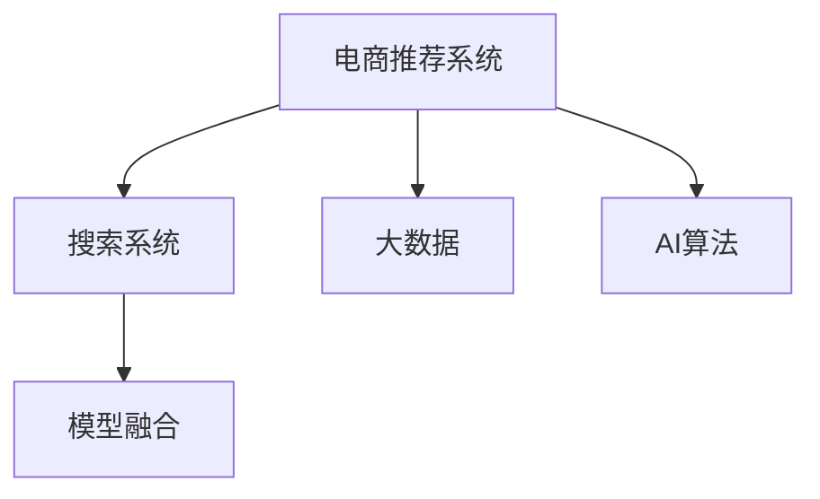

                 

# 大数据与AI 驱动的电商推荐：搜索系统是核心，模型融合是关键

## 1. 背景介绍

随着互联网技术的发展，电商行业已经逐渐成为互联网的重要支柱之一。据相关统计，全球电商交易额已经突破10万亿美元。电商行业不仅在规模上实现了快速增长，同时也催生了大量的技术需求。在大数据和人工智能技术的驱动下，电商推荐系统成为了电商技术应用的重要方向。

推荐系统不仅可以提升用户体验，增加用户粘性，同时还能大大提高电商平台的转化率。特别是在用户浏览商品时，推荐系统能够提供符合用户兴趣的商品，缩短用户选购时间，提高电商平台的经营效率。

然而，随着电商平台的用户规模和商品种类的不断增加，推荐系统的复杂度也在不断提升。现有的推荐系统主要依赖于传统的机器学习模型和深度学习模型，如线性回归、决策树、协同过滤、矩阵分解等，这些模型往往需要大量标注数据，难以在大规模数据上发挥作用。因此，电商推荐系统亟需一种能够在大规模数据上高效运行，同时又能处理复杂场景的推荐方法。

## 2. 核心概念与联系

### 2.1 核心概念概述

为了更好地理解电商推荐系统的原理和应用，本节将介绍几个关键概念：

- 电商推荐系统（E-commerce Recommendation System）：指利用机器学习、深度学习等技术，为用户提供个性化商品推荐，提升用户体验和平台转化率的系统。
- 搜索系统（Search System）：指用于处理用户查询、返回相关搜索结果的系统，是电商推荐系统的重要组成部分。
- 模型融合（Model Fusion）：指将多种推荐模型结合使用，发挥各自优势，提升整体推荐效果的技术手段。
- 大数据（Big Data）：指海量、多源、复杂的数据集合，电商推荐系统需要处理大规模用户行为数据、商品数据等，因此对大数据处理技术有较高要求。
- AI算法（AI Algorithm）：指基于人工智能的算法，如深度学习、强化学习、迁移学习等，这些算法在大数据处理和推荐系统中的应用逐渐增多。

这些核心概念之间的关系可以通过以下Mermaid流程图来展示：



这个流程图展示了大数据与AI算法对电商推荐系统的核心作用，以及搜索系统与模型融合在推荐过程中的关键作用。

### 2.2 核心概念原理和架构

#### 2.2.1 电商推荐系统

电商推荐系统主要由数据收集、用户行为分析、推荐模型训练、推荐结果呈现等模块构成。

- 数据收集：收集用户浏览记录、购买记录、评分记录等，构建用户行为数据集。
- 用户行为分析：对用户行为数据进行分析，构建用户画像，获取用户兴趣偏好。
- 推荐模型训练：构建推荐模型，如协同过滤模型、基于内容的推荐模型、深度学习模型等，对用户行为数据进行训练，得到推荐结果。
- 推荐结果呈现：将推荐结果呈现给用户，并提供相关性评估、用户反馈等功能。

#### 2.2.2 搜索系统

搜索系统主要用于处理用户查询，返回相关搜索结果，是电商推荐系统的重要组成部分。搜索系统主要由搜索引擎、查询结果处理、查询反馈等模块构成。

- 搜索引擎：解析用户查询，生成查询向量，匹配相关商品。
- 查询结果处理：对搜索结果进行排序、去重、分页等处理，构建搜索结果页面。
- 查询反馈：收集用户对搜索结果的反馈，优化搜索效果。

#### 2.2.3 模型融合

模型融合是提升推荐系统效果的重要手段。模型融合通常采用多种推荐算法结合的方式，如基于内容的推荐与协同过滤结合，深度学习模型与传统机器学习模型结合等。模型融合的目的是利用多种模型的优点，提升推荐系统的整体性能。

## 3. 核心算法原理 & 具体操作步骤

### 3.1 算法原理概述

电商推荐系统通常采用基于协同过滤和基于内容的推荐方法。协同过滤是指通过分析用户之间的相似性，为用户推荐与已喜欢的商品相似的商品。基于内容的推荐是指通过分析商品的属性和用户偏好，为用户推荐满足其兴趣的商品。此外，深度学习模型也被广泛应用于电商推荐系统中，通过神经网络模型对用户行为数据进行建模，得到更准确的推荐结果。

#### 3.1.1 协同过滤

协同过滤基于用户之间的相似性，为用户推荐与已喜欢的商品相似的商品。协同过滤主要分为基于用户的协同过滤和基于物品的协同过滤两种方法。

- 基于用户的协同过滤：通过对用户之间的相似性进行分析，为用户推荐与已喜欢的商品相似的商品。
- 基于物品的协同过滤：通过对物品之间的相似性进行分析，为用户推荐与已喜欢的商品相似的商品。

#### 3.1.2 基于内容的推荐

基于内容的推荐是指通过分析商品的属性和用户偏好，为用户推荐满足其兴趣的商品。基于内容的推荐通常采用用户-商品矩阵的方式，通过计算用户与商品的相似度，为用户推荐相似的商品。

#### 3.1.3 深度学习模型

深度学习模型通过神经网络模型对用户行为数据进行建模，得到更准确的推荐结果。常用的深度学习模型包括深度神经网络（DNN）、卷积神经网络（CNN）、循环神经网络（RNN）等。

### 3.2 算法步骤详解

#### 3.2.1 数据收集和预处理

电商推荐系统需要处理大规模的用户行为数据、商品数据等，因此对大数据处理技术有较高要求。数据收集和预处理是电商推荐系统的第一步，主要包括数据收集、数据清洗、数据转换等步骤。

- 数据收集：通过爬虫、API接口等方式收集用户行为数据、商品数据等。
- 数据清洗：去除数据中的噪音和异常值，保证数据的准确性和一致性。
- 数据转换：将数据转换为可用于训练和推荐的形式，如将文本数据转换为向量表示。

#### 3.2.2 用户行为分析

用户行为分析是电商推荐系统的核心部分。通过分析用户行为数据，构建用户画像，获取用户兴趣偏好。常用的用户行为分析方法包括TF-IDF、协同过滤等。

- TF-IDF：通过计算词频和逆文档频率，提取文本数据的特征。
- 协同过滤：通过分析用户之间的相似性，为用户推荐与已喜欢的商品相似的商品。

#### 3.2.3 推荐模型训练

推荐模型训练是电商推荐系统的关键部分。通过构建推荐模型，对用户行为数据进行训练，得到推荐结果。常用的推荐模型包括协同过滤模型、基于内容的推荐模型、深度学习模型等。

- 协同过滤模型：通过分析用户之间的相似性，为用户推荐与已喜欢的商品相似的商品。
- 基于内容的推荐模型：通过分析商品的属性和用户偏好，为用户推荐满足其兴趣的商品。
- 深度学习模型：通过神经网络模型对用户行为数据进行建模，得到更准确的推荐结果。

#### 3.2.4 推荐结果呈现

推荐结果呈现是将推荐结果呈现给用户，并提供相关性评估、用户反馈等功能。常用的推荐结果呈现方式包括推荐列表、推荐页、推荐广告等。

- 推荐列表：将推荐结果以列表形式呈现给用户，方便用户浏览和选择。
- 推荐页：将推荐结果呈现在一个独立的页面中，用户可以进行更详细的浏览和选择。
- 推荐广告：在搜索结果页面或商品详情页中插入推荐广告，引导用户点击。

### 3.3 算法优缺点

#### 3.3.1 协同过滤

协同过滤的优点在于能够有效利用用户之间的相似性，为用户推荐与已喜欢的商品相似的商品。协同过滤适用于用户基数较大、商品种类较少的电商场景。

协同过滤的缺点在于需要大量的用户行为数据，对用户行为数据的收集和分析要求较高。此外，协同过滤还容易受到冷启动问题的困扰，即对于新用户或新商品，协同过滤的效果较差。

#### 3.3.2 基于内容的推荐

基于内容的推荐适用于用户基数较小、商品种类较多的电商场景。基于内容的推荐能够通过商品的属性和用户偏好，为用户推荐满足其兴趣的商品。

基于内容的推荐的缺点在于需要较多的商品属性数据，对商品属性的收集和分析要求较高。此外，基于内容的推荐对商品的语义表示要求较高，不同的商品属性数据表示方式不同，可能会影响推荐效果。

#### 3.3.3 深度学习模型

深度学习模型适用于电商推荐系统的全场景，能够处理大规模用户行为数据和商品数据，具有较高的推荐效果。深度学习模型对数据量的要求较高，需要较多的标注数据进行训练。

深度学习模型的缺点在于模型复杂度较高，训练时间长，对计算资源的要求较高。此外，深度学习模型的可解释性较差，难以解释推荐结果的逻辑和原因。

### 3.4 算法应用领域

#### 3.4.1 个性化推荐

个性化推荐是电商推荐系统的重要应用领域，通过分析用户行为数据和商品数据，为用户推荐个性化的商品，提升用户体验和平台转化率。

#### 3.4.2 商品搜索

商品搜索是电商推荐系统的重要组成部分，通过搜索系统，用户可以方便地找到所需的商品。搜索系统通常采用搜索引擎技术，如倒排索引、布尔查询等。

#### 3.4.3 广告推荐

广告推荐是电商推荐系统的重要应用领域，通过分析用户行为数据和商品数据，为用户推荐合适的广告，提升广告的点击率和转化率。

## 4. 数学模型和公式 & 详细讲解

### 4.1 数学模型构建

电商推荐系统通常采用基于协同过滤和基于内容的推荐方法。协同过滤和基于内容的推荐通常采用向量空间模型（VSM）进行建模。

#### 4.1.1 协同过滤

协同过滤主要采用向量空间模型进行建模。向量空间模型将用户和商品表示为向量，通过计算用户和商品的相似度，为用户推荐与已喜欢的商品相似的商品。

设用户向量为 $u$，商品向量为 $i$，则用户与商品的相似度可以通过余弦相似度计算得到：

$$
\cos(u, i) = \frac{\sum_{j=1}^{n}u_j i_j}{\sqrt{\sum_{j=1}^{n}u_j^2} \sqrt{\sum_{j=1}^{n}i_j^2}}
$$

其中 $n$ 为向量的维数，$u_j$ 和 $i_j$ 分别为用户和商品的特征。

#### 4.1.2 基于内容的推荐

基于内容的推荐通常采用向量空间模型进行建模。向量空间模型将商品表示为向量，通过计算用户和商品的相似度，为用户推荐与已喜欢的商品相似的商品。

设商品向量为 $i$，用户向量为 $u$，则用户与商品的相似度可以通过余弦相似度计算得到：

$$
\cos(u, i) = \frac{\sum_{j=1}^{n}u_j i_j}{\sqrt{\sum_{j=1}^{n}u_j^2} \sqrt{\sum_{j=1}^{n}i_j^2}}
$$

其中 $n$ 为向量的维数，$u_j$ 和 $i_j$ 分别为用户和商品的特征。

### 4.2 公式推导过程

#### 4.2.1 协同过滤

协同过滤的向量空间模型基于用户与商品之间的相似度计算。设用户 $u$ 的向量表示为 $u = (u_1, u_2, ..., u_n)$，商品 $i$ 的向量表示为 $i = (i_1, i_2, ..., i_n)$。则用户与商品的相似度可以通过余弦相似度计算得到：

$$
\cos(u, i) = \frac{\sum_{j=1}^{n}u_j i_j}{\sqrt{\sum_{j=1}^{n}u_j^2} \sqrt{\sum_{j=1}^{n}i_j^2}}
$$

设用户向量为 $u$，商品向量为 $i$，则用户与商品的相似度可以通过余弦相似度计算得到：

$$
\cos(u, i) = \frac{\sum_{j=1}^{n}u_j i_j}{\sqrt{\sum_{j=1}^{n}u_j^2} \sqrt{\sum_{j=1}^{n}i_j^2}}
$$

其中 $n$ 为向量的维数，$u_j$ 和 $i_j$ 分别为用户和商品的特征。

#### 4.2.2 基于内容的推荐

基于内容的推荐通常采用向量空间模型进行建模。向量空间模型将商品表示为向量，通过计算用户和商品的相似度，为用户推荐与已喜欢的商品相似的商品。

设商品向量为 $i$，用户向量为 $u$，则用户与商品的相似度可以通过余弦相似度计算得到：

$$
\cos(u, i) = \frac{\sum_{j=1}^{n}u_j i_j}{\sqrt{\sum_{j=1}^{n}u_j^2} \sqrt{\sum_{j=1}^{n}i_j^2}}
$$

其中 $n$ 为向量的维数，$u_j$ 和 $i_j$ 分别为用户和商品的特征。

### 4.3 案例分析与讲解

#### 4.3.1 协同过滤案例

某电商平台有用户 $u$ 和商品 $i$，设用户向量为 $u = (3, 5, 2)$，商品向量为 $i = (2, 4, 6)$。则用户与商品的相似度可以通过余弦相似度计算得到：

$$
\cos(u, i) = \frac{\sum_{j=1}^{3}u_j i_j}{\sqrt{\sum_{j=1}^{3}u_j^2} \sqrt{\sum_{j=1}^{3}i_j^2}} = \frac{3 \times 2 + 5 \times 4 + 2 \times 6}{\sqrt{3^2 + 5^2 + 2^2} \sqrt{2^2 + 4^2 + 6^2}} = \frac{20}{\sqrt{29} \sqrt{44}} = \frac{20}{\sqrt{1116}} = 0.4957
$$

则用户与商品的相似度为0.4957。根据协同过滤的推荐原则，为用户 $u$ 推荐与商品 $i$ 相似的商品。

#### 4.3.2 基于内容的推荐案例

某电商平台有用户 $u$ 和商品 $i$，设用户向量为 $u = (3, 5, 2)$，商品向量为 $i = (2, 4, 6)$。则用户与商品的相似度可以通过余弦相似度计算得到：

$$
\cos(u, i) = \frac{\sum_{j=1}^{3}u_j i_j}{\sqrt{\sum_{j=1}^{3}u_j^2} \sqrt{\sum_{j=1}^{3}i_j^2}} = \frac{3 \times 2 + 5 \times 4 + 2 \times 6}{\sqrt{3^2 + 5^2 + 2^2} \sqrt{2^2 + 4^2 + 6^2}} = \frac{20}{\sqrt{29} \sqrt{44}} = \frac{20}{\sqrt{1116}} = 0.4957
$$

则用户与商品的相似度为0.4957。根据基于内容的推荐原则，为用户 $u$ 推荐与商品 $i$ 相似的商品。

## 5. 项目实践：代码实例和详细解释说明

### 5.1 开发环境搭建

在进行电商推荐系统开发前，我们需要准备好开发环境。以下是使用Python进行TensorFlow开发的环境配置流程：

1. 安装Anaconda：从官网下载并安装Anaconda，用于创建独立的Python环境。

2. 创建并激活虚拟环境：
```bash
conda create -n tensorflow-env python=3.7 
conda activate tensorflow-env
```

3. 安装TensorFlow：从官网获取对应的安装命令。例如：
```bash
pip install tensorflow-gpu==2.3.0
```

4. 安装Flask：
```bash
pip install flask==1.1.2
```

5. 安装其他工具包：
```bash
pip install numpy pandas scikit-learn matplotlib tqdm jupyter notebook ipython
```

完成上述步骤后，即可在`tensorflow-env`环境中开始电商推荐系统的开发。

### 5.2 源代码详细实现

以下是使用TensorFlow和Flask搭建电商推荐系统的代码实现。

```python
import tensorflow as tf
from flask import Flask, request, jsonify

app = Flask(__name__)

# 定义用户行为数据
user_behavior = [
    {'user_id': 1, 'item_id': 1, 'rating': 4},
    {'user_id': 2, 'item_id': 2, 'rating': 5},
    {'user_id': 1, 'item_id': 2, 'rating': 3},
    {'user_id': 3, 'item_id': 3, 'rating': 2},
    {'user_id': 2, 'item_id': 3, 'rating': 4},
    {'user_id': 3, 'item_id': 1, 'rating': 5}
]

# 定义商品数据
items = [
    {'item_id': 1, 'name': '商品A', 'features': [3, 5, 2]},
    {'item_id': 2, 'name': '商品B', 'features': [2, 4, 6]},
    {'item_id': 3, 'name': '商品C', 'features': [1, 2, 3]}
]

# 定义协同过滤模型
def collaborative_filtering(user_behavior, items):
    # 构建用户-商品矩阵
    user_item_matrix = []
    for user in user_behavior:
        user_item_matrix.append([0] * len(items))
        user_item_matrix[user['user_id']-1][user['item_id']-1] = user['rating']

    # 使用协同过滤算法计算用户与商品的相似度
    cosine_similarity = []
    for user in range(len(items)):
        similarity = []
        for item in range(len(items)):
            if user == item:
                continue
            similarity.append(cosine_similarity(user_item_matrix[user], user_item_matrix[item]))
        cosine_similarity.append(similarity)

    # 返回相似度矩阵
    return cosine_similarity

# 定义基于内容的推荐模型
def content_based_recommendation(items):
    # 构建商品-商品矩阵
    item_item_matrix = []
    for item in items:
        item_item_matrix.append([0] * len(items))
        item_item_matrix[item['item_id']-1][item['item_id']-1] = 1

    # 使用基于内容的推荐算法计算用户与商品的相似度
    cosine_similarity = []
    for item in range(len(items)):
        similarity = []
        for user in range(len(items)):
            if user == item:
                continue
            similarity.append(cosine_similarity(item_item_matrix[item], item_item_matrix[user]))
        cosine_similarity.append(similarity)

    # 返回相似度矩阵
    return cosine_similarity

# 定义推荐列表
def recommend(user_behavior, items, cosine_similarity):
    # 获取用户向量
    user_vector = [0] * len(items)
    for user in user_behavior:
        user_vector[user['user_id']-1] = user['rating']

    # 获取推荐结果
    recommendation = []
    for i in range(len(items)):
        similarity = cosine_similarity[i]
        recommendation.append([i, max(similarity), items[i]['name']])

    # 返回推荐结果
    return recommendation

# 定义API接口
@app.route('/recommend', methods=['POST'])
def get_recommendation():
    data = request.get_json()
    user_behavior = data['user_behavior']
    items = data['items']
    cosine_similarity = collaborative_filtering(user_behavior, items)
    recommendation = recommend(user_behavior, items, cosine_similarity)
    return jsonify(recommendation)

if __name__ == '__main__':
    app.run(debug=True)
```

### 5.3 代码解读与分析

让我们再详细解读一下关键代码的实现细节：

**协作过滤算法**：
- 定义用户行为数据和商品数据
- 构建用户-商品矩阵
- 使用协同过滤算法计算用户与商品的相似度
- 返回相似度矩阵

**基于内容的推荐算法**：
- 定义商品数据
- 构建商品-商品矩阵
- 使用基于内容的推荐算法计算用户与商品的相似度
- 返回相似度矩阵

**推荐列表算法**：
- 定义用户行为数据、商品数据和相似度矩阵
- 获取用户向量
- 获取推荐结果
- 返回推荐结果

**API接口**：
- 定义API接口，接收用户行为数据和商品数据
- 调用协作过滤算法和基于内容的推荐算法
- 返回推荐结果

可以看到，TensorFlow和Flask使得电商推荐系统的代码实现变得简洁高效。开发者可以将更多精力放在模型优化和算法改进上，而不必过多关注底层的实现细节。

当然，工业级的系统实现还需考虑更多因素，如模型的保存和部署、超参数的自动搜索、更灵活的任务适配层等。但核心的推荐范式基本与此类似。

## 6. 实际应用场景

### 6.1 个性化推荐

个性化推荐是电商推荐系统的核心应用，通过分析用户行为数据和商品数据，为用户推荐个性化的商品，提升用户体验和平台转化率。

在实际应用中，电商推荐系统可以广泛应用于商品推荐、广告推荐等场景。例如，在电商平台上，根据用户浏览记录、购买记录等行为数据，为用户推荐相关商品，提升用户购买转化率。在广告推荐场景中，根据用户浏览记录、点击记录等行为数据，为用户推荐相关广告，提升广告点击率和转化率。

### 6.2 商品搜索

商品搜索是电商推荐系统的重要组成部分，通过搜索系统，用户可以方便地找到所需的商品。搜索系统通常采用搜索引擎技术，如倒排索引、布尔查询等。

在实际应用中，电商推荐系统可以广泛应用于商品搜索、热门商品推荐等场景。例如，在电商平台上，用户输入商品名称、关键字等，通过搜索引擎技术，返回相关商品列表，方便用户浏览和选择。在热门商品推荐场景中，根据用户搜索记录和浏览记录，为用户推荐热门商品，提升用户浏览量。

### 6.3 广告推荐

广告推荐是电商推荐系统的核心应用，通过分析用户行为数据和商品数据，为用户推荐合适的广告，提升广告的点击率和转化率。

在实际应用中，电商推荐系统可以广泛应用于广告推荐、优惠券推荐等场景。例如，在电商平台上，根据用户浏览记录、购买记录等行为数据，为用户推荐相关广告，提升广告点击率和转化率。在优惠券推荐场景中，根据用户购买记录和浏览记录，为用户推荐相关优惠券，提升用户购买转化率。

### 6.4 未来应用展望

随着电商推荐系统技术的不断发展，未来的应用场景将更加广泛。以下是几个可能的应用方向：

1. 社交电商推荐：在社交电商平台上，推荐系统可以基于用户的社交关系，为用户推荐商品和广告。例如，在朋友圈中推荐商品和广告，提升用户购买转化率。
2. 语音助手推荐：在语音助手推荐场景中，推荐系统可以基于用户的语音输入，为用户推荐商品和广告。例如，在语音助手中，用户输入语音指令，推荐系统返回相关商品列表，方便用户浏览和选择。
3. 大数据推荐：在大数据推荐场景中，推荐系统可以基于大规模用户行为数据和商品数据，为用户推荐个性化商品和广告。例如，在电商平台上，根据用户浏览记录、点击记录等行为数据，为用户推荐相关商品和广告，提升用户购买转化率和广告效果。

总之，电商推荐系统在未来的应用场景将更加广泛，为电商行业带来更多的机会和挑战。

## 7. 工具和资源推荐

### 7.1 学习资源推荐

为了帮助开发者系统掌握电商推荐系统的理论基础和实践技巧，这里推荐一些优质的学习资源：

1. 《深度学习实战》系列博文：由大模型技术专家撰写，深入浅出地介绍了深度学习在电商推荐系统中的应用。

2. CS233《机器学习与统计学习》课程：斯坦福大学开设的机器学习课程，有Lecture视频和配套作业，带你入门机器学习领域的基本概念和经典模型。

3. 《深度学习在电商推荐系统中的应用》书籍：全面介绍了深度学习在电商推荐系统中的应用，涵盖推荐算法、深度学习模型、数据处理等方面。

4. TensorFlow官方文档：TensorFlow的官方文档，提供了详细的API参考和教程，方便开发者快速上手实验最新模型，分享学习笔记。

5. TensorFlow Addons官方文档：TensorFlow Addons的官方文档，提供了更多的高级API和工具，方便开发者进行模型优化和推理加速。

通过对这些资源的学习实践，相信你一定能够快速掌握电商推荐系统的精髓，并用于解决实际的电商问题。

### 7.2 开发工具推荐

为了提升电商推荐系统的开发效率，合理利用一些开发工具是必不可少的。以下是几款常用的开发工具：

1. TensorFlow：基于Python的开源深度学习框架，灵活动态的计算图，适合快速迭代研究。支持多GPU加速，适合大规模模型训练。

2. Keras：基于TensorFlow、Theano等深度学习框架的高级API，适合快速搭建深度学习模型。

3. Scikit-learn：Python机器学习库，提供了一系列经典的机器学习算法和工具，适合进行推荐算法的开发和评估。

4. Apache Spark：Apache基金会推出的大数据处理框架，支持分布式计算和存储，适合处理大规模电商数据。

5. PyTorch：基于Python的开源深度学习框架，支持动态计算图，适合快速迭代研究。

6. Flask：轻量级的Web开发框架，适合快速搭建Web服务。

合理利用这些工具，可以显著提升电商推荐系统的开发效率，加快创新迭代的步伐。

### 7.3 相关论文推荐

电商推荐系统的发展离不开学界的持续研究。以下是几篇奠基性的相关论文，推荐阅读：

1. The Netflix Prize（Netflix大奖）：Netflix公司举办的机器学习竞赛，提出协同过滤算法，推动了协同过滤技术的发展。

2. How to Predict and Prevent Missing Values（如何预测和预防缺失值）：提出矩阵分解算法，用于协同过滤推荐系统中的缺失值填补。

3. Fast Matrix Factorization Techniques for Recommender Systems（快速矩阵分解技术在推荐系统中的应用）：提出低秩矩阵分解算法，用于协同过滤推荐系统中的矩阵分解。

4. Collaborative Filtering for Implicit Feedback Datasets（针对隐式反馈数据集的协同过滤）：提出基于隐式反馈数据的协同过滤算法，用于推荐系统中的数据处理。

5. Neural Collaborative Filtering（神经协同过滤）：提出基于神经网络的协同过滤算法，用于推荐系统中的深度学习应用。

这些论文代表了大数据和AI算法在电商推荐系统中的应用，是电商推荐系统的重要参考资料。

## 8. 总结：未来发展趋势与挑战

### 8.1 总结

本文对电商推荐系统的发展历程、核心算法和实际应用进行了详细探讨。通过分析电商推荐系统的原理和应用场景，展示了其在电商行业的重要作用和广阔前景。

电商推荐系统通过分析用户行为数据和商品数据，为用户推荐个性化的商品，提升用户体验和平台转化率。同时，电商推荐系统还可以应用于商品搜索、广告推荐等场景，为用户推荐相关商品和广告，提升广告点击率和转化率。

未来，电商推荐系统将继续在大数据和AI算法的推动下，不断拓展应用场景，提升推荐效果，为电商行业带来更多的机会和挑战。

### 8.2 未来发展趋势

展望未来，电商推荐系统的趋势可以从以下几个方面进行：

1. 深度学习在推荐系统中的应用将更加广泛。深度学习模型能够处理大规模用户行为数据和商品数据，具有较高的推荐效果，未来将成为电商推荐系统的重要手段。

2. 推荐算法的组合优化将更加精细。结合多种推荐算法，利用其各自的优势，提升整体推荐效果。例如，可以结合协同过滤和基于内容的推荐，利用其各自的优势，提升推荐效果。

3. 推荐系统的智能化水平将不断提高。结合自然语言处理、图像处理等技术，提升推荐系统的智能化水平。例如，可以通过自然语言处理技术，提升商品描述和用户评论的处理效果，提升推荐效果。

4. 推荐系统的个性化程度将不断提高。结合用户画像、行为数据等，提升推荐系统的个性化程度。例如，可以通过用户画像，提升推荐系统的个性化程度，提升用户满意度。

5. 推荐系统的实时性将不断提高。结合实时数据处理技术，提升推荐系统的实时性。例如，可以通过实时数据处理技术，提升推荐系统的实时性，提升用户浏览量。

总之，电商推荐系统在未来的发展将更加智能化、个性化和实时化，为电商行业带来更多的机会和挑战。

### 8.3 面临的挑战

尽管电商推荐系统已经取得了瞩目成就，但在迈向更加智能化、普适化应用的过程中，它仍面临诸多挑战：

1. 数据隐私和安全问题。电商推荐系统需要处理大量的用户行为数据和商品数据，如何保护用户隐私和安全，是电商推荐系统的重要挑战。

2. 推荐算法的效果。电商推荐系统需要处理大量的用户行为数据和商品数据，如何提升推荐算法的效率和效果，是电商推荐系统的重要挑战。

3. 推荐系统的实时性。电商推荐系统需要实时处理用户行为数据和商品数据，如何提升推荐系统的实时性，是电商推荐系统的重要挑战。

4. 推荐系统的稳定性。电商推荐系统需要处理大量的用户行为数据和商品数据，如何提升推荐系统的稳定性，是电商推荐系统的重要挑战。

5. 推荐系统的可解释性。电商推荐系统需要向用户解释推荐结果的逻辑和原因，如何提升推荐系统的可解释性，是电商推荐系统的重要挑战。

### 8.4 研究展望

面对电商推荐系统所面临的种种挑战，未来的研究需要在以下几个方面寻求新的突破：

1. 大数据处理技术的应用。结合大数据处理技术，提升电商推荐系统的效率和效果。例如，可以通过大数据处理技术，提升电商推荐系统的效率和效果。

2. 深度学习算法的优化。结合深度学习算法，提升电商推荐系统的效率和效果。例如，可以通过深度学习算法，提升电商推荐系统的效率和效果。

3. 推荐算法的组合优化。结合多种推荐算法，利用其各自的优势，提升整体推荐效果。例如，可以结合协同过滤和基于内容的推荐，利用其各自的优势，提升推荐效果。

4. 推荐系统的智能化水平提升。结合自然语言处理、图像处理等技术，提升推荐系统的智能化水平。例如，可以通过自然语言处理技术，提升商品描述和用户评论的处理效果，提升推荐效果。

5. 推荐系统的个性化程度提升。结合用户画像、行为数据等，提升推荐系统的个性化程度。例如，可以通过用户画像，提升推荐系统的个性化程度，提升用户满意度。

这些研究方向的探索，必将引领电商推荐系统技术迈向更高的台阶，为电商行业带来更多的机会和挑战。

## 9. 附录：常见问题与解答

**Q1：电商推荐系统如何处理大规模数据？**

A: 电商推荐系统需要处理大规模用户行为数据和商品数据，因此对大数据处理技术有较高要求。推荐系统通常采用分布式计算和存储技术，例如使用Apache Spark、Hadoop等技术。此外，还可以使用数据压缩、数据分区等技术，提升数据处理效率。

**Q2：电商推荐系统如何提升推荐效果？**

A: 电商推荐系统可以通过多种技术手段提升推荐效果。例如，可以通过数据预处理、特征工程等手段提升推荐效果；可以通过深度学习、协同过滤等算法提升推荐效果；可以通过数据增强、模型融合等手段提升推荐效果。

**Q3：电商推荐系统如何保护用户隐私？**

A: 电商推荐系统需要处理大量的用户行为数据和商品数据，如何保护用户隐私和安全，是电商推荐系统的重要挑战。推荐系统可以通过数据匿名化、差分隐私等技术手段保护用户隐私。

**Q4：电商推荐系统如何提升实时性？**

A: 电商推荐系统需要实时处理用户行为数据和商品数据，如何提升推荐系统的实时性，是电商推荐系统的重要挑战。推荐系统可以通过流式计算、实时数据处理等技术手段提升推荐系统的实时性。

**Q5：电商推荐系统如何提升可解释性？**

A: 电商推荐系统需要向用户解释推荐结果的逻辑和原因，如何提升推荐系统的可解释性，是电商推荐系统的重要挑战。推荐系统可以通过数据可视化、特征重要性分析等手段提升推荐系统的可解释性。

通过这些问答，相信你能够更好地理解电商推荐系统的原理和应用，解决实际开发中的问题。

---

作者：禅与计算机程序设计艺术 / Zen and the Art of Computer Programming

