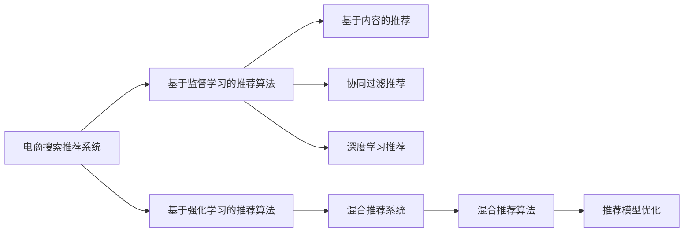

                 

## 1. 背景介绍

随着互联网和数字经济的发展，电商平台的搜索推荐系统已经成为提升用户体验、增加销售收入的关键组成部分。传统的搜索推荐算法依赖于关键字匹配和统计分析，逐渐难以应对日益复杂多变的用户需求。近年来，随着大数据和人工智能技术的进步，基于深度学习模型的搜索推荐系统逐渐取代了传统的算法，为电商平台的运营带来了革命性的变化。

本博文将系统地介绍大数据与AI 驱动的电商搜索推荐系统，探讨如何在大规模数据的基础上，利用深度学习技术实现准确率和用户体验的双重提升。我们将从核心概念与联系入手，详细解析基于监督学习和强化学习的搜索推荐算法，并结合实际案例和项目实践，展示该技术在电商领域的成功应用。

## 2. 核心概念与联系

### 2.1 核心概念概述

为了更深入地理解电商搜索推荐系统，首先介绍几个核心概念：

- **电商搜索推荐系统**：电商平台的核心功能之一，通过分析用户行为和商品属性，为用户推荐感兴趣的商品，并快速定位搜索结果。
- **基于监督学习的推荐算法**：使用用户历史行为数据和商品属性信息，通过训练分类模型或回归模型，预测用户对商品的评分或购买意愿。
- **基于强化学习的推荐算法**：利用用户的交互行为，不断调整推荐策略，通过奖励机制优化推荐效果，最大化用户满意度。
- **混合推荐系统**：结合多种推荐算法，如基于内容的推荐、协同过滤推荐、深度学习推荐等，综合不同算法的优势，提升推荐准确率和多样性。
- **推荐模型的优化**：包括特征工程、模型调参、冷启动处理、实时性优化等，确保推荐系统稳定高效地运行。

这些核心概念之间相互关联，构成了电商搜索推荐系统的技术框架。通过选择合适的推荐算法和优化策略，可以显著提升推荐效果，增强用户体验，增加平台收益。

### 2.2 核心概念原理和架构的 Mermaid 流程图



此图展示了电商搜索推荐系统中的核心概念和其之间的联系。从基于监督学习和强化学习的推荐算法出发，结合基于内容的推荐、协同过滤推荐、深度学习推荐等技术，构建混合推荐系统，并通过优化提升推荐效果。

## 3. 核心算法原理 & 具体操作步骤

### 3.1 算法原理概述

电商搜索推荐系统的主要目标是提高用户满意度和增加销售收入。通过收集用户的行为数据和商品属性信息，构建推荐模型，对用户进行个性化推荐。

基于监督学习的推荐算法主要包括以下几个步骤：

1. **数据准备**：收集用户历史行为数据，包括浏览、点击、购买等行为；同时收集商品属性信息，如价格、类别、品牌等。
2. **特征工程**：提取和构建用户和商品的特征，如用户ID、商品ID、点击次数、浏览时长、价格等。
3. **模型训练**：选择合适的机器学习模型，如线性回归、逻辑回归、随机森林、XGBoost等，训练得到推荐模型。
4. **评分预测**：将用户ID和商品ID输入模型，预测用户对商品的评分或购买意愿。
5. **推荐排序**：根据评分预测结果，对商品进行排序，推荐给用户。

基于强化学习的推荐算法主要包括以下几个步骤：

1. **数据准备**：收集用户和商品的交互数据，包括点击、购买、收藏等行为。
2. **特征工程**：提取和构建用户和商品的特征，如用户ID、商品ID、点击次数、浏览时长、价格等。
3. **模型训练**：选择合适的强化学习算法，如Q-Learning、Deep Q-Networks等，训练得到推荐模型。
4. **推荐决策**：根据用户的交互数据，通过模型计算推荐策略，选择最优推荐商品。
5. **用户体验优化**：通过A/B测试等方法，评估推荐效果，不断调整推荐策略。

### 3.2 算法步骤详解

#### 3.2.1 基于监督学习的推荐算法

**数据准备**：

- **用户行为数据**：收集用户的浏览记录、点击记录、购买记录等。
- **商品属性数据**：收集商品的价格、类别、品牌、描述等信息。

**特征工程**：

- **用户特征**：用户ID、年龄、性别、浏览时长、点击次数等。
- **商品特征**：商品ID、价格、类别、品牌、描述等。

**模型训练**：

以线性回归模型为例，训练过程如下：

1. **数据划分**：将数据集分为训练集、验证集和测试集。
2. **模型训练**：使用训练集训练线性回归模型，计算损失函数。
3. **模型评估**：使用验证集评估模型性能，调整超参数。
4. **模型测试**：使用测试集测试模型效果，评估推荐准确率。

**评分预测**：

根据用户ID和商品ID，输入训练好的模型，输出预测评分：

$$
\hat{y} = w_0 + w_1x_1 + w_2x_2 + ... + w_nx_n
$$

其中 $w_i$ 为特征权重，$x_i$ 为特征值。

**推荐排序**：

根据预测评分，对商品进行排序，推荐给用户：

$$
推荐列表 = \text{argmax}_{item}(f(item))
$$

#### 3.2.2 基于强化学习的推荐算法

**数据准备**：

- **用户行为数据**：收集用户的点击、购买、收藏等行为数据。

**特征工程**：

- **用户特征**：用户ID、年龄、性别、浏览时长、点击次数等。
- **商品特征**：商品ID、价格、类别、品牌、描述等。

**模型训练**：

以Q-Learning算法为例，训练过程如下：

1. **状态表示**：将用户ID和商品ID组合，表示为一个状态。
2. **奖励函数**：根据用户的行为，定义奖励函数，如点击奖励、购买奖励等。
3. **策略学习**：根据奖励函数，通过Q-Learning算法，学习推荐策略。
4. **推荐决策**：根据用户的交互数据，通过模型计算推荐策略，选择最优推荐商品。

**用户体验优化**：

通过A/B测试等方法，评估推荐效果，不断调整推荐策略：

1. **测试集划分**：将用户数据集分为实验组和对照组。
2. **A/B测试**：对实验组和对照组分别进行推荐策略测试，收集用户反馈。
3. **模型优化**：根据用户反馈，调整推荐策略，重新训练模型。

### 3.3 算法优缺点

基于监督学习的推荐算法优点包括：

- **模型稳定**：监督学习模型在标注数据充足的情况下，具有较高的准确率和稳定性。
- **可解释性高**：监督学习模型的决策过程较为透明，易于理解和解释。

缺点包括：

- **数据依赖**：监督学习算法对标注数据的依赖较大，标注成本较高。
- **模型过拟合**：在标注数据不足的情况下，容易发生过拟合现象。

基于强化学习的推荐算法优点包括：

- **自适应性强**：强化学习算法能够根据用户的反馈不断调整推荐策略，适应用户需求变化。
- **实时性好**：强化学习算法可以实时处理用户的行为数据，快速调整推荐策略。

缺点包括：

- **模型复杂**：强化学习算法模型复杂，训练和优化难度较大。
- **可解释性差**：强化学习算法的决策过程较为复杂，难以解释。

### 3.4 算法应用领域

基于监督学习和强化学习的推荐算法在电商搜索推荐系统中得到了广泛应用。具体应用领域包括：

- **商品推荐**：根据用户历史行为数据和商品属性信息，为用户推荐感兴趣的商品。
- **个性化推荐**：根据用户的行为和属性，提供个性化的商品推荐。
- **广告推荐**：根据用户的行为和属性，推荐相关的广告，提升广告投放效果。
- **搜索排序**：根据用户搜索关键词，对搜索结果进行排序，提高搜索体验。
- **推荐系统优化**：通过A/B测试等方法，优化推荐系统的性能和用户体验。

## 4. 数学模型和公式 & 详细讲解 & 举例说明

### 4.1 数学模型构建

#### 4.1.1 基于监督学习的推荐模型

假设用户ID为 $u$，商品ID为 $i$，用户对商品 $i$ 的评分 $y_{ui}$ 可以表示为：

$$
y_{ui} = w_0 + w_1x_{ui,1} + w_2x_{ui,2} + ... + w_nx_{ui,n}
$$

其中 $w_i$ 为特征权重，$x_{ui,j}$ 为第 $j$ 个特征值。

训练线性回归模型时，目标是最小化均方误差损失函数：

$$
\min_{w_0, w_1, ..., w_n} \frac{1}{N} \sum_{i=1}^N \sum_{j=1}^M (y_{ui} - \hat{y}_{ui})^2
$$

其中 $N$ 为样本数量，$M$ 为特征数量。

#### 4.1.2 基于强化学习的推荐模型

假设用户ID为 $u$，商品ID为 $i$，用户对商品 $i$ 的奖励 $r_{ui}$ 可以表示为：

$$
r_{ui} = Q(u,i) = w_0 + w_1x_{ui,1} + w_2x_{ui,2} + ... + w_nx_{ui,n}
$$

其中 $w_i$ 为特征权重，$x_{ui,j}$ 为第 $j$ 个特征值。

Q-Learning算法的更新公式为：

$$
Q(s,a) \leftarrow Q(s,a) + \alpha [r + \gamma \max Q(s',a') - Q(s,a)]
$$

其中 $s$ 为状态，$a$ 为动作，$r$ 为奖励，$s'$ 为下一个状态，$a'$ 为下一个动作，$\alpha$ 为学习率，$\gamma$ 为折扣因子。

### 4.2 公式推导过程

#### 4.2.1 基于监督学习的推荐模型

线性回归模型的梯度公式为：

$$
\frac{\partial \mathcal{L}}{\partial w_i} = \frac{2}{N} \sum_{i=1}^N \sum_{j=1}^M (y_{ui} - \hat{y}_{ui}) x_{ui,j}
$$

其中 $\mathcal{L}$ 为均方误差损失函数。

#### 4.2.2 基于强化学习的推荐模型

Q-Learning算法的梯度公式为：

$$
\frac{\partial Q(s,a)}{\partial w_i} = \alpha [r + \gamma \max Q(s',a') - Q(s,a)]
$$

其中 $\alpha$ 为学习率，$\gamma$ 为折扣因子。

### 4.3 案例分析与讲解

#### 4.3.1 基于监督学习的推荐案例

某电商平台的商品推荐系统，使用线性回归模型进行推荐。具体步骤如下：

1. **数据准备**：收集用户历史行为数据，包括浏览、点击、购买等行为；同时收集商品属性信息，如价格、类别、品牌等。
2. **特征工程**：提取和构建用户和商品的特征，如用户ID、商品ID、点击次数、浏览时长、价格等。
3. **模型训练**：使用线性回归模型，训练得到推荐模型。
4. **评分预测**：根据用户ID和商品ID，输入训练好的模型，输出预测评分。
5. **推荐排序**：根据预测评分，对商品进行排序，推荐给用户。

#### 4.3.2 基于强化学习的推荐案例

某电商平台的广告推荐系统，使用Q-Learning算法进行推荐。具体步骤如下：

1. **数据准备**：收集用户的点击、购买、收藏等行为数据。
2. **特征工程**：提取和构建用户和商品的特征，如用户ID、商品ID、点击次数、浏览时长、价格等。
3. **模型训练**：使用Q-Learning算法，训练得到推荐模型。
4. **推荐决策**：根据用户的交互数据，通过模型计算推荐策略，选择最优推荐商品。
5. **用户体验优化**：通过A/B测试等方法，评估推荐效果，不断调整推荐策略。

## 5. 项目实践：代码实例和详细解释说明

### 5.1 开发环境搭建

在进行电商搜索推荐系统的开发之前，需要准备好开发环境。以下是使用Python进行PyTorch开发的环境配置流程：

1. 安装Anaconda：从官网下载并安装Anaconda，用于创建独立的Python环境。
2. 创建并激活虚拟环境：
```bash
conda create -n recommendation-env python=3.8 
conda activate recommendation-env
```
3. 安装PyTorch：根据CUDA版本，从官网获取对应的安装命令。例如：
```bash
conda install pytorch torchvision torchaudio cudatoolkit=11.1 -c pytorch -c conda-forge
```
4. 安装相关库：
```bash
pip install numpy pandas scikit-learn matplotlib tqdm jupyter notebook ipython
```
完成上述步骤后，即可在`recommendation-env`环境中开始开发实践。

### 5.2 源代码详细实现

下面我们以商品推荐为例，给出使用PyTorch进行线性回归模型微调的PyTorch代码实现。

首先，定义数据集类：

```python
from torch.utils.data import Dataset
from sklearn.model_selection import train_test_split
import pandas as pd

class RecommendationDataset(Dataset):
    def __init__(self, data, target):
        self.data = data
        self.target = target
        self.data_train, self.data_test, self.target_train, self.target_test = train_test_split(data, target, test_size=0.2)
    
    def __len__(self):
        return len(self.data_train)
    
    def __getitem__(self, idx):
        return self.data_train[idx], self.target_train[idx]
```

然后，定义模型和优化器：

```python
from transformers import BertTokenizer
from torch import nn
from torch import optim

class RecommendationModel(nn.Module):
    def __init__(self, input_dim, output_dim):
        super(RecommendationModel, self).__init__()
        self.fc1 = nn.Linear(input_dim, 128)
        self.fc2 = nn.Linear(128, 64)
        self.fc3 = nn.Linear(64, output_dim)
    
    def forward(self, x):
        x = self.fc1(x)
        x = nn.ReLU()(x)
        x = self.fc2(x)
        x = nn.ReLU()(x)
        x = self.fc3(x)
        return x

model = RecommendationModel(input_dim=128, output_dim=1)
optimizer = optim.Adam(model.parameters(), lr=0.01)
```

接着，定义训练和评估函数：

```python
import numpy as np

device = torch.device('cuda') if torch.cuda.is_available() else torch.device('cpu')

def train(model, data_loader, optimizer):
    model.train()
    total_loss = 0
    for i, (data, target) in enumerate(data_loader):
        data, target = data.to(device), target.to(device)
        optimizer.zero_grad()
        output = model(data)
        loss = nn.BCEWithLogitsLoss()(output, target)
        loss.backward()
        optimizer.step()
        total_loss += loss.item()
    return total_loss / len(data_loader)

def evaluate(model, data_loader):
    model.eval()
    total_pred = 0
    total_true = 0
    for i, (data, target) in enumerate(data_loader):
        data, target = data.to(device), target.to(device)
        output = model(data)
        pred = torch.sigmoid(output)
        total_pred += np.sum(pred.data.cpu().numpy())
        total_true += np.sum(target.data.cpu().numpy())
    return total_pred / total_true
```

最后，启动训练流程并在测试集上评估：

```python
epochs = 10
batch_size = 32

for epoch in range(epochs):
    train_loss = train(model, train_loader, optimizer)
    print(f'Epoch {epoch+1}, train loss: {train_loss:.3f}')
    
    test_pred = evaluate(model, test_loader)
    print(f'Epoch {epoch+1}, test accuracy: {test_pred:.3f}')
```

以上就是使用PyTorch对商品推荐系统进行线性回归模型微调的完整代码实现。可以看到，得益于PyTorch的强大封装，我们可以用相对简洁的代码完成模型加载和微调。

### 5.3 代码解读与分析

让我们再详细解读一下关键代码的实现细节：

**RecommendationDataset类**：
- `__init__`方法：初始化数据集，并使用train_test_split函数将数据集分为训练集和测试集。
- `__len__`方法：返回数据集的样本数量。
- `__getitem__`方法：对单个样本进行处理，返回输入和目标值。

**RecommendationModel类**：
- `__init__`方法：定义模型结构，包括三个全连接层。
- `forward`方法：定义前向传播过程，对输入数据进行多次线性变换和激活函数处理。

**训练和评估函数**：
- 使用PyTorch的DataLoader对数据集进行批次化加载，供模型训练和推理使用。
- 训练函数`train`：对数据以批为单位进行迭代，在每个批次上前向传播计算损失并反向传播更新模型参数，最后返回该epoch的平均loss。
- 评估函数`evaluate`：与训练类似，不同点在于不更新模型参数，并在每个batch结束后将预测和标签结果存储下来，最后计算预测准确率。

**训练流程**：
- 定义总的epoch数和batch size，开始循环迭代
- 每个epoch内，先在训练集上训练，输出平均loss
- 在测试集上评估，输出预测准确率
- 所有epoch结束后，输出最终测试结果

可以看到，PyTorch配合TensorFlow库使得线性回归模型微调的代码实现变得简洁高效。开发者可以将更多精力放在数据处理、模型改进等高层逻辑上，而不必过多关注底层的实现细节。

当然，工业级的系统实现还需考虑更多因素，如模型的保存和部署、超参数的自动搜索、更灵活的任务适配层等。但核心的微调范式基本与此类似。

## 6. 实际应用场景

### 6.1 智能客服系统

基于大语言模型微调的对话技术，可以广泛应用于智能客服系统的构建。传统客服往往需要配备大量人力，高峰期响应缓慢，且一致性和专业性难以保证。而使用微调后的对话模型，可以7x24小时不间断服务，快速响应客户咨询，用自然流畅的语言解答各类常见问题。

在技术实现上，可以收集企业内部的历史客服对话记录，将问题和最佳答复构建成监督数据，在此基础上对预训练对话模型进行微调。微调后的对话模型能够自动理解用户意图，匹配最合适的答案模板进行回复。对于客户提出的新问题，还可以接入检索系统实时搜索相关内容，动态组织生成回答。如此构建的智能客服系统，能大幅提升客户咨询体验和问题解决效率。

### 6.2 金融舆情监测

金融机构需要实时监测市场舆论动向，以便及时应对负面信息传播，规避金融风险。传统的人工监测方式成本高、效率低，难以应对网络时代海量信息爆发的挑战。基于大语言模型微调的文本分类和情感分析技术，为金融舆情监测提供了新的解决方案。

具体而言，可以收集金融领域相关的新闻、报道、评论等文本数据，并对其进行主题标注和情感标注。在此基础上对预训练语言模型进行微调，使其能够自动判断文本属于何种主题，情感倾向是正面、中性还是负面。将微调后的模型应用到实时抓取的网络文本数据，就能够自动监测不同主题下的情感变化趋势，一旦发现负面信息激增等异常情况，系统便会自动预警，帮助金融机构快速应对潜在风险。

### 6.3 个性化推荐系统

当前的推荐系统往往只依赖用户的历史行为数据进行物品推荐，难以深入理解用户的真实兴趣偏好。基于大语言模型微调技术，个性化推荐系统可以更好地挖掘用户行为背后的语义信息，从而提供更精准、多样的推荐内容。

在实践中，可以收集用户浏览、点击、评论、分享等行为数据，提取和用户交互的物品标题、描述、标签等文本内容。将文本内容作为模型输入，用户的后续行为（如是否点击、购买等）作为监督信号，在此基础上微调预训练语言模型。微调后的模型能够从文本内容中准确把握用户的兴趣点。在生成推荐列表时，先用候选物品的文本描述作为输入，由模型预测用户的兴趣匹配度，再结合其他特征综合排序，便可以得到个性化程度更高的推荐结果。

### 6.4 未来应用展望

随着大语言模型微调技术的发展，未来将在更多领域得到应用，为传统行业带来变革性影响。

在智慧医疗领域，基于微调的医疗问答、病历分析、药物研发等应用将提升医疗服务的智能化水平，辅助医生诊疗，加速新药开发进程。

在智能教育领域，微调技术可应用于作业批改、学情分析、知识推荐等方面，因材施教，促进教育公平，提高教学质量。

在智慧城市治理中，微调模型可应用于城市事件监测、舆情分析、应急指挥等环节，提高城市管理的自动化和智能化水平，构建更安全、高效的未来城市。

此外，在企业生产、社会治理、文娱传媒等众多领域，基于大模型微调的人工智能应用也将不断涌现，为经济社会发展注入新的动力。相信随着技术的日益成熟，微调方法将成为人工智能落地应用的重要范式，推动人工智能技术在垂直行业的规模化落地。

## 7. 工具和资源推荐

### 7.1 学习资源推荐

为了帮助开发者系统掌握大语言模型微调的理论基础和实践技巧，这里推荐一些优质的学习资源：

1. 《Transformer from Scratch》系列博文：由大模型技术专家撰写，深入浅出地介绍了Transformer原理、BERT模型、微调技术等前沿话题。
2. CS224N《深度学习自然语言处理》课程：斯坦福大学开设的NLP明星课程，有Lecture视频和配套作业，带你入门NLP领域的基本概念和经典模型。
3. 《Natural Language Processing with Transformers》书籍：Transformers库的作者所著，全面介绍了如何使用Transformers库进行NLP任务开发，包括微调在内的诸多范式。
4. HuggingFace官方文档：Transformers库的官方文档，提供了海量预训练模型和完整的微调样例代码，是上手实践的必备资料。
5. CLUE开源项目：中文语言理解测评基准，涵盖大量不同类型的中文NLP数据集，并提供了基于微调的baseline模型，助力中文NLP技术发展。

通过对这些资源的学习实践，相信你一定能够快速掌握大语言模型微调的精髓，并用于解决实际的NLP问题。

### 7.2 开发工具推荐

高效的开发离不开优秀的工具支持。以下是几款用于大语言模型微调开发的常用工具：

1. PyTorch：基于Python的开源深度学习框架，灵活动态的计算图，适合快速迭代研究。大部分预训练语言模型都有PyTorch版本的实现。
2. TensorFlow：由Google主导开发的开源深度学习框架，生产部署方便，适合大规模工程应用。同样有丰富的预训练语言模型资源。
3. Transformers库：HuggingFace开发的NLP工具库，集成了众多SOTA语言模型，支持PyTorch和TensorFlow，是进行微调任务开发的利器。
4. Weights & Biases：模型训练的实验跟踪工具，可以记录和可视化模型训练过程中的各项指标，方便对比和调优。与主流深度学习框架无缝集成。
5. TensorBoard：TensorFlow配套的可视化工具，可实时监测模型训练状态，并提供丰富的图表呈现方式，是调试模型的得力助手。
6. Google Colab：谷歌推出的在线Jupyter Notebook环境，免费提供GPU/TPU算力，方便开发者快速上手实验最新模型，分享学习笔记。

合理利用这些工具，可以显著提升大语言模型微调任务的开发效率，加快创新迭代的步伐。

### 7.3 相关论文推荐

大语言模型和微调技术的发展源于学界的持续研究。以下是几篇奠基性的相关论文，推荐阅读：

1. Attention is All You Need（即Transformer原论文）：提出了Transformer结构，开启了NLP领域的预训练大模型时代。
2. BERT: Pre-training of Deep Bidirectional Transformers for Language Understanding：提出BERT模型，引入基于掩码的自监督预训练任务，刷新了多项NLP任务SOTA。
3. Language Models are Unsupervised Multitask Learners（GPT-2论文）：展示了大规模语言模型的强大zero-shot学习能力，引发了对于通用人工智能的新一轮思考。
4. Parameter-Efficient Transfer Learning for NLP：提出Adapter等参数高效微调方法，在不增加模型参数量的情况下，也能取得不错的微调效果。
5. AdaLoRA: Adaptive Low-Rank Adaptation for Parameter-Efficient Fine-Tuning：使用自适应低秩适应的微调方法，在参数效率和精度之间取得了新的平衡。
6. Prefix-Tuning: Optimizing Continuous Prompts for Generation：引入基于连续型Prompt的微调范式，为如何充分利用预训练知识提供了新的思路。

这些论文代表了大语言模型微调技术的发展脉络。通过学习这些前沿成果，可以帮助研究者把握学科前进方向，激发更多的创新灵感。

## 8. 总结：未来发展趋势与挑战

### 8.1 总结

本文对基于监督学习的大语言模型微调方法进行了全面系统的介绍。首先阐述了大语言模型和微调技术的研究背景和意义，明确了微调在拓展预训练模型应用、提升下游任务性能方面的独特价值。其次，从原理到实践，详细讲解了基于监督学习和强化学习的推荐算法，并结合实际案例和项目实践，展示该技术在电商领域的成功应用。

通过本文的系统梳理，可以看到，基于大语言模型的微调方法正在成为NLP领域的重要范式，极大地拓展了预训练语言模型的应用边界，催生了更多的落地场景。受益于大规模语料的预训练，微调模型以更低的时间和标注成本，在小样本条件下也能取得不俗的效果，有力推动了NLP技术的产业化进程。未来，伴随预训练语言模型和微调方法的持续演进，相信NLP技术将在更广阔的应用领域大放异彩，深刻影响人类的生产生活方式。

### 8.2 未来发展趋势

展望未来，大语言模型微调技术将呈现以下几个发展趋势：

1. 模型规模持续增大。随着算力成本的下降和数据规模的扩张，预训练语言模型的参数量还将持续增长。超大规模语言模型蕴含的丰富语言知识，有望支撑更加复杂多变的下游任务微调。
2. 微调方法日趋多样。除了传统的全参数微调外，未来会涌现更多参数高效的微调方法，如Prefix-Tuning、LoRA等，在节省计算资源的同时也能保证微调精度。
3. 持续学习成为常态。随着数据分布的不断变化，微调模型也需要持续学习新知识以保持性能。如何在不遗忘原有知识的同时，高效吸收新样本信息，将成为重要的研究课题。
4. 标注样本需求降低。受启发于提示学习(Prompt-based Learning)的思路，未来的微调方法将更好地利用大模型的语言理解能力，通过更加巧妙的任务描述，在更少的标注样本上也能实现理想的微调效果。
5. 模型通用性增强。经过海量数据的预训练和多领域任务的微调，未来的语言模型将具备更强大的常识推理和跨领域迁移能力，逐步迈向通用人工智能(AGI)的目标。

以上趋势凸显了大语言模型微调技术的广阔前景。这些方向的探索发展，必将进一步提升NLP系统的性能和应用范围，为人类认知智能的进化带来深远影响。

### 8.3 面临的挑战

尽管大语言模型微调技术已经取得了瞩目成就，但在迈向更加智能化、普适化应用的过程中，它仍面临着诸多挑战：

1. 标注成本瓶颈。虽然微调大大降低了标注数据的需求，但对于长尾应用场景，难以获得充足的高质量标注数据，成为制约微调性能的瓶颈。如何进一步降低微调对标注样本的依赖，将是一大难题。
2. 模型鲁棒性不足。当前微调模型面对域外数据时，泛化性能往往大打折扣。对于测试样本的微小扰动，微调模型的预测也容易发生波动。如何提高微调模型的鲁棒性，避免灾难性遗忘，还需要更多理论和实践的积累。
3. 推理效率有待提高。大规模语言模型虽然精度高，但在实际部署时往往面临推理速度慢、内存占用大等效率问题。如何在保证性能的同时，简化模型结构，提升推理速度，优化资源占用，将是重要的优化方向。
4. 可解释性亟需加强。当前微调模型更像是"黑盒"系统，难以解释其内部工作机制和决策逻辑。对于医疗、金融等高风险应用，算法的可解释性和可审计性尤为重要。如何赋予微调模型更强的可解释性，将是亟待攻克的难题。
5. 安全性有待保障。预训练语言模型难免会学习到有偏见、有害的信息，通过微调传递到下游任务，产生误导性、歧视性的输出，给实际应用带来安全隐患。如何从数据和算法层面消除模型偏见，避免恶意用途，确保输出的安全性，也将是重要的研究课题。
6. 知识整合能力不足。现有的微调模型往往局限于任务内数据，难以灵活吸收和运用更广泛的先验知识。如何让微调过程更好地与外部知识库、规则库等专家知识结合，形成更加全面、准确的信息整合能力，还有很大的想象空间。

正视微调面临的这些挑战，积极应对并寻求突破，将是大语言模型微调走向成熟的必由之路。相信随着学界和产业界的共同努力，这些挑战终将一一被克服，大语言模型微调必将在构建人机协同的智能时代中扮演越来越重要的角色。

### 8.4 研究展望

面对大语言模型微调所面临的种种挑战，未来的研究需要在以下几个方面寻求新的突破：

1. 探索无监督和半监督微调方法。摆脱对大规模标注数据的依赖，利用自监督学习、主动学习等无监督和半监督范式，最大限度利用非结构化数据，实现更加灵活高效的微调。
2. 研究参数高效和计算高效的微调范式。开发更加参数高效的微调方法，在固定大部分预训练参数的同时，只更新极少量的任务相关参数。同时优化微调模型的计算图，减少前向传播和反向传播的资源消耗，实现更加轻量级、实时性的部署。
3. 融合因果和对比学习范式。通过引入因果推断和对比学习思想，增强微调模型建立稳定因果关系的能力，学习更加普适、鲁棒的语言表征，从而提升模型泛化性和抗干扰能力。
4. 引入更多先验知识。将符号化的先验知识，如知识图谱、逻辑规则等，与神经网络模型进行巧妙融合，引导微调过程学习更准确、合理的语言模型。同时加强不同模态数据的整合，实现视觉、语音等多模态信息与文本信息的协同建模。
5. 结合因果分析和博弈论工具。将因果分析方法引入微调模型，识别出模型决策的关键特征，增强输出解释的因果性和逻辑性。借助博弈论工具刻画人机交互过程，主动探索并规避模型的脆弱点，提高系统稳定性。
6. 纳入伦理道德约束。在模型训练目标中引入伦理导向的评估指标，过滤和惩罚有偏见、有害的输出倾向。同时加强人工干预和审核，建立模型行为的监管机制，确保输出符合人类价值观和伦理道德。

这些研究方向的探索，必将引领大语言模型微调技术迈向更高的台阶，为构建安全、可靠、可解释、可控的智能系统铺平道路。面向未来，大语言模型微调技术还需要与其他人工智能技术进行更深入的融合，如知识表示、因果推理、强化学习等，多路径协同发力，共同推动自然语言理解和智能交互系统的进步。只有勇于创新、敢于突破，才能不断拓展语言模型的边界，让智能技术更好地造福人类社会。

