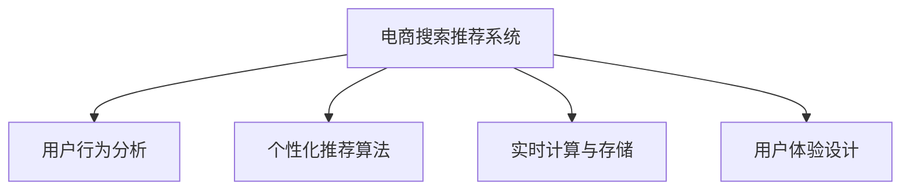

                 

# 大数据与AI 驱动的电商搜索推荐：以用户体验为中心的设计思路

> 关键词：大数据, AI驱动, 电商搜索, 推荐系统, 用户体验, 设计思路

## 1. 背景介绍

### 1.1 问题由来

随着电子商务的蓬勃发展，用户对于电商平台的购物体验和个性化服务需求日益增长。电商平台需要精准地获取用户的搜索意图，提供符合用户兴趣和需求的推荐商品，以提升用户的满意度和转化率。传统的基于规则和关键词匹配的推荐方法已经难以满足用户多样化和复杂化的需求，无法做到实时化、个性化和精细化的推荐。

如何通过大数据和AI技术构建更加智能和高效的商品推荐系统，是电商领域一个亟待解决的问题。本文将探讨基于大数据与AI的电商搜索推荐系统，并着重从用户体验的角度出发，设计相应的推荐算法和系统架构，以期提供更佳的购物体验。

### 1.2 问题核心关键点

构建一个基于大数据与AI的电商搜索推荐系统，主要需要解决以下几个核心关键点：

1. **用户行为分析**：通过分析用户在平台上的浏览、点击、购买等行为，识别出用户的偏好和兴趣。
2. **个性化推荐算法**：基于用户的行为数据，设计个性化推荐算法，提供符合用户需求的商品推荐。
3. **推荐系统架构设计**：设计高效的推荐系统架构，支持大规模数据存储和实时计算。
4. **用户体验优化**：优化推荐系统的用户体验，如搜索结果的排序、推荐内容的展示等。

这些关键点共同构成了电商搜索推荐系统的核心框架，旨在通过大数据和AI技术，提升用户购物体验和电商平台的用户黏性。

## 2. 核心概念与联系

### 2.1 核心概念概述

为了更好地理解基于大数据与AI的电商搜索推荐系统，本节将介绍几个密切相关的核心概念：

- **电商搜索推荐系统**：通过收集和分析用户的行为数据，构建智能化的搜索推荐功能，提升用户购物体验的系统。
- **用户行为分析**：通过数据分析和挖掘技术，识别用户的浏览、点击、购买等行为特征，了解用户的兴趣和需求。
- **个性化推荐算法**：基于用户的特征和历史行为数据，设计推荐模型，预测用户可能感兴趣的商品，提供个性化推荐。
- **实时计算与存储**：构建高效的大数据处理和存储架构，支持实时数据处理和查询。
- **用户体验设计**：设计直观、易用的界面和交互流程，提升用户的使用体验和满意度。

这些核心概念之间的逻辑关系可以通过以下Mermaid流程图来展示：



这个流程图展示了电商搜索推荐系统的核心组件及其之间的关系：

1. 电商搜索推荐系统通过用户行为分析组件获取用户数据。
2. 数据经过个性化推荐算法组件，进行商品推荐。
3. 推荐系统需要实时计算与存储组件的支持，以支撑大规模数据的存储和处理。
4. 最终，用户体验设计组件负责提升系统的用户体验和用户满意度。

这些组件共同构成了电商搜索推荐系统的核心框架，使其能够高效地提供个性化推荐服务。

## 3. 核心算法原理 & 具体操作步骤
### 3.1 算法原理概述

基于大数据与AI的电商搜索推荐系统，其核心原理是通过机器学习和数据分析技术，构建个性化的推荐模型，为用户提供精准的搜索和推荐服务。其具体算法流程如下：

1. **数据收集与预处理**：收集用户在平台上的行为数据，包括浏览历史、点击记录、购买行为等。对这些数据进行清洗、去重、归一化等预处理，确保数据的质量和一致性。

2. **用户画像构建**：通过用户行为数据，构建用户的兴趣画像，识别出用户的偏好和兴趣领域。常用的方法包括协同过滤、内容推荐、基于用户的推荐等。

3. **推荐算法建模**：基于用户的兴趣画像，选择合适的推荐算法进行建模。常用的推荐算法包括基于协同过滤的推荐、基于内容的推荐、混合推荐等。

4. **模型训练与优化**：在用户行为数据上训练推荐模型，并通过交叉验证等方法进行模型优化，提升模型的准确率和泛化能力。

5. **推荐结果生成与展示**：根据用户的兴趣画像和推荐模型，生成个性化的推荐结果，并通过直观的展示界面呈现给用户。

### 3.2 算法步骤详解

以下是详细的算法步骤：

**Step 1: 数据收集与预处理**

电商平台的推荐系统需要收集大量的用户行为数据，包括用户的浏览、点击、购买等行为数据。数据收集可以通过网页埋点、API接口调用等方式实现。

1. **数据收集**：
   - 从用户浏览器记录获取浏览数据，如访问的页面URL、停留时间等。
   - 从用户的点击记录获取点击行为数据，如点击的商品ID、类别等。
   - 从用户的购买记录获取购买行为数据，如购买时间、商品ID、价格等。

2. **数据清洗**：
   - 去除噪声数据和不相关的数据，如广告点击、无效点击等。
   - 处理缺失值和异常值，如对缺失的浏览时长补全、对异常的购买金额进行调整。

3. **数据归一化**：
   - 对不同维度的数据进行归一化，如将浏览时长转换为时长比例、将价格转换为价格区间等。

**Step 2: 用户画像构建**

用户画像构建是推荐系统的核心步骤，通过对用户的行为数据进行分析和挖掘，构建用户兴趣画像，识别出用户的兴趣和偏好。

1. **协同过滤**：
   - 通过用户的浏览记录和点击记录，找到相似的用户，并推荐这些用户喜欢的商品。
   - 常用的协同过滤算法包括基于用户的协同过滤、基于物品的协同过滤、基于矩阵分解的协同过滤等。

2. **基于内容的推荐**：
   - 通过分析用户浏览的商品属性和特征，找到与用户兴趣相似的商品，进行推荐。
   - 常用的属性包括商品类别、品牌、价格区间等。

3. **混合推荐**：
   - 将协同过滤和基于内容的推荐方法结合起来，提升推荐的准确率和覆盖度。

**Step 3: 推荐算法建模**

在用户画像的基础上，选择合适的推荐算法进行建模。常用的推荐算法包括：

1. **协同过滤**：
   - 基于用户的协同过滤：找到与用户兴趣相似的用户，推荐这些用户喜欢的商品。
   - 基于物品的协同过滤：找到与用户浏览的商品相似的商品，推荐这些商品。

2. **基于内容的推荐**：
   - 通过分析用户浏览的商品属性和特征，找到与用户兴趣相似的商品，进行推荐。

3. **混合推荐**：
   - 将协同过滤和基于内容的推荐方法结合起来，提升推荐的准确率和覆盖度。

**Step 4: 模型训练与优化**

在用户行为数据上训练推荐模型，并通过交叉验证等方法进行模型优化，提升模型的准确率和泛化能力。

1. **模型选择**：
   - 选择合适的推荐算法，如矩阵分解、协同过滤、深度学习模型等。

2. **数据划分**：
   - 将用户行为数据划分为训练集、验证集和测试集，确保模型在未知数据上的泛化能力。

3. **模型训练**：
   - 在训练集上训练推荐模型，通过迭代优化提升模型性能。

4. **模型验证**：
   - 在验证集上评估模型性能，如使用交叉验证、AUC等指标。

5. **模型优化**：
   - 根据验证结果，调整模型参数和超参数，如学习率、正则化系数等。

**Step 5: 推荐结果生成与展示**

根据用户的兴趣画像和推荐模型，生成个性化的推荐结果，并通过直观的展示界面呈现给用户。

1. **推荐结果生成**：
   - 根据用户画像和推荐模型，生成推荐的商品列表。

2. **推荐结果展示**：
   - 将推荐商品按照相关性、热度、用户偏好等排序，展示给用户。
   - 使用直观的界面和交互设计，提升用户体验。

### 3.3 算法优缺点

基于大数据与AI的电商搜索推荐系统具有以下优点：

1. **精准化推荐**：通过用户行为分析，能够提供更加精准的商品推荐，提升用户的购物体验。
2. **实时化服务**：能够实时分析用户的行为数据，快速更新推荐结果，提升推荐的时效性。
3. **个性化服务**：能够根据用户的个性化需求，提供定制化的推荐服务，提升用户满意度。

同时，该方法也存在一些缺点：

1. **数据隐私问题**：用户行为数据的收集和分析可能涉及到用户隐私，需要严格遵守相关法律法规。
2. **模型复杂度高**：推荐模型的训练和优化过程复杂，需要较大的计算资源和时间成本。
3. **依赖历史数据**：推荐系统的性能依赖于历史数据的完整性和质量，数据缺失或不准确会影响推荐效果。

尽管存在这些局限性，但基于大数据与AI的推荐系统已经在大规模电商平台的实际应用中取得了显著的效果，成为提升用户体验的重要手段。

### 3.4 算法应用领域

基于大数据与AI的电商搜索推荐系统已经在多个领域得到了广泛的应用，例如：

- **零售电商**：通过分析用户的购买行为和浏览历史，提供个性化的商品推荐，提升销售额和用户满意度。
- **旅游行业**：根据用户的兴趣和历史行为数据，推荐旅游目的地、酒店、景点等，提升用户的旅游体验。
- **金融行业**：根据用户的交易行为和信用记录，推荐合适的理财产品，提升用户理财体验。
- **媒体内容推荐**：分析用户的观看历史和兴趣，推荐相关视频、文章等，提升用户的内容消费体验。

除了上述这些经典应用外，基于大数据与AI的推荐系统还在更多场景中得到应用，如智能家居、智能客服等，为不同行业带来了创新的服务模式。随着技术的不断进步，相信推荐系统将在更广阔的应用领域大放异彩。

## 4. 数学模型和公式 & 详细讲解  
### 4.1 数学模型构建

本节将使用数学语言对基于大数据与AI的电商搜索推荐系统进行更加严格的刻画。

记用户行为数据集为 $D=\{(x_i,y_i)\}_{i=1}^N$，其中 $x_i$ 为用户的行为特征向量，$y_i$ 为用户的推荐结果。

定义推荐系统的目标为最大化预测准确率，即：

$$
\max_{\theta} \frac{1}{N} \sum_{i=1}^N \ell(f(x_i,\theta),y_i)
$$

其中 $\ell$ 为损失函数，如交叉熵损失、均方误差损失等，$f(x_i,\theta)$ 为推荐模型对输入特征 $x_i$ 的预测结果。

### 4.2 公式推导过程

以下我们以协同过滤算法为例，推导推荐模型及其梯度计算公式。

假设用户 $u$ 和商品 $i$ 的评分矩阵为 $R \in \mathbb{R}^{U \times I}$，其中 $R_{ui}$ 表示用户 $u$ 对商品 $i$ 的评分。

协同过滤算法通过分析用户和商品之间的相似度，计算推荐结果。具体步骤如下：

1. **计算用户之间的相似度**：
   - 计算用户 $u$ 和用户 $v$ 的相似度 $sim(u,v)$，常用的相似度计算方法包括余弦相似度、皮尔逊相关系数等。
   - 公式表示为：
     \begin{align*}
     sim(u,v) &= \cos(\theta_u \odot \theta_v) \\
             &= \frac{\sum_{i=1}^I \theta_{ui} \theta_{vi}}{\sqrt{\sum_{i=1}^I \theta_{ui}^2} \sqrt{\sum_{i=1}^I \theta_{vi}^2}}
     \end{align*}
     其中 $\theta_u$ 和 $\theta_v$ 为用户的行为特征向量，$\odot$ 表示向量点乘。

2. **计算商品之间的相似度**：
   - 计算商品 $i$ 和商品 $j$ 的相似度 $sim(i,j)$，常用的相似度计算方法包括余弦相似度、皮尔逊相关系数等。
   - 公式表示为：
     \begin{align*}
     sim(i,j) &= \cos(\phi_i \odot \phi_j) \\
             &= \frac{\sum_{u=1}^U \theta_{ui} \theta_{uj}}{\sqrt{\sum_{u=1}^U \theta_{ui}^2} \sqrt{\sum_{u=1}^U \theta_{uj}^2}}
     \end{align*}
     其中 $\phi_i$ 和 $\phi_j$ 为商品的特征向量。

3. **计算推荐结果**：
   - 根据用户 $u$ 对商品 $i$ 的评分 $R_{ui}$ 和用户 $v$ 的评分 $R_{vi}$，计算用户 $u$ 对商品 $i$ 的推荐结果 $pred_{ui}$。
   - 公式表示为：
     \begin{align*}
     pred_{ui} &= \frac{\sum_{j=1}^I sim(i,j)R_{vj}}{\sum_{j=1}^I sim(i,j)}
     \end{align*}

在得到推荐模型的预测结果后，即可计算损失函数对模型参数的梯度，利用梯度下降等优化算法更新模型参数。重复上述过程直至收敛，最终得到推荐模型。

### 4.3 案例分析与讲解

以用户 $u$ 对商品 $i$ 的评分矩阵 $R$ 为例，假设用户 $u$ 对商品 $i$ 的评分为 $R_{ui}=5$，用户 $v$ 对商品 $i$ 的评分为 $R_{vi}=3$，商品 $i$ 和商品 $j$ 的相似度 $sim(i,j)=0.8$，用户 $v$ 对商品 $j$ 的评分为 $R_{vj}=4$。

1. **计算用户之间的相似度**：
   - 用户 $u$ 和用户 $v$ 的相似度 $sim(u,v)$ 为 $0.8$。

2. **计算商品之间的相似度**：
   - 商品 $i$ 和商品 $j$ 的相似度 $sim(i,j)$ 为 $0.8$。

3. **计算推荐结果**：
   - 根据用户 $u$ 对商品 $i$ 的评分 $R_{ui}=5$ 和用户 $v$ 的评分 $R_{vi}=3$，计算用户 $u$ 对商品 $i$ 的推荐结果 $pred_{ui}$。
   - 根据用户 $u$ 对商品 $i$ 的评分 $R_{ui}=5$ 和用户 $v$ 的评分 $R_{vi}=3$，计算用户 $u$ 对商品 $i$ 的推荐结果 $pred_{ui}$。

通过协同过滤算法，能够根据用户的兴趣和历史行为数据，计算出用户 $u$ 对商品 $i$ 的推荐结果 $pred_{ui}$。

## 5. 项目实践：代码实例和详细解释说明
### 5.1 开发环境搭建

在进行推荐系统开发前，我们需要准备好开发环境。以下是使用Python进行Spark开发的环境配置流程：

1. 安装Anaconda：从官网下载并安装Anaconda，用于创建独立的Python环境。

2. 创建并激活虚拟环境：
```bash
conda create -n spark-env python=3.8 
conda activate spark-env
```

3. 安装Spark：根据系统架构和Python版本，从官网获取对应的安装命令。例如：
```bash
conda install pyspark -c conda-forge
```

4. 安装Pyspark和相关依赖包：
```bash
pip install pyspark scipy pandas scikit-learn numpy matplotlib
```

5. 安装PySpark：
```bash
pip install pyspark-ml
```

完成上述步骤后，即可在`spark-env`环境中开始推荐系统开发。

### 5.2 源代码详细实现

下面我们以协同过滤算法为例，给出使用PySpark进行电商搜索推荐系统的代码实现。

首先，定义协同过滤算法的核心函数：

```python
from pyspark.sql import SparkSession
from pyspark.ml.recommendation import ALS

def collaborative_filtering(spark, data, rank=10, iterations=10):
    # 构建协同过滤模型
    als = ALS(rank=rank, iterations=iterations, userCol="user", itemCol="item", ratingsCol="rating", recommenderCol="prediction")
    
    # 训练模型
    model = als.fit(spark.createDataFrame(data, ["user", "item", "rating"]))
    
    # 获取推荐结果
    prediction = model.transform(spark.createDataFrame(data, ["user", "item", "rating"]))
    
    return prediction
```

然后，读取数据集并进行预处理：

```python
spark = SparkSession.builder.appName("Recommendation System").getOrCreate()

# 读取数据集
data = spark.read.csv("path/to/data.csv", header=True, inferSchema=True, sep=",")

# 数据预处理
data = data.drop("user", "item", "rating")

# 构建协同过滤模型
prediction = collaborative_filtering(spark, data)
```

最后，输出推荐结果：

```python
# 输出推荐结果
prediction.show()
```

以上就是使用PySpark进行电商搜索推荐系统的完整代码实现。可以看到，得益于Spark的强大分布式计算能力，我们可以快速处理大规模数据，构建高效的推荐系统。

### 5.3 代码解读与分析

让我们再详细解读一下关键代码的实现细节：

**ALS函数**：
- 定义了协同过滤算法的核心函数，接收SparkSession对象、数据集和模型参数。
- 初始化ALS模型，设置用户特征列、商品特征列和评分列。
- 训练模型，得到推荐模型。
- 在训练集上预测推荐结果。

**数据预处理**：
- 使用Spark的DataFrame操作，读取数据集并进行预处理。
- 去除不必要的特征列，如用户ID、商品ID和评分。
- 构建协同过滤模型，进行预测并输出推荐结果。

**推荐结果输出**：
- 使用Spark的DataFrame.show()方法，输出推荐结果。

可以看到，Spark的分布式计算能力使得电商搜索推荐系统的开发变得高效可行，特别适合处理大规模数据集。

当然，工业级的系统实现还需考虑更多因素，如模型的保存和部署、超参数的自动搜索、更灵活的任务适配层等。但核心的推荐范式基本与此类似。

## 6. 实际应用场景
### 6.1 智能客服系统

基于大数据与AI的电商搜索推荐技术，可以广泛应用于智能客服系统的构建。传统客服往往需要配备大量人力，高峰期响应缓慢，且一致性和专业性难以保证。而使用推荐系统推荐常见问题的解决方案，可以提升客服系统的效率和响应速度。

在技术实现上，可以收集企业内部的常见问题及解决方案，将问题及解决方案构建成监督数据，在此基础上对推荐系统进行微调。微调后的推荐系统能够自动推荐常见问题的解决方案，提高客服系统的智能性和响应速度。对于客户提出的新问题，还可以接入检索系统实时搜索相关内容，动态组织生成回答。如此构建的智能客服系统，能大幅提升客户咨询体验和问题解决效率。

### 6.2 金融舆情监测

金融机构需要实时监测市场舆论动向，以便及时应对负面信息传播，规避金融风险。传统的人工监测方式成本高、效率低，难以应对网络时代海量信息爆发的挑战。基于大数据与AI的文本分类和情感分析技术，为金融舆情监测提供了新的解决方案。

具体而言，可以收集金融领域相关的新闻、报道、评论等文本数据，并对其进行主题标注和情感标注。在此基础上对推荐系统进行微调，使其能够自动判断文本属于何种主题，情感倾向是正面、中性还是负面。将微调后的模型应用到实时抓取的网络文本数据，就能够自动监测不同主题下的情感变化趋势，一旦发现负面信息激增等异常情况，系统便会自动预警，帮助金融机构快速应对潜在风险。

### 6.3 个性化推荐系统

当前的推荐系统往往只依赖用户的历史行为数据进行物品推荐，无法深入理解用户的真实兴趣偏好。基于大数据与AI的推荐系统可以更好地挖掘用户行为背后的语义信息，从而提供更精准、多样的推荐内容。

在实践中，可以收集用户浏览、点击、购买等行为数据，提取和用户交互的物品标题、描述、标签等文本内容。将文本内容作为推荐系统输入，用户的后续行为（如是否点击、购买等）作为监督信号，在此基础上微调推荐系统。微调后的推荐系统能够从文本内容中准确把握用户的兴趣点。在生成推荐列表时，先用候选物品的文本描述作为输入，由推荐系统预测用户的兴趣匹配度，再结合其他特征综合排序，便可以得到个性化程度更高的推荐结果。

### 6.4 未来应用展望

随着大数据与AI技术的发展，基于电商搜索推荐系统在更多领域得到应用，为传统行业带来变革性影响。

在智慧医疗领域，基于推荐系统的个性化医疗建议系统，能够根据患者的历史医疗数据和行为特征，提供个性化的诊疗方案和治疗建议，提升医疗服务的智能化水平。

在智能教育领域，推荐系统可应用于作业批改、学情分析、知识推荐等方面，因材施教，促进教育公平，提高教学质量。

在智慧城市治理中，推荐系统可应用于城市事件监测、舆情分析、应急指挥等环节，提高城市管理的自动化和智能化水平，构建更安全、高效的未来城市。

此外，在企业生产、社会治理、文娱传媒等众多领域，基于大数据与AI的推荐技术也将不断涌现，为不同行业带来新的应用场景。相信随着技术的不断成熟，推荐系统将在更广阔的应用领域大放异彩。

## 7. 工具和资源推荐
### 7.1 学习资源推荐

为了帮助开发者系统掌握电商搜索推荐系统的理论基础和实践技巧，这里推荐一些优质的学习资源：

1. 《推荐系统实战》系列书籍：由大模型技术专家撰写，深入浅出地介绍了推荐系统的核心算法和实践技巧，适合初学者和进阶开发者。

2. CS229《机器学习》课程：斯坦福大学开设的机器学习明星课程，涵盖推荐系统的经典理论和算法，适合深入学习推荐系统原理。

3. 《Python数据科学手册》书籍：涵盖大数据与AI技术的全面介绍，包括数据预处理、分布式计算、推荐系统等内容，适合全栈开发者学习。

4. Kaggle竞赛：参与Kaggle推荐系统竞赛，通过实战学习推荐系统的模型选择、数据处理、模型优化等技能。

5. Weights & Biases：模型训练的实验跟踪工具，可以记录和可视化模型训练过程中的各项指标，方便对比和调优。

通过这些资源的学习实践，相信你一定能够快速掌握电商搜索推荐系统的精髓，并用于解决实际的NLP问题。
###  7.2 开发工具推荐

高效的开发离不开优秀的工具支持。以下是几款用于电商搜索推荐系统开发的常用工具：

1. Apache Spark：基于内存计算的分布式计算框架，适合大规模数据处理和实时计算。支持多种编程语言，如Scala、Python等。

2. TensorFlow：由Google主导开发的开源深度学习框架，生产部署方便，适合大规模工程应用。

3. PyTorch：基于Python的开源深度学习框架，灵活动态的计算图，适合快速迭代研究。

4. Jupyter Notebook：开源的交互式笔记本，支持Python和R等语言，适合数据探索、模型训练和结果展示。

5. ElasticSearch：基于Lucene的分布式搜索和分析引擎，适合海量文本数据的存储和查询。

6. Kafka：分布式流处理平台，适合实时数据的采集和传输。

合理利用这些工具，可以显著提升电商搜索推荐系统的开发效率，加快创新迭代的步伐。

### 7.3 相关论文推荐

电商搜索推荐系统的发展源于学界的持续研究。以下是几篇奠基性的相关论文，推荐阅读：

1. Factorization Machines: A Library for Learning Sparse Factorization Machines：提出Factorization Machines算法，用于推荐系统中的特征稀疏矩阵分解。

2. Matrix Factorization Techniques for Recommender Systems：综述了矩阵分解方法在推荐系统中的应用，包括奇异值分解、低秩矩阵分解等。

3. Graph-based Recommendation Systems：介绍基于图神经网络的推荐系统，适用于结构化数据的推荐。

4. Attention-based Recommender Systems：提出基于注意力机制的推荐系统，能够捕捉用户和商品的复杂交互关系。

5. Deep Learning-based Recommendation Systems：综述了深度学习在推荐系统中的应用，包括神经网络、卷积神经网络、递归神经网络等。

这些论文代表了大数据与AI推荐系统的发展脉络。通过学习这些前沿成果，可以帮助研究者把握学科前进方向，激发更多的创新灵感。

## 8. 总结：未来发展趋势与挑战

### 8.1 总结

本文对基于大数据与AI的电商搜索推荐系统进行了全面系统的介绍。首先阐述了电商搜索推荐系统的发展背景和用户需求，明确了推荐系统在提升用户购物体验和电商平台用户黏性方面的独特价值。其次，从原理到实践，详细讲解了推荐系统的核心算法和系统架构，给出了推荐系统开发的完整代码实例。同时，本文还广泛探讨了推荐系统在多个行业领域的应用前景，展示了推荐系统的巨大潜力。

通过本文的系统梳理，可以看到，基于大数据与AI的推荐系统已经成为电商领域的重要手段，极大地提升了用户的购物体验和平台的用户黏性。未来，伴随大数据与AI技术的发展，推荐系统将在更多领域得到应用，为不同行业带来新的变革。

### 8.2 未来发展趋势

展望未来，基于大数据与AI的电商搜索推荐系统将呈现以下几个发展趋势：

1. **深度学习技术的引入**：深度学习技术能够更好地捕捉用户和商品的复杂关系，提升推荐系统的精度和泛化能力。

2. **多模态数据的融合**：将用户的图像数据、视频数据等与文本数据相结合，提升推荐系统的多维度理解能力。

3. **跨领域推荐系统**：将推荐系统应用于不同领域，如金融、医疗、教育等，提升推荐系统的应用范围和价值。

4. **实时化的推荐系统**：通过分布式计算和实时计算技术，构建实时化的推荐系统，提升推荐的时效性和用户体验。

5. **个性化推荐算法的发展**：未来的推荐算法将更加注重用户行为的个性化特征，提升推荐系统的定制化水平。

6. **联邦推荐系统**：分布式数据存储和处理技术将进一步发展，实现数据的联邦学习和联邦推荐，提升推荐系统的隐私保护和数据安全。

以上趋势凸显了大数据与AI推荐系统的广阔前景。这些方向的探索发展，必将进一步提升推荐系统的性能和应用范围，为不同行业带来新的创新机遇。

### 8.3 面临的挑战

尽管基于大数据与AI的推荐系统已经取得了显著效果，但在迈向更加智能化、普适化应用的过程中，仍面临诸多挑战：

1. **数据隐私问题**：用户行为数据的收集和分析可能涉及到用户隐私，需要严格遵守相关法律法规。

2. **计算资源消耗**：推荐系统的训练和优化过程需要较大的计算资源和时间成本，如何提高算法的效率是一个重要的研究方向。

3. **模型复杂度**：推荐算法的复杂度较高，需要更多的研究和优化，以提升推荐系统的精度和性能。

4. **推荐结果的公正性**：推荐系统可能存在偏见，如何消除推荐结果中的偏见，提高推荐的公平性是一个亟待解决的问题。

5. **推荐系统的可解释性**：推荐系统的决策过程通常缺乏可解释性，难以对其推理逻辑进行分析和调试。

6. **推荐系统的鲁棒性**：推荐系统面对域外数据时，泛化性能往往大打折扣，如何提高推荐系统的鲁棒性，避免灾难性遗忘，还需要更多理论和实践的积累。

尽管存在这些挑战，但基于大数据与AI的推荐系统已经在大规模电商平台的实际应用中取得了显著的效果，成为提升用户体验的重要手段。未来，伴随技术的不断进步，推荐系统将在更广阔的应用领域大放异彩，深刻影响人类社会。

### 8.4 研究展望

面对大数据与AI推荐系统所面临的挑战，未来的研究需要在以下几个方面寻求新的突破：

1. **深度学习与强化学习的结合**：将深度学习与强化学习相结合，构建更加智能化的推荐系统，提升推荐系统的实时化和个性化水平。

2. **多任务学习和联合训练**：将多个推荐任务联合训练，实现多任务学习的优化，提升推荐系统的泛化能力和效果。

3. **联邦学习与分布式计算**：通过联邦学习和分布式计算技术，实现数据隐私保护和高效计算，构建分布式推荐系统。

4. **模型压缩与优化**：通过模型压缩与优化技术，提高推荐系统的计算效率，降低模型复杂度，提升推荐系统的可解释性和可操作性。

5. **推荐系统的公平性与透明性**：通过公平性分析和透明性优化，提升推荐系统的公正性和可解释性，消除推荐结果中的偏见。

这些研究方向的探索，必将引领大数据与AI推荐系统迈向更高的台阶，为推荐系统的应用场景和效果带来新的突破。面向未来，基于大数据与AI的推荐系统需要与其他AI技术进行更深入的融合，如知识表示、因果推理、强化学习等，多路径协同发力，共同推动推荐系统的进步。只有勇于创新、敢于突破，才能不断拓展推荐系统的边界，让智能技术更好地造福人类社会。

## 9. 附录：常见问题与解答

**Q1：电商搜索推荐系统如何提升用户购物体验？**

A: 电商搜索推荐系统通过分析用户的浏览、点击、购买等行为数据，识别出用户的兴趣和需求，提供符合用户需求的商品推荐，提升用户的购物体验。具体表现为：

1. **个性化推荐**：根据用户的浏览历史、购买记录等行为数据，推荐符合用户兴趣的商品，提升用户的购物兴趣和满意度。

2. **实时更新**：通过实时分析用户的行为数据，动态更新推荐结果，提升推荐的时效性和准确性。

3. **多维度展示**：通过直观的界面和交互设计，展示推荐商品的多维度信息，如商品图片、价格、用户评价等，提升用户的信息获取和决策效率。

4. **推荐系统的可解释性**：通过推荐系统的解释性分析，帮助用户理解推荐结果的来源和依据，提升用户的信任感和满意度。

通过以上措施，电商搜索推荐系统能够提升用户的购物体验，增加用户的停留时间和购买概率，提升电商平台的用户黏性和销售额。

**Q2：推荐系统如何处理数据隐私问题？**

A: 数据隐私问题是大数据与AI推荐系统面临的重要挑战之一。为了解决数据隐私问题，推荐系统可以采取以下措施：

1. **数据匿名化**：对用户行为数据进行匿名化处理，去除个人标识信息，保护用户隐私。

2. **差分隐私**：在推荐模型训练和优化过程中，应用差分隐私技术，保护用户数据的隐私性和安全性。

3. **联邦学习**：通过联邦学习技术，在多个分布式节点上进行数据分布式训练，不共享原始数据，保护数据隐私。

4. **用户权限管理**：在推荐系统的使用过程中，对用户进行权限管理，限制对数据的访问和使用权限，保护用户数据安全。

通过以上措施，推荐系统能够保护用户数据隐私，提高用户信任度，同时确保推荐系统的数据质量和效果。

**Q3：推荐系统在工业应用中面临哪些挑战？**

A: 推荐系统在工业应用中面临以下挑战：

1. **数据规模**：推荐系统需要处理大规模数据，如何高效地存储和处理数据是一个重要的问题。

2. **计算资源消耗**：推荐系统的训练和优化过程需要较大的计算资源和时间成本，如何提高算法的效率是一个重要的研究方向。

3. **模型复杂度**：推荐算法的复杂度较高，需要更多的研究和优化，以提升推荐系统的精度和性能。

4. **推荐结果的公正性**：推荐系统可能存在偏见，如何消除推荐结果中的偏见，提高推荐的公平性是一个亟待解决的问题。

5. **推荐系统的可解释性**：推荐系统的决策过程通常缺乏可解释性，难以对其推理逻辑进行分析和调试。

6. **推荐系统的鲁棒性**：推荐系统面对域外数据时，泛化性能往往大打折扣，如何提高推荐系统的鲁棒性，避免灾难性遗忘，还需要更多理论和实践的积累。

尽管存在这些挑战，但基于大数据与AI的推荐系统已经在大规模电商平台的实际应用中取得了显著的效果，成为提升用户体验的重要手段。未来，伴随技术的不断进步，推荐系统将在更广阔的应用领域大放异彩，深刻影响人类社会。

**Q4：推荐系统如何在多个领域得到应用？**

A: 推荐系统已经在多个领域得到应用，具体如下：

1. **零售电商**：通过分析用户的购买行为和浏览历史，提供个性化的商品推荐，提升销售额和用户满意度。

2. **旅游行业**：根据用户的兴趣和历史行为数据，推荐旅游目的地、酒店、景点等，提升用户的旅游体验。

3. **金融行业**：根据用户的交易行为和信用记录，推荐合适的理财产品，提升用户理财体验。

4. **媒体内容推荐**：分析用户的观看历史和兴趣，推荐相关视频、文章等，提升用户的内容消费体验。

5. **智能客服系统**：通过推荐系统推荐常见问题的解决方案，提高客服系统的智能性和响应速度。

6. **智慧医疗领域**：根据患者的历史医疗数据和行为特征，提供个性化的诊疗方案和治疗建议，提升医疗服务的智能化水平。

7. **智能教育领域**：推荐系统可应用于作业批改、学情分析、知识推荐等方面，因材施教，促进教育公平，提高教学质量。

8. **智慧城市治理**：推荐系统可应用于城市事件监测、舆情分析、应急指挥等环节，提高城市管理的自动化和智能化水平。

通过以上应用，推荐系统在不同领域展示了其强大的潜力和价值，为不同行业带来了新的创新机遇。

**Q5：推荐系统如何处理冷启动问题？**

A: 冷启动问题是指新用户或新商品的推荐系统无法提供有效的推荐结果。为了解决冷启动问题，推荐系统可以采取以下措施：

1. **利用相似用户或商品**：通过相似用户或商品的推荐结果，向新用户或新商品推荐类似的产品或服务，提高推荐的相关性。

2. **利用用户画像**：通过分析用户的兴趣和行为特征，构建用户画像，为新用户或新商品提供个性化的推荐。

3. **利用领域知识**：将领域的先验知识，如商品分类、用户偏好等，与推荐算法结合起来，提升推荐系统的性能。

4. **利用内容推荐**：通过分析商品的特征和属性，为新用户或新商品提供符合其兴趣的推荐。

5. **利用多模态数据**：将用户的图像数据、视频数据等与文本数据相结合，提升推荐系统的多维度理解能力。

通过以上措施，推荐系统能够有效地处理冷启动问题，提升新用户或新商品的推荐效果。

---

作者：禅与计算机程序设计艺术 / Zen and the Art of Computer Programming

