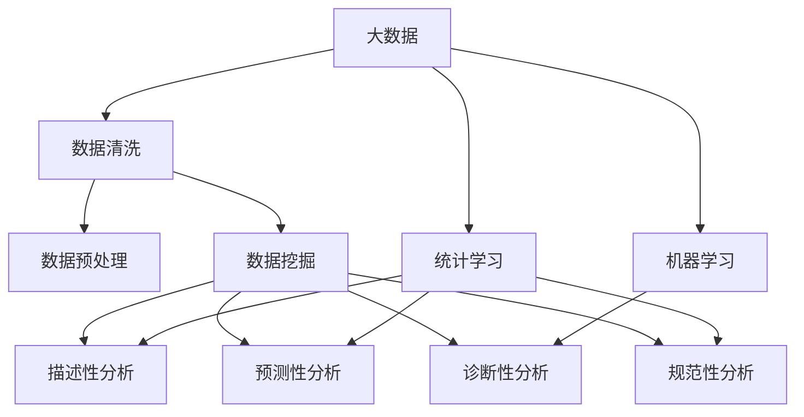

                 

# 大数据分析与知识发现的关系

> 关键词：大数据, 知识发现, 数据分析, 数据挖掘, 统计学习

## 1. 背景介绍

### 1.1 问题由来
在大数据时代，海量数据正以爆炸式增长，而数据中的蕴含的知识对于企业决策、商业智能和科学研究具有重要价值。如何从海量数据中提取出有价值的信息，成为当今数据科学领域的核心问题。知识发现(Knowledge Discovery)，作为数据挖掘(Data Mining)的核心子领域，通过对数据进行统计学习、特征工程和模型训练等方法，从海量数据中发现潜在的知识模式，辅助决策制定和业务优化。

### 1.2 问题核心关键点
大数据分析与知识发现之间的关系密切，两者互相支撑，共同推动数据的价值释放。大数据分析通过数据收集、数据清洗、数据预处理等手段，为知识发现提供充足的数据资源。而知识发现通过数据挖掘、统计学习、模式识别等技术手段，从大数据中提取出有价值的知识模式和洞见。在实际应用中，大数据分析与知识发现往往是密不可分，互相促进的。

## 2. 核心概念与联系

### 2.1 核心概念概述

为更好地理解大数据分析与知识发现之间的联系，本节将介绍几个关键概念：

- 大数据(Big Data)：指数据体量、数据类型和数据处理速度达到现有技术和基础设施无法有效管理和处理的程度。大数据通常具有4个V特征：Volume(体积)、Velocity(速度)、Variety(多样性)和Veracity(真实性)。

- 知识发现(Knowledge Discovery)：从大规模数据中挖掘出隐含的知识模式，辅助决策和优化。知识发现通过数据预处理、数据挖掘、模式识别和结果解释等步骤完成。

- 数据分析(Analytic Analytics)：对大数据进行分析，挖掘出有意义的信息。数据分析包括描述性分析、诊断性分析、预测性分析和规范性分析四个层次。

- 数据挖掘(Data Mining)：指从数据中自动发现模式和知识的过程。数据挖掘主要通过统计学习、机器学习、数据融合和模式识别等技术实现。

- 统计学习(Statistical Learning)：基于统计学理论，使用模型对数据进行建模和预测。统计学习包括回归分析、分类、聚类、关联规则学习等方法。

- 机器学习(Machine Learning)：指让机器通过数据自动学习模式和规律，并应用到新数据上。机器学习包括监督学习、非监督学习和强化学习等。

- 模式识别(Pattern Recognition)：通过学习数据中潜在的模式，对未知数据进行分类和识别。模式识别广泛用于图像处理、语音识别、生物识别等领域。

这些概念之间的逻辑关系可以通过以下Mermaid流程图来展示：



这个流程图展示了大数据、数据分析、知识发现三者之间的关键联系：

1. 大数据通过数据清洗和预处理，为数据分析和知识发现提供数据资源。
2. 统计学习、机器学习、数据挖掘等技术手段，从大数据中挖掘出有价值的信息。
3. 知识发现通过描述性分析、诊断性分析、预测性分析和规范性分析，形成对现实问题的洞见和解决方案。

## 3. 核心算法原理 & 具体操作步骤
### 3.1 算法原理概述

大数据分析与知识发现的算法原理主要基于统计学习、机器学习和数据挖掘等技术手段。其核心思想是通过对大数据进行建模、训练和预测，发现数据中的潜在模式和知识。

### 3.2 算法步骤详解

#### 3.2.1 数据收集与清洗

- 数据收集：从不同数据源（如社交媒体、物联网、客户交易记录等）收集数据。
- 数据清洗：剔除缺失值、重复值和噪声数据，确保数据质量。

#### 3.2.2 数据预处理

- 数据集成：将来自不同数据源的数据进行整合，形成统一的数据集。
- 数据转换：通过数据转换（如标准化、归一化、特征工程等）将数据转换成适合分析的格式。
- 数据规约：通过数据采样、数据降维等手段，减少数据量，提高计算效率。

#### 3.2.3 统计学习

- 数据建模：选择合适的统计模型，如线性回归、逻辑回归、决策树、支持向量机等。
- 模型训练：在训练集上训练模型，学习数据的统计规律。
- 模型评估：在测试集上评估模型性能，选择合适的模型参数。

#### 3.2.4 机器学习

- 特征工程：选择和构造特征，提高模型预测能力。
- 模型训练：在训练集上训练模型，学习数据的模式和规律。
- 模型评估：在测试集上评估模型性能，调整模型参数。

#### 3.2.5 数据挖掘

- 模式识别：通过模式识别技术，发现数据中的模式和规律。
- 关联规则学习：发现数据中的关联规则，辅助决策制定。
- 聚类分析：将数据分为不同的类别，发现数据的内在结构。

#### 3.2.6 知识发现

- 数据可视化：将数据通过图表等方式进行可视化，辅助理解数据特征。
- 统计学习：基于统计学习模型，提取数据中的知识模式。
- 机器学习：基于机器学习模型，发现数据中的隐含知识。

### 3.3 算法优缺点

大数据分析与知识发现的算法具有以下优点：

- 数据驱动：通过数据驱动的统计学习和机器学习，发现数据中的潜在规律和模式。
- 准确性高：使用模型对数据进行建模和预测，提高结果的准确性和可靠性。
- 泛化能力强：统计学习和机器学习模型具有良好的泛化能力，可应用于多种不同类型的数据。
- 自动化程度高：自动化数据预处理、特征工程和模型训练，降低人工干预成本。

同时，这些算法也存在一些缺点：

- 需要大量数据：大数据分析与知识发现依赖于大量的数据，数据收集和清洗成本较高。
- 模型复杂度高：统计学习、机器学习模型的构建和优化较为复杂，需要较高的数学和编程技能。
- 结果可解释性差：一些高级模型如深度学习、集成学习等，难以解释其内部工作机制。
- 算法依赖性高：算法选择和参数调整对最终结果影响较大，需要良好的模型选择和调参能力。

### 3.4 算法应用领域

大数据分析与知识发现的算法在多个领域得到了广泛应用：

- 商业智能(Business Intelligence, BI)：通过大数据分析与知识发现技术，辅助企业制定决策，优化业务流程。
- 金融风控(Financial Risk Control)：通过数据挖掘和统计学习，预测金融风险，防范金融诈骗。
- 医疗健康(Medical Health)：通过数据分析与知识发现，提升医疗诊断水平，优化治疗方案。
- 社交媒体(Social Media)：通过数据挖掘和模式识别，发现用户行为模式，优化社交推荐和广告投放。
- 物联网(IoT)：通过数据集成和分析，发现设备行为规律，优化智能家居和智慧城市建设。

## 4. 数学模型和公式 & 详细讲解 & 举例说明

### 4.1 数学模型构建

本节将使用数学语言对大数据分析与知识发现的过程进行更加严格的刻画。

假设数据集为 $D=\{(x_i,y_i)\}_{i=1}^N$，其中 $x_i \in \mathbb{R}^d$ 为输入变量， $y_i \in \{0,1\}$ 为输出变量。定义模型 $M_{\theta}:\mathbb{R}^d \rightarrow \{0,1\}$，其中 $\theta$ 为模型参数。

定义模型在数据样本 $(x_i,y_i)$ 上的损失函数为 $\ell(M_{\theta}(x_i),y_i)$，则在数据集 $D$ 上的经验风险为：

$$
\mathcal{L}(\theta) = \frac{1}{N} \sum_{i=1}^N \ell(M_{\theta}(x_i),y_i)
$$

在实践中，我们通常使用基于梯度的优化算法（如SGD、Adam等）来近似求解上述最优化问题。设 $\eta$ 为学习率，则参数的更新公式为：

$$
\theta \leftarrow \theta - \eta \nabla_{\theta}\mathcal{L}(\theta)
$$

其中 $\nabla_{\theta}\mathcal{L}(\theta)$ 为损失函数对参数 $\theta$ 的梯度，可通过反向传播算法高效计算。

### 4.2 公式推导过程

以下我们以二分类任务为例，推导逻辑回归模型的梯度公式。

假设模型 $M_{\theta}$ 在输入 $x$ 上的输出为 $\hat{y}=M_{\theta}(x) \in [0,1]$，表示样本属于正类的概率。真实标签 $y \in \{0,1\}$。则二分类逻辑回归模型的损失函数定义为：

$$
\ell(M_{\theta}(x),y) = -[y\log \hat{y} + (1-y)\log (1-\hat{y})]
$$

将其代入经验风险公式，得：

$$
\mathcal{L}(\theta) = -\frac{1}{N}\sum_{i=1}^N [y_i\log M_{\theta}(x_i)+(1-y_i)\log(1-M_{\theta}(x_i))]
$$

根据链式法则，损失函数对参数 $\theta_k$ 的梯度为：

$$
\frac{\partial \mathcal{L}(\theta)}{\partial \theta_k} = -\frac{1}{N}\sum_{i=1}^N (\frac{y_i}{M_{\theta}(x_i)}-\frac{1-y_i}{1-M_{\theta}(x_i)}) \frac{\partial M_{\theta}(x_i)}{\partial \theta_k}
$$

其中 $\frac{\partial M_{\theta}(x_i)}{\partial \theta_k}$ 可进一步递归展开，利用自动微分技术完成计算。

### 4.3 案例分析与讲解

#### 案例分析：推荐系统

推荐系统是一种典型的应用大数据分析与知识发现技术实现的场景。推荐系统通过对用户行为数据进行建模和预测，推荐用户可能感兴趣的商品或服务。

推荐系统一般包括以下步骤：

- 数据收集：收集用户的浏览、购买、评分等行为数据。
- 数据预处理：数据清洗、特征工程和归一化。
- 模型训练：使用统计学习模型（如线性回归、决策树等）训练推荐模型。
- 模型评估：在验证集上评估模型性能，调整模型参数。
- 实时推荐：根据用户实时行为数据，预测用户兴趣，生成推荐列表。

在推荐系统中，常用的统计学习模型包括协同过滤、矩阵分解、基于内容的推荐等。这些模型通过对用户和物品的特征进行建模，预测用户对物品的兴趣。

推荐系统的效果取决于数据质量和模型选择。数据分析与知识发现技术通过数据清洗、特征工程和模型训练，提高推荐系统的精准度和效率。

## 5. 项目实践：代码实例和详细解释说明
### 5.1 开发环境搭建

在进行大数据分析与知识发现的应用实践前，我们需要准备好开发环境。以下是使用Python进行Scikit-learn开发的环境配置流程：

1. 安装Anaconda：从官网下载并安装Anaconda，用于创建独立的Python环境。

2. 创建并激活虚拟环境：
```bash
conda create -n sklearn-env python=3.8 
conda activate sklearn-env
```

3. 安装Scikit-learn：
```bash
pip install -U scikit-learn
```

4. 安装相关依赖：
```bash
pip install numpy pandas matplotlib seaborn
```

完成上述步骤后，即可在`sklearn-env`环境中开始项目实践。

### 5.2 源代码详细实现

下面以二分类问题为例，给出使用Scikit-learn进行逻辑回归模型微调的Python代码实现。

```python
from sklearn.linear_model import LogisticRegression
from sklearn.model_selection import train_test_split
from sklearn.metrics import accuracy_score
from sklearn.datasets import make_classification
from sklearn.preprocessing import StandardScaler
from sklearn.pipeline import make_pipeline

# 生成二分类数据
X, y = make_classification(n_samples=1000, n_features=10, random_state=42)

# 数据预处理
scaler = StandardScaler()
X_scaled = scaler.fit_transform(X)

# 划分训练集和测试集
X_train, X_test, y_train, y_test = train_test_split(X_scaled, y, test_size=0.2, random_state=42)

# 训练逻辑回归模型
model = LogisticRegression(C=1.0)
model.fit(X_train, y_train)

# 模型评估
y_pred = model.predict(X_test)
accuracy = accuracy_score(y_test, y_pred)
print("Accuracy:", accuracy)
```

### 5.3 代码解读与分析

让我们再详细解读一下关键代码的实现细节：

**数据生成**：
- 使用`make_classification`函数生成二分类数据集，包含1000个样本和10个特征。

**数据预处理**：
- 使用`StandardScaler`进行归一化处理，将数据缩放到均值为0，标准差为1的标准正态分布。

**模型训练**：
- 使用`LogisticRegression`模型，设置正则化参数C=1.0。
- 在训练集上调用`fit`方法，拟合模型参数。

**模型评估**：
- 在测试集上调用`predict`方法，生成模型预测结果。
- 使用`accuracy_score`计算模型在测试集上的准确率。

**代码实现**：
- 通过`make_pipeline`函数组合数据预处理和模型训练过程，提高代码复用性和可读性。

可以看到，Scikit-learn使得逻辑回归模型的构建和评估变得简洁高效。开发者可以将更多精力放在模型选择和调参上，而不必过多关注底层实现细节。

## 6. 实际应用场景
### 6.1 商业智能

大数据分析与知识发现技术在商业智能(BI)领域具有重要应用。BI系统通过收集和分析企业的经营数据，辅助管理层制定决策，提升业务效率和竞争优势。

在BI系统中，常用的统计学习模型包括线性回归、时间序列分析、聚类分析等。BI系统通过对企业数据进行统计分析和数据挖掘，发现业务趋势和模式，支持企业战略规划和运营优化。

**案例分析**：零售企业销售分析
- 数据收集：收集企业的销售数据，包括销售额、客户信息、营销活动等。
- 数据预处理：数据清洗、特征工程和归一化。
- 模型训练：使用统计学习模型（如线性回归、时间序列分析等）训练销售预测模型。
- 模型评估：在验证集上评估模型性能，调整模型参数。
- 业务应用：根据预测结果，优化库存管理、促销策略和定价政策。

### 6.2 金融风控

金融风控系统通过大数据分析与知识发现技术，预测和防范金融风险，保护客户资金安全。

在金融风控系统中，常用的统计学习模型包括信用评分模型、违约预测模型、欺诈检测模型等。金融风控系统通过对客户历史交易数据和信用记录进行分析，评估其信用风险和欺诈风险。

**案例分析**：银行信用评估
- 数据收集：收集客户的信用卡交易数据、信用记录、个人信息等。
- 数据预处理：数据清洗、特征工程和归一化。
- 模型训练：使用统计学习模型（如信用评分模型、违约预测模型等）训练信用评估模型。
- 模型评估：在验证集上评估模型性能，调整模型参数。
- 业务应用：根据信用评估结果，决定是否批准贷款申请，调整信贷政策。

### 6.3 医疗健康

医疗健康领域的数据通常具有高维度和非结构化的特点，需要借助大数据分析与知识发现技术进行挖掘和分析。

在医疗健康领域，常用的统计学习模型包括分类模型、聚类模型、关联规则学习等。医疗健康系统通过对患者病历、诊断数据和医疗记录进行分析，发现疾病模式和预测病情发展。

**案例分析**：医院病患管理
- 数据收集：收集医院的病患数据，包括住院记录、诊断报告、实验室检测结果等。
- 数据预处理：数据清洗、特征工程和归一化。
- 模型训练：使用统计学习模型（如分类模型、聚类模型等）训练病患管理模型。
- 模型评估：在验证集上评估模型性能，调整模型参数。
- 业务应用：根据预测结果，优化患者管理流程、提升诊断准确性。

### 6.4 未来应用展望

随着大数据技术的不断进步，大数据分析与知识发现技术将在更多领域得到应用，为各行各业带来变革性影响。

未来，大数据分析与知识发现技术将在以下领域得到广泛应用：

- 智慧城市：通过数据分析与知识发现，提升城市管理效率，优化城市运行。
- 智能制造：通过数据分析与知识发现，优化生产流程，提高生产效率。
- 环境保护：通过数据分析与知识发现，发现环境污染源，制定环境保护策略。
- 生物医药：通过数据分析与知识发现，发现新药物和治疗方法，推动医学研究。
- 金融科技：通过数据分析与知识发现，提高金融服务质量，防范金融风险。

## 7. 工具和资源推荐
### 7.1 学习资源推荐

为了帮助开发者系统掌握大数据分析与知识发现的理论基础和实践技巧，这里推荐一些优质的学习资源：

1. 《Python数据分析与统计学习》系列博文：由数据科学专家撰写，深入浅出地介绍了Python数据分析和统计学习的核心原理和方法。

2. 《数据科学导论》课程：斯坦福大学开设的入门数据科学课程，涵盖数据预处理、统计学习、机器学习等多个主题。

3. 《统计学习方法》书籍：李航教授所著，全面介绍了统计学习的原理和应用，是数据科学的经典教材。

4. 《机器学习实战》书籍：Peter Harrington撰写，通过丰富的案例和代码实现，介绍了机器学习的基本概念和常用算法。

5. 《Kaggle竞赛指南》书籍：Kaggle官方出版，介绍了数据竞赛的基本流程和技巧，帮助开发者提升数据竞赛水平。

通过对这些资源的学习实践，相信你一定能够快速掌握大数据分析与知识发现的精髓，并用于解决实际的数据科学问题。

### 7.2 开发工具推荐

高效的开发离不开优秀的工具支持。以下是几款用于大数据分析与知识发现开发的常用工具：

1. Python：作为数据科学领域的标准编程语言，Python具有丰富的数据科学库和框架，适合快速迭代研究。

2. R：作为数据科学领域的另一重要工具，R具有强大的统计分析和数据可视化能力，适用于学术研究和大数据分析。

3. Scikit-learn：开源机器学习库，提供了丰富的统计学习算法和工具，是数据科学家的必备工具。

4. TensorFlow：由Google主导开发的深度学习框架，支持分布式计算和大规模数据分析。

5. Apache Spark：开源大数据处理框架，提供了强大的数据处理和分析能力，适用于大数据量数据集的计算。

6. Jupyter Notebook：开源的交互式数据科学平台，支持Python、R等多种语言，方便数据分析和模型训练。

合理利用这些工具，可以显著提升大数据分析与知识发现的开发效率，加快创新迭代的步伐。

### 7.3 相关论文推荐

大数据分析与知识发现技术的发展源于学界的持续研究。以下是几篇奠基性的相关论文，推荐阅读：

1. 《The Elements of Statistical Learning》：Hastie、Tibshirani、Friedman所著，介绍了统计学习的基本原理和常用算法。

2. 《Pattern Recognition and Machine Learning》：Christopher Bishop所著，介绍了模式识别和机器学习的基本原理和应用。

3. 《Data Mining: Concepts and Techniques》：Jerry K. Hollin所著，介绍了数据挖掘的基本原理和常用方法。

4. 《Big Data: Concepts, Technology, and Applications》：Joel H. Saltz所著，介绍了大数据的基本概念和应用场景。

5. 《Data Science for Business》：Juan Carlos Suarez-Rodriguez所著，介绍了数据科学在商业中的应用。

这些论文代表了大数据分析与知识发现技术的发展脉络。通过学习这些前沿成果，可以帮助研究者把握学科前进方向，激发更多的创新灵感。

## 8. 总结：未来发展趋势与挑战

### 8.1 总结

本文对大数据分析与知识发现进行了全面系统的介绍。首先阐述了大数据分析与知识发现的研究背景和意义，明确了大数据分析与知识发现的重要价值。其次，从原理到实践，详细讲解了大数据分析与知识发现的数学原理和关键步骤，给出了大数据分析与知识发现任务开发的完整代码实例。同时，本文还广泛探讨了大数据分析与知识发现技术在商业智能、金融风控、医疗健康等多个行业领域的应用前景，展示了大数据分析与知识发现的巨大潜力。此外，本文精选了大数据分析与知识发现的各类学习资源，力求为读者提供全方位的技术指引。

通过本文的系统梳理，可以看到，大数据分析与知识发现技术正在成为数据科学领域的重要范式，极大地拓展了数据分析和数据挖掘的应用边界，为数据驱动的决策制定和业务优化提供了坚实的基础。未来，伴随大数据技术的不断进步，大数据分析与知识发现技术必将得到更加广泛的应用，推动数据科学向更深层次发展。

### 8.2 未来发展趋势

展望未来，大数据分析与知识发现技术将呈现以下几个发展趋势：

1. 算法自动化：随着算法自动化技术的发展，自动化的模型选择和调参将大幅降低数据分析与知识发现的技术门槛，加速模型迭代优化。

2. 模型集成：未来的模型将不仅仅是单一的统计学习或机器学习模型，而是多种模型的集成，提升模型的泛化能力和准确性。

3. 数据处理自动化：通过自动化数据清洗、数据转换和特征工程，提高数据处理效率，降低人工干预成本。

4. 云计算与大数据：云计算和大数据技术的发展，将为大数据分析与知识发现提供更强大、更灵活的计算和存储资源。

5. 数据可视化：数据可视化技术的发展，将进一步提升数据分析和知识发现的可视化和交互性，帮助用户更好地理解数据。

6. 跨领域应用：大数据分析与知识发现技术将进一步拓展到更多领域，推动跨领域的数据融合和应用。

以上趋势凸显了大数据分析与知识发现技术的广阔前景。这些方向的探索发展，必将进一步提升大数据分析与知识发现技术的性能和应用范围，为数据科学领域带来更多创新突破。

### 8.3 面临的挑战

尽管大数据分析与知识发现技术已经取得了瞩目成就，但在迈向更加智能化、普适化应用的过程中，它仍面临着诸多挑战：

1. 数据隐私和安全：大数据分析与知识发现技术需要处理大量的个人和企业数据，涉及数据隐私和安全问题。如何保护数据隐私，防止数据泄露和滥用，将是重要的研究课题。

2. 数据质量与准确性：大数据分析与知识发现的效果很大程度上依赖于数据的质量和准确性。如何提高数据采集、存储和处理的准确性，确保分析结果的可信度，还需要更多技术手段的支撑。

3. 计算资源消耗：大数据分析与知识发现任务通常需要处理海量数据，涉及复杂的计算和存储资源，计算资源消耗较大。如何优化计算过程，提高资源利用率，将是重要的优化方向。

4. 模型可解释性：许多高级模型如深度学习、集成学习等，难以解释其内部工作机制。如何赋予模型更强的可解释性，帮助用户理解和信任分析结果，将是重要的研究方向。

5. 多源数据融合：在实际应用中，数据通常来自多个异构数据源，如何融合不同类型的数据，提升分析结果的全面性和准确性，将是重要的技术挑战。

6. 动态数据处理：现实世界中的数据是动态变化的，如何处理动态数据，及时更新分析结果，将是重要的研究方向。

正视大数据分析与知识发现面临的这些挑战，积极应对并寻求突破，将是大数据分析与知识发现技术走向成熟的必由之路。相信随着学界和产业界的共同努力，这些挑战终将一一被克服，大数据分析与知识发现技术必将进一步推动数据科学领域的进步和发展。

### 8.4 研究展望

面对大数据分析与知识发现所面临的种种挑战，未来的研究需要在以下几个方面寻求新的突破：

1. 引入多模态数据：将多源异构数据进行融合，提升分析结果的全面性和准确性。

2. 开发新的统计学习算法：开发新的高效、可靠的统计学习算法，降低计算资源消耗，提高模型可解释性。

3. 探索深度学习在数据分析中的应用：深度学习在大数据处理中展现出强大的能力，探索深度学习在统计学习中的应用，提升分析效果。

4. 强化学习在数据分析中的应用：强化学习在大数据处理中具有独特的优势，探索强化学习在数据分析中的应用，提升数据分析效率。

5. 数据隐私保护技术：研究数据隐私保护技术，如差分隐私、联邦学习等，保护数据隐私，防止数据泄露和滥用。

6. 实时动态数据处理：研究实时动态数据处理技术，如流数据处理、增量学习等，提升数据分析的时效性。

这些研究方向的探索，必将引领大数据分析与知识发现技术迈向更高的台阶，为数据科学领域带来更多创新突破。面向未来，大数据分析与知识发现技术还需要与其他人工智能技术进行更深入的融合，如知识表示、因果推理、强化学习等，多路径协同发力，共同推动数据分析和知识发现系统的进步。只有勇于创新、敢于突破，才能不断拓展数据分析与知识发现的边界，让数据驱动的智能决策更加可靠和高效。

## 9. 附录：常见问题与解答

**Q1：什么是大数据分析与知识发现？**

A: 大数据分析与知识发现是大数据分析与数据挖掘的结合，指从大规模数据中提取有价值的知识模式，辅助决策和优化。大数据分析与知识发现主要依赖统计学习、机器学习、数据挖掘等技术手段，通过对数据进行建模、训练和预测，发现数据中的潜在规律和模式。

**Q2：如何选择合适的统计学习模型？**

A: 选择合适的统计学习模型需要综合考虑数据类型、数据分布、任务目标等因素。常用的统计学习模型包括线性回归、逻辑回归、决策树、支持向量机、聚类分析等。通过数据探索、模型选择和调参，逐步筛选出最合适的模型。

**Q3：数据清洗和预处理过程中需要注意哪些问题？**

A: 数据清洗和预处理是数据分析与知识发现的关键环节，需要注意以下问题：
1. 数据完整性：剔除缺失值和异常值，确保数据的完整性和准确性。
2. 数据一致性：统一数据格式和单位，确保数据的一致性。
3. 数据稀疏性：处理数据稀疏性，选择合适的特征选择方法，提高模型预测能力。
4. 数据归一化：通过数据归一化，将数据缩放到合适的范围内，提高模型训练效率。

**Q4：如何评估大数据分析与知识发现模型的效果？**

A: 评估大数据分析与知识发现模型的效果，通常使用以下指标：
1. 准确率(Accuracy)：分类任务中，正确预测的样本数占总样本数的比例。
2. 召回率(Recall)：分类任务中，正确预测的正样本数占实际正样本数的比例。
3. 精确率(Precision)：分类任务中，正确预测的正样本数占预测为正的样本数的比例。
4. F1 Score：精确率和召回率的调和平均数，综合评估分类模型的性能。
5. ROC曲线和AUC值：用于评估二分类模型的性能，ROC曲线下的面积越接近1，模型的性能越好。

**Q5：如何处理动态数据？**

A: 处理动态数据需要采用增量学习、流数据处理等技术手段。增量学习指在模型已经训练好的基础上，不断接收新数据进行更新，避免从头训练模型的资源浪费。流数据处理指在数据实时生成的过程中，对数据进行实时处理和分析，提高数据的时效性。

这些问题的解答，帮助读者全面理解大数据分析与知识发现的核心概念和关键技术，为进一步探索该领域的实践和研究提供指导。通过本文的系统梳理，相信你一定能够快速掌握大数据分析与知识发现的精髓，并用于解决实际的数据科学问题。

---

作者：禅与计算机程序设计艺术 / Zen and the Art of Computer Programming

