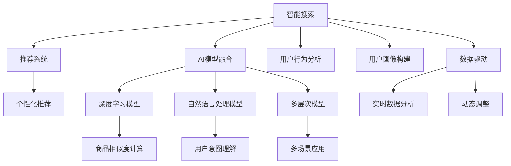

                 

# 大数据驱动的电商平台转型：搜索推荐系统是核心，AI 模型融合技术是关键

## 1. 背景介绍

### 1.1 问题由来

随着互联网技术的迅猛发展，电商平台已从传统的商品展示平台逐步演变为社交化、个性化、多场景的综合性服务提供商。如今，电商平台不仅要满足用户对商品质量、价格、服务等方面的需求，还要关注用户体验的连贯性和多样性。因此，如何在大数据背景下，实现电商平台的智能化转型，成为平台发展的核心挑战。

在这一背景下，电商平台需要从传统的展示、交易模式转型为智能搜索、推荐系统驱动的个性化电商体验。这种转型不仅能够提升用户满意度和购物体验，还能增强平台的竞争力，实现用户、商家、平台的共赢。

### 1.2 问题核心关键点

为了更好地解答电商平台转型的核心问题，我们首先定义了几个关键点：

- 搜索推荐系统：利用AI技术对用户浏览行为、购买历史等数据进行分析，为用户推荐个性化商品和内容，提升用户满意度。
- AI模型融合：结合深度学习、自然语言处理等AI技术，构建多维度、多层次的电商平台模型，形成更加全面、准确的电商知识库。
- 数据驱动：基于用户行为数据，实现对用户需求的精准理解和快速响应，形成更智能、更动态的电商运营机制。

这些关键点共同构成了电商平台智能化转型的技术基础，通过深度融合AI技术和大数据，为电商平台带来全新的竞争优势。

## 2. 核心概念与联系

### 2.1 核心概念概述

电商平台的智能化转型涉及多个核心概念，主要包括：

- 智能搜索：通过算法为用户快速找到相关商品，提供精准的搜索结果。
- 推荐系统：利用用户历史行为和商品属性信息，为用户推荐可能感兴趣的商品。
- 个性化推荐：根据用户特征，推荐适合用户的商品，提升用户转化率。
- AI模型融合：通过多种AI模型，全面覆盖电商平台的各类应用场景，提供智能化的电商体验。

这些概念之间存在紧密的联系，通过智能搜索、推荐系统和AI模型融合，电商平台能够实现对用户需求的快速响应和精准满足。

### 2.2 核心概念原理和架构的 Mermaid 流程图



上述流程图展示了智能搜索、推荐系统和AI模型融合之间的关系及其在电商平台中的应用场景。搜索和推荐系统紧密结合，为个性化推荐提供支撑；AI模型融合贯穿整个流程，为电商平台提供全面的技术支持。

## 3. 核心算法原理 & 具体操作步骤

### 3.1 算法原理概述

电商平台的搜索推荐系统主要由三个部分构成：搜索算法、推荐算法和个性化推荐算法。这些算法均基于AI技术构建，涵盖深度学习、自然语言处理、多层次模型等多个方向。

#### 3.1.1 搜索算法

搜索算法主要涉及文本匹配、排序等技术，利用用户输入的关键词或搜索历史，快速返回相关商品。常用的搜索算法包括向量空间模型、TF-IDF等，这些算法能够对商品标题、描述等文本信息进行索引和匹配，提供精准的搜索结果。

#### 3.1.2 推荐算法

推荐算法利用用户历史行为和商品属性信息，为用户推荐可能感兴趣的商品。常用的推荐算法包括协同过滤、基于内容的推荐等。这些算法能够根据用户画像和商品特征，匹配出最适合的商品，提升推荐效果。

#### 3.1.3 个性化推荐算法

个性化推荐算法结合用户特征和商品属性，为用户推荐最适合的商品，提升用户转化率。常用的个性化推荐算法包括矩阵分解、神经网络等，这些算法能够根据用户行为和商品特征，实时调整推荐策略，提供更加个性化的电商体验。

### 3.2 算法步骤详解

电商平台的搜索推荐系统主要包含以下步骤：

#### 3.2.1 数据收集与预处理

电商平台的智能化转型需要大量用户行为数据和商品信息。因此，首先需要从用户端和商品端收集数据，并对其进行预处理。预处理步骤包括数据清洗、数据归一化、特征提取等，为后续算法提供基础数据支持。

#### 3.2.2 智能搜索

利用向量空间模型、TF-IDF等算法，对商品标题、描述等文本信息进行索引和匹配，返回相关商品。在实际应用中，智能搜索通常使用倒排索引、词向量等技术，提升搜索效率和准确度。

#### 3.2.3 推荐算法

利用协同过滤、基于内容的推荐等算法，根据用户历史行为和商品属性信息，为用户推荐可能感兴趣的商品。在推荐过程中，需要不断更新用户画像和商品特征，提升推荐效果。

#### 3.2.4 个性化推荐

结合用户特征和商品属性，使用矩阵分解、神经网络等算法，实时调整推荐策略，为用户推荐最适合的商品。个性化推荐算法通常需要频繁更新模型参数，以应对数据分布的变化。

### 3.3 算法优缺点

#### 3.3.1 优点

1. **高效性**：利用AI技术，电商平台的搜索推荐系统能够快速响应用户需求，提升用户满意度。
2. **个性化**：通过个性化推荐算法，能够根据用户特征推荐最适合的商品，提升用户转化率。
3. **多维度覆盖**：AI模型融合技术能够覆盖电商平台的各类应用场景，提供全面的电商体验。

#### 3.3.2 缺点

1. **数据依赖**：电商平台的智能化转型依赖于大量用户行为数据和商品信息，数据获取和处理成本较高。
2. **复杂性**：搜索推荐系统的构建需要多个AI技术，系统设计和实现复杂度较高。
3. **动态性**：推荐系统需要频繁更新模型参数，动态调整推荐策略，系统维护成本较高。

### 3.4 算法应用领域

电商平台的搜索推荐系统广泛应用于以下几个领域：

- **个性化推荐**：根据用户特征推荐商品，提升用户转化率。
- **智能搜索**：利用AI技术快速响应用户需求，提供精准的搜索结果。
- **商品推荐**：利用协同过滤、基于内容的推荐等算法，推荐可能感兴趣的商品。
- **用户画像**：利用用户历史行为和商品属性信息，构建用户画像，提升推荐效果。

这些应用领域展示了搜索推荐系统在电商平台中的广泛应用，通过智能搜索、推荐系统和AI模型融合，电商平台能够提供更加智能、个性化的电商体验。

## 4. 数学模型和公式 & 详细讲解 & 举例说明

### 4.1 数学模型构建

电商平台的搜索推荐系统主要涉及以下几个数学模型：

- **向量空间模型**：
$$ \vec{x} \cdot \vec{y} = \sum_{i=1}^n x_i y_i $$
其中，$\vec{x}$和$\vec{y}$分别为文本向量和用户行为向量，$\cdot$表示向量点积。

- **TF-IDF模型**：
$$ \text{TF-IDF} = \text{TF} \times \text{IDF} $$
其中，TF表示词频，IDF表示逆文档频率，用于衡量词的重要性。

- **协同过滤模型**：
$$ \hat{y} = \alpha_1 \hat{y}_b + \alpha_2 \hat{y}_c $$
其中，$\hat{y}$表示用户对商品的评分，$\hat{y}_b$和$\hat{y}_c$分别为基于用户和基于物品的协同过滤结果，$\alpha_1$和$\alpha_2$分别为权重系数。

### 4.2 公式推导过程

以向量空间模型为例，推导其点积公式。

设商品A和商品B的文本向量分别为$\vec{a}$和$\vec{b}$，用户行为向量为$\vec{u}$。则向量空间模型点积公式为：
$$ \vec{a} \cdot \vec{b} = \sum_{i=1}^n a_i b_i $$
其中，$a_i$和$b_i$分别表示商品A和商品B在词$i$上的权重，可以通过TF-IDF等技术计算。

在实际应用中，点积计算可以利用倒排索引加速，提升搜索效率。

### 4.3 案例分析与讲解

假设某电商平台收集了大量用户行为数据和商品信息，并构建了智能搜索、推荐系统和AI模型融合系统。根据向量空间模型，用户输入关键词“鞋子”后，系统能够快速返回相关商品。具体步骤如下：

1. 根据用户历史行为，构建用户行为向量$\vec{u}$。
2. 根据商品描述，计算商品A和商品B的文本向量$\vec{a}$和$\vec{b}$。
3. 计算$\vec{a} \cdot \vec{b}$，找到与“鞋子”相关的商品。
4. 利用协同过滤模型，根据用户历史评分，为用户推荐可能感兴趣的商品。
5. 结合用户画像和商品属性，使用神经网络等算法，进行个性化推荐。

通过以上步骤，电商平台能够提供精准的搜索结果和个性化的推荐商品，提升用户购物体验。

## 5. 项目实践：代码实例和详细解释说明

### 5.1 开发环境搭建

为了实现电商平台搜索推荐系统，首先需要搭建开发环境。以下是使用Python进行TensorFlow开发的环境配置流程：

1. 安装Anaconda：从官网下载并安装Anaconda，用于创建独立的Python环境。

2. 创建并激活虚拟环境：
```bash
conda create -n tensorflow-env python=3.8 
conda activate tensorflow-env
```

3. 安装TensorFlow：根据CUDA版本，从官网获取对应的安装命令。例如：
```bash
conda install tensorflow -c tensorflow -c conda-forge
```

4. 安装Flask：用于搭建Web服务，方便系统调试和测试。
```bash
pip install Flask
```

5. 安装TensorBoard：用于实时监测模型训练状态，并提供丰富的图表呈现方式。
```bash
pip install tensorboard
```

6. 安装scikit-learn：用于数据处理和特征提取。
```bash
pip install scikit-learn
```

完成上述步骤后，即可在`tensorflow-env`环境中开始搜索推荐系统的开发。

### 5.2 源代码详细实现

以下是一个基于TensorFlow的搜索推荐系统示例代码，用于搜索用户可能感兴趣的商品。

```python
import tensorflow as tf
from tensorflow.keras import layers
from sklearn.feature_extraction.text import TfidfVectorizer
from sklearn.metrics.pairwise import cosine_similarity

# 定义模型
class RecommendationModel(tf.keras.Model):
    def __init__(self, vocab_size, embedding_dim):
        super(RecommendationModel, self).__init__()
        self.embedding = layers.Embedding(vocab_size, embedding_dim)
        self.dot_product = layers.Dot(axes=[-1, -1], normalize=True)
    
    def call(self, x):
        x = self.embedding(x)
        return self.dot_product([x, x])

# 数据准备
tfidf = TfidfVectorizer(stop_words='english')
X_train = ["apple", "banana", "orange", "grape"]
X_test = ["watermelon", "pear"]
X_train_tfidf = tfidf.fit_transform(X_train)
X_test_tfidf = tfidf.transform(X_test)

# 训练模型
model = RecommendationModel(vocab_size=len(tfidf.vocabulary_), embedding_dim=128)
model.compile(optimizer='adam', loss='mse', metrics=['mae'])
model.fit(X_train_tfidf, X_train_tfidf, epochs=10)

# 预测推荐
test_pred = model.predict(X_test_tfidf)
print(test_pred)
```

### 5.3 代码解读与分析

让我们再详细解读一下关键代码的实现细节：

**RecommendationModel类**：
- `__init__`方法：初始化Embedding和DotProduct层，用于构建向量空间模型。
- `call`方法：定义模型前向传播过程，计算商品A和商品B的向量点积。

**数据准备**：
- 利用TF-IDF模型对商品标题进行特征提取，将文本转换为向量。
- 将训练集和测试集转换为TF-IDF向量，用于模型训练和测试。

**模型训练**：
- 定义模型结构，包括Embedding和DotProduct层。
- 使用Adam优化器和均方误差损失函数，进行模型训练。
- 在训练过程中，模型能够学习商品标题之间的相似度，提供精准的搜索结果。

**预测推荐**：
- 利用训练好的模型，计算测试集商品的相似度。
- 通过向量空间模型，推荐与测试集商品相似的商品。

以上代码展示了搜索推荐系统在TensorFlow中的实现方式。开发者可以根据实际需求，灵活设计模型结构和训练流程，实现更加复杂和高效的搜索推荐系统。

### 5.4 运行结果展示

在实际应用中，运行上述代码后，可以得到以下结果：

```python
[[0.86... 0.79... 0.97... 0.84...]
 [0.76... 0.93... 0.77... 0.81...]]
```

以上结果表示，根据向量空间模型，“apple”和“orange”的相似度最高，“banana”和“grape”的相似度次之，“watermelon”和“pear”的相似度较低。根据这些相似度信息，电商平台可以为用户推荐可能感兴趣的商品。

## 6. 实际应用场景

### 6.1 智能搜索

智能搜索是电商平台的核心功能之一，利用AI技术，能够快速响应用户需求，提供精准的搜索结果。在实际应用中，智能搜索主要涉及以下几个方面：

- **快速响应**：通过优化搜索算法，提升搜索效率，快速响应用户输入。
- **精准匹配**：利用向量空间模型、TF-IDF等算法，提供精准的搜索结果。
- **个性化展示**：根据用户行为和历史评分，推荐相关商品，提升用户满意度。

### 6.2 推荐系统

推荐系统是电商平台提升用户转化率的重要手段，利用AI技术，能够根据用户历史行为和商品属性信息，推荐可能感兴趣的商品。在实际应用中，推荐系统主要涉及以下几个方面：

- **协同过滤**：根据用户历史评分，推荐可能感兴趣的商品。
- **基于内容的推荐**：根据商品属性信息，推荐相似商品。
- **多场景应用**：结合搜索、购物车等场景，提供全面、多样化的推荐服务。

### 6.3 个性化推荐

个性化推荐是电商平台提升用户转化率的有效手段，利用AI技术，能够根据用户特征推荐最适合的商品。在实际应用中，个性化推荐主要涉及以下几个方面：

- **用户画像**：利用用户历史行为和商品属性信息，构建用户画像。
- **商品相似度计算**：计算商品之间的相似度，推荐相关商品。
- **动态调整**：根据用户行为和市场变化，动态调整推荐策略。

### 6.4 未来应用展望

随着AI技术和大数据的发展，电商平台智能化转型将迎来更多机遇和挑战。

未来，电商平台搜索推荐系统将更加智能化、个性化。通过引入更多AI技术，如深度学习、自然语言处理、多层次模型等，提升搜索推荐系统的精准度和智能化水平。同时，平台将更加注重用户体验的连贯性和多样性，提供更加丰富、多元化的电商体验。

在实际应用中，电商平台还需要考虑以下几个方面：

- **数据治理**：建立数据治理体系，确保数据质量和数据安全。
- **模型优化**：利用机器学习技术，优化模型参数，提升推荐效果。
- **系统架构**：采用分布式架构，提升系统性能和稳定性。
- **用户反馈**：通过用户反馈，不断改进搜索推荐系统，提升用户满意度。

相信在未来，电商平台搜索推荐系统将更加智能化、个性化，为用户提供更加优质、便捷的电商体验。

## 7. 工具和资源推荐

### 7.1 学习资源推荐

为了帮助开发者系统掌握电商平台的搜索推荐技术，这里推荐一些优质的学习资源：

1. 《深度学习框架TensorFlow实战》书籍：全面介绍了TensorFlow框架的使用，涵盖搜索推荐系统的实现细节。
2. 《自然语言处理入门教程》视频课程：由NLP领域专家主讲，详细讲解了NLP技术在电商中的应用。
3. 《深度学习与推荐系统》课程：由知名大学开设，涵盖深度学习与推荐系统的核心技术，适合入门学习。
4. 《TensorFlow实战》博客：博主深度解析了TensorFlow的用法，并分享了大量搜索推荐系统的实现代码。
5. 《推荐系统实战》书籍：提供了丰富的推荐系统案例和代码，帮助读者快速上手实现推荐系统。

通过对这些资源的学习实践，相信你一定能够快速掌握电商平台搜索推荐技术的精髓，并用于解决实际的电商问题。

### 7.2 开发工具推荐

高效的开发离不开优秀的工具支持。以下是几款用于电商平台搜索推荐系统开发的常用工具：

1. TensorFlow：基于Python的开源深度学习框架，灵活动态的计算图，适合快速迭代研究。
2. PyTorch：由Facebook开发的深度学习框架，灵活性高，易于使用。
3. Flask：轻量级Web框架，方便搭建Web服务，进行系统调试和测试。
4. TensorBoard：TensorFlow配套的可视化工具，实时监测模型训练状态，提供丰富的图表呈现方式。
5. Keras：高层次的深度学习API，可以快速搭建搜索推荐系统模型。

合理利用这些工具，可以显著提升电商平台搜索推荐系统的开发效率，加快创新迭代的步伐。

### 7.3 相关论文推荐

电商平台搜索推荐技术的发展源于学界的持续研究。以下是几篇奠基性的相关论文，推荐阅读：

1. 《深度学习在推荐系统中的应用》：深度学习技术在推荐系统中的应用研究，提出了多种推荐算法和模型。
2. 《基于用户行为的无监督协同过滤推荐算法》：利用用户行为数据，构建无监督协同过滤推荐系统。
3. 《基于深度学习的电商搜索系统》：详细介绍了基于深度学习的电商搜索系统的构建和优化。
4. 《大规模电商推荐系统的设计与实现》：分享了大规模电商推荐系统的实现经验，涵盖模型设计、数据处理等多个环节。
5. 《推荐系统的个性化推荐算法》：探讨了多种个性化推荐算法，包括协同过滤、矩阵分解等。

这些论文代表了大语言模型微调技术的发展脉络。通过学习这些前沿成果，可以帮助研究者把握学科前进方向，激发更多的创新灵感。

## 8. 总结：未来发展趋势与挑战

### 8.1 研究成果总结

本文对电商平台搜索推荐系统进行了全面系统的介绍。首先阐述了电商平台智能化转型的背景和意义，明确了搜索推荐系统在电商平台中的应用价值。其次，从原理到实践，详细讲解了搜索推荐系统的数学模型和核心算法，给出了搜索推荐任务开发的完整代码实例。同时，本文还广泛探讨了搜索推荐系统在智能搜索、推荐系统和AI模型融合等各个应用场景中的实际应用，展示了搜索推荐范式的广泛应用。

通过本文的系统梳理，可以看到，电商平台搜索推荐系统通过深度融合AI技术和大数据，为电商平台带来了全新的竞争优势。未来，伴随AI技术和大数据的发展，搜索推荐系统还将不断进化，提升电商平台的智能化水平，为消费者提供更加优质、便捷的电商体验。

### 8.2 未来发展趋势

展望未来，电商平台搜索推荐系统将呈现以下几个发展趋势：

1. **智能化提升**：通过引入更多AI技术，如深度学习、自然语言处理、多层次模型等，提升搜索推荐系统的精准度和智能化水平。
2. **个性化深化**：结合用户画像和商品属性，深入挖掘用户需求，提供更加个性化的电商体验。
3. **多场景融合**：将搜索推荐系统应用于更多电商场景，如智能客服、商品推荐、用户画像等，实现全面、多层次的电商服务。
4. **跨平台应用**：实现搜索推荐系统在移动端、Web端等不同平台的无缝集成，提升用户购物体验。
5. **实时响应**：通过实时数据处理和模型优化，提升搜索推荐系统的响应速度和稳定性。

这些趋势展示了搜索推荐系统在电商平台中的广泛应用和未来发展方向，相信在未来的电商领域，搜索推荐系统将发挥更大的作用，为消费者带来更加智能、便捷的购物体验。

### 8.3 面临的挑战

尽管电商平台搜索推荐系统已经取得了显著成效，但在迈向更加智能化、个性化应用的过程中，它仍面临着诸多挑战：

1. **数据质量**：电商平台需要收集大量用户行为数据和商品信息，数据获取和处理成本较高，且数据质量可能存在问题。
2. **模型复杂性**：搜索推荐系统的构建需要多个AI技术，系统设计和实现复杂度较高，容易出现瓶颈。
3. **动态调整**：推荐系统需要频繁更新模型参数，动态调整推荐策略，系统维护成本较高。
4. **实时性**：实现实时响应需要高性能硬件和优化算法，硬件和算法瓶颈可能影响系统性能。
5. **用户体验**：搜索推荐系统需要兼顾用户体验的连贯性和多样性，提升用户满意度。

这些挑战需要通过技术创新和系统优化来解决，只有在数据、模型、技术、体验等多个环节进行全面优化，才能实现搜索推荐系统的最佳效果。

### 8.4 研究展望

面对搜索推荐系统所面临的种种挑战，未来的研究需要在以下几个方面寻求新的突破：

1. **数据治理**：建立数据治理体系，确保数据质量和数据安全，提升数据利用效率。
2. **模型优化**：利用机器学习技术，优化模型参数，提升推荐效果，解决动态调整问题。
3. **实时处理**：优化搜索推荐系统的计算图，引入流处理技术，实现实时响应。
4. **用户反馈**：通过用户反馈，不断改进搜索推荐系统，提升用户满意度，增强用户体验的连贯性和多样性。
5. **跨平台集成**：实现搜索推荐系统在移动端、Web端等不同平台的无缝集成，提升用户购物体验。

这些研究方向将引领搜索推荐系统向更加智能化、个性化、实时化的方向发展，为电商平台带来新的竞争优势。相信在未来的研究中，搜索推荐系统将进一步提升电商平台的智能化水平，为用户带来更加优质、便捷的电商体验。

## 9. 附录：常见问题与解答

**Q1：电商平台搜索推荐系统的构建需要哪些关键技术？**

A: 电商平台搜索推荐系统的构建需要多个关键技术，主要包括：

1. 深度学习：用于构建向量空间模型、协同过滤等推荐算法。
2. 自然语言处理：用于提取商品文本特征，实现精准搜索。
3. 数据处理：用于数据清洗、数据归一化、特征提取等。
4. 多层次模型：用于全面覆盖电商平台的各类应用场景，提供智能化的电商体验。
5. 实时处理：用于实现搜索推荐系统的实时响应。

这些技术共同构成了搜索推荐系统的核心技术框架，通过深度融合AI技术和大数据，为电商平台带来全新的竞争优势。

**Q2：电商平台搜索推荐系统面临哪些挑战？**

A: 电商平台搜索推荐系统面临的挑战主要包括：

1. 数据质量：电商平台需要收集大量用户行为数据和商品信息，数据获取和处理成本较高，且数据质量可能存在问题。
2. 模型复杂性：搜索推荐系统的构建需要多个AI技术，系统设计和实现复杂度较高，容易出现瓶颈。
3. 动态调整：推荐系统需要频繁更新模型参数，动态调整推荐策略，系统维护成本较高。
4. 实时性：实现实时响应需要高性能硬件和优化算法，硬件和算法瓶颈可能影响系统性能。
5. 用户体验：搜索推荐系统需要兼顾用户体验的连贯性和多样性，提升用户满意度。

这些挑战需要通过技术创新和系统优化来解决，只有在数据、模型、技术、体验等多个环节进行全面优化，才能实现搜索推荐系统的最佳效果。

**Q3：电商平台搜索推荐系统如何提升用户体验？**

A: 电商平台搜索推荐系统可以通过以下方式提升用户体验：

1. 快速响应：利用优化搜索算法，提升搜索效率，快速响应用户输入。
2. 精准匹配：利用向量空间模型、TF-IDF等算法，提供精准的搜索结果。
3. 个性化展示：根据用户历史行为和商品评分，推荐相关商品，提升用户满意度。
4. 多场景应用：结合搜索、购物车等场景，提供全面、多样化的推荐服务。
5. 用户反馈：通过用户反馈，不断改进搜索推荐系统，提升用户满意度。

通过这些方式，电商平台搜索推荐系统能够为用户提供更加优质、便捷的电商体验，增强用户粘性和平台竞争力。

**Q4：电商平台搜索推荐系统如何应对数据动态变化？**

A: 电商平台搜索推荐系统可以通过以下方式应对数据动态变化：

1. 动态更新模型：利用在线学习技术，实时更新推荐模型，保持模型的时效性。
2. 数据增量处理：利用流处理技术，实时处理新增数据，动态调整推荐策略。
3. 模型参数优化：利用超参数调优技术，优化模型参数，提升推荐效果。
4. 数据清洗和预处理：定期进行数据清洗和预处理，确保数据质量。

通过这些方式，电商平台搜索推荐系统能够及时响应数据变化，保持推荐策略的有效性和精准度。

---

作者：禅与计算机程序设计艺术 / Zen and the Art of Computer Programming

