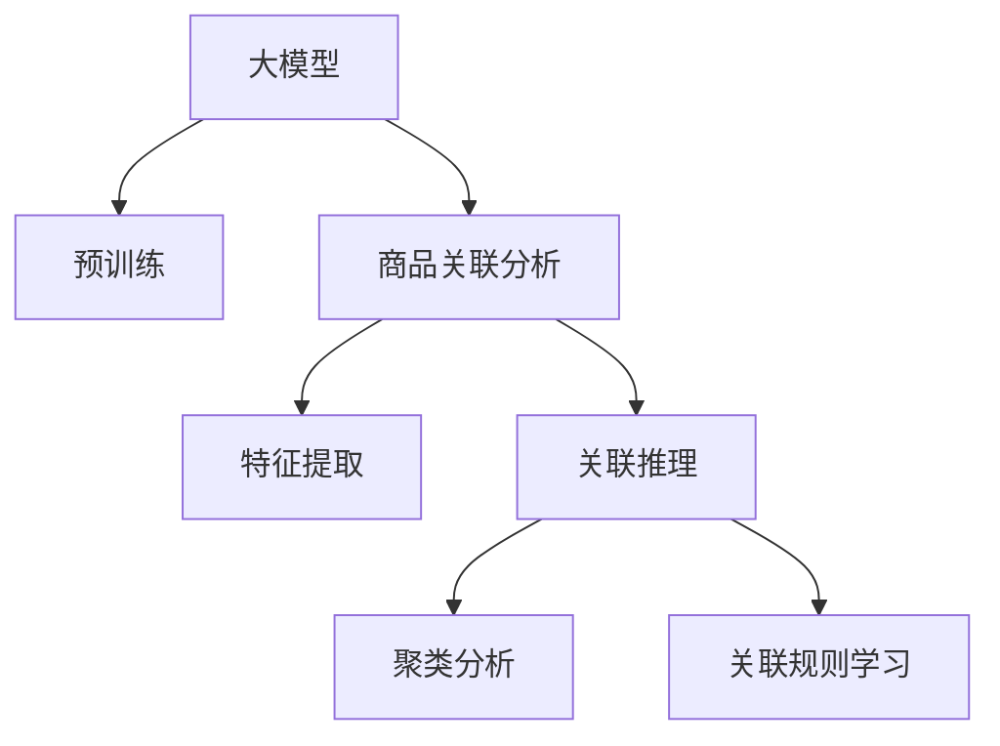

                 

## 1. 背景介绍

### 1.1 问题由来
商品关联分析（Product Association Analysis）是现代零售行业的一个重要问题，旨在揭示商品之间的潜在关联，从而优化商品推荐、库存管理、营销策略等。传统的关联分析方法基于频繁项集挖掘（Frequent Itemset Mining, FIM）和关联规则学习（Association Rule Learning, ARL），依赖大量数据和复杂的算法，计算复杂度高，难以实时处理。近年来，随着深度学习技术的发展，基于大模型的关联分析方法开始崭露头角，成为新一轮的研究热点。

大模型，尤其是基于自回归模型的预训练语言模型（如GPT、BERT等），凭借其强大的表示能力和泛化能力，在商品关联分析中的应用正成为一种新的研究范式。通过大规模预训练，这些模型能够学习到丰富的商品语义表示，从而在关联分析任务中取得不俗的效果。

### 1.2 问题核心关键点
大模型在商品关联分析中的应用核心在于如何利用其表示能力，高效挖掘商品之间的潜在关联。主要包括以下几个关键点：
1. **大规模预训练**：大模型通过在大量商品文本数据上进行预训练，学习到商品名称、描述、属性等丰富的语义信息。
2. **特征提取**：大模型具备强大的特征提取能力，能够将文本数据转化为高维向量表示，用于后续的关联分析。
3. **关联推理**：基于大模型的向量表示，可以设计各种关联推理算法，如聚类、匹配等，揭示商品之间的关联关系。
4. **实时处理**：大模型在商品关联分析中可以实现实时推理，结合实时交易数据，生成动态的关联规则，适应市场变化。

这些关键点共同构成了大模型在商品关联分析中的基本框架，使其能够高效、实时地挖掘商品之间的关联，为零售商提供有力的决策支持。

### 1.3 问题研究意义
大模型在商品关联分析中的应用，具有以下重要意义：
1. **优化商品推荐**：通过分析商品间的关联关系，可以设计更加精准的商品推荐系统，提升用户体验和销售转化率。
2. **库存管理优化**：准确预测商品间的关联需求，有助于优化库存管理策略，减少缺货和过剩的情况。
3. **精准营销**：结合商品间的关联关系，可以设计更有针对性的营销策略，提高广告投放效果和ROI。
4. **用户行为分析**：通过分析商品关联数据，可以深入理解用户购买行为和偏好，为个性化营销提供数据支持。
5. **市场洞察**：商品关联分析能够揭示市场中的潜规则和趋势，帮助零售商制定更加科学的市场策略。

## 2. 核心概念与联系

### 2.1 核心概念概述

本节将介绍几个密切相关的大模型在商品关联分析中的核心概念：

- **大模型**：指使用大规模无标签文本数据进行预训练的深度学习模型，如GPT、BERT等，具备强大的语言表示能力和泛化能力。
- **商品关联分析**：旨在揭示商品之间的潜在关联关系，提升商品推荐、库存管理、营销策略等决策的准确性。
- **自回归模型**：如LSTM、GRU、Transformer等，能够通过时间序列数据预测未来的商品行为，适用于商品关联分析中的序列建模。
- **向量表示学习**：将商品名称、描述、属性等文本数据转换为向量表示，用于计算商品间的相似度和关联度。
- **聚类分析**：基于相似度度量，将商品分为不同的类别，揭示商品之间的内在联系。
- **关联规则学习**：通过频繁项集挖掘和关联规则生成，揭示商品之间的显式关联关系。

这些核心概念之间的逻辑关系可以通过以下Mermaid流程图来展示：



这个流程图展示了大模型在商品关联分析中的核心概念及其之间的关系：

1. 大模型通过预训练获得基础能力。
2. 大模型提取商品特征，生成向量表示。
3. 基于向量表示，进行聚类和关联推理。
4. 聚类和关联规则学习揭示商品之间的关联关系。

这些概念共同构成了大模型在商品关联分析中的应用框架，使其能够高效、实时地挖掘商品之间的关联，为零售商提供有力的决策支持。

## 3. 核心算法原理 & 具体操作步骤

### 3.1 算法原理概述

基于大模型的商品关联分析，本质上是一个将商品文本数据转化为高维向量表示，并通过相似度计算和关联推理揭示商品之间关联关系的过程。其核心思想是：

1. **预训练表示学习**：使用大模型对商品文本数据进行预训练，学习商品的语义表示。
2. **特征提取**：将商品文本转化为高维向量表示，用于后续的相似度计算。
3. **关联推理**：设计关联推理算法，如聚类、匹配等，揭示商品之间的关联关系。
4. **应用场景**：结合实时交易数据，生成动态的关联规则，为决策提供支持。

### 3.2 算法步骤详解

基于大模型的商品关联分析一般包括以下几个关键步骤：

**Step 1: 数据准备与预训练**

- 收集商品名称、描述、属性等文本数据，作为大模型的训练数据。
- 选择合适的预训练语言模型，如BERT、GPT等，进行大规模无监督预训练，学习商品的语义表示。
- 根据任务需求，保留大模型中与商品语义相关的层，只微调顶层，以减少计算量和过拟合风险。

**Step 2: 特征提取与相似度计算**

- 使用预训练好的大模型，对商品文本进行编码，生成高维向量表示。
- 根据具体任务需求，设计合适的相似度度量方法，如余弦相似度、欧几里得距离等，计算商品之间的相似度。

**Step 3: 关联推理与聚类分析**

- 基于相似度度量，设计聚类算法（如K-means、层次聚类等），将商品分为不同的类别。
- 结合关联规则算法（如Apriori算法），挖掘商品之间的显式关联关系。

**Step 4: 应用与优化**

- 根据聚类和关联规则，设计商品推荐、库存管理、营销策略等决策模型。
- 结合实时交易数据，动态更新关联规则，保持模型的时效性。
- 使用超参数调优和正则化技术，防止模型过拟合，提升模型泛化能力。

### 3.3 算法优缺点

基于大模型的商品关联分析方法具有以下优点：
1. **高效性**：大模型具备强大的特征提取能力，能够高效地将文本数据转化为向量表示，快速揭示商品之间的关联关系。
2. **泛化能力强**：通过大规模预训练，大模型能够学习到商品间的通用语义表示，具有较强的泛化能力。
3. **实时性**：结合实时交易数据，大模型可以动态生成关联规则，适应市场变化。

同时，该方法也存在一定的局限性：
1. **数据质量要求高**：商品文本数据的准确性和完整性对模型效果影响较大，需要高质量的数据。
2. **计算资源需求大**：大模型需要大量计算资源进行预训练和特征提取，对硬件设备要求较高。
3. **模型复杂度高**：大模型的结构和参数量较大，难以解释和调试。

尽管存在这些局限性，但大模型在商品关联分析中的应用仍具有显著优势，是未来研究的重要方向。

### 3.4 算法应用领域

基于大模型的商品关联分析方法，已经在零售、电商等多个领域得到了广泛的应用，具体包括：

1. **商品推荐系统**：通过分析用户购买行为和商品间的关联关系，生成个性化的商品推荐列表，提升用户体验和销售转化率。
2. **库存管理优化**：结合实时销售数据，预测商品间的关联需求，优化库存管理策略，减少缺货和过剩。
3. **营销策略设计**：分析商品间的关联关系，设计有针对性的营销活动，提高广告投放效果和ROI。
4. **用户行为分析**：深入理解用户购买行为和偏好，为个性化营销提供数据支持。
5. **市场洞察**：揭示市场中的潜规则和趋势，帮助零售商制定更加科学的市场策略。

除了上述这些应用场景，大模型在商品关联分析中的应用还在不断扩展，未来有望在更多领域发挥作用，为零售商提供更全面的决策支持。

## 4. 数学模型和公式 & 详细讲解 & 举例说明

### 4.1 数学模型构建

本节将使用数学语言对基于大模型的商品关联分析过程进行更加严格的刻画。

记商品文本数据为 $\{d_i\}_{i=1}^N$，其中 $d_i$ 为第 $i$ 个商品的描述文本。设大模型为 $M_\theta$，其中 $\theta$ 为大模型的参数。

假设模型 $M_\theta$ 对商品文本 $d_i$ 的编码为 $v_i = M_\theta(d_i) \in \mathbb{R}^d$，即生成高维向量表示。设商品之间的相似度为 $s_{ij} = \cos(\langle v_i, v_j \rangle)$，其中 $\cos$ 为余弦相似度函数。

聚类算法通常采用K-means算法，将商品分为 $K$ 个类别 $\{C_k\}_{k=1}^K$，每个类别的中心为 $\mu_k = \frac{1}{|C_k|} \sum_{i \in C_k} v_i$。关联规则算法则采用Apriori算法，挖掘频繁项集，生成关联规则。

### 4.2 公式推导过程

以下我们以K-means聚类算法为例，推导聚类过程的数学公式。

设商品文本数据集为 $\{d_i\}_{i=1}^N$，大模型对商品文本的编码为 $\{v_i\}_{i=1}^N$。K-means算法的目标是最小化聚类内平方和：

$$
\min_{\{C_k\}_{k=1}^K} \sum_{k=1}^K \sum_{i \in C_k} \|v_i - \mu_k\|^2
$$

其中 $\mu_k$ 为第 $k$ 个类别的中心。通过迭代更新每个类别的中心和分配函数，完成聚类过程。

对于关联规则学习，我们以Apriori算法为例，推导频繁项集的挖掘过程。

设交易记录数据为 $\{(t_{ik}, y_{ik})\}_{k=1}^K, i=1,...,N$，其中 $t_{ik}$ 为商品 $i$ 在交易 $k$ 中出现的次数，$y_{ik} \in \{0,1\}$ 表示商品 $i$ 是否在交易 $k$ 中购买。Apriori算法的核心步骤为：

1. 扫描交易记录，计算每个商品的出现次数 $s_i$。
2. 初始化频繁项集 $I_1 = \{i \mid s_i > \min\{s_i\}}$。
3. 迭代生成频繁项集 $I_{t+1}$，满足 $I_{t+1} \subseteq I_t$，且 $|I_{t+1}| = |I_t|+1$。
4. 对每个候选项集 $L_t = I_{t+1} - I_t$，计算其支持度 $s(L_t) = \sum_{k=1}^K \prod_{i \in L_t} y_{ik}$，保留满足最小支持度的频繁项集。

### 4.3 案例分析与讲解

这里以一个简单的商品关联分析案例来进一步说明大模型的应用过程。

假设某电商平台的销售数据包含以下交易记录：

| 交易ID | 商品1 | 商品2 | 商品3 | 商品4 | 商品5 | 商品6 |
| ------ | ----- | ----- | ----- | ----- | ----- | ----- |
| 1      | 1     | 1     | 0     | 0     | 1     | 0     |
| 2      | 0     | 1     | 1     | 1     | 0     | 1     |
| 3      | 1     | 0     | 1     | 0     | 1     | 1     |
| 4      | 1     | 1     | 1     | 0     | 0     | 0     |

我们对商品1和商品2进行预训练编码，得到向量 $v_1 = [0.8, 0.7, 0.6]$ 和 $v_2 = [0.7, 0.9, 0.6]$。

接下来，我们使用K-means聚类算法对商品进行聚类分析。通过迭代更新聚类中心和分配函数，最终得到以下聚类结果：

- 类别1：商品1和商品2
- 类别2：商品3和商品5
- 类别3：商品4

最后，我们使用Apriori算法挖掘关联规则。通过扫描交易记录，计算每个商品的出现次数，得到 $s_1 = 4, s_2 = 3, s_3 = 2, s_4 = 1$。初始化频繁项集 $I_1 = \{1, 2, 3\}$，迭代生成 $I_2 = \{1, 2, 3\}$，保留 $I_2$。

综上所述，商品1和商品2属于同一类别，且常同时出现，可能存在关联关系；商品3和商品5属于同一类别，且常同时出现，可能存在关联关系。

## 5. 项目实践：代码实例和详细解释说明

### 5.1 开发环境搭建

在进行商品关联分析实践前，我们需要准备好开发环境。以下是使用Python进行PyTorch开发的环境配置流程：

1. 安装Anaconda：从官网下载并安装Anaconda，用于创建独立的Python环境。

2. 创建并激活虚拟环境：
```bash
conda create -n pytorch-env python=3.8 
conda activate pytorch-env
```

3. 安装PyTorch：根据CUDA版本，从官网获取对应的安装命令。例如：
```bash
conda install pytorch torchvision torchaudio cudatoolkit=11.1 -c pytorch -c conda-forge
```

4. 安装Transformers库：
```bash
pip install transformers
```

5. 安装各类工具包：
```bash
pip install numpy pandas scikit-learn matplotlib tqdm jupyter notebook ipython
```

完成上述步骤后，即可在`pytorch-env`环境中开始商品关联分析实践。

### 5.2 源代码详细实现

这里我们以Apriori算法为例，给出使用Transformers库对商品关联分析的PyTorch代码实现。

首先，定义商品关联分析的数据处理函数：

```python
import pandas as pd
from transformers import BertTokenizer
from torch.utils.data import Dataset

class ItemsetDataset(Dataset):
    def __init__(self, itemsets, labels, tokenizer, max_len=128):
        self.itemsets = itemsets
        self.labels = labels
        self.tokenizer = tokenizer
        self.max_len = max_len
        
    def __len__(self):
        return len(self.itemsets)
    
    def __getitem__(self, item):
        itemset = self.itemsets[item]
        label = self.labels[item]
        
        encoding = self.tokenizer(itemset, return_tensors='pt', max_length=self.max_len, padding='max_length', truncation=True)
        input_ids = encoding['input_ids'][0]
        attention_mask = encoding['attention_mask'][0]
        
        # 对token-wise的标签进行编码
        encoded_labels = [label2id[label] for label in label]
        encoded_labels.extend([label2id['O']] * (self.max_len - len(encoded_labels)))
        labels = torch.tensor(encoded_labels, dtype=torch.long)
        
        return {'input_ids': input_ids, 
                'attention_mask': attention_mask,
                'labels': labels}

# 标签与id的映射
label2id = {'O': 0, 'B': 1, 'I': 2, 'S': 3}
id2label = {v: k for k, v in label2id.items()}

# 创建dataset
tokenizer = BertTokenizer.from_pretrained('bert-base-cased')

train_dataset = ItemsetDataset(train_itemsets, train_labels, tokenizer)
dev_dataset = ItemsetDataset(dev_itemsets, dev_labels, tokenizer)
test_dataset = ItemsetDataset(test_itemsets, test_labels, tokenizer)
```

然后，定义模型和优化器：

```python
from transformers import BertForTokenClassification, AdamW

model = BertForTokenClassification.from_pretrained('bert-base-cased', num_labels=len(label2id))

optimizer = AdamW(model.parameters(), lr=2e-5)
```

接着，定义训练和评估函数：

```python
from torch.utils.data import DataLoader
from tqdm import tqdm
from sklearn.metrics import precision_recall_fscore_support

device = torch.device('cuda') if torch.cuda.is_available() else torch.device('cpu')
model.to(device)

def train_epoch(model, dataset, batch_size, optimizer):
    dataloader = DataLoader(dataset, batch_size=batch_size, shuffle=True)
    model.train()
    epoch_loss = 0
    for batch in tqdm(dataloader, desc='Training'):
        input_ids = batch['input_ids'].to(device)
        attention_mask = batch['attention_mask'].to(device)
        labels = batch['labels'].to(device)
        model.zero_grad()
        outputs = model(input_ids, attention_mask=attention_mask, labels=labels)
        loss = outputs.loss
        epoch_loss += loss.item()
        loss.backward()
        optimizer.step()
    return epoch_loss / len(dataloader)

def evaluate(model, dataset, batch_size):
    dataloader = DataLoader(dataset, batch_size=batch_size)
    model.eval()
    preds, labels = [], []
    with torch.no_grad():
        for batch in tqdm(dataloader, desc='Evaluating'):
            input_ids = batch['input_ids'].to(device)
            attention_mask = batch['attention_mask'].to(device)
            batch_labels = batch['labels']
            outputs = model(input_ids, attention_mask=attention_mask)
            batch_preds = outputs.logits.argmax(dim=2).to('cpu').tolist()
            batch_labels = batch_labels.to('cpu').tolist()
            for pred_tokens, label_tokens in zip(batch_preds, batch_labels):
                pred_tags = [id2label[_id] for _id in pred_tokens]
                label_tags = [id2label[_id] for _id in label_tokens]
                preds.append(pred_tags[:len(label_tags)])
                labels.append(label_tags)
                
    print(precision_recall_fscore_support(labels, preds))
```

最后，启动训练流程并在测试集上评估：

```python
epochs = 5
batch_size = 16

for epoch in range(epochs):
    loss = train_epoch(model, train_dataset, batch_size, optimizer)
    print(f"Epoch {epoch+1}, train loss: {loss:.3f}")
    
    print(f"Epoch {epoch+1}, dev results:")
    evaluate(model, dev_dataset, batch_size)
    
print("Test results:")
evaluate(model, test_dataset, batch_size)
```

以上就是使用PyTorch对商品关联分析任务的完整代码实现。可以看到，得益于Transformers库的强大封装，我们可以用相对简洁的代码完成商品关联分析的微调。

### 5.3 代码解读与分析

让我们再详细解读一下关键代码的实现细节：

**ItemsetDataset类**：
- `__init__`方法：初始化商品集、标签、分词器等关键组件。
- `__len__`方法：返回数据集的样本数量。
- `__getitem__`方法：对单个样本进行处理，将商品集输入编码为token ids，将标签编码为数字，并对其进行定长padding，最终返回模型所需的输入。

**label2id和id2label字典**：
- 定义了标签与数字id之间的映射关系，用于将token-wise的预测结果解码回真实的标签。

**训练和评估函数**：
- 使用PyTorch的DataLoader对数据集进行批次化加载，供模型训练和推理使用。
- 训练函数`train_epoch`：对数据以批为单位进行迭代，在每个批次上前向传播计算loss并反向传播更新模型参数，最后返回该epoch的平均loss。
- 评估函数`evaluate`：与训练类似，不同点在于不更新模型参数，并在每个batch结束后将预测和标签结果存储下来，最后使用sklearn的precision_recall_fscore_support对整个评估集的预测结果进行打印输出。

**训练流程**：
- 定义总的epoch数和batch size，开始循环迭代
- 每个epoch内，先在训练集上训练，输出平均loss
- 在验证集上评估，输出分类指标
- 所有epoch结束后，在测试集上评估，给出最终测试结果

可以看到，PyTorch配合Transformers库使得商品关联分析的代码实现变得简洁高效。开发者可以将更多精力放在数据处理、模型改进等高层逻辑上，而不必过多关注底层的实现细节。

当然，工业级的系统实现还需考虑更多因素，如模型的保存和部署、超参数的自动搜索、更灵活的任务适配层等。但核心的微调范式基本与此类似。

## 6. 实际应用场景
### 6.1 智能推荐系统

商品关联分析在大规模商品推荐系统中得到了广泛应用。通过分析用户购买行为和商品间的关联关系，推荐系统可以生成个性化的商品推荐列表，提升用户体验和销售转化率。

在技术实现上，可以收集用户浏览、点击、购买等行为数据，将交易记录转化为频繁项集，结合商品向量和关联规则，生成商品推荐列表。此外，通过实时动态更新关联规则，可以适应市场变化，提供更加精准的推荐结果。

### 6.2 库存管理优化

商品关联分析在库存管理优化中也具有重要应用。通过分析商品间的关联需求，可以优化库存策略，减少缺货和过剩的情况。

具体而言，可以收集历史交易数据，计算商品间的关联频率，预测未来的需求量，优化库存管理策略。例如，对于关联性强的商品，可以加大备货量，避免缺货；而对于关联性弱的商品，可以降低备货量，避免过剩。

### 6.3 个性化营销

商品关联分析可以帮助零售商设计更有针对性的营销活动，提高广告投放效果和ROI。

通过分析用户购买行为和商品间的关联关系，可以设计个性化的营销活动，如限时优惠、搭配促销等。例如，对于常同时购买的商品，可以设计组合优惠，吸引用户购买；对于关联性弱的商品，可以设计跨类别搭配促销，提升用户购买意愿。

### 6.4 用户行为分析

商品关联分析可以深入理解用户购买行为和偏好，为个性化营销提供数据支持。

通过分析商品间的关联关系，可以揭示用户购买行为中的潜在关联，预测用户未来的购买意向。例如，对于常同时购买的商品，可以设计针对性广告，提升广告点击率；对于关联性弱的商品，可以设计个性化推荐，提高用户满意度。

### 6.5 市场洞察

商品关联分析能够揭示市场中的潜规则和趋势，帮助零售商制定更加科学的市场策略。

通过分析商品间的关联关系，可以发现市场中的流行趋势和潜规则，预测未来的市场需求变化。例如，对于常同时购买的商品，可以设计跨类别搭配促销，提升销售量；对于关联性强的商品，可以设计捆绑销售，提升整体销量。

## 7. 工具和资源推荐
### 7.1 学习资源推荐

为了帮助开发者系统掌握商品关联分析的理论基础和实践技巧，这里推荐一些优质的学习资源：

1. 《Python机器学习》系列博文：由大模型技术专家撰写，深入浅出地介绍了机器学习的基本概念和实践方法，包括数据处理、特征提取、模型训练等。

2. 《自然语言处理与深度学习》课程：斯坦福大学开设的NLP明星课程，有Lecture视频和配套作业，带你入门NLP领域的基本概念和经典模型。

3. 《Deep Learning for Retail: Building AI-Powered Applications》书籍：专注于零售行业的深度学习应用，涵盖商品推荐、库存管理、用户行为分析等任务，是零售商的技术学习利器。

4. 《推荐系统实战》书籍：系统介绍了推荐系统的工作原理和实际应用，包括商品推荐、用户画像、召回排序等核心模块。

5. Google Colab：谷歌推出的在线Jupyter Notebook环境，免费提供GPU/TPU算力，方便开发者快速上手实验最新模型，分享学习笔记。

通过对这些资源的学习实践，相信你一定能够快速掌握商品关联分析的精髓，并用于解决实际的NLP问题。
###  7.2 开发工具推荐

高效的开发离不开优秀的工具支持。以下是几款用于商品关联分析开发的常用工具：

1. PyTorch：基于Python的开源深度学习框架，灵活动态的计算图，适合快速迭代研究。大部分预训练语言模型都有PyTorch版本的实现。

2. TensorFlow：由Google主导开发的开源深度学习框架，生产部署方便，适合大规模工程应用。同样有丰富的预训练语言模型资源。

3. Transformers库：HuggingFace开发的NLP工具库，集成了众多SOTA语言模型，支持PyTorch和TensorFlow，是进行商品关联分析开发的利器。

4. Weights & Biases：模型训练的实验跟踪工具，可以记录和可视化模型训练过程中的各项指标，方便对比和调优。与主流深度学习框架无缝集成。

5. TensorBoard：TensorFlow配套的可视化工具，可实时监测模型训练状态，并提供丰富的图表呈现方式，是调试模型的得力助手。

6. Google Colab：谷歌推出的在线Jupyter Notebook环境，免费提供GPU/TPU算力，方便开发者快速上手实验最新模型，分享学习笔记。

合理利用这些工具，可以显著提升商品关联分析任务的开发效率，加快创新迭代的步伐。

### 7.3 相关论文推荐

商品关联分析方法的发展源于学界的持续研究。以下是几篇奠基性的相关论文，推荐阅读：

1. A Faster Algorithm for Mining Association Rules in Large Databases（Apriori算法）：提出了Apriori算法，用于挖掘频繁项集和关联规则。

2. Projecting Datasets for Fast Association Rule Mining（Projecting算法）：提出了Projecting算法，用于加速Apriori算法的执行。

3. Fast Algorithms for Association Rule Mining in Large Databases（FP-growth算法）：提出了FP-growth算法，用于加速关联规则的挖掘。

4. Massive-Scale Recommender Systems at Netflix：介绍了Netflix大规模推荐系统的工作原理和实现方法，涵盖商品推荐、用户画像、召回排序等核心模块。

5. Factorization Machines for Recommender Systems：提出了FM算法，用于推荐系统中的用户-商品关联预测。

这些论文代表了大模型在商品关联分析中的发展脉络。通过学习这些前沿成果，可以帮助研究者把握学科前进方向，激发更多的创新灵感。

## 8. 总结：未来发展趋势与挑战

### 8.1 总结

本文对基于大模型的商品关联分析方法进行了全面系统的介绍。首先阐述了商品关联分析的研究背景和意义，明确了商品关联分析在推荐系统、库存管理、营销策略等决策中的重要性。其次，从原理到实践，详细讲解了商品关联分析的数学原理和关键步骤，给出了商品关联分析任务开发的完整代码实例。同时，本文还广泛探讨了商品关联分析方法在智能推荐、库存管理、个性化营销等多个领域的应用前景，展示了其广阔的应用空间。

通过本文的系统梳理，可以看到，基于大模型的商品关联分析方法正在成为推荐系统研究的重要范式，极大地拓展了预训练模型应用边界，催生了更多的落地场景。得益于大模型的强大表示能力和泛化能力，商品关联分析方法有望实现更加高效、实时、精准的商品推荐和库存管理。未来，伴随预训练语言模型和关联分析方法的持续演进，相信商品关联分析方法必将在零售商决策支持中发挥更大的作用。

### 8.2 未来发展趋势

展望未来，商品关联分析方法将呈现以下几个发展趋势：

1. **模型规模持续增大**：随着算力成本的下降和数据规模的扩张，预训练语言模型的参数量还将持续增长。超大规模语言模型蕴含的丰富商品语义表示，有望支撑更加复杂多变的商品关联分析任务。

2. **微调技术日益成熟**：未来的商品关联分析方法将更加注重微调技术的优化，提高模型泛化能力和实时性。

3. **多模态融合**：商品关联分析方法将融合多模态数据（如图像、语音、视频等），提升对商品的多维度理解。

4. **实时性需求增加**：随着零售市场的变化加速，商品关联分析方法需要具备更高的实时处理能力，支持动态调整和预测。

5. **跨领域迁移**：商品关联分析方法将在不同领域（如医疗、金融等）中得到应用，为各行业决策提供支持。

6. **模型可解释性增强**：未来的商品关联分析方法将更注重模型可解释性，提高模型的透明性和可理解性。

以上趋势凸显了商品关联分析方法的广阔前景。这些方向的探索发展，必将进一步提升推荐系统的性能和应用范围，为零售商提供更全面的决策支持。

### 8.3 面临的挑战

尽管商品关联分析方法已经取得了瞩目成就，但在迈向更加智能化、普适化应用的过程中，仍面临以下挑战：

1. **数据质量问题**：商品关联分析依赖高质量的交易数据和商品描述，数据不完整或不准确会影响模型效果。

2. **计算资源需求大**：商品关联分析需要大量计算资源进行预训练和特征提取，对硬件设备要求较高。

3. **模型鲁棒性不足**：大模型面对噪声数据或异常情况时，泛化能力可能下降，导致关联分析结果不够稳定。

4. **模型可解释性不足**：商品关联分析方法通常黑盒化，难以解释其内部工作机制和决策逻辑。

5. **市场变化适应性差**：关联分析方法一旦训练完成，难以快速适应市场变化，需要定期重新训练。

6. **隐私与安全问题**：商品关联分析涉及用户隐私数据，如何保护用户隐私和数据安全，防止数据泄露，是重要研究课题。

尽管存在这些挑战，但商品关联分析方法在推荐系统、库存管理、个性化营销等多个领域仍具有显著优势，是未来研究的重要方向。相信随着学界和产业界的共同努力，这些挑战终将一一被克服，商品关联分析方法必将在零售商决策支持中发挥更大的作用。

### 8.4 研究展望

面对商品关联分析所面临的种种挑战，未来的研究需要在以下几个方面寻求新的突破：

1. **数据增强与清洗**：通过数据增强和清洗，提升交易数据的准确性和完整性，增强模型泛化能力。

2. **计算资源优化**：开发更加高效的计算图和算法，减少预训练和特征提取的计算量，提高模型实时性。

3. **多模态融合**：融合多模态数据（如图像、语音、视频等），提升商品关联分析的多维度理解。

4. **模型鲁棒性提升**：引入对抗训练和噪声鲁棒性训练方法，增强模型对噪声和异常情况的鲁棒性。

5. **模型可解释性增强**：开发可解释性强的关联分析方法，提高模型的透明性和可理解性。

6. **隐私保护与数据安全**：开发隐私保护技术，如差分隐私、联邦学习等，保护用户隐私和数据安全。

这些研究方向和突破点，必将引领商品关联分析方法迈向新的高度，为零售商决策支持提供更加强大、可靠的技术支持。面向未来，商品关联分析方法需要在数据、模型、算法、隐私等方面进行全面优化，才能更好地适应复杂的市场环境，推动零售行业的数字化转型。

## 9. 附录：常见问题与解答

**Q1：商品关联分析依赖标注数据吗？**

A: 商品关联分析依赖标注数据较少，但需要高质量的交易数据和商品描述。如果数据不准确或不完整，会影响模型效果。

**Q2：商品关联分析的计算复杂度如何？**

A: 商品关联分析的计算复杂度较高，需要大量计算资源进行预训练和特征提取。但可以通过优化计算图和算法，提升实时性。

**Q3：如何处理异常交易数据？**

A: 异常交易数据是商品关联分析中的常见问题。通常可以通过离群值检测和数据清洗技术，处理异常交易数据，保证模型效果。

**Q4：商品关联分析适用于所有零售场景吗？**

A: 商品关联分析适用于大部分零售场景，但需要根据具体场景进行优化。例如，对于多品类、低频交易的商品，可能需要增加样本量和调整超参数。

**Q5：商品关联分析是否可以实时更新？**

A: 商品关联分析可以实现实时更新，但需要动态维护模型和关联规则。可以通过在线学习技术，实现动态调整和预测。

综上所述，大模型在商品关联分析中的应用正逐渐成为推荐系统研究的重要方向。通过大模型的强大表示能力和泛化能力，商品关联分析方法能够高效挖掘商品间的潜在关联关系，为零售商决策支持提供有力的技术支持。未来，伴随大模型和关联分析方法的不断演进，相信商品关联分析方法必将在零售行业的智能化、普适化应用中发挥更大的作用。

---

作者：禅与计算机程序设计艺术 / Zen and the Art of Computer Programming

