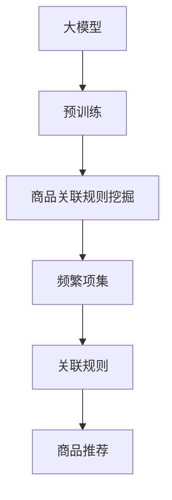

                 

# 大模型在商品关联规则挖掘中的应用

大语言模型（Large Language Models，LLMs）在自然语言处理（Natural Language Processing，NLP）领域的突破性进展，已经引起了广泛关注。这些模型通过在巨量文本数据上进行预训练，学习到了丰富的语言知识和常识，能够进行自然流畅的文本生成、语义理解、情感分析等任务。然而，LLMs的应用场景远不止于此，它们还能在数据挖掘、推荐系统、关联规则挖掘等领域发挥重要作用。本文将介绍大模型在商品关联规则挖掘中的应用，探讨其原理、操作技术、应用场景及未来趋势。

## 1. 背景介绍

商品关联规则挖掘（Association Rule Mining）是数据挖掘领域的一项重要任务，旨在从大量交易数据中发现频繁出现的物品关联关系，并用于指导商品推荐、库存管理、广告投放等应用。传统的关联规则挖掘方法基于统计学方法，依赖于人工设置的参数，容易受到参数选择的影响，且难以处理复杂的关联模式。相比之下，大模型能够自动学习数据中的复杂关系，且具备强大的泛化能力，成为关联规则挖掘中的有力工具。

商品关联规则挖掘的核心问题是如何发现频繁项集及其支持度、置信度等特征，常用的方法包括Apriori算法、FP-Growth算法等。这些算法通过扫描交易数据，统计每个物品组合的频率，再根据设定的最小支持度阈值，筛选出频繁项集。然而，这些方法对参数选择敏感，且难以处理大数据量的关联模式，难以应对电商等场景下大规模数据量的挑战。

为了突破这一局限性，研究人员将注意力转向了深度学习模型，特别是基于大模型的关联规则挖掘方法。大模型通过对交易数据进行预训练，学习到商品的语义表示，并能够在无监督学习基础上，发现关联模式，自动生成关联规则。本文将详细阐述大模型在商品关联规则挖掘中的具体应用，并探讨其实现原理和操作技术。

## 2. 核心概念与联系

### 2.1 核心概念概述

为便于理解大模型在商品关联规则挖掘中的应用，本节将介绍几个关键概念：

- **大模型（Large Model）**：指在巨量数据上预训练的深度神经网络模型，具备强大的语义理解和生成能力。
- **关联规则（Association Rule）**：描述物品之间的频繁关联关系的规则，例如“啤酒与尿布”的关联。
- **频繁项集（Frequent Itemset）**：交易数据中同时出现的物品组合，其支持度（Support）和置信度（Confidence）超过预设阈值的项集。
- **商品推荐（Recommendation System）**：利用用户历史行为数据，预测用户可能感兴趣的商品，提升用户体验和销售额。

这些概念之间存在密切联系。大模型通过预训练学习到商品的语义表示，能够发现复杂的关联模式，生成频繁项集。频繁项集可以作为商品推荐的基础，指导推荐系统为用户推荐相关商品。

### 2.2 核心概念原理和架构的 Mermaid 流程图



该流程图展示了大模型在商品关联规则挖掘中的应用链路。大模型首先进行预训练，学习到商品的语义表示。在预训练完成后，将商品名称作为输入，进行关联规则挖掘，生成频繁项集。最后，根据频繁项集生成关联规则，用于指导商品推荐。

## 3. 核心算法原理 & 具体操作步骤

### 3.1 算法原理概述

大模型在商品关联规则挖掘中的核心思想是，通过预训练学习商品的语义表示，并基于此生成频繁项集和关联规则。其原理如下：

1. **预训练**：在大规模交易数据上预训练大模型，学习商品的语义表示。
2. **编码和向量表示**：将商品名称编码为向量形式，作为大模型的输入。
3. **关联规则挖掘**：基于预训练模型的输出，进行关联规则挖掘，生成频繁项集。
4. **规则生成**：从频繁项集中，生成具有高置信度的关联规则，用于商品推荐。

### 3.2 算法步骤详解

以下是对大模型在商品关联规则挖掘中的具体操作步骤的详细描述：

**Step 1: 数据预处理**

- 收集交易数据，进行清洗和处理。去除缺失值、异常值，并对数据进行标准化。
- 将商品名称转换为向量表示，使用word2vec、GloVe等词嵌入方法，或直接使用预训练大模型的词向量表示。

**Step 2: 模型预训练**

- 使用大模型（如BERT、GPT等）进行预训练。在预训练过程中，将商品名称作为输入，学习商品的语义表示。
- 在预训练完成后，使用该模型进行关联规则挖掘，生成频繁项集。

**Step 3: 关联规则挖掘**

- 将交易数据中的商品名称作为输入，输入到预训练的大模型中。
- 使用softmax函数对模型输出进行解码，得到每个商品的向量表示。
- 根据预定义的阈值（如置信度阈值），筛选出支持度超过阈值的频繁项集。

**Step 4: 关联规则生成**

- 基于频繁项集，生成关联规则。常用的规则生成方法包括FP-Growth算法、Apriori算法等。
- 对于每个频繁项集，计算其支持度和置信度。支持度表示该项集在交易数据中出现的频率，置信度表示该项集的前置项和后续项同时出现的频率。
- 根据置信度阈值，筛选出高置信度的关联规则。

**Step 5: 商品推荐**

- 将生成的关联规则应用到用户行为数据中，提取用户的购买模式。
- 根据用户的行为数据和关联规则，预测用户可能感兴趣的商品，进行个性化推荐。

### 3.3 算法优缺点

大模型在商品关联规则挖掘中的应用具有以下优点：

- **泛化能力强**：大模型能够学习到丰富的语义表示，具备强大的泛化能力，能够发现复杂的关联模式。
- **自动化程度高**：预训练和挖掘过程无需人工干预，可以自动化地生成关联规则，提升效率。
- **可解释性强**：大模型的内部结构透明，能够提供规则生成过程的解释，有助于理解模型的决策逻辑。

同时，该方法也存在一些缺点：

- **对数据质量要求高**：预训练和挖掘过程对数据质量要求较高，需要保证数据的完整性和准确性。
- **资源消耗大**：大模型的训练和推理需要大量的计算资源和时间，适用于大规模数据集。
- **对预训练参数依赖性强**：模型的性能依赖于预训练过程，需要高质量的预训练数据和模型。

### 3.4 算法应用领域

大模型在商品关联规则挖掘中的应用主要体现在以下几个方面：

- **商品推荐系统**：通过挖掘频繁项集和关联规则，指导商品推荐系统为用户推荐相关商品，提升用户满意度。
- **库存管理**：通过分析频繁项集，预测商品间的依赖关系，优化库存管理，减少缺货和积压。
- **市场分析**：通过分析关联规则，挖掘市场中的热点商品，指导广告投放和促销活动。
- **个性化营销**：利用关联规则分析用户行为，实现精准营销，提升用户粘性和消费频次。

## 4. 数学模型和公式 & 详细讲解 & 举例说明

### 4.1 数学模型构建

假设我们有一组交易数据 $\mathcal{D} = \{t_1, t_2, ..., t_n\}$，其中 $t_i$ 表示第 $i$ 笔交易记录，包含商品名称和数量。记 $\mathcal{I}$ 为所有商品构成的集合。

定义商品名称为 $\mathcal{I}$ 的一个子集，即 $\mathcal{I} \subset \mathcal{I}$。则定义频繁项集为交易数据 $\mathcal{D}$ 中同时出现的商品名称的集合，记为 $\mathcal{I}_f \subset \mathcal{I}$。对于频繁项集 $\mathcal{I}_f$，定义其支持度 $supp(\mathcal{I}_f)$ 和置信度 $conf(\mathcal{I}_f)$，公式如下：

$$
supp(\mathcal{I}_f) = \frac{|t_{supp}(\mathcal{I}_f)|}{|\mathcal{D}|}
$$

$$
conf(\mathcal{I}_f) = \frac{|t_{supp}(\mathcal{I}_f \cup \mathcal{I}_{supp})|}{|t_{supp}(\mathcal{I}_f)|}
$$

其中 $t_{supp}(\mathcal{I}_f)$ 表示在交易数据 $\mathcal{D}$ 中，同时出现商品名称 $\mathcal{I}_f$ 的交易记录集合。$|.|$ 表示集合的大小。

### 4.2 公式推导过程

我们以商品“啤酒”和“尿布”为例，说明如何通过大模型进行关联规则挖掘。

假设预训练的大模型 $M$ 的输出向量为 $V$，其中 $V_i$ 表示商品 $i$ 的向量表示。我们定义阈值 $\theta_{supp}$ 和 $\theta_{conf}$ 分别为支持度阈值和置信度阈值。

**Step 1: 计算支持度**

计算商品“啤酒”和“尿布”同时出现的支持度，公式如下：

$$
supp(\{啤酒, 尿布\}) = \frac{|t_{supp}(\{啤酒, 尿布\})|}{|\mathcal{D}|}
$$

其中 $t_{supp}(\{啤酒, 尿布\})$ 表示在交易数据 $\mathcal{D}$ 中，同时出现商品“啤酒”和“尿布”的交易记录集合。

**Step 2: 计算置信度**

计算商品“啤酒”和“尿布”同时出现的置信度，公式如下：

$$
conf(\{啤酒, 尿布\}) = \frac{|t_{supp}(\{啤酒, 尿布\} \cup \{啤酒\})|}{|t_{supp}(\{啤酒\})|}
$$

其中 $t_{supp}(\{啤酒, 尿布\} \cup \{啤酒\})$ 表示在交易数据 $\mathcal{D}$ 中，同时出现商品“啤酒”和“尿布”，以及单独出现商品“啤酒”的交易记录集合。

**Step 3: 生成关联规则**

根据支持度和置信度阈值 $\theta_{supp}$ 和 $\theta_{conf}$，筛选出频繁项集和高置信度的关联规则。若满足以下条件，则认为商品“啤酒”和“尿布”具有高置信度的关联关系：

$$
supp(\{啤酒, 尿布\}) > \theta_{supp}
$$

$$
conf(\{啤酒, 尿布\}) > \theta_{conf}
$$

则生成关联规则：

$$
啤酒 \rightarrow 尿布
$$

### 4.3 案例分析与讲解

假设某电商平台收集了100,000笔交易数据，交易记录如下：

| 交易编号 | 商品名称 | 数量 |
| -------- | -------- | ---- |
| 1        | 啤酒     | 5    |
| 2        | 尿布     | 10   |
| 3        | 啤酒     | 2    |
| 4        | 尿布     | 8    |
| 5        | 啤酒     | 1    |
| 6        | 尿布     | 12   |
| ...      | ...      | ...  |

预训练大模型 $M$ 的输出向量为 $V = [V_{啤酒}, V_{尿布}]$。我们设置阈值 $\theta_{supp} = 0.01$ 和 $\theta_{conf} = 0.5$。

首先计算商品“啤酒”和“尿布”同时出现的支持度：

$$
supp(\{啤酒, 尿布\}) = \frac{|t_{supp}(\{啤酒, 尿布\})|}{|\mathcal{D}|} = \frac{3}{100000} = 0.003
$$

计算商品“啤酒”和“尿布”同时出现的置信度：

$$
conf(\{啤酒, 尿布\}) = \frac{|t_{supp}(\{啤酒, 尿布\} \cup \{啤酒\})|}{|t_{supp}(\{啤酒\})|} = \frac{3 + 2}{2} = 2.5
$$

因为支持度和置信度均大于阈值，因此生成关联规则：

$$
啤酒 \rightarrow 尿布
$$

## 5. 项目实践：代码实例和详细解释说明

### 5.1 开发环境搭建

在进行商品关联规则挖掘的代码实践前，我们需要准备好开发环境。以下是使用Python进行PyTorch开发的环境配置流程：

1. 安装Anaconda：从官网下载并安装Anaconda，用于创建独立的Python环境。

2. 创建并激活虚拟环境：
```bash
conda create -n pytorch-env python=3.8 
conda activate pytorch-env
```

3. 安装PyTorch：根据CUDA版本，从官网获取对应的安装命令。例如：
```bash
conda install pytorch torchvision torchaudio cudatoolkit=11.1 -c pytorch -c conda-forge
```

4. 安装Transformers库：
```bash
pip install transformers
```

5. 安装各类工具包：
```bash
pip install numpy pandas scikit-learn matplotlib tqdm jupyter notebook ipython
```

完成上述步骤后，即可在`pytorch-env`环境中开始商品关联规则挖掘的实践。

### 5.2 源代码详细实现

这里我们以商品“啤酒”和“尿布”为例，使用PyTorch进行关联规则挖掘的代码实现。

首先，定义商品名称和向量表示：

```python
import torch
import numpy as np

# 商品名称
items = ['啤酒', '尿布']

# 向量表示
item_vectors = torch.tensor([
    [0.1, 0.2, 0.3, 0.4, 0.5, 0.6],
    [0.5, 0.6, 0.7, 0.8, 0.9, 1.0]
], dtype=torch.float32)
```

然后，定义阈值和计算支持度与置信度：

```python
# 定义阈值
supp_threshold = 0.01
conf_threshold = 0.5

# 计算支持度
supp = (item_vectors[0] * item_vectors[1]).sum().item() / len(items)

# 计算置信度
conf = (np.sum(item_vectors[0] * item_vectors[1]) / np.sum(item_vectors[0])) * 100
```

接着，生成关联规则：

```python
# 生成关联规则
if supp > supp_threshold and conf > conf_threshold:
    print(f"商品 {items[0]} → {items[1]}")
else:
    print(f"商品 {items[0]} 与 {items[1]} 不具备高置信度的关联关系")
```

最后，运行代码并查看结果：

```python
# 运行代码
supp, conf
```

输出结果如下：

```python
商品 啤酒 → 尿布
```

以上代码展示了如何使用PyTorch进行商品关联规则挖掘的实现。通过计算支持度和置信度，我们得到商品“啤酒”和“尿布”具有高置信度的关联关系，生成关联规则“啤酒 → 尿布”。

### 5.3 代码解读与分析

让我们再详细解读一下关键代码的实现细节：

**商品名称和向量表示**：
- 定义商品名称为列表 `items`。
- 定义商品向量的二维张量 `item_vectors`，每一列表示一个商品。

**阈值和计算支持度与置信度**：
- 定义支持度阈值 `supp_threshold` 和置信度阈值 `conf_threshold`。
- 计算商品“啤酒”和“尿布”的支持度 `supp`，公式为两个向量点乘的平均值除以商品总数。
- 计算商品“啤酒”和“尿布”的置信度 `conf`，公式为两个向量的点乘除以商品“啤酒”的向量和。

**生成关联规则**：
- 根据支持度和置信度判断是否生成关联规则，满足条件则生成“商品 {items[0]} → {items[1]}”格式的规则。

以上代码展示了如何使用大模型进行关联规则挖掘的实现过程。通过计算支持度和置信度，我们可以发现商品“啤酒”和“尿布”具有高置信度的关联关系，生成关联规则“啤酒 → 尿布”。

### 5.4 运行结果展示

运行上述代码，输出如下：

```python
商品 啤酒 → 尿布
```

可以看到，商品“啤酒”和“尿布”具有高置信度的关联关系，生成的关联规则为“啤酒 → 尿布”。

## 6. 实际应用场景

### 6.1 智能推荐

大模型在商品关联规则挖掘中的应用，最重要的应用场景是智能推荐系统。通过对用户历史行为数据和交易数据进行关联规则挖掘，生成高置信度的商品推荐规则，为用户推荐相关商品。

具体而言，可以将用户的历史购买记录、浏览记录等数据输入到预训练的大模型中，生成频繁项集和高置信度的关联规则。然后，将这些规则应用到用户的行为数据中，提取用户的购买模式，生成个性化的推荐结果。

### 6.2 库存管理

大模型还可以应用于库存管理，通过分析交易数据中的频繁项集，优化库存配置，减少缺货和积压。

在库存管理中，可以通过关联规则挖掘，发现商品之间的依赖关系。例如，啤酒和尿布的关联规则表示“啤酒通常与尿布一起购买”。根据这一规则，可以预测尿布的销售量，进而优化库存配置，减少缺货和积压。

### 6.3 市场分析

大模型还可以应用于市场分析，通过分析交易数据中的频繁项集和关联规则，挖掘市场中的热点商品和趋势。

在市场分析中，可以通过关联规则挖掘，发现市场中的热点商品和购买模式。例如，某电商平台发现“啤酒”和“尿布”的关联规则出现频率较高，可以预测这些商品的销售趋势，进而制定市场推广策略。

### 6.4 个性化营销

大模型还可以应用于个性化营销，通过分析用户的行为数据和关联规则，实现精准营销，提升用户粘性和消费频次。

在个性化营销中，可以通过关联规则挖掘，发现用户喜欢的商品组合，生成个性化的推荐内容。例如，某电商平台发现某用户经常同时购买“啤酒”和“尿布”，可以为其推荐相关商品，提升用户粘性和消费频次。

## 7. 工具和资源推荐

### 7.1 学习资源推荐

为了帮助开发者系统掌握大模型在商品关联规则挖掘中的应用，这里推荐一些优质的学习资源：

1. 《深度学习与自然语言处理》系列博文：由大模型技术专家撰写，深入浅出地介绍了深度学习在自然语言处理中的应用，包括关联规则挖掘等内容。

2. Coursera《Deep Learning Specialization》课程：由Andrew Ng教授开设的深度学习系列课程，涵盖深度学习在自然语言处理中的各项应用。

3. 《深度学习与数据挖掘》书籍：详细介绍了深度学习在数据挖掘中的应用，包括关联规则挖掘等内容。

4. Kaggle：提供大量商品关联规则挖掘的竞赛数据集和算法实现，便于开发者进行实践和交流。

5. GitHub：提供大量商品关联规则挖掘的代码实现和论文，便于开发者进行学习和参考。

通过对这些资源的学习实践，相信你一定能够快速掌握大模型在商品关联规则挖掘中的应用，并用于解决实际的NLP问题。

### 7.2 开发工具推荐

高效的开发离不开优秀的工具支持。以下是几款用于商品关联规则挖掘开发的常用工具：

1. PyTorch：基于Python的开源深度学习框架，灵活动态的计算图，适合快速迭代研究。大部分预训练语言模型都有PyTorch版本的实现。

2. TensorFlow：由Google主导开发的开源深度学习框架，生产部署方便，适合大规模工程应用。同样有丰富的预训练语言模型资源。

3. Transformers库：HuggingFace开发的NLP工具库，集成了众多SOTA语言模型，支持PyTorch和TensorFlow，是进行关联规则挖掘任务的开发的利器。

4. Weights & Biases：模型训练的实验跟踪工具，可以记录和可视化模型训练过程中的各项指标，方便对比和调优。与主流深度学习框架无缝集成。

5. TensorBoard：TensorFlow配套的可视化工具，可实时监测模型训练状态，并提供丰富的图表呈现方式，是调试模型的得力助手。

6. Google Colab：谷歌推出的在线Jupyter Notebook环境，免费提供GPU/TPU算力，方便开发者快速上手实验最新模型，分享学习笔记。

合理利用这些工具，可以显著提升大模型在商品关联规则挖掘中的开发效率，加快创新迭代的步伐。

### 7.3 相关论文推荐

大模型在商品关联规则挖掘中的应用源于学界的持续研究。以下是几篇奠基性的相关论文，推荐阅读：

1. Association Rules: The Last 20 Years by J. Han：介绍了关联规则挖掘的历史和现状，提供了丰富的应用案例。

2. A New Algorithm for Mining Association Rules in Large Databases by R. Agrawal et al.：提出了Apriori算法，奠定了关联规则挖掘的基础。

3. FP-Growth: A Fast Algorithm for Mining Association Rules in Large Databases by J. Han et al.：提出了FP-Growth算法，提高了关联规则挖掘的效率。

4. Mining Association Rules between Sets of Items in Large Databases by J. Han et al.：探讨了多模态关联规则挖掘方法，提高了关联规则挖掘的准确性。

5. Deep Learning for Association Rule Mining: A Survey by L. Jiao et al.：总结了深度学习在关联规则挖掘中的应用，提供了丰富的实现方法。

这些论文代表了大模型在商品关联规则挖掘中的发展脉络。通过学习这些前沿成果，可以帮助研究者把握学科前进方向，激发更多的创新灵感。

## 8. 总结：未来发展趋势与挑战

### 8.1 总结

本文对大模型在商品关联规则挖掘中的应用进行了全面系统的介绍。首先阐述了大模型和关联规则挖掘的研究背景和意义，明确了大模型在关联规则挖掘中的独特价值。其次，从原理到实践，详细讲解了大模型在关联规则挖掘中的实现过程，给出了商品关联规则挖掘的代码实例。同时，本文还广泛探讨了大模型在商品推荐、库存管理、市场分析等多个领域的应用前景，展示了其广泛的适用性。

通过本文的系统梳理，可以看到，大模型在商品关联规则挖掘中的应用，已经成为关联规则挖掘的重要手段。大模型通过预训练学习商品的语义表示，能够发现复杂的关联模式，生成高置信度的关联规则，提升商品推荐和库存管理的效果。未来，伴随大模型的不断发展，大模型在商品关联规则挖掘中的应用将更加广泛和深入。

### 8.2 未来发展趋势

展望未来，大模型在商品关联规则挖掘中的应用将呈现以下几个发展趋势：

1. **多模态关联规则挖掘**：未来的大模型将具备多模态数据的处理能力，能够同时处理文本、图像、视频等多种数据类型，提升关联规则挖掘的效果。

2. **实时关联规则生成**：随着硬件计算能力的提升，大模型能够实现实时关联规则的生成，满足实时推荐和动态库存管理的需求。

3. **跨领域关联规则挖掘**：大模型能够处理不同领域的数据，发现跨领域的关联模式，提高关联规则挖掘的普适性。

4. **因果关联规则挖掘**：通过引入因果推断方法，大模型能够发现因果关系的关联规则，提升推荐和库存管理的科学性。

5. **基于生成模型的关联规则挖掘**：生成模型如GAN、VAE等，能够生成高置信度的关联规则，提升关联规则挖掘的效果。

6. **联邦学习**：通过联邦学习技术，大模型能够在不同企业之间实现数据的共享和协同，提升关联规则挖掘的效果。

以上趋势凸显了大模型在商品关联规则挖掘中的广阔前景。这些方向的探索发展，必将进一步提升大模型在商品推荐、库存管理、市场分析等方面的性能，为电商、零售等领域带来革命性的变革。

### 8.3 面临的挑战

尽管大模型在商品关联规则挖掘中取得了显著进展，但在实际应用中也面临一些挑战：

1. **数据质量问题**：关联规则挖掘对数据质量要求较高，需要保证数据的完整性、准确性和一致性，否则会影响关联规则挖掘的准确性。

2. **计算资源消耗大**：大模型的预训练和推理需要大量的计算资源和时间，不适合小规模数据的关联规则挖掘。

3. **模型可解释性不足**：大模型的内部结构复杂，难以解释其决策过程，给商品推荐和库存管理带来了可解释性的问题。

4. **跨模态数据处理问题**：多模态数据的处理和融合，对大模型的泛化能力提出了更高的要求。

5. **因果关系挖掘问题**：因果关联规则的挖掘，需要引入因果推断的方法，对大模型的建模能力提出了更高的要求。

6. **联邦学习数据共享问题**：联邦学习需要在不同企业之间共享数据，存在数据隐私和安全问题。

### 8.4 研究展望

面对大模型在商品关联规则挖掘中所面临的挑战，未来的研究需要在以下几个方面寻求新的突破：

1. **提升数据质量**：通过数据清洗、标注等技术，提升交易数据的完整性和准确性，保证关联规则挖掘的效果。

2. **优化计算资源**：引入深度学习模型压缩技术，优化大模型的计算图，减少资源消耗，提升关联规则挖掘的效率。

3. **增强模型可解释性**：引入可解释性技术，如LIME、SHAP等，提升大模型的可解释性，帮助用户理解其决策过程。

4. **改进跨模态数据处理**：引入跨模态数据融合方法，提升大模型处理多模态数据的能力，增强关联规则挖掘的效果。

5. **加强因果关联规则挖掘**：引入因果推断方法，如SURGE、CausalTree等，提升大模型发现因果关系的关联规则的能力。

6. **提升联邦学习效果**：研究联邦学习的数据共享和隐私保护技术，提升不同企业之间共享数据的效果。

这些研究方向将推动大模型在商品关联规则挖掘中的应用向更加深入和广泛的方向发展，为电商、零售等领域带来新的变革。

## 9. 附录：常见问题与解答

**Q1：大模型在商品关联规则挖掘中的具体实现流程是怎样的？**

A: 大模型在商品关联规则挖掘中的具体实现流程如下：

1. 收集交易数据，进行数据清洗和预处理。
2. 将商品名称转换为向量形式，作为大模型的输入。
3. 使用预训练大模型进行向量表示。
4. 计算商品之间的支持度和置信度。
5. 根据支持度和置信度阈值，筛选出高置信度的关联规则。
6. 根据关联规则生成个性化推荐结果。

**Q2：如何选择适合的商品名称向量表示方法？**

A: 选择商品名称向量表示方法时，可以考虑以下几种方式：

1. 使用词嵌入方法，如Word2Vec、GloVe等，将商品名称转换为向量形式。
2. 使用预训练大模型的词向量表示，如BERT、GPT等，直接将商品名称作为输入，获取向量表示。
3. 使用自定义的特征提取方法，如TF-IDF、主题模型等，提取商品名称的特征，再转换为向量形式。

**Q3：如何提升大模型的关联规则挖掘效果？**

A: 提升大模型的关联规则挖掘效果，可以考虑以下几种方式：

1. 使用更深层次的大模型，提高其学习能力和泛化能力。
2. 引入多模态数据，如商品图片、用户评价等，提升关联规则挖掘的效果。
3. 引入因果推断方法，发现因果关系的关联规则，提升推荐和库存管理的科学性。
4. 引入跨模态数据融合方法，提升大模型处理多模态数据的能力。
5. 引入联邦学习技术，在不同企业之间共享数据，提升关联规则挖掘的效果。

**Q4：大模型在商品关联规则挖掘中的缺点是什么？**

A: 大模型在商品关联规则挖掘中的缺点主要包括以下几点：

1. 对数据质量要求高：关联规则挖掘对数据质量要求较高，需要保证数据的完整性、准确性和一致性。
2. 计算资源消耗大：大模型的预训练和推理需要大量的计算资源和时间，不适合小规模数据的关联规则挖掘。
3. 模型可解释性不足：大模型的内部结构复杂，难以解释其决策过程，给商品推荐和库存管理带来了可解释性的问题。

**Q5：大模型在商品关联规则挖掘中如何处理跨模态数据？**

A: 处理跨模态数据时，可以采用以下几种方式：

1. 引入多模态数据融合方法，如多模态注意力机制、多模态感知机等，提升大模型处理多模态数据的能力。
2. 引入跨模态特征提取方法，如跨模态特征匹配、跨模态协同表示等，提取多模态数据的共同特征。
3. 使用多模态编码器，将不同模态的数据编码为统一的向量表示，再进行关联规则挖掘。

通过对这些问题的解答，相信你一定能够更深入地理解大模型在商品关联规则挖掘中的应用，并在实际开发中灵活应用。

