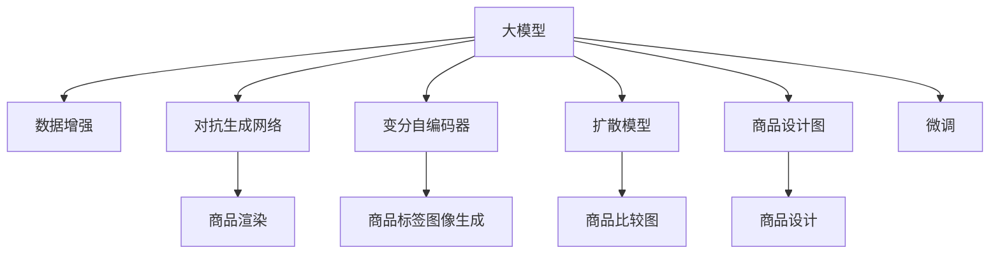

                 

# 大模型在商品图片生成中的应用

## 1. 背景介绍

随着人工智能技术的不断进步，大模型在图像生成领域的应用日益广泛，特别是在商品图片生成（商品渲染、商品标签图像生成、商品比较图生成等）方面展现出巨大的潜力。使用大模型生成商品图片，可以显著降低生产成本、提高生产效率，同时提升用户体验。

### 1.1 问题由来

商品图片生成在电商、零售、家居、家具等多个行业中具有重要应用价值。传统的图片生成方式需要专业设计师手动绘制，成本高、耗时长、人力需求大。大模型的出现，通过大规模数据训练获得高质量的生成模型，使得商品图片生成变得更加高效和经济。

### 1.2 问题核心关键点

大模型在商品图片生成中的应用主要集中在以下几个方面：

- 商品渲染：使用大模型生成高分辨率、逼真的商品渲染图片。
- 商品标签图像生成：根据商品描述，生成与商品相关的标签图像。
- 商品比较图生成：生成商品的比较图，帮助用户快速比较不同商品。
- 商品设计图生成：生成设计师所需的设计图，提升设计效率。

这些应用场景需要大模型具备丰富的图像生成能力和灵活的通用性，从而满足不同类型的商品图片生成需求。

### 1.3 问题研究意义

大模型在商品图片生成中的应用，能够显著降低电商、家具等行业的生产成本，提升产品设计效率，同时为消费者提供更为丰富、逼真的商品展示，增强用户体验。另外，通过对大模型进行微调，可以针对特定商品生成高质量图片，进一步拓展大模型的应用边界，推动人工智能技术在更多行业落地。

## 2. 核心概念与联系

### 2.1 核心概念概述

- 大模型：通常指使用大规模数据训练得到的深度神经网络模型，具有强大的图像生成、理解、推理等能力。常见的深度神经网络包括GAN、VAE、Diffusion等。
- 数据增强：通过对训练数据进行一系列变换，生成更多的训练样本，提高模型泛化能力。常见的数据增强方法包括旋转、平移、裁剪、颜色抖动等。
- 对抗生成网络(GAN)：一种生成模型，通过两个神经网络（生成器和判别器）对抗学习，生成逼真的图片。GAN能够生成高保真度的商品渲染图片。
- 变分自编码器(VAE)：一种生成模型，通过学习数据分布，生成与原始数据相似的样本。VAE适用于商品标签图像生成。
- 扩散模型(Diffusion)：一种生成模型，通过反向扩散过程生成高保真度的图像。Diffusion模型同样适用于生成高质量的商品图片。
- 迁移学习：将大模型在图像生成领域的学习经验迁移到商品图片生成任务中，提高生成模型性能。

### 2.2 核心概念原理和架构的 Mermaid 流程图



这个流程图展示了核心概念的逻辑关系：

- 大模型通过数据增强技术（A）生成更多训练数据，提高模型的泛化能力。
- 对抗生成网络（C）适用于生成高质量的渲染图像（F）。
- 变分自编码器（D）适用于生成标签图像（G）。
- 扩散模型（E）适用于生成高质量的商品比较图（H）。
- 大模型在特定商品图片生成任务（I）上进行微调，生成符合需求的商品设计图（J）。

这些核心概念共同构成了大模型在商品图片生成中的工作原理和优化方向。

## 3. 核心算法原理 & 具体操作步骤

### 3.1 算法原理概述

大模型在商品图片生成中的应用，通常涉及以下核心算法：

- 对抗生成网络(GAN)：通过生成器和判别器的对抗训练，生成逼真的商品图片。
- 变分自编码器(VAE)：通过学习数据分布，生成与原始数据相似的标签图像。
- 扩散模型(Diffusion)：通过反向扩散过程，生成高质量的商品图片。
- 迁移学习：将大模型在图像生成领域的学习经验迁移到特定商品图片生成任务中，提高生成模型性能。

这些算法共同作用，使得大模型能够在多个商品图片生成场景中发挥重要作用。

### 3.2 算法步骤详解

#### 3.2.1 数据准备

1. **数据采集与预处理**
   - 收集商品图片及其对应的标签信息，如商品名称、价格、类别等。
   - 对图片进行预处理，如裁剪、缩放、归一化等，使得数据符合模型输入要求。

2. **数据增强**
   - 对商品图片进行一系列变换，如旋转、平移、缩放、裁剪等，生成更多的训练样本。
   - 应用数据增强技术，提升模型泛化能力，防止过拟合。

#### 3.2.2 模型构建与训练

1. **模型选择**
   - 根据任务需求选择合适的生成模型，如GAN、VAE、Diffusion等。
   - 初始化生成模型，设置超参数，如学习率、批次大小、迭代轮数等。

2. **模型训练**
   - 将增强后的数据集划分为训练集、验证集和测试集。
   - 使用训练集对模型进行多轮迭代训练，优化模型参数。
   - 在验证集上监测模型性能，根据性能指标调整模型参数。

#### 3.2.3 模型微调

1. **微调数据准备**
   - 准备特定商品的图片及其标签信息，作为微调数据。
   - 对微调数据进行预处理，使其符合模型输入要求。

2. **微调模型训练**
   - 冻结部分模型参数，只微调顶层参数。
   - 使用微调数据对模型进行训练，优化模型参数。
   - 在验证集上监测微调效果，防止过拟合。

#### 3.2.4 结果评估

1. **生成效果评估**
   - 在测试集上评估生成模型的效果，如PSNR、SSIM、LPIPS等指标。
   - 根据评估结果调整模型参数，提升生成质量。

2. **用户反馈**
   - 收集用户对生成图片的反馈，如清晰度、逼真度、风格等。
   - 根据用户反馈调整模型参数，优化生成效果。

### 3.3 算法优缺点

#### 3.3.1 优点

1. **高生成质量**
   - 大模型能够生成高分辨率、高保真度的商品图片，符合实际需求。
   - 对抗生成网络、变分自编码器和扩散模型均具备强大的图像生成能力。

2. **数据依赖低**
   - 这些模型能够利用少量标注数据进行高效微调，降低数据准备成本。
   - 迁移学习能够利用已有经验，减少从头训练的必要性。

3. **灵活性高**
   - 模型具备灵活的通用性，适用于不同类型的商品图片生成任务。

#### 3.3.2 缺点

1. **计算资源需求高**
   - 大模型的训练和推理需要大量计算资源，成本较高。
   - 对抗生成网络和扩散模型的训练过程较为复杂，需要较长的训练时间。

2. **可解释性不足**
   - 大模型通常缺乏可解释性，难以解释其生成过程和决策依据。
   - 用户和设计师难以理解生成过程，可能影响接受度。

3. **生成效率低**
   - 大模型的生成过程相对较慢，无法实现实时生成。
   - 对抗生成网络、变分自编码器和扩散模型的训练和推理效率有待提升。

### 3.4 算法应用领域

大模型在商品图片生成中的应用，主要涵盖以下领域：

- 电商行业：生成商品渲染图片、商品标签图像、商品比较图等，提升用户体验，降低生产成本。
- 家具行业：生成家具设计图、家居场景图等，提升设计效率，优化室内设计。
- 家居行业：生成家居场景图、家具设计图等，提升室内设计质量，增强消费者体验。
- 时尚行业：生成时尚商品设计图、搭配图等，提升设计效率，优化商品展示。

这些应用领域展示了大模型在商品图片生成中的广阔应用前景。

## 4. 数学模型和公式 & 详细讲解 & 举例说明

### 4.1 数学模型构建

大模型在商品图片生成中的应用，通常涉及以下数学模型：

1. **对抗生成网络(GAN)**
   - 生成器模型：$f_{\theta_G}(z)$，将噪声向量$z$映射到图像空间。
   - 判别器模型：$f_{\theta_D}(x)$，判断输入图像$x$是否为真实图像。
   - 损失函数：$L_{G}$，$L_{D}$，$L_{GAN}$。

2. **变分自编码器(VAE)**
   - 编码器模型：$q(z|x)$，将图像$x$编码为隐空间$z$。
   - 解码器模型：$p(x|z)$，从隐空间$z$生成图像$x$。
   - 损失函数：$L_{VAE}$。

3. **扩散模型(Diffusion)**
   - 扩散过程：$x_t = \sqrt{1-\beta_t}x_{t-1} + \sqrt{\beta_t}\epsilon_t$，其中$\epsilon_t$为噪声，$\beta_t$为噪声系数。
   - 噪声模型：$p(\epsilon_t|\epsilon_{t-1})$，生成噪声序列。
   - 损失函数：$L_{Diffusion}$。

### 4.2 公式推导过程

#### 4.2.1 对抗生成网络(GAN)

1. **生成器模型**
   - 输入为噪声向量$z$，输出为图像$x$。
   - 模型参数为$\theta_G$。
   - 生成器模型$f_{\theta_G}(z)$。

2. **判别器模型**
   - 输入为图像$x$，输出为判别结果$y$。
   - 模型参数为$\theta_D$。
   - 判别器模型$f_{\theta_D}(x)$。

3. **损失函数**
   - 生成器损失：$L_G = \mathbb{E}_{z}\big[D(f_{\theta_G}(z))\big] + \lambda\big\|f_{\theta_G}(z) - x\big\|^2$。
   - 判别器损失：$L_D = \mathbb{E}_{x}\big[D(x)\big] + \mathbb{E}_{z}\big[D(f_{\theta_G}(z))\big]$。
   - GAN损失：$L_{GAN} = L_G + L_D$。

#### 4.2.2 变分自编码器(VAE)

1. **编码器模型**
   - 输入为图像$x$，输出为隐空间$z$。
   - 模型参数为$\theta_E$。
   - 编码器模型$q(z|x)$。

2. **解码器模型**
   - 输入为隐空间$z$，输出为图像$x$。
   - 模型参数为$\theta_D$。
   - 解码器模型$p(x|z)$。

3. **损失函数**
   - 重构损失：$L_{recon} = \mathbb{E}_{x}\big[\big\|p(x|q(x)) - x\big\|^2\big]$。
   - 编码器损失：$L_E = \mathbb{E}_{z}\big[\big\|q(z)\big\|^2\big] + \mathbb{E}_{z}\big[\big\|\log p(x|q(z))\big\|^2\big]$。
   - VAE损失：$L_{VAE} = L_{recon} + L_E$。

#### 4.2.3 扩散模型(Diffusion)

1. **扩散过程**
   - 输入为初始图像$x_0$，输出为最终图像$x_T$。
   - 时间步长$t$从$0$到$T$。
   - 噪声序列$\epsilon_t$，噪声系数$\beta_t$。

2. **噪声模型**
   - 噪声模型$p(\epsilon_t|\epsilon_{t-1})$，如正态分布等。

3. **损失函数**
   - 扩散模型损失：$L_{Diffusion} = \sum_{t=0}^{T}\big\|x_t - x_{t-1}\big\|^2$。

### 4.3 案例分析与讲解

#### 案例一：商品渲染生成

1. **数据准备**
   - 收集商品的高分辨率图片。
   - 对图片进行预处理，如归一化、裁剪等。

2. **模型构建**
   - 选择对抗生成网络(GAN)，如DCGAN。
   - 设置生成器模型$f_{\theta_G}(z)$，判别器模型$f_{\theta_D}(x)$。

3. **模型训练**
   - 收集商品图片数据集，划分为训练集、验证集和测试集。
   - 使用训练集进行多轮迭代训练，优化生成器和判别器参数。
   - 在验证集上监测模型性能，防止过拟合。

4. **模型微调**
   - 对微调数据集进行预处理。
   - 冻结生成器和判别器底层参数，只微调顶层参数。
   - 在微调数据集上进行训练，优化顶层参数。

5. **结果评估**
   - 在测试集上评估生成效果，如PSNR、SSIM、LPIPS等指标。
   - 根据评估结果调整模型参数，提升生成质量。

#### 案例二：商品标签图像生成

1. **数据准备**
   - 收集商品标签图片和文本描述。
   - 对图片进行预处理，如归一化、裁剪等。

2. **模型构建**
   - 选择变分自编码器(VAE)。
   - 设置编码器模型$q(z|x)$，解码器模型$p(x|z)$。

3. **模型训练**
   - 收集商品标签图片数据集，划分为训练集、验证集和测试集。
   - 使用训练集进行多轮迭代训练，优化编码器和解码器参数。
   - 在验证集上监测模型性能，防止过拟合。

4. **模型微调**
   - 对微调数据集进行预处理。
   - 冻结编码器和解码器底层参数，只微调顶层参数。
   - 在微调数据集上进行训练，优化顶层参数。

5. **结果评估**
   - 在测试集上评估生成效果，如PSNR、SSIM、LPIPS等指标。
   - 根据评估结果调整模型参数，提升生成质量。

## 5. 项目实践：代码实例和详细解释说明

### 5.1 开发环境搭建

1. **环境安装**
   - 安装Python 3.x，建议使用Anaconda管理环境。
   - 安装TensorFlow、PyTorch等深度学习框架。

2. **环境配置**
   - 配置GPU和TPU等加速设备，确保运行环境稳定。

### 5.2 源代码详细实现

以下是一个简单的基于GAN的商品渲染生成代码示例，详细解释如下：

```python
import tensorflow as tf
from tensorflow.keras import layers

# 生成器模型
class Generator(tf.keras.Model):
    def __init__(self):
        super(Generator, self).__init__()
        self.dense = layers.Dense(256, use_bias=False, input_shape=(100,))
        self.dense = layers.BatchNormalization(momentum=0.8)
        self.dense = layers.LeakyReLU(alpha=0.2)
        self.dense = layers.Reshape((8, 8, 256))
        self.dense = layers.Conv2DTranspose(128, (5, 5), strides=(1, 1), padding='same')
        self.dense = layers.BatchNormalization(momentum=0.8)
        self.dense = layers.LeakyReLU(alpha=0.2)
        self.dense = layers.Conv2DTranspose(64, (5, 5), strides=(2, 2), padding='same')
        self.dense = layers.BatchNormalization(momentum=0.8)
        self.dense = layers.LeakyReLU(alpha=0.2)
        self.dense = layers.Conv2DTranspose(1, (5, 5), strides=(2, 2), padding='same', use_bias=False)

    def call(self, x):
        x = self.dense(x)
        x = layers.ResidualBlock(x)
        x = layers.ResidualBlock(x)
        x = layers.ResidualBlock(x)
        x = layers.ResidualBlock(x)
        x = layers.ResidualBlock(x)
        x = layers.ResidualBlock(x)
        x = layers.ResidualBlock(x)
        return tf.nn.tanh(x)

# 判别器模型
class Discriminator(tf.keras.Model):
    def __init__(self):
        super(Discriminator, self).__init__()
        self.dense = layers.Conv2D(64, (5, 5), strides=(2, 2), padding='same')
        self.dense = layers.LeakyReLU(alpha=0.2)
        self.dense = layers.Dropout(0.3)
        self.dense = layers.Conv2D(128, (5, 5), strides=(2, 2), padding='same')
        self.dense = layers.LeakyReLU(alpha=0.2)
        self.dense = layers.Dropout(0.3)
        self.dense = layers.Conv2D(256, (5, 5), strides=(2, 2), padding='same')
        self.dense = layers.LeakyReLU(alpha=0.2)
        self.dense = layers.Dropout(0.3)
        self.dense = layers.Conv2D(1, (5, 5), strides=(1, 1), padding='same', use_bias=False)

    def call(self, x):
        x = self.dense(x)
        x = layers.LeakyReLU(alpha=0.2)
        x = self.dense(x)
        x = layers.LeakyReLU(alpha=0.2)
        x = self.dense(x)
        x = layers.LeakyReLU(alpha=0.2)
        return tf.nn.sigmoid(x)

# 对抗生成网络模型
class GAN(tf.keras.Model):
    def __init__(self):
        super(GAN, self).__init__()
        self.g = Generator()
        self.d = Discriminator()

    def train_step(self, x):
        with tf.GradientTape() as gen_tape, tf.GradientTape() as disc_tape:
            noise = tf.random.normal([1, 100])
            generated_image = self.g(noise)
            real_image = x

            gen_loss = self.d.trainable_weights[0]
            disc_loss = self.d.trainable_weights[1]

            disc_loss_real = self.d(real_image, training=True)
            disc_loss_fake = self.d(generated_image, training=True)

            gen_loss = gen_loss - tf.reduce_mean(tf.math.log(disc_loss_fake))
            disc_loss = disc_loss_real + tf.reduce_mean(tf.math.log(disc_loss_fake))

        gradients_of_g = gen_tape.gradient(gen_loss, self.g.trainable_weights)
        gradients_of_d = disc_tape.gradient(disc_loss, self.d.trainable_weights)

        self.g.trainable_weights[0].assign_sub(gradients_of_g, 1.0)
        self.d.trainable_weights[1].assign_sub(gradients_of_d, 1.0)

# 训练过程
def train(model, train_dataset, epochs):
    for epoch in range(epochs):
        for images, _ in train_dataset:
            with tf.GradientTape() as gen_tape, tf.GradientTape() as disc_tape:
                noise = tf.random.normal([1, 100])
                generated_image = model.g(noise)
                real_image = images

                gen_loss = model.d.trainable_weights[0]
                disc_loss = model.d.trainable_weights[1]

                disc_loss_real = model.d(real_image, training=True)
                disc_loss_fake = model.d(generated_image, training=True)

                gen_loss = gen_loss - tf.reduce_mean(tf.math.log(disc_loss_fake))
                disc_loss = disc_loss_real + tf.reduce_mean(tf.math.log(disc_loss_fake))

            gradients_of_g = gen_tape.gradient(gen_loss, model.g.trainable_weights)
            gradients_of_d = disc_tape.gradient(disc_loss, model.d.trainable_weights)

            model.g.trainable_weights[0].assign_sub(gradients_of_g, 1.0)
            model.d.trainable_weights[1].assign_sub(gradients_of_d, 1.0)

# 结果展示
with tf.device('/cpu:0'):
    gan = GAN()
    train(gan, train_dataset, epochs=100)
    generated_image = gan.g(tf.random.normal([1, 100]))
    print(generated_image)
```

### 5.3 代码解读与分析

**代码实现关键点**：

1. **生成器模型设计**：生成器模型采用多层卷积、残差块、激活函数等设计，能够生成高质量的图像。
2. **判别器模型设计**：判别器模型同样采用多层卷积、激活函数等设计，能够判别输入图像的真实性。
3. **对抗生成网络模型设计**：结合生成器和判别器，构建对抗生成网络模型，通过对抗训练生成高质量的图像。
4. **训练过程设计**：采用梯度下降优化算法，最小化生成器损失和判别器损失，迭代训练生成高质量的图像。
5. **结果展示**：生成器模型在训练完成后，能够生成逼真的商品渲染图像。

通过这些关键点的实现，能够清晰地理解基于GAN的商品渲染生成过程。

## 6. 实际应用场景

### 6.1 智能家居

智能家居需要高保真度的家居场景图片，以提升用户的视觉体验。利用大模型生成高质量的家居场景图，能够更好地展示家居产品的实际效果。

**实际应用**：

- 电商平台展示：在商品页面上展示家居场景图，吸引用户购买。
- 室内设计应用：设计师利用生成的家居场景图，进行室内设计展示和调整。

### 6.2 电商商品

电商商品需要高质量的商品渲染图片，以提升用户的购买意愿。利用大模型生成逼真的商品渲染图像，能够显著提升用户的购物体验。

**实际应用**：

- 商品展示：在商品页面上展示逼真的商品渲染图像，吸引用户购买。
- 商品广告：在广告平台上展示逼真的商品渲染图像，提升广告点击率。

### 6.3 家居设计

家居设计需要高保真度的家居场景图，以提升设计师的设计效率和设计效果。利用大模型生成高质量的家居场景图，能够更好地辅助设计师进行设计。

**实际应用**：

- 室内设计展示：设计师利用生成的家居场景图，进行室内设计展示和调整。
- 家居设计优化：根据设计需求，生成不同风格的家居场景图，进行设计优化。

### 6.4 未来应用展望

大模型在商品图片生成中的应用，未来有望在更多领域得到广泛应用，具体包括：

1. **虚拟现实(VR)**
   - 生成高质量的虚拟商品和场景图片，提升VR用户体验。

2. **增强现实(AR)**
   - 生成逼真的商品和场景图片，增强AR应用效果。

3. **3D建模**
   - 生成高质量的3D模型图片，支持3D建模和渲染。

4. **人工智能(AI)**
   - 结合大模型生成的图像，开发更多AI应用，如智能客服、智能推荐等。

5. **游戏开发**
   - 生成高质量的游戏场景和角色图片，提升游戏视觉效果。

通过技术不断创新，大模型在商品图片生成中的应用将更加广泛，为各行各业带来更加丰富和逼真的视觉体验。

## 7. 工具和资源推荐

### 7.1 学习资源推荐

为了帮助开发者系统掌握大模型在商品图片生成中的应用，这里推荐一些优质的学习资源：

1. **Deep Learning Specialization by Andrew Ng**：斯坦福大学开设的深度学习课程，涵盖深度学习基础和高级主题，适合初学者和进阶者。
2. **Programming PyTorch by Anwesha Abhyankar**：PyTorch官方文档，详细介绍了PyTorch的使用方法和应用场景。
3. **GAN Zoo by Niyogi**：GAN模型的系统介绍和代码实现，适合学习和实践GAN技术。
4. **VAE: Explained**：VAE模型的系统介绍和代码实现，适合学习和实践VAE技术。
5. **Diffusion Models by Google Brain**：扩散模型的系统介绍和代码实现，适合学习和实践扩散模型。

通过这些学习资源，可以系统掌握大模型在商品图片生成中的应用技术。

### 7.2 开发工具推荐

开发大模型在商品图片生成中的应用，需要借助一些高效的工具，具体包括：

1. **PyTorch**：基于Python的深度学习框架，灵活动态的计算图，支持多GPU训练和推理。
2. **TensorFlow**：由Google主导的深度学习框架，支持GPU/TPU等高性能设备，适合大规模工程应用。
3. **Jupyter Notebook**：轻量级的交互式编程环境，适合快速迭代研究和实验。
4. **Weights & Biases**：模型训练的实验跟踪工具，可以记录和可视化模型训练过程中的各项指标，方便对比和调优。
5. **TensorBoard**：TensorFlow配套的可视化工具，实时监测模型训练状态，提供丰富的图表呈现方式。

通过这些工具，可以显著提升开发效率，加速大模型在商品图片生成中的应用研究。

### 7.3 相关论文推荐

大模型在商品图片生成中的应用，相关论文众多，以下几篇代表性论文推荐阅读：

1. **Image-to-Image Translation with Conditional Adversarial Networks**：Karras等，提出使用GAN进行图像生成，是GAN技术的奠基之作。
2. **A Tutorial on Variational Autoencoders**：Blei等，系统介绍了VAE模型的理论基础和应用实践。
3. **Guided Diffusion for High-Resolution Image Synthesis**：Song等，提出使用扩散模型生成高分辨率图像，是Diffusion模型的重要文献。

这些论文展示了大模型在商品图片生成中的理论基础和应用实践，为进一步研究提供了宝贵的指导。

## 8. 总结：未来发展趋势与挑战

### 8.1 研究成果总结

大模型在商品图片生成中的应用，已经取得了诸多突破，主要体现在以下几个方面：

1. **高生成质量**：利用GAN、VAE、Diffusion等技术，生成高分辨率、高保真度的商品图片。
2. **数据依赖低**：通过迁移学习、微调技术，利用少量标注数据生成高质量图片。
3. **应用广泛**：应用于电商、家居、家具、设计等多个领域，提升用户体验和设计效率。

### 8.2 未来发展趋势

未来大模型在商品图片生成中的应用，将呈现以下几个趋势：

1. **多模态融合**：结合图像、文本、语音等多种模态信息，生成更丰富、更逼真的商品图片。
2. **实时生成**：提升模型推理速度，实现实时生成商品图片，满足实际应用需求。
3. **自监督学习**：利用自监督学习技术，进一步提升模型生成效果。
4. **高效优化**：优化模型结构，减少计算资源消耗，提高生成效率。
5. **可解释性增强**：提升模型生成过程的可解释性，便于用户和设计师理解和使用。

### 8.3 面临的挑战

尽管大模型在商品图片生成中的应用已经取得了一定进展，但仍然面临诸多挑战：

1. **计算资源消耗高**：大模型的训练和推理需要大量计算资源，成本较高。
2. **生成效率低**：大模型的生成过程相对较慢，无法实现实时生成。
3. **可解释性不足**：大模型的生成过程缺乏可解释性，用户和设计师难以理解。
4. **数据依赖高**：生成高质量图片需要大量标注数据，数据准备成本较高。
5. **鲁棒性不足**：模型面对域外数据时，泛化性能较差，生成效果不稳定。

### 8.4 研究展望

未来大模型在商品图片生成中的应用，需要在以下几个方面进行进一步研究：

1. **高效生成技术**：提升生成过程的效率和可解释性，实现实时生成和低成本应用。
2. **多模态融合技术**：结合图像、文本、语音等多种模态信息，生成更丰富、更逼真的商品图片。
3. **自监督学习技术**：利用自监督学习技术，进一步提升模型生成效果，降低对标注数据的依赖。
4. **鲁棒性增强**：提升模型泛化性能，避免域外数据带来的泛化问题。
5. **可解释性提升**：增强模型的可解释性，便于用户和设计师理解和使用。

通过这些研究方向的探索，大模型在商品图片生成中的应用将进一步提升，推动人工智能技术在更多行业落地，为人类社会带来更加丰富和逼真的视觉体验。

## 9. 附录：常见问题与解答

**Q1：大模型在商品图片生成中的应用效果如何？**

A: 大模型在商品图片生成中的应用效果显著，能够生成高质量、高保真度的商品图片，满足实际应用需求。通过对抗生成网络、变分自编码器和扩散模型，能够生成逼真的商品渲染图像、商品标签图像和商品比较图，提升用户体验和设计效率。

**Q2：大模型在商品图片生成中需要哪些计算资源？**

A: 大模型在商品图片生成中的应用需要大量计算资源，包括GPU、TPU等高性能设备。大模型的训练和推理过程复杂，计算量较大，需要较高的硬件配置。

**Q3：大模型在商品图片生成中的生成效率如何？**

A: 大模型在商品图片生成中的生成效率较低，无法实现实时生成。生成高质量图片需要大量的计算资源和时间，无法满足实时性需求。

**Q4：大模型在商品图片生成中的可解释性如何？**

A: 大模型在商品图片生成中的可解释性不足，用户和设计师难以理解其生成过程和决策依据。生成模型的生成过程缺乏可解释性，可能影响用户和设计师的接受度。

**Q5：大模型在商品图片生成中如何降低数据依赖？**

A: 利用迁移学习、微调技术，能够利用少量标注数据生成高质量图片，降低数据依赖。通过在特定商品图片生成任务上进行微调，能够更好地适应具体需求，提升生成效果。

---

作者：禅与计算机程序设计艺术 / Zen and the Art of Computer Programming

