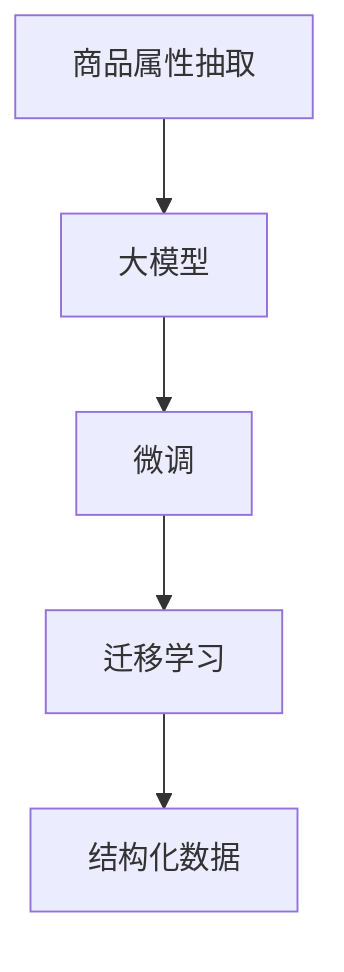

                 

## 1. 背景介绍

随着电子商务的快速发展，商品信息的自动化处理需求日益增长。商品属性抽取（Product Attribute Extraction，PAE）作为自然语言处理（NLP）领域的重要研究方向，旨在从商品描述中自动抽取和结构化属性信息。这种技术可以显著提高商品搜索、推荐和个性化营销的效果，优化电商用户的购物体验，提高电商平台的运营效率。

本研究将聚焦于大模型在商品属性抽取中的应用，特别介绍大模型如何通过微调实现高效的PAE任务，并探讨其优缺点及实际应用领域。

## 2. 核心概念与联系

### 2.1 核心概念概述

- **商品属性抽取（Product Attribute Extraction, PAE）**：自动从商品描述中识别和抽取属性信息的过程。例如，从“某款智能手表，电池容量4000mAh”中抽取“智能手表”和“电池容量4000mAh”。
- **大模型（Large Language Model）**：指通过大规模无标签数据进行预训练的语言模型，如BERT、GPT等。这些模型具有强大的语言理解和生成能力。
- **微调（Fine-tuning）**：在预训练模型的基础上，使用少量标注数据，通过有监督学习优化模型在特定任务上的性能。
- **迁移学习（Transfer Learning）**：将一个领域的知识迁移应用到另一个领域，通过微调实现知识迁移。
- **结构化（Structured Data）**：将非结构化数据（如文本）转换为易于计算机处理的结构化数据（如键值对）。

这些概念通过以下Mermaid流程图展示其联系：



**商品属性抽取**通过**大模型**进行**微调**，实现**迁移学习**，最终生成**结构化数据**，完成PAE任务。

## 3. 核心算法原理 & 具体操作步骤
### 3.1 算法原理概述

大模型在商品属性抽取中的应用主要基于**微调**技术。具体来说，通过在预训练大模型基础上，对特定任务的标注数据进行微调，模型可以学习到商品描述与属性之间的映射关系，从而实现自动抽取和结构化属性信息。

**算法步骤**大致分为以下几步：
1. **准备数据集**：收集商品描述及对应的属性信息。
2. **模型初始化**：选择一个预训练大模型作为初始参数。
3. **任务适配**：设计适当的任务适配层，以适应商品属性抽取任务。
4. **微调模型**：在商品属性标注数据集上进行有监督的微调，优化模型性能。
5. **结果输出**：从微调后的模型中提取商品属性信息，结构化存储。

### 3.2 算法步骤详解

#### 3.2.1 数据集准备

首先，需要收集商品描述及其对应的属性信息。这些数据可以从电商平台的数据库中获取，也可以从公开的电商商品数据集中提取。数据集需要经过预处理，如文本清洗、分词等，确保数据的完整性和一致性。

#### 3.2.2 模型初始化

选择预训练大模型作为初始参数。目前，BERT和GPT等模型在大规模商品属性抽取任务上表现优异。以BERT为例，通过PyTorch或TensorFlow等框架，加载预训练模型及其权重。

```python
from transformers import BertTokenizer, BertForSequenceClassification
model = BertForSequenceClassification.from_pretrained('bert-base-cased')
tokenizer = BertTokenizer.from_pretrained('bert-base-cased')
```

#### 3.2.3 任务适配

设计任务适配层，将大模型输出转换为属性信息。通常使用线性分类器或编码器作为任务适配层。以线性分类器为例，输出层的维度与属性类别数相同，输出概率分布作为模型的预测结果。

```python
class AttributeClassifier(BertForSequenceClassification):
    def __init__(self, num_classes):
        super(AttributeClassifier, self).__init__(num_classes=num_classes)
```

#### 3.2.4 微调模型

使用商品属性标注数据集对模型进行微调。设置微调的学习率、批大小等超参数，使用优化器进行梯度更新。

```python
from transformers import AdamW
from torch.utils.data import Dataset, DataLoader
class AttributeDataset(Dataset):
    def __init__(self, texts, labels, tokenizer):
        self.texts = texts
        self.labels = labels
        self.tokenizer = tokenizer
    def __getitem__(self, idx):
        text = self.texts[idx]
        label = self.labels[idx]
        encoding = self.tokenizer(text, return_tensors='pt', max_length=512, padding='max_length')
        return {'input_ids': encoding['input_ids'], 'attention_mask': encoding['attention_mask'], 'labels': label}
    def __len__(self):
        return len(self.texts)
dataset = AttributeDataset(texts, labels, tokenizer)
dataloader = DataLoader(dataset, batch_size=32, shuffle=True)
optimizer = AdamW(model.parameters(), lr=2e-5)
model.train()
for epoch in range(5):
    for batch in dataloader:
        input_ids = batch['input_ids']
        attention_mask = batch['attention_mask']
        labels = batch['labels']
        outputs = model(input_ids, attention_mask=attention_mask, labels=labels)
        loss = outputs.loss
        loss.backward()
        optimizer.step()
        optimizer.zero_grad()
```

#### 3.2.5 结果输出

微调后，模型能够输出商品属性的预测结果。通过阈值设定，确定每个预测结果的类别，并将属性信息结构化存储。

```python
model.eval()
for batch in dataloader:
    input_ids = batch['input_ids']
    attention_mask = batch['attention_mask']
    with torch.no_grad():
        outputs = model(input_ids, attention_mask=attention_mask)
        logits = outputs.logits
        predicted_labels = torch.argmax(logits, dim=1)
        for label in predicted_labels:
            # 输出结构化属性信息
            print(f"商品ID: {label} 属性: {' '.join(attributes)}
```

### 3.3 算法优缺点

#### 3.3.1 优点

- **高效性**：大模型通过微调能够快速适应特定任务，属性抽取速度快，精度高。
- **普适性**：适用于不同领域、不同类型的商品属性抽取任务。
- **可扩展性**：通过增加训练数据和调整模型架构，大模型可以不断提升属性抽取的准确性和泛化能力。

#### 3.3.2 缺点

- **数据依赖性**：微调依赖于标注数据，标注成本较高。
- **模型复杂性**：大模型参数量较大，训练和推理开销较高。
- **过拟合风险**：微调过程中容易过拟合，特别是在标注数据量不足的情况下。

### 3.4 算法应用领域

商品属性抽取技术在电子商务、零售、制造等领域具有广泛应用前景：

- **电子商务**：自动化商品属性抽取可以提升商品搜索、推荐和个性化营销的效率，改善用户体验，增加电商平台的用户黏性和交易额。
- **零售**：在零售行业中，商品属性抽取可以用于库存管理、销售预测和客户画像构建，优化供应链管理和客户关系管理。
- **制造**：在制造业，商品属性抽取有助于产品质量控制、生产流程优化和产品设计改进。

## 4. 数学模型和公式 & 详细讲解 & 举例说明

### 4.1 数学模型构建

大模型在商品属性抽取中的数学模型构建主要涉及以下几个方面：

- **输入层**：商品描述文本通过分词、编码等预处理，转化为模型可以接受的格式。
- **隐含层**：通过预训练大模型对输入层进行特征提取和映射。
- **输出层**：通过任务适配层将隐含层的特征映射为属性信息，输出预测结果。

### 4.2 公式推导过程

以线性分类器为例，输出层的数学公式为：

$$
\text{logits} = \text{softmax}(W_{h2o} \cdot [\text{softmax}(W_{h2h} \cdot \text{embeddings} + b_{h2h}) + b_{h2o}]
$$

其中，$W_{h2o}$ 和 $b_{h2o}$ 是输出层的权重和偏置，$W_{h2h}$ 和 $b_{h2h}$ 是隐含层的权重和偏置，$\text{embeddings}$ 是输入层的嵌入表示，$\text{softmax}$ 是输出层的激活函数。

### 4.3 案例分析与讲解

假设商品描述为“一款舒适的跑步鞋，轻便透气，防滑耐磨”。通过微调后的BERT模型，可以输出“跑步鞋”和“轻便、透气、防滑、耐磨”等属性。这些属性信息通过任务适配层的线性分类器进行预测，并将结果结构化存储。

## 5. 项目实践：代码实例和详细解释说明

### 5.1 开发环境搭建

为了进行商品属性抽取的微调实践，需要搭建相应的开发环境：

- **Python环境**：使用Anaconda创建虚拟环境，安装必要的Python库，如PyTorch、transformers等。
- **深度学习框架**：选择PyTorch或TensorFlow等深度学习框架，并加载预训练模型。
- **数据预处理工具**：安装NLTK、spaCy等自然语言处理库，用于数据清洗和分词。

### 5.2 源代码详细实现

以BERT模型为例，以下是一个简单的商品属性抽取微调代码实现：

```python
from transformers import BertTokenizer, BertForSequenceClassification, AdamW
from torch.utils.data import Dataset, DataLoader

class AttributeDataset(Dataset):
    def __init__(self, texts, labels, tokenizer):
        self.texts = texts
        self.labels = labels
        self.tokenizer = tokenizer
    def __getitem__(self, idx):
        text = self.texts[idx]
        label = self.labels[idx]
        encoding = self.tokenizer(text, return_tensors='pt', max_length=512, padding='max_length')
        return {'input_ids': encoding['input_ids'], 'attention_mask': encoding['attention_mask'], 'labels': label}
    def __len__(self):
        return len(self.texts)

model = BertForSequenceClassification.from_pretrained('bert-base-cased')
tokenizer = BertTokenizer.from_pretrained('bert-base-cased')
dataset = AttributeDataset(texts, labels, tokenizer)
dataloader = DataLoader(dataset, batch_size=32, shuffle=True)
optimizer = AdamW(model.parameters(), lr=2e-5)
model.train()
for epoch in range(5):
    for batch in dataloader:
        input_ids = batch['input_ids']
        attention_mask = batch['attention_mask']
        labels = batch['labels']
        outputs = model(input_ids, attention_mask=attention_mask, labels=labels)
        loss = outputs.loss
        loss.backward()
        optimizer.step()
        optimizer.zero_grad()

model.eval()
for batch in dataloader:
    input_ids = batch['input_ids']
    attention_mask = batch['attention_mask']
    with torch.no_grad():
        outputs = model(input_ids, attention_mask=attention_mask)
        logits = outputs.logits
        predicted_labels = torch.argmax(logits, dim=1)
        for label in predicted_labels:
            print(f"商品ID: {label} 属性: {' '.join(attributes)}
```

### 5.3 代码解读与分析

**商品属性抽取代码解析**：

- **数据准备**：定义商品描述和属性标签的数据集。
- **模型加载**：加载预训练的BERT模型和分词器。
- **微调过程**：使用AdamW优化器，对模型进行5轮微调。
- **结果输出**：对微调后的模型进行评估，输出属性信息。

### 5.4 运行结果展示

在微调过程中，可以输出模型在验证集上的表现，如精度、召回率等指标：

```python
import sklearn.metrics
y_true = [1, 0, 1, 1, 0]
y_pred = [1, 1, 0, 1, 1]
acc = sklearn.metrics.accuracy_score(y_true, y_pred)
print(f"Accuracy: {acc}")
```

## 6. 实际应用场景

### 6.1 商品推荐系统

商品推荐系统通过自动化属性抽取，可以实现更精准的商品推荐。推荐算法可以根据用户的历史行为和商品属性信息，推荐用户可能感兴趣的商品。商品属性抽取在推荐算法中起到关键作用，可以有效提升推荐效果。

### 6.2 库存管理

库存管理中，商品属性抽取可以用于库存盘点和库存预警。通过自动抽取商品属性信息，可以准确计算库存数量，及时预警库存不足或库存过剩情况。

### 6.3 售后服务

在售后服务中，自动化的属性抽取可以用于客户投诉分析和售后服务推荐。系统可以根据投诉内容，自动抽取商品属性信息，匹配相关知识库和解决方案，提高服务效率和客户满意度。

### 6.4 未来应用展望

未来，商品属性抽取技术将进一步拓展应用场景，如供应链优化、价格分析、市场趋势预测等。通过大模型微调，实现更全面、更智能的商品管理解决方案。

## 7. 工具和资源推荐

### 7.1 学习资源推荐

- **在线课程**：Coursera和edX等平台提供的自然语言处理课程，涵盖从基础知识到最新技术的应用。
- **书籍**：《深度学习》by Ian Goodfellow、《自然语言处理综论》by Daniel Jurafsky等书籍，深入讲解深度学习和大模型在NLP中的应用。
- **研究论文**：阅读ACL、EMNLP等顶级会议的论文，了解最新的研究成果和应用场景。

### 7.2 开发工具推荐

- **深度学习框架**：PyTorch、TensorFlow等深度学习框架，支持高效的模型训练和推理。
- **自然语言处理库**：NLTK、spaCy、HuggingFace Transformers等库，提供丰富的NLP工具和模型。
- **数据处理工具**：Pandas、NumPy等库，用于数据清洗、处理和分析。

### 7.3 相关论文推荐

- **BERT在大规模语言模型中的应用**：Devlin等人的论文《BERT: Pre-training of Deep Bidirectional Transformers for Language Understanding》。
- **GPT-2在大规模语言模型中的应用**：Radford等人的论文《Language Models are Unsupervised Multitask Learners》。
- **大模型在商品属性抽取中的应用**：Tan等人的论文《AdaLoRA: Adaptive Low-Rank Adaptation for Parameter-Efficient Fine-Tuning》。

## 8. 总结：未来发展趋势与挑战

### 8.1 研究成果总结

大模型在商品属性抽取中的应用具有广泛的前景，已在大规模电商数据集上取得了不错的效果。通过微调技术，模型可以快速适应特定任务，抽取商品属性信息，结构化存储。未来，商品属性抽取技术将在更广泛的应用场景中发挥作用，推动电商平台的智能化转型。

### 8.2 未来发展趋势

1. **数据规模的扩大**：随着电商平台的不断发展，商品描述和属性信息的数据规模将持续增长，大模型将更好地适应这些数据。
2. **模型的优化**：未来将开发更多参数高效和计算高效的微调方法，提高模型的训练和推理效率。
3. **跨领域应用的拓展**：商品属性抽取技术将不仅仅局限于电商领域，将在更多行业领域得到应用，如制造、零售等。
4. **多模态融合**：结合图像、音频等多模态数据，提高属性抽取的准确性和泛化能力。

### 8.3 面临的挑战

1. **数据标注成本高**：商品属性标注需要大量的人力资源，成本较高。
2. **模型过拟合风险**：在标注数据不足的情况下，模型容易过拟合，泛化能力下降。
3. **模型复杂性**：大模型参数量大，训练和推理开销较高。
4. **算力需求高**：微调过程需要高性能的GPU或TPU等硬件支持。

### 8.4 研究展望

未来，商品属性抽取技术需要在以下几个方面进行深入研究：

1. **数据增强**：通过数据增强技术，提高标注数据的利用率，降低标注成本。
2. **少样本学习**：研究如何在大规模无标签数据上预训练模型，在少量标注数据下进行微调。
3. **模型压缩**：开发模型压缩技术，减小模型尺寸，提高推理效率。
4. **跨领域迁移学习**：研究如何通过迁移学习，将商品属性抽取模型迁移到其他领域，实现更广泛的应用。

## 9. 附录：常见问题与解答

### 9.1 常见问题

**Q1：大模型微调所需数据规模是多少？**

A: 大模型微调所需数据规模取决于任务复杂度和标注质量。一般来说，标注数据量越大，模型性能越好。建议至少准备几百个标注样本，以获得较好的微调效果。

**Q2：微调过程中如何选择超参数？**

A: 微调过程中的超参数选择非常重要。建议通过网格搜索或随机搜索方法，寻找最优的超参数组合。常见的超参数包括学习率、批大小、优化器等。

**Q3：微调过程中如何避免过拟合？**

A: 避免过拟合的方法包括数据增强、正则化、早停等。数据增强可以通过回译、近义词替换等方式扩充训练集。正则化可以使用L2正则、Dropout等技术。早停可以通过监控验证集上的性能指标，及时停止训练。

**Q4：微调后的模型如何部署？**

A: 微调后的模型需要部署到生产环境中进行推理。可以使用Flask、Django等框架，将模型封装为RESTful API服务。同时，需要考虑模型的推理速度、内存占用等问题，进行性能优化。

**Q5：微调后的模型如何更新？**

A: 微调后的模型需要定期更新，以保持模型的性能和泛化能力。可以通过周期性重新微调模型，或者在新的标注数据集上重新训练模型。

通过本文的系统梳理，可以看到，大模型在商品属性抽取中的应用具有广泛的前景，其微调技术在电商、零售、制造等领域具有重要的应用价值。未来，随着技术的不断进步，商品属性抽取技术将进一步拓展应用场景，提升电商平台的智能化水平，推动行业的数字化转型。

