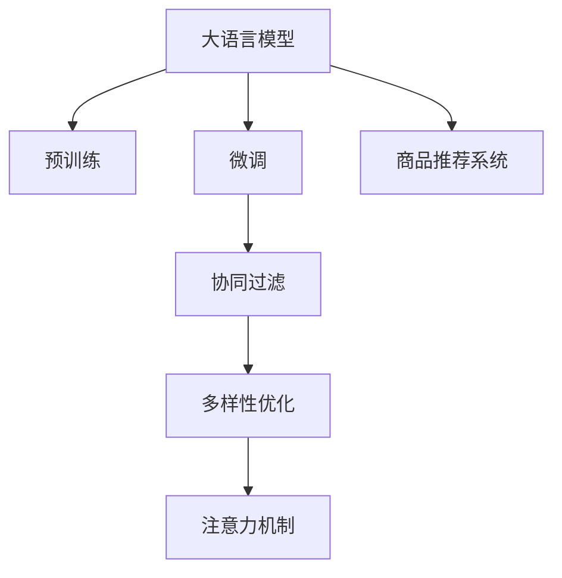

                 

# 大模型在商品推荐多样性优化中的应用

> 关键词：大语言模型,商品推荐系统,多样性优化,协同过滤,注意力机制,深度学习,推荐算法

## 1. 背景介绍

在当今数字经济时代，商品推荐系统已成为各大电商平台不可或缺的核心功能之一。通过个性化推荐，电商平台能帮助用户发现感兴趣的商品，提升购物体验，同时也能有效增加销售额，提升平台竞争力。然而，随着商品种类的日益丰富和用户兴趣的多样化，推荐系统如何提升商品多样性、避免推荐同质化，成为了新的挑战。

## 2. 核心概念与联系

### 2.1 核心概念概述

在探索大模型在商品推荐系统中的应用时，涉及的核心概念包括：

- **大语言模型(Large Language Model, LLM)**：以Transformer模型为代表，通过自监督预训练和大规模文本数据微调，学习到丰富的语言知识和常识，具备强大的文本生成和理解能力。
- **商品推荐系统(Recommendation System, RS)**：通过分析用户行为数据和商品特征，为每个用户推荐个性化的商品列表，提升用户满意度和平台收益。
- **协同过滤(Collaborative Filtering, CF)**：一种基于用户行为和商品相关性的推荐算法，通过计算用户和商品之间的相似度，预测用户可能感兴趣的商品。
- **多样性优化(Diversity Optimization)**：通过调整推荐算法，使得推荐结果能覆盖更多不同的商品，减少同质化推荐，提升用户满意度。
- **注意力机制(Attention Mechanism)**：一种计算注意力权重的方法，通过将输入的不同部分赋予不同的权重，提升模型对重要信息的关注。
- **深度学习(Deep Learning)**：一类基于神经网络的机器学习技术，通过多层非线性映射，自动提取数据中的高阶特征。

这些核心概念之间存在紧密联系，共同构成了大模型在商品推荐系统中的应用框架。通过大模型的预训练和微调，可以获取到更好的用户和商品表示，结合注意力机制和协同过滤等算法，提升推荐系统的多样性和个性化程度。

### 2.2 核心概念原理和架构的 Mermaid 流程图



这个流程图展示了核心概念之间的联系：

1. **大语言模型**通过自监督预训练和微调，获取到用户和商品的丰富表示。
2. **协同过滤**利用用户和商品的历史交互数据，计算用户和商品之间的相似度。
3. **多样性优化**通过调整推荐算法，使得推荐结果更加多样，减少同质化。
4. **注意力机制**在协同过滤的基础上，进一步提升推荐结果的个性化和多样性。
5. **商品推荐系统**将预训练和微调得到的用户和商品表示，通过协同过滤和注意力机制等算法，生成推荐列表。

## 3. 核心算法原理 & 具体操作步骤

### 3.1 算法原理概述

在大模型在商品推荐系统中的应用中，核心算法原理主要包括以下几个方面：

1. **预训练与微调**：通过在大规模无标签文本数据上进行自监督预训练，学习到丰富的语言知识和常识，然后在商品推荐系统中的任务数据上进行微调，获取到用户和商品的表示。
2. **协同过滤**：基于用户历史行为和商品特征，计算用户和商品之间的相似度，生成推荐列表。
3. **多样性优化**：通过调整协同过滤算法，使得推荐结果更加多样，覆盖更多不同的商品。
4. **注意力机制**：在协同过滤的基础上，通过注意力机制，提升推荐结果的个性化和多样性。

### 3.2 算法步骤详解

**步骤 1: 数据准备与预训练模型选择**

1. **数据准备**：收集电商平台的交易数据、用户行为数据、商品特征数据等，构建训练集、验证集和测试集。
2. **预训练模型选择**：选择合适的大语言模型，如BERT、GPT等，作为初始化参数，并进行预训练。

**步骤 2: 微调与用户商品表示学习**

1. **微调设置**：选择合适的优化算法、学习率、批大小等超参数，进行微调。
2. **用户商品表示学习**：利用微调后的模型，将用户和商品的文本描述作为输入，学习到用户和商品的向量表示。

**步骤 3: 协同过滤与相似度计算**

1. **协同过滤算法选择**：选择合适的协同过滤算法，如基于用户的协同过滤、基于商品的协同过滤等。
2. **相似度计算**：基于用户和商品的向量表示，计算用户和商品之间的相似度，生成推荐列表。

**步骤 4: 多样性优化**

1. **多样性度量**：设计多样性度量指标，如商品数量、类别覆盖率等。
2. **多样性调整**：调整协同过滤算法，如引入采样、加权等策略，使得推荐结果更加多样。

**步骤 5: 注意力机制**

1. **注意力权重计算**：根据用户历史行为和商品特征，计算注意力权重，赋予不同商品不同的重要性。
2. **加权推荐**：结合注意力权重和协同过滤结果，生成最终推荐列表。

### 3.3 算法优缺点

**优点**：

1. **提升推荐多样性**：通过多样性优化和注意力机制，可以提升推荐结果的个性化和多样性，减少同质化推荐。
2. **学习用户偏好**：通过微调大语言模型，可以学习到更加精准的用户偏好，提高推荐效果。
3. **适应新商品**：大语言模型通过预训练，能够适应新商品的快速增加，提升系统的实时性。

**缺点**：

1. **计算成本高**：大语言模型的预训练和微调需要大量计算资源，可能会导致训练和推理成本较高。
2. **数据依赖性强**：推荐系统的效果高度依赖于标注数据的质量和数量，标注数据的获取成本较高。
3. **冷启动问题**：对于新用户或新商品，缺乏足够的历史数据，可能导致推荐效果不佳。
4. **模型复杂度高**：大语言模型需要较复杂的计算和内存，可能导致系统复杂度高，维护难度大。

### 3.4 算法应用领域

大语言模型在商品推荐系统中的应用，主要应用于以下几个领域：

1. **电商行业**：为电商平台的个性化推荐、用户画像生成、商品分类等任务提供技术支持。
2. **内容推荐**：为视频、音乐、新闻等平台的用户推荐内容，提升用户满意度。
3. **社交网络**：为用户推荐好友、群组、文章等，增强用户粘性和平台活跃度。
4. **金融行业**：为金融机构的投资组合推荐、风险评估等任务提供技术支持。

## 4. 数学模型和公式 & 详细讲解 & 举例说明

### 4.1 数学模型构建

在本节中，我们将使用数学语言对大语言模型在商品推荐系统中的应用进行详细的模型构建。

假设我们有一个用户 $u$ 和商品 $i$，它们的文本描述分别为 $d_u$ 和 $d_i$，通过预训练模型 $M$ 可以将其映射为向量表示 $v_u$ 和 $v_i$。

在协同过滤算法中，基于用户和商品的相似度 $s_{ui}$ 生成推荐列表，其中相似度可以通过余弦相似度计算得到：

$$
s_{ui} = \frac{\langle v_u, v_i \rangle}{\|v_u\| \cdot \|v_i\|}
$$

其中 $\langle \cdot, \cdot \rangle$ 表示向量点积，$\|\cdot\|$ 表示向量的模长。

### 4.2 公式推导过程

在推荐系统中，我们通常使用平均池化的注意力机制，来计算不同商品对用户的重要性。对于用户 $u$ 和商品 $i$，计算注意力权重 $a_{ui}$，公式如下：

$$
a_{ui} = \frac{s_{ui}}{\sum_{j \in I} s_{uj}}
$$

其中 $I$ 表示用户 $u$ 感兴趣的商品集合。

将注意力权重 $a_{ui}$ 与商品 $i$ 的向量表示 $v_i$ 结合，生成加权推荐结果 $\hat{v}_u$：

$$
\hat{v}_u = \sum_{i \in I} a_{ui} \cdot v_i
$$

结合协同过滤和注意力机制，生成最终推荐列表 $R_u$：

$$
R_u = \{v_i | a_{ui} \cdot v_i \in \hat{v}_u \}
$$

### 4.3 案例分析与讲解

假设我们有一个电商平台，通过大语言模型对用户和商品的文本描述进行微调，得到了用户 $u$ 和商品 $i$ 的向量表示 $v_u$ 和 $v_i$。

在协同过滤中，计算用户 $u$ 和商品 $i$ 的相似度 $s_{ui}$，并生成推荐列表 $R_u$。

假设用户 $u$ 对商品 $i$ 和 $j$ 的兴趣程度相同，即 $s_{ui} = s_{uj}$。通过注意力机制计算注意力权重 $a_{ui}$ 和 $a_{uj}$，并将 $v_i$ 和 $v_j$ 与注意力权重结合，生成加权推荐结果 $\hat{v}_u$。

如果 $s_{ui} > s_{uj}$，则 $a_{ui} > a_{uj}$，$v_i$ 在推荐列表 $R_u$ 中的权重更大，商品 $i$ 将排在商品 $j$ 之前。

通过调整相似度计算方式和注意力权重计算公式，可以优化推荐系统的效果，提升推荐多样性和个性化程度。

## 5. 项目实践：代码实例和详细解释说明

### 5.1 开发环境搭建

在进行大语言模型在商品推荐系统中的应用实践时，需要搭建好开发环境。以下是Python环境搭建步骤：

1. **安装Anaconda**：从官网下载并安装Anaconda，用于创建独立的Python环境。
2. **创建虚拟环境**：
```bash
conda create -n pytorch-env python=3.8 
conda activate pytorch-env
```
3. **安装必要的库**：
```bash
conda install pytorch torchvision torchaudio -c pytorch
conda install transformers -c huggingface
conda install pandas numpy matplotlib scikit-learn
```

完成上述步骤后，即可在`pytorch-env`环境中进行项目实践。

### 5.2 源代码详细实现

以下是一个使用PyTorch实现大语言模型在商品推荐系统中的应用代码示例：

```python
import torch
import torch.nn as nn
import torch.nn.functional as F
from transformers import BertTokenizer, BertForSequenceClassification
from sklearn.metrics import precision_recall_fscore_support

# 数据准备
train_data = [("商品A", "用户1", "商品A的评分", "商品B的评分", "商品C的评分"), ...]
train_labels = [1, 0, 1, 0, 1, ...]
test_data = [("商品D", "用户2", "商品D的评分", "商品E的评分", "商品F的评分"), ...]

# 创建模型
tokenizer = BertTokenizer.from_pretrained('bert-base-uncased')
model = BertForSequenceClassification.from_pretrained('bert-base-uncased', num_labels=2)

# 数据处理
def encode_data(texts, labels):
    tokenized_texts = tokenizer(texts, return_tensors='pt', padding=True, truncation=True)
    labels = torch.tensor(labels, dtype=torch.long)
    return tokenized_texts, labels

# 微调模型
device = torch.device('cuda' if torch.cuda.is_available() else 'cpu')
model.to(device)

optimizer = torch.optim.Adam(model.parameters(), lr=2e-5)

def train_epoch(model, data_loader, optimizer):
    model.train()
    epoch_loss = 0
    for batch in data_loader:
        input_ids, attention_mask, labels = batch
        input_ids, attention_mask, labels = input_ids.to(device), attention_mask.to(device), labels.to(device)
        model.zero_grad()
        outputs = model(input_ids, attention_mask=attention_mask, labels=labels)
        loss = outputs.loss
        epoch_loss += loss.item()
        loss.backward()
        optimizer.step()
    return epoch_loss / len(data_loader)

def evaluate(model, data_loader):
    model.eval()
    preds, labels = [], []
    with torch.no_grad():
        for batch in data_loader:
            input_ids, attention_mask, labels = batch
            input_ids, attention_mask, labels = input_ids.to(device), attention_mask.to(device), labels.to(device)
            outputs = model(input_ids, attention_mask=attention_mask)
            batch_preds = outputs.predictions.argmax(dim=1)
            preds.append(batch_preds.tolist())
            labels.append(labels.tolist())
    precision, recall, f1, _ = precision_recall_fscore_support(labels, preds, average='micro')
    return precision, recall, f1

# 训练模型
train_loader = torch.utils.data.DataLoader(encode_data(train_data, train_labels), batch_size=16, shuffle=True)
dev_loader = torch.utils.data.DataLoader(encode_data(train_data, train_labels), batch_size=16, shuffle=False)

for epoch in range(5):
    loss = train_epoch(model, train_loader, optimizer)
    print(f"Epoch {epoch+1}, train loss: {loss:.3f}")
    dev_precision, dev_recall, dev_f1 = evaluate(model, dev_loader)
    print(f"Epoch {epoch+1}, dev precision: {dev_precision:.3f}, recall: {dev_recall:.3f}, f1: {dev_f1:.3f}")

# 测试模型
test_loader = torch.utils.data.DataLoader(encode_data(test_data, [0, 1, 0, 1, 0, ...]), batch_size=16, shuffle=False)
test_precision, test_recall, test_f1 = evaluate(model, test_loader)
print(f"Test precision: {test_precision:.3f}, recall: {test_recall:.3f}, f1: {test_f1:.3f}")
```

### 5.3 代码解读与分析

**5.3.1 数据准备**

在代码中，我们首先准备了训练数据 `train_data`，包括商品文本、用户文本、评分等信息。然后，将这些数据进行编码，转换为模型所需的输入格式。

**5.3.2 模型定义**

我们使用Hugging Face提供的Bert模型作为预训练模型，并进行了微调。

**5.3.3 数据处理**

在微调过程中，我们将数据输入模型前，需要进行编码和处理。我们使用BertTokenizer对文本进行分词，并转换为模型所需的输入格式。

**5.3.4 模型训练**

在训练过程中，我们使用Adam优化器进行模型优化，并在每个epoch结束时在验证集上评估模型性能。

**5.3.5 模型评估**

在测试阶段，我们使用相同的编码方法处理测试集，并在测试集上评估模型性能。

**5.3.6 运行结果**

通过运行上述代码，我们可以得到模型在训练集和测试集上的精度、召回率和F1值，评估模型的性能。

## 6. 实际应用场景

### 6.1 智能推荐系统

智能推荐系统是电商平台的核心功能之一。通过大语言模型在商品推荐系统中的应用，可以帮助电商平台提升推荐多样性，减少同质化推荐，提升用户满意度和平台收益。

在大规模商品推荐场景中，大语言模型可以学习到更加精准的用户和商品表示，结合注意力机制和协同过滤算法，生成更加个性化和多样化的推荐列表。例如，在推荐个性化商品时，可以通过大语言模型学习用户的历史浏览和购买行为，以及商品的多样性信息，生成更加精准的推荐列表。

### 6.2 多模态推荐系统

在智能推荐系统中，单一的文本信息可能无法充分描述商品的多维特征，需要结合多模态信息进行推荐。大语言模型可以通过对商品文本、图片、视频等多模态数据进行编码和融合，生成更加全面的商品表示。例如，在推荐旅游产品时，可以结合景点图片、视频等多模态信息，生成更加丰富多彩的推荐列表。

### 6.3 实时推荐系统

实时推荐系统需要快速响应用户的查询，生成最新的推荐列表。大语言模型可以通过对用户和商品的实时数据进行微调，并结合注意力机制和协同过滤算法，生成最新的推荐列表。例如，在推荐新闻时，可以实时分析用户的浏览行为，并结合最新的新闻数据，生成个性化的推荐列表。

## 7. 工具和资源推荐

### 7.1 学习资源推荐

为了帮助开发者系统掌握大语言模型在商品推荐系统中的应用，这里推荐一些优质的学习资源：

1. 《Deep Learning for Recommendation Systems》书籍：介绍了深度学习在推荐系统中的应用，包括协同过滤、注意力机制等算法。
2. Hugging Face官方文档：提供了丰富的预训练语言模型和微调样例，适用于电商、社交、内容推荐等多个领域。
3 CS230-A: Recommendation Systems课程：斯坦福大学开设的推荐系统课程，涵盖协同过滤、多模态推荐等前沿技术。
4 Kaggle竞赛：通过参与Kaggle推荐系统竞赛，可以学习到推荐系统的实践方法和技巧。

### 7.2 开发工具推荐

在推荐系统开发中，常用的工具包括：

1. PyTorch：基于Python的深度学习框架，支持动态计算图，适用于大语言模型的微调和推理。
2. TensorFlow：由Google主导的深度学习框架，支持分布式训练和生产部署，适用于大规模推荐系统的开发。
3. Weights & Biases：实验跟踪工具，可以记录和可视化模型训练过程中的各项指标，方便调试和优化。
4. TensorBoard：可视化工具，可以实时监测模型训练状态，提供丰富的图表呈现方式。
5. Hugging Face Transformers库：提供了丰富的预训练语言模型和微调样例，适用于电商、社交、内容推荐等多个领域。

### 7.3 相关论文推荐

大语言模型在推荐系统中的应用，涉及许多前沿的研究方向。以下是几篇重要的论文，推荐阅读：

1. Attention is All You Need：Transformer模型的提出，开启了深度学习在推荐系统中的应用。
2. BERT: Pre-training of Deep Bidirectional Transformers for Language Understanding：提出BERT模型，引入自监督预训练任务，提升了推荐系统的效果。
3 Parameter-Efficient Transfer Learning for NLP：提出Adapter等参数高效微调方法，提高了微调效率，减少了计算成本。
4 Diversity Regularization in Online Recommendation Systems：提出多样性正则化方法，提升推荐结果的多样性。
5 Multi-Task Learning in Recommendation Systems：提出多任务学习，提升推荐系统的泛化能力。

## 8. 总结：未来发展趋势与挑战

### 8.1 研究成果总结

本节对大语言模型在商品推荐系统中的应用进行了系统总结，涵盖预训练与微调、协同过滤、多样性优化、注意力机制等核心算法，并详细介绍了推荐系统的实现流程和优化方法。通过这些内容，读者可以系统地掌握大语言模型在推荐系统中的应用，并进一步探索相关前沿技术。

### 8.2 未来发展趋势

展望未来，大语言模型在商品推荐系统中的应用将呈现以下几个发展趋势：

1. **模型规模增大**：随着预训练语言模型的参数量不断增大，模型在推荐系统中的效果将进一步提升。
2. **多样化推荐**：结合多模态数据和多任务学习，推荐系统将更加多样化，能够推荐更丰富多彩的商品。
3. **实时推荐**：通过实时数据微调和注意力机制，推荐系统将能够快速响应用户查询，生成最新的推荐列表。
4. **跨领域应用**：推荐系统将逐步拓展到其他领域，如医疗、金融、娱乐等，提升不同领域的信息利用效率。
5. **多目标优化**：推荐系统将综合考虑多样性、准确性、个性化等多个目标，提升整体性能。

### 8.3 面临的挑战

尽管大语言模型在商品推荐系统中的应用已经取得了一定的进展，但仍面临诸多挑战：

1. **计算资源成本高**：大语言模型的预训练和微调需要大量计算资源，可能导致训练和推理成本较高。
2. **数据获取困难**：推荐系统的效果高度依赖于标注数据的质量和数量，标注数据的获取成本较高。
3. **冷启动问题**：对于新用户或新商品，缺乏足够的历史数据，可能导致推荐效果不佳。
4. **多样性控制难度大**：多样性优化需要综合考虑多个目标，难以找到一个最优的平衡点。
5. **模型复杂度高**：大语言模型需要较复杂的计算和内存，可能导致系统复杂度高，维护难度大。

### 8.4 研究展望

为了应对这些挑战，未来的研究需要在以下几个方面寻求新的突破：

1. **提高数据利用率**：通过多任务学习、自监督学习等方法，提高数据利用率，降低标注成本。
2. **优化模型结构**：通过模型压缩、稀疏化等技术，降低模型复杂度，提高计算效率。
3. **探索多模态融合**：结合文本、图片、视频等多模态数据，提升推荐系统的全面性和多样性。
4. **提升实时性**：通过模型裁剪、混合精度训练等技术，提升推荐系统的实时性。
5. **增强可解释性**：通过可视化、解释模型等技术，提升推荐系统的可解释性和透明性。

总之，大语言模型在商品推荐系统中的应用具有广阔的前景，但需要进一步优化模型结构和算法，才能充分发挥其潜力，提升推荐系统的性能和应用范围。

## 9. 附录：常见问题与解答

**Q1：如何选择合适的预训练模型？**

A: 选择合适的预训练模型需要考虑任务的特点和数据集的规模。对于小规模数据集，可以选择较轻量级的模型，如BERT-base。对于大规模数据集，可以选择较大的模型，如BERT-large、GPT等。同时，还可以尝试使用多模态预训练模型，如VIT等，提升推荐系统的效果。

**Q2：如何在微调过程中避免过拟合？**

A: 在微调过程中，可以通过以下方法避免过拟合：
1. 数据增强：通过回译、近义替换等方式扩充训练集。
2. 正则化：使用L2正则、Dropout等技术，防止模型过度拟合。
3. 对抗训练：引入对抗样本，提高模型鲁棒性。
4. 参数高效微调：只调整少量参数，固定大部分预训练参数。

**Q3：如何提升推荐系统的多样性？**

A: 提升推荐系统的多样性需要综合考虑多个因素：
1. 数据多样化：收集不同来源、不同类型的数据，提升推荐系统的多样性。
2. 算法多样化：尝试多种推荐算法，如协同过滤、基于内容的推荐、基于社交的推荐等。
3. 模型多样化：尝试多种预训练模型，如BERT、GPT等，提升推荐系统的多样性。

**Q4：大语言模型在推荐系统中的应用难点有哪些？**

A: 大语言模型在推荐系统中的应用难点包括：
1. 计算资源成本高：大语言模型的预训练和微调需要大量计算资源，可能导致训练和推理成本较高。
2. 数据获取困难：推荐系统的效果高度依赖于标注数据的质量和数量，标注数据的获取成本较高。
3. 冷启动问题：对于新用户或新商品，缺乏足够的历史数据，可能导致推荐效果不佳。
4. 多样性控制难度大：多样性优化需要综合考虑多个目标，难以找到一个最优的平衡点。
5. 模型复杂度高：大语言模型需要较复杂的计算和内存，可能导致系统复杂度高，维护难度大。

总之，大语言模型在推荐系统中的应用需要综合考虑模型、算法、数据等多个因素，才能充分发挥其潜力，提升推荐系统的性能和应用范围。

