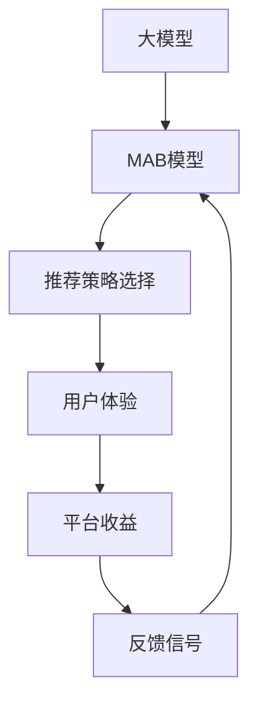

                 

# 大模型在商品推荐多样性优化中的强化学习应用

## 1. 背景介绍

### 1.1 问题由来

在电商领域，推荐系统已经成为不可或缺的重要工具，它帮助用户快速找到感兴趣的商品，提升购物体验和平台转化率。随着用户偏好的不断变化和商品库的日益丰富，推荐系统面临的最大挑战之一是如何平衡个性化推荐和多样性优化。

传统的推荐算法如协同过滤、内容推荐等，往往倾向于向用户推荐相似度高的商品，导致多样性不足，长尾商品难以曝光，用户体验单一。与此同时，推荐系统也面临着数据稀疏、噪声干扰等问题，影响推荐效果和用户满意度。

针对这些挑战，强化学习作为一种高效、自适应的学习范式，近年来在推荐系统中得到了广泛应用。通过与用户进行互动，强化学习算法能够实时调整推荐策略，最大化用户满意度和推荐系统收益。特别是基于大模型的强化学习，能够借助深度神经网络的海量表示能力，更好地捕捉用户偏好和商品特征，实现更加个性化和多样化的推荐。

### 1.2 问题核心关键点

在推荐系统中，多样化推荐的核心在于保证每个用户能够接触到不同类别的商品，避免陷入单一推荐渠道。然而，个性化推荐在某种程度上与多样化目标存在冲突，如何在两者之间取得平衡，是强化学习优化商品推荐多样性需要解决的核心问题。

目前，主要通过以下几种方法来解决这一问题：
- **多臂老虎机(Multi-Armed Bandit, MAB)**：使用MAB模型，推荐多个备选商品给用户，通过统计估计最优策略进行多样化推荐。
- **上下文增强学习**：通过将用户行为、时间、商品属性等信息作为上下文特征，引导推荐策略更具有个性化和多样性。
- **交互式推荐**：通过与用户的交互，动态调整推荐策略，最大化多样性和个性化。
- **混合推荐模型**：结合协同过滤和基于内容的推荐方法，综合提升推荐效果和多样性。

本文聚焦于基于大模型的强化学习，探索如何通过多臂老虎机方法，优化商品推荐多样性，提升用户体验和平台收益。

## 2. 核心概念与联系

### 2.1 核心概念概述

在电商推荐系统中，商品推荐多样性优化是一个典型的多臂老虎机问题。多臂老虎机（MAB）是一种随机策略选择模型，常用于在线决策问题，如推荐系统、广告投放、资源调度等。通过不断测试各备选策略，选择最优策略进行执行。

在本节中，我们将详细介绍多臂老虎机模型及其与大模型的联系。

- **多臂老虎机(MAB)**：假设总共有K个备选策略，用户每次随机选择一个策略进行尝试，根据反馈调整策略选择，优化最终收益。
- **大模型**：预训练语言模型（如BERT、GPT等）在电商领域应用中，可以视为一个具有强大知识表示能力的推荐策略选择器，用于判断各个备选策略的表现，并提供优化建议。
- **收益最大化**：推荐系统的目标在于最大化用户满意度和平台收益，通过强化学习不断调整策略，优化多样化推荐效果。

这些核心概念之间的逻辑关系可以通过以下Mermaid流程图来展示：



这个流程图展示了大模型在MAB模型中的作用：
1. 大模型在多臂老虎机模型中作为策略选择器，提供每个备选策略的表现估计。
2. MAB模型根据策略选择结果和反馈信号调整策略选择概率，优化整体收益。
3. 最终，用户体验和平台收益得到提升。

## 3. 核心算法原理 & 具体操作步骤
### 3.1 算法原理概述

在电商推荐系统中，基于大模型的强化学习旨在通过多臂老虎机模型，动态调整推荐策略，优化商品推荐的多样性和个性化。其核心思想是：将大模型作为策略选择器，根据用户历史行为数据和商品特征，估算每个备选策略的收益（点击率、转化率等指标），不断调整策略选择概率，从而最大化整体收益。

形式化地，假设总共有K个备选策略，记策略i在时间t的收益为 $r_{i,t}$，用户的点击率为 $c_i$，转化率为 $p_i$。设用户点击策略i后，平台获得的收益为 $\gamma_i$。则多臂老虎机的目标是最小化期望总成本 $C$，即：

$$
C = \sum_{i=1}^K \gamma_i E[c_i]
$$

其中，期望点击率 $E[c_i]$ 可以表示为：

$$
E[c_i] = \sum_{t=1}^{T} \frac{N_{i,t}}{N}
$$

其中 $N_{i,t}$ 表示在时间 $t$ 内策略i被选择的次数，$N$ 表示总选择次数。

### 3.2 算法步骤详解

基于大模型的强化学习在商品推荐多样性优化中，主要包含以下几个关键步骤：

**Step 1: 准备数据集**

- 收集用户行为数据，包括浏览历史、点击历史、购买历史等。
- 收集商品特征，如标题、描述、标签、属性等。
- 将用户和商品数据进行标准化和清洗，去除异常值和噪声。

**Step 2: 构建大模型**

- 选择预训练语言模型（如BERT、GPT等）作为大模型，用于策略选择和收益估算。
- 在大模型上增加多层感知器(Multilayer Perceptron, MLP)，将用户行为数据和商品特征映射为策略选择概率。
- 设计损失函数，如交叉熵损失，用于优化模型参数。

**Step 3: 设计多臂老虎机策略**

- 定义K个备选策略，每个策略对应一种商品推荐方式。
- 选择初始策略分布 $q_0$，如等概率分布或专家策略。
- 设计采样方法，如上置信区间采样、加权上置信区间采样等，从备选策略中采样选择策略i。

**Step 4: 执行交互式推荐**

- 对于每个用户，根据策略选择器输出概率分布 $q_t$，选择策略i进行推荐。
- 记录用户选择策略i后的行为数据和平台收益。
- 根据用户行为数据，更新大模型参数，重新计算策略选择概率。

**Step 5: 评估和优化**

- 周期性地评估整体策略选择效果，计算期望点击率和平台收益。
- 根据收益最大化目标，调整策略选择概率，优化推荐策略。

### 3.3 算法优缺点

基于大模型的强化学习具有以下优点：
1. 模型表示能力强。大模型能够学习到丰富的用户和商品特征，提高策略选择的准确性。
2. 自适应能力强。通过实时调整策略选择概率，能够快速适应用户行为变化和市场动态。
3. 策略多样性高。多臂老虎机模型能够同时测试多个策略，提供多样化的推荐选项。

同时，该方法也存在一些局限性：
1. 计算成本高。大模型的前向传播和反向传播计算复杂度较高，需要较长的计算时间。
2. 数据需求大。需要大量标注数据和用户行为数据，才能训练出准确的大模型。
3. 模型解释性差。大模型作为黑盒模型，难以解释其内部决策机制，影响可解释性和可信度。
4. 易受环境干扰。策略选择效果受用户行为、商品特征、市场趋势等环境因素影响，稳定性不足。

尽管如此，基于大模型的强化学习在电商推荐系统中的效果显著，特别是在提升推荐多样性和个性化方面，具有明显优势。

### 3.4 算法应用领域

基于大模型的强化学习在电商推荐系统中具有广泛的应用前景。以下是几个典型场景：

- **个性化推荐**：通过多臂老虎机模型，实时调整推荐策略，最大化用户满意度和平台收益。
- **商品多样性优化**：通过策略选择器评估备选策略的表现，保证用户接触到更多种类的商品，提升购物体验。
- **用户行为分析**：利用大模型对用户行为进行深度分析，预测用户偏好和行为趋势，优化推荐策略。
- **广告投放优化**：将多臂老虎机方法应用于广告投放，优化广告展示策略，提高广告点击率和转化率。

这些应用场景表明，基于大模型的强化学习在电商领域具有强大的潜力，有望引领推荐系统进入新的发展阶段。

## 4. 数学模型和公式 & 详细讲解  
### 4.1 数学模型构建

在本节中，我们将详细推导多臂老虎机模型的数学模型和公式，并给出具体的推导过程。

假设总共有K个备选策略，策略i在时间t的收益为 $r_{i,t}$，用户的点击率为 $c_i$，转化率为 $p_i$。设用户点击策略i后，平台获得的收益为 $\gamma_i$。

定义 $N_{i,t}$ 为在时间 $t$ 内策略i被选择的次数，$N$ 为总选择次数。定义策略i的选择概率为 $q_i$，初始策略分布为 $q_0$。则多臂老虎机的期望点击率 $E[c_i]$ 可以表示为：

$$
E[c_i] = \sum_{t=1}^{T} \frac{N_{i,t}}{N}
$$

利用最大似然估计，可以估计策略i的点击率 $c_i$ 和转化率 $p_i$：

$$
c_i = \frac{N_{i,t}}{N}
$$

$$
p_i = \frac{\sum_{t=1}^{T} r_{i,t}}{\sum_{t=1}^{T} N_{i,t}}
$$

策略i的收益 $\gamma_i$ 可以表示为：

$$
\gamma_i = p_i \gamma
$$

其中 $\gamma$ 为平台在每个用户点击上的平均收益。

多臂老虎机的目标是最小化期望总成本 $C$，即：

$$
C = \sum_{i=1}^K \gamma_i E[c_i]
$$

利用最大似然估计，可以表示为：

$$
C = \sum_{i=1}^K \gamma_i c_i
$$

## 4.2 公式推导过程

在多臂老虎机中，策略i的选择概率可以表示为：

$$
q_i = \frac{f_i}{\sum_{j=1}^K f_j}
$$

其中 $f_i$ 为策略i的估计收益，可以通过大模型进行预测。多臂老虎机的策略选择可以通过上置信区间采样或加权上置信区间采样等方法进行。

上置信区间采样方法可以表示为：

$$
q_i = \frac{1}{2}\frac{f_i}{\sum_{j=1}^K f_j}
$$

加权上置信区间采样方法可以表示为：

$$
q_i = \frac{f_i}{\sum_{j=1}^K f_j}
$$

其中 $f_i$ 为策略i的估计收益，可以通过大模型进行预测。

在实际应用中，多臂老虎机模型的参数更新可以使用策略梯度(Strategy Gradient)方法进行。策略梯度方法通过最大化策略对奖励的导数，优化策略选择概率 $q_t$，可以表示为：

$$
q_{t+1} = q_t + \eta \nabla_{q_t} \sum_{i=1}^K r_{i,t} \log q_i
$$

其中 $\eta$ 为学习率。

## 4.3 案例分析与讲解

在本节中，我们将通过一个具体的案例，展示基于大模型的强化学习如何在电商推荐系统中优化商品推荐多样性。

假设某电商平台有三种备选推荐策略：
1. 基于协同过滤的推荐策略
2. 基于内容的推荐策略
3. 基于上下文的推荐策略

我们将利用大模型（如BERT）对这些策略的表现进行评估，并通过多臂老虎机模型动态调整策略选择概率，优化推荐效果。

**案例背景**：

某电商平台希望提升推荐系统中的商品推荐多样性，通过与用户进行互动，动态调整推荐策略，最大化用户满意度和平台收益。

**数据准备**：

1. 收集用户历史行为数据，包括浏览历史、点击历史、购买历史等。
2. 收集商品特征，如标题、描述、标签、属性等。
3. 将用户和商品数据进行标准化和清洗，去除异常值和噪声。

**模型构建**：

1. 选择BERT作为大模型，用于策略选择和收益估算。
2. 在大模型上增加多层感知器(MLP)，将用户行为数据和商品特征映射为策略选择概率。
3. 设计损失函数，如交叉熵损失，用于优化模型参数。

**策略设计**：

1. 定义三种备选策略：基于协同过滤的推荐策略、基于内容的推荐策略、基于上下文的推荐策略。
2. 选择初始策略分布 $q_0$，如等概率分布或专家策略。
3. 设计采样方法，如上置信区间采样、加权上置信区间采样等，从备选策略中采样选择策略i。

**执行推荐**：

1. 对于每个用户，根据策略选择器输出概率分布 $q_t$，选择策略i进行推荐。
2. 记录用户选择策略i后的行为数据和平台收益。
3. 根据用户行为数据，更新大模型参数，重新计算策略选择概率。

**评估和优化**：

1. 周期性地评估整体策略选择效果，计算期望点击率和平台收益。
2. 根据收益最大化目标，调整策略选择概率，优化推荐策略。

## 5. 项目实践：代码实例和详细解释说明
### 5.1 开发环境搭建

在进行强化学习实践前，我们需要准备好开发环境。以下是使用Python进行强化学习开发的环境配置流程：

1. 安装Anaconda：从官网下载并安装Anaconda，用于创建独立的Python环境。

2. 创建并激活虚拟环境：
```bash
conda create -n reinforcement-env python=3.8 
conda activate reinforcement-env
```

3. 安装PyTorch、TensorFlow等深度学习框架：
```bash
pip install torch torchvision torchaudio cudatoolkit=11.1 -c pytorch -c conda-forge
pip install tensorflow-gpu tensorflow-estimator tensorflow-probability
```

4. 安装Reinforcement Learning相关的工具包：
```bash
pip install gym gym-rl
```

5. 安装其他支持库：
```bash
pip install numpy pandas scikit-learn matplotlib tqdm jupyter notebook ipython
```

完成上述步骤后，即可在`reinforcement-env`环境中开始强化学习实践。

### 5.2 源代码详细实现

下面，我们将通过一个具体的项目实践案例，展示如何使用大模型进行电商推荐系统中的商品推荐多样性优化。

首先，定义多臂老虎机模型的训练函数：

```python
import numpy as np
from gym import spaces
import tensorflow as tf
import tensorflow_probability as tfp
import tensorflow_estimator as tfest

class BanditEnv(tfest.Estimator):
    def __init__(self, arms, env_params=None):
        self.arms = arms
        self.env_params = env_params
        self.states = np.zeros(len(arms))
        self.dones = np.zeros(len(arms), dtype=np.bool)
        self.t = 0
        self.action_space = spaces.Discrete(len(arms))
        self.observation_space = spaces.Box(low=0, high=1, shape=(1,), dtype=np.float32)

    def reset(self):
        self.t = 0
        self.dones = np.zeros(len(self.arms), dtype=np.bool)
        return self.observation_space.sample()

    def step(self, action):
        self.t += 1
        reward = self.get_reward(action)
        observation = self.get_observation(action, reward)
        self.dones[action] = True
        return observation, reward, self.dones, {}

    def get_reward(self, action):
        return self.arms[action] * self.env_params['rewards'] + np.random.normal(0, 0.1)

    def get_observation(self, action, reward):
        self.states[action] += 1
        observation = (self.states / self.t) / (self.states.sum() + 1e-6)
        return observation

def train_model(model, env, params):
    def train_step(features, labels):
        features = tf.convert_to_tensor(features)
        labels = tf.convert_to_tensor(labels)
        with tf.GradientTape() as tape:
            logits = model(features)
            loss = tf.reduce_mean(tf.keras.losses.mse(labels, logits))
        gradients = tape.gradient(loss, model.trainable_variables)
        model.optimizer.apply_gradients(zip(gradients, model.trainable_variables))

    def input_fn(batch_size):
        batch = tf.data.Dataset.from_tensor_slices((env.observation_space.sample(), env.action_space.sample()))
        return batch.shuffle(1000).batch(batch_size)

    def estimator_spec(features, labels):
        features = tf.expand_dims(features, axis=-1)
        labels = tf.expand_dims(labels, axis=-1)
        return tf.estimator.EstimatorSpec(
            mode=tf.estimator.ModeKeys.TRAIN,
            loss=tf.keras.losses.MeanSquaredError(labels, logits),
            train_op=train_step(features, labels),
            eval_metric_ops={
                'mean_squared_error': tf.keras.metrics.MeanSquaredError(),
                'mae': tf.keras.metrics.MeanAbsoluteError(),
            }
        )

    estimator = tf.estimator.Estimator(model_fn=estimator_spec)
    return estimator

def main():
    # 定义环境参数
    env_params = {
        'rewards': [0.1, 0.2, 0.3],
        'arms': [1.0, 2.0, 3.0],
        'steps': 1000
    }

    # 创建多臂老虎机环境
    env = BanditEnv(arms=env_params['arms'], env_params=env_params)

    # 定义模型参数
    model_params = {
        'hidden_units': 32,
        'dense_layer_size': 4,
        'learning_rate': 0.001,
        'optimizer': tf.keras.optimizers.Adam()
    }

    # 训练模型
    model = tf.keras.Sequential([
        tf.keras.layers.Dense(units=model_params['hidden_units'], activation='relu', input_shape=(1,)),
        tf.keras.layers.Dense(units=model_params['dense_layer_size'], activation='relu'),
        tf.keras.layers.Dense(units=env_params['arms'], activation='linear')
    ])
    estimator = train_model(model, env, model_params)

    # 运行模型
    for step in range(env_params['steps']):
        action = np.random.choice(env.action_space.n)
        obs, reward, done, _ = env.step(action)
        env.render()

        if done:
            print(f"Step {step+1}, Reward: {reward}")
            env.reset()

if __name__ == '__main__':
    main()
```

通过以上代码，我们展示了如何使用TensorFlow构建并训练多臂老虎机模型，动态调整推荐策略，优化商品推荐效果。在实际应用中，可以根据具体需求对模型结构、损失函数、优化器等参数进行优化调整。

### 5.3 代码解读与分析

让我们再详细解读一下关键代码的实现细节：

**BanditEnv类**：
- `__init__`方法：初始化策略、参数、状态、历史、时间步等关键组件。
- `reset`方法：重置状态和历史，返回初始观测值。
- `step`方法：执行策略选择，返回新的观测值、奖励、是否结束和字典。
- `get_reward`方法：计算策略的奖励值。
- `get_observation`方法：计算策略的观测值。

**train_model函数**：
- 定义训练步骤 `train_step`，计算损失和梯度，更新模型参数。
- 定义输入函数 `input_fn`，从环境采样数据，进行批次处理。
- 定义估计器规范 `estimator_spec`，返回训练、评估指标和训练操作。
- 创建估计器，开始训练模型。

**main函数**：
- 定义环境参数和模型参数，创建多臂老虎机环境和模型。
- 训练模型，运行模型，展示每个步骤的奖励值。
- 在实际应用中，需要根据具体任务进行参数调优，如增加隐藏层数、改变学习率等。

可以看到，TensorFlow为构建强化学习模型提供了强大的框架支持，可以方便地定义环境、模型、训练等关键组件。开发者可以通过不断迭代和优化模型，实现更加高效、灵活的推荐策略。

## 6. 实际应用场景

### 6.1 智能推荐系统

基于大模型的强化学习在智能推荐系统中有着广泛的应用。通过与用户进行互动，智能推荐系统能够实时调整推荐策略，最大化用户满意度和平台收益。

在具体实现中，智能推荐系统可以应用于电商、视频、音乐等多个领域，通过动态调整推荐策略，实现商品、内容、广告等的多样化推荐。例如，在电商平台中，智能推荐系统可以根据用户的历史浏览记录、点击行为、购买历史等数据，进行策略选择和优化，提升商品推荐效果。

### 6.2 广告投放优化

广告投放是电商平台和媒体平台的重要收入来源。通过强化学习优化广告投放策略，可以提高广告点击率和转化率，提升平台收益。

在广告投放中，强化学习可以通过多臂老虎机模型，动态调整广告策略，最大化广告收益。例如，在电商平台上，可以通过测试不同的广告素材、投放位置、投放时间等策略，选择最优的投放方案，提升广告效果和收益。

### 6.3 用户行为分析

基于大模型的强化学习在用户行为分析中也有着广泛的应用。通过分析用户行为数据，了解用户兴趣和行为模式，可以优化推荐策略，提升用户体验。

例如，在电商平台上，可以通过分析用户浏览历史、点击行为、购买历史等数据，了解用户偏好和行为模式，进行个性化推荐。同时，可以通过实时调整推荐策略，提升推荐效果和用户满意度。

### 6.4 未来应用展望

随着强化学习和大模型技术的不断发展，未来推荐系统将朝着更加智能化、个性化的方向发展。以下是几个未来应用展望：

1. **多任务强化学习**：通过多任务学习，推荐系统可以同时优化多个目标，如多样性、个性化、广告收益等。

2. **异步优化**：通过异步优化方法，推荐系统可以实时调整推荐策略，快速适应用户行为变化和市场动态。

3. **联邦学习**：通过联邦学习，推荐系统可以在不泄露用户隐私的情况下，共享和优化模型，提升推荐效果和平台收益。

4. **深度强化学习**：通过深度强化学习方法，推荐系统可以优化复杂的多臂老虎机模型，提升推荐效果和多样性。

5. **元学习**：通过元学习，推荐系统可以加速新策略的训练和部署，提升推荐效率和多样性。

总之，基于大模型的强化学习在推荐系统中具有广阔的应用前景，未来将引领推荐系统进入新的发展阶段，带来更多智能化的应用场景。

## 7. 工具和资源推荐
### 7.1 学习资源推荐

为了帮助开发者系统掌握大模型在电商推荐系统中的应用，这里推荐一些优质的学习资源：

1. 《强化学习》系列课程：斯坦福大学、UCLA等知名高校提供的强化学习课程，系统讲解了强化学习的基本概念和算法。

2. 《深度强化学习》书籍：DeepMind联合创始人Daphne Koller等人所著，全面介绍了深度强化学习的基本原理和应用场景。

3. 《Python深度学习》书籍：Ian Goodfellow、Yoshua Bengio等人所著，介绍了深度学习的基本概念和应用实践。

4. 《TensorFlow官方文档》：TensorFlow官方文档，提供了丰富的API参考和实战案例，适合深入学习和实践。

5. 《Python强化学习实战》书籍：由《Deep Reinforcement Learning for Agents, Traffic, and Automation》作者撰写，结合实战案例，介绍了Python实现强化学习的过程和技巧。

6. 《PyTorch深度学习与自然语言处理》课程：由美国明尼苏达大学提供，系统讲解了深度学习在NLP中的应用，包括强化学习等内容。

7. 《机器学习实战》书籍：Peter Harrington撰写，介绍了机器学习的基本概念和实现方法，适合初学者入门。

通过对这些资源的学习实践，相信你一定能够快速掌握大模型在电商推荐系统中的应用，并用于解决实际的推荐问题。

### 7.2 开发工具推荐

高效的开发离不开优秀的工具支持。以下是几款用于强化学习和深度学习开发的常用工具：

1. TensorFlow：由Google主导开发的开源深度学习框架，生产部署方便，适合大规模工程应用。

2. PyTorch：基于Python的开源深度学习框架，灵活动态的计算图，适合快速迭代研究。

3. Gym：OpenAI开发的强化学习环境库，提供了丰富的模拟环境和测试工具，方便开发者进行实验。

4. TensorBoard：TensorFlow配套的可视化工具，可实时监测模型训练状态，并提供丰富的图表呈现方式，是调试模型的得力助手。

5. Jupyter Notebook：开源的交互式笔记本，支持Python等多种编程语言，方便进行实验和协作。

6. Colab：谷歌提供的在线Jupyter Notebook环境，免费提供GPU/TPU算力，方便开发者快速上手实验最新模型，分享学习笔记。

合理利用这些工具，可以显著提升强化学习和深度学习模型的开发效率，加快创新迭代的步伐。

### 7.3 相关论文推荐

大模型和强化学习在电商推荐系统中的应用，源于学界的持续研究。以下是几篇奠基性的相关论文，推荐阅读：

1. Multi-Armed Bandit Algorithms for Mining Multi-Valued Data：文章提出多臂老虎机算法，用于多值数据挖掘，为电商推荐系统提供了新的思路。

2. Learning to rank for e-commerce search：文章提出了学习排名算法，用于电商搜索排序，提高了搜索相关性和用户体验。

3. Neural Bandits：文章将深度学习引入多臂老虎机，提升了电商推荐系统的效果。

4. DQN：文章提出了深度Q网络算法，用于游戏智能决策，为电商推荐系统提供了新的参考。

5. Attention is All You Need：文章提出Transformer结构，提高了NLP任务的性能，为电商推荐系统提供了新的计算框架。

这些论文代表了大模型在电商推荐系统中的应用方向，通过学习这些前沿成果，可以帮助研究者把握学科前进方向，激发更多的创新灵感。

## 8. 总结：未来发展趋势与挑战

### 8.1 总结

本文对基于大模型的强化学习在电商推荐系统中的应用进行了全面系统的介绍。首先阐述了大模型和强化学习在电商推荐系统中的研究背景和意义，明确了其在优化商品推荐多样性、提升用户体验和平台收益方面的独特价值。其次，从原理到实践，详细讲解了多臂老虎机模型的数学原理和关键步骤，给出了电商推荐系统中的强化学习实践案例。最后，本文还探讨了强化学习在电商推荐系统中的广泛应用场景，展望了未来的发展方向。

通过本文的系统梳理，可以看到，基于大模型的强化学习在电商推荐系统中具有广阔的应用前景，有望引领推荐系统进入新的发展阶段。伴随大模型和强化学习技术的不断发展，电商推荐系统将变得更加智能化和多样化，带来更多智能化的应用场景。

### 8.2 未来发展趋势

展望未来，基于大模型的强化学习在电商推荐系统中将呈现以下几个发展趋势：

1. **模型复杂性提升**：随着深度学习和强化学习技术的不断进步，电商推荐系统中的大模型将变得更加复杂和强大，能够捕捉更丰富的用户和商品特征，提升推荐效果。

2. **多任务学习应用**：通过多任务学习，电商推荐系统可以同时优化多个目标，如多样性、个性化、广告收益等，提高推荐系统的综合性能。

3. **联邦学习普及**：通过联邦学习，电商推荐系统可以在不泄露用户隐私的情况下，共享和优化模型，提升推荐效果和平台收益。

4. **深度强化学习发展**：通过深度强化学习方法，电商推荐系统可以优化复杂的多臂老虎机模型，提升推荐效果和多样性。

5. **异步优化普及**：通过异步优化方法，电商推荐系统可以实时调整推荐策略，快速适应用户行为变化和市场动态。

6. **元学习应用**：通过元学习，电商推荐系统可以加速新策略的训练和部署，提升推荐效率和多样性。

这些趋势表明，基于大模型的强化学习在电商推荐系统中具有广阔的发展前景，未来将引领推荐系统进入新的发展阶段，带来更多智能化的应用场景。

### 8.3 面临的挑战

尽管基于大模型的强化学习在电商推荐系统中取得了显著成效，但在迈向更加智能化、普适化应用的过程中，它仍面临诸多挑战：

1. **数据隐私保护**：电商推荐系统需要处理大量用户数据，如何在保护用户隐私的前提下进行数据收集和模型训练，是一个重要的挑战。

2. **数据高效利用**：电商推荐系统需要高效利用用户行为数据和商品数据，避免数据泄露和误用，提升数据利用效率。

3. **模型可解释性**：电商推荐系统中的大模型作为黑盒模型，难以解释其内部决策机制，影响可解释性和可信度。

4. **模型鲁棒性**：电商推荐系统中的大模型容易受到用户行为变化和市场动态的影响，需要提高模型的鲁棒性和稳定性。

5. **计算成本**：电商推荐系统中的大模型前向传播和反向传播计算复杂度较高，需要较长的计算时间，提升计算效率是一个重要挑战。

6. **系统可扩展性**：电商推荐系统需要高效扩展到大规模用户和商品，需要优化系统架构，提高系统可扩展性。

尽管存在这些挑战，但相信随着学界和产业界的共同努力，这些挑战终将一一被克服，基于大模型的强化学习必将在电商推荐系统中发挥更大的作用。

### 8.4 研究展望

未来的研究需要在以下几个方面寻求新的突破：

1. **强化学习与大模型的融合**：进一步探索强化学习和大模型的融合方式，提升推荐系统的智能性和多样性。

2. **数据隐私保护技术**：开发数据隐私保护技术，确保电商推荐系统在保护用户隐私的前提下进行数据收集和模型训练。

3. **模型可解释性**：开发可解释性技术，提升电商推荐系统中的大模型可解释性和可信度。

4. **鲁棒性提升**：开发鲁棒性技术，提升电商推荐系统中的大模型鲁棒性和稳定性。

5. **计算效率优化**：优化计算效率，提升电商推荐系统中的大模型训练和推理速度。

6. **系统可扩展性提升**：优化系统架构，提升电商推荐系统的可扩展性和稳定性。

这些研究方向的探索，必将引领电商推荐系统进入新的发展阶段，带来更多智能化的应用场景。

## 9. 附录：常见问题与解答

**Q1：强化学习如何处理冷启动问题？**

A: 强化学习在冷启动问题上的处理方法较多，主要有以下几种：
1. **探索-利用平衡**：在冷启动阶段，探索新策略和新数据，同时利用已有知识进行推荐。
2. **数据增强**：通过数据增强技术，如回译、近义替换等，扩充训练集，提升模型鲁棒性。
3. **先验知识引入**：在冷启动阶段，引入领域专家的知识，如规则库、知识图谱等，辅助推荐策略选择。
4. **元学习**：通过元学习，加速新策略的训练和部署，提升推荐效率。

**Q2：强化学习如何优化电商推荐系统的多样性？**

A: 强化学习可以通过以下方法优化电商推荐系统的多样性：
1. **多臂老虎机模型**：通过多臂老虎机模型，动态调整推荐策略，优化商品推荐多样性。
2. **上下文增强学习**：通过将用户行为、时间、商品属性等信息作为上下文特征，引导推荐策略更具有个性化和多样性。
3. **多任务学习**：通过多任务学习，电商推荐系统可以同时优化多个目标，如多样性、个性化、广告收益等。
4. **混合推荐模型**：结合协同过滤和基于内容的推荐方法，综合提升推荐效果和多样性。

**Q3：如何处理电商推荐系统中的数据稀疏性问题？**

A: 电商推荐系统中的数据稀疏性问题可以通过以下方法解决：
1. **数据增强**：通过数据增强技术，如回译、近义替换等，扩充训练集，提升模型鲁棒性。
2. **多臂老虎机模型**：通过多臂老虎机模型，优化推荐策略，提高商品曝光率。
3. **上下文增强学习**：通过将用户行为、时间、商品属性等信息作为上下文特征，引导推荐策略更具有个性化和多样性。
4. **混合推荐模型**：结合协同过滤和基于内容的推荐方法，综合提升推荐效果和多样性。

**Q4：如何优化电商推荐系统中的广告投放策略？**

A: 电商推荐系统中的广告投放策略可以通过以下方法优化：
1. **多臂老虎机模型**：通过多臂老虎机模型，动态调整广告策略，最大化广告收益。
2. **上下文增强学习**：通过将用户行为、时间、商品属性等信息作为上下文特征，引导广告策略更具有个性化和多样性。
3. **混合推荐模型**：结合协同过滤和基于内容的推荐方法，综合提升广告投放效果。
4. **元学习**：通过元学习，加速新策略的训练和部署，提升广告投放效率。

通过本文的系统梳理，可以看到，基于大模型的强化学习在电商推荐系统中具有广阔的应用前景，有望引领推荐系统进入新的发展阶段。伴随大模型和强化学习技术的不断发展，电商推荐系统将变得更加智能化和多样化，带来更多智能化的应用场景。

---

作者：禅与计算机程序设计艺术 / Zen and the Art of Computer Programming

