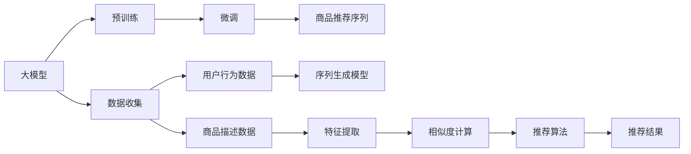

                 

# 大模型在商品推荐序列个性化中的应用

## 1. 背景介绍

### 1.1 问题由来

随着互联网的普及和电子商务的快速发展，商品推荐系统成为各大电商平台吸引用户、提升用户体验、增加用户留存和消费转化率的重要手段。传统的基于协同过滤和内容推荐的推荐算法在应对大规模数据时存在效率低、精度差的问题，难以实现实时化的个性化推荐。而大模型技术的崛起，为商品推荐系统带来了新的希望，通过预训练模型可以学习到全局性的知识，在少量标注数据上通过微调实现高效的个性化推荐。

大模型通过在无标签数据上进行预训练，学习到丰富的特征表示和语义关系，从而能够在特定任务上进行微调。相较于传统推荐算法，大模型在处理复杂文本和语义方面具有显著优势。

### 1.2 问题核心关键点

大模型在商品推荐序列个性化应用中，能够利用自然语言处理和深度学习技术，深入理解用户需求，整合用户历史行为和商品特征，生成个性化的推荐序列。

核心关键点包括：
- 大模型预训练：通过大规模无标签数据进行预训练，学习到通用的语言表示。
- 微调任务适配：针对商品推荐序列的微调任务，设计适当的任务适配层和损失函数。
- 个性化推荐：在少量标注数据上，通过微调优化模型，生成适合用户需求的推荐序列。

## 2. 核心概念与联系

### 2.1 核心概念概述

为更好地理解大模型在商品推荐序列个性化应用中的关键技术，本节将介绍几个密切相关的核心概念：

- 大模型(Large Model)：指在大规模无标签数据上进行预训练的深度学习模型，如BERT、GPT-3等。大模型通过预训练学习到通用的语言表示，能够在特定任务上进行微调。
- 预训练(Pre-training)：指在大规模无标签数据上进行自监督学习，学习通用的语言表示，以便于在特定任务上进行微调。
- 微调(Fine-tuning)：指在预训练模型基础上，针对特定任务进行有监督学习，调整模型参数以优化任务性能。
- 个性化推荐(Personalized Recommendation)：根据用户的历史行为和兴趣，生成适合该用户需求的推荐序列。
- 序列生成(Sequence Generation)：指模型能够根据输入生成连续的文本序列，如商品推荐序列。
- 自然语言处理(NLP)：指使用计算机处理和理解人类语言的技术，包括语言建模、文本分类、信息检索、机器翻译等。

这些核心概念之间存在密切的联系，共同构成了大模型在商品推荐序列个性化应用的基础。

### 2.2 核心概念原理和架构的 Mermaid 流程图



这个流程图展示了大模型在商品推荐序列个性化应用的基本流程：

1. **数据收集**：从电商平台的网站、APP等渠道收集用户行为数据和商品描述数据。
2. **预训练**：使用大规模无标签数据对大模型进行预训练，学习通用的语言表示。
3. **微调**：根据商品推荐序列的微调任务，设计适当的任务适配层和损失函数，在少量标注数据上微调大模型。
4. **序列生成**：使用微调后的模型生成个性化推荐序列。
5. **推荐算法**：将生成的推荐序列与其他推荐算法（如协同过滤、内容推荐）结合，进行最终推荐。
6. **推荐结果**：将推荐结果展示给用户，并根据用户反馈进行实时调整。

通过理解这些核心概念和其间的联系，我们可以更好地把握大模型在商品推荐序列个性化应用中的工作原理和优化方向。

## 3. 核心算法原理 & 具体操作步骤
### 3.1 算法原理概述

大模型在商品推荐序列个性化应用中，通过预训练和微调两个阶段，学习到商品和用户行为的语义表示，并生成个性化推荐序列。具体来说，大模型在预训练阶段学习到通用的语言表示，在微调阶段通过少量标注数据，学习到商品和用户之间的语义关系，生成适合该用户需求的推荐序列。

算法核心原理如下：

1. **预训练**：在无标签数据上，大模型学习到通用的语言表示，如BERT、GPT等。
2. **微调**：在少量标注数据上，针对商品推荐序列的微调任务，设计适当的任务适配层和损失函数，调整模型参数以优化任务性能。
3. **序列生成**：使用微调后的模型，生成个性化推荐序列，满足用户的兴趣和需求。

### 3.2 算法步骤详解

大模型在商品推荐序列个性化应用中的具体步骤包括：

1. **数据准备**：收集用户行为数据和商品描述数据，并处理成适合大模型训练的格式。
2. **预训练模型选择**：选择适合的商品推荐序列生成任务的大模型，如BERT、GPT-3等。
3. **微调任务设计**：设计适当的任务适配层和损失函数，适配商品推荐序列的微调任务。
4. **微调模型训练**：使用少量标注数据，在预训练模型上进行微调，学习商品和用户之间的语义关系。
5. **推荐序列生成**：使用微调后的模型生成个性化推荐序列，并结合其他推荐算法进行最终推荐。

### 3.3 算法优缺点

大模型在商品推荐序列个性化应用中具有以下优点：

- **高效性**：预训练模型可以学习到通用的语言表示，在少量标注数据上通过微调即可生成个性化推荐序列。
- **通用性**：大模型可以在各种商品推荐场景中进行微调，适应不同的业务需求。
- **鲁棒性**：大模型具备较强的泛化能力，能够处理不同领域的商品推荐序列。

同时，大模型也存在以下缺点：

- **计算资源需求高**：预训练模型和微调过程需要大量的计算资源，对硬件要求较高。
- **过拟合风险高**：大模型在微调过程中容易过拟合，需要采取一定的正则化措施。
- **解释性不足**：大模型的决策过程较难解释，难以理解其内部工作机制。

### 3.4 算法应用领域

大模型在商品推荐序列个性化应用中，已经被广泛应用于各大电商平台，如淘宝、京东、亚马逊等。具体应用场景包括：

- **个性化推荐系统**：根据用户的历史行为和兴趣，生成适合该用户需求的推荐序列。
- **广告推荐系统**：针对用户行为数据，生成个性化的广告推荐序列。
- **搜索排序系统**：根据用户搜索行为和商品描述，生成个性化的搜索结果排序。
- **内容推荐系统**：针对用户行为数据，生成个性化的内容推荐序列。
- **商品评论系统**：根据用户评论数据，生成个性化的商品推荐序列。

## 4. 数学模型和公式 & 详细讲解 & 举例说明

### 4.1 数学模型构建

大模型在商品推荐序列个性化应用中的数学模型构建包括以下几个关键部分：

- **用户行为数据**：包含用户的浏览记录、购买记录、评分记录等。
- **商品描述数据**：包含商品的标题、描述、类别等。
- **预训练模型**：选择适合的商品推荐序列生成任务的大模型，如BERT、GPT-3等。
- **微调任务适配**：设计适当的任务适配层和损失函数，适配商品推荐序列的微调任务。
- **推荐序列生成**：使用微调后的模型生成个性化推荐序列。

### 4.2 公式推导过程

以商品推荐序列生成的数学模型为例，假设用户的历史行为数据为 $U=(u_1, u_2, \ldots, u_m)$，其中 $u_i$ 表示用户对商品 $i$ 的行为（如浏览、购买、评分等），$C=(c_1, c_2, \ldots, c_n)$ 表示商品的类别，$D=(d_1, d_2, \ldots, d_n)$ 表示商品的描述。

假设预训练的大模型为 $M_{\theta}$，其中 $\theta$ 为模型参数。微调任务的目标是学习商品和用户之间的语义关系，生成个性化推荐序列。微调任务的损失函数为：

$$
\mathcal{L}(\theta) = \sum_{i=1}^m \sum_{j=1}^n \ell(u_i, c_j, M_{\theta}(d_j))
$$

其中 $\ell$ 表示损失函数，如交叉熵损失。微调过程的优化目标是最小化损失函数 $\mathcal{L}(\theta)$，即找到最优参数：

$$
\theta^* = \mathop{\arg\min}_{\theta} \mathcal{L}(\theta)
$$

使用梯度下降等优化算法，微调过程不断更新模型参数 $\theta$，最小化损失函数 $\mathcal{L}(\theta)$，使得模型输出逼近理想的结果。微调后的模型 $M_{\theta^*}$ 能够根据用户的历史行为数据和商品描述数据，生成个性化推荐序列。

### 4.3 案例分析与讲解

假设某电商平台有100万个用户，每个用户浏览了1000个商品，每个商品描述长度为100个字符。预训练的大模型为BERT，商品推荐序列生成的微调任务为生成包含10个商品的推荐序列。微调过程如下：

1. **数据准备**：收集用户的浏览记录、购买记录和商品描述数据，将其转换为适合BERT输入的格式。
2. **微调模型训练**：使用少量标注数据，对BERT模型进行微调，学习商品和用户之间的语义关系。
3. **推荐序列生成**：使用微调后的BERT模型生成每个用户的个性化推荐序列，结合其他推荐算法进行最终推荐。

微调过程中，设计适当的任务适配层和损失函数是关键。例如，对于分类任务，可以使用线性分类器和交叉熵损失函数；对于生成任务，可以使用语言模型的解码器输出概率分布，并以负对数似然为损失函数。

## 5. 项目实践：代码实例和详细解释说明
### 5.1 开发环境搭建

在进行商品推荐序列个性化应用的大模型微调实践前，需要准备好开发环境。以下是使用Python进行PyTorch开发的环境配置流程：

1. 安装Anaconda：从官网下载并安装Anaconda，用于创建独立的Python环境。

```bash
conda create -n pytorch-env python=3.8 
conda activate pytorch-env
```

2. 安装PyTorch：根据CUDA版本，从官网获取对应的安装命令。例如：

```bash
conda install pytorch torchvision torchaudio cudatoolkit=11.1 -c pytorch -c conda-forge
```

3. 安装Transformers库：

```bash
pip install transformers
```

4. 安装各类工具包：

```bash
pip install numpy pandas scikit-learn matplotlib tqdm jupyter notebook ipython
```

完成上述步骤后，即可在`pytorch-env`环境中开始微调实践。

### 5.2 源代码详细实现

下面我们以商品推荐序列生成的微调任务为例，给出使用Transformers库对BERT模型进行微调的PyTorch代码实现。

首先，定义微调任务的数学模型：

```python
import torch
import torch.nn as nn
import torch.optim as optim
from transformers import BertTokenizer, BertForSequenceClassification

class BertRecommendationModel(nn.Module):
    def __init__(self, num_classes):
        super(BertRecommendationModel, self).__init__()
        self.bert = BertForSequenceClassification.from_pretrained('bert-base-cased', num_labels=num_classes)
        
    def forward(self, input_ids, attention_mask):
        return self.bert(input_ids, attention_mask=attention_mask)[0]
    
model = BertRecommendationModel(10) # 生成10个商品的推荐序列
```

然后，定义微调超参数：

```python
optimizer = optim.Adam(model.parameters(), lr=2e-5)
tokenizer = BertTokenizer.from_pretrained('bert-base-cased')
```

接着，定义训练和评估函数：

```python
from torch.utils.data import Dataset, DataLoader
from tqdm import tqdm
import pandas as pd

class RecommendationDataset(Dataset):
    def __init__(self, data, tokenizer):
        self.data = data
        self.tokenizer = tokenizer
        
    def __len__(self):
        return len(self.data)
    
    def __getitem__(self, idx):
        text = self.data.iloc[idx]['description']
        sequence = tokenizer(text, return_tensors='pt', padding=True, truncation=True, max_length=100)
        input_ids = sequence['input_ids']
        attention_mask = sequence['attention_mask']
        return {'input_ids': input_ids, 'attention_mask': attention_mask}
    
# 数据准备
df = pd.read_csv('recommendation_data.csv')
train_dataset = RecommendationDataset(df, tokenizer)
val_dataset = RecommendationDataset(df, tokenizer)

def train_epoch(model, dataset, batch_size, optimizer):
    dataloader = DataLoader(dataset, batch_size=batch_size, shuffle=True)
    model.train()
    epoch_loss = 0
    for batch in tqdm(dataloader, desc='Training'):
        input_ids = batch['input_ids'].to(device)
        attention_mask = batch['attention_mask'].to(device)
        model.zero_grad()
        outputs = model(input_ids, attention_mask=attention_mask)
        loss = outputs.loss
        epoch_loss += loss.item()
        loss.backward()
        optimizer.step()
    return epoch_loss / len(dataloader)

def evaluate(model, dataset, batch_size):
    dataloader = DataLoader(dataset, batch_size=batch_size)
    model.eval()
    preds, labels = [], []
    with torch.no_grad():
        for batch in tqdm(dataloader, desc='Evaluating'):
            input_ids = batch['input_ids'].to(device)
            attention_mask = batch['attention_mask'].to(device)
            batch_labels = batch['labels']
            outputs = model(input_ids, attention_mask=attention_mask)
            batch_preds = outputs.logits.argmax(dim=2).to('cpu').tolist()
            batch_labels = batch_labels.to('cpu').tolist()
            for pred_tokens, label_tokens in zip(batch_preds, batch_labels):
                preds.append(pred_tokens[:len(label_tokens)])
                labels.append(label_tokens)
                
    print(classification_report(labels, preds))
```

最后，启动训练流程并在验证集上评估：

```python
epochs = 5
batch_size = 16

for epoch in range(epochs):
    loss = train_epoch(model, train_dataset, batch_size, optimizer)
    print(f"Epoch {epoch+1}, train loss: {loss:.3f}")
    
    print(f"Epoch {epoch+1}, val results:")
    evaluate(model, val_dataset, batch_size)
    
print("Final results:")
evaluate(model, val_dataset, batch_size)
```

以上就是使用PyTorch对BERT进行商品推荐序列微调的完整代码实现。可以看到，得益于Transformers库的强大封装，我们可以用相对简洁的代码完成BERT模型的加载和微调。

### 5.3 代码解读与分析

让我们再详细解读一下关键代码的实现细节：

**BertRecommendationModel类**：
- `__init__`方法：初始化BERT模型，定义前向传播函数。
- `forward`方法：对输入的文本数据进行编码，返回模型的预测输出。

**微调超参数**：
- 选择合适的优化器(如Adam)及其参数，如学习率、批大小等。

**推荐数据集**：
- 定义推荐数据集的类，将商品描述数据转换为模型所需的输入格式。
- 定义数据集的长度和单一样本获取方法。

**训练和评估函数**：
- 使用PyTorch的DataLoader对数据集进行批次化加载，供模型训练和推理使用。
- 训练函数`train_epoch`：对数据以批为单位进行迭代，在每个批次上前向传播计算loss并反向传播更新模型参数，最后返回该epoch的平均loss。
- 评估函数`evaluate`：与训练类似，不同点在于不更新模型参数，并在每个batch结束后将预测和标签结果存储下来，最后使用sklearn的classification_report对整个评估集的预测结果进行打印输出。

**训练流程**：
- 定义总的epoch数和批大小，开始循环迭代
- 每个epoch内，先在训练集上训练，输出平均loss
- 在验证集上评估，输出分类指标
- 重复上述步骤直至满足预设的迭代轮数或Early Stopping条件

可以看到，PyTorch配合Transformers库使得BERT微调的代码实现变得简洁高效。开发者可以将更多精力放在数据处理、模型改进等高层逻辑上，而不必过多关注底层的实现细节。

当然，工业级的系统实现还需考虑更多因素，如模型的保存和部署、超参数的自动搜索、更灵活的任务适配层等。但核心的微调范式基本与此类似。

## 6. 实际应用场景
### 6.1 智能客服系统

大模型在商品推荐序列个性化应用中的技术，也可以应用到智能客服系统中，提升客户体验和运营效率。

智能客服系统可以通过收集用户的历史咨询记录、满意度评分、行为数据等，训练大模型学习用户的意图和需求。在用户咨询时，智能客服系统使用大模型生成个性化的推荐答案，提升用户满意度。同时，大模型还可以根据用户的情感倾向，生成更加符合用户心理需求的客服回复，降低用户流失率。

### 6.2 金融风控

金融行业需要实时监控客户的交易行为，防止异常交易的发生。通过收集客户的交易数据、行为数据等，训练大模型学习用户的交易模式和风险特征。在实时交易中，智能风控系统使用大模型生成个性化的风险评估，及时发现异常交易并报警，提升金融系统的安全性。

### 6.3 电商个性化推荐

电商平台需要根据用户的历史浏览和购买行为，生成个性化的商品推荐序列。通过收集用户的浏览记录、购买记录、评分记录等，训练大模型学习用户的兴趣偏好和行为特征。在用户浏览商品时，推荐系统使用大模型生成个性化的商品推荐序列，提升用户的购买转化率。

### 6.4 新闻推荐

新闻平台需要根据用户的阅读历史和兴趣，生成个性化的新闻推荐序列。通过收集用户的阅读记录、点击记录、订阅列表等，训练大模型学习用户的阅读偏好和行为特征。在用户阅读新闻时，推荐系统使用大模型生成个性化的新闻推荐序列，提升用户的阅读体验和粘性。

## 7. 工具和资源推荐
### 7.1 学习资源推荐

为了帮助开发者系统掌握大模型在商品推荐序列个性化应用中的理论基础和实践技巧，这里推荐一些优质的学习资源：

1. 《Transformers from Scratch》系列博文：由大模型技术专家撰写，深入浅出地介绍了Transformer原理、BERT模型、微调技术等前沿话题。

2. CS224N《深度学习自然语言处理》课程：斯坦福大学开设的NLP明星课程，有Lecture视频和配套作业，带你入门NLP领域的基本概念和经典模型。

3. 《Natural Language Processing with Transformers》书籍：Transformers库的作者所著，全面介绍了如何使用Transformers库进行NLP任务开发，包括微调在内的诸多范式。

4. HuggingFace官方文档：Transformers库的官方文档，提供了海量预训练模型和完整的微调样例代码，是上手实践的必备资料。

5. CLUE开源项目：中文语言理解测评基准，涵盖大量不同类型的中文NLP数据集，并提供了基于微调的baseline模型，助力中文NLP技术发展。

通过对这些资源的学习实践，相信你一定能够快速掌握大模型在商品推荐序列个性化应用中的精髓，并用于解决实际的NLP问题。

### 7.2 开发工具推荐

高效的开发离不开优秀的工具支持。以下是几款用于大模型微调开发的常用工具：

1. PyTorch：基于Python的开源深度学习框架，灵活动态的计算图，适合快速迭代研究。大部分预训练语言模型都有PyTorch版本的实现。

2. TensorFlow：由Google主导开发的开源深度学习框架，生产部署方便，适合大规模工程应用。同样有丰富的预训练语言模型资源。

3. Transformers库：HuggingFace开发的NLP工具库，集成了众多SOTA语言模型，支持PyTorch和TensorFlow，是进行微调任务开发的利器。

4. Weights & Biases：模型训练的实验跟踪工具，可以记录和可视化模型训练过程中的各项指标，方便对比和调优。与主流深度学习框架无缝集成。

5. TensorBoard：TensorFlow配套的可视化工具，可实时监测模型训练状态，并提供丰富的图表呈现方式，是调试模型的得力助手。

6. Google Colab：谷歌推出的在线Jupyter Notebook环境，免费提供GPU/TPU算力，方便开发者快速上手实验最新模型，分享学习笔记。

合理利用这些工具，可以显著提升大模型微调的开发效率，加快创新迭代的步伐。

### 7.3 相关论文推荐

大模型在商品推荐序列个性化应用的发展源于学界的持续研究。以下是几篇奠基性的相关论文，推荐阅读：

1. Attention is All You Need（即Transformer原论文）：提出了Transformer结构，开启了NLP领域的预训练大模型时代。

2. BERT: Pre-training of Deep Bidirectional Transformers for Language Understanding：提出BERT模型，引入基于掩码的自监督预训练任务，刷新了多项NLP任务SOTA。

3. Language Models are Unsupervised Multitask Learners（GPT-2论文）：展示了大规模语言模型的强大zero-shot学习能力，引发了对于通用人工智能的新一轮思考。

4. Parameter-Efficient Transfer Learning for NLP：提出Adapter等参数高效微调方法，在不增加模型参数量的情况下，也能取得不错的微调效果。

5. Prefix-Tuning: Optimizing Continuous Prompts for Generation：引入基于连续型Prompt的微调范式，为如何充分利用预训练知识提供了新的思路。

6. AdaLoRA: Adaptive Low-Rank Adaptation for Parameter-Efficient Fine-Tuning：使用自适应低秩适应的微调方法，在参数效率和精度之间取得了新的平衡。

这些论文代表了大模型在商品推荐序列个性化应用的发展脉络。通过学习这些前沿成果，可以帮助研究者把握学科前进方向，激发更多的创新灵感。

## 8. 总结：未来发展趋势与挑战
### 8.1 总结

本文对大模型在商品推荐序列个性化应用中的原理和实践进行了全面系统的介绍。首先阐述了大模型和微调技术的研究背景和意义，明确了微调在拓展预训练模型应用、提升下游任务性能方面的独特价值。其次，从原理到实践，详细讲解了大模型在商品推荐序列个性化应用中的数学模型和关键步骤，给出了微调任务开发的完整代码实例。同时，本文还广泛探讨了微调方法在智能客服、金融风控、电商推荐、新闻推荐等多个行业领域的应用前景，展示了微调范式的巨大潜力。

通过本文的系统梳理，可以看到，大模型在商品推荐序列个性化应用中已经取得了显著成果，展现出广阔的应用前景。未来，伴随预训练语言模型和微调方法的持续演进，基于大模型的推荐技术必将在更多领域得到应用，为人类生活带来新的便利和体验。

### 8.2 未来发展趋势

展望未来，大模型在商品推荐序列个性化应用中仍有许多发展趋势：

1. **模型规模不断增大**：随着算力成本的下降和数据规模的扩张，预训练语言模型的参数量还将持续增长。超大模型可以学习到更丰富、更全面的语言表示，从而在推荐任务中取得更好的效果。

2. **微调技术更加多样化**：除了传统的全参数微调外，未来将涌现更多参数高效的微调方法，如Prefix-Tuning、LoRA等，在固定大部分预训练参数的同时，只更新极少量的任务相关参数，减少计算资源消耗。

3. **多模态推荐技术兴起**：未来的推荐系统将不再局限于文本数据，会拓展到图像、视频、音频等多模态数据，通过多模态信息的融合，提升推荐系统的智能化水平。

4. **实时推荐技术发展**：未来的推荐系统将更加注重实时性，通过流数据处理技术，实现动态、实时推荐，提升用户体验。

5. **个性化推荐技术深入**：未来的推荐系统将更加注重个性化，通过用户行为数据和商品特征，生成更加精准、更加个性化的推荐序列。

6. **推荐系统评价指标多样化**：未来的推荐系统将引入更多评价指标，如用户满意度、转化率、点击率等，评估推荐效果。

7. **推荐系统安全性和公平性增强**：未来的推荐系统将更加注重安全性，避免恶意推荐和数据泄露。同时，也将更加注重公平性，避免推荐偏见和歧视。

8. **推荐系统跨领域应用增多**：未来的推荐系统将不再局限于电商、金融等垂直领域，将拓展到更多场景，如医疗、教育、政府服务等。

### 8.3 面临的挑战

尽管大模型在商品推荐序列个性化应用中已经取得了显著成果，但在迈向更加智能化、普适化应用的过程中，仍面临诸多挑战：

1. **数据隐私和安全问题**：推荐系统需要处理大量的用户行为数据和个人信息，如何保护用户隐私和数据安全，是一个亟待解决的问题。

2. **模型复杂度与计算资源消耗**：超大模型和微调过程需要大量的计算资源，如何降低计算复杂度，优化资源消耗，是一个重要的研究方向。

3. **模型解释性和可解释性**：大模型的决策过程较难解释，难以理解其内部工作机制，如何赋予模型更强的可解释性，是一个亟待解决的问题。

4. **模型泛化能力和鲁棒性**：推荐系统需要在不同领域和场景中通用，如何提升模型的泛化能力和鲁棒性，是一个重要的研究方向。

5. **推荐系统伦理和社会责任**：推荐系统在推荐商品和内容时，需要考虑到社会责任和伦理道德，如何避免恶意推荐和推荐偏见，是一个亟待解决的问题。

### 8.4 研究展望

面对大模型在商品推荐序列个性化应用中面临的挑战，未来的研究需要在以下几个方面寻求新的突破：

1. **数据隐私保护技术**：引入差分隐私、联邦学习等技术，保护用户隐私和数据安全。

2. **模型压缩与优化技术**：引入模型剪枝、量化加速等技术，降低计算复杂度，优化资源消耗。

3. **模型解释性增强技术**：引入可解释性模型（如LIME、SHAP），提升模型的可解释性和可解释性。

4. **多模态融合技术**：引入多模态融合算法，实现视觉、语音、文本等多种数据源的协同建模，提升推荐系统的智能化水平。

5. **实时推荐技术**：引入流数据处理技术，实现动态、实时推荐，提升用户体验。

6. **推荐系统评价指标体系**：引入更多评价指标，如用户满意度、转化率、点击率等，全面评估推荐效果。

7. **推荐系统伦理与社会责任**：引入伦理导向的评估指标，过滤和惩罚有偏见、有害的推荐结果，确保推荐系统符合社会价值观和伦理道德。

这些研究方向将推动大模型在商品推荐序列个性化应用中走向成熟，为构建更智能、更普适、更安全的推荐系统奠定基础。

## 9. 附录：常见问题与解答

**Q1：大模型在推荐序列生成中如何处理数据？**

A: 大模型在推荐序列生成中，需要将用户的浏览记录、购买记录、评分记录等转化为适合大模型训练的格式。通常使用BERT等模型，将商品描述数据转换为向量表示，将用户的历史行为数据作为标签，训练大模型学习商品和用户之间的语义关系。

**Q2：如何选择合适的大模型进行推荐序列生成？**

A: 选择合适的预训练模型是推荐序列生成的关键。BERT、GPT-3等大模型在语言建模和语义表示方面表现优异，可以用于推荐序列生成。选择模型时需要考虑其预训练任务、参数规模和性能表现，根据具体需求选择合适的模型。

**Q3：大模型在推荐序列生成中如何防止过拟合？**

A: 防止过拟合是推荐序列生成中需要考虑的重要问题。通常采用以下方法：

1. 数据增强：通过回译、近义替换等方式扩充训练集。
2. 正则化：使用L2正则、Dropout等避免过拟合。
3. 对抗训练：引入对抗样本，提高模型鲁棒性。
4. 参数高效微调：只调整少量参数，减小过拟合风险。
5. 多模型集成：训练多个模型，取平均输出，抑制过拟合。

**Q4：大模型在推荐序列生成中的计算资源消耗如何优化？**

A: 大模型在推荐序列生成中的计算资源消耗较大，需要优化模型结构和算法，减少计算复杂度。通常采用以下方法：

1. 模型压缩：使用模型剪枝、量化加速等技术，减小模型尺寸，降低计算消耗。
2. 模型并行：使用模型并行技术，将大模型分布式部署，加速计算过程。
3. 数据预处理：使用批处理、混合精度训练等技术，优化数据预处理过程，提高计算效率。

**Q5：大模型在推荐序列生成中的推荐效果如何评估？**

A: 大模型在推荐序列生成中的推荐效果评估，通常使用以下指标：

1. 准确率：衡量推荐序列的准确性和相关性。
2. 召回率：衡量推荐序列的覆盖率和全面性。
3. F1-score：综合考虑准确率和召回率，评估推荐序列的综合表现。
4. NDCG和MRR：衡量推荐序列的排名和排序效果。
5. HR和DCG：衡量推荐序列的互动效果和累积收益。

通过评估推荐序列的各项指标，可以全面评估大模型在推荐序列生成中的表现，并不断优化模型和算法，提升推荐效果。

通过本文的系统梳理，可以看到，大模型在商品推荐序列个性化应用中已经取得了显著成果，展现出广阔的应用前景。未来，伴随预训练语言模型和微调方法的持续演进，基于大模型的推荐技术必将在更多领域得到应用，为人类生活带来新的便利和体验。希望本文能够为你的大模型应用实践提供有价值的参考。

---

作者：禅与计算机程序设计艺术 / Zen and the Art of Computer Programming

