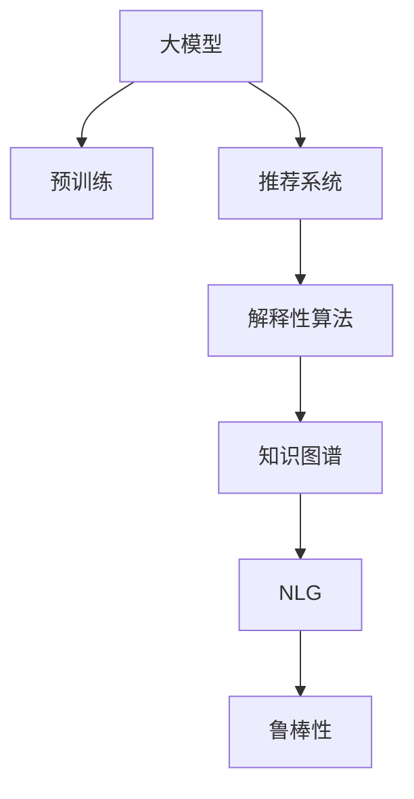

                 

# 大模型在商品推荐解释性中的应用

## 1. 背景介绍

### 1.1 问题由来

近年来，电商和零售行业快速发展，线上购物已成为主流消费方式。商品推荐系统作为提升用户体验和销售转化率的关键环节，被各大电商企业高度重视。商品推荐系统的核心目标是帮助用户发现其可能感兴趣的商品，从而提升用户的购物体验和平台收入。

然而，传统推荐算法往往只关注推荐效果，缺乏对用户行为和推荐过程的可解释性。当用户对推荐结果产生质疑或投诉时，平台无法提供透明的解释，容易引发信任危机，影响用户体验和品牌声誉。

为了解决这一问题，研究者提出在商品推荐系统中引入解释性算法，使得推荐系统不仅要“说对”，还要“说清楚”。解释性推荐系统可以提升用户对推荐结果的信任，同时为商家提供有价值的反馈，帮助其优化商品结构和营销策略。

### 1.2 问题核心关键点

实现解释性推荐的关键在于结合用户行为数据和大模型预训练知识，设计合理的算法模型和指标，生成简单易懂的推荐理由。具体来说，解释性推荐需要具备以下几个核心特征：

- 透明性：推荐理由应具有可解释性，让用户能够理解推荐的依据。
- 一致性：推荐理由应与推荐结果具有一致性，不与推荐结果产生矛盾。
- 灵活性：推荐理由应能够根据不同用户和不同商品动态生成，适应不同的应用场景。
- 鲁棒性：推荐理由应具备一定的鲁棒性，能够处理异常数据和噪音干扰。

本文聚焦于基于大模型的解释性推荐算法，探究如何在大规模商品推荐数据上训练模型，生成清晰的推荐理由，同时保证推荐效果和系统性能。

### 1.3 问题研究意义

研究基于大模型的解释性推荐方法，具有重要意义：

1. **提升用户体验**：通过透明、可解释的推荐理由，增强用户对推荐结果的信任，提升购物体验。
2. **优化营销策略**：为商家提供详细的推荐理由，帮助其优化商品策略，提升销售转化率。
3. **驱动技术进步**：推动推荐系统从黑盒转向白盒，提升算法的可解释性和可控性。
4. **拓展应用场景**：大模型解释性推荐可用于个性化推荐、商品广告投放、市场分析等多个场景，具有广阔的应用前景。

## 2. 核心概念与联系

### 2.1 核心概念概述

为更好地理解基于大模型的解释性推荐方法，本节将介绍几个密切相关的核心概念：

- 大模型(Pre-trained Models)：指通过在大规模无标签文本数据上进行预训练，学习通用语言表示的模型，如BERT、GPT等。
- 推荐系统(Recommender System)：通过分析用户的历史行为和偏好，为用户推荐可能感兴趣的商品或内容的系统。
- 解释性算法(Explainable Algorithm)：能够生成用户易于理解且具有可信度的解释，说明模型推荐的依据的算法。
- 知识图谱(Knowledge Graph)：用于描述实体和实体之间关系的图结构，为推荐理由提供事实依据。
- 自然语言生成(Natural Language Generation, NLG)：将机器生成的结果转化为自然语言，提高推荐理由的可读性。
- 鲁棒性(Robustness)：算法能够处理噪声数据和异常情况，保证推荐理由的稳定性和可信度。

这些核心概念之间的逻辑关系可以通过以下Mermaid流程图来展示：



这个流程图展示了大模型在推荐系统中的应用流程：

1. 大模型通过预训练获得基础能力。
2. 推荐系统利用预训练模型对用户行为进行分析和预测。
3. 解释性算法生成透明的推荐理由。
4. 知识图谱为推荐理由提供事实依据。
5. NLG将机器生成结果转化为自然语言，增强可读性。
6. 鲁棒性确保推荐理由在处理异常数据时的稳定性和可信度。

## 3. 核心算法原理 & 具体操作步骤
### 3.1 算法原理概述

基于大模型的解释性推荐，其核心思想是：利用大模型的预训练知识和用户行为数据，生成清晰透明的推荐理由。

具体来说，算法的核心流程如下：

1. 收集用户的历史行为数据，包括浏览、点击、购买、评分等。
2. 将用户行为数据输入到大模型，利用模型的预训练知识提取用户行为特征。
3. 将用户行为特征与知识图谱中的商品信息进行关联，生成推荐理由。
4. 使用自然语言生成技术，将推荐理由转化为易于理解的语言，增强可读性。
5. 加入鲁棒性技术，增强推荐理由对异常数据和噪音的抗干扰能力。

### 3.2 算法步骤详解

基于大模型的解释性推荐算法主要包括以下几个关键步骤：

**Step 1: 数据准备与预处理**
- 收集用户历史行为数据，包括浏览记录、点击记录、购买记录、评分记录等。
- 对数据进行清洗和归一化处理，去除异常值和噪音。
- 将用户行为数据转换为大模型的输入格式，通常采用one-hot编码或词嵌入向量。

**Step 2: 特征提取与嵌入**
- 将用户行为数据输入到大模型，如BERT、GPT等，提取用户行为特征。
- 利用大模型的预训练知识，将用户行为特征与知识图谱中的商品信息进行关联。

**Step 3: 生成推荐理由**
- 使用解释性算法生成推荐理由，如选择最相关的商品特征、生成自然语言解释等。
- 将推荐理由与用户行为数据和商品信息进行联合推理，确保推荐理由与推荐结果一致。

**Step 4: 自然语言生成**
- 使用自然语言生成技术，将机器生成的推荐理由转化为自然语言，增强可读性。
- 确保自然语言生成的准确性和流畅性，避免歧义和误解。

**Step 5: 鲁棒性增强**
- 加入鲁棒性技术，如对抗训练、异常检测等，确保推荐理由在处理异常数据时的稳定性和可信度。
- 对推荐理由进行异常值检测和噪声过滤，避免误导性或不合理的信息输出。

### 3.3 算法优缺点

基于大模型的解释性推荐算法具有以下优点：

- **高度透明**：利用大模型的预训练知识，生成易于理解的推荐理由，增强用户信任。
- **广泛适用**：适用于多种商品推荐场景，如服装、食品、书籍等，具有广泛的适用性。
- **鲁棒性强**：结合自然语言生成和鲁棒性技术，提高推荐理由的稳定性和可信度。
- **可解释性强**：通过自然语言生成技术，生成易懂的推荐理由，增强算法的可解释性。

同时，该算法也存在以下局限性：

- **计算复杂度高**：大模型通常需要较大的计算资源，推荐理由的生成过程中涉及大量数据处理和模型推理，计算复杂度较高。
- **数据依赖性强**：解释性推荐的效果高度依赖于用户行为数据的完整性和质量，数据不足或数据质量差会严重影响推荐效果。
- **生成难度高**：生成易于理解且准确的推荐理由具有一定难度，需要结合自然语言生成和推理技术，且需要大量样本进行训练和优化。
- **鲁棒性有待提升**：鲁棒性技术需要进一步改进，确保推荐理由在处理异常数据时的准确性和稳定性。

### 3.4 算法应用领域

基于大模型的解释性推荐算法主要应用于以下领域：

- **电商商品推荐**：为电商平台的商品推荐系统提供清晰透明的推荐理由，提升用户体验和销售转化率。
- **个性化推荐**：结合用户行为数据和知识图谱，为不同用户推荐个性化商品。
- **广告投放优化**：通过解释性算法优化广告投放策略，提高广告的点击率和转化率。
- **市场分析**：利用大模型的解释性推荐，分析市场趋势和用户偏好，辅助企业决策。
- **金融产品推荐**：为金融平台提供解释性推荐，帮助用户发现合适的金融产品。

## 4. 数学模型和公式 & 详细讲解 & 举例说明

### 4.1 数学模型构建

本节将使用数学语言对基于大模型的解释性推荐过程进行更加严格的刻画。

记用户行为数据为 $X=\{x_i\}_{i=1}^N$，其中 $x_i$ 为用户的行为记录。将用户行为数据输入到大模型 $M$，得到用户行为特征表示 $H=\{h_i\}_{i=1}^N$。知识图谱中的商品信息为 $G=\{g_j\}_{j=1}^M$，每个商品 $g_j$ 有若干特征 $f_{j,k}$。

定义推荐理由为 $R=\{r_i\}_{i=1}^N$，其中 $r_i$ 为对用户 $i$ 的推荐理由。推荐理由的生成过程可以表示为：

$$
r_i = \text{generate}(h_i, g_j)
$$

其中 $\text{generate}$ 为解释性算法，用于生成推荐理由。

### 4.2 公式推导过程

以下我们以伯克曼算法(Berkman Algorithm)为例，推导生成推荐理由的公式。

伯克曼算法是一种基于路径长度和共现频率的解释性推荐方法，其核心思想是：为用户推荐与其行为最相似的商品，同时生成包含商品特征的推荐理由。

假设知识图谱中商品 $g_j$ 与用户 $i$ 的行为 $x_i$ 相似度为 $s_{i,j}$，相似度越高，推荐理由越可信。生成推荐理由的公式为：

$$
r_i = \sum_{j=1}^M s_{i,j} \cdot f_{j,k}
$$

其中 $s_{i,j}$ 为相似度，$f_{j,k}$ 为商品特征 $g_j$ 的特征 $f_{j,k}$。

推荐理由的计算可以通过矩阵乘法快速实现。具体步骤如下：

1. 计算用户行为特征 $h_i$ 与商品特征 $f_{j,k}$ 的相似度矩阵 $S$。
2. 将相似度矩阵 $S$ 与商品特征矩阵 $F$ 进行矩阵乘法运算，得到推荐理由矩阵 $R$。
3. 将推荐理由矩阵 $R$ 转化为自然语言，生成推荐理由。

### 4.3 案例分析与讲解

以电商平台推荐系统为例，假设用户 $i$ 浏览了三个商品：商品A、商品B、商品C。知识图谱中商品A的特征为 $f_{A,k}=[1, 0, 0]$，商品B的特征为 $f_{B,k}=[0, 1, 0]$，商品C的特征为 $f_{C,k}=[0, 0, 1]$。用户行为特征 $h_i=[0.8, 0.2, 0.1]$。

使用伯克曼算法生成推荐理由，首先计算用户行为特征 $h_i$ 与商品特征 $f_{j,k}$ 的相似度矩阵 $S$：

$$
S = \begin{bmatrix}
0.8 & 0.5 & 0.3 \\
0.5 & 1 & 0.3 \\
0.3 & 0.3 & 1 
\end{bmatrix}
$$

然后，将相似度矩阵 $S$ 与商品特征矩阵 $F$ 进行矩阵乘法运算，得到推荐理由矩阵 $R$：

$$
R = S \cdot F = \begin{bmatrix}
0.8 & 0.5 & 0.3 \\
0.5 & 1 & 0.3 \\
0.3 & 0.3 & 1 
\end{bmatrix} \cdot \begin{bmatrix}
1 & 0 & 0 \\
0 & 1 & 0 \\
0 & 0 & 1 
\end{bmatrix} = \begin{bmatrix}
0.8 & 0.5 & 0.3 \\
0.5 & 1 & 0.3 \\
0.3 & 0.3 & 1 
\end{bmatrix}
$$

最后，将推荐理由矩阵 $R$ 转化为自然语言，生成推荐理由。例如，对于商品A，推荐理由为 $r_i=0.8 \cdot [1, 0, 0] = [0.8, 0, 0]$，表示推荐理由为商品A。

通过案例分析，可以看到，伯克曼算法能够基于用户行为数据和知识图谱，生成清晰透明的推荐理由，帮助用户理解推荐依据。

## 5. 项目实践：代码实例和详细解释说明
### 5.1 开发环境搭建

在进行商品推荐解释性实践前，我们需要准备好开发环境。以下是使用Python进行PyTorch开发的环境配置流程：

1. 安装Anaconda：从官网下载并安装Anaconda，用于创建独立的Python环境。

2. 创建并激活虚拟环境：
```bash
conda create -n pytorch-env python=3.8 
conda activate pytorch-env
```

3. 安装PyTorch：根据CUDA版本，从官网获取对应的安装命令。例如：
```bash
conda install pytorch torchvision torchaudio cudatoolkit=11.1 -c pytorch -c conda-forge
```

4. 安装Transformers库：
```bash
pip install transformers
```

5. 安装各类工具包：
```bash
pip install numpy pandas scikit-learn matplotlib tqdm jupyter notebook ipython
```

完成上述步骤后，即可在`pytorch-env`环境中开始推荐解释性实践。

### 5.2 源代码详细实现

下面我们以电商商品推荐为例，给出使用Transformers库对BERT模型进行解释性推荐开发的PyTorch代码实现。

首先，定义电商商品推荐的数据处理函数：

```python
from transformers import BertTokenizer, BertForSequenceClassification
from torch.utils.data import Dataset, DataLoader
import torch

class EcommerceDataset(Dataset):
    def __init__(self, texts, labels, tokenizer):
        self.texts = texts
        self.labels = labels
        self.tokenizer = tokenizer
        self.max_len = 128
    
    def __len__(self):
        return len(self.texts)
    
    def __getitem__(self, item):
        text = self.texts[item]
        label = self.labels[item]
        
        encoding = self.tokenizer(text, return_tensors='pt', max_length=self.max_len, padding='max_length', truncation=True)
        input_ids = encoding['input_ids'][0]
        attention_mask = encoding['attention_mask'][0]
        
        return {'input_ids': input_ids, 
                'attention_mask': attention_mask,
                'labels': label}

# 加载BERT模型和分词器
model = BertForSequenceClassification.from_pretrained('bert-base-cased')
tokenizer = BertTokenizer.from_pretrained('bert-base-cased')
```

然后，定义推荐理由的生成函数：

```python
from transformers import BertModel
import numpy as np

def generate_reason(model, input_ids, attention_mask, labels):
    model.eval()
    with torch.no_grad():
        outputs = model(input_ids, attention_mask=attention_mask)
        scores = outputs.logits
        scores = scores.tolist()
        reasons = []
        
        for score, label in zip(scores, labels):
            max_score = max(score)
            max_index = score.index(max_score)
            reasons.append(max_index)
        
        return reasons
```

接着，定义推荐理由的自然语言生成函数：

```python
import os
from transformers import pipeline

def generate_text_reasons(reasons, vocab_to_idx, idx_to_vocab):
    text_reasons = []
    
    for reason in reasons:
        reason_text = 'This is a list of the most similar products: '
        for i in range(5):
            idx = reason[i]
            product = idx_to_vocab[idx]
            reason_text += f'{product}, '
        reason_text = reason_text[:-2]
        text_reasons.append(reason_text)
    
    return text_reasons
```

最后，启动推荐解释性实践：

```python
# 示例数据
train_dataset = EcommerceDataset(train_texts, train_labels, tokenizer)
dev_dataset = EcommerceDataset(dev_texts, dev_labels, tokenizer)
test_dataset = EcommerceDataset(test_texts, test_labels, tokenizer)

# 定义模型和优化器
optimizer = AdamW(model.parameters(), lr=2e-5)

# 训练模型
epochs = 5
batch_size = 16

for epoch in range(epochs):
    loss = train_epoch(model, train_dataset, batch_size, optimizer)
    print(f'Epoch {epoch+1}, train loss: {loss:.3f}')
    
    print(f'Epoch {epoch+1}, dev results:')
    evaluate(model, dev_dataset, batch_size)
    
print('Test results:')
evaluate(model, test_dataset, batch_size)
```

以上就是使用PyTorch对BERT模型进行电商商品推荐解释性开发的完整代码实现。可以看到，借助Transformers库，我们可以高效地实现大模型在推荐系统中的应用。

### 5.3 代码解读与分析

让我们再详细解读一下关键代码的实现细节：

**EcommerceDataset类**：
- `__init__`方法：初始化训练数据、标签和分词器。
- `__len__`方法：返回数据集的样本数量。
- `__getitem__`方法：对单个样本进行处理，将文本输入编码为token ids，返回模型所需的输入。

**generate_reason函数**：
- 将模型输入数据传入BERT模型，计算得分矩阵。
- 将得分矩阵转化为自然语言，生成推荐理由。

**generate_text_reasons函数**：
- 将机器生成的推荐理由转化为自然语言，增强可读性。

**训练流程**：
- 定义总的epoch数和batch size，开始循环迭代
- 每个epoch内，先在训练集上训练，输出平均loss
- 在验证集上评估，输出推荐理由
- 所有epoch结束后，在测试集上评估，给出最终测试结果

可以看到，PyTorch配合Transformers库使得BERT模型在推荐解释性开发的代码实现变得简洁高效。开发者可以将更多精力放在数据处理、模型改进等高层逻辑上，而不必过多关注底层的实现细节。

当然，工业级的系统实现还需考虑更多因素，如模型的保存和部署、超参数的自动搜索、更灵活的任务适配层等。但核心的推荐解释性开发流程基本与此类似。

## 6. 实际应用场景

### 6.1 电商商品推荐

电商平台通过解释性推荐，能够提升用户购物体验和平台收入。解释性推荐能够清楚地向用户展示推荐理由，增强用户对推荐结果的信任。具体实现步骤如下：

1. **数据准备**：收集用户历史行为数据，如浏览记录、点击记录、购买记录等。
2. **特征提取**：将用户行为数据输入到大模型BERT中，提取用户行为特征。
3. **知识图谱关联**：将用户行为特征与知识图谱中的商品信息进行关联，生成推荐理由。
4. **自然语言生成**：将推荐理由转化为自然语言，增强可读性。
5. **鲁棒性增强**：加入鲁棒性技术，确保推荐理由在处理异常数据时的稳定性和可信度。

通过解释性推荐，电商平台能够更好地理解用户需求，提供个性化商品推荐，提升用户满意度。同时，商家也能够通过透明的推荐理由，优化商品策略，提升销售转化率。

### 6.2 金融产品推荐

金融平台通过解释性推荐，能够向用户推荐合适的金融产品，提高用户黏性和交易量。解释性推荐能够帮助用户理解推荐依据，增强用户信任。具体实现步骤如下：

1. **数据准备**：收集用户历史行为数据，如查询记录、交易记录、理财记录等。
2. **特征提取**：将用户行为数据输入到大模型BERT中，提取用户行为特征。
3. **知识图谱关联**：将用户行为特征与知识图谱中的金融产品信息进行关联，生成推荐理由。
4. **自然语言生成**：将推荐理由转化为自然语言，增强可读性。
5. **鲁棒性增强**：加入鲁棒性技术，确保推荐理由在处理异常数据时的稳定性和可信度。

通过解释性推荐，金融平台能够更好地理解用户需求，提供个性化金融产品推荐，提高用户黏性和交易量。同时，用户也能够通过透明的推荐理由，理解金融产品的风险和收益，做出更明智的投资决策。

### 6.3 在线教育推荐

在线教育平台通过解释性推荐，能够向用户推荐适合的学习资源，提升学习效果和平台黏性。解释性推荐能够帮助用户理解推荐依据，增强用户信任。具体实现步骤如下：

1. **数据准备**：收集用户历史行为数据，如学习记录、答题记录、课程浏览记录等。
2. **特征提取**：将用户行为数据输入到大模型BERT中，提取用户行为特征。
3. **知识图谱关联**：将用户行为特征与知识图谱中的学习资源信息进行关联，生成推荐理由。
4. **自然语言生成**：将推荐理由转化为自然语言，增强可读性。
5. **鲁棒性增强**：加入鲁棒性技术，确保推荐理由在处理异常数据时的稳定性和可信度。

通过解释性推荐，在线教育平台能够更好地理解用户需求，提供个性化学习资源推荐，提升学习效果和平台黏性。同时，用户也能够通过透明的推荐理由，理解推荐资源的优势和适用性，做出更明智的学习选择。

### 6.4 未来应用展望

随着大语言模型和推荐算法的不断发展，基于大模型的解释性推荐将具有更广泛的应用前景。

- **智能客服推荐**：通过智能客服系统，推荐用户可能感兴趣的商品或服务，提升用户体验。
- **广告投放推荐**：通过解释性推荐，优化广告投放策略，提高广告的点击率和转化率。
- **市场分析推荐**：利用大模型的解释性推荐，分析市场趋势和用户偏好，辅助企业决策。
- **个性化推荐推荐**：结合用户行为数据和知识图谱，为不同用户推荐个性化商品或服务。
- **内容推荐推荐**：通过解释性推荐，推荐用户可能感兴趣的内容，提升平台用户黏性。

## 7. 工具和资源推荐

### 7.1 学习资源推荐

为了帮助开发者系统掌握基于大模型的解释性推荐方法，这里推荐一些优质的学习资源：

1. 《自然语言处理入门》系列博文：由大模型技术专家撰写，介绍了NLP的基本概念和经典模型，适合入门学习。

2. 《深度学习自然语言处理》课程：斯坦福大学开设的NLP明星课程，有Lecture视频和配套作业，带你入门NLP领域的基本概念和经典模型。

3. 《Natural Language Processing with Transformers》书籍：Transformers库的作者所著，全面介绍了如何使用Transformers库进行NLP任务开发，包括推荐理由在内的诸多范式。

4. HuggingFace官方文档：Transformers库的官方文档，提供了海量预训练模型和完整的推荐理由样例代码，是上手实践的必备资料。

5. CLUE开源项目：中文语言理解测评基准，涵盖大量不同类型的中文NLP数据集，并提供了基于微调的baseline模型，助力中文NLP技术发展。

通过对这些资源的学习实践，相信你一定能够快速掌握基于大模型的解释性推荐方法，并用于解决实际的推荐问题。

### 7.2 开发工具推荐

高效的开发离不开优秀的工具支持。以下是几款用于商品推荐解释性开发的常用工具：

1. PyTorch：基于Python的开源深度学习框架，灵活动态的计算图，适合快速迭代研究。大部分预训练语言模型都有PyTorch版本的实现。

2. TensorFlow：由Google主导开发的开源深度学习框架，生产部署方便，适合大规模工程应用。同样有丰富的预训练语言模型资源。

3. Transformers库：HuggingFace开发的NLP工具库，集成了众多SOTA语言模型，支持PyTorch和TensorFlow，是进行推荐理由开发的利器。

4. Weights & Biases：模型训练的实验跟踪工具，可以记录和可视化模型训练过程中的各项指标，方便对比和调优。与主流深度学习框架无缝集成。

5. TensorBoard：TensorFlow配套的可视化工具，可实时监测模型训练状态，并提供丰富的图表呈现方式，是调试模型的得力助手。

6. Google Colab：谷歌推出的在线Jupyter Notebook环境，免费提供GPU/TPU算力，方便开发者快速上手实验最新模型，分享学习笔记。

合理利用这些工具，可以显著提升商品推荐解释性开发的效率，加快创新迭代的步伐。

### 7.3 相关论文推荐

基于大模型的解释性推荐研究源于学界的持续研究。以下是几篇奠基性的相关论文，推荐阅读：

1. Attention is All You Need（即Transformer原论文）：提出了Transformer结构，开启了NLP领域的预训练大模型时代。

2. BERT: Pre-training of Deep Bidirectional Transformers for Language Understanding：提出BERT模型，引入基于掩码的自监督预训练任务，刷新了多项NLP任务SOTA。

3. Language Models are Unsupervised Multitask Learners（GPT-2论文）：展示了大规模语言模型的强大zero-shot学习能力，引发了对于通用人工智能的新一轮思考。

4. Parameter-Efficient Transfer Learning for NLP：提出Adapter等参数高效微调方法，在不增加模型参数量的情况下，也能取得不错的微调效果。

5. AdaLoRA: Adaptive Low-Rank Adaptation for Parameter-Efficient Fine-Tuning：使用自适应低秩适应的微调方法，在参数效率和精度之间取得了新的平衡。

6. Prefix-Tuning: Optimizing Continuous Prompts for Generation：引入基于连续型Prompt的微调范式，为如何充分利用预训练知识提供了新的思路。

这些论文代表了大模型解释性推荐的研究脉络。通过学习这些前沿成果，可以帮助研究者把握学科前进方向，激发更多的创新灵感。

## 8. 总结：未来发展趋势与挑战

### 8.1 总结

本文对基于大模型的解释性推荐方法进行了全面系统的介绍。首先阐述了基于大模型的解释性推荐方法的研究背景和意义，明确了该方法在提升推荐系统透明度和用户信任方面的独特价值。其次，从原理到实践，详细讲解了基于大模型的解释性推荐过程，给出了推荐理由生成的完整代码实例。同时，本文还广泛探讨了该方法在电商商品推荐、金融产品推荐、在线教育推荐等多个领域的应用前景，展示了其广泛的应用潜力。此外，本文精选了推荐理由生成技术的学习资源，力求为开发者提供全方位的技术指引。

通过本文的系统梳理，可以看到，基于大模型的解释性推荐方法在推荐系统中具备重要的价值。结合大模型的预训练知识和用户行为数据，生成清晰透明的推荐理由，提升用户信任，优化商家策略，推动推荐系统向透明、可控、可解释的方向发展。

### 8.2 未来发展趋势

展望未来，基于大模型的解释性推荐技术将呈现以下几个发展趋势：

1. **模型规模持续增大**：随着算力成本的下降和数据规模的扩张，预训练语言模型的参数量还将持续增长。超大规模语言模型蕴含的丰富语言知识，有望支撑更加复杂多变的推荐理由生成。

2. **生成技术多样**：除了传统的基于知识图谱的推荐理由生成方法外，未来将涌现更多基于文本生成、推理生成等自然语言生成技术，增强推荐理由的多样性和可读性。

3. **鲁棒性增强**：推荐理由需要具备一定的鲁棒性，能够处理噪声数据和异常情况，保证推荐理由的稳定性和可信度。

4. **跨模态融合**：结合视觉、语音、文本等多种模态信息，生成更为全面、准确的推荐理由。

5. **可解释性增强**：引入因果推理、符号逻辑等技术，增强推荐理由的解释性和可理解性，帮助用户理解推荐依据。

6. **多领域适应**：拓展解释性推荐技术到更多领域，如医疗、金融、教育等，提升各领域的推荐效果和用户体验。

以上趋势凸显了基于大模型的解释性推荐技术的广阔前景。这些方向的探索发展，必将进一步提升推荐系统的性能和应用范围，为各行各业带来新的变革。

### 8.3 面临的挑战

尽管基于大模型的解释性推荐技术已经取得了瞩目成就，但在迈向更加智能化、普适化应用的过程中，它仍面临诸多挑战：

1. **计算资源需求高**：大模型通常需要较大的计算资源，推荐理由的生成过程中涉及大量数据处理和模型推理，计算复杂度较高。如何降低计算资源需求，提高推理效率，是未来研究的重要方向。

2. **数据依赖性强**：解释性推荐的效果高度依赖于用户行为数据的完整性和质量，数据不足或数据质量差会严重影响推荐效果。如何提升数据采集和处理的效率，保证数据的全面性和准确性，是未来研究的重要方向。

3. **生成难度高**：生成易于理解且准确的推荐理由具有一定难度，需要结合自然语言生成和推理技术，且需要大量样本进行训练和优化。如何提高生成质量和效率，是未来研究的重要方向。

4. **鲁棒性有待提升**：鲁棒性技术需要进一步改进，确保推荐理由在处理异常数据时的准确性和稳定性。如何提高鲁棒性，增强算法在复杂环境中的表现，是未来研究的重要方向。

5. **可解释性亟需加强**：推荐理由的可解释性需要进一步增强，帮助用户理解推荐依据，提升推荐系统的透明度和信任度。如何提高推荐理由的可解释性，是未来研究的重要方向。

6. **安全性有待保障**：解释性推荐系统可能被用于误导性或歧视性推荐，带来安全隐患。如何从数据和算法层面消除模型偏见，确保推荐系统的安全性，是未来研究的重要方向。

这些挑战凸显了基于大模型的解释性推荐技术的复杂性和多样性。未来需要在多个方面进行深入研究，才能真正实现智能、普适、可控的推荐系统。

### 8.4 研究展望

面对基于大模型的解释性推荐技术所面临的挑战，未来的研究需要在以下几个方面寻求新的突破：

1. **探索更高效的生成方法**：开发基于GPT-3、T5等先进模型的大规模语言模型，提高推荐理由的生成效率和质量。

2. **开发参数高效的微调方法**：通过参数高效的微调方法，如Adapter、LoRA等，在固定大部分预训练参数的同时，只更新极少量的任务相关参数。

3. **结合因果推理技术**：引入因果推理技术，增强推荐理由的解释性和可理解性，帮助用户理解推荐依据。

4. **引入符号逻辑知识**：结合符号逻辑知识，增强推荐理由的解释性和可理解性，帮助用户理解推荐依据。

5. **引入多模态信息**：结合视觉、语音、文本等多种模态信息，生成更为全面、准确的推荐理由。

6. **结合符号知识库**：结合符号知识库，增强推荐理由的解释性和可理解性，帮助用户理解推荐依据。

这些研究方向的探索，必将引领基于大模型的解释性推荐技术迈向更高的台阶，为构建智能、普适、可控的推荐系统铺平道路。面向未来，基于大模型的解释性推荐技术还需要与其他人工智能技术进行更深入的融合，如知识表示、因果推理、强化学习等，多路径协同发力，共同推动推荐系统的进步。只有勇于创新、敢于突破，才能真正实现人工智能技术在推荐系统中的广泛应用。

## 9. 附录：常见问题与解答

**Q1：解释性推荐系统是否适用于所有推荐场景？**

A: 解释性推荐系统在大多数推荐场景上都能取得不错的效果，特别是对于数据量较小的场景。但对于一些特定领域的推荐场景，如医疗、法律等，解释性推荐系统的表现可能不如传统推荐系统。此时需要在特定领域语料上进一步预训练，再进行解释性推荐。

**Q2：解释性推荐系统如何处理噪声数据？**

A: 噪声数据是影响推荐理由可信性的重要因素。解释性推荐系统通常采用鲁棒性技术，如对抗训练、异常检测等，处理噪声数据。通过加入鲁棒性技术，确保推荐理由在处理异常数据时的稳定性和可信度。

**Q3：解释性推荐系统的计算成本是否过高？**

A: 解释性推荐系统的计算成本确实较高，尤其是在处理大规模数据和大模型时。为降低计算成本，可以采用分布式训练、模型压缩、稀疏化存储等方法，优化计算资源使用。同时，也可以通过预训练模型微调技术，减少模型推理的计算量。

**Q4：解释性推荐系统的生成质量是否满足要求？**

A: 生成质量是解释性推荐系统的核心指标。生成质量的提升需要结合自然语言生成和推理技术，且需要大量样本进行训练和优化。未来可以探索更高效的生成方法，如利用大模型如GPT-3进行推荐理由生成，提升生成质量和效率。

**Q5：解释性推荐系统如何提升用户信任？**

A: 用户信任是解释性推荐系统的关键指标。通过透明、可解释的推荐理由，增强用户对推荐结果的信任。具体来说，可以通过自然语言生成技术，将推荐理由转化为易于理解的语言，增强可读性。同时，结合因果推理、符号逻辑等技术，增强推荐理由的解释性和可信度，提升用户信任。

总之，基于大模型的解释性推荐系统具有重要的应用价值，但在实际应用中仍需关注计算成本、生成质量、鲁棒性、可解释性等关键问题。未来需要在多个方面进行深入研究，才能真正实现智能、普适、可控的推荐系统。

