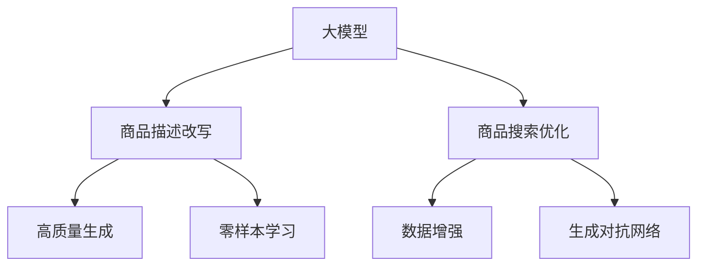

                 

# 大模型在商品描述改写与优化中的应用

> 关键词：大模型,商品描述改写,自然语言处理(NLP),商品搜索优化,数据增强,生成对抗网络(GAN),零样本学习

## 1. 背景介绍

在当今电商和零售行业，商品描述的准确性、吸引力和独特性是决定消费者购买决策的关键因素。随着AI和大数据技术的发展，商家和平台开始利用先进的技术手段优化商品描述，提升用户转化率和销量。其中，大模型在商品描述改写与优化中起到了关键作用，极大地提升了商品描述的精准性和吸引力。

### 1.1 问题由来

商品描述的撰写和优化通常需要耗费大量时间和人力，且效果难以保证。传统的文本编辑方法依赖于人工编写，速度慢、成本高，且容易受限于作者的表达能力和知识范围。而大模型，尤其是预训练语言模型，能够在无监督学习中获得丰富的语言知识，为商品描述改写与优化提供了全新的解决方案。

### 1.2 问题核心关键点

大模型在商品描述改写与优化中的应用主要体现在以下几个方面：

- 自动化改写：利用大模型的预训练能力和微调技术，自动将原始商品描述改写为新的、更加吸引人的描述。
- 多语言支持：大模型可以处理多种语言，为多语言市场提供更广泛的应用。
- 高质量生成：大模型生成的描述更加符合语言习惯和用户偏好，具有更高的质量和独特性。
- 动态优化：根据用户反馈和新数据，动态更新商品描述，持续优化商品搜索效果。

### 1.3 问题研究意义

大模型在商品描述改写与优化中的应用，不仅提升了商品描述的质量和效果，也显著降低了商家和平台在内容创作上的时间和成本，使得更多的资源可以投入到其他业务上，从而提升整体运营效率和盈利能力。此外，这种技术创新还推动了NLP领域的进步，促进了人工智能技术在实际应用中的普及和落地。

## 2. 核心概念与联系

### 2.1 核心概念概述

本节将介绍几个与大模型在商品描述改写与优化中应用相关的核心概念：

- 大模型(Large Model)：指通过大规模数据训练得到的深度神经网络模型，如BERT、GPT等，能够处理自然语言、图像等多种类型的数据。
- 商品描述(Product Description)：指对商品特性、功能、使用方法等信息的文本描述，用于帮助消费者更好地理解商品并进行购买决策。
- 改写与优化(Rewriting and Optimization)：通过自然语言处理技术，对原始商品描述进行改写和优化，提升其吸引力和效果。
- 商品搜索(Product Search)：指根据用户输入的查询词，从商品数据库中检索出符合要求的商品，并展示给用户的过程。

这些概念之间的逻辑关系可以通过以下Mermaid流程图来展示：



这个流程图展示了大模型在商品描述改写与优化中的核心概念及其之间的关系：

1. 大模型作为基础工具，用于商品描述改写和搜索优化。
2. 商品描述改写通过微调大模型进行，生成高质量的描述。
3. 商品搜索优化利用改写后的商品描述，提高搜索效果。
4. 数据增强和生成对抗网络进一步提升改写和优化的效果。
5. 零样本学习在没有标注数据的情况下，也能生成合理的商品描述。

这些概念共同构成了大模型在商品描述改写与优化中的应用框架，使其能够更加精准和高效地生成商品描述，提升用户搜索体验和转化率。

## 3. 核心算法原理 & 具体操作步骤
### 3.1 算法原理概述

基于大模型的商品描述改写与优化方法主要包括以下几个步骤：

1. 选择合适的预训练模型作为初始化参数，如BERT、GPT等。
2. 收集商品描述数据，并对数据进行预处理和标注。
3. 在预训练模型的基础上，设计合适的任务适配层和损失函数。
4. 使用优化算法和超参数设置，对模型进行微调训练。
5. 将微调后的模型应用于商品描述改写和优化，生成高质量的描述。

### 3.2 算法步骤详解

以下是商品描述改写与优化的详细步骤：

#### 3.2.1 数据收集与预处理

- 收集商品描述数据：从电商平台、社交媒体等渠道收集商品描述，作为模型训练的数据源。
- 数据预处理：清洗数据，去除噪声和错误信息，标准化数据格式，如统一商品分类和编码。

#### 3.2.2 任务适配层设计

- 根据任务需求，设计任务适配层：商品描述改写通常需要输出语句通顺、语法正确的文本；商品搜索优化需要输出具有关键词和排序信息的文本。
- 选择合适的损失函数：改写任务可以使用BLEU、ROUGE等文本相似度指标；优化任务可以使用CTR点击率、IR召回率等指标。

#### 3.2.3 模型微调

- 选择合适的优化算法和超参数设置，如Adam、SGD等，设置学习率、批大小、迭代轮数等。
- 添加正则化技术，如L2正则、Dropout、Early Stopping等，防止模型过拟合。
- 设计数据增强和对抗训练策略，提高模型鲁棒性和泛化能力。
- 使用提示学习(Prompt Learning)技术，引导模型生成符合预期的商品描述。

#### 3.2.4 生成与优化

- 应用微调后的模型生成商品描述：根据输入的商品信息，输出新的、更加吸引人的商品描述。
- 优化商品搜索效果：将改写后的商品描述应用到商品搜索算法中，提升搜索的相关性和准确性。

### 3.3 算法优缺点

大模型在商品描述改写与优化中的应用，具有以下优点：

- 自动化程度高：自动化改写和优化，减少了人工干预。
- 生成质量高：利用大模型的语言理解和生成能力，生成高质量的描述。
- 泛化能力强：在不同类型的商品描述上都有良好的表现。
- 可扩展性好：模型可应用于多种语言和多个市场。

同时，该方法也存在一些缺点：

- 数据依赖性高：改写和优化效果依赖于高质量的商品描述数据。
- 计算成本高：大模型的训练和微调需要大量计算资源和标注数据。
- 隐私风险：使用用户数据进行模型训练时，需要注意隐私保护和数据安全。
- 模型依赖性强：模型效果依赖于大模型的质量和预训练能力。

尽管存在这些局限性，但就目前而言，基于大模型的商品描述改写与优化方法仍是最先进的技术手段之一，能够显著提升商品描述的吸引力和效果，促进电商平台的运营效率。

### 3.4 算法应用领域

大模型在商品描述改写与优化中的应用，已经广泛应用于各大电商和零售平台，如亚马逊、淘宝、京东等。以下是一些主要的应用领域：

- 商品详情页优化：对商品的图片、功能描述等进行自动改写，提升页面吸引力。
- 商品推荐系统：根据用户行为和偏好，自动生成商品推荐描述，提高转化率。
- 搜索排序优化：优化商品搜索算法，提高搜索结果的相关性和用户满意度。
- 广告文案生成：自动生成具有吸引力的广告文案，提升广告点击率。
- 多语言支持：利用大模型的多语言处理能力，为全球市场提供本地化的商品描述。

这些应用领域展示了大模型在商品描述改写与优化中的广泛适用性，为电商平台的运营和用户体验带来了显著的提升。

## 4. 数学模型和公式 & 详细讲解  
### 4.1 数学模型构建

本节将使用数学语言对基于大模型的商品描述改写与优化过程进行更加严格的刻画。

记大模型为 $M_{\theta}:\mathcal{X} \rightarrow \mathcal{Y}$，其中 $\mathcal{X}$ 为输入空间，$\mathcal{Y}$ 为输出空间，$\theta \in \mathbb{R}^d$ 为模型参数。假设商品描述数据集为 $D=\{(x_i,y_i)\}_{i=1}^N, x_i \in \mathcal{X}, y_i \in \mathcal{Y}$。

定义模型 $M_{\theta}$ 在数据样本 $(x,y)$ 上的损失函数为 $\ell(M_{\theta}(x),y)$，则在数据集 $D$ 上的经验风险为：

$$
\mathcal{L}(\theta) = \frac{1}{N} \sum_{i=1}^N \ell(M_{\theta}(x_i),y_i)
$$

其中 $\ell$ 为任务特定的损失函数，如交叉熵损失、BLEU、ROUGE等。

微调的优化目标是最小化经验风险，即找到最优参数：

$$
\theta^* = \mathop{\arg\min}_{\theta} \mathcal{L}(\theta)
$$

在实践中，我们通常使用基于梯度的优化算法（如Adam、SGD等）来近似求解上述最优化问题。设 $\eta$ 为学习率，$\lambda$ 为正则化系数，则参数的更新公式为：

$$
\theta \leftarrow \theta - \eta \nabla_{\theta}\mathcal{L}(\theta) - \eta\lambda\theta
$$

其中 $\nabla_{\theta}\mathcal{L}(\theta)$ 为损失函数对参数 $\theta$ 的梯度，可通过反向传播算法高效计算。

### 4.2 公式推导过程

以下我们以改写任务为例，推导基于BLEU的改写效果评估公式及其梯度的计算公式。

假设模型 $M_{\theta}$ 在输入 $x$ 上的输出为 $\hat{y}=M_{\theta}(x) \in \mathcal{Y}$，改写任务的目标是将原始商品描述 $y$ 改写为 $\hat{y}$。

改写任务可以定义为序列生成问题，即从原始描述 $y$ 生成新的描述 $\hat{y}$。根据BLEU定义，改写后的描述 $\hat{y}$ 的BLEU分数为：

$$
\text{BLEU}(y, \hat{y}) = \frac{1}{N} \sum_{i=1}^N \min\{1, \frac{1}{M}\sum_{m=1}^M \text{bleu}_1(y_i,\hat{y}_i)\}
$$

其中 $\text{bleu}_1(y,\hat{y})$ 为1-gram匹配度，即改写后的描述与原始描述在1-gram层面的匹配度。

改写任务的目标是最大化BLEU分数，因此优化目标函数为：

$$
\mathcal{L}_{BLEU}(\theta) = -\text{BLEU}(y, M_{\theta}(x))
$$

根据链式法则，改写任务的目标函数对参数 $\theta$ 的梯度为：

$$
\nabla_{\theta}\mathcal{L}_{BLEU}(\theta) = -\frac{1}{N} \sum_{i=1}^N \nabla_{\theta}\text{BLEU}(y_i, M_{\theta}(x_i))
$$

其中：

$$
\nabla_{\theta}\text{BLEU}(y,\hat{y}) = \frac{1}{M}\sum_{m=1}^M \nabla_{\theta}\text{bleu}_1(y,\hat{y})
$$

对于1-gram匹配度 $\text{bleu}_1(y,\hat{y})$，其对参数 $\theta$ 的梯度为：

$$
\nabla_{\theta}\text{bleu}_1(y,\hat{y}) = \frac{1}{|y|}\sum_{j=1}^{|y|} \nabla_{\theta}\mathbb{1}(y_j, \hat{y}_j)
$$

其中 $\mathbb{1}$ 为二值函数，表示1-gram匹配与否。

在得到改写任务的目标函数梯度后，即可带入参数更新公式，完成模型的迭代优化。重复上述过程直至收敛，最终得到改写后的商品描述 $\hat{y}$。

## 5. 项目实践：代码实例和详细解释说明
### 5.1 开发环境搭建

在进行商品描述改写与优化的实践前，我们需要准备好开发环境。以下是使用Python进行PyTorch开发的环境配置流程：

1. 安装Anaconda：从官网下载并安装Anaconda，用于创建独立的Python环境。

2. 创建并激活虚拟环境：
```bash
conda create -n pytorch-env python=3.8 
conda activate pytorch-env
```

3. 安装PyTorch：根据CUDA版本，从官网获取对应的安装命令。例如：
```bash
conda install pytorch torchvision torchaudio cudatoolkit=11.1 -c pytorch -c conda-forge
```

4. 安装Transformers库：
```bash
pip install transformers
```

5. 安装各类工具包：
```bash
pip install numpy pandas scikit-learn matplotlib tqdm jupyter notebook ipython
```

完成上述步骤后，即可在`pytorch-env`环境中开始项目实践。

### 5.2 源代码详细实现

这里我们以改写商品描述任务为例，给出使用Transformers库对BERT模型进行改写的PyTorch代码实现。

首先，定义改写任务的数据处理函数：

```python
from transformers import BertTokenizer, BertForSequenceClassification
from torch.utils.data import Dataset
import torch

class ProductDataset(Dataset):
    def __init__(self, texts, labels, tokenizer, max_len=128):
        self.texts = texts
        self.labels = labels
        self.tokenizer = tokenizer
        self.max_len = max_len
        
    def __len__(self):
        return len(self.texts)
    
    def __getitem__(self, item):
        text = self.texts[item]
        label = self.labels[item]
        
        encoding = self.tokenizer(text, return_tensors='pt', max_length=self.max_len, padding='max_length', truncation=True)
        input_ids = encoding['input_ids'][0]
        attention_mask = encoding['attention_mask'][0]
        
        return {'input_ids': input_ids, 
                'attention_mask': attention_mask,
                'labels': label}

# 标签与id的映射
label2id = {'改写': 0, '未改写': 1}
id2label = {v: k for k, v in label2id.items()}

# 创建dataset
tokenizer = BertTokenizer.from_pretrained('bert-base-cased')

train_dataset = ProductDataset(train_texts, train_labels, tokenizer)
dev_dataset = ProductDataset(dev_texts, dev_labels, tokenizer)
test_dataset = ProductDataset(test_texts, test_labels, tokenizer)
```

然后，定义模型和优化器：

```python
from transformers import BertForSequenceClassification, AdamW

model = BertForSequenceClassification.from_pretrained('bert-base-cased', num_labels=len(label2id))

optimizer = AdamW(model.parameters(), lr=2e-5)
```

接着，定义训练和评估函数：

```python
from torch.utils.data import DataLoader
from tqdm import tqdm
from sklearn.metrics import accuracy_score

device = torch.device('cuda') if torch.cuda.is_available() else torch.device('cpu')
model.to(device)

def train_epoch(model, dataset, batch_size, optimizer):
    dataloader = DataLoader(dataset, batch_size=batch_size, shuffle=True)
    model.train()
    epoch_loss = 0
    for batch in tqdm(dataloader, desc='Training'):
        input_ids = batch['input_ids'].to(device)
        attention_mask = batch['attention_mask'].to(device)
        labels = batch['labels'].to(device)
        model.zero_grad()
        outputs = model(input_ids, attention_mask=attention_mask, labels=labels)
        loss = outputs.loss
        epoch_loss += loss.item()
        loss.backward()
        optimizer.step()
    return epoch_loss / len(dataloader)

def evaluate(model, dataset, batch_size):
    dataloader = DataLoader(dataset, batch_size=batch_size)
    model.eval()
    preds, labels = [], []
    with torch.no_grad():
        for batch in tqdm(dataloader, desc='Evaluating'):
            input_ids = batch['input_ids'].to(device)
            attention_mask = batch['attention_mask'].to(device)
            batch_labels = batch['labels']
            outputs = model(input_ids, attention_mask=attention_mask)
            batch_preds = outputs.logits.argmax(dim=2).to('cpu').tolist()
            batch_labels = batch_labels.to('cpu').tolist()
            for pred, label in zip(batch_preds, batch_labels):
                preds.append(pred)
                labels.append(label)
                
    return accuracy_score(labels, preds)

```

最后，启动训练流程并在测试集上评估：

```python
epochs = 5
batch_size = 16

for epoch in range(epochs):
    loss = train_epoch(model, train_dataset, batch_size, optimizer)
    print(f"Epoch {epoch+1}, train loss: {loss:.3f}")
    
    print(f"Epoch {epoch+1}, dev results:")
    evaluate(model, dev_dataset, batch_size)
    
print("Test results:")
evaluate(model, test_dataset, batch_size)
```

以上就是使用PyTorch对BERT进行改写任务微调的完整代码实现。可以看到，得益于Transformers库的强大封装，我们可以用相对简洁的代码完成BERT模型的加载和微调。

### 5.3 代码解读与分析

让我们再详细解读一下关键代码的实现细节：

**ProductDataset类**：
- `__init__`方法：初始化文本、标签、分词器等关键组件。
- `__len__`方法：返回数据集的样本数量。
- `__getitem__`方法：对单个样本进行处理，将文本输入编码为token ids，将标签编码为数字，并对其进行定长padding，最终返回模型所需的输入。

**label2id和id2label字典**：
- 定义了标签与数字id之间的映射关系，用于将输出结果解码回真实的标签。

**训练和评估函数**：
- 使用PyTorch的DataLoader对数据集进行批次化加载，供模型训练和推理使用。
- 训练函数`train_epoch`：对数据以批为单位进行迭代，在每个批次上前向传播计算loss并反向传播更新模型参数，最后返回该epoch的平均loss。
- 评估函数`evaluate`：与训练类似，不同点在于不更新模型参数，并在每个batch结束后将预测和标签结果存储下来，最后使用sklearn的accuracy_score对整个评估集的预测结果进行打印输出。

**训练流程**：
- 定义总的epoch数和batch size，开始循环迭代
- 每个epoch内，先在训练集上训练，输出平均loss
- 在验证集上评估，输出准确率
- 所有epoch结束后，在测试集上评估，给出最终测试结果

可以看到，PyTorch配合Transformers库使得BERT改写任务的代码实现变得简洁高效。开发者可以将更多精力放在数据处理、模型改进等高层逻辑上，而不必过多关注底层的实现细节。

当然，工业级的系统实现还需考虑更多因素，如模型的保存和部署、超参数的自动搜索、更灵活的任务适配层等。但核心的微调范式基本与此类似。

## 6. 实际应用场景
### 6.1 商品详情页优化

商品详情页优化是大模型在商品描述改写中的经典应用之一。通过改写商品描述，提升商品标题、图片说明等页面的吸引力和转化率，是商家和平台优化用户体验的重要手段。

具体而言，可以收集商品描述和点击率数据，构建改写模型。训练过程中，模型会学习到哪些描述更吸引用户点击，并通过改写生成更加引人注目的商品描述。改写后的描述可以应用于商品详情页，提升页面浏览和点击效果。

### 6.2 商品推荐系统

商品推荐系统是电商和零售平台的核心业务之一，能够显著提升用户满意度和转化率。大模型在推荐系统中的应用，通常通过改写商品描述，生成更具吸引力的推荐文案。

在推荐过程中，商品描述改写模型可以根据用户的历史行为、兴趣偏好等信息，动态生成符合用户期望的商品描述。改写后的描述可以用于生成推荐文案，提高用户对商品的点击率和购买意愿。

### 6.3 搜索引擎优化

搜索引擎优化(SEO)是电商和内容平台的重要工作。利用大模型改写商品描述，能够生成更优质的标题和摘要，提高搜索结果的排名和点击率。

具体而言，搜索引擎会将改写后的商品描述作为搜索结果的标题和摘要，提升用户对商品搜索结果的点击率。通过持续优化改写模型，可以不断提升搜索引擎的排序效果，吸引更多用户点击。

### 6.4 多语言支持

大模型的多语言处理能力，使得商品描述改写可以跨越语言障碍，为全球市场提供本地化的商品描述。

具体而言，商家可以通过收集不同语言的描述数据，训练多语言商品描述改写模型。改写后的描述可以自动翻译成用户需要的语言，提升全球用户对商品的理解和满意度。

### 6.5 个性化推荐

大模型改写商品描述，能够根据用户的个性化需求，生成定制化的推荐文案。通过改写模型和推荐系统的结合，可以更加精准地匹配用户兴趣和商品特性，提升个性化推荐的效果。

具体而言，改写模型可以根据用户的历史行为和偏好，生成符合用户期望的商品描述。推荐系统再根据改写后的描述，生成个性化的推荐结果，提高用户的点击率和购买意愿。

## 7. 工具和资源推荐
### 7.1 学习资源推荐

为了帮助开发者系统掌握大模型在商品描述改写与优化中的应用，这里推荐一些优质的学习资源：

1. 《Natural Language Processing with Transformers》书籍：Transformer库的作者所著，全面介绍了如何使用Transformers库进行NLP任务开发，包括商品描述改写在内的诸多范式。

2. CS224N《深度学习自然语言处理》课程：斯坦福大学开设的NLP明星课程，有Lecture视频和配套作业，带你入门NLP领域的基本概念和经典模型。

3. 《Deep Learning》书籍：深度学习领域的经典著作，介绍了深度学习的基本原理和算法，涵盖了自然语言处理等应用。

4. Weights & Biases：模型训练的实验跟踪工具，可以记录和可视化模型训练过程中的各项指标，方便对比和调优。与主流深度学习框架无缝集成。

5. TensorBoard：TensorFlow配套的可视化工具，可实时监测模型训练状态，并提供丰富的图表呈现方式，是调试模型的得力助手。

通过对这些资源的学习实践，相信你一定能够快速掌握大模型在商品描述改写与优化中的应用，并用于解决实际的NLP问题。
###  7.2 开发工具推荐

高效的开发离不开优秀的工具支持。以下是几款用于大模型商品描述改写与优化开发的常用工具：

1. PyTorch：基于Python的开源深度学习框架，灵活动态的计算图，适合快速迭代研究。大部分预训练语言模型都有PyTorch版本的实现。

2. TensorFlow：由Google主导开发的开源深度学习框架，生产部署方便，适合大规模工程应用。同样有丰富的预训练语言模型资源。

3. Transformers库：HuggingFace开发的NLP工具库，集成了众多SOTA语言模型，支持PyTorch和TensorFlow，是进行商品描述改写任务开发的利器。

4. Weights & Biases：模型训练的实验跟踪工具，可以记录和可视化模型训练过程中的各项指标，方便对比和调优。与主流深度学习框架无缝集成。

5. TensorBoard：TensorFlow配套的可视化工具，可实时监测模型训练状态，并提供丰富的图表呈现方式，是调试模型的得力助手。

6. Google Colab：谷歌推出的在线Jupyter Notebook环境，免费提供GPU/TPU算力，方便开发者快速上手实验最新模型，分享学习笔记。

合理利用这些工具，可以显著提升大模型商品描述改写与优化的开发效率，加快创新迭代的步伐。

### 7.3 相关论文推荐

大模型在商品描述改写与优化中的应用源于学界的持续研究。以下是几篇奠基性的相关论文，推荐阅读：

1. Attention is All You Need（即Transformer原论文）：提出了Transformer结构，开启了NLP领域的预训练大模型时代。

2. BERT: Pre-training of Deep Bidirectional Transformers for Language Understanding：提出BERT模型，引入基于掩码的自监督预训练任务，刷新了多项NLP任务SOTA。

3. Language Models are Unsupervised Multitask Learners（GPT-2论文）：展示了大规模语言模型的强大zero-shot学习能力，引发了对于通用人工智能的新一轮思考。

4. Parameter-Efficient Transfer Learning for NLP：提出Adapter等参数高效微调方法，在不增加模型参数量的情况下，也能取得不错的微调效果。

5. Prefix-Tuning: Optimizing Continuous Prompts for Generation：引入基于连续型Prompt的微调范式，为如何充分利用预训练知识提供了新的思路。

6. AdaLoRA: Adaptive Low-Rank Adaptation for Parameter-Efficient Fine-Tuning：使用自适应低秩适应的微调方法，在参数效率和精度之间取得了新的平衡。

这些论文代表了大模型在商品描述改写与优化中的应用研究的发展脉络。通过学习这些前沿成果，可以帮助研究者把握学科前进方向，激发更多的创新灵感。

## 8. 总结：未来发展趋势与挑战
### 8.1 总结

本文对基于大模型的商品描述改写与优化方法进行了全面系统的介绍。首先阐述了大模型在商品描述改写与优化中的应用背景和意义，明确了改写与优化在提升商品描述质量、增强用户转化率方面的独特价值。其次，从原理到实践，详细讲解了改写与优化的数学原理和关键步骤，给出了商品描述改写任务的完整代码实现。同时，本文还广泛探讨了改写与优化在电商、搜索引擎、推荐系统等多个领域的实际应用，展示了改写与优化的广阔前景。

通过本文的系统梳理，可以看到，基于大模型的商品描述改写与优化方法不仅提升了商品描述的精准性和吸引力，还显著降低了商家和平台在内容创作上的时间和成本，使得更多的资源可以投入到其他业务上，从而提升整体运营效率和盈利能力。未来，伴随大语言模型微调方法的持续演进，商品描述改写与优化必将在商品搜索和推荐系统中扮演越来越重要的角色，推动电商平台的运营效率和用户体验进一步提升。

### 8.2 未来发展趋势

展望未来，商品描述改写与优化技术将呈现以下几个发展趋势：

1. 模型规模持续增大。随着算力成本的下降和数据规模的扩张，预训练语言模型的参数量还将持续增长。超大规模语言模型蕴含的丰富语言知识，有望支撑更加复杂多变的商品描述改写和优化。

2. 改写与优化方法日趋多样。除了传统的序列生成任务外，未来会涌现更多改写与优化方法，如零样本学习、多语言改写等，在参数效率和改写效果之间取得新的平衡。

3. 持续学习成为常态。随着数据分布的不断变化，改写与优化模型也需要持续学习新知识以保持性能。如何在不遗忘原有知识的同时，高效吸收新样本信息，将成为重要的研究课题。

4. 标注样本需求降低。受启发于提示学习(Prompt-based Learning)的思路，未来的改写与优化方法将更好地利用大模型的语言理解能力，通过更加巧妙的任务描述，在更少的标注样本上也能实现理想的改写效果。

5. 多模态改写崛起。当前的改写方法主要聚焦于文本数据，未来会进一步拓展到图像、视频、语音等多模态数据改写。多模态信息的融合，将显著提升改写与优化模型的理解能力和表现力。

6. 模型通用性增强。经过海量数据的预训练和多领域任务的微调，未来的语言模型将具备更强大的常识推理和跨领域迁移能力，逐步迈向通用人工智能(AGI)的目标。

以上趋势凸显了大模型在商品描述改写与优化中的应用潜力。这些方向的探索发展，必将进一步提升改写与优化模型的性能和应用范围，为电商平台的运营和用户体验带来显著的提升。

### 8.3 面临的挑战

尽管大模型在商品描述改写与优化中的应用已经取得了显著进展，但在迈向更加智能化、普适化应用的过程中，它仍面临着诸多挑战：

1. 标注成本瓶颈。尽管改写和优化方法在标注数据需求上有所降低，但对于长尾应用场景，仍需收集大量高质量的标注数据，成为制约改写与优化性能的瓶颈。如何进一步降低改写与优化对标注样本的依赖，将是一大难题。

2. 模型鲁棒性不足。改写与优化模型面对域外数据时，泛化性能往往大打折扣。对于测试样本的微小扰动，改写与优化模型的预测也容易发生波动。如何提高改写与优化模型的鲁棒性，避免灾难性遗忘，还需要更多理论和实践的积累。

3. 推理效率有待提高。大规模语言模型虽然精度高，但在实际部署时往往面临推理速度慢、内存占用大等效率问题。如何在保证性能的同时，简化模型结构，提升推理速度，优化资源占用，将是重要的优化方向。

4. 可解释性亟需加强。当前改写与优化模型更像是"黑盒"系统，难以解释其内部工作机制和决策逻辑。对于医疗、金融等高风险应用，算法的可解释性和可审计性尤为重要。如何赋予改写与优化模型更强的可解释性，将是亟待攻克的难题。

5. 安全性有待保障。改写与优化模型难免会学习到有偏见、有害的信息，通过改写传递到商品描述中，产生误导性、歧视性的输出，给实际应用带来安全隐患。如何从数据和算法层面消除模型偏见，避免恶意用途，确保输出的安全性，也将是重要的研究课题。

6. 知识整合能力不足。现有的改写与优化模型往往局限于文本数据，难以灵活吸收和运用更广泛的先验知识。如何让改写与优化过程更好地与外部知识库、规则库等专家知识结合，形成更加全面、准确的信息整合能力，还有很大的想象空间。

正视改写与优化面临的这些挑战，积极应对并寻求突破，将是大模型在商品描述改写与优化技术中走向成熟的必由之路。相信随着学界和产业界的共同努力，这些挑战终将一一被克服，大模型改写与优化必将在构建人机协同的智能系统中共扮演越来越重要的角色。

### 8.4 未来突破

面对大模型在商品描述改写与优化中所面临的种种挑战，未来的研究需要在以下几个方面寻求新的突破：

1. 探索无监督和半监督改写方法。摆脱对大规模标注数据的依赖，利用自监督学习、主动学习等无监督和半监督范式，最大限度利用非结构化数据，实现更加灵活高效的改写与优化。

2. 研究参数高效和计算高效的改写与优化范式。开发更加参数高效的改写与优化方法，在固定大部分预训练参数的同时，只更新极少量的任务相关参数。同时优化改写与优化模型的计算图，减少前向传播和反向传播的资源消耗，实现更加轻量级、实时性的部署。

3. 融合因果和对比学习范式。通过引入因果推断和对比学习思想，增强改写与优化模型建立稳定因果关系的能力，学习更加普适、鲁棒的语言表征，从而提升模型泛化性和抗干扰能力。

4. 引入更多先验知识。将符号化的先验知识，如知识图谱、逻辑规则等，与神经网络模型进行巧妙融合，引导改写与优化过程学习更准确、合理的语言模型。同时加强不同模态数据的整合，实现视觉、语音等多模态信息与文本信息的协同建模。

5. 结合因果分析和博弈论工具。将因果分析方法引入改写与优化模型，识别出模型决策的关键特征，增强输出解释的因果性和逻辑性。借助博弈论工具刻画人机交互过程，主动探索并规避模型的脆弱点，提高系统稳定性。

6. 纳入伦理道德约束。在模型训练目标中引入伦理导向的评估指标，过滤和惩罚有偏见、有害的输出倾向。同时加强人工干预和审核，建立模型行为的监管机制，确保输出符合人类价值观和伦理道德。

这些研究方向的探索，必将引领大模型在商品描述改写与优化技术中迈向更高的台阶，为构建安全、可靠、可解释、可控的智能系统铺平道路。面向未来，大模型改写与优化技术还需要与其他人工智能技术进行更深入的融合，如知识表示、因果推理、强化学习等，多路径协同发力，共同推动自然语言理解和智能交互系统的进步。只有勇于创新、敢于突破，才能不断拓展语言模型的边界，让智能技术更好地造福人类社会。

## 9. 附录：常见问题与解答
### Q1: 改写商品描述时，如何保证输出描述的语义准确性？

A: 为了保证输出描述的语义准确性，我们可以采用以下方法：
1. 数据预处理：清洗和标注数据，去除噪声和错误信息，确保训练数据的质量。
2. 多任务学习：除了改写任务外，还可以结合其他NLP任务（如分类、匹配等）进行联合训练，提升模型的泛化能力。
3. 多轮训练：通过多轮迭代训练，逐步优化模型，确保模型学习到准确的语言表示。
4. 人工干预：结合专家知识，对改写后的描述进行人工审核，确保输出的准确性和合理性。

### Q2: 改写后的商品描述如何应用于搜索排序优化？

A: 改写后的商品描述可以用于商品搜索排序优化的关键在于：
1. 将改写后的描述作为搜索结果的标题和摘要，提高用户对搜索结果的点击率。
2. 利用改写后的描述，结合搜索算法，优化搜索结果的排序。具体而言，可以根据改写后的描述，提取关键词和情感信息，提升搜索结果的相关性和准确性。
3. 动态更新改写模型，根据用户反馈和新数据，持续优化改写效果，提升搜索排序的准确性和实时性。

### Q3: 如何处理多语言商品描述的改写？

A: 处理多语言商品描述的改写，可以通过以下方法：
1. 多语言数据预处理：收集多语言的商品描述数据，并进行标准化处理，如统一编码、标注等。
2. 多语言模型训练：训练多语言的商品描述改写模型，支持多种语言的改写任务。
3. 多语言数据增强：通过数据增强技术，生成更多的多语言商品描述，丰富训练数据集。
4. 多语言评估指标：设计多语言的评估指标，如BLEU、ROUGE等，评估多语言改写的效果。

### Q4: 如何确保改写与优化模型的公平性和公正性？

A: 确保改写与优化模型的公平性和公正性，可以通过以下方法：
1. 数据集多样性：收集多样化的数据集，确保模型能够学习到多种类型的商品描述。
2. 偏见检测：使用偏见检测技术，识别和消除模型中的偏见。例如，可以引入公平性评估指标，如DEG、Equation等，评估模型的公平性。
3. 公平性优化：通过调整模型参数和训练策略，优化模型的公平性。例如，可以通过调整损失函数和正则化参数，提升模型的公平性。
4. 多样性训练：采用多样性训练技术，确保模型能够公平地对待不同类别的商品描述。例如，可以引入对抗训练、多任务学习等技术，提升模型的公平性。

### Q5: 改写后的商品描述如何应用于个性化推荐系统？

A: 改写后的商品描述可以用于个性化推荐系统的关键在于：
1. 生成个性化推荐文案：根据用户的历史行为和偏好，生成符合用户期望的商品描述，作为推荐文案。
2. 动态更新改写模型：利用用户的反馈和新数据，动态更新改写模型，生成更加个性化的推荐文案。
3. 结合推荐算法：将改写后的描述与推荐算法结合，优化推荐结果的相关性和准确性。具体而言，可以根据改写后的描述，提取关键词和情感信息，提升推荐结果的个性化程度。
4. 多模态数据整合：结合用户的多模态数据（如点击、评分、评论等），提升推荐系统的性能。

以上这些方法能够帮助我们在实际应用中，更好地利用大模型在商品描述改写与优化中的优势，提升电商平台的运营效率和用户满意度。通过持续优化改写与优化模型，我们相信能够实现更加精准、高效的商品描述改写与优化，推动电商平台的业务发展和技术创新。

