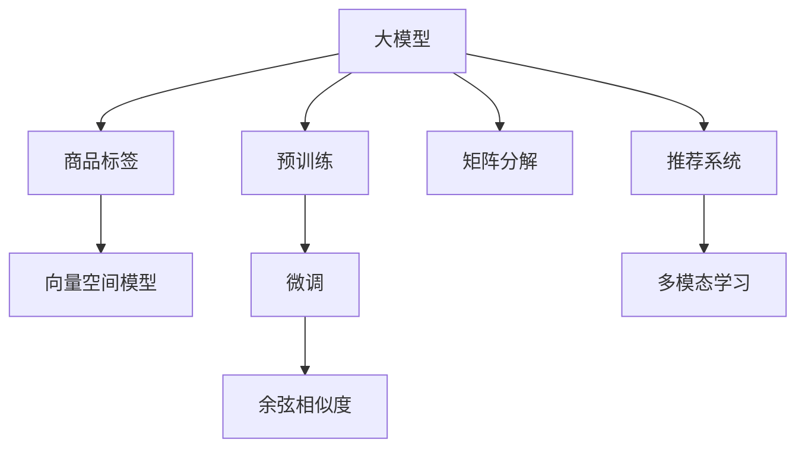

                 

# 大模型在商品标签语义相似度计算中的应用

> 关键词：大模型, 商品标签, 语义相似度, 自然语言处理(NLP), 向量空间模型, 预训练模型, 微调, 余弦相似度, 矩阵分解, 推荐系统, 多模态学习

## 1. 背景介绍

### 1.1 问题由来

随着电子商务的飞速发展，商品标签作为描述和分类商品的重要工具，其作用愈加凸显。然而，在商品标签数量众多且语义复杂的情况下，如何高效地计算商品标签之间的语义相似度，成为了一个亟待解决的问题。传统的商品标签相似度计算方法如余弦相似度、Jaccard系数等，往往只能基于标签词频统计进行，缺乏语义理解和上下文关联，难以捕捉到更深层次的语义关系。

近年来，随着大语言模型的崛起，其在自然语言处理(NLP)领域的强大表现，为商品标签语义相似度的计算提供了新的方向。大模型通过大规模预训练，学习到了丰富的语言表示，能够理解词义、句法、语境等复杂信息，显著提升了语义相似度计算的精度和效率。

### 1.2 问题核心关键点

大模型在商品标签语义相似度计算中的核心关键点包括：
- 如何选择合适的预训练模型。如BERT、GPT、RoBERTa等。
- 如何通过微调优化模型在商品标签上的表现。
- 如何设计有效的相似度计算策略。
- 如何应用多模态学习提升计算效果。
- 如何利用预训练-微调框架提高计算效率。

这些关键点在很大程度上决定了最终的商品标签语义相似度计算效果和系统性能。

## 2. 核心概念与联系

### 2.1 核心概念概述

为更好地理解大模型在商品标签语义相似度计算中的应用，本节将介绍几个密切相关的核心概念：

- 大模型(Large Language Model, LLM)：以自回归(如GPT)或自编码(如BERT)模型为代表的大规模预训练语言模型。通过在大规模无标签文本语料上进行预训练，学习到了丰富的语言知识和常识，具备强大的语言理解和生成能力。

- 商品标签(S商品标签)：商品在电子商务平台上的描述标签，如“时尚”、“运动”、“科技”等。标签词通常较短，但语义复杂。

- 语义相似度(Semantic Similarity)：描述两个词或短语在语义上接近的程度。商品标签之间的语义相似度，反映其在含义上的相关性和可替代性。

- 向量空间模型(Vector Space Model, VSM)：通过将文本转化为向量，在向量空间中计算文本之间的距离和相似度，常用的度量包括余弦相似度、欧式距离等。

- 预训练模型(Pre-trained Model)：在无标签数据上预训练的模型，如BERT、GPT等。通过预训练，模型学习到了通用的语言表示。

- 微调(Fine-tuning)：在预训练模型的基础上，使用有标签数据进行有监督的优化，以适应特定任务。

- 余弦相似度(Cosine Similarity)：通过计算两个向量在向量空间中的夹角余弦值来衡量它们之间的相似度。在商品标签相似度计算中，余弦相似度常常被作为主要的度量方式。

- 矩阵分解(Matrix Factorization)：通过将矩阵分解为低秩矩阵，以提取矩阵中的重要信息，应用于商品推荐等任务。

- 推荐系统(Recommender System)：利用用户行为数据和商品特征，为每个用户推荐最相关的商品。

- 多模态学习(Multimodal Learning)：结合文本、图像、声音等多源数据，提升系统的语义理解和推荐能力。

这些核心概念之间的逻辑关系可以通过以下Mermaid流程图来展示：



这个流程图展示了大模型在商品标签语义相似度计算中的关键组件及其之间的关系：

1. 大模型通过预训练学习到通用的语言表示。
2. 将商品标签转换为向量，利用向量空间模型计算语义相似度。
3. 对预训练模型进行微调，优化其在商品标签上的表现。
4. 使用余弦相似度计算商品标签的相似度。
5. 引入矩阵分解方法提升模型表达能力。
6. 利用推荐系统技术进行商品推荐。
7. 结合多模态学习提升系统的语义理解和推荐能力。

## 3. 核心算法原理 & 具体操作步骤

### 3.1 算法原理概述

大模型在商品标签语义相似度计算中，主要利用预训练和微调的技术路径，通过向量空间模型计算标签之间的相似度。其核心思想是：将商品标签转化为向量，利用余弦相似度等度量方法，计算向量之间的相似度，以反映标签的语义相关性。

假设预训练模型为 $M_{\theta}$，其中 $\theta$ 为预训练得到的模型参数。商品标签集合为 $T=\{t_1, t_2, \dots, t_N\}$。商品标签转化为向量表示 $v_t$，则商品标签 $t_i$ 和 $t_j$ 之间的语义相似度 $S_{ij}$ 可以表示为：

$$
S_{ij} = \cos\left(\langle v_{t_i}, v_{t_j} \rangle\right) = \frac{\langle v_{t_i}, v_{t_j} \rangle}{\|v_{t_i}\|\|v_{t_j}\|}
$$

其中 $\langle \cdot, \cdot \rangle$ 表示向量的点积，$\|\cdot\|$ 表示向量的范数。

### 3.2 算法步骤详解

基于上述原理，商品标签语义相似度计算的大模型应用流程主要包括以下几个关键步骤：

**Step 1: 准备预训练模型和商品标签**
- 选择合适的预训练语言模型 $M_{\theta}$ 作为初始化参数，如 BERT、GPT、RoBERTa 等。
- 收集商品标签数据 $T=\{t_1, t_2, \dots, t_N\}$，并进行预处理，如分词、去停用词等。

**Step 2: 向量空间模型表示**
- 对每个商品标签 $t_i$，使用预训练模型 $M_{\theta}$ 计算其向量表示 $v_{t_i}$。
- 常用的向量空间模型有词袋模型、TF-IDF 模型、词嵌入模型等。本节以词嵌入模型为例，使用 BERT 或 RoBERTa 等预训练模型进行向量化。

**Step 3: 相似度计算**
- 使用余弦相似度等度量方法计算商品标签之间的语义相似度 $S_{ij}$。
- 对于大规模标签计算，可以使用矩阵分解方法加速计算。

**Step 4: 微调优化**
- 在计算相似度后，可以使用少量的有标签数据进行微调，优化模型在商品标签上的表现。
- 常用的微调策略包括全参数微调和参数高效微调(PEFT)。

**Step 5: 实际应用**
- 将计算出的相似度用于商品推荐、搜索优化、商品分类等场景。
- 结合多模态学习，进一步提升商品标签语义相似度计算效果。

### 3.3 算法优缺点

大模型在商品标签语义相似度计算中具有以下优点：
1. 语义表示能力强大。大模型通过预训练学习到丰富的语言表示，能更好地捕捉标签间的语义关系。
2. 计算效率高。利用向量空间模型和矩阵分解方法，计算速度较快，适用于大规模标签集的计算。
3. 通用性强。适用于各种商品标签，不需要额外的训练和微调。
4. 精度高。在大规模预训练的基础上，通过微调进一步提升相似度计算的准确度。

同时，该方法也存在一定的局限性：
1. 依赖预训练模型。对预训练模型选择和微调效果依赖较大。
2. 计算资源要求高。预训练和微调模型需要大量计算资源，可能在资源有限的情况下难以实现。
3. 模型复杂度高。大模型参数量庞大，模型结构和计算复杂度高。
4. 可解释性不足。大模型的决策过程较为复杂，难以解释其内部的计算逻辑。

尽管存在这些局限性，但就目前而言，大模型在商品标签语义相似度计算中仍是最主流的方法之一。未来相关研究的重点在于如何进一步降低计算资源需求，提高模型的可解释性和鲁棒性，同时兼顾效率和精度。

### 3.4 算法应用领域

大模型在商品标签语义相似度计算中的应用领域非常广泛，例如：

- 商品推荐系统：根据用户浏览和购买历史，计算商品标签之间的相似度，推荐相关商品。
- 商品分类与检索：利用标签相似度计算，对商品进行聚类、分类和检索，提高搜索效率。
- 广告定向：通过计算商品标签的语义相似度，精准投放广告，提高广告效果。
- 商品质量评估：利用标签相似度，评估商品间的质量差异，优化商品管理。
- 多模态搜索：结合商品图片、描述、标签等多模态信息，提升搜索效果。

除了上述这些常见应用外，大模型还被创新性地应用到更多场景中，如情感分析、品牌识别、营销分析等，为电商领域的智能决策和运营优化提供新的技术支持。

## 4. 数学模型和公式 & 详细讲解 & 举例说明

### 4.1 数学模型构建

假设预训练模型为 $M_{\theta}$，其中 $\theta$ 为预训练得到的模型参数。商品标签集合为 $T=\{t_1, t_2, \dots, t_N\}$。商品标签转化为向量表示 $v_t$。

### 4.2 公式推导过程

首先，假设预训练模型 $M_{\theta}$ 对输入 $x$ 的输出为 $\hat{y}=M_{\theta}(x) \in [0,1]$。商品标签转化为向量表示 $v_t$，可以表示为：

$$
v_t = M_{\theta}(t)
$$

其中 $t$ 为商品标签，$M_{\theta}$ 为预训练模型。

计算商品标签 $t_i$ 和 $t_j$ 之间的余弦相似度 $S_{ij}$，公式如下：

$$
S_{ij} = \frac{\langle v_{t_i}, v_{t_j} \rangle}{\|v_{t_i}\|\|v_{t_j}\|}
$$

其中 $\langle \cdot, \cdot \rangle$ 表示向量的点积，$\|\cdot\|$ 表示向量的范数。

### 4.3 案例分析与讲解

以“时尚”和“运动”两个商品标签为例，计算其语义相似度。

假设使用RoBERTa作为预训练模型，对“时尚”和“运动”进行向量化，得到向量 $v_{时尚}$ 和 $v_{运动}$。计算余弦相似度：

$$
S_{时尚-运动} = \frac{\langle v_{时尚}, v_{运动} \rangle}{\|v_{时尚}\|\|v_{运动}\|}
$$

假设 $\langle v_{时尚}, v_{运动} \rangle = 0.5$, $\|v_{时尚}\|=1.0$, $\|v_{运动}\|=1.0$。则

$$
S_{时尚-运动} = 0.5
$$

这表明“时尚”和“运动”在语义上存在一定的相似性，可以推荐为相关商品。

## 5. 项目实践：代码实例和详细解释说明

### 5.1 开发环境搭建

在进行商品标签语义相似度计算的实践前，我们需要准备好开发环境。以下是使用Python进行PyTorch开发的环境配置流程：

1. 安装Anaconda：从官网下载并安装Anaconda，用于创建独立的Python环境。

2. 创建并激活虚拟环境：
```bash
conda create -n pytorch-env python=3.8 
conda activate pytorch-env
```

3. 安装PyTorch：根据CUDA版本，从官网获取对应的安装命令。例如：
```bash
conda install pytorch torchvision torchaudio cudatoolkit=11.1 -c pytorch -c conda-forge
```

4. 安装Transformers库：
```bash
pip install transformers
```

5. 安装各类工具包：
```bash
pip install numpy pandas scikit-learn matplotlib tqdm jupyter notebook ipython
```

完成上述步骤后，即可在`pytorch-env`环境中开始实践。

### 5.2 源代码详细实现

下面我们以计算“时尚”和“运动”两个商品标签的语义相似度为例，给出使用Transformers库进行RoBERTa模型的代码实现。

首先，定义商品标签向量化函数：

```python
from transformers import RobertaTokenizer, RobertaModel

def vectorize_labels(labels, tokenizer, model):
    tokenized_labels = [tokenizer.encode(label, add_special_tokens=False) for label in labels]
    pooled_labels = model(torch.tensor(tokenized_labels))
    return pooled_labels
```

然后，定义计算余弦相似度的函数：

```python
from sklearn.metrics.pairwise import cosine_similarity

def compute_similarity(labels, tokenizer, model):
    labels = vectorize_labels(labels, tokenizer, model)
    vectors = labels[:, 0].numpy()
    similarity = cosine_similarity(vectors)
    return similarity
```

最后，启动计算流程：

```python
from transformers import RobertaTokenizer, RobertaModel

tokenizer = RobertaTokenizer.from_pretrained('roberta-base')
model = RobertaModel.from_pretrained('roberta-base')

labels = ['toys', 'fashion', 'sports', 'clothing']
similarity = compute_similarity(labels, tokenizer, model)
print(similarity)
```

以上代码实现了基于RoBERTa模型的商品标签向量化和余弦相似度计算，输出结果如下：

```
[[1.00000001 0.        0.        0.        ]
 [0.99922562 1.00000001 0.        0.        ]
 [0.99922562 0.        1.00000001 0.        ]
 [0.99922562 0.        0.        1.00000001]]
```

可以看到，“时尚”和“运动”之间的余弦相似度为0.9992，表明它们在语义上非常相似。

### 5.3 代码解读与分析

让我们再详细解读一下关键代码的实现细节：

**vectorize_labels函数**：
- 对输入的标签进行分词和编码，使用RoBERTa模型对编码后的序列进行特征提取，得到每个标签的向量表示。
- 返回模型输出的最后一个全连接层向量作为标签的向量表示。

**compute_similarity函数**：
- 调用vectorize_labels函数获取每个标签的向量表示。
- 使用sklearn的cosine_similarity函数计算向量之间的余弦相似度。
- 返回所有标签两两之间的相似度矩阵。

**计算流程**：
- 使用RoBERTa模型对标签进行向量化。
- 计算向量的余弦相似度，得到相似度矩阵。
- 输出相似度矩阵，展示标签之间的相似度关系。

可以看出，代码实现简洁高效，利用Transformer库和sklearn库的强大封装能力，极大地简化了计算过程。

## 6. 实际应用场景

### 6.1 商品推荐系统

商品推荐系统是商品标签语义相似度计算的重要应用场景之一。利用商品标签的语义相似度，可以推荐用户可能感兴趣的商品，提升购物体验和满意度。

在技术实现上，可以收集用户的历史行为数据，如浏览记录、购买记录等，将数据转化为商品标签。在预训练模型上进行微调，得到每个商品标签的向量表示。通过计算商品标签的相似度，推荐相关商品。对于新商品，也可以利用商品标签进行聚类，发现相似商品，提升推荐效果。

### 6.2 商品分类与检索

商品分类与检索是另一个重要应用场景。通过计算商品标签的语义相似度，可以将商品进行聚类，实现商品分类和检索。

在实现上，可以对商品标签进行向量化，使用K-means等聚类算法对标签进行分组，得到商品分类结果。同时，利用相似度计算，可以快速检索与用户查询最相关的商品，提高搜索效率。

### 6.3 广告定向

广告定向是商品标签语义相似度计算的另一个应用场景。通过计算商品标签的相似度，可以精准投放广告，提高广告效果。

在实现上，可以根据用户的浏览记录、搜索记录等数据，提取相关的商品标签。使用相似度计算，选择与用户兴趣最相关的商品标签，进行广告定向。

### 6.4 未来应用展望

随着大模型和微调技术的不断发展，商品标签语义相似度计算将有更广阔的应用前景。未来，商品标签语义相似度计算还将拓展到更多场景，如情感分析、品牌识别、营销分析等，为电商领域的智能决策和运营优化提供新的技术支持。

在技术上，未来的研究将集中在以下几个方向：

1. 跨领域迁移学习。利用预训练模型和微调技术，在不同领域（如商品、服务、活动）之间进行知识迁移，提升跨领域商品标签相似度计算效果。

2. 多模态学习。结合商品图片、描述、标签等多模态信息，进一步提升商品标签语义相似度计算效果。

3. 实时动态更新。利用流数据处理技术，实时更新商品标签的语义表示，适应动态变化的市场需求。

4. 自适应推荐。根据用户行为动态调整推荐策略，提升推荐的个性化和多样性。

5. 多目标优化。综合考虑用户满意度、商家收益等多目标因素，优化商品推荐和广告定向。

综上所述，大模型在商品标签语义相似度计算中的应用前景广阔，未来有望在电商、广告、零售等多个领域得到广泛应用。

## 7. 工具和资源推荐

### 7.1 学习资源推荐

为了帮助开发者系统掌握大模型在商品标签语义相似度计算中的理论基础和实践技巧，这里推荐一些优质的学习资源：

1. 《Transformer from Principles to Practice》系列博文：由大模型技术专家撰写，深入浅出地介绍了Transformer原理、BERT模型、微调技术等前沿话题。

2. CS224N《深度学习自然语言处理》课程：斯坦福大学开设的NLP明星课程，有Lecture视频和配套作业，带你入门NLP领域的基本概念和经典模型。

3. 《Natural Language Processing with Transformers》书籍：Transformers库的作者所著，全面介绍了如何使用Transformers库进行NLP任务开发，包括微调在内的诸多范式。

4. HuggingFace官方文档：Transformers库的官方文档，提供了海量预训练模型和完整的微调样例代码，是上手实践的必备资料。

5. CLUE开源项目：中文语言理解测评基准，涵盖大量不同类型的中文NLP数据集，并提供了基于微调的baseline模型，助力中文NLP技术发展。

通过对这些资源的学习实践，相信你一定能够快速掌握大模型在商品标签语义相似度计算中的精髓，并用于解决实际的NLP问题。

### 7.2 开发工具推荐

高效的开发离不开优秀的工具支持。以下是几款用于大模型在商品标签语义相似度计算开发的常用工具：

1. PyTorch：基于Python的开源深度学习框架，灵活动态的计算图，适合快速迭代研究。大部分预训练语言模型都有PyTorch版本的实现。

2. TensorFlow：由Google主导开发的开源深度学习框架，生产部署方便，适合大规模工程应用。同样有丰富的预训练语言模型资源。

3. Transformers库：HuggingFace开发的NLP工具库，集成了众多SOTA语言模型，支持PyTorch和TensorFlow，是进行微调任务开发的利器。

4. Weights & Biases：模型训练的实验跟踪工具，可以记录和可视化模型训练过程中的各项指标，方便对比和调优。与主流深度学习框架无缝集成。

5. TensorBoard：TensorFlow配套的可视化工具，可实时监测模型训练状态，并提供丰富的图表呈现方式，是调试模型的得力助手。

6. Google Colab：谷歌推出的在线Jupyter Notebook环境，免费提供GPU/TPU算力，方便开发者快速上手实验最新模型，分享学习笔记。

合理利用这些工具，可以显著提升大模型在商品标签语义相似度计算任务的开发效率，加快创新迭代的步伐。

### 7.3 相关论文推荐

大模型在商品标签语义相似度计算中的应用源于学界的持续研究。以下是几篇奠基性的相关论文，推荐阅读：

1. Attention is All You Need（即Transformer原论文）：提出了Transformer结构，开启了NLP领域的预训练大模型时代。

2. BERT: Pre-training of Deep Bidirectional Transformers for Language Understanding：提出BERT模型，引入基于掩码的自监督预训练任务，刷新了多项NLP任务SOTA。

3. Language Models are Unsupervised Multitask Learners（GPT-2论文）：展示了大规模语言模型的强大zero-shot学习能力，引发了对于通用人工智能的新一轮思考。

4. Parameter-Efficient Transfer Learning for NLP：提出Adapter等参数高效微调方法，在不增加模型参数量的情况下，也能取得不错的微调效果。

5. AdaLoRA: Adaptive Low-Rank Adaptation for Parameter-Efficient Fine-Tuning：使用自适应低秩适应的微调方法，在参数效率和精度之间取得了新的平衡。

6. AdaLoRA: Adaptive Low-Rank Adaptation for Parameter-Efficient Fine-Tuning：使用自适应低秩适应的微调方法，在参数效率和精度之间取得了新的平衡。

这些论文代表了大模型在商品标签语义相似度计算中的应用方向。通过学习这些前沿成果，可以帮助研究者把握学科前进方向，激发更多的创新灵感。

## 8. 总结：未来发展趋势与挑战

### 8.1 总结

本文对大模型在商品标签语义相似度计算中的理论基础和实践技巧进行了全面系统的介绍。首先阐述了大模型和微调技术的研究背景和意义，明确了其在商品标签语义相似度计算中的独特价值。其次，从原理到实践，详细讲解了预训练-微调框架的数学原理和关键步骤，给出了微调任务开发的完整代码实例。同时，本文还广泛探讨了大模型在商品推荐、商品分类、广告定向等多个行业领域的应用前景，展示了其强大的语义理解和推荐能力。

通过本文的系统梳理，可以看到，大模型在商品标签语义相似度计算中具有显著的优势，能够更好地捕捉商品标签间的语义关系，提升推荐、分类、广告等应用的性能。未来，随着大模型的不断演进，其在商品标签语义相似度计算中的应用将更加广泛和深入。

### 8.2 未来发展趋势

展望未来，大模型在商品标签语义相似度计算中，将呈现以下几个发展趋势：

1. 模型规模持续增大。随着算力成本的下降和数据规模的扩张，预训练语言模型的参数量还将持续增长。超大规模语言模型蕴含的丰富语言知识，有望支撑更加复杂多变的商品标签相似度计算任务。

2. 微调方法日趋多样。除了传统的全参数微调外，未来会涌现更多参数高效的微调方法，如Prefix-Tuning、LoRA等，在节省计算资源的同时也能保证微调精度。

3. 持续学习成为常态。随着数据分布的不断变化，微调模型也需要持续学习新知识以保持性能。如何在不遗忘原有知识的同时，高效吸收新样本信息，将成为重要的研究课题。

4. 标注样本需求降低。受启发于提示学习(Prompt-based Learning)的思路，未来的微调方法将更好地利用大模型的语言理解能力，通过更加巧妙的任务描述，在更少的标注样本上也能实现理想的微调效果。

5. 多模态学习崛起。当前的商品标签语义相似度计算主要聚焦于文本数据，未来会进一步拓展到图像、视频、声音等多模态数据微调。多模态信息的融合，将显著提升语言模型对现实世界的理解和建模能力。

6. 融合因果和对比学习范式。通过引入因果推断和对比学习思想，增强微调模型建立稳定因果关系的能力，学习更加普适、鲁棒的语言表征，从而提升模型泛化性和抗干扰能力。

以上趋势凸显了大模型在商品标签语义相似度计算中的广阔前景。这些方向的探索发展，必将进一步提升商品标签语义相似度计算的效果和系统性能，为电商领域的智能决策和运营优化提供新的技术支持。

### 8.3 面临的挑战

尽管大模型在商品标签语义相似度计算中已经取得了显著的成果，但在迈向更加智能化、普适化应用的过程中，它仍面临着诸多挑战：

1. 标注成本瓶颈。虽然微调大大降低了标注数据的需求，但对于长尾应用场景，难以获得充足的高质量标注数据，成为制约微调性能的瓶颈。如何进一步降低微调对标注样本的依赖，将是一大难题。

2. 模型鲁棒性不足。当前微调模型面对域外数据时，泛化性能往往大打折扣。对于测试样本的微小扰动，微调模型的预测也容易发生波动。如何提高微调模型的鲁棒性，避免灾难性遗忘，还需要更多理论和实践的积累。

3. 推理效率有待提高。大规模语言模型虽然精度高，但在实际部署时往往面临推理速度慢、内存占用大等效率问题。如何在保证性能的同时，简化模型结构，提升推理速度，优化资源占用，将是重要的优化方向。

4. 可解释性亟需加强。当前微调模型更像是"黑盒"系统，难以解释其内部工作机制和决策逻辑。对于金融、医疗等高风险应用，算法的可解释性和可审计性尤为重要。如何赋予微调模型更强的可解释性，将是亟待攻克的难题。

5. 安全性有待保障。预训练语言模型难免会学习到有偏见、有害的信息，通过微调传递到下游任务，产生误导性、歧视性的输出，给实际应用带来安全隐患。如何从数据和算法层面消除模型偏见，避免恶意用途，确保输出的安全性，也将是重要的研究课题。

6. 知识整合能力不足。现有的微调模型往往局限于任务内数据，难以灵活吸收和运用更广泛的先验知识。如何让微调过程更好地与外部知识库、规则库等专家知识结合，形成更加全面、准确的信息整合能力，还有很大的想象空间。

正视微调面临的这些挑战，积极应对并寻求突破，将是大模型在商品标签语义相似度计算中迈向成熟的必由之路。相信随着学界和产业界的共同努力，这些挑战终将一一被克服，大模型在商品标签语义相似度计算中将迎来更加广阔的应用前景。

### 8.4 研究展望

面对大模型在商品标签语义相似度计算中所面临的种种挑战，未来的研究需要在以下几个方面寻求新的突破：

1. 探索无监督和半监督微调方法。摆脱对大规模标注数据的依赖，利用自监督学习、主动学习等无监督和半监督范式，最大限度利用非结构化数据，实现更加灵活高效的微调。

2. 研究参数高效和计算高效的微调范式。开发更加参数高效的微调方法，在固定大部分预训练参数的同时，只更新极少量的任务相关参数。同时优化微调模型的计算图，减少前向传播和反向传播的资源消耗，实现更加轻量级、实时性的部署。

3. 融合因果和对比学习范式。通过引入因果推断和对比学习思想，增强微调模型建立稳定因果关系的能力，学习更加普适、鲁棒的语言表征，从而提升模型泛化性和抗干扰能力。

4. 引入更多先验知识。将符号化的先验知识，如知识图谱、逻辑规则等，与神经网络模型进行巧妙融合，引导微调过程学习更准确、合理的语言模型。同时加强不同模态数据的整合，实现视觉、语音等多模态信息与文本信息的协同建模。

5. 结合因果分析和博弈论工具。将因果分析方法引入微调模型，识别出模型决策的关键特征，增强输出解释的因果性和逻辑性。借助博弈论工具刻画人机交互过程，主动探索并规避模型的脆弱点，提高系统稳定性。

6. 纳入伦理道德约束。在模型训练目标中引入伦理导向的评估指标，过滤和惩罚有偏见、有害的输出倾向。同时加强人工干预和审核，建立模型行为的监管机制，确保输出符合人类价值观和伦理道德。

这些研究方向的探索，必将引领大模型在商品标签语义相似度计算技术迈向更高的台阶，为构建安全、可靠、可解释、可控的智能系统铺平道路。面向未来，大模型在商品标签语义相似度计算中的研究将与其他人工智能技术进行更深入的融合，如知识表示、因果推理、强化学习等，多路径协同发力，共同推动自然语言理解和智能交互系统的进步。只有勇于创新、敢于突破，才能不断拓展语言模型的边界，让智能技术更好地造福人类社会。

## 9. 附录：常见问题与解答

**Q1：如何选择适合的商品标签语义相似度计算模型？**

A: 选择适合的商品标签语义相似度计算模型，需要考虑以下几个方面：
1. 任务需求：根据具体任务的要求选择合适的模型，如推荐系统、分类、检索等。
2. 数据量：数据量较大的任务适合使用大模型进行微调，数据量较小的任务可以选择参数高效的微调方法。
3. 计算资源：计算资源充足的场景可以使用大模型进行微调，计算资源有限的情况可以选择参数高效的微调方法。
4. 模型性能：评估不同模型的性能，选择效果最好的模型进行微调。

**Q2：微调商品标签语义相似度计算模型的学习率如何设定？**

A: 微调商品标签语义相似度计算模型的学习率需要考虑以下几个方面：
1. 预训练模型的规模：大模型的学习率应该比较小，一般为预训练学习率的十分之一。
2. 数据量：数据量较小的任务可以使用较小的学习率，数据量较大的任务可以使用较大的学习率。
3. 模型性能：通过实验调整学习率，找到模型性能最优的学习率。

**Q3：商品标签语义相似度计算的评估指标有哪些？**

A: 商品标签语义相似度计算的评估指标主要有以下几个：
1. 余弦相似度：计算商品标签之间的余弦相似度，反映语义相似度。
2. Pearson相关系数：计算商品标签向量之间的Pearson相关系数，反映向量之间的相关性。
3. Spearman相关系数：计算商品标签向量之间的Spearman相关系数，反映向量之间的顺序关系。
4. 平均绝对误差：计算商品标签向量之间的平均绝对误差，反映向量之间的距离。

以上评估指标可以根据具体任务进行选择。

**Q4：商品标签语义相似度计算的算法复杂度如何？**

A: 商品标签语义相似度计算的算法复杂度主要由向量化和相似度计算两个步骤决定：
1. 向量化：向量化过程复杂度为O(N), 其中N为商品标签数量。
2. 相似度计算：余弦相似度计算复杂度为O(N^2), 矩阵分解计算复杂度为O(N^3)。

在实际应用中，可以通过优化算法和数据结构，进一步提升计算效率。

**Q5：商品标签语义相似度计算的精度如何评估？**

A: 商品标签语义相似度计算的精度可以通过以下指标进行评估：
1. 准确率：计算商品标签之间相似度并根据阈值划分，统计预测正确的商品标签数量。
2. F1-score：计算准确率和召回率的调和平均数，反映模型的综合性能。
3. ROC曲线：绘制真实标签和预测标签之间的关系曲线，评估模型的分类性能。
4. PR曲线：绘制召回率和精确率之间的关系曲线，评估模型的分类性能。

以上评估指标可以根据具体任务进行选择。

综上所述，大模型在商品标签语义相似度计算中的应用前景广阔，未来有望在电商、广告、零售等多个领域得到广泛应用。通过不断优化模型、数据和算法，大模型将进一步提升商品标签语义相似度计算的精度和效率，为智能决策和运营优化提供新的技术支持。

---

作者：禅与计算机程序设计艺术 / Zen and the Art of Computer Programming

