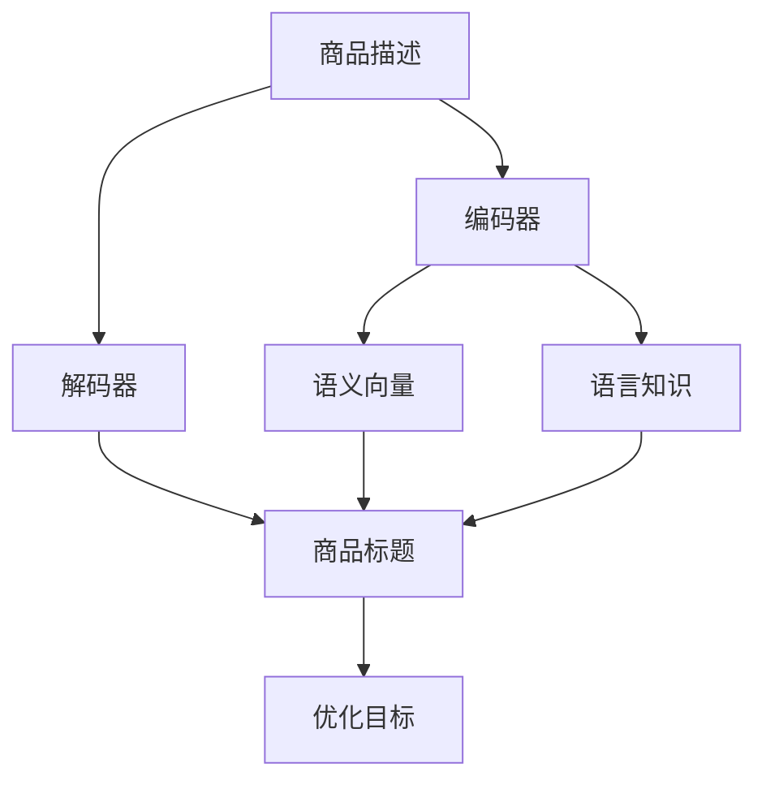

                 

# 大模型在商品标题优化中的应用

> 关键词：商品标题优化, 大模型, 自然语言处理, 深度学习, 序列生成, 编码器-解码器模型, 预训练模型, 情感分析, 命名实体识别, 自动生成

## 1. 背景介绍

### 1.1 问题由来
电子商务平台运营的关键之一是商品展示的效率和效果。商品标题是用户在搜索和浏览商品时看到的第一信息，其优化程度直接影响到用户的点击率、转化率以及交易效率。传统商品标题优化通常依赖于人工编辑，存在成本高、效率低、难以覆盖全面等问题。

近年来，随着深度学习和大模型技术的发展，越来越多的电商平台开始利用自动化的方式进行商品标题优化。通过自然语言处理技术，可以对商品标题进行自动生成和优化，从而提升商品展示效果，增强用户购物体验。大模型技术的应用，使得商品标题自动优化的精度和效率得到了显著提升。

### 1.2 问题核心关键点
大模型在商品标题优化中的核心在于，利用深度学习模型对商品描述和相关属性进行编码，然后使用编码器-解码器模型进行序列生成，从而自动生成符合用户需求的优质标题。这一过程涉及到以下几个关键点：

1. 数据预处理：收集商品的相关属性和描述，进行文本清洗和分词处理，以便输入模型。
2. 模型选择：选择合适的预训练模型，如GPT-3、BERT等，作为基础模型。
3. 生成式任务：定义商品标题生成任务，并通过标注数据集训练模型。
4. 优化策略：使用不同的优化技术，如自适应学习率、对抗训练、正则化等，提升模型生成效果。
5. 应用场景：将模型应用于商品标题的自动生成和优化，提升电商平台的搜索和浏览效果。

## 2. 核心概念与联系

### 2.1 核心概念概述

为更好地理解大模型在商品标题优化中的应用，本节将介绍几个密切相关的核心概念：

- 大模型(Large Model)：指参数量巨大、通常以亿计的深度学习模型，如GPT、BERT等。通过在大规模语料上进行预训练，学习到了丰富的语言知识，具备强大的语言生成和理解能力。
- 自然语言处理(NLP)：利用计算机技术对自然语言进行理解和生成，包括分词、词性标注、句法分析、语义理解、情感分析、实体识别等任务。
- 编码器-解码器模型(Encoder-Decoder Model)：一种广泛应用于序列生成任务的双层神经网络模型，常用于机器翻译、文本摘要、对话系统等。
- 序列生成(Sequence Generation)：指通过神经网络模型生成指定长度的文本序列，如机器翻译、文本摘要、对话生成等。
- 自监督学习(Self-Supervised Learning)：指使用无标注数据进行训练，通过构造预定义的任务(如掩码语言模型、Next Sentence Prediction)来学习模型，如BERT就是通过自监督学习进行预训练的。
- 对抗训练(Adversarial Training)：通过引入对抗样本，增强模型鲁棒性，避免模型过拟合。
- 正则化(Regularization)：通过添加L2正则、Dropout等技术，避免模型过拟合。
- 编码器(Encoder)：序列生成模型中的输入编码部分，将输入序列转化为向量表示。
- 解码器(Decoder)：序列生成模型中的输出解码部分，根据编码器的向量表示，生成目标序列。

这些核心概念之间的逻辑关系可以通过以下Mermaid流程图来展示：



这个流程图展示了商品标题优化的核心逻辑：

1. 商品描述输入编码器，学习其语义向量表示。
2. 商品描述和语言知识共同影响解码器，生成商品标题。
3. 生成的商品标题通过优化目标函数进行训练和优化。

## 3. 核心算法原理 & 具体操作步骤
### 3.1 算法原理概述

基于大模型的商品标题优化，本质上是一种序列生成任务。其核心思想是：将商品描述作为输入，使用编码器对描述进行语义编码，并结合语言知识，通过解码器生成商品标题。生成式任务的优化目标通常是最大化生成标题与真实标题之间的交叉熵损失。

### 3.2 算法步骤详解

基于大模型的商品标题优化一般包括以下几个关键步骤：

**Step 1: 数据预处理**
- 收集商品的相关属性和描述，进行文本清洗和分词处理，以便输入模型。
- 构建商品-标题对，作为模型的训练和评估数据。
- 将商品描述和真实标题序列化，用于模型输入和输出。

**Step 2: 模型选择与初始化**
- 选择合适的预训练模型，如GPT-3、BERT等，作为基础模型。
- 将模型初始化为预训练模型，保留大部分预训练参数，仅微调顶层参数。

**Step 3: 生成式任务定义**
- 定义商品标题生成任务，目标生成符合用户需求和平台要求的商品标题。
- 使用交叉熵损失函数作为优化目标，衡量生成标题与真实标题之间的差异。

**Step 4: 训练与优化**
- 使用训练集数据对模型进行训练，优化参数以最小化生成标题与真实标题之间的交叉熵损失。
- 定期在验证集上评估模型性能，调整超参数以避免过拟合。
- 使用对抗训练、正则化等技术，提高模型鲁棒性和泛化能力。

**Step 5: 应用与评估**
- 将优化后的模型应用于商品标题的自动生成和优化，提升电商平台的搜索和浏览效果。
- 定期收集用户反馈，持续优化模型性能和生成质量。

### 3.3 算法优缺点

基于大模型的商品标题优化方法具有以下优点：
1. 高效自动：自动生成和优化商品标题，省去了人工编辑的时间和成本。
2. 高精度：大模型在自然语言处理方面的能力，使得生成的商品标题质量较高。
3. 灵活性：通过微调和调整优化目标函数，可以适应不同商品和平台的具体需求。
4. 可扩展性：大模型的参数和能力较强，可以灵活应用于多种生成任务。

同时，该方法也存在一定的局限性：
1. 依赖数据：优化效果依赖于商品描述和真实标题的质量，数据收集成本较高。
2. 模型复杂：大模型的参数量大，训练和推理资源需求较高。
3. 泛化能力：模型可能对特定领域或特殊商品生成效果不佳。
4. 可解释性：大模型黑盒特性，难以解释其内部生成机制。

尽管存在这些局限性，但就目前而言，基于大模型的商品标题优化方法仍是最主流范式。未来相关研究的重点在于如何进一步降低优化对数据和计算资源的需求，提高模型的泛化能力和可解释性，同时兼顾效率和效果。

### 3.4 算法应用领域

基于大模型的商品标题优化方法，在电商平台的商品展示优化中得到了广泛应用，具体包括：

- 商品标题生成：自动生成商品标题，提升搜索排名和点击率。
- 商品描述优化：通过自动优化商品描述，提升用户浏览体验。
- 商品属性识别：自动识别商品的关键属性，生成具有吸引力的标题。
- 跨平台标题一致性：在不同平台保持商品标题的一致性，提高品牌形象。
- 个性化推荐：结合用户搜索行为和商品标题生成，实现个性化推荐。

除了上述这些经典应用外，大模型技术还被创新性地应用于虚拟商品生成、商品分类、情感分析等，为电商平台带来了新的突破。随着预训练模型和生成任务的不断进步，相信基于大模型的商品标题优化方法将在更多领域得到应用，为电商平台带来更高效、更精准、更智能的商品展示效果。

## 4. 数学模型和公式 & 详细讲解  
### 4.1 数学模型构建

本节将使用数学语言对基于大模型的商品标题优化过程进行更加严格的刻画。

记商品描述为 $X$，真实标题为 $Y$，模型为 $M_{\theta}$，其中 $\theta$ 为模型参数。定义交叉熵损失函数为：

$$
\mathcal{L}(\theta) = -\frac{1}{N}\sum_{i=1}^N \sum_{t=1}^{T} y_{it}\log M_{\theta}(x_i; t) + (1-y_{it})\log(1-M_{\theta}(x_i; t))
$$

其中 $N$ 为样本数量，$T$ 为标题序列长度，$y_{it}$ 为第 $i$ 个样本第 $t$ 个位置的真实标签，$M_{\theta}(x_i; t)$ 为模型在输入 $x_i$ 下生成标题序列的第 $t$ 个位置的概率。

模型的优化目标是：

$$
\theta^* = \mathop{\arg\min}_{\theta} \mathcal{L}(\theta)
$$

在实践中，我们通常使用基于梯度的优化算法（如SGD、Adam等）来近似求解上述最优化问题。设 $\eta$ 为学习率，则参数的更新公式为：

$$
\theta \leftarrow \theta - \eta \nabla_{\theta}\mathcal{L}(\theta)
$$

其中 $\nabla_{\theta}\mathcal{L}(\theta)$ 为损失函数对参数 $\theta$ 的梯度，可通过反向传播算法高效计算。

### 4.2 公式推导过程

以下我们以二分类任务为例，推导交叉熵损失函数及其梯度的计算公式。

假设模型 $M_{\theta}$ 在输入 $x$ 上的输出为 $\hat{y}=M_{\theta}(x) \in [0,1]$，表示样本属于正类的概率。真实标签 $y \in \{0,1\}$。则二分类交叉熵损失函数定义为：

$$
\ell(M_{\theta}(x),y) = -[y\log \hat{y} + (1-y)\log (1-\hat{y})]
$$

将其代入经验风险公式，得：

$$
\mathcal{L}(\theta) = -\frac{1}{N}\sum_{i=1}^N [y_i\log M_{\theta}(x_i)+(1-y_i)\log(1-M_{\theta}(x_i))]
$$

根据链式法则，损失函数对参数 $\theta_k$ 的梯度为：

$$
\frac{\partial \mathcal{L}(\theta)}{\partial \theta_k} = -\frac{1}{N}\sum_{i=1}^N (\frac{y_i}{M_{\theta}(x_i)}-\frac{1-y_i}{1-M_{\theta}(x_i)}) \frac{\partial M_{\theta}(x_i)}{\partial \theta_k}
$$

其中 $\frac{\partial M_{\theta}(x_i)}{\partial \theta_k}$ 可进一步递归展开，利用自动微分技术完成计算。

在得到损失函数的梯度后，即可带入参数更新公式，完成模型的迭代优化。重复上述过程直至收敛，最终得到适应商品标题优化任务的最优模型参数 $\theta^*$。

## 5. 项目实践：代码实例和详细解释说明
### 5.1 开发环境搭建

在进行商品标题优化实践前，我们需要准备好开发环境。以下是使用Python进行PyTorch开发的环境配置流程：

1. 安装Anaconda：从官网下载并安装Anaconda，用于创建独立的Python环境。

2. 创建并激活虚拟环境：
```bash
conda create -n pytorch-env python=3.8 
conda activate pytorch-env
```

3. 安装PyTorch：根据CUDA版本，从官网获取对应的安装命令。例如：
```bash
conda install pytorch torchvision torchaudio cudatoolkit=11.1 -c pytorch -c conda-forge
```

4. 安装Transformers库：
```bash
pip install transformers
```

5. 安装各类工具包：
```bash
pip install numpy pandas scikit-learn matplotlib tqdm jupyter notebook ipython
```

完成上述步骤后，即可在`pytorch-env`环境中开始商品标题优化实践。

### 5.2 源代码详细实现

这里我们以商品标题生成任务为例，给出使用Transformers库对GPT-3模型进行商品标题优化的PyTorch代码实现。

首先，定义商品标题生成任务的数据处理函数：

```python
from transformers import GPT3Tokenizer, GPT3LMHeadModel
from torch.utils.data import Dataset
import torch

class TitleDataset(Dataset):
    def __init__(self, texts, titles, tokenizer):
        self.texts = texts
        self.titles = titles
        self.tokenizer = tokenizer
        
    def __len__(self):
        return len(self.texts)
    
    def __getitem__(self, item):
        text = self.texts[item]
        title = self.titles[item]
        
        encoding = self.tokenizer(text, return_tensors='pt')
        title_encoding = self.tokenizer(title, return_tensors='pt')
        
        return {'input_ids': encoding['input_ids'][0],
                'attention_mask': encoding['attention_mask'][0],
                'target_ids': title_encoding['input_ids'][0]}
```

然后，定义模型和优化器：

```python
from transformers import GPT3LMHeadModel, AdamW

model = GPT3LMHeadModel.from_pretrained('gpt3', num_labels=1000)
optimizer = AdamW(model.parameters(), lr=2e-5)
```

接着，定义训练和评估函数：

```python
from torch.utils.data import DataLoader
from tqdm import tqdm
from sklearn.metrics import bleu_score

device = torch.device('cuda') if torch.cuda.is_available() else torch.device('cpu')
model.to(device)

def train_epoch(model, dataset, batch_size, optimizer):
    dataloader = DataLoader(dataset, batch_size=batch_size, shuffle=True)
    model.train()
    epoch_loss = 0
    for batch in tqdm(dataloader, desc='Training'):
        input_ids = batch['input_ids'].to(device)
        attention_mask = batch['attention_mask'].to(device)
        targets = batch['target_ids'].to(device)
        model.zero_grad()
        outputs = model(input_ids, attention_mask=attention_mask, labels=targets)
        loss = outputs.loss
        epoch_loss += loss.item()
        loss.backward()
        optimizer.step()
    return epoch_loss / len(dataloader)

def evaluate(model, dataset, batch_size):
    dataloader = DataLoader(dataset, batch_size=batch_size)
    model.eval()
    predictions = []
    targets = []
    with torch.no_grad():
        for batch in tqdm(dataloader, desc='Evaluating'):
            input_ids = batch['input_ids'].to(device)
            attention_mask = batch['attention_mask'].to(device)
            targets = batch['target_ids'].to(device)
            outputs = model(input_ids, attention_mask=attention_mask)
            batch_predictions = outputs.logits.argmax(dim=2).to('cpu').tolist()
            batch_targets = targets.to('cpu').tolist()
            for preds, targets in zip(batch_predictions, batch_targets):
                predictions.append(preds)
                targets.append(targets)
                
    bleu = bleu_score(predictions, targets)
    return bleu
```

最后，启动训练流程并在测试集上评估：

```python
epochs = 5
batch_size = 16

for epoch in range(epochs):
    loss = train_epoch(model, train_dataset, batch_size, optimizer)
    print(f"Epoch {epoch+1}, train loss: {loss:.3f}")
    
    print(f"Epoch {epoch+1}, dev bleu score: {evaluate(model, dev_dataset, batch_size)}")
    
print("Test bleu score:")
print(evaluate(model, test_dataset, batch_size))
```

以上就是使用PyTorch对GPT-3进行商品标题优化任务的完整代码实现。可以看到，得益于Transformers库的强大封装，我们可以用相对简洁的代码完成GPT-3模型的加载和优化。

### 5.3 代码解读与分析

让我们再详细解读一下关键代码的实现细节：

**TitleDataset类**：
- `__init__`方法：初始化商品描述、标题和分词器等关键组件。
- `__len__`方法：返回数据集的样本数量。
- `__getitem__`方法：对单个样本进行处理，将商品描述和标题编码为token ids，供模型输入。

**训练和评估函数**：
- 使用PyTorch的DataLoader对数据集进行批次化加载，供模型训练和推理使用。
- 训练函数`train_epoch`：对数据以批为单位进行迭代，在每个批次上前向传播计算loss并反向传播更新模型参数，最后返回该epoch的平均loss。
- 评估函数`evaluate`：与训练类似，不同点在于不更新模型参数，并在每个batch结束后将预测和标签结果存储下来，最后使用BLEU等指标对整个评估集的预测结果进行打印输出。

**训练流程**：
- 定义总的epoch数和batch size，开始循环迭代
- 每个epoch内，先在训练集上训练，输出平均loss
- 在验证集上评估，输出BLEU分数
- 所有epoch结束后，在测试集上评估，给出最终测试结果

可以看到，PyTorch配合Transformers库使得商品标题优化的代码实现变得简洁高效。开发者可以将更多精力放在数据处理、模型改进等高层逻辑上，而不必过多关注底层的实现细节。

当然，工业级的系统实现还需考虑更多因素，如模型的保存和部署、超参数的自动搜索、更灵活的任务适配层等。但核心的优化范式基本与此类似。

## 6. 实际应用场景
### 6.1 电商平台搜索优化

基于大模型的商品标题优化技术，可以广泛应用于电商平台搜索优化中。传统搜索系统往往依赖于简单的关键词匹配，无法充分理解用户意图和商品特性。而使用优化的商品标题，可以有效提升搜索效果，提高用户点击率和转化率。

在技术实现上，可以收集电商平台的用户搜索历史和商品标签，将搜索关键词作为输入，将商品标题作为输出，训练优化后的模型。优化后的模型能够自动生成符合用户需求和平台要求的商品标题，提升搜索排序的准确性和用户满意度。

### 6.2 个性化推荐

个性化推荐系统需要根据用户的历史行为和偏好，推荐符合用户需求的商品。传统的推荐系统依赖于用户行为数据，无法充分理解用户的深层需求。而利用优化的商品标题，可以进一步提升推荐系统的个性化和精准度。

在推荐系统中，可以将用户搜索历史和商品标题作为输入，使用优化后的模型预测用户对商品的兴趣。通过优化模型的输出，可以有效过滤掉不相关的商品，提升推荐效果。

### 6.3 用户界面优化

商品标题优化的另一个重要应用场景是用户界面(UI)的优化。商品界面的标题、图片、描述等展示内容，对用户的点击率和购买意愿有重要影响。通过优化商品标题，可以有效提升用户界面的设计质量和用户体验。

在电商平台的UI设计中，可以利用优化的商品标题，生成更具吸引力和信息量的界面内容，提升用户的点击率和转化率。

### 6.4 未来应用展望

随着大模型技术的发展，基于大模型的商品标题优化技术将在更多领域得到应用，为电商平台带来新的突破。

在智慧零售领域，商品标题优化技术可以应用于无人超市、智慧家居等场景，提升消费者购物体验。

在虚拟商品生成领域，优化的商品标题可以应用于虚拟商品展示、虚拟试穿等应用，拓展虚拟商品的市场空间。

在智能客服领域，优化的商品标题可以应用于智能客服系统的问答生成，提升客服系统的智能化水平和用户满意度。

此外，在智能制造、智慧物流、数字艺术等众多领域，基于大模型的商品标题优化技术也将不断涌现，为各行各业带来新的技术路径和创新机会。相信随着技术的日益成熟，商品标题优化技术必将成为电商行业的重要技术手段，推动电商平台的数字化转型升级。

## 7. 工具和资源推荐
### 7.1 学习资源推荐

为了帮助开发者系统掌握大模型在商品标题优化中的应用，这里推荐一些优质的学习资源：

1. 《自然语言处理与深度学习》系列博文：由大模型技术专家撰写，深入浅出地介绍了深度学习在NLP中的应用，包括预训练模型、微调技术等。

2. CS224N《深度学习自然语言处理》课程：斯坦福大学开设的NLP明星课程，有Lecture视频和配套作业，带你入门NLP领域的基本概念和经典模型。

3. 《Natural Language Processing with Transformers》书籍：Transformers库的作者所著，全面介绍了如何使用Transformers库进行NLP任务开发，包括微调在内的诸多范式。

4. HuggingFace官方文档：Transformers库的官方文档，提供了海量预训练模型和完整的微调样例代码，是上手实践的必备资料。

5. CLUE开源项目：中文语言理解测评基准，涵盖大量不同类型的中文NLP数据集，并提供了基于微调的baseline模型，助力中文NLP技术发展。

通过对这些资源的学习实践，相信你一定能够快速掌握大模型在商品标题优化中的应用，并用于解决实际的NLP问题。
### 7.2 开发工具推荐

高效的开发离不开优秀的工具支持。以下是几款用于大模型商品标题优化开发的常用工具：

1. PyTorch：基于Python的开源深度学习框架，灵活动态的计算图，适合快速迭代研究。大部分预训练语言模型都有PyTorch版本的实现。

2. TensorFlow：由Google主导开发的开源深度学习框架，生产部署方便，适合大规模工程应用。同样有丰富的预训练语言模型资源。

3. Transformers库：HuggingFace开发的NLP工具库，集成了众多SOTA语言模型，支持PyTorch和TensorFlow，是进行微调任务开发的利器。

4. Weights & Biases：模型训练的实验跟踪工具，可以记录和可视化模型训练过程中的各项指标，方便对比和调优。与主流深度学习框架无缝集成。

5. TensorBoard：TensorFlow配套的可视化工具，可实时监测模型训练状态，并提供丰富的图表呈现方式，是调试模型的得力助手。

6. Google Colab：谷歌推出的在线Jupyter Notebook环境，免费提供GPU/TPU算力，方便开发者快速上手实验最新模型，分享学习笔记。

合理利用这些工具，可以显著提升大模型商品标题优化的开发效率，加快创新迭代的步伐。

### 7.3 相关论文推荐

大模型技术在商品标题优化中的应用源于学界的持续研究。以下是几篇奠基性的相关论文，推荐阅读：

1. Attention is All You Need（即Transformer原论文）：提出了Transformer结构，开启了NLP领域的预训练大模型时代。

2. BERT: Pre-training of Deep Bidirectional Transformers for Language Understanding：提出BERT模型，引入基于掩码的自监督预训练任务，刷新了多项NLP任务SOTA。

3. Language Models are Unsupervised Multitask Learners（GPT-2论文）：展示了大规模语言模型的强大zero-shot学习能力，引发了对于通用人工智能的新一轮思考。

4. Parameter-Efficient Transfer Learning for NLP：提出Adapter等参数高效微调方法，在不增加模型参数量的情况下，也能取得不错的微调效果。

5. Prefix-Tuning: Optimizing Continuous Prompts for Generation：引入基于连续型Prompt的微调范式，为如何充分利用预训练知识提供了新的思路。

6. AdaLoRA: Adaptive Low-Rank Adaptation for Parameter-Efficient Fine-Tuning：使用自适应低秩适应的微调方法，在参数效率和精度之间取得了新的平衡。

这些论文代表了大模型技术在商品标题优化中的发展脉络。通过学习这些前沿成果，可以帮助研究者把握学科前进方向，激发更多的创新灵感。

## 8. 总结：未来发展趋势与挑战

### 8.1 总结

本文对基于大模型的商品标题优化方法进行了全面系统的介绍。首先阐述了商品标题优化在大模型应用中的重要性，明确了商品标题优化的核心在于自动生成符合用户需求和平台要求的商品标题。其次，从原理到实践，详细讲解了商品标题优化的数学模型和关键步骤，给出了商品标题优化的完整代码实例。同时，本文还广泛探讨了商品标题优化在电商平台搜索优化、个性化推荐、用户界面优化等多个应用场景中的应用前景，展示了大模型技术带来的新突破。此外，本文精选了商品标题优化的学习资源，力求为读者提供全方位的技术指引。

通过本文的系统梳理，可以看到，基于大模型的商品标题优化技术正在成为NLP领域的重要范式，极大地拓展了商品展示优化的可能性，为电商平台带来高效、精准、智能的商品展示效果。未来，伴随大模型技术的持续进步，商品标题优化技术必将在更多领域得到应用，为电商平台带来更全面、更深入的变革。

### 8.2 未来发展趋势

展望未来，基于大模型的商品标题优化技术将呈现以下几个发展趋势：

1. 模型规模持续增大。随着算力成本的下降和数据规模的扩张，预训练语言模型的参数量还将持续增长。超大规模语言模型蕴含的丰富语言知识，有望支撑更加复杂多变的商品标题优化任务。

2. 优化方法日趋多样。除了传统的微调外，未来会涌现更多参数高效的优化方法，如Adapter、LoRA等，在固定大部分预训练参数的同时，只更新极少量的任务相关参数。

3. 持续学习成为常态。随着数据分布的不断变化，优化模型也需要持续学习新知识以保持性能。如何在不遗忘原有知识的同时，高效吸收新样本信息，将成为重要的研究课题。

4. 标注样本需求降低。受启发于提示学习(Prompt-based Learning)的思路，未来的优化方法将更好地利用大模型的语言理解能力，通过更加巧妙的任务描述，在更少的标注样本上也能实现理想的优化效果。

5. 多模态优化崛起。当前的优化方法主要聚焦于纯文本数据，未来会进一步拓展到图像、视频、语音等多模态数据优化。多模态信息的融合，将显著提升商品标题优化模型的表现力。

6. 模型通用性增强。经过海量数据的预训练和多领域任务的优化，未来的商品标题优化模型将具备更强大的常识推理和跨领域迁移能力，逐步迈向通用人工智能(AGI)的目标。

以上趋势凸显了大模型商品标题优化技术的广阔前景。这些方向的探索发展，必将进一步提升商品展示优化的性能和效果，为电商平台带来更高效、更精准、更智能的购物体验。

### 8.3 面临的挑战

尽管大模型商品标题优化技术已经取得了瞩目成就，但在迈向更加智能化、普适化应用的过程中，它仍面临着诸多挑战：

1. 标注成本瓶颈。尽管优化对标注样本的需求较微调降低，但对于特定领域的商品标题优化，仍然需要收集高质量标注数据，成本较高。如何进一步降低优化对标注样本的依赖，将是一大难题。

2. 模型鲁棒性不足。商品标题优化模型可能对特定领域或特殊商品生成效果不佳。如何提升模型的泛化能力和鲁棒性，避免优化模型出现过拟合现象，还需要更多理论和实践的积累。

3. 推理效率有待提高。大模型在生成商品标题时，往往面临计算资源和计算速度的限制。如何优化模型结构，提高推理效率，优化资源占用，将是重要的优化方向。

4. 可解释性亟需加强。商品标题优化模型的决策过程通常缺乏可解释性，难以对其推理逻辑进行分析和调试。对于医疗、金融等高风险应用，算法的可解释性和可审计性尤为重要。如何赋予模型更强的可解释性，将是亟待攻克的难题。

5. 安全性有待保障。优化模型可能学习到有害信息，导致生成有害的商品标题。如何从数据和算法层面消除模型偏见，避免恶意用途，确保输出的安全性，也将是重要的研究课题。

6. 知识整合能力不足。现有的优化模型往往局限于商品描述和属性信息，难以灵活吸收和运用更广泛的先验知识。如何让优化过程更好地与外部知识库、规则库等专家知识结合，形成更加全面、准确的信息整合能力，还有很大的想象空间。

正视优化面临的这些挑战，积极应对并寻求突破，将是大模型商品标题优化走向成熟的必由之路。相信随着学界和产业界的共同努力，这些挑战终将一一被克服，大模型商品标题优化必将在构建智能、高效、安全的电商平台上发挥重要作用。

### 8.4 研究展望

面对大模型商品标题优化所面临的种种挑战，未来的研究需要在以下几个方面寻求新的突破：

1. 探索无监督和半监督优化方法。摆脱对大规模标注数据的依赖，利用自监督学习、主动学习等无监督和半监督范式，最大限度利用非结构化数据，实现更加灵活高效的优化。

2. 研究参数高效和计算高效的优化范式。开发更加参数高效的优化方法，在固定大部分预训练参数的同时，只更新极少量的任务相关参数。同时优化优化模型的计算图，减少前向传播和反向传播的资源消耗，实现更加轻量级、实时性的部署。

3. 融合因果和对比学习范式。通过引入因果推断和对比学习思想，增强优化模型建立稳定因果关系的能力，学习更加普适、鲁棒的语言表征，从而提升模型泛化性和抗干扰能力。

4. 引入更多先验知识。将符号化的先验知识，如知识图谱、逻辑规则等，与神经网络模型进行巧妙融合，引导优化过程学习更准确、合理的语言模型。同时加强不同模态数据的整合，实现视觉、语音等多模态信息与文本信息的协同建模。

5. 结合因果分析和博弈论工具。将因果分析方法引入优化模型，识别出模型决策的关键特征，增强输出解释的因果性和逻辑性。借助博弈论工具刻画人机交互过程，主动探索并规避模型的脆弱点，提高系统稳定性。

6. 纳入伦理道德约束。在模型训练目标中引入伦理导向的评估指标，过滤和惩罚有害的输出倾向。同时加强人工干预和审核，建立模型行为的监管机制，确保输出符合人类价值观和伦理道德。

这些研究方向的探索，必将引领大模型商品标题优化技术迈向更高的台阶，为构建安全、可靠、可解释、可控的智能电商平台铺平道路。面向未来，大模型商品标题优化技术还需要与其他人工智能技术进行更深入的融合，如知识表示、因果推理、强化学习等，多路径协同发力，共同推动自然语言理解和智能交互系统的进步。只有勇于创新、敢于突破，才能不断拓展商品标题优化的边界，让智能技术更好地造福电商平台和用户。

## 9. 附录：常见问题与解答

**Q1：大模型商品标题优化是否适用于所有电商平台？**

A: 大模型商品标题优化方法在大多数电商平台上都能取得不错的效果，特别是对于数据量较小的平台。但对于一些特定领域的电商平台，如医疗、金融等，仅仅依靠通用语料预训练的模型可能难以很好地适应。此时需要在特定领域语料上进一步预训练，再进行优化。

**Q2：优化过程中如何选择合适的学习率？**

A: 优化学习率一般要比预训练时小1-2个数量级，如果使用过大的学习率，容易破坏预训练权重，导致过拟合。一般建议从1e-5开始调参，逐步减小学习率，直至收敛。也可以使用warmup策略，在开始阶段使用较小的学习率，再逐渐过渡到预设值。需要注意的是，不同的优化器(如AdamW、Adafactor等)以及不同的学习率调度策略，可能需要设置不同的学习率阈值。

**Q3：商品标题优化的效果如何评估？**

A: 商品标题优化的效果评估通常采用BLEU、ROUGE等指标，衡量优化后的标题与真实标题之间的相似度。此外，还可以通过用户点击率、转化率等指标评估优化的实际效果。

**Q4：如何避免优化过程中的过拟合？**

A: 过拟合是优化面临的主要挑战，尤其是在标注数据不足的情况下。常见的缓解策略包括：
1. 数据增强：通过回译、近义替换等方式扩充训练集
2. 正则化：使用L2正则、Dropout、Early Stopping等避免过拟合
3. 对抗训练：引入对抗样本，提高模型鲁棒性
4. 参数高效优化：只调整少量参数(如Adapter、Prefix等)，减小过拟合风险

这些策略往往需要根据具体任务和数据特点进行灵活组合。只有在数据、模型、训练、推理等各环节进行全面优化，才能最大限度地发挥大模型商品标题优化的威力。

**Q5：优化后的商品标题在实际应用中如何部署？**

A: 将优化后的模型转化为实际应用，还需要考虑以下因素：
1. 模型裁剪：去除不必要的层和参数，减小模型尺寸，加快推理速度
2. 量化加速：将浮点模型转为定点模型，压缩存储空间，提高计算效率
3. 服务化封装：将模型封装为标准化服务接口，便于集成调用
4. 弹性伸缩：根据请求流量动态调整资源配置，平衡服务质量和成本
5. 监控告警：实时采集系统指标，设置异常告警阈值，确保服务稳定性
6. 安全防护：采用访问鉴权、数据脱敏等措施，保障数据和模型安全

大模型商品标题优化为电商平台带来了新的突破，但如何将强大的性能转化为稳定、高效、安全的业务价值，还需要工程实践的不断打磨。唯有从数据、算法、工程、业务等多个维度协同发力，才能真正实现人工智能技术在垂直行业的规模化落地。总之，商品标题优化需要开发者根据具体任务，不断迭代和优化模型、数据和算法，方能得到理想的效果。

---

作者：禅与计算机程序设计艺术 / Zen and the Art of Computer Programming

