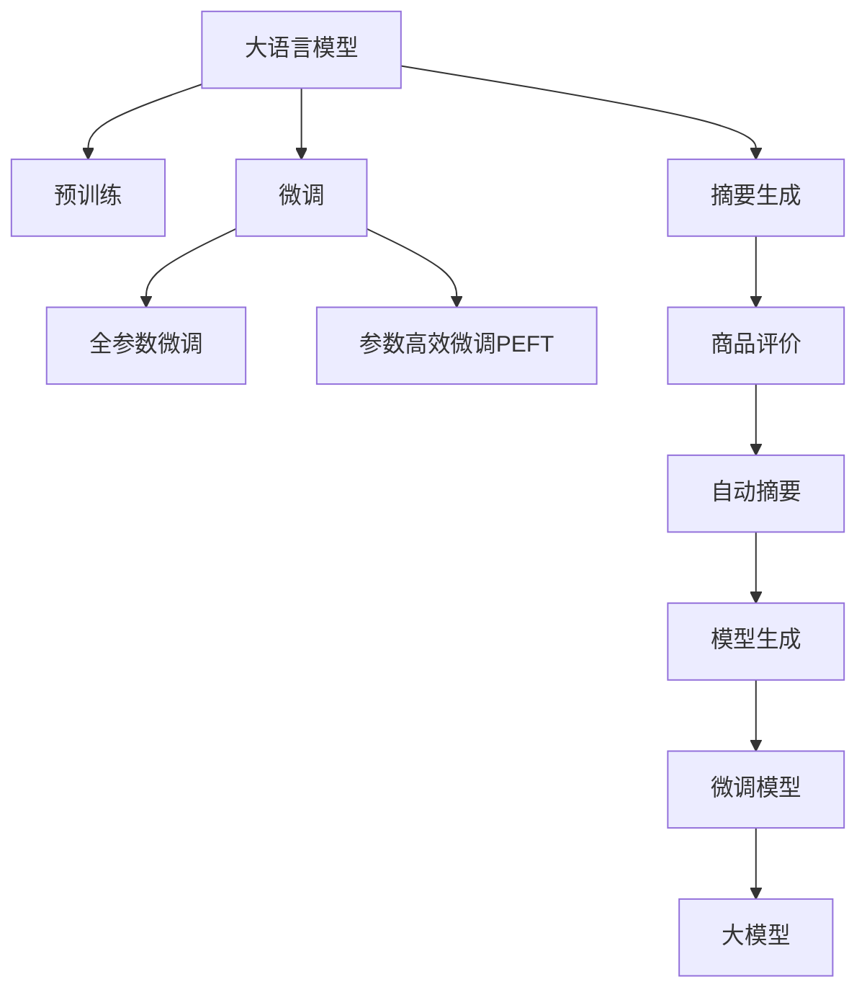

                 

# 大模型在商品评价摘要生成中的应用

> 关键词：大语言模型, 自然语言处理(NLP), 摘要生成, 商品评价, 预训练模型, 微调(Fine-Tuning), 自动摘要, 文本生成

## 1. 背景介绍

### 1.1 问题由来
随着电子商务的蓬勃发展，商品评价数据不断增多。商家和用户都希望快速获取商品的关键信息，以便决策购买或参考。然而，商品评价数据通常包含大量文字描述，提取和总结评价关键信息变得复杂且耗时。传统的自动摘要技术虽然能够提取关键信息，但生成的摘要往往难以保持原文本的连贯性和流畅性。

大语言模型，尤其是基于Transformer的模型（如GPT、BERT）的问世，为自动摘要技术带来了新的突破。这些模型通过大规模预训练，学习到了丰富的语言知识和语义表示，能够生成流畅且连贯的摘要。在大模型基础上进行微调，可以更好地适应特定的摘要任务，提升生成效果。

### 1.2 问题核心关键点
大模型在商品评价摘要生成中的应用，主要包括以下关键点：

- **预训练模型**：如BERT、GPT等，通过大规模无标签数据进行预训练，学习通用的语言表示。
- **微调**：将预训练模型作为初始化参数，通过少量标注数据进行微调，以适应特定的摘要生成任务。
- **摘要生成**：模型能够自动从原始文本中提取关键信息，生成简洁的摘要。
- **商品评价数据**：选择商品评价作为输入文本，生成相关摘要。

这些关键点共同构成了商品评价摘要生成的核心框架，使得大模型能够快速生成高效、高质量的摘要，助力电商平台的运营。

## 2. 核心概念与联系

### 2.1 核心概念概述

为更好地理解大模型在商品评价摘要生成中的应用，本节将介绍几个密切相关的核心概念：

- **大语言模型(Large Language Model, LLM)**：以自回归(如GPT)或自编码(如BERT)模型为代表的大规模预训练语言模型。通过在大规模无标签文本语料上进行预训练，学习通用的语言表示。

- **预训练(Pre-training)**：指在大规模无标签文本语料上，通过自监督学习任务训练通用语言模型的过程。常见的预训练任务包括言语建模、掩码语言模型等。

- **微调(Fine-tuning)**：指在预训练模型的基础上，使用下游任务的少量标注数据，通过有监督地训练来优化模型在该任务上的性能。通常只需要调整顶层分类器或解码器，并以较小的学习率更新全部或部分的模型参数。

- **自动摘要(Automatic Summarization)**：通过模型自动从长文本中提取出关键信息，生成简洁的摘要文本。

- **商品评价数据(E-commerce Product Reviews)**：电商平台上用户对商品的评价文本，包含产品的多个方面信息，如质量、性能、价格等。

- **序列生成(Sequence Generation)**：大模型能够自动生成流畅的文本序列，适用于生成各类文本任务。

这些核心概念之间的逻辑关系可以通过以下Mermaid流程图来展示：



这个流程图展示了大模型在商品评价摘要生成中的核心概念及其之间的关系：

1. 大语言模型通过预训练获得基础能力。
2. 微调是对预训练模型进行任务特定的优化，可以分为全参数微调和参数高效微调（PEFT）。
3. 自动摘要是从长文本中提取出关键信息，生成简洁的摘要。
4. 商品评价数据是大模型生成摘要的输入文本。
5. 微调后的模型生成商品评价摘要。

这些概念共同构成了商品评价摘要生成的技术框架，使得大模型能够更好地适应特定任务，生成高质量的摘要。

## 3. 核心算法原理 & 具体操作步骤
### 3.1 算法原理概述

大模型在商品评价摘要生成中的应用，本质上是一个有监督的序列生成过程。其核心思想是：将大语言模型视作一个强大的"文本生成器"，通过在大规模商品评价数据上进行有监督的微调，使得模型能够自动从评价中提取出关键信息，生成简洁的摘要。

形式化地，假设大语言模型为 $M_{\theta}$，其中 $\theta$ 为预训练得到的模型参数。给定商品评价数据集 $D=\{(x_i,y_i)\}_{i=1}^N, x_i \in \text{Review}, y_i \in \text{Summary}$，微调的目标是找到新的模型参数 $\hat{\theta}$，使得：

$$
\hat{\theta}=\mathop{\arg\min}_{\theta} \mathcal{L}(M_{\theta},D)
$$

其中 $\mathcal{L}$ 为针对摘要生成任务设计的损失函数，用于衡量模型预测摘要与真实摘要之间的差异。常见的损失函数包括交叉熵损失、BLEU分数等。

通过梯度下降等优化算法，微调过程不断更新模型参数 $\theta$，最小化损失函数 $\mathcal{L}$，使得模型输出逼近真实摘要。由于 $\theta$ 已经通过预训练获得了较好的初始化，因此即便在商品评价数据集 $D$ 上进行微调，也能较快收敛到理想的模型参数 $\hat{\theta}$。

### 3.2 算法步骤详解

大模型在商品评价摘要生成中的应用主要包括以下关键步骤：

**Step 1: 准备预训练模型和数据集**
- 选择合适的预训练语言模型 $M_{\theta}$ 作为初始化参数，如 BERT、GPT 等。
- 准备商品评价数据集 $D$，划分为训练集、验证集和测试集。一般要求评价与摘要分布不要差异过大。

**Step 2: 添加任务适配层**
- 根据摘要生成任务类型，在预训练模型顶层设计合适的解码器输出层和损失函数。
- 对于摘要生成任务，通常使用语言模型的解码器输出概率分布，并以负对数似然为损失函数。

**Step 3: 设置微调超参数**
- 选择合适的优化算法及其参数，如 AdamW、SGD 等，设置学习率、批大小、迭代轮数等。
- 设置正则化技术及强度，包括权重衰减、Dropout、Early Stopping 等。
- 确定冻结预训练参数的策略，如仅微调顶层，或全部参数都参与微调。

**Step 4: 执行梯度训练**
- 将训练集数据分批次输入模型，前向传播计算损失函数。
- 反向传播计算参数梯度，根据设定的优化算法和学习率更新模型参数。
- 周期性在验证集上评估模型性能，根据性能指标决定是否触发 Early Stopping。
- 重复上述步骤直到满足预设的迭代轮数或 Early Stopping 条件。

**Step 5: 测试和部署**
- 在测试集上评估微调后模型 $M_{\hat{\theta}}$ 的性能，对比微调前后的摘要生成效果。
- 使用微调后的模型对新商品评价进行摘要生成，集成到实际的应用系统中。
- 持续收集新的商品评价数据，定期重新微调模型，以适应数据分布的变化。

以上是商品评价摘要生成的一般流程。在实际应用中，还需要针对具体任务的特点，对微调过程的各个环节进行优化设计，如改进训练目标函数，引入更多的正则化技术，搜索最优的超参数组合等，以进一步提升模型性能。

### 3.3 算法优缺点

大模型在商品评价摘要生成中的应用具有以下优点：
1. 自动生成摘要：大模型可以自动从商品评价中提取关键信息，生成简洁的摘要，节省了人工摘要的时间和成本。
2. 高效性：利用大模型的预训练能力，在少量标注数据的情况下也能快速生成高质量摘要。
3. 可扩展性：模型可以在不同商品领域上进行微调，具有很强的泛化能力。
4. 可解释性：通过分析模型生成的摘要，可以更好地理解用户对商品的评价和需求。

同时，该方法也存在一定的局限性：
1. 标注成本：商品评价数据通常需要人工标注，成本较高。
2. 数据偏差：商品评价数据分布可能不均匀，导致模型学习到的语言知识有偏差。
3. 模型复杂性：大模型参数量庞大，训练和推理需要较高计算资源。
4. 可能产生误导：生成摘要存在潜在的语言歧义，可能产生误导性摘要。

尽管存在这些局限性，但就目前而言，基于大模型的方法仍然是大规模生成高质量商品评价摘要的有效手段。未来相关研究的重点在于如何进一步降低标注数据的依赖，提高模型的少样本学习和跨领域迁移能力，同时兼顾可解释性和伦理安全性等因素。

### 3.4 算法应用领域

大模型在商品评价摘要生成中的应用领域非常广泛，以下列举了几个主要应用场景：

- **电商平台**：对商品评价数据进行自动摘要，帮助用户快速了解商品信息，提升购物体验。
- **市场调研**：对用户评论进行自动摘要，提取情感倾向和关键需求，辅助市场分析和决策。
- **客户服务**：对客户反馈进行自动摘要，快速识别常见问题和投诉，提高客户服务效率。
- **社交媒体**：对社交媒体上的用户评论进行自动摘要，分析用户情绪和趋势，助力品牌运营。

除了上述这些经典应用外，大模型在商品评价摘要生成技术的应用还在不断拓展，如内容推荐、知识图谱构建、用户行为分析等，为电商平台的运营带来了新的动力。

## 4. 数学模型和公式 & 详细讲解
### 4.1 数学模型构建

本节将使用数学语言对大模型在商品评价摘要生成中的应用过程进行更加严格的刻画。

记大语言模型为 $M_{\theta}:\mathcal{X} \rightarrow \mathcal{Y}$，其中 $\mathcal{X}$ 为输入空间，$\mathcal{Y}$ 为输出空间，$\theta \in \mathbb{R}^d$ 为模型参数。假设微调任务的训练集为 $D=\{(x_i,y_i)\}_{i=1}^N, x_i \in \text{Review}, y_i \in \text{Summary}$。

定义模型 $M_{\theta}$ 在输入 $x_i$ 上的损失函数为 $\ell(M_{\theta}(x_i),y_i)$，则在数据集 $D$ 上的经验风险为：

$$
\mathcal{L}(\theta) = \frac{1}{N}\sum_{i=1}^N \ell(M_{\theta}(x_i),y_i)
$$

微调的优化目标是最小化经验风险，即找到最优参数：

$$
\theta^* = \mathop{\arg\min}_{\theta} \mathcal{L}(\theta)
$$

在实践中，我们通常使用基于梯度的优化算法（如SGD、Adam等）来近似求解上述最优化问题。设 $\eta$ 为学习率，$\lambda$ 为正则化系数，则参数的更新公式为：

$$
\theta \leftarrow \theta - \eta \nabla_{\theta}\mathcal{L}(\theta) - \eta\lambda\theta
$$

其中 $\nabla_{\theta}\mathcal{L}(\theta)$ 为损失函数对参数 $\theta$ 的梯度，可通过反向传播算法高效计算。

### 4.2 公式推导过程

以下我们以生成式模型为例，推导基于生成式模型的摘要生成损失函数及其梯度的计算公式。

假设模型 $M_{\theta}$ 在输入 $x$ 上的输出为 $\hat{y}=M_{\theta}(x) \in [0,1]$，表示样本属于某个类别的概率。真实标签 $y \in \{0,1\}$。则二分类交叉熵损失函数定义为：

$$
\ell(M_{\theta}(x),y) = -[y\log \hat{y} + (1-y)\log (1-\hat{y})]
$$

将其代入经验风险公式，得：

$$
\mathcal{L}(\theta) = -\frac{1}{N}\sum_{i=1}^N [y_i\log M_{\theta}(x_i)+(1-y_i)\log(1-M_{\theta}(x_i))]
$$

根据链式法则，损失函数对参数 $\theta_k$ 的梯度为：

$$
\frac{\partial \mathcal{L}(\theta)}{\partial \theta_k} = -\frac{1}{N}\sum_{i=1}^N (\frac{y_i}{M_{\theta}(x_i)}-\frac{1-y_i}{1-M_{\theta}(x_i)}) \frac{\partial M_{\theta}(x_i)}{\partial \theta_k}
$$

其中 $\frac{\partial M_{\theta}(x_i)}{\partial \theta_k}$ 可进一步递归展开，利用自动微分技术完成计算。

在得到损失函数的梯度后，即可带入参数更新公式，完成模型的迭代优化。重复上述过程直至收敛，最终得到适应摘要生成任务的最优模型参数 $\theta^*$。

## 5. 项目实践：代码实例和详细解释说明
### 5.1 开发环境搭建

在进行商品评价摘要生成实践前，我们需要准备好开发环境。以下是使用Python进行PyTorch开发的环境配置流程：

1. 安装Anaconda：从官网下载并安装Anaconda，用于创建独立的Python环境。

2. 创建并激活虚拟环境：
```bash
conda create -n pytorch-env python=3.8 
conda activate pytorch-env
```

3. 安装PyTorch：根据CUDA版本，从官网获取对应的安装命令。例如：
```bash
conda install pytorch torchvision torchaudio cudatoolkit=11.1 -c pytorch -c conda-forge
```

4. 安装Transformers库：
```bash
pip install transformers
```

5. 安装各类工具包：
```bash
pip install numpy pandas scikit-learn matplotlib tqdm jupyter notebook ipython
```

完成上述步骤后，即可在`pytorch-env`环境中开始微调实践。

### 5.2 源代码详细实现

下面我们以生成式模型（如GPT）为例，给出使用Transformers库对商品评价数据进行微调的PyTorch代码实现。

首先，定义数据处理函数：

```python
from transformers import BertTokenizer, AutoTokenizer, AutoModelForSeq2SeqLM
import torch
import torch.nn as nn

class ReviewDataset(Dataset):
    def __init__(self, reviews, summaries, tokenizer):
        self.reviews = reviews
        self.summaries = summaries
        self.tokenizer = tokenizer
        
    def __len__(self):
        return len(self.reviews)
    
    def __getitem__(self, idx):
        review = self.reviews[idx]
        summary = self.summaries[idx]
        
        encoding = self.tokenizer(review, truncation=True, padding='max_length', max_length=512, return_tensors='pt')
        input_ids = encoding['input_ids']
        attention_mask = encoding['attention_mask']
        
        return {
            'input_ids': input_ids,
            'attention_mask': attention_mask,
            'target_ids': self.tokenizer(summary, padding='max_length', truncation=True, max_length=512, return_tensors='pt')['input_ids']
        }
```

然后，定义模型和优化器：

```python
from transformers import AdamW

tokenizer = AutoTokenizer.from_pretrained('gpt2')
model = AutoModelForSeq2SeqLM.from_pretrained('gpt2')
optimizer = AdamW(model.parameters(), lr=1e-5)
```

接着，定义训练和评估函数：

```python
def train_epoch(model, dataloader, optimizer):
    model.train()
    epoch_loss = 0
    for batch in dataloader:
        input_ids = batch['input_ids'].to(device)
        attention_mask = batch['attention_mask'].to(device)
        target_ids = batch['target_ids'].to(device)
        outputs = model(input_ids, attention_mask=attention_mask, decoder_input_ids=target_ids)
        loss = outputs.loss
        epoch_loss += loss.item()
        loss.backward()
        optimizer.step()
    return epoch_loss / len(dataloader)

def evaluate(model, dataloader):
    model.eval()
    preds, labels = [], []
    with torch.no_grad():
        for batch in dataloader:
            input_ids = batch['input_ids'].to(device)
            attention_mask = batch['attention_mask'].to(device)
            target_ids = batch['target_ids'].to(device)
            outputs = model(input_ids, attention_mask=attention_mask, decoder_input_ids=target_ids)
            preds.append(outputs.logits.argmax(dim=-1))
            labels.append(target_ids)
        
    print('Evaluation Results: ')
    print(classification_report(torch.tensor(labels), torch.tensor(preds)))
```

最后，启动训练流程并在测试集上评估：

```python
epochs = 5
batch_size = 16
device = torch.device('cuda') if torch.cuda.is_available() else torch.device('cpu')

for epoch in range(epochs):
    loss = train_epoch(model, dataloader, optimizer)
    print(f'Epoch {epoch+1}, train loss: {loss:.3f}')
    
    print(f'Epoch {epoch+1}, dev results:')
    evaluate(model, dataloader)

print('Test results:')
evaluate(model, test_dataloader)
```

以上就是使用PyTorch对商品评价数据进行微调的完整代码实现。可以看到，得益于Transformers库的强大封装，我们可以用相对简洁的代码完成生成式模型的加载和微调。

### 5.3 代码解读与分析

让我们再详细解读一下关键代码的实现细节：

**ReviewDataset类**：
- `__init__`方法：初始化商品评价文本、摘要文本和分词器等关键组件。
- `__len__`方法：返回数据集的样本数量。
- `__getitem__`方法：对单个样本进行处理，将文本输入编码为token ids，将摘要编码成target ids，并对其进行定长padding，最终返回模型所需的输入。

**模型选择和优化器**：
- 使用GPT-2作为预训练模型，加载模型和分词器，定义优化器及其参数。

**训练和评估函数**：
- 使用PyTorch的DataLoader对数据集进行批次化加载，供模型训练和推理使用。
- 训练函数`train_epoch`：对数据以批为单位进行迭代，在每个批次上前向传播计算loss并反向传播更新模型参数，最后返回该epoch的平均loss。
- 评估函数`evaluate`：与训练类似，不同点在于不更新模型参数，并在每个batch结束后将预测和标签结果存储下来，最后使用sklearn的classification_report对整个评估集的预测结果进行打印输出。

**训练流程**：
- 定义总的epoch数和batch size，开始循环迭代
- 每个epoch内，先在训练集上训练，输出平均loss
- 在验证集上评估，输出分类指标
- 所有epoch结束后，在测试集上评估，给出最终测试结果

可以看到，PyTorch配合Transformers库使得商品评价摘要生成的代码实现变得简洁高效。开发者可以将更多精力放在数据处理、模型改进等高层逻辑上，而不必过多关注底层的实现细节。

当然，工业级的系统实现还需考虑更多因素，如模型的保存和部署、超参数的自动搜索、更灵活的任务适配层等。但核心的微调范式基本与此类似。

## 6. 实际应用场景
### 6.1 电商平台

商品评价数据在电商平台上极为丰富，利用大模型进行摘要生成，可以极大地提升用户浏览体验。商家和用户可以快速获取商品的关键信息，如价格、质量、性能等，便于决策购买。

在技术实现上，可以收集电商平台上所有商品的用户评价数据，将其作为微调任务的数据集。通过微调生成的摘要文本，可以插入商品页面上，替代传统的固定式商品描述，提供更加生动和自然的用户评价信息。商家可以根据生成摘要的情感倾向，对商品进行筛选和优化，提升用户体验和满意度。

### 6.2 市场调研

市场调研机构需要对大量用户评论进行数据分析，以了解市场趋势和用户需求。传统的手工分析方法费时费力，效率低下，难以应对海量的评论数据。基于大模型的摘要生成技术，可以快速从海量评论中提取关键信息，生成摘要报告。

在具体应用中，市场调研机构可以收集用户对不同商品类别的评价数据，对评价文本进行预处理和分词，作为微调任务的输入。生成的摘要报告可以作为市场分析的基础材料，帮助机构更好地理解市场动态和用户需求。

### 6.3 客户服务

客户服务部门需要处理大量的用户反馈和投诉，传统的人工处理方式效率低下，难以满足高峰期的需求。通过基于大模型的摘要生成技术，可以快速从用户反馈中提取关键信息，生成摘要报告。

在具体应用中，客户服务部门可以收集用户对不同服务渠道的反馈数据，对评价文本进行预处理和分词，作为微调任务的输入。生成的摘要报告可以自动分配给相关客服人员，提高问题解决效率。

### 6.4 社交媒体

社交媒体平台上用户评论数据丰富，利用大模型进行摘要生成，可以快速从海量评论中提取关键信息，生成摘要报告。

在具体应用中，社交媒体平台可以收集用户对不同产品或话题的评论数据，对评价文本进行预处理和分词，作为微调任务的输入。生成的摘要报告可以帮助平台更好地理解用户情绪和趋势，优化内容推荐和话题讨论。

## 7. 工具和资源推荐
### 7.1 学习资源推荐

为了帮助开发者系统掌握大模型在商品评价摘要生成中的应用，这里推荐一些优质的学习资源：

1. 《Sequence to Sequence Learning with Neural Networks》书籍：由Ian Goodfellow等著，系统介绍了序列生成任务的理论和算法，是学习序列生成任务的必读书籍。

2. 《Natural Language Processing Specialization》课程：Coursera上的NLP课程，涵盖NLP领域的诸多经典算法，适合初学者入门。

3. 《Transformers from Scratch》博客：由NLP专家撰写，详细介绍了Transformer模型的原理和实现细节，是学习大模型的优秀资源。

4. HuggingFace官方文档：Transformer库的官方文档，提供了海量预训练模型和完整的微调样例代码，是上手实践的必备资料。

5. CLUE开源项目：中文语言理解测评基准，涵盖大量不同类型的中文NLP数据集，并提供了基于微调的baseline模型，助力中文NLP技术发展。

通过对这些资源的学习实践，相信你一定能够快速掌握大模型在商品评价摘要生成中的应用，并用于解决实际的NLP问题。
###  7.2 开发工具推荐

高效的开发离不开优秀的工具支持。以下是几款用于大模型微调开发的常用工具：

1. PyTorch：基于Python的开源深度学习框架，灵活动态的计算图，适合快速迭代研究。大部分预训练语言模型都有PyTorch版本的实现。

2. TensorFlow：由Google主导开发的开源深度学习框架，生产部署方便，适合大规模工程应用。同样有丰富的预训练语言模型资源。

3. Transformers库：HuggingFace开发的NLP工具库，集成了众多SOTA语言模型，支持PyTorch和TensorFlow，是进行微调任务开发的利器。

4. Weights & Biases：模型训练的实验跟踪工具，可以记录和可视化模型训练过程中的各项指标，方便对比和调优。与主流深度学习框架无缝集成。

5. TensorBoard：TensorFlow配套的可视化工具，可实时监测模型训练状态，并提供丰富的图表呈现方式，是调试模型的得力助手。

6. Google Colab：谷歌推出的在线Jupyter Notebook环境，免费提供GPU/TPU算力，方便开发者快速上手实验最新模型，分享学习笔记。

合理利用这些工具，可以显著提升大模型微调任务的开发效率，加快创新迭代的步伐。

### 7.3 相关论文推荐

大模型在商品评价摘要生成中的应用源于学界的持续研究。以下是几篇奠基性的相关论文，推荐阅读：

1. Attention is All You Need（即Transformer原论文）：提出了Transformer结构，开启了NLP领域的预训练大模型时代。

2. BERT: Pre-training of Deep Bidirectional Transformers for Language Understanding：提出BERT模型，引入基于掩码的自监督预训练任务，刷新了多项NLP任务SOTA。

3. Sequence to Sequence Learning with Neural Networks：提出Seq2Seq模型，将自然语言处理中的序列生成任务转化为神经网络模型。

4. Transformer-XL: Attentive Language Models Beyond a Fixed-Length Context：提出Transformer-XL模型，解决了长序列处理中的问题。

5. SQuAD: 100,000+ Question Answering Dataset for Research and Instruction：提出SQuAD数据集，用于机器阅读理解任务的评测。

6. T5: Exploring the Limits of Transfer Learning with a Unified Text-to-Text Transformer：提出T5模型，通过统一的文本生成框架，实现了多项NLP任务的性能突破。

这些论文代表了大模型在商品评价摘要生成领域的发展脉络。通过学习这些前沿成果，可以帮助研究者把握学科前进方向，激发更多的创新灵感。

## 8. 总结：未来发展趋势与挑战
### 8.1 总结

本文对大模型在商品评价摘要生成中的应用进行了全面系统的介绍。首先阐述了商品评价数据处理和摘要生成的重要性，明确了大语言模型微调在该任务中的应用价值。其次，从原理到实践，详细讲解了大模型在商品评价摘要生成中的应用过程，给出了微调任务开发的完整代码实例。同时，本文还广泛探讨了大模型在商品评价摘要生成技术的应用前景，展示了该技术的广泛潜力。此外，本文精选了微调技术的各类学习资源，力求为开发者提供全方位的技术指引。

通过本文的系统梳理，可以看到，大模型在商品评价摘要生成技术中具有重要的应用价值。这种技术不仅可以提高商品评价的阅读效率，而且可以提取关键信息，提升商家和用户决策的效率和质量。未来的研究将在基于大模型的序列生成技术上不断深化，为电商平台的运营带来更多创新。

### 8.2 未来发展趋势

展望未来，大模型在商品评价摘要生成中的应用将呈现以下几个发展趋势：

1. 模型规模继续增大。随着算力成本的下降和数据规模的扩张，大语言模型的参数量还将持续增长。超大模型的语言理解能力和生成能力将进一步提升，能够更好地适应复杂的摘要生成任务。

2. 模型泛化能力增强。通过更多的数据集和任务进行微调，大模型的泛化能力将显著提高，能够生成更加多样和准确的摘要。

3. 生成质量提升。借助大模型的预训练能力和微调技术，摘要生成的流畅性和连贯性将进一步提升，生成效果更加接近人类书写。

4. 技术融合加速。大模型将与其他AI技术（如知识图谱、逻辑推理等）深度融合，提升生成摘要的逻辑性和准确性。

5. 应用场景扩展。除了电商、市场调研、客户服务等领域，大模型在更多领域的应用将不断拓展，如新闻摘要、法律文书生成等。

这些趋势凸显了大模型在商品评价摘要生成中的巨大潜力和发展方向。未来，伴随大语言模型微调技术的不断进步，基于大模型的摘要生成技术将在更多领域发挥重要作用，推动人工智能技术的发展和应用。

### 8.3 面临的挑战

尽管大模型在商品评价摘要生成中已经取得了一定的成就，但在迈向更加智能化、普适化应用的过程中，它仍面临诸多挑战：

1. 标注数据质量：商品评价数据质量参差不齐，标注成本较高。如何提升标注数据的质量和数量，是大模型应用的关键问题。

2. 模型鲁棒性：大模型面对噪声、恶意输入等可能存在鲁棒性不足的问题。如何提高模型的鲁棒性，保证摘要生成的准确性和可靠性，仍需进一步研究。

3. 模型复杂性：大模型参数量庞大，训练和推理需要较高计算资源。如何降低模型复杂性，提高生成效率，是未来研究的重点。

4. 公平性和伦理性：大模型可能学习到数据中的偏见和有害信息，生成的摘要可能存在误导性。如何保证摘要生成的公平性和伦理性，是模型应用的重要考量。

5. 知识整合能力：大模型需要更好地整合外部知识库，提升摘要生成的准确性和适用性。如何优化知识整合能力，是大模型微调的核心挑战之一。

这些挑战凸显了大模型在商品评价摘要生成中的应用仍需进一步优化和改进。未来研究需要在数据质量、模型鲁棒性、知识整合能力等方面进行深入探索，以实现更大范围的应用。

### 8.4 研究展望

面对大模型在商品评价摘要生成中面临的挑战，未来的研究需要在以下几个方面寻求新的突破：

1. 数据增强技术：通过数据增强技术提升商品评价数据集的多样性和质量，降低标注数据的依赖。

2. 参数高效微调：开发更加参数高效的微调方法，减少模型的计算资源消耗，提高生成效率。

3. 对抗训练：通过对抗训练提升大模型的鲁棒性，保证生成摘要的可靠性。

4. 知识图谱融合：将知识图谱与大模型深度融合，提升摘要生成的准确性和适用性。

5. 逻辑推理能力：提升大模型的逻辑推理能力，使其能够从文本中提取更深层次的语义信息。

6. 伦理性引导：通过伦理导向的训练策略，提升生成摘要的伦理性，避免有害信息的传播。

这些研究方向将推动大模型在商品评价摘要生成中的应用，提升其生成效果和可靠性，使其更好地服务于电商平台的运营和发展。

## 9. 附录：常见问题与解答

**Q1：大模型在商品评价摘要生成中是否适用于所有商品类别？**

A: 大模型在商品评价摘要生成中的应用具有很强的泛化能力，适用于大多数商品类别。不同商品类别的评价内容虽然有所差异，但大模型可以通过微调学习到通用的摘要生成规律，生成适应不同类别的摘要。

**Q2：大模型在商品评价摘要生成中是否需要预处理数据？**

A: 是的，商品评价数据通常包含噪声、拼写错误等问题，需要进行预处理。预处理的步骤包括文本清洗、分词、去除停用词等，确保输入数据的质量和格式符合模型要求。

**Q3：大模型在商品评价摘要生成中的训练周期有多长？**

A: 训练周期取决于数据集的大小、模型的规模以及训练设备的性能。一般来说，大模型在商品评价摘要生成中的训练周期较长，可能需要数天甚至数周。

**Q4：大模型在商品评价摘要生成中是否可以与其他NLP任务相结合？**

A: 是的，大模型在商品评价摘要生成中可以与其他NLP任务相结合，如问答系统、情感分析等。通过多任务联合微调，可以提高模型在不同任务上的表现。

**Q5：大模型在商品评价摘要生成中的模型选择有哪些？**

A: 目前主流的预训练大模型如BERT、GPT、T5等都可以用于商品评价摘要生成。不同的模型有不同的特点和优势，选择合适的模型可以提高生成摘要的质量和效率。

通过以上问题的解答，相信读者已经对大模型在商品评价摘要生成中的应用有了更全面的了解。希望这些内容能对从事电商领域的技术开发者和研究人员有所帮助，共同推动大模型在NLP领域的应用。

---

作者：禅与计算机程序设计艺术 / Zen and the Art of Computer Programming

