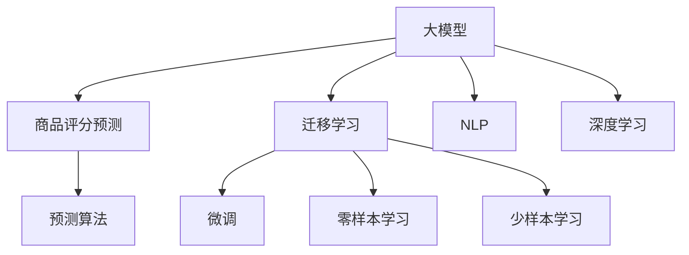

                 

# 大模型在商品评分预测中的应用

> 关键词：大模型, 商品评分, 预测算法, 深度学习, PyTorch, 自然语言处理(NLP), 迁移学习

## 1. 背景介绍

### 1.1 问题由来
商品评分预测是电子商务领域中一项重要的应用任务。通过对消费者评论文本的分析，可以挖掘商品的用户满意度，为电商平台提供决策依据，优化商品列表和营销策略。传统方法往往采用基于统计学的方法，如回归分析、因子分析等，但存在计算复杂度高、特征提取能力弱等局限性。近年来，随着深度学习技术的发展，基于大模型的文本处理技术逐渐引入商品评分预测领域，显著提升了预测的精度和鲁棒性。

## 2. 核心概念与联系

### 2.1 核心概念概述

为更好地理解大模型在商品评分预测中的应用，本节将介绍几个密切相关的核心概念：

- 大模型：指以Transformer结构为基础的预训练语言模型，如BERT、GPT、T5等。这些模型通过在大规模无标签文本语料上进行自监督学习，获得了强大的语言理解和生成能力。
- 商品评分预测：指通过分析消费者对商品的评论文本，预测其评分的过程。常用于电商平台的商品推荐、用户画像构建、市场调研等场景。
- 迁移学习：指在预训练模型上微调任务相关的模型，以适应特定任务的过程。常见的迁移学习方法包括微调、零样本学习、少样本学习等。
- 自然语言处理(NLP)：研究计算机如何处理和理解自然语言，包括文本分类、情感分析、实体识别等任务。
- 深度学习：一种基于神经网络架构的机器学习技术，广泛应用于图像识别、语音识别、自然语言处理等领域。

这些核心概念之间的逻辑关系可以通过以下Mermaid流程图来展示：



这个流程图展示了大模型与商品评分预测任务之间的核心联系：

1. 大模型通过预训练获得语言表示能力，能够处理多种自然语言处理任务。
2. 通过迁移学习方法，在大模型上微调或进行零样本学习，使得模型适应特定任务。
3. 基于迁移学习的方法可以进一步分为微调、零样本学习、少样本学习等不同技术手段。
4. NLP和深度学习技术为大模型提供了理论和算法支持。
5. 预测算法是商品评分预测任务的具体实现手段，包括传统统计方法、机器学习算法、深度学习算法等。

## 3. 核心算法原理 & 具体操作步骤
### 3.1 算法原理概述

基于大模型的商品评分预测方法，主要利用预训练语言模型对评论文本进行编码，通过分类器或回归器等预测算法，输出商品的评分。其核心思想是通过迁移学习，在大模型上微调任务相关的模型，以适应商品评分预测任务。

### 3.2 算法步骤详解

1. **数据准备**：收集商品的评论文本和对应的评分标签。通常情况下，评论文本和评分标签需要经过一定的清洗和标注，以提高数据质量。

2. **模型选择**：选择合适的预训练语言模型，如BERT、GPT等。模型需要与任务的数据分布和特征需求相匹配。

3. **微调设置**：根据任务的特点，设计任务的输出层和损失函数。对于分类任务，通常使用交叉熵损失函数；对于回归任务，通常使用均方误差损失函数。

4. **模型训练**：使用训练数据对模型进行微调。微调的超参数包括学习率、批大小、迭代轮数等。

5. **模型评估**：在验证集上评估模型的性能。常用的评价指标包括精确率、召回率、F1分数、平均绝对误差等。

6. **模型部署**：将训练好的模型应用于预测任务。通常情况下，需要对模型进行一定的优化，如裁剪、量化等，以提高预测效率。

### 3.3 算法优缺点

基于大模型的商品评分预测方法具有以下优点：

- **精度高**：预训练模型能够捕捉到语言中丰富的语义信息，通过微调可以进一步提升预测的精度。
- **泛化能力强**：大模型具有较好的泛化能力，能够适应不同的商品和评论语境。
- **适应性广**：大模型可以用于多种商品评分预测任务，如基于文本的评分预测、情感分析等。

同时，该方法也存在一些局限性：

- **数据依赖性高**：需要大量标注数据进行微调，获取高质量标注数据的成本较高。
- **模型复杂度高**：大模型参数量较大，计算资源和内存消耗较高。
- **训练时间长**：大模型的训练时间较长，需要较长的开发周期。

## 4. 数学模型和公式 & 详细讲解 & 举例说明

### 4.1 数学模型构建

假设商品评论文本为 $x$，对应的商品评分为 $y$。在大模型上进行微调的数学模型可以表示为：

$$
M_{\theta}(x) = \text{softmax}(W_L A_{L-1} \ldots A_1 W_0 x + b)
$$

其中 $W$ 为模型参数，$A$ 为模型的自注意力机制，$\theta$ 为模型所有参数的集合。模型的输出层为 softmax 函数，将模型输出映射到 [0,1] 的评分区间。

假设模型的损失函数为交叉熵损失函数，则目标函数为：

$$
L(\theta) = \frac{1}{N} \sum_{i=1}^N \ell(y_i, M_{\theta}(x_i))
$$

其中 $\ell$ 为交叉熵损失函数，$N$ 为样本数量。

### 4.2 公式推导过程

在微调过程中，模型的损失函数可以表示为：

$$
L(\theta) = \frac{1}{N} \sum_{i=1}^N -y_i \log \text{softmax}(W_L A_{L-1} \ldots A_1 W_0 x_i + b)
$$

对 $\theta$ 求导，得到梯度：

$$
\frac{\partial L(\theta)}{\partial \theta} = -\frac{1}{N} \sum_{i=1}^N \frac{\partial \ell(y_i, M_{\theta}(x_i))}{\partial M_{\theta}(x_i)} \frac{\partial M_{\theta}(x_i)}{\partial \theta}
$$

其中 $\frac{\partial M_{\theta}(x_i)}{\partial \theta}$ 可以通过链式法则和自动微分技术计算得到。

### 4.3 案例分析与讲解

以下以BERT模型为例，给出商品评分预测的微调过程：

1. **数据准备**：假设我们已经收集了商品的评论文本和评分数据，并将其划分为训练集、验证集和测试集。

2. **模型选择**：选择BERT模型作为预训练模型，并使用其提供的tokenizer将评论文本转化为可输入的形式。

3. **微调设置**：使用交叉熵损失函数，设计模型的输出层为线性分类器。

4. **模型训练**：使用训练集对模型进行微调，设定学习率为 $2e-5$，批大小为 $32$，迭代轮数为 $10$。在训练过程中，需要保存模型参数，以便后续评估和部署。

5. **模型评估**：在验证集上评估模型的性能，使用F1分数和精确率作为评价指标。

6. **模型部署**：将训练好的模型应用于测试集，输出商品的评分。

## 5. 项目实践：代码实例和详细解释说明

### 5.1 开发环境搭建

1. **环境安装**：安装Python 3.8及以上版本，安装PyTorch、TensorFlow等深度学习框架。

2. **数据处理**：使用Pandas、Numpy等库对评论文本进行清洗、标注和划分。

3. **模型加载**：使用Transformers库加载预训练模型BERT，并设置必要的超参数。

4. **模型微调**：使用PyTorch的DataLoader对训练数据进行批处理，并使用Adam优化器进行模型微调。

5. **模型评估**：在验证集上评估模型的性能，使用Scikit-learn库进行评价指标的计算。

### 5.2 源代码详细实现

以下是一个使用PyTorch和Transformers库进行商品评分预测的微调代码示例：

```python
import torch
import torch.nn as nn
import torch.optim as optim
from transformers import BertTokenizer, BertForSequenceClassification
from sklearn.metrics import f1_score, precision_score

# 数据准备
# 假设已经收集好了评论文本和评分标签，并将其划分为训练集、验证集和测试集

# 模型选择
model = BertForSequenceClassification.from_pretrained('bert-base-uncased', num_labels=5)

# 微调设置
tokenizer = BertTokenizer.from_pretrained('bert-base-uncased')
max_len = 512

# 模型训练
device = torch.device('cuda' if torch.cuda.is_available() else 'cpu')
model.to(device)
optimizer = optim.Adam(model.parameters(), lr=2e-5)
criterion = nn.CrossEntropyLoss()

for epoch in range(10):
    model.train()
    for i, (inputs, labels) in enumerate(train_loader):
        inputs = inputs.to(device)
        labels = labels.to(device)
        outputs = model(inputs)
        loss = criterion(outputs, labels)
        optimizer.zero_grad()
        loss.backward()
        optimizer.step()

    model.eval()
    with torch.no_grad():
        for i, (inputs, labels) in enumerate(valid_loader):
            inputs = inputs.to(device)
            labels = labels.to(device)
            outputs = model(inputs)
            loss = criterion(outputs, labels)
            predictions = outputs.argmax(dim=1)
            precision = precision_score(labels, predictions, average='micro')
            f1 = f1_score(labels, predictions, average='micro')
            print(f'Epoch {epoch+1}, precision={precision:.4f}, f1={f1:.4f}')
```

### 5.3 代码解读与分析

1. **数据准备**：使用Pandas库读取评论文本和评分标签，并进行清洗和标注。

2. **模型选择**：使用BertForSequenceClassification模型作为预测模型，设置标签数量为5。

3. **微调设置**：加载BertTokenizer，并设置最大输入长度为512。

4. **模型训练**：使用Adam优化器进行模型微调，并设置学习率为 $2e-5$。

5. **模型评估**：在验证集上计算模型的精确率和F1分数，使用Scikit-learn库进行计算。

## 6. 实际应用场景

### 6.1 电商推荐系统

电商推荐系统是商品评分预测技术的重要应用场景。通过分析消费者评论，推荐系统可以发现用户对商品的使用体验和满意度，并据此推荐相似的商品。

在实际应用中，可以将商品评分预测模型嵌入到推荐系统中，实时分析用户评价并调整推荐策略，以提升用户的购物体验。

### 6.2 用户画像构建

用户画像构建是电商平台理解用户需求、优化服务的重要手段。通过对商品评论的分析，可以了解用户的喜好和偏好，从而构建更精准的用户画像。

例如，通过分析不同年龄、性别、地域的用户对不同商品的评分，可以发现用户的特定偏好，从而进行更精准的市场细分。

### 6.3 市场调研

市场调研是电商平台了解市场动向、制定策略的重要工具。通过分析大量的商品评论，可以发现市场的热点和趋势，并据此调整产品的开发和营销策略。

例如，通过分析某个新产品的评论，可以发现用户对其功能、价格、质量等方面的满意度，从而指导产品的优化和改进。

## 7. 工具和资源推荐

### 7.1 学习资源推荐

1. **《深度学习》教材**：由Ian Goodfellow、Yoshua Bengio和Aaron Courville合著的经典深度学习教材，详细介绍了深度学习的基础理论和应用。

2. **Coursera深度学习课程**：由斯坦福大学Andrew Ng教授主讲的在线课程，深入浅出地介绍了深度学习的理论和实践。

3. **PyTorch官方文档**：PyTorch的官方文档，提供了详细的API和样例代码，是进行深度学习开发的必备资源。

4. **Kaggle竞赛平台**：一个数据科学竞赛平台，提供了大量的数据集和竞赛任务，是实践深度学习技能的好地方。

5. **TensorFlow官方文档**：TensorFlow的官方文档，提供了丰富的API和样例代码，适合进行深度学习开发。

### 7.2 开发工具推荐

1. **Jupyter Notebook**：一个交互式的Python编程环境，适合进行深度学习算法的研究和实验。

2. **Git**：一个版本控制系统，适合进行代码的协同开发和管理。

3. **PyCharm**：一个Python IDE，提供丰富的代码补全和调试功能，适合进行深度学习项目的开发。

4. **Visual Studio Code**：一个轻量级的代码编辑器，支持多种编程语言和扩展，适合进行深度学习开发。

5. **GitHub**：一个代码托管平台，适合进行代码的存储和分享。

### 7.3 相关论文推荐

1. **Attention Is All You Need**：提出了Transformer结构，奠定了深度学习在NLP领域的地位。

2. **BERT: Pre-training of Deep Bidirectional Transformers for Language Understanding**：提出了BERT模型，通过掩码语言模型进行预训练，显著提升了NLP任务的精度。

3. **BigQuery ML**：介绍了一种基于深度学习进行商品评分预测的方法，在电商推荐系统中取得了不错的效果。

4. **Multi-Task Learning with Continuous Label Space**：提出了一种多任务学习的方法，通过联合训练多个任务，提升了商品评分预测的精度。

5. **A Survey of Big Data, Machine Learning, and AI Applications in Retail**：介绍了大数据、机器学习和AI在零售领域的应用，包括商品评分预测等。

## 8. 总结：未来发展趋势与挑战

### 8.1 研究成果总结

大模型在商品评分预测中的应用，已经在电商推荐系统、用户画像构建、市场调研等领域取得了显著效果。通过迁移学习，大模型能够捕捉到语言中的丰富语义信息，提升预测的精度和鲁棒性。然而，大模型的高参数量、高计算资源需求等问题，仍需要进一步解决。

### 8.2 未来发展趋势

1. **模型规模持续增大**：未来预训练语言模型的参数量将继续增长，从而提升商品评分预测的精度和鲁棒性。

2. **微调方法日趋多样**：除了传统的全参数微调，未来的微调方法将更加多样化，如Adapter、LoRA等参数高效微调方法，将在不增加模型参数量的情况下，提升微调效果。

3. **持续学习成为常态**：随着市场环境和用户需求的变化，微调模型需要持续学习新知识，以保持其性能。

4. **少样本学习和零样本学习**：未来的微调方法将更好地利用大模型的语言理解能力，通过巧妙的任务描述，实现少样本学习和零样本学习。

5. **多模态微调崛起**：未来的微调方法将融合视觉、语音等多模态数据，提升商品评分预测的精度和泛化能力。

### 8.3 面临的挑战

1. **数据依赖性高**：获取高质量标注数据仍是一个挑战，需要进一步降低微调对标注样本的依赖。

2. **模型鲁棒性不足**：面对不同的商品和评论语境，微调模型的泛化能力仍有待提升。

3. **计算资源消耗大**：大模型的参数量和计算资源需求较大，需要优化模型结构和计算图。

4. **过拟合风险**：微调过程中容易发生过拟合，需要采用数据增强、正则化等方法来缓解。

5. **推理效率有待提高**：大模型的推理速度较慢，需要进一步优化模型结构和算法，提升推理效率。

### 8.4 研究展望

未来，大模型在商品评分预测中的应用将更加广泛和深入。以下是一些研究展望：

1. **融合因果推理**：引入因果推理方法，提升商品评分预测的精度和鲁棒性。

2. **引入先验知识**：将符号化的先验知识，如知识图谱、逻辑规则等，与神经网络模型进行融合，提升预测的准确性。

3. **多模态数据融合**：将视觉、语音等多模态数据与文本数据进行融合，提升预测的精度和泛化能力。

4. **算法可解释性**：提升微调模型的可解释性，确保算法的透明性和可信性。

5. **模型鲁棒性提升**：提升模型在不同数据分布下的泛化能力，避免灾难性遗忘。

总之，大模型在商品评分预测中的应用将为电商推荐系统、用户画像构建、市场调研等领域带来新的突破，为电商行业的数字化转型提供技术支持。

## 9. 附录：常见问题与解答

**Q1: 大模型在商品评分预测中是否需要标注数据？**

A: 是的，虽然大模型具有很强的泛化能力，但需要通过标注数据进行微调，以适应特定的商品和评论语境。标注数据的质量和数量对微调效果有很大的影响。

**Q2: 微调过程中如何选择学习率？**

A: 学习率的选择是一个关键问题，一般建议从较小的值开始，如 $2e-5$，然后根据实验结果逐步调整。同时，可以使用warmup策略，在训练初期使用较小的学习率，然后逐渐过渡到预设值。

**Q3: 如何缓解微调过程中的过拟合问题？**

A: 缓解过拟合问题的方法包括数据增强、正则化、早停等。数据增强可以通过回译、近义替换等方式丰富训练集。正则化可以通过L2正则、Dropout等方法，防止模型过度适应训练数据。早停可以通过监控验证集上的性能指标，防止模型过拟合。

**Q4: 如何将大模型部署到生产环境中？**

A: 将大模型部署到生产环境需要进行优化，如模型裁剪、量化等。模型裁剪可以去除不必要的层和参数，减小模型尺寸，提高推理速度。量化可以将浮点模型转为定点模型，压缩存储空间，提高计算效率。同时，需要考虑模型的可解释性、安全性等问题。

---

作者：禅与计算机程序设计艺术 / Zen and the Art of Computer Programming

