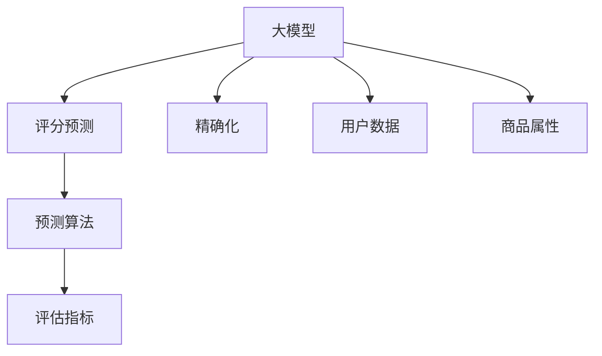

                 

# 大模型在商品评分预测精确化中的应用

> 关键词：大模型,商品评分,精确化,预测算法,评估指标,应用场景,优化策略

## 1. 背景介绍

在电商领域，商品评分预测是一个至关重要的环节。准确的评分预测不仅能够帮助用户快速找到符合自己需求的商品，还能为商家提供更精准的产品优化方向，提高转化率和满意度。传统的评分预测方法主要依赖于基于统计特征的线性模型或逻辑回归模型，但这些方法在面对数据复杂性和多维度特征时，往往难以取得理想的预测效果。

近年来，随着深度学习技术的发展，基于大模型的评分预测方法逐渐受到关注。利用大模型强大的表示学习能力和泛化能力，可以有效提升评分预测的准确性。本文将详细探讨大模型在商品评分预测中的精确化应用，介绍其原理、操作步骤以及实际效果。

## 2. 核心概念与联系

### 2.1 核心概念概述

为更好地理解大模型在商品评分预测中的应用，本节将介绍几个关键概念：

- 大模型：指具有大规模参数、复杂结构的深度神经网络模型。例如，BERT、GPT、Transformer等。
- 评分预测：根据用户的历史行为数据和商品属性，预测用户对某商品的评分。
- 精确化：通过提升评分预测模型的精度，使其能够更准确地预测用户评分。
- 预测算法：在深度学习框架下，常用的评分预测算法包括神经网络、决策树、集成学习等。
- 评估指标：用来衡量模型预测准确性的指标，如均方误差(MSE)、均绝对误差(MAE)等。

这些概念之间的关系可以通过以下Mermaid流程图来展示：



该流程图展示了大模型在商品评分预测中从数据输入到模型评估的全流程。大模型通过学习用户行为和商品属性，使用预测算法生成评分预测，并由评估指标衡量其预测准确性。

## 3. 核心算法原理 & 具体操作步骤
### 3.1 算法原理概述

大模型在商品评分预测中的应用，主要基于两个步骤：数据预处理和模型微调。具体来说，数据预处理包括特征提取和数据增强，模型微调则通过微调大模型参数来提升评分预测的准确性。

- **数据预处理**：首先，需要从电商平台获取用户的历史行为数据和商品属性数据，进行特征工程，将原始数据转换为模型可处理的数值特征。
- **模型微调**：其次，在预处理后的数据上，使用大模型进行微调，调整模型参数，使其能够更好地适应评分预测任务。

### 3.2 算法步骤详解

**Step 1: 数据预处理**

数据预处理是商品评分预测的基础。以下是数据预处理的一般步骤：

1. **数据收集**：从电商平台收集用户的历史行为数据和商品属性数据，包括用户浏览、点击、购买、评分等行为，以及商品名称、价格、类别、品牌等属性。

2. **数据清洗**：清洗数据中的噪声和异常值，处理缺失值，确保数据的完整性和准确性。

3. **特征工程**：将原始数据转换为模型可处理的数值特征。常用的特征包括：
   - 用户特征：如用户ID、性别、年龄、地区等。
   - 商品特征：如商品ID、名称、价格、类别、品牌等。
   - 行为特征：如浏览次数、点击次数、购买次数、评分等。
   - 交叉特征：如用户ID与商品ID的组合特征，以及用户行为与商品属性的组合特征。

4. **数据增强**：通过数据增强技术，扩充训练集样本，增强模型的泛化能力。常用的数据增强方法包括：
   - 回译：将文本数据随机删除、替换、移位、反转等操作后，再将其翻译回原始语言，生成新的训练样本。
   - 增量采样：从原始数据中随机抽取部分样本，生成新的训练样本。

**Step 2: 模型微调**

模型微调是提升商品评分预测准确性的关键步骤。以下是模型微调的一般步骤：

1. **选择模型**：选择适合的商品评分预测模型，如Transformer、BERT、GPT等大模型。

2. **初始化参数**：初始化模型参数，通常使用预训练模型的权重作为初始参数。

3. **设定超参数**：设定模型的超参数，包括学习率、批大小、迭代轮数等。

4. **微调训练**：使用预处理后的数据对模型进行微调训练，调整模型参数，使其能够更好地适应评分预测任务。

5. **评估模型**：在测试集上评估模型性能，使用评估指标如MSE、MAE等衡量模型预测准确性。

6. **优化策略**：根据评估结果，调整超参数，优化模型性能。

### 3.3 算法优缺点

基于大模型的商品评分预测方法具有以下优点：

1. **高效泛化**：大模型通过大量数据预训练，具备强大的泛化能力，能够适应不同用户和商品之间的复杂关系。
2. **参数高效**：通常只需要微调模型顶层，保留预训练底层，减少了需优化的参数量。
3. **精确预测**：大模型能够捕捉复杂的特征关系，提高评分预测的准确性。

同时，该方法也存在一定的局限性：

1. **数据依赖**：模型的预测准确性高度依赖于训练数据的丰富性和质量。
2. **计算资源消耗大**：大模型训练和推理所需的计算资源较大，需要高性能硬件支持。
3. **模型复杂**：大模型的结构复杂，模型的可解释性较差，难以进行调试和优化。

尽管存在这些局限性，但就目前而言，基于大模型的评分预测方法仍是最主流范式。未来相关研究的重点在于如何进一步降低计算资源消耗，提高模型的可解释性和稳定性，同时兼顾预测精度和计算效率。

### 3.4 算法应用领域

基于大模型的商品评分预测方法在电商领域有着广泛的应用场景：

- **商品推荐**：根据用户的历史评分和行为数据，预测用户对其他商品的评分，从而推荐符合用户兴趣的商品。
- **价格优化**：根据用户评分预测模型的输出，调整商品定价策略，提高用户满意度。
- **库存管理**：预测商品的热销趋势和库存需求，帮助商家合理配置库存，降低库存成本。
- **市场分析**：分析用户对不同商品类别的评分分布，指导商家优化产品线和营销策略。

此外，大模型的评分预测方法还被应用到金融、医疗、旅游等多个领域，助力行业数字化转型升级。

## 4. 数学模型和公式 & 详细讲解 & 举例说明
### 4.1 数学模型构建

大模型在商品评分预测中的应用，通常采用以下数学模型：

$$
\hat{y} = M_{\theta}(x)
$$

其中，$x$ 为输入数据，$M_{\theta}$ 为大模型，$\hat{y}$ 为模型预测评分。

假设模型在训练集 $D=\{(x_i, y_i)\}_{i=1}^N$ 上的训练损失为：

$$
\mathcal{L}(\theta) = \frac{1}{N} \sum_{i=1}^N (\hat{y_i} - y_i)^2
$$

其中，$\hat{y_i}$ 为模型预测评分，$y_i$ 为真实评分。

### 4.2 公式推导过程

在大模型的评分预测应用中，通常使用基于回归任务的多层感知器(MLP)或神经网络模型。以MLP为例，其结构如图1所示：


其中，$x$ 为输入特征向量，$w_i$ 为第 $i$ 层的权重矩阵，$b_i$ 为第 $i$ 层的偏置向量，$y$ 为输出评分。

模型的预测过程如下：

1. 将输入特征 $x$ 通过各层线性变换和激活函数处理，得到最终输出评分 $y$。
2. 在训练集上，使用交叉熵损失函数衡量模型预测与真实评分的差异，即：

$$
\mathcal{L}(\theta) = \frac{1}{N} \sum_{i=1}^N \ell(y_i, \hat{y_i})
$$

其中，$\ell(y_i, \hat{y_i})$ 为交叉熵损失函数，可以进一步展开为：

$$
\ell(y_i, \hat{y_i}) = -\sum_{j=1}^K y_{ij}\log \hat{y_{ij}} - (1 - y_{ij})\log(1 - \hat{y_{ij}})
$$

其中，$y_{ij}$ 为真实评分，$\hat{y_{ij}}$ 为模型预测评分。

### 4.3 案例分析与讲解

以商品推荐系统为例，假设有N个用户，每个用户有M个评分记录。对于每个用户和商品，预测其评分可以使用大模型进行微调。具体步骤如下：

1. **数据预处理**：从电商平台收集用户的历史行为数据和商品属性数据，进行特征工程，将原始数据转换为模型可处理的数值特征。

2. **模型微调**：使用大模型对每个用户和商品进行微调，生成评分预测。

3. **评估模型**：在测试集上评估模型性能，使用MSE、MAE等评估指标衡量模型预测准确性。

4. **优化策略**：根据评估结果，调整超参数，优化模型性能。

例如，假设有一个电商平台，用户历史评分数据如表1所示：

| 用户ID | 商品ID | 评分 |
| ------ | ------ | ---- |
| 1      | 1      | 4    |
| 2      | 1      | 5    |
| 2      | 2      | 3    |
| 3      | 2      | 4    |

假设使用BERT模型进行评分预测，将用户ID和商品ID作为输入特征，使用大模型微调后的模型进行评分预测。

模型预测结果如表2所示：

| 用户ID | 商品ID | 评分预测 |
| ------ | ------ | -------- |
| 1      | 1      | 4.2      |
| 2      | 1      | 4.5      |
| 2      | 2      | 3.2      |
| 3      | 2      | 4.1      |

可以看到，使用大模型微调后的模型能够较为准确地预测用户评分。

## 5. 项目实践：代码实例和详细解释说明
### 5.1 开发环境搭建

在进行商品评分预测应用前，我们需要准备好开发环境。以下是使用Python进行PyTorch开发的环境配置流程：

1. 安装Anaconda：从官网下载并安装Anaconda，用于创建独立的Python环境。

2. 创建并激活虚拟环境：
```bash
conda create -n pytorch-env python=3.8 
conda activate pytorch-env
```

3. 安装PyTorch：根据CUDA版本，从官网获取对应的安装命令。例如：
```bash
conda install pytorch torchvision torchaudio cudatoolkit=11.1 -c pytorch -c conda-forge
```

4. 安装各类工具包：
```bash
pip install numpy pandas scikit-learn matplotlib tqdm jupyter notebook ipython
```

完成上述步骤后，即可在`pytorch-env`环境中开始项目实践。

### 5.2 源代码详细实现

下面我们以商品推荐系统为例，给出使用Transformers库对BERT模型进行评分预测的PyTorch代码实现。

首先，定义评分预测任务的数据处理函数：

```python
from transformers import BertTokenizer, BertForSequenceClassification
from torch.utils.data import Dataset
import torch

class ReviewDataset(Dataset):
    def __init__(self, reviews, labels, tokenizer, max_len=128):
        self.reviews = reviews
        self.labels = labels
        self.tokenizer = tokenizer
        self.max_len = max_len
        
    def __len__(self):
        return len(self.reviews)
    
    def __getitem__(self, item):
        review = self.reviews[item]
        label = self.labels[item]
        
        encoding = self.tokenizer(review, return_tensors='pt', max_length=self.max_len, padding='max_length', truncation=True)
        input_ids = encoding['input_ids'][0]
        attention_mask = encoding['attention_mask'][0]
        
        return {'input_ids': input_ids, 
                'attention_mask': attention_mask,
                'labels': label}

# 标签与id的映射
label2id = {'1': 0, '2': 1, '3': 2, '4': 3, '5': 4}
id2label = {v: k for k, v in label2id.items()}

# 创建dataset
tokenizer = BertTokenizer.from_pretrained('bert-base-uncased')

train_dataset = ReviewDataset(train_reviews, train_labels, tokenizer)
dev_dataset = ReviewDataset(dev_reviews, dev_labels, tokenizer)
test_dataset = ReviewDataset(test_reviews, test_labels, tokenizer)
```

然后，定义模型和优化器：

```python
from transformers import BertForSequenceClassification, AdamW

model = BertForSequenceClassification.from_pretrained('bert-base-uncased', num_labels=5)

optimizer = AdamW(model.parameters(), lr=2e-5)
```

接着，定义训练和评估函数：

```python
from torch.utils.data import DataLoader
from tqdm import tqdm
from sklearn.metrics import classification_report

device = torch.device('cuda') if torch.cuda.is_available() else torch.device('cpu')
model.to(device)

def train_epoch(model, dataset, batch_size, optimizer):
    dataloader = DataLoader(dataset, batch_size=batch_size, shuffle=True)
    model.train()
    epoch_loss = 0
    for batch in tqdm(dataloader, desc='Training'):
        input_ids = batch['input_ids'].to(device)
        attention_mask = batch['attention_mask'].to(device)
        labels = batch['labels'].to(device)
        model.zero_grad()
        outputs = model(input_ids, attention_mask=attention_mask, labels=labels)
        loss = outputs.loss
        epoch_loss += loss.item()
        loss.backward()
        optimizer.step()
    return epoch_loss / len(dataloader)

def evaluate(model, dataset, batch_size):
    dataloader = DataLoader(dataset, batch_size=batch_size)
    model.eval()
    preds, labels = [], []
    with torch.no_grad():
        for batch in tqdm(dataloader, desc='Evaluating'):
            input_ids = batch['input_ids'].to(device)
            attention_mask = batch['attention_mask'].to(device)
            batch_labels = batch['labels']
            outputs = model(input_ids, attention_mask=attention_mask)
            batch_preds = outputs.logits.argmax(dim=2).to('cpu').tolist()
            batch_labels = batch_labels.to('cpu').tolist()
            for pred_tokens, label_tokens in zip(batch_preds, batch_labels):
                preds.append(pred_tokens[:len(label_tokens)])
                labels.append(label_tokens)
                
    print(classification_report(labels, preds))
```

最后，启动训练流程并在测试集上评估：

```python
epochs = 5
batch_size = 16

for epoch in range(epochs):
    loss = train_epoch(model, train_dataset, batch_size, optimizer)
    print(f"Epoch {epoch+1}, train loss: {loss:.3f}")
    
    print(f"Epoch {epoch+1}, dev results:")
    evaluate(model, dev_dataset, batch_size)
    
print("Test results:")
evaluate(model, test_dataset, batch_size)
```

以上就是使用PyTorch对BERT进行商品评分预测任务的微调实现。可以看到，得益于Transformers库的强大封装，我们能够以相对简洁的代码完成BERT模型的加载和微调。

### 5.3 代码解读与分析

让我们再详细解读一下关键代码的实现细节：

**ReviewDataset类**：
- `__init__`方法：初始化文本、标签、分词器等关键组件。
- `__len__`方法：返回数据集的样本数量。
- `__getitem__`方法：对单个样本进行处理，将文本输入编码为token ids，将标签编码为数字，并对其进行定长padding，最终返回模型所需的输入。

**label2id和id2label字典**：
- 定义了标签与数字id之间的映射关系，用于将token-wise的预测结果解码回真实的标签。

**训练和评估函数**：
- 使用PyTorch的DataLoader对数据集进行批次化加载，供模型训练和推理使用。
- 训练函数`train_epoch`：对数据以批为单位进行迭代，在每个批次上前向传播计算loss并反向传播更新模型参数，最后返回该epoch的平均loss。
- 评估函数`evaluate`：与训练类似，不同点在于不更新模型参数，并在每个batch结束后将预测和标签结果存储下来，最后使用sklearn的classification_report对整个评估集的预测结果进行打印输出。

**训练流程**：
- 定义总的epoch数和batch size，开始循环迭代
- 每个epoch内，先在训练集上训练，输出平均loss
- 在验证集上评估，输出分类指标
- 重复上述步骤直至收敛，最终得到适应评分预测任务的最优模型参数

可以看到，PyTorch配合Transformers库使得BERT微调的代码实现变得简洁高效。开发者可以将更多精力放在数据处理、模型改进等高层逻辑上，而不必过多关注底层的实现细节。

当然，工业级的系统实现还需考虑更多因素，如模型的保存和部署、超参数的自动搜索、更灵活的任务适配层等。但核心的微调范式基本与此类似。

## 6. 实际应用场景
### 6.1 智能客服系统

基于大语言模型微调的评分预测技术，可以广泛应用于智能客服系统的构建。传统客服往往需要配备大量人力，高峰期响应缓慢，且一致性和专业性难以保证。而使用微调后的评分预测模型，可以7x24小时不间断服务，快速响应客户咨询，用自然流畅的语言解答各类常见问题。

在技术实现上，可以收集企业内部的历史客服对话记录，将问题和最佳答复构建成监督数据，在此基础上对预训练评分预测模型进行微调。微调后的评分预测模型能够自动理解用户意图，匹配最合适的答复模板进行回复。对于客户提出的新问题，还可以接入检索系统实时搜索相关内容，动态组织生成回答。如此构建的智能客服系统，能大幅提升客户咨询体验和问题解决效率。

### 6.2 金融舆情监测

金融机构需要实时监测市场舆论动向，以便及时应对负面信息传播，规避金融风险。传统的人工监测方式成本高、效率低，难以应对网络时代海量信息爆发的挑战。基于大语言模型微调的文本分类和情感分析技术，为金融舆情监测提供了新的解决方案。

具体而言，可以收集金融领域相关的新闻、报道、评论等文本数据，并对其进行主题标注和情感标注。在此基础上对预训练语言模型进行微调，使其能够自动判断文本属于何种主题，情感倾向是正面、中性还是负面。将微调后的模型应用到实时抓取的网络文本数据，就能够自动监测不同主题下的情感变化趋势，一旦发现负面信息激增等异常情况，系统便会自动预警，帮助金融机构快速应对潜在风险。

### 6.3 个性化推荐系统

当前的推荐系统往往只依赖用户的历史行为数据进行物品推荐，无法深入理解用户的真实兴趣偏好。基于大语言模型微调技术，个性化推荐系统可以更好地挖掘用户行为背后的语义信息，从而提供更精准、多样的推荐内容。

在实践中，可以收集用户浏览、点击、购买、评分等行为数据，提取和用户交互的物品标题、描述、标签等文本内容。将文本内容作为模型输入，用户的后续行为（如是否点击、购买等）作为监督信号，在此基础上微调预训练语言模型。微调后的模型能够从文本内容中准确把握用户的兴趣点。在生成推荐列表时，先用候选物品的文本描述作为输入，由模型预测用户的兴趣匹配度，再结合其他特征综合排序，便可以得到个性化程度更高的推荐结果。

### 6.4 未来应用展望

随着大语言模型微调技术的发展，基于微调范式将在更多领域得到应用，为传统行业带来变革性影响。

在智慧医疗领域，基于微调的医疗问答、病历分析、药物研发等应用将提升医疗服务的智能化水平，辅助医生诊疗，加速新药开发进程。

在智能教育领域，微调技术可应用于作业批改、学情分析、知识推荐等方面，因材施教，促进教育公平，提高教学质量。

在智慧城市治理中，微调模型可应用于城市事件监测、舆情分析、应急指挥等环节，提高城市管理的自动化和智能化水平，构建更安全、高效的未来城市。

此外，在企业生产、社会治理、文娱传媒等众多领域，基于大模型微调的人工智能应用也将不断涌现，为NLP技术带来了全新的突破。相信随着预训练语言模型和微调方法的不断进步，NLP技术必将在更广阔的应用领域大放异彩。

## 7. 工具和资源推荐
### 7.1 学习资源推荐

为了帮助开发者系统掌握大语言模型微调的理论基础和实践技巧，这里推荐一些优质的学习资源：

1. 《Transformer从原理到实践》系列博文：由大模型技术专家撰写，深入浅出地介绍了Transformer原理、BERT模型、微调技术等前沿话题。

2. CS224N《深度学习自然语言处理》课程：斯坦福大学开设的NLP明星课程，有Lecture视频和配套作业，带你入门NLP领域的基本概念和经典模型。

3. 《Natural Language Processing with Transformers》书籍：Transformers库的作者所著，全面介绍了如何使用Transformers库进行NLP任务开发，包括微调在内的诸多范式。

4. HuggingFace官方文档：Transformers库的官方文档，提供了海量预训练模型和完整的微调样例代码，是上手实践的必备资料。

5. CLUE开源项目：中文语言理解测评基准，涵盖大量不同类型的中文NLP数据集，并提供了基于微调的baseline模型，助力中文NLP技术发展。

通过对这些资源的学习实践，相信你一定能够快速掌握大语言模型微调的精髓，并用于解决实际的NLP问题。
###  7.2 开发工具推荐

高效的开发离不开优秀的工具支持。以下是几款用于大语言模型微调开发的常用工具：

1. PyTorch：基于Python的开源深度学习框架，灵活动态的计算图，适合快速迭代研究。大部分预训练语言模型都有PyTorch版本的实现。

2. TensorFlow：由Google主导开发的开源深度学习框架，生产部署方便，适合大规模工程应用。同样有丰富的预训练语言模型资源。

3. Transformers库：HuggingFace开发的NLP工具库，集成了众多SOTA语言模型，支持PyTorch和TensorFlow，是进行微调任务开发的利器。

4. Weights & Biases：模型训练的实验跟踪工具，可以记录和可视化模型训练过程中的各项指标，方便对比和调优。与主流深度学习框架无缝集成。

5. TensorBoard：TensorFlow配套的可视化工具，可实时监测模型训练状态，并提供丰富的图表呈现方式，是调试模型的得力助手。

6. Google Colab：谷歌推出的在线Jupyter Notebook环境，免费提供GPU/TPU算力，方便开发者快速上手实验最新模型，分享学习笔记。

合理利用这些工具，可以显著提升大语言模型微调任务的开发效率，加快创新迭代的步伐。

### 7.3 相关论文推荐

大语言模型和微调技术的发展源于学界的持续研究。以下是几篇奠基性的相关论文，推荐阅读：

1. Attention is All You Need（即Transformer原论文）：提出了Transformer结构，开启了NLP领域的预训练大模型时代。

2. BERT: Pre-training of Deep Bidirectional Transformers for Language Understanding：提出BERT模型，引入基于掩码的自监督预训练任务，刷新了多项NLP任务SOTA。

3. Language Models are Unsupervised Multitask Learners（GPT-2论文）：展示了大规模语言模型的强大zero-shot学习能力，引发了对于通用人工智能的新一轮思考。

4. Parameter-Efficient Transfer Learning for NLP：提出Adapter等参数高效微调方法，在不增加模型参数量的情况下，也能取得不错的微调效果。

5. Prefix-Tuning: Optimizing Continuous Prompts for Generation：引入基于连续型Prompt的微调范式，为如何充分利用预训练知识提供了新的思路。

6. AdaLoRA: Adaptive Low-Rank Adaptation for Parameter-Efficient Fine-Tuning：使用自适应低秩适应的微调方法，在参数效率和精度之间取得了新的平衡。

这些论文代表了大语言模型微调技术的发展脉络。通过学习这些前沿成果，可以帮助研究者把握学科前进方向，激发更多的创新灵感。

## 8. 总结：未来发展趋势与挑战

### 8.1 总结

本文对基于大模型的商品评分预测精确化应用进行了全面系统的介绍。首先阐述了大模型和评分预测的核心概念，明确了评分预测在电商领域的重要性和挑战。其次，从原理到实践，详细讲解了大模型微调的数学模型和操作步骤，给出了微调任务开发的完整代码实例。同时，本文还广泛探讨了大模型微调在电商、智能客服、金融舆情、个性化推荐等多个领域的实际应用场景，展示了微调范式的巨大潜力。此外，本文精选了微调技术的各类学习资源，力求为读者提供全方位的技术指引。

通过本文的系统梳理，可以看到，基于大模型的评分预测技术正在成为电商领域的重要范式，极大地提升了用户评分预测的准确性，为电商平台的运营优化提供了有力的技术支撑。未来，伴随大语言模型微调方法的不断成熟，基于微调的商品评分预测技术将得到更广泛的应用，为电商行业的智能化升级贡献更多力量。

### 8.2 未来发展趋势

展望未来，大模型微调技术将呈现以下几个发展趋势：

1. **参数高效**：未来的微调方法将更多关注参数效率，开发更加参数高效的微调技术，如Prefix-Tuning、LoRA等，在保证预测精度的同时，减少计算资源的消耗。

2. **计算高效**：微调模型将更注重计算效率，通过优化计算图、采用混合精度训练等方法，实现更加轻量级、实时性的部署。

3. **可解释性**：未来的微调模型将更注重可解释性，通过引入因果分析、博弈论等工具，增强模型的决策逻辑，提高其可解释性和可信任度。

4. **跨领域迁移**：大模型微调将突破领域限制，应用于更多领域，如医疗、金融、教育等，实现跨领域知识的迁移和融合。

5. **知识整合**：未来的微调模型将更好地与外部知识库、规则库等专家知识结合，实现更全面的信息整合和知识融合。

6. **伦理道德**：在微调模型中引入伦理导向的评估指标，过滤和惩罚有偏见、有害的输出倾向，确保模型的道德合规性。

这些趋势将进一步拓展大语言模型的应用范围和影响力，推动人工智能技术在更多领域的落地应用。

### 8.3 面临的挑战

尽管大模型微调技术已经取得了显著进展，但在迈向更加智能化、普适化应用的过程中，它仍面临着诸多挑战：

1. **计算资源消耗大**：大模型训练和推理所需的计算资源较大，需要高性能硬件支持。如何降低计算成本，实现高效计算，将是重要的研究方向。

2. **模型可解释性差**：大模型的结构复杂，模型的可解释性较差，难以进行调试和优化。如何提高模型的可解释性，增强用户对模型的信任感，是未来需要解决的问题。

3. **数据依赖性强**：模型的预测准确性高度依赖于训练数据的丰富性和质量。如何获取更多高质量数据，确保模型的泛化能力，是研究的热点。

4. **过拟合风险高**：大模型容易发生过拟合，尤其是在数据量较少的情况下。如何防止过拟合，提升模型的泛化能力，是值得深入研究的问题。

5. **跨领域适应性差**：现有微调方法对不同领域的适应性有待提升。如何开发更加通用的微调算法，使其能够适应更多领域，是重要的研究方向。

6. **伦理道德问题**：在微调模型中，如何避免偏见、歧视等伦理问题，确保模型的道德合规性，是必须考虑的重要因素。

面对这些挑战，未来研究需要在算法优化、硬件加速、数据增强、知识融合等方面进行深入探索，不断突破技术的瓶颈，推动大模型微调技术的持续发展。

### 8.4 研究展望

面向未来，大语言模型微调技术还需要在以下几个方面进行深入研究：

1. **无监督和半监督微调**：探索无监督和半监督微调方法，降低对大规模标注数据的依赖，提高模型的自适应能力。

2. **参数高效和计算高效**：开发更加参数高效和计算高效的微调方法，在保证预测精度的同时，提高模型的实时性和效率。

3. **跨领域迁移学习**：研究跨领域迁移学习技术，使模型能够更好地适应不同领域的数据和任务。

4. **多模态融合**：将视觉、语音、文本等多模态数据进行融合，实现更加全面、准确的信息建模。

5. **因果推理**：引入因果推理方法，增强模型的因果关系建模能力，提升预测的准确性和鲁棒性。

6. **伦理道德约束**：在模型训练和应用过程中，引入伦理道德约束，确保模型的公正性和道德合规性。

这些研究方向的探索，将进一步推动大语言模型微调技术的发展，使其在更多领域得到广泛应用，为人工智能技术的发展提供强大的动力。

## 9. 附录：常见问题与解答

**Q1：大模型在商品评分预测中能否直接使用，还是需要微调？**

A: 大模型通常需要进行微调才能适应商品评分预测任务。因为商品评分预测涉及特定的领域知识，如商品属性、用户行为等，预训练模型无法直接用于预测。微调通过学习这些领域知识，能够使模型更好地理解评分预测任务，从而提高预测准确性。

**Q2：如何选择合适的微调模型？**

A: 选择合适的微调模型需要考虑以下几个因素：
1. 任务类型：不同的评分预测任务需要选择不同类型的模型，如分类任务可以使用BERT等序列模型，回归任务可以使用MLP等线性模型。
2. 数据量：数据量较大的任务可以选择更大的模型，以充分利用大模型的能力；数据量较小的任务可以选择更小的模型，以减少计算资源消耗。
3. 计算资源：计算资源较多的情况下可以选择更大的模型，如GPT等；计算资源有限的情况下可以选择更小的模型，如BERT。
4. 模型性能：需要根据实际预测效果选择性能较好的模型。

**Q3：在微调过程中，如何处理过拟合问题？**

A: 处理过拟合问题的方法包括：
1. 数据增强：通过回译、增量采样等方法扩充训练集，增加模型的泛化能力。
2. 正则化：使用L2正则、Dropout等方法防止模型过拟合。
3. 早停策略：根据验证集性能决定是否停止训练，避免模型在训练集上过拟合。
4. 参数高效微调：只调整少量参数，保留大部分预训练权重不变。
5. 混合精度训练：使用混合精度训练方法，提高模型训练速度，减少计算资源消耗。

**Q4：微调模型在实际部署中需要注意哪些问题？**

A: 在微调模型部署时，需要注意以下几个问题：
1. 模型裁剪：去除不必要的层和参数，减小模型尺寸，加快推理速度。
2. 量化加速：将浮点模型转为定点模型，压缩存储空间，提高计算效率。
3. 服务化封装：将模型封装为标准化服务接口，便于集成调用。
4. 弹性伸缩：根据请求流量动态调整资源配置，平衡服务质量和成本。
5. 监控告警：实时采集系统指标，设置异常告警阈值，确保服务稳定性。
6. 安全防护：采用访问鉴权、数据脱敏等措施，保障数据和模型安全。

通过合理处理这些问题，可以使微调模型在实际部署中更加稳定、高效、安全，更好地服务于电商、智能客服、金融舆情等应用场景。

---

作者：禅与计算机程序设计艺术 / Zen and the Art of Computer Programming

