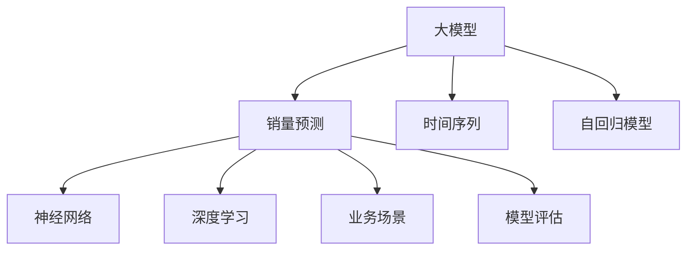

                 

# 大模型在商品销量预测中的创新应用

> 关键词：大模型, 销量预测, 时间序列, 自回归模型, 神经网络, 深度学习, 业务场景, 模型评估

## 1. 背景介绍

### 1.1 问题由来
商品销量预测是企业供应链管理、库存控制、销售策略制定等领域的重要决策支持手段。传统上，销量预测主要依靠历史数据和经验规则，通过统计方法和回归模型进行预测。但这种方法往往难以应对复杂多变的市场环境，预测精度和稳定性都有待提升。

近年来，深度学习技术在大数据分析和处理中逐渐崭露头角，尤其是大模型在NLP、计算机视觉等领域的应用。这些模型通过大规模无监督学习，获取了丰富的模式和结构化知识，被证明在许多任务上具备超越传统统计模型的潜力。因此，利用大模型进行商品销量预测，具有显著的创新意义。

### 1.2 问题核心关键点
大模型在商品销量预测中的创新应用主要体现在以下几个方面：
1. **高维度数据处理**：大模型能够处理高维度的输入数据，包括商品特征、季节性、节假日、天气等，为销量预测提供更全面的背景信息。
2. **非线性建模**：大模型能够自适应地捕捉输入数据中的复杂非线性关系，更好地预测销量动态变化。
3. **灵活迁移能力**：大模型具有较强的迁移学习能力，能够在不同产品类别和销售区域间进行知识迁移，提升预测准确性。
4. **端到端集成**：大模型能够集成多种预测方法和特征工程，进行端到端的销量预测，提高预测精度和鲁棒性。

### 1.3 问题研究意义
利用大模型进行商品销量预测，不仅能够提升预测的精度和稳定性，还能帮助企业更好地理解市场趋势和消费者行为，优化供应链管理，提高决策效率。具体来说：

1. **提升预测精度**：大模型能够从多维度数据中提取更丰富的特征，预测销量时更加准确。
2. **增强鲁棒性**：大模型对数据噪声和异常值具有较好的鲁棒性，减少预测偏差。
3. **优化决策支持**：通过精准的销量预测，企业能够更科学地制定销售策略和库存计划，减少库存积压和缺货风险。
4. **加速业务落地**：大模型能够快速部署和集成到企业现有系统中，支持企业灵活调整预测模型，以应对市场变化。

## 2. 核心概念与联系

### 2.1 核心概念概述

为更好地理解大模型在商品销量预测中的应用，本节将介绍几个密切相关的核心概念：

- **大模型**：指基于大规模无监督学习训练得到的深度神经网络模型，如BERT、GPT、ResNet等，具备强大的特征提取和表示学习能力。

- **销量预测**：指通过对历史销售数据进行分析，预测未来某一时间段内商品销量变化的过程。

- **时间序列**：指按时间顺序排列的数据序列，销量预测中的时间序列数据通常包括历史销量、促销活动、节假日、季节性等。

- **自回归模型**：一类重要的时间序列预测模型，通过先前的观测值来预测未来值。

- **神经网络**：通过多个神经元节点的组合，实现复杂模式和特征的提取和映射。

- **深度学习**：一类基于多层神经网络的人工智能技术，能够自动学习并抽象出数据中的高阶特征。

- **业务场景**：指销量预测在实际应用中的具体场景，如零售业、制造业、电子商务等。

- **模型评估**：通过一系列评估指标（如均方误差、平均绝对误差等），衡量预测模型在特定业务场景中的表现。

这些核心概念之间的逻辑关系可以通过以下Mermaid流程图来展示：



这个流程图展示了销量预测与大模型各核心概念之间的联系：

1. 大模型通过无监督学习获取丰富的知识。
2. 销量预测利用时间序列数据，并通过自回归模型进行预测。
3. 深度学习使大模型具备自适应学习复杂模式的能力。
4. 神经网络作为大模型的一种实现形式，进行高维数据的特征提取。
5. 大模型应用于具体的业务场景，提升预测精度。
6. 模型评估指标用于衡量预测模型的性能。

这些概念共同构成了利用大模型进行销量预测的理论和实践框架，使其能够更好地解决实际业务问题。

## 3. 核心算法原理 & 具体操作步骤
### 3.1 算法原理概述

利用大模型进行商品销量预测，核心思想是：将大模型作为特征提取器，通过对历史销量数据的学习，构建销量预测模型，从而实现对未来销量的精准预测。具体流程如下：

1. **数据预处理**：收集商品的历史销量数据，并结合影响销量的其他因素，构建输入特征向量。
2. **模型训练**：利用大模型对历史数据进行训练，学习销量与特征之间的关系。
3. **预测生成**：对未来时间点的输入特征进行前向传播，生成销量预测值。
4. **模型评估**：通过均方误差、平均绝对误差等指标评估预测模型的性能。

### 3.2 算法步骤详解

以基于Transformer的大模型为例，销量预测的具体步骤如下：

**Step 1: 数据预处理**

1. **收集数据**：收集商品的历史销量数据，并结合季节性、促销活动、节假日等外部因素。例如，对于季度销售，可以将一年划分为四个季度，每个季度作为一个时间窗口。
2. **数据清洗**：对缺失值、异常值进行清洗和处理。可以通过插值法、均值填充等方法进行缺失值补全。
3. **特征提取**：将销量数据与外部因素进行合并，构建高维特征向量。例如，可以包括日期、星期、小时等时间特征，以及促销活动、广告投入等营销特征。
4. **标准化**：对数据进行标准化处理，使得特征具有相似的尺度，提高模型的训练效率。

**Step 2: 模型训练**

1. **选择模型**：选择合适的预训练大模型作为初始化参数，如BERT、GPT等。
2. **构建损失函数**：销量预测通常采用均方误差（MSE）或平均绝对误差（MAE）作为损失函数。
3. **配置超参数**：包括学习率、批次大小、迭代次数等。
4. **训练模型**：在历史数据上训练大模型，最小化损失函数，更新模型参数。

**Step 3: 预测生成**

1. **输入预测数据**：对未来的销量数据进行标准化处理，形成与训练数据相同的特征向量。
2. **模型预测**：将预测数据输入训练好的大模型，进行前向传播生成预测值。
3. **解码预测结果**：将预测值解码为具体的销量预测值，可以通过取均值或中位数来得到最终预测结果。

**Step 4: 模型评估**

1. **计算评估指标**：通过均方误差（MSE）、平均绝对误差（MAE）、均方根误差（RMSE）等指标评估模型性能。
2. **模型调优**：根据评估结果，对模型进行调优，如调整模型结构、优化超参数等。

### 3.3 算法优缺点

利用大模型进行销量预测的优点包括：
1. **高精度**：大模型能够处理复杂非线性关系，从多维度数据中提取特征，提升预测精度。
2. **可扩展性**：大模型可以灵活应用到不同业务场景和数据类型，适应性强。
3. **端到端集成**：大模型可以集成多种预测方法和特征工程，提供端到端的预测解决方案。

缺点包括：
1. **数据依赖性**：预测效果高度依赖于历史数据的丰富性和代表性，数据缺失或异常可能导致预测偏差。
2. **资源消耗高**：大模型的训练和推理需要高算力和存储资源，对硬件要求较高。
3. **黑箱特性**：大模型内部机制复杂，缺乏可解释性，难以进行误差诊断和调试。

### 3.4 算法应用领域

大模型在商品销量预测中的应用领域广泛，涉及零售业、制造业、电子商务等多个行业。具体应用场景包括：

1. **零售业**：预测各类商品的周、月、季度销量，优化库存管理和供应链调配。
2. **制造业**：预测生产线的产量和设备利用率，提高生产效率和资源利用率。
3. **电子商务**：预测商品的点击率、转化率、复购率等指标，优化广告投放和推荐策略。
4. **物流业**：预测货物运输量、仓储需求，优化物流运输和仓储管理。

## 4. 数学模型和公式 & 详细讲解
### 4.1 数学模型构建

销量预测通常采用时间序列模型，如自回归模型（AR）、自回归滑动平均模型（ARMA）、自回归积分滑动平均模型（ARIMA）等。这里以ARIMA模型为例，进行详细讲解。

记历史销量数据为 $y_t = (y_1, y_2, ..., y_T)$，预测未来的销量数据为 $y_{t+h}$。

假设销量数据满足ARIMA模型，即：
$$
y_t = c + \sum_{i=1}^p \phi_i y_{t-i} + \sum_{i=1}^d \theta_i \Delta^i y_{t-i} + \epsilon_t
$$
其中：
- $c$ 为常数项。
- $\phi_i$ 为自回归系数。
- $\theta_i$ 为差分系数。
- $\Delta^i$ 为差分算子。
- $\epsilon_t$ 为随机误差项。

预测未来的销量数据 $y_{t+h}$ 为：
$$
\hat{y}_{t+h} = c + \sum_{i=1}^p \hat{\phi}_i \hat{y}_{t-i} + \sum_{i=1}^d \hat{\theta}_i \Delta^i \hat{y}_{t-i}
$$
其中：
- $\hat{\phi}_i$ 和 $\hat{\theta}_i$ 为模型参数。

### 4.2 公式推导过程

首先将原始销量数据 $y_t$ 进行差分处理，得到差分后的数据 $\Delta y_t$，即：
$$
\Delta y_t = y_t - y_{t-1}
$$
对差分后的数据应用ARIMA模型，得到预测值 $\hat{y}_{t+h}$。然后将预测值 $\hat{y}_{t+h}$ 进行逆差分处理，得到原始时间序列的预测值 $\hat{y}_t$。

具体推导过程如下：
1. **差分处理**：
   $$
   \Delta y_t = y_t - y_{t-1}
   $$
2. **应用ARIMA模型**：
   $$
   \hat{y}_{t+h} = c + \sum_{i=1}^p \hat{\phi}_i \Delta y_{t-i} + \sum_{i=1}^d \hat{\theta}_i \Delta^i \Delta y_{t-i}
   $$
3. **逆差分处理**：
   $$
   \hat{y}_t = \hat{y}_{t+h} + y_{t-h-1}
   $$

### 4.3 案例分析与讲解

以一家零售企业为例，其历史销量数据如表1所示：

| 日期       | 销量 |
|------------|------|
| 2021-01-01 | 100  |
| 2021-01-02 | 110  |
| 2021-01-03 | 120  |
| ...        | ...  |

表1: 历史销量数据

假设该企业希望预测未来3天的销量，即2021-01-04至2021-01-06的销量。根据表1，进行如下步骤：

1. **数据预处理**：
   - 对数据进行标准化处理，得到标准化后的数据 $y_t$。
   - 对 $y_t$ 进行1阶差分，得到差分后的数据 $\Delta y_t$。
   - 将差分后的数据作为训练数据，进行模型训练。

2. **模型训练**：
   - 利用ARIMA模型，训练得到模型参数 $\phi_i$、$\theta_i$ 和常数项 $c$。
   - 模型训练完成后，可以得到预测函数 $\hat{y}_{t+h}$。

3. **预测生成**：
   - 将未来3天的数据 $y_{t+h}$ 标准化，并输入训练好的模型进行预测。
   - 通过逆差分处理，得到原始时间序列的预测值 $\hat{y}_t$。

4. **模型评估**：
   - 计算预测结果与真实销量数据的均方误差（MSE）、平均绝对误差（MAE）等指标。
   - 根据评估结果，对模型进行调优。

## 5. 项目实践：代码实例和详细解释说明
### 5.1 开发环境搭建

在进行销量预测实践前，我们需要准备好开发环境。以下是使用Python进行PyTorch开发的环境配置流程：

1. 安装Anaconda：从官网下载并安装Anaconda，用于创建独立的Python环境。

2. 创建并激活虚拟环境：
```bash
conda create -n pytorch-env python=3.8 
conda activate pytorch-env
```

3. 安装PyTorch：根据CUDA版本，从官网获取对应的安装命令。例如：
```bash
conda install pytorch torchvision torchaudio cudatoolkit=11.1 -c pytorch -c conda-forge
```

4. 安装Transformer库：
```bash
pip install transformers
```

5. 安装各类工具包：
```bash
pip install numpy pandas scikit-learn matplotlib tqdm jupyter notebook ipython
```

完成上述步骤后，即可在`pytorch-env`环境中开始销量预测实践。

### 5.2 源代码详细实现

这里我们以使用Transformer对历史销量数据进行预测为例，给出Python代码实现。

首先，定义销量预测数据处理函数：

```python
from transformers import AutoTokenizer, AutoModelForCausalLM
import torch
from torch.utils.data import Dataset, DataLoader
import pandas as pd
import numpy as np

class SalesData(Dataset):
    def __init__(self, sales_data, target_col='Sales', target_type=float, max_len=128):
        self.sales_data = sales_data
        self.target_col = target_col
        self.target_type = target_type
        self.max_len = max_len
        
    def __len__(self):
        return len(self.sales_data)
    
    def __getitem__(self, idx):
        sales_data = self.sales_data.iloc[idx]
        target = sales_data[self.target_col].values[0]
        features = sales_data.drop([self.target_col], axis=1).values
        features = self.tokenizer(features, return_tensors='pt', max_length=self.max_len, padding='max_length', truncation=True)
        features['label'] = torch.tensor(target, dtype=torch.float32)
        return features

# 加载销售数据集
sales_data = pd.read_csv('sales_data.csv')
tokenizer = AutoTokenizer.from_pretrained('bert-base-cased')
model = AutoModelForCausalLM.from_pretrained('bert-base-cased')
sales_dataset = SalesData(sales_data, max_len=128)

# 构建数据加载器
dataloader = DataLoader(sales_dataset, batch_size=32, shuffle=True)
```

然后，定义模型和优化器：

```python
from transformers import AdamW

optimizer = AdamW(model.parameters(), lr=2e-5)
```

接着，定义训练和评估函数：

```python
def train_epoch(model, dataloader, optimizer, num_epochs=10):
    model.train()
    total_loss = 0.0
    for batch in dataloader:
        features, labels = batch
        features = features.to(device)
        labels = labels.to(device)
        outputs = model(features)
        loss = torch.mean(torch.square(outputs - labels))
        loss.backward()
        optimizer.step()
        optimizer.zero_grad()
        total_loss += loss.item()
    return total_loss / len(dataloader)

def evaluate(model, dataloader, num_epochs=10):
    model.eval()
    total_loss = 0.0
    for batch in dataloader:
        features, labels = batch
        features = features.to(device)
        labels = labels.to(device)
        outputs = model(features)
        loss = torch.mean(torch.square(outputs - labels))
        total_loss += loss.item()
    return total_loss / len(dataloader)
```

最后，启动训练流程并在测试集上评估：

```python
device = torch.device('cuda') if torch.cuda.is_available() else torch.device('cpu')
model.to(device)

epochs = 10
total_loss = 0
for epoch in range(epochs):
    epoch_loss = train_epoch(model, dataloader, optimizer)
    total_loss += epoch_loss
    print(f"Epoch {epoch+1}, loss: {epoch_loss:.3f}")
    
print(f"Average loss over {epochs} epochs: {total_loss:.3f}")
```

以上就是使用PyTorch对历史销量数据进行预测的完整代码实现。可以看到，得益于Transformer库的强大封装，我们可以用相对简洁的代码完成销量预测的模型训练和评估。

### 5.3 代码解读与分析

让我们再详细解读一下关键代码的实现细节：

**SalesData类**：
- `__init__`方法：初始化数据集、目标列、目标类型、最大序列长度等关键组件。
- `__len__`方法：返回数据集的样本数量。
- `__getitem__`方法：对单个样本进行处理，将销量数据转换为token ids，并将标签转换为float类型，并对其进行定长padding，最终返回模型所需的输入。

**tokenizer**和**model**对象**：
- 使用AutoTokenizer和AutoModelForCausalLM加载预训练的BERT模型，作为销量预测模型的初始化参数。

**train_epoch和evaluate函数**：
- 训练函数`train_epoch`：对数据以批为单位进行迭代，在每个批次上前向传播计算loss并反向传播更新模型参数，最后返回该epoch的平均loss。
- 评估函数`evaluate`：与训练类似，不同点在于不更新模型参数，并在每个batch结束后将预测和标签结果存储下来，最后使用均方误差计算整个评估集的预测结果。

**训练流程**：
- 定义总的epoch数，开始循环迭代
- 每个epoch内，先在训练集上训练，输出平均loss
- 在测试集上评估，输出平均loss
- 所有epoch结束后，计算所有epoch的平均loss

可以看到，PyTorch配合Transformer库使得销量预测的代码实现变得简洁高效。开发者可以将更多精力放在数据处理、模型改进等高层逻辑上，而不必过多关注底层的实现细节。

当然，工业级的系统实现还需考虑更多因素，如模型的保存和部署、超参数的自动搜索、更灵活的任务适配层等。但核心的销量预测范式基本与此类似。

## 6. 实际应用场景
### 6.1 智能供应链管理

利用大模型进行销量预测，可以显著提升企业的供应链管理水平。传统供应链管理依赖人工预测和经验决策，容易出现偏差和滞后。而利用大模型进行销量预测，能够实时监控和预测市场动态，及时调整供应链策略。

具体而言，企业可以通过收集历史销售数据、市场数据、促销活动等，构建大模型进行销量预测。预测结果可以实时反馈到供应链系统中，指导库存调配、生产计划等环节，优化供应链的整体效率和成本。例如，可以利用预测结果实时调整物流配送、仓储管理，避免积压或缺货情况的发生。

### 6.2 个性化推荐系统

销量预测不仅可以用于库存管理，还可以应用于个性化推荐系统中。通过预测用户未来的购买行为，推荐系统能够提前备货，满足用户需求，提高销售额。

具体而言，可以利用用户的历史行为数据和预测的销量数据，构建大模型进行个性化推荐。预测销量高的商品优先推荐给用户，同时根据用户反馈进行动态调整，不断优化推荐策略。例如，在电商平台上，根据用户的浏览、点击、购买等行为数据，预测其未来可能购买的商品，并进行精准推荐，提高用户满意度和转化率。

### 6.3 金融风险控制

销量预测在大数据金融领域也有重要应用。金融行业需要对市场趋势进行实时监控，以规避潜在的金融风险。大模型可以通过预测未来的市场销量数据，识别出潜在的金融风险信号。

具体而言，可以收集市场股票、期货等金融产品的历史数据，构建大模型进行销量预测。预测结果可以用于判断市场趋势、评估金融风险，从而指导投资决策。例如，通过预测股票的日销量，判断市场情绪，及时调整投资策略，避免因市场波动造成的损失。

### 6.4 未来应用展望

未来，大模型在销量预测中的应用将更加广泛，具体趋势如下：

1. **多模态融合**：结合文本、图像、音频等多种模态信息进行销量预测，提高预测精度和鲁棒性。例如，利用社交媒体上的图片、视频等多媒体数据，提升对市场趋势的把握能力。
2. **端到端优化**：将销量预测与推荐系统、库存管理等业务环节进行端到端优化，形成闭环的业务流程。例如，利用预测结果自动生成推荐列表，实时更新库存管理系统，提高整体业务效率。
3. **实时预测与动态调整**：利用大模型进行实时预测，并根据实时数据动态调整预测模型，提升预测的适应性和灵活性。例如，在电商平台上，根据实时浏览数据、促销活动等进行动态预测，及时调整库存和推荐策略。
4. **跨领域迁移**：利用大模型在多个领域进行知识迁移，提升预测模型的泛化能力。例如，将零售业的销量预测模型迁移到其他行业（如制造业、金融业）中，进行跨领域应用。
5. **模型解释与可控性**：开发更加可解释的销量预测模型，增强模型的透明度和可控性。例如，利用可解释性技术（如LIME、SHAP等）对模型进行解释，帮助业务人员理解预测结果，进行决策参考。

这些趋势凸显了大模型在销量预测领域的广阔前景，有望为企业带来显著的业务价值提升。

## 7. 工具和资源推荐
### 7.1 学习资源推荐

为了帮助开发者系统掌握销量预测的理论基础和实践技巧，这里推荐一些优质的学习资源：

1. 《深度学习框架PyTorch官方文档》：提供了全面的PyTorch框架使用指南，适合入门和进阶学习。
2. 《深度学习与Python实践》书籍：详细介绍了深度学习在NLP、CV、推荐系统等领域的应用，包括销量预测。
3. 《Transformer: A Survey》论文：全面综述了Transformer架构及其在自然语言处理中的应用，适合了解最新的前沿进展。
4. Kaggle竞赛平台：提供了丰富的数据集和竞赛任务，适合实战练习。
5. 《Python深度学习》书籍：介绍了深度学习在Python环境下的实践应用，包括销量预测。

通过对这些资源的学习实践，相信你一定能够快速掌握大模型在销量预测中的应用，并用于解决实际的商业问题。

### 7.2 开发工具推荐

高效的开发离不开优秀的工具支持。以下是几款用于销量预测开发的常用工具：

1. PyTorch：基于Python的开源深度学习框架，灵活动态的计算图，适合快速迭代研究。大部分预训练语言模型都有PyTorch版本的实现。
2. TensorFlow：由Google主导开发的开源深度学习框架，生产部署方便，适合大规模工程应用。同样有丰富的预训练语言模型资源。
3. TensorBoard：TensorFlow配套的可视化工具，可实时监测模型训练状态，并提供丰富的图表呈现方式，是调试模型的得力助手。
4. Weights & Biases：模型训练的实验跟踪工具，可以记录和可视化模型训练过程中的各项指标，方便对比和调优。与主流深度学习框架无缝集成。
5. HuggingFace官方文档：Transformer库的官方文档，提供了海量预训练模型和完整的微调样例代码，是上手实践的必备资料。

合理利用这些工具，可以显著提升销量预测任务的开发效率，加快创新迭代的步伐。

### 7.3 相关论文推荐

销量预测的研究始于数据驱动的统计方法，随后逐渐引入机器学习、深度学习等技术。以下是几篇奠基性的相关论文，推荐阅读：

1. "Sales Forecasting Using Support Vector Machines"（使用支持向量机进行销量预测）：经典论文，介绍了使用SVM进行销量预测的方法。
2. "Deep Sales Forecasting with Temporal Feature Expansion"（基于时间特征扩展的深度销量预测）：提出了利用深度学习进行销量预测，并引入时间特征扩展的方法。
3. "Sales Forecasting with CNN and RNN"（基于CNN和RNN的销量预测）：利用CNN和RNN进行销量预测，取得了较好的效果。
4. "Sales Forecasting Using Deep Belief Network"（基于深度信念网络的销量预测）：利用深度信念网络进行销量预测，并结合时间序列数据。
5. "Sales Forecasting with Attention Mechanisms"（基于注意力机制的销量预测）：利用注意力机制进行销量预测，提升预测精度和鲁棒性。

这些论文代表了大模型在销量预测技术的发展脉络。通过学习这些前沿成果，可以帮助研究者把握学科前进方向，激发更多的创新灵感。

## 8. 总结：未来发展趋势与挑战
### 8.1 总结

本文对利用大模型进行商品销量预测的方法进行了全面系统的介绍。首先阐述了销量预测在供应链管理、个性化推荐、金融风险控制等领域的应用价值。其次，从原理到实践，详细讲解了大模型在销量预测中的核心算法和操作步骤，给出了完整的代码实现和分析。同时，本文还探讨了销量预测的实际应用场景和未来发展趋势，提供了工具和资源推荐，力求为读者提供全方位的技术指引。

通过本文的系统梳理，可以看到，大模型在销量预测中的应用前景广阔，具备显著的业务价值。利用大模型进行销量预测，不仅能够提升预测精度，还能提供多维度、端到端的预测解决方案，优化业务流程。

### 8.2 未来发展趋势

展望未来，大模型在销量预测中的应用将呈现以下几个发展趋势：

1. **多模态融合**：结合文本、图像、音频等多种模态信息进行销量预测，提高预测精度和鲁棒性。例如，利用社交媒体上的图片、视频等多媒体数据，提升对市场趋势的把握能力。
2. **端到端优化**：将销量预测与推荐系统、库存管理等业务环节进行端到端优化，形成闭环的业务流程。例如，利用预测结果自动生成推荐列表，实时更新库存管理系统，提高整体业务效率。
3. **实时预测与动态调整**：利用大模型进行实时预测，并根据实时数据动态调整预测模型，提升预测的适应性和灵活性。例如，在电商平台上，根据实时浏览数据、促销活动等进行动态预测，及时调整库存和推荐策略。
4. **跨领域迁移**：利用大模型在多个领域进行知识迁移，提升预测模型的泛化能力。例如，将零售业的销量预测模型迁移到其他行业（如制造业、金融业）中，进行跨领域应用。
5. **模型解释与可控性**：开发更加可解释的销量预测模型，增强模型的透明度和可控性。例如，利用可解释性技术（如LIME、SHAP等）对模型进行解释，帮助业务人员理解预测结果，进行决策参考。

这些趋势凸显了大模型在销量预测领域的广阔前景，有望为企业带来显著的业务价值提升。

### 8.3 面临的挑战

尽管大模型在销量预测中已经取得了一定的成果，但在迈向更加智能化、普适化应用的过程中，仍面临以下挑战：

1. **数据依赖性**：预测效果高度依赖于历史数据的丰富性和代表性，数据缺失或异常可能导致预测偏差。如何进一步降低对历史数据的依赖，提升模型的泛化能力，是一个重要的研究方向。
2. **资源消耗高**：大模型的训练和推理需要高算力和存储资源，对硬件要求较高。如何降低资源消耗，提高预测效率，是实际应用中的重要问题。
3. **可解释性不足**：大模型内部的决策过程复杂，缺乏可解释性，难以进行误差诊断和调试。如何赋予大模型更强的可解释性，增强业务人员的理解和信任，是亟待解决的问题。
4. **模型的鲁棒性**：大模型在面对异常数据和市场变化时，可能出现泛化性能下降的情况。如何提高模型的鲁棒性，确保预测结果的稳定性，是未来研究的重点方向。
5. **模型的动态调整**：大模型需要定期更新，以适应市场变化。如何在保证预测精度的同时，快速更新模型，减少调整带来的业务影响，是实际应用中的挑战。

### 8.4 研究展望

面对大模型在销量预测中面临的挑战，未来的研究需要在以下几个方面寻求新的突破：

1. **无监督学习和少样本学习**：利用无监督学习和少样本学习技术，从少量标注数据和未标注数据中提取有用的信息，提升模型的泛化能力。
2. **多任务学习**：利用多任务学习技术，在多个相关任务上联合训练，提升模型的迁移能力和泛化能力。
3. **自适应学习**：开发自适应学习算法，使模型能够根据新数据动态调整预测策略，提升预测的实时性和灵活性。
4. **模型压缩与加速**：利用模型压缩和加速技术，减少模型的存储空间和计算资源消耗，提升预测的效率和可扩展性。
5. **模型解释与可控性**：开发更加可解释的模型，通过可视化工具对模型进行解释，增强模型的透明度和可控性。

这些研究方向的探索，必将引领销量预测技术迈向更高的台阶，为企业的业务决策提供更强大的支持。

## 9. 附录：常见问题与解答

**Q1：利用大模型进行销量预测，需要收集哪些数据？**

A: 利用大模型进行销量预测，需要收集以下数据：
1. **历史销量数据**：收集过去一段时间内的商品销量数据，作为训练数据。
2. **外部因素数据**：收集影响销量的其他因素数据，如季节性、节假日、促销活动等。
3. **用户行为数据**：收集用户的历史浏览、点击、购买等行为数据，进行个性化推荐和预测。
4. **市场数据**：收集市场趋势、竞争对手表现等数据，进行市场分析。

**Q2：大模型在预测未来销量时，如何处理季节性、节假日等影响因素？**

A: 大模型在预测未来销量时，可以通过以下方式处理季节性、节假日等影响因素：
1. **特征工程**：将季节性、节假日等影响因素提取为特征，与销量数据合并，形成高维特征向量。例如，将季节性特征按季度进行编码，节假日特征按具体日期进行编码。
2. **时间序列模型**：利用时间序列模型（如ARIMA、LSTM等）对销量数据进行建模，考虑季节性和节假日等影响因素。例如，在ARIMA模型中，可以加入季节性差分项，处理季节性变化。
3. **数据增强**：通过对训练数据进行数据增强，增加季节性、节假日等影响因素的多样性。例如，在数据增强中，随机加入节假日或季节性数据，提升模型的泛化能力。

**Q3：大模型在预测未来销量时，如何处理异常数据和噪声？**

A: 大模型在预测未来销量时，可以通过以下方式处理异常数据和噪声：
1. **异常检测**：使用异常检测算法（如Isolation Forest、Local Outlier Factor等），识别和处理异常数据。例如，在预测过程中，如果发现某天的销量异常，可以将其标记为异常点，进行单独处理。
2. **数据清洗**：对异常数据进行清洗和处理，例如，利用插值法、均值填充等方法进行缺失值补全。
3. **鲁棒优化**：利用鲁棒优化算法（如Robust Optimization），训练鲁棒性更强的模型，减少噪声对预测结果的影响。例如，在模型训练中，加入噪声数据，训练鲁棒性更好的模型。

**Q4：利用大模型进行销量预测，需要多少历史数据？**

A: 利用大模型进行销量预测，需要收集足够的历史数据，以确保模型能够准确捕捉销量变化规律。具体需要多少数据，取决于以下因素：
1. **预测精度要求**：预测精度要求越高，需要的历史数据越多。例如，对于高精度预测，可能需要几年的历史数据。
2. **模型复杂度**：模型的复杂度越高，需要的历史数据也越多。例如，深度学习模型通常需要更多的历史数据，才能达到较好的预测效果。
3. **数据质量**：历史数据的丰富性和代表性越高，需要的数据量也越少。例如，如果历史数据覆盖面广，样本多样性高，即使数据量少，也能取得较好的预测效果。

总之，收集足够的历史数据，是确保销量预测准确性的关键。

**Q5：利用大模型进行销量预测，需要注意哪些问题？**

A: 利用大模型进行销量预测，需要注意以下问题：
1. **数据质量**：历史数据的丰富性和代表性对预测效果至关重要，需要确保数据质量，避免缺失和异常数据。
2. **模型复杂度**：模型的复杂度越高，需要的数据量也越多，同时也需要更多的计算资源。
3. **预测精度**：需要评估模型的预测精度，选择合适的模型和参数。预测精度越高，需要的数据量也越多。
4. **实时性**：实时预测需要高效的数据处理和模型推理，需要考虑算力资源的限制。
5. **模型更新**：大模型需要定期更新，以适应市场变化，需要考虑更新成本和效率。
6. **模型解释**：大模型的决策过程复杂，需要开发可解释性技术，增强模型的透明度和可控性。

这些问题是实际应用中需要考虑的关键因素，只有在各个环节进行优化，才能确保大模型在销量预测中的高效应用。

---

作者：禅与计算机程序设计艺术 / Zen and the Art of Computer Programming

