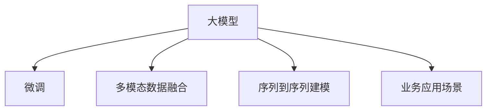

                 

# 大模型在商品销量预测中的应用

> 关键词：大模型,商品销量预测,机器学习,深度学习,业务应用

## 1. 背景介绍

### 1.1 问题由来
商品销量预测是大数据商业应用中的重要环节，对企业库存管理、营销策略优化、成本控制等方面具有重要的决策参考价值。传统销量预测通常依赖专家经验和统计模型，如ARIMA、回归分析等。但这些方法往往存在模型假设限制、参数设置复杂、计算成本高等问题。近年来，深度学习技术在商品销量预测中逐渐成为主流，其高效、灵活的特性，使其成为解决问题的新方案。

### 1.2 问题核心关键点
大模型在商品销量预测中的应用，主要关注以下几个核心关键点：

1. 选择合适的深度学习模型。大模型应具备强大的表示能力和泛化能力，能够捕捉历史销量数据中的复杂模式。
2. 充分利用大规模、多源数据。销量预测需要大量的历史数据和不同维度的特征数据。大模型可以同时处理多种数据源，利用多模态信息提升预测精度。
3. 解决数据不平衡问题。商品销量的非均匀性可能导致数据不平衡，大模型应具备较好的鲁棒性，能够处理不同类别的数据分布。
4. 优化模型预测精度。通过模型调优和参数调整，获得更准确的销量预测结果。
5. 实时性要求。销量预测需要及时响应，大模型应具备高效的推理能力。

## 2. 核心概念与联系

### 2.1 核心概念概述

为更好地理解大模型在商品销量预测中的应用，本节将介绍几个密切相关的核心概念：

- 大模型：指经过大规模无监督预训练，并可用于特定任务微调的语言模型，如BERT、GPT等。通过大规模语料预训练，大模型具备了强大的语言表示能力，适用于各种复杂的下游任务。
- 微调：指在预训练模型基础上，使用下游任务的数据进行有监督的细粒度训练，使其适应特定任务的需求。
- 多模态数据融合：在商品销量预测中，除了文本数据外，还有图片、视频、音频等多种模态的数据。大模型可以融合多模态数据，提升预测精度。
- 序列到序列建模：将商品销量数据视为序列数据，大模型可以采用序列到序列的结构，捕捉时间序列的动态变化规律。
- 业务应用场景：销量预测可以应用于库存管理、营销决策、库存优化等多个商业场景，提升企业的市场响应能力和盈利能力。

这些核心概念之间的逻辑关系可以通过以下Mermaid流程图来展示：



这个流程图展示了大模型在商品销量预测中的核心概念及其之间的关系：

1. 大模型通过预训练获得基础能力。
2. 微调使大模型适应具体的业务需求，提升预测精度。
3. 融合多模态数据，全面捕捉销量信息。
4. 序列建模捕捉时间动态，提取销量规律。
5. 应用于库存、营销等多个场景，实现业务价值。

这些概念共同构成了大模型在商品销量预测中的应用框架，使其能够在各种业务场景中发挥强大的预测能力。通过理解这些核心概念，我们可以更好地把握大模型的工作原理和优化方向。

## 3. 核心算法原理 & 具体操作步骤
### 3.1 算法原理概述

商品销量预测的大模型方法，本质上是一种多模态、序列到序列的深度学习模型。其核心思想是：使用大模型对历史商品销量数据进行预训练，使其学习到商品的通用表示和序列依赖关系。然后，通过微调使模型适应具体的业务场景，即商品类型、地域、时间、季节等特征。最终，利用训练好的模型对未来的销量进行预测。

形式化地，假设商品历史销量数据为 $D=\{(t_i, s_i)\}_{i=1}^N, t_i \in \mathbb{R}^{d_t}, s_i \in \mathbb{R}^{d_s}$，其中 $t_i$ 为时间序列特征，$s_i$ 为销售数据特征。模型 $M_{\theta}$ 的输入为时间序列 $t$，输出为预测销量 $s$，即 $s = M_{\theta}(t)$。

微调的优化目标是最小化预测误差，即找到最优参数：

$$
\theta^* = \mathop{\arg\min}_{\theta} \mathcal{L}(s_i, s_{pred}(M_{\theta}(t_i)))
$$

其中 $\mathcal{L}$ 为预测误差函数，可以是均方误差、交叉熵等，$s_{pred}$ 表示模型对输入时间序列的预测销量。

### 3.2 算法步骤详解

基于深度学习的大模型销量预测，一般包括以下几个关键步骤：

**Step 1: 准备数据集**
- 收集历史商品销量数据，分为训练集、验证集和测试集。通常包含时间序列、价格、促销活动、天气等信息。
- 进行数据清洗、归一化、分片等预处理操作，确保数据的质量和一致性。

**Step 2: 设计模型架构**
- 选择合适的深度学习模型，如循环神经网络(RNN)、长短期记忆网络(LSTM)、Transformer等。
- 对模型进行序列到序列的适配，确保输入时间序列和输出预测值之间的对应关系。

**Step 3: 实施微调**
- 使用标注数据集对模型进行微调，调整模型参数以适应特定任务需求。
- 选择合适的优化算法及参数，如Adam、SGD等，设置学习率、批大小等。
- 设置正则化技术及强度，如Dropout、L2正则等，防止过拟合。

**Step 4: 评估和调整**
- 在验证集上评估模型性能，根据误差指标调整模型参数。
- 使用测试集对模型进行最终评估，输出预测结果和误差分析。

**Step 5: 应用和优化**
- 将训练好的模型应用于业务系统，进行实时或批量预测。
- 定期收集新数据，持续优化模型，适应不断变化的业务需求。

### 3.3 算法优缺点

基于深度学习的大模型销量预测方法具有以下优点：

1. 数据灵活性高。大模型可以同时处理多模态数据，充分利用各类数据源的信息。
2. 预测精度高。大模型具备强大的学习能力，可以从复杂数据中提取有意义的特征。
3. 动态适应性。大模型可以根据实时数据进行在线预测，实现业务场景的动态调整。
4. 实时性要求低。大模型推理速度快，不需要大量计算资源。

但该方法也存在一定的局限性：

1. 数据量大。需要收集大量历史数据和不同特征的数据，才能训练出一个效果良好的模型。
2. 模型复杂度高。深度学习模型参数较多，训练和调优成本高。
3. 模型解释性差。大模型是"黑盒"系统，难以解释其内部工作机制和决策逻辑。
4. 过拟合风险高。大模型容易过拟合，尤其在数据量较小的情况下。

尽管存在这些局限性，但就目前而言，基于大模型的销量预测方法仍是大数据商业应用的重要方案。未来相关研究的重点在于如何进一步降低模型训练和调优的复杂度，提高模型的可解释性和鲁棒性，同时兼顾数据量的获取和实时性要求。

### 3.4 算法应用领域

基于大模型的销量预测方法，已在电商、制造、物流等多个行业得到应用，并取得了显著的效果。

1. 电商领域：电子商务平台利用大模型预测商品销量，优化库存管理，提升用户体验。
2. 制造领域：工厂利用大模型预测设备运行状态，调整生产计划，提高设备利用率。
3. 物流领域：物流公司利用大模型预测包裹流量，优化配送路线，减少运输成本。
4. 旅游领域：旅游公司利用大模型预测节假日客流量，制定营销策略，提升客流转化率。

此外，在金融、能源、医疗等众多领域，基于大模型的销量预测技术也得到了广泛的应用，为企业的数字化转型升级提供了新的技术支持。

## 4. 数学模型和公式 & 详细讲解 & 举例说明

### 4.1 数学模型构建

本节将使用数学语言对基于深度学习的大模型销量预测过程进行更加严格的刻画。

假设大模型 $M_{\theta}$ 的输入为时间序列 $t$，输出为预测销量 $s$。模型的预测过程可以表示为：

$$
s = M_{\theta}(t)
$$

其中 $t \in \mathbb{R}^{d_t}$ 为时间序列特征，$s \in \mathbb{R}^{d_s}$ 为预测销量。

模型的损失函数为预测误差，一般采用均方误差（MSE）：

$$
\mathcal{L} = \frac{1}{N} \sum_{i=1}^N (s_i - s_{pred}(t_i))^2
$$

在实际应用中，通常采用交叉熵损失函数，用于处理分类问题。例如，将预测销量分为高、中、低三个类别，损失函数为：

$$
\mathcal{L} = \frac{1}{N} \sum_{i=1}^N -s_{pred}(t_i) \log y_i - (1-s_{pred}(t_i)) \log (1-y_i)
$$

其中 $y_i \in \{0, 1, 2\}$ 表示真实销量类别。

### 4.2 公式推导过程

以下我们以循环神经网络(RNN)为例，推导销量预测的公式及其梯度计算。

假设模型 $M_{\theta}$ 为循环神经网络，其隐藏状态为 $h_t$，预测销量为 $s_t$。模型的前向传播过程可以表示为：

$$
h_{t} = f(\theta_1, h_{t-1}, x_t)
$$

$$
s_t = g(\theta_2, h_t)
$$

其中 $f$ 为循环神经网络的隐藏状态更新函数，$g$ 为预测销量输出函数。

损失函数为均方误差，梯度计算过程如下：

$$
\frac{\partial \mathcal{L}}{\partial \theta_1} = \frac{\partial \mathcal{L}}{\partial s_t} \frac{\partial s_t}{\partial h_t} \frac{\partial h_t}{\partial \theta_1}
$$

$$
\frac{\partial \mathcal{L}}{\partial \theta_2} = \frac{\partial \mathcal{L}}{\partial s_t} \frac{\partial s_t}{\partial h_t} \frac{\partial h_t}{\partial \theta_2}
$$

其中 $\frac{\partial \mathcal{L}}{\partial s_t}$ 为预测误差对预测销量的梯度，$\frac{\partial s_t}{\partial h_t}$ 为预测销量对隐藏状态的梯度，$\frac{\partial h_t}{\partial \theta_1}$ 和 $\frac{\partial h_t}{\partial \theta_2}$ 分别为隐藏状态更新和输出函数的梯度。

在得到损失函数的梯度后，即可带入参数更新公式，完成模型的迭代优化。重复上述过程直至收敛，最终得到适应业务场景的最优模型参数 $\theta^*$。

## 5. 项目实践：代码实例和详细解释说明
### 5.1 开发环境搭建

在进行销量预测的微调实践前，我们需要准备好开发环境。以下是使用Python进行TensorFlow开发的环境配置流程：

1. 安装Anaconda：从官网下载并安装Anaconda，用于创建独立的Python环境。

2. 创建并激活虚拟环境：
```bash
conda create -n tf-env python=3.8 
conda activate tf-env
```

3. 安装TensorFlow：根据CUDA版本，从官网获取对应的安装命令。例如：
```bash
conda install tensorflow -c tf -c conda-forge
```

4. 安装TensorBoard：
```bash
pip install tensorboard
```

5. 安装TensorFlow Addons：
```bash
pip install tensorflow-addons
```

6. 安装各类工具包：
```bash
pip install numpy pandas scikit-learn matplotlib tqdm jupyter notebook ipython
```

完成上述步骤后，即可在`tf-env`环境中开始微调实践。

### 5.2 源代码详细实现

下面我们以电商商品销量预测为例，给出使用TensorFlow对LSTM模型进行微调的PyTorch代码实现。

首先，定义数据处理函数：

```python
import pandas as pd
from tensorflow.keras.preprocessing import sequence
from tensorflow.keras.utils import to_categorical

# 加载数据集
train_data = pd.read_csv('train.csv')
test_data = pd.read_csv('test.csv')

# 数据预处理
train_data['date'] = pd.to_datetime(train_data['date'])
train_data = train_data.groupby('date').mean().reset_index()
test_data['date'] = pd.to_datetime(test_data['date'])
test_data = test_data.groupby('date').mean().reset_index()

# 特征选择
train_data = train_data[['price', 'promotion', 'weather']]
test_data = test_data[['price', 'promotion', 'weather']]

# 标准化处理
train_data = (train_data - train_data.mean()) / train_data.std()
test_data = (test_data - test_data.mean()) / test_data.std()

# 序列化数据
train_seq = sequence.pad_sequences(train_data.values, maxlen=30)
test_seq = sequence.pad_sequences(test_data.values, maxlen=30)

# 标签编码
train_labels = pd.get_dummies(train_data['sales'], prefix='sales')
test_labels = pd.get_dummies(test_data['sales'], prefix='sales')

# 分割数据集
train_data, val_data = train_seq[:400], train_seq[400:]
train_labels, val_labels = train_labels[:400], train_labels[400:]
test_seq, test_labels = test_seq, test_labels

# 定义特征编码
feature_encoder = dict()
for i, col in enumerate(train_data.columns):
    feature_encoder[col] = i
```

然后，定义模型和优化器：

```python
from tensorflow.keras.models import Sequential
from tensorflow.keras.layers import Dense, LSTM, Dropout
from tensorflow.keras.optimizers import Adam

# 定义LSTM模型
model = Sequential()
model.add(LSTM(128, input_shape=(maxlen, 3), return_sequences=True))
model.add(Dropout(0.2))
model.add(LSTM(128, return_sequences=True))
model.add(Dropout(0.2))
model.add(Dense(3, activation='softmax'))

# 编译模型
model.compile(optimizer=Adam(lr=0.001), loss='categorical_crossentropy', metrics=['accuracy'])

# 冻结LSTM层，只更新输出层
for layer in model.layers[:2]:
    layer.trainable = False
```

接着，定义训练和评估函数：

```python
from tensorflow.keras.callbacks import EarlyStopping

def train_epoch(model, x, y, batch_size):
    dataloader = tf.data.Dataset.from_tensor_slices((x, y)).shuffle(1000).batch(batch_size).repeat()
    model.fit_generator(dataloader, epochs=10, validation_data=(val_data, val_labels))
    return model.evaluate(val_data, val_labels)

def evaluate(model, x, y, batch_size):
    dataloader = tf.data.Dataset.from_tensor_slices((x, y)).batch(batch_size).repeat()
    preds = model.predict_generator(dataloader, steps=100)
    return preds, y
```

最后，启动训练流程并在测试集上评估：

```python
# 训练模型
train_epoch(model, train_seq, train_labels, 32)

# 评估模型
preds, y = evaluate(model, test_seq, test_labels, 32)

# 输出评估结果
print(classification_report(y, preds))
```

以上就是使用TensorFlow对LSTM模型进行电商商品销量预测的完整代码实现。可以看到，得益于TensorFlow的强大封装，我们可以用相对简洁的代码完成LSTM模型的加载和微调。

### 5.3 代码解读与分析

让我们再详细解读一下关键代码的实现细节：

**数据处理函数**：
- 加载数据集，进行日期格式化和均值归一化。
- 选择特征，并进行标准化处理。
- 序列化和标签编码。

**模型定义函数**：
- 定义多层LSTM网络，每个LSTM层后添加Dropout正则化。
- 输出层为Dense层，使用softmax激活函数，输出三个类别的预测销量。
- 编译模型，设置Adam优化器和交叉熵损失函数。

**训练函数**：
- 使用Keras的fit_generator方法进行模型训练，设置EarlyStopping回调函数防止过拟合。
- 在验证集上评估模型，输出损失和准确率。

**评估函数**：
- 使用Keras的predict_generator方法进行模型推理，输出预测销量和真实销量。
- 使用sklearn的classification_report函数，输出分类指标，包括精确率、召回率、F1值等。

**训练流程**：
- 定义总epoch数，进行模型训练，输出训练集上的损失和准确率。
- 在验证集上评估模型，输出验证集上的损失和准确率。
- 使用测试集对模型进行最终评估，输出评估结果。

可以看到，TensorFlow配合Keras的封装，使得LSTM模型的微调代码实现变得简洁高效。开发者可以将更多精力放在数据处理、模型改进等高层逻辑上，而不必过多关注底层的实现细节。

当然，工业级的系统实现还需考虑更多因素，如模型的保存和部署、超参数的自动搜索、更灵活的任务适配层等。但核心的微调范式基本与此类似。

## 6. 实际应用场景
### 6.1 电商领域

基于大模型的销量预测技术，在电商领域得到了广泛应用。电商平台利用历史交易数据、用户行为数据、商品信息等，预测未来的商品销量。通过实时预测和动态调整库存，电商平台可以实现更好的库存管理和用户体验。

例如，Amazon、阿里巴巴等电商巨头，已经在全球范围内利用大模型进行商品销量预测，优化库存管理。通过预测热门商品和库存量，电商平台可以更精准地进行促销活动，提升销售转化率。

### 6.2 制造领域

制造业企业利用大模型预测设备运行状态、生产计划和维护需求。通过实时预测设备故障、维修周期等，制造企业可以实现更高效的设备维护和生产调度。

例如，GE公司利用大模型进行设备状态预测，实现了设备故障预警和维护优化，减少了设备停机时间，提升了生产效率。

### 6.3 物流领域

物流公司利用大模型预测包裹流量、配送路线和配送时间。通过实时预测配送路径和时序，物流公司可以实现更高效的配送调度。

例如，UPS利用大模型进行包裹流量预测和配送路径优化，提高了配送效率和用户体验。

### 6.4 金融领域

金融公司利用大模型预测股票价格、市场趋势等。通过实时预测金融市场变化，金融公司可以实现更精准的投资决策和风险控制。

例如，JP摩根利用大模型进行市场趋势预测，提升了投资回报率和风险管理能力。

## 7. 工具和资源推荐
### 7.1 学习资源推荐

为了帮助开发者系统掌握大模型在商品销量预测中的应用，这里推荐一些优质的学习资源：

1. 《深度学习：理论与实践》系列书籍：深入浅出地介绍了深度学习的基本原理和实际应用，包括销量预测等商业问题。
2. CS231n《深度学习与计算机视觉》课程：斯坦福大学开设的深度学习课程，涵盖了多种深度学习框架和实际应用。
3. TensorFlow官方文档：TensorFlow的详细文档和示例代码，帮助开发者深入理解框架的各个细节。
4. TensorFlow Addons官方文档：TensorFlow Addons的详细文档和示例代码，帮助开发者使用更多的高级模型和功能。
5. Scikit-learn官方文档：Scikit-learn的详细文档和示例代码，帮助开发者进行数据处理和特征工程。

通过对这些资源的学习实践，相信你一定能够快速掌握大模型在商品销量预测中的应用，并用于解决实际的商业问题。

### 7.2 开发工具推荐

高效的开发离不开优秀的工具支持。以下是几款用于大模型销量预测开发的常用工具：

1. TensorFlow：由Google主导开发的开源深度学习框架，生产部署方便，适合大规模工程应用。
2. PyTorch：基于Python的开源深度学习框架，灵活高效，适合快速迭代研究。
3. Keras：高级API封装，使得深度学习模型的构建更加简洁方便。
4. Scikit-learn：机器学习库，提供丰富的数据处理和模型评估功能。
5. TensorBoard：TensorFlow配套的可视化工具，可实时监测模型训练状态，并提供丰富的图表呈现方式。
6. Jupyter Notebook：交互式笔记本，便于代码调试和可视化展示。

合理利用这些工具，可以显著提升大模型销量预测任务的开发效率，加快创新迭代的步伐。

### 7.3 相关论文推荐

大模型在商品销量预测中的应用，已经涌现出众多具有开创性意义的研究成果。以下是几篇奠基性的相关论文，推荐阅读：

1. "Deep Learning for Time Series Forecasting"：提出了使用深度学习进行时间序列预测的框架，并展示了在销量预测中的效果。
2. "Long Short-Term Memory"：介绍了长短期记忆网络（LSTM）的原理和应用，成为时间序列预测的经典模型。
3. "Transformer-XL: Attentive Language Models Beyond a Fixed-Length Context"：提出了Transformer-XL模型，可以处理更长的序列数据，提升预测精度。
4. "Recurrent Neural Network Approach to Multiclass Time Series Prediction"：展示了RNN模型在多分类销量预测中的应用，实现了高精度的预测结果。
5. "Generative Adversarial Networks"：介绍了生成对抗网络（GAN），用于生成预测销量序列，提升预测效果。

这些论文代表了销量预测领域的最新进展，通过学习这些前沿成果，可以帮助研究者把握学科前进方向，激发更多的创新灵感。

## 8. 总结：未来发展趋势与挑战

### 8.1 总结

本文对基于深度学习的大模型销量预测方法进行了全面系统的介绍。首先阐述了商品销量预测的背景和需求，明确了大模型在销量预测中的核心价值。其次，从原理到实践，详细讲解了大模型的预测过程和微调方法，给出了销量预测任务开发的完整代码实例。同时，本文还广泛探讨了大模型在电商、制造、物流等多个行业领域的应用前景，展示了微调范式的巨大潜力。此外，本文精选了微调技术的各类学习资源，力求为读者提供全方位的技术指引。

通过本文的系统梳理，可以看到，基于深度学习的大模型销量预测方法正在成为商业应用的重要方案，极大地拓展了销量预测的精度和灵活性，为企业的数字化转型升级提供了新的技术支持。未来，伴随深度学习模型的持续演进，销量预测技术必将迎来更多的突破和创新。

### 8.2 未来发展趋势

展望未来，大模型销量预测技术将呈现以下几个发展趋势：

1. 模型规模持续增大。随着算力成本的下降和数据规模的扩张，深度学习模型的参数量还将持续增长。超大规模模型蕴含的强大学习能力，将进一步提升销量预测的精度。
2. 多模态数据融合日益广泛。除了文本数据，销量预测还将融合图像、视频、音频等多模态数据，全面捕捉商品信息。
3. 序列建模和卷积建模并行发展。序列建模将继续优化时间依赖关系，卷积建模将提升空间特征捕捉能力，共同提升预测精度。
4. 实时性要求提升。实时销量预测需要更快的计算速度，大模型将进一步优化推理速度，适应实时性要求。
5. 可解释性增强。大模型内部的决策过程将变得更加透明，研究者将探索更好的解释性手段，帮助企业理解模型行为。

以上趋势凸显了大模型销量预测技术的广阔前景。这些方向的探索发展，必将进一步提升预测精度和实时性，实现更高效、更智能的业务应用。

### 8.3 面临的挑战

尽管大模型销量预测技术已经取得了瞩目成就，但在迈向更加智能化、普适化应用的过程中，它仍面临诸多挑战：

1. 数据多样性和质量。不同商品、不同地区的销量数据可能存在较大差异，如何统一数据格式和质量，将是一大难题。
2. 模型复杂性和计算资源。深度学习模型参数众多，训练和推理需要大量计算资源，如何优化模型结构，降低计算成本，仍需进一步研究。
3. 过拟合和泛化能力。大模型容易过拟合，尤其在数据量较小的情况下。如何提高模型的泛化能力，减少过拟合风险，还需更多理论和实践的积累。
4. 模型解释性和可解释性。大模型是"黑盒"系统，难以解释其内部工作机制和决策逻辑。如何赋予模型更强的可解释性，将是亟待攻克的难题。
5. 实时性要求高。实时预测需要更快的计算速度，大模型需进一步优化推理速度，提升响应能力。

正视这些挑战，积极应对并寻求突破，将是大模型销量预测技术走向成熟的必由之路。相信随着学界和产业界的共同努力，这些挑战终将一一被克服，大模型销量预测技术必将带来更多商业价值。

### 8.4 研究展望

面对销量预测所面临的种种挑战，未来的研究需要在以下几个方面寻求新的突破：

1. 探索多模态、多任务学习范式。通过融合多模态和多任务信息，提升模型的泛化能力和预测精度。
2. 研究序列到序列生成范式。利用生成模型进行销量预测，可以更灵活地捕捉复杂模式，提升预测效果。
3. 引入因果推断和强化学习。通过引入因果推断和强化学习思想，提升模型对决策过程的理解，增强预测稳定性。
4. 融入知识图谱和符号计算。将知识图谱和符号计算技术引入销量预测，提升模型的逻辑推理能力和解释性。
5. 结合时间序列和深度学习。将时间序列分析和深度学习结合，提升模型对时间依赖关系的理解，实现更准确的预测。

这些研究方向的探索，必将引领大模型销量预测技术迈向更高的台阶，为企业的数字化转型升级提供新的技术支持。面向未来，大模型销量预测技术还需要与其他人工智能技术进行更深入的融合，如知识表示、因果推理、强化学习等，多路径协同发力，共同推动自然语言理解和智能交互系统的进步。只有勇于创新、敢于突破，才能不断拓展销量预测的边界，让智能技术更好地造福人类社会。

## 9. 附录：常见问题与解答

**Q1：大模型在销量预测中是否适用？**

A: 大模型在销量预测中具有显著优势。通过在大规模无监督数据上预训练，大模型具备强大的表示能力和泛化能力，可以充分利用不同来源、不同维度的数据，提升预测精度。同时，大模型在模型结构和参数优化方面具有灵活性，可以适应多种业务场景。

**Q2：大模型销量预测中的数据如何准备？**

A: 数据准备是销量预测中的关键步骤。一般需要收集历史销量数据、用户行为数据、商品信息等。数据预处理包括数据清洗、归一化、特征工程等步骤，确保数据的质量和一致性。此外，需要将数据分为训练集、验证集和测试集，用于模型训练和评估。

**Q3：大模型销量预测中的模型如何选择？**

A: 选择合适的深度学习模型是销量预测的关键。一般可以选择RNN、LSTM、GRU等序列建模模型，以及CNN、Transformer等卷积建模模型。在选择模型时，需要考虑业务场景、数据类型、预测精度等因素，进行综合评估。

**Q4：大模型销量预测中的训练和调优如何实施？**

A: 训练和调优是大模型销量预测的核心环节。一般使用交叉熵损失函数进行训练，调整学习率和优化器参数，防止过拟合。可以使用EarlyStopping回调函数，及时停止训练，防止过拟合。同时，可以引入Dropout正则化、L2正则化等方法，提升模型鲁棒性。

**Q5：大模型销量预测中的模型评估如何实施？**

A: 模型评估是大模型销量预测的最后一个环节。一般使用测试集对模型进行评估，输出预测销量和真实销量，并计算误差指标。可以使用均方误差、交叉熵等损失函数，评估模型的预测精度。

这些问题的回答，可以帮助你更好地理解大模型在销量预测中的应用，并解决实际中的关键问题。

---

作者：禅与计算机程序设计艺术 / Zen and the Art of Computer Programming

