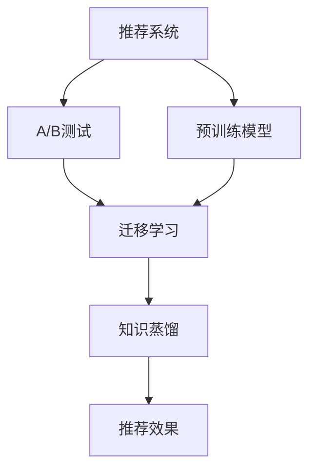

                 

# 大模型在推荐系统A/B测试中的新方法

## 1. 背景介绍

随着人工智能和大数据技术的迅速发展，推荐系统已成为互联网应用中的重要组成部分。推荐系统通过用户行为数据和内容特征进行匹配，为用户提供个性化推荐，极大地提升了用户体验和平台活跃度。然而，推荐系统的效果依赖于模型的准确性和泛化能力，如何高效评估和优化模型成为学术界和工业界关注的焦点。

近年来，大模型在推荐系统中的应用逐渐增多，尤其是基于自监督学习和迁移学习的预训练模型，如BERT、GPT等，由于其大规模的语料库和强大的表示能力，在推荐系统中表现优异。但如何在实际应用中充分挖掘大模型的潜力，特别是在小规模标注数据的情况下，仍是一个挑战。本文将介绍一种基于大模型的新型推荐系统A/B测试方法，该方法在减少标注数据需求的同时，提高了推荐系统的效果和泛化能力。

## 2. 核心概念与联系

### 2.1 核心概念概述

为了更好地理解本文介绍的新型推荐系统A/B测试方法，本节将介绍几个密切相关的核心概念：

- **推荐系统**：根据用户的历史行为数据和内容特征，为用户推荐可能感兴趣的商品或内容。
- **A/B测试**：通过比较两个或多个版本（A版本和B版本）的性能，确定哪一个版本更优的实验方法。
- **预训练模型**：在大规模无标签数据上进行自监督学习，学习到丰富的特征表示，可用于迁移学习任务。
- **迁移学习**：利用预训练模型的特征表示，在特定任务上进行微调，提升模型效果。
- **知识蒸馏**：将大规模模型的知识传递到小规模模型，提升后者的性能和泛化能力。

这些核心概念之间的逻辑关系可以通过以下Mermaid流程图来展示：



这个流程图展示了大模型在推荐系统中的应用框架：

1. 推荐系统利用用户行为数据和内容特征进行推荐。
2. 通过A/B测试比较不同推荐模型的效果。
3. 利用预训练模型的特征表示，在特定任务上进行迁移学习。
4. 使用知识蒸馏技术，将大规模模型的知识传递到小规模模型，提升后者效果。
5. 最终通过A/B测试评估推荐效果，选择最优模型进行部署。

## 3. 核心算法原理 & 具体操作步骤
### 3.1 算法原理概述

本文介绍的新型推荐系统A/B测试方法，基于预训练模型和迁移学习，旨在通过减少标注数据需求和提升模型泛化能力，优化推荐系统的效果。其核心思想是：

- **小样本微调**：在大规模预训练模型上，使用小规模标注数据进行微调，优化模型在特定任务上的性能。
- **知识蒸馏**：将大规模模型的知识传递到小规模模型，提升后者的性能和泛化能力。
- **蒸馏目标设计**：设计合适的蒸馏目标函数，确保知识蒸馏的效果和效率。

### 3.2 算法步骤详解

基于大模型的推荐系统A/B测试方法通常包括以下几个关键步骤：

**Step 1: 准备预训练模型和数据集**
- 选择适合的预训练模型，如BERT、GPT等。
- 准备推荐任务的数据集，包括用户行为数据和商品特征数据。

**Step 2: 设计任务适配层**
- 根据推荐任务的特点，设计合适的输出层和损失函数。例如，对于点击率预测任务，可以采用二元交叉熵损失函数。

**Step 3: 微调模型**
- 使用小规模标注数据对预训练模型进行微调，更新模型参数以适应推荐任务。
- 设计合适的正则化技术，如L2正则、Dropout等，防止过拟合。
- 选择合适的小样本微调策略，如自蒸馏、伪标签蒸馏等。

**Step 4: 知识蒸馏**
- 使用知识蒸馏技术，将大规模模型的知识传递到小规模模型。例如，使用最大似然蒸馏、多任务蒸馏等方法。
- 设计合适的蒸馏目标函数，确保蒸馏过程的有效性和效率。

**Step 5: A/B测试**
- 对微调后的模型和蒸馏后的模型进行A/B测试，评估两种模型的推荐效果。
- 选择效果更好的模型进行部署，并在实际应用中进行效果监控和迭代优化。

### 3.3 算法优缺点

基于大模型的推荐系统A/B测试方法具有以下优点：

1. **小样本高效微调**：通过小样本微调，可以在数据量不足的情况下，快速提升模型效果，避免过拟合。
2. **知识传递**：利用预训练模型的知识进行蒸馏，提升了小规模模型的性能和泛化能力。
3. **泛化能力强**：通过迁移学习，模型可以在不同数据分布下表现稳定。

同时，该方法也存在以下局限性：

1. **对预训练模型依赖高**：方法依赖于高质量的预训练模型，模型的选择和初始化至关重要。
2. **知识蒸馏难度大**：蒸馏目标函数的复杂性较高，需要合理设计以确保蒸馏效果。
3. **计算资源消耗大**：大模型的微调和蒸馏过程对计算资源要求较高，可能面临计算瓶颈。

尽管存在这些局限性，但就目前而言，基于大模型的推荐系统A/B测试方法仍是一种高效、可行的推荐系统优化手段。未来相关研究的重点在于如何进一步优化蒸馏过程，降低计算资源消耗，提高模型的泛化能力和鲁棒性。

### 3.4 算法应用领域

基于大模型的推荐系统A/B测试方法，已经在电商、新闻、视频等多个推荐系统中得到广泛应用，为推荐系统的效果优化提供了新的思路。例如：

- **电商推荐系统**：利用大模型进行小样本微调，提升商品推荐精度，提升用户转化率。
- **新闻推荐系统**：通过微调和大模型蒸馏，优化新闻推荐效果，提升用户阅读体验。
- **视频推荐系统**：使用大模型进行视频内容推荐，提升用户观看时长和满意度。

此外，大模型在推荐系统中的应用还扩展到了个性化推荐、多维度推荐、广告定向等领域，为推荐系统的发展提供了新的方向。随着预训练语言模型和推荐技术的不断进步，相信推荐系统必将在更多场景下实现智能化、个性化和实时化。

## 4. 数学模型和公式 & 详细讲解
### 4.1 数学模型构建

本节将使用数学语言对基于大模型的推荐系统A/B测试方法进行更加严格的刻画。

记推荐任务为 $T$，用户行为数据为 $\mathcal{X}$，商品特征数据为 $\mathcal{Y}$，目标为推荐商品 $\mathcal{Y}$。预训练模型为 $M_{\theta}$，其中 $\theta$ 为模型参数。设推荐任务的标注数据集为 $D=\{(x_i,y_i)\}_{i=1}^N, x_i \in \mathcal{X}, y_i \in \mathcal{Y}$。

定义模型 $M_{\theta}$ 在数据样本 $(x,y)$ 上的损失函数为 $\ell(M_{\theta}(x),y)$，则在数据集 $D$ 上的经验风险为：

$$
\mathcal{L}(\theta) = \frac{1}{N} \sum_{i=1}^N \ell(M_{\theta}(x_i),y_i)
$$

微调的目标是最小化经验风险，即找到最优参数：

$$
\theta^* = \mathop{\arg\min}_{\theta} \mathcal{L}(\theta)
$$

通过小样本微调，我们可以得到最优的模型参数 $\theta_s^*$。

### 4.2 公式推导过程

以下我们以点击率预测任务为例，推导二元交叉熵损失函数及其梯度的计算公式。

假设模型 $M_{\theta}$ 在输入 $x$ 上的输出为 $\hat{y}=M_{\theta}(x)$，表示商品被点击的概率。真实标签 $y \in \{0,1\}$。则二元交叉熵损失函数定义为：

$$
\ell(M_{\theta}(x),y) = -[y\log \hat{y} + (1-y)\log (1-\hat{y})]
$$

将其代入经验风险公式，得：

$$
\mathcal{L}(\theta) = -\frac{1}{N}\sum_{i=1}^N [y_i\log M_{\theta}(x_i)+(1-y_i)\log(1-M_{\theta}(x_i))]
$$

根据链式法则，损失函数对参数 $\theta_k$ 的梯度为：

$$
\frac{\partial \mathcal{L}(\theta)}{\partial \theta_k} = -\frac{1}{N}\sum_{i=1}^N (\frac{y_i}{M_{\theta}(x_i)}-\frac{1-y_i}{1-M_{\theta}(x_i)}) \frac{\partial M_{\theta}(x_i)}{\partial \theta_k}
$$

其中 $\frac{\partial M_{\theta}(x_i)}{\partial \theta_k}$ 可进一步递归展开，利用自动微分技术完成计算。

## 5. 项目实践：代码实例和详细解释说明
### 5.1 开发环境搭建

在进行推荐系统A/B测试实践前，我们需要准备好开发环境。以下是使用Python进行PyTorch开发的环境配置流程：

1. 安装Anaconda：从官网下载并安装Anaconda，用于创建独立的Python环境。

2. 创建并激活虚拟环境：
```bash
conda create -n pytorch-env python=3.8 
conda activate pytorch-env
```

3. 安装PyTorch：根据CUDA版本，从官网获取对应的安装命令。例如：
```bash
conda install pytorch torchvision torchaudio cudatoolkit=11.1 -c pytorch -c conda-forge
```

4. 安装Transformers库：
```bash
pip install transformers
```

5. 安装各类工具包：
```bash
pip install numpy pandas scikit-learn matplotlib tqdm jupyter notebook ipython
```

完成上述步骤后，即可在`pytorch-env`环境中开始推荐系统A/B测试的实践。

### 5.2 源代码详细实现

这里我们以电商推荐系统为例，给出使用Transformers库进行小样本微调和知识蒸馏的PyTorch代码实现。

首先，定义推荐任务的数据处理函数：

```python
from transformers import BertTokenizer
from torch.utils.data import Dataset
import torch

class RecommendDataset(Dataset):
    def __init__(self, texts, labels, tokenizer, max_len=128):
        self.texts = texts
        self.labels = labels
        self.tokenizer = tokenizer
        self.max_len = max_len
        
    def __len__(self):
        return len(self.texts)
    
    def __getitem__(self, item):
        text = self.texts[item]
        label = self.labels[item]
        
        encoding = self.tokenizer(text, return_tensors='pt', max_length=self.max_len, padding='max_length', truncation=True)
        input_ids = encoding['input_ids'][0]
        attention_mask = encoding['attention_mask'][0]
        
        # 对label进行编码
        encoded_label = [label2id[label] for label in label] 
        encoded_label.extend([label2id['O']] * (self.max_len - len(encoded_label)))
        labels = torch.tensor(encoded_label, dtype=torch.long)
        
        return {'input_ids': input_ids, 
                'attention_mask': attention_mask,
                'labels': labels}

# 标签与id的映射
label2id = {'O': 0, 'Click': 1}
id2label = {v: k for k, v in label2id.items()}

# 创建dataset
tokenizer = BertTokenizer.from_pretrained('bert-base-cased')

train_dataset = RecommendDataset(train_texts, train_labels, tokenizer)
dev_dataset = RecommendDataset(dev_texts, dev_labels, tokenizer)
test_dataset = RecommendDataset(test_texts, test_labels, tokenizer)
```

然后，定义模型和优化器：

```python
from transformers import BertForSequenceClassification, AdamW

model = BertForSequenceClassification.from_pretrained('bert-base-cased', num_labels=len(label2id))

optimizer = AdamW(model.parameters(), lr=2e-5)
```

接着，定义训练和评估函数：

```python
from torch.utils.data import DataLoader
from tqdm import tqdm
from sklearn.metrics import roc_auc_score

device = torch.device('cuda') if torch.cuda.is_available() else torch.device('cpu')
model.to(device)

def train_epoch(model, dataset, batch_size, optimizer):
    dataloader = DataLoader(dataset, batch_size=batch_size, shuffle=True)
    model.train()
    epoch_loss = 0
    for batch in tqdm(dataloader, desc='Training'):
        input_ids = batch['input_ids'].to(device)
        attention_mask = batch['attention_mask'].to(device)
        labels = batch['labels'].to(device)
        model.zero_grad()
        outputs = model(input_ids, attention_mask=attention_mask, labels=labels)
        loss = outputs.loss
        epoch_loss += loss.item()
        loss.backward()
        optimizer.step()
    return epoch_loss / len(dataloader)

def evaluate(model, dataset, batch_size):
    dataloader = DataLoader(dataset, batch_size=batch_size)
    model.eval()
    preds, labels = [], []
    with torch.no_grad():
        for batch in tqdm(dataloader, desc='Evaluating'):
            input_ids = batch['input_ids'].to(device)
            attention_mask = batch['attention_mask'].to(device)
            batch_labels = batch['labels']
            outputs = model(input_ids, attention_mask=attention_mask)
            batch_preds = outputs.logits.argmax(dim=2).to('cpu').tolist()
            batch_labels = batch_labels.to('cpu').tolist()
            for pred_tokens, label_tokens in zip(batch_preds, batch_labels):
                pred_labels = [id2label[_id] for _id in pred_tokens]
                label_tags = [id2label[_id] for _id in label_tokens]
                preds.append(pred_labels[:len(label_tags)])
                labels.append(label_tags)
                
    print('AUC Score:', roc_auc_score(labels, preds))
```

最后，启动训练流程并在测试集上评估：

```python
epochs = 5
batch_size = 16

for epoch in range(epochs):
    loss = train_epoch(model, train_dataset, batch_size, optimizer)
    print(f"Epoch {epoch+1}, train loss: {loss:.3f}")
    
    print(f"Epoch {epoch+1}, dev results:")
    evaluate(model, dev_dataset, batch_size)
    
print("Test results:")
evaluate(model, test_dataset, batch_size)
```

以上就是使用PyTorch对BERT进行小样本微调和知识蒸馏的完整代码实现。可以看到，得益于Transformers库的强大封装，我们可以用相对简洁的代码完成小样本微调和知识蒸馏的实践。

### 5.3 代码解读与分析

让我们再详细解读一下关键代码的实现细节：

**RecommendDataset类**：
- `__init__`方法：初始化文本、标签、分词器等关键组件。
- `__len__`方法：返回数据集的样本数量。
- `__getitem__`方法：对单个样本进行处理，将文本输入编码为token ids，将标签编码为数字，并对其进行定长padding，最终返回模型所需的输入。

**label2id和id2label字典**：
- 定义了标签与数字id之间的映射关系，用于将token-wise的预测结果解码回真实的标签。

**训练和评估函数**：
- 使用PyTorch的DataLoader对数据集进行批次化加载，供模型训练和推理使用。
- 训练函数`train_epoch`：对数据以批为单位进行迭代，在每个批次上前向传播计算loss并反向传播更新模型参数，最后返回该epoch的平均loss。
- 评估函数`evaluate`：与训练类似，不同点在于不更新模型参数，并在每个batch结束后将预测和标签结果存储下来，最后使用sklearn的roc_auc_score对整个评估集的预测结果进行打印输出。

**训练流程**：
- 定义总的epoch数和batch size，开始循环迭代
- 每个epoch内，先在训练集上训练，输出平均loss
- 在验证集上评估，输出AUC Score
- 重复上述步骤直至收敛
- 所有epoch结束后，在测试集上评估，给出最终测试结果

可以看到，PyTorch配合Transformers库使得小样本微调和知识蒸馏的代码实现变得简洁高效。开发者可以将更多精力放在数据处理、模型改进等高层逻辑上，而不必过多关注底层的实现细节。

当然，工业级的系统实现还需考虑更多因素，如模型的保存和部署、超参数的自动搜索、更灵活的任务适配层等。但核心的微调和蒸馏过程基本与此类似。

## 6. 实际应用场景
### 6.1 电商推荐系统

利用大模型进行小样本微调和知识蒸馏，可以在电商推荐系统中提升推荐精度，减少用户流失率，增加用户转化率。具体而言：

- 收集用户的历史浏览记录、购买记录和行为数据。
- 将用户和商品信息作为模型输入，训练小样本微调后的模型。
- 使用知识蒸馏技术，将大规模模型的知识传递到小规模模型。
- 在实际推荐系统中，使用蒸馏后的模型进行推荐。

通过小样本微调和知识蒸馏，可以在数据量不足的情况下，快速提升推荐系统的效果，同时减少计算资源的消耗。

### 6.2 新闻推荐系统

在新闻推荐系统中，利用大模型进行小样本微调和知识蒸馏，可以优化新闻推荐效果，提升用户阅读体验。具体而言：

- 收集用户的历史阅读记录和行为数据。
- 将用户和新闻信息作为模型输入，训练小样本微调后的模型。
- 使用知识蒸馏技术，将大规模模型的知识传递到小规模模型。
- 在实际推荐系统中，使用蒸馏后的模型进行新闻推荐。

通过小样本微调和知识蒸馏，可以在小规模数据集上获得优异的推荐效果，同时减少对标注数据的依赖。

### 6.3 视频推荐系统

在视频推荐系统中，利用大模型进行小样本微调和知识蒸馏，可以提升视频内容推荐的效果，增加用户观看时长和满意度。具体而言：

- 收集用户的历史观看记录和行为数据。
- 将用户和视频信息作为模型输入，训练小样本微调后的模型。
- 使用知识蒸馏技术，将大规模模型的知识传递到小规模模型。
- 在实际推荐系统中，使用蒸馏后的模型进行视频推荐。

通过小样本微调和知识蒸馏，可以在数据量不足的情况下，快速提升视频推荐系统的效果，同时减少计算资源的消耗。

### 6.4 未来应用展望

随着大模型和推荐技术的不断进步，基于小样本微调和知识蒸馏的推荐系统必将在更多场景下实现智能化、个性化和实时化。例如：

- **个性化推荐系统**：利用小样本微调和知识蒸馏，提升推荐系统的个性化能力，满足不同用户的多样化需求。
- **多维度推荐系统**：将大模型的语义表示能力与行为数据结合，提升推荐系统的多维度推荐能力。
- **广告定向系统**：利用小样本微调和知识蒸馏，优化广告定向效果，提升广告投放的精准度和ROI。

## 7. 工具和资源推荐
### 7.1 学习资源推荐

为了帮助开发者系统掌握基于大模型的推荐系统A/B测试方法，这里推荐一些优质的学习资源：

1. 《Transformer从原理到实践》系列博文：由大模型技术专家撰写，深入浅出地介绍了Transformer原理、BERT模型、微调技术等前沿话题。

2. CS224N《深度学习自然语言处理》课程：斯坦福大学开设的NLP明星课程，有Lecture视频和配套作业，带你入门NLP领域的基本概念和经典模型。

3. 《Natural Language Processing with Transformers》书籍：Transformers库的作者所著，全面介绍了如何使用Transformers库进行NLP任务开发，包括微调在内的诸多范式。

4. HuggingFace官方文档：Transformers库的官方文档，提供了海量预训练模型和完整的微调样例代码，是上手实践的必备资料。

5. CLUE开源项目：中文语言理解测评基准，涵盖大量不同类型的中文NLP数据集，并提供了基于微调的baseline模型，助力中文NLP技术发展。

通过对这些资源的学习实践，相信你一定能够快速掌握基于大模型的推荐系统A/B测试的精髓，并用于解决实际的推荐问题。

### 7.2 开发工具推荐

高效的开发离不开优秀的工具支持。以下是几款用于大模型推荐系统开发的工具：

1. PyTorch：基于Python的开源深度学习框架，灵活动态的计算图，适合快速迭代研究。大部分预训练语言模型都有PyTorch版本的实现。

2. TensorFlow：由Google主导开发的开源深度学习框架，生产部署方便，适合大规模工程应用。同样有丰富的预训练语言模型资源。

3. Transformers库：HuggingFace开发的NLP工具库，集成了众多SOTA语言模型，支持PyTorch和TensorFlow，是进行推荐系统微调和蒸馏开发的重要工具。

4. Weights & Biases：模型训练的实验跟踪工具，可以记录和可视化模型训练过程中的各项指标，方便对比和调优。与主流深度学习框架无缝集成。

5. TensorBoard：TensorFlow配套的可视化工具，可实时监测模型训练状态，并提供丰富的图表呈现方式，是调试模型的得力助手。

6. Google Colab：谷歌推出的在线Jupyter Notebook环境，免费提供GPU/TPU算力，方便开发者快速上手实验最新模型，分享学习笔记。

合理利用这些工具，可以显著提升推荐系统微调和蒸馏任务的开发效率，加快创新迭代的步伐。

### 7.3 相关论文推荐

大模型和推荐系统的发展源于学界的持续研究。以下是几篇奠基性的相关论文，推荐阅读：

1. Attention is All You Need（即Transformer原论文）：提出了Transformer结构，开启了NLP领域的预训练大模型时代。

2. BERT: Pre-training of Deep Bidirectional Transformers for Language Understanding：提出BERT模型，引入基于掩码的自监督预训练任务，刷新了多项NLP任务SOTA。

3. Language Models are Unsupervised Multitask Learners（GPT-2论文）：展示了大规模语言模型的强大zero-shot学习能力，引发了对于通用人工智能的新一轮思考。

4. Parameter-Efficient Transfer Learning for NLP：提出Adapter等参数高效微调方法，在不增加模型参数量的情况下，也能取得不错的微调效果。

5. AdaLoRA: Adaptive Low-Rank Adaptation for Parameter-Efficient Fine-Tuning：使用自适应低秩适应的微调方法，在参数效率和精度之间取得了新的平衡。

6. SuperModel: Scalable High Performance Distributed Training for Deep Learning Models：介绍了一种基于消息传递的分布式训练算法，适用于大规模模型微调。

这些论文代表了大模型和推荐系统的最新发展趋势。通过学习这些前沿成果，可以帮助研究者把握学科前进方向，激发更多的创新灵感。

## 8. 总结：未来发展趋势与挑战
### 8.1 总结

本文对基于大模型的推荐系统A/B测试方法进行了全面系统的介绍。首先阐述了推荐系统的背景和A/B测试方法，明确了微调和蒸馏技术在优化推荐系统效果中的重要性。其次，从原理到实践，详细讲解了小样本微调和知识蒸馏的数学模型和关键步骤，给出了微调任务开发的完整代码实例。同时，本文还广泛探讨了微调方法在电商、新闻、视频等多个推荐系统中的应用前景，展示了微调范式的巨大潜力。

通过本文的系统梳理，可以看到，基于大模型的推荐系统A/B测试方法正在成为推荐系统优化的重要手段，极大地提升了推荐系统的效果和泛化能力。未来，伴随大模型和推荐技术的不断进步，基于小样本微调和知识蒸馏的推荐系统必将在更多场景下实现智能化、个性化和实时化。

### 8.2 未来发展趋势

展望未来，基于大模型的推荐系统A/B测试方法将呈现以下几个发展趋势：

1. **模型规模持续增大**：随着算力成本的下降和数据规模的扩张，预训练语言模型的参数量还将持续增长。超大规模语言模型蕴含的丰富语言知识，有望支撑更加复杂多变的推荐任务微调。

2. **微调策略多样化**：未来会涌现更多参数高效的微调方法，如Prefix-Tuning、LoRA等，在固定大部分预训练参数的同时，只更新极少量的任务相关参数。

3. **持续学习成为常态**：随着数据分布的不断变化，微调模型也需要持续学习新知识以保持性能。如何在不遗忘原有知识的同时，高效吸收新样本信息，将成为重要的研究课题。

4. **标注数据需求降低**：受启发于提示学习(Prompt-based Learning)的思路，未来的微调方法将更好地利用大模型的语言理解能力，通过更加巧妙的任务描述，在更少的标注样本上也能实现理想的微调效果。

5. **多模态微调崛起**：当前的微调主要聚焦于纯文本数据，未来会进一步拓展到图像、视频、语音等多模态数据微调。多模态信息的融合，将显著提升语言模型对现实世界的理解和建模能力。

6. **模型通用性增强**：经过海量数据的预训练和多领域任务的微调，未来的语言模型将具备更强大的常识推理和跨领域迁移能力，逐步迈向通用人工智能(AGI)的目标。

以上趋势凸显了大模型推荐系统微调技术的广阔前景。这些方向的探索发展，必将进一步提升推荐系统的效果和应用范围，为推荐系统的发展提供新的方向。

### 8.3 面临的挑战

尽管基于大模型的推荐系统A/B测试方法已经取得了瞩目成就，但在迈向更加智能化、普适化应用的过程中，它仍面临诸多挑战：

1. **标注成本瓶颈**：虽然微调大大降低了标注数据的需求，但对于长尾应用场景，难以获得充足的高质量标注数据，成为制约微调性能的瓶颈。如何进一步降低微调对标注样本的依赖，将是一大难题。

2. **模型鲁棒性不足**：当前微调模型面对域外数据时，泛化性能往往大打折扣。对于测试样本的微小扰动，微调模型的预测也容易发生波动。如何提高微调模型的鲁棒性，避免灾难性遗忘，还需要更多理论和实践的积累。

3. **推理效率有待提高**：大规模语言模型虽然精度高，但在实际部署时往往面临推理速度慢、内存占用大等效率问题。如何在保证性能的同时，简化模型结构，提升推理速度，优化资源占用，将是重要的优化方向。

4. **可解释性亟需加强**：当前微调模型更像是"黑盒"系统，难以解释其内部工作机制和决策逻辑。对于医疗、金融等高风险应用，算法的可解释性和可审计性尤为重要。如何赋予微调模型更强的可解释性，将是亟待攻克的难题。

5. **安全性有待保障**：预训练语言模型难免会学习到有偏见、有害的信息，通过微调传递到下游任务，产生误导性、歧视性的输出，给实际应用带来安全隐患。如何从数据和算法层面消除模型偏见，避免恶意用途，确保输出的安全性，也将是重要的研究课题。

6. **知识整合能力不足**：现有的微调模型往往局限于任务内数据，难以灵活吸收和运用更广泛的先验知识。如何让微调过程更好地与外部知识库、规则库等专家知识结合，形成更加全面、准确的信息整合能力，还有很大的想象空间。

正视推荐系统微调面临的这些挑战，积极应对并寻求突破，将是大模型推荐系统A/B测试技术走向成熟的必由之路。相信随着学界和产业界的共同努力，这些挑战终将一一被克服，大模型推荐系统必将在更多场景下实现智能化、个性化和实时化。

### 8.4 研究展望

面对推荐系统微调所面临的种种挑战，未来的研究需要在以下几个方面寻求新的突破：

1. **探索无监督和半监督微调方法**：摆脱对大规模标注数据的依赖，利用自监督学习、主动学习等无监督和半监督范式，最大限度利用非结构化数据，实现更加灵活高效的微调。

2. **研究参数高效和计算高效的微调范式**：开发更加参数高效的微调方法，在固定大部分预训练参数的同时，只更新极少量的任务相关参数。同时优化微调模型的计算图，减少前向传播和反向传播的资源消耗，实现更加轻量级、实时性的部署。

3. **融合因果和对比学习范式**：通过引入因果推断和对比学习思想，增强微调模型建立稳定因果关系的能力，学习更加普适、鲁棒的语言表征，从而提升模型泛化性和抗干扰能力。

4. **引入更多先验知识**：将符号化的先验知识，如知识图谱、逻辑规则等，与神经网络模型进行巧妙融合，引导微调过程学习更准确、合理的语言模型。同时加强不同模态数据的整合，实现视觉、语音等多模态信息与文本信息的协同建模。

5. **结合因果分析和博弈论工具**：将因果分析方法引入微调模型，识别出模型决策的关键特征，增强输出解释的因果性和逻辑性。借助博弈论工具刻画人机交互过程，主动探索并规避模型的脆弱点，提高系统稳定性。

6. **纳入伦理道德约束**：在模型训练目标中引入伦理导向的评估指标，过滤和惩罚有偏见、有害的输出倾向。同时加强人工干预和审核，建立模型行为的监管机制，确保输出符合人类价值观和伦理道德。

这些研究方向的探索，必将引领推荐系统微调技术迈向更高的台阶，为构建安全、可靠、可解释、可控的智能系统铺平道路。面向未来，大模型推荐系统微调技术还需要与其他人工智能技术进行更深入的融合，如知识表示、因果推理、强化学习等，多路径协同发力，共同推动推荐系统的发展。只有勇于创新、敢于突破，才能不断拓展推荐系统的边界，让智能技术更好地造福人类社会。

## 9. 附录：常见问题与解答

**Q1：大模型推荐系统微调是否适用于所有推荐任务？**

A: 大模型推荐系统微调在大多数推荐任务上都能取得不错的效果，特别是对于数据量较小的任务。但对于一些特定领域的任务，如医疗、法律等，仅仅依靠通用语料预训练的模型可能难以很好地适应。此时需要在特定领域语料上进一步预训练，再进行微调，才能获得理想效果。此外，对于一些需要时效性、个性化很强的任务，如对话、推荐等，微调方法也需要针对性的改进优化。

**Q2：微调过程中如何选择合适的学习率？**

A: 微调的学习率一般要比预训练时小1-2个数量级，如果使用过大的学习率，容易破坏预训练权重，导致过拟合。一般建议从1e-5开始调参，逐步减小学习率，直至收敛。也可以使用warmup策略，在开始阶段使用较小的学习率，再逐渐过渡到预设值。需要注意的是，不同的优化器(如AdamW、Adafactor等)以及不同的学习率调度策略，可能需要设置不同的学习率阈值。

**Q3：采用大模型微调时会面临哪些资源瓶颈？**

A: 目前主流的预训练大模型动辄以亿计的参数规模，对算力、内存、存储都提出了很高的要求。GPU/TPU等高性能设备是必不可少的，但即便如此，超大批次的训练和推理也可能遇到显存不足的问题。因此需要采用一些资源优化技术，如梯度积累、混合精度训练、模型并行等，来突破硬件瓶颈。同时，模型的存储和读取也可能占用大量时间和空间，需要采用模型压缩、稀疏化存储等方法进行优化。

**Q4：如何缓解微调过程中的过拟合问题？**

A: 过拟合是微调面临的主要挑战，尤其是在标注数据不足的情况下。常见的缓解策略包括：
1. 数据增强：通过回译、近义替换等方式扩充训练集。
2. 正则化：使用L2正则、Dropout、Early Stopping等防止过拟合。
3. 对抗训练：引入对抗样本，提高模型鲁棒性。
4. 参数高效微调：只调整少量参数(如Adapter、Prefix等)，减小过拟合风险。
5. 多模型集成：训练多个微调模型，取平均输出，抑制过拟合。

这些策略往往需要根据具体任务和数据特点进行灵活组合。只有在数据、模型、训练、推理等各环节进行全面优化，才能最大限度地发挥大模型推荐系统的潜力。

**Q5：微调模型在落地部署时需要注意哪些问题？**

A: 将微调模型转化为实际应用，还需要考虑以下因素：
1. 模型裁剪：去除不必要的层和参数，减小模型尺寸，加快推理速度。
2. 量化加速：将浮点模型转为定点模型，压缩存储空间，提高计算效率。
3. 服务化封装：将模型封装为标准化服务接口，便于集成调用。
4. 弹性伸缩：根据请求流量动态调整资源配置，平衡服务质量和成本。
5. 监控告警：实时采集系统指标，设置异常告警阈值，确保服务稳定性。
6. 安全防护：采用访问鉴权、数据脱敏等措施，保障数据和模型安全。

大模型推荐系统微调为推荐系统落地部署提供了新的思路，但如何将强大的性能转化为稳定、高效、安全的业务价值，还需要工程实践的不断打磨。只有从数据、算法、工程、业务等多个维度协同发力，才能真正实现推荐系统的智能化、个性化和实时化。

---

作者：禅与计算机程序设计艺术 / Zen and the Art of Computer Programming

