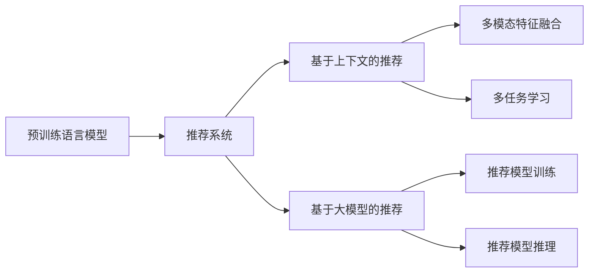

                 

## 1. 背景介绍

随着互联网应用的蓬勃发展，推荐系统已经成为众多应用中不可或缺的一部分。无论是电商、社交媒体，还是视频网站，推荐系统都能通过分析用户的行为数据，向用户推荐个性化的内容。然而，传统的推荐算法基于静态特征或单一模型的预测，难以应对用户动态变化的需求和复杂多变的场景。

大模型，尤其是预训练语言模型（如BERT、GPT等）的出现，为推荐系统注入了新的活力。这些模型通过海量的无标签文本数据进行预训练，学习到了丰富的语义表示和语言规律，能够在更加复杂、动态的上下文中进行推断。本文将从上下文感知推荐的角度，探讨如何利用大模型提高推荐系统的精度和效果。

## 2. 核心概念与联系

### 2.1 核心概念概述

在进行推荐系统上下文感知的应用时，以下几个概念至关重要：

- 预训练语言模型(Pre-trained Language Models, PLMs)：以BERT、GPT等为代表，通过在大规模无标签文本上预训练得到的通用语言模型。能够捕捉语言的丰富特征和上下文关系。

- 推荐系统(Recommender Systems)：利用用户行为数据，向用户推荐个性化内容的技术。传统推荐算法基于静态特征或单一模型，难以应对用户动态变化的需求。

- 上下文感知(Context-aware)：指推荐系统在推荐过程中能够理解用户的上下文信息，如历史行为、当前环境、社会关系等，提供更加个性化和精准的推荐。

- 基于大模型的推荐系统(Large Model-based Recommender Systems)：指利用预训练语言模型，在推荐系统中进行用户特征提取、行为建模等任务的推荐方法。通过大模型的强大语义表示能力，提高推荐系统的上下文感知能力。

这些核心概念之间的关系可以通过以下Mermaid流程图来展示：



这个流程图展示了预训练语言模型如何在推荐系统中发挥作用，通过多模态特征融合和多任务学习等方法，提升推荐系统的上下文感知能力。

## 3. 核心算法原理 & 具体操作步骤

### 3.1 算法原理概述

基于大模型的推荐系统通过将预训练语言模型的语义表示能力引入推荐过程，能够更好地捕捉用户的动态需求和复杂场景。其核心思想是在推荐模型中引入上下文信息，通过预训练语言模型进行多模态特征融合和多任务学习，最终输出推荐结果。

具体来说，基于大模型的推荐系统可以分为以下几个步骤：

1. **用户特征提取**：通过预训练语言模型将用户的历史行为、兴趣等静态特征转换为语义表示。

2. **上下文建模**：利用预训练语言模型提取上下文信息，如用户当前的状态、场景、社会关系等。

3. **多模态特征融合**：将用户静态特征和上下文信息进行融合，形成更加全面、丰富的用户表示。

4. **多任务学习**：将推荐任务与其他相关任务（如情感分析、问答系统等）共同学习，提高模型的泛化能力和上下文感知能力。

5. **推荐模型训练**：利用多模态特征和多任务学习的输出，通过深度学习模型进行推荐结果预测。

6. **推荐模型推理**：在实际应用中，通过推理引擎输出个性化推荐。

### 3.2 算法步骤详解

#### 3.2.1 用户特征提取

用户特征提取是推荐系统中的重要环节，通过将用户的历史行为、兴趣等静态特征转换为语义表示，可以更好地捕捉用户的长期兴趣和行为模式。

具体来说，可以利用预训练语言模型（如BERT）对用户的静态特征（如浏览历史、收藏记录等）进行编码，得到用户的多维语义表示。这一步骤通常包括以下几个步骤：

1. **特征编码**：将用户的静态特征转换为向量表示。

2. **预训练模型编码**：利用预训练语言模型（如BERT）对向量进行编码，得到用户的语义表示。

3. **向量拼接**：将用户的静态特征向量和语义表示向量进行拼接，得到多维用户向量。

#### 3.2.2 上下文建模

上下文建模是推荐系统上下文感知的关键环节，通过理解用户的当前状态、场景和社会关系等，可以提高推荐结果的精准度和个性化程度。

具体来说，可以利用预训练语言模型对用户当前的状态、场景和社会关系等上下文信息进行编码，得到上下文向量。这一步骤通常包括以下几个步骤：

1. **上下文编码**：将用户的当前状态、场景和社会关系等转换为向量表示。

2. **预训练模型编码**：利用预训练语言模型（如BERT）对向量进行编码，得到上下文向量。

3. **向量拼接**：将上下文向量与用户的多维语义表示向量进行拼接，得到带上下文的向量表示。

#### 3.2.3 多模态特征融合

多模态特征融合是将用户的静态特征和上下文信息进行融合，形成更加全面、丰富的用户表示。

具体来说，可以利用预训练语言模型对用户的静态特征和上下文信息进行编码，然后将得到的向量进行拼接或加权平均，得到带上下文的用户向量。这一步骤通常包括以下几个步骤：

1. **多模态编码**：将用户的静态特征和上下文信息转换为向量表示。

2. **特征融合**：利用预训练语言模型对向量进行编码，然后对编码结果进行拼接或加权平均，得到融合后的向量。

3. **向量拼接**：将融合后的向量与用户的多维语义表示向量进行拼接，得到带上下文的用户向量。

#### 3.2.4 多任务学习

多任务学习是将推荐任务与其他相关任务共同学习，提高模型的泛化能力和上下文感知能力。

具体来说，可以利用预训练语言模型对推荐任务和其他相关任务进行编码，然后通过深度学习模型对这些任务进行联合训练，提高模型的泛化能力和上下文感知能力。这一步骤通常包括以下几个步骤：

1. **多任务编码**：将推荐任务和其他相关任务转换为向量表示。

2. **多任务融合**：利用预训练语言模型对向量进行编码，然后对编码结果进行拼接或加权平均，得到融合后的向量。

3. **联合训练**：将融合后的向量输入到深度学习模型中进行联合训练，提高模型的泛化能力和上下文感知能力。

#### 3.2.5 推荐模型训练

推荐模型训练是利用多模态特征和多任务学习的输出，通过深度学习模型进行推荐结果预测。

具体来说，可以利用预训练语言模型对融合后的向量进行编码，然后通过深度学习模型（如DNN、CNN等）进行推荐结果预测。这一步骤通常包括以下几个步骤：

1. **特征编码**：将融合后的向量转换为向量表示。

2. **模型训练**：利用预训练语言模型对向量进行编码，然后将编码结果输入到深度学习模型中进行训练。

3. **推荐预测**：利用训练好的模型进行推荐结果预测。

#### 3.2.6 推荐模型推理

推荐模型推理是在实际应用中，通过推理引擎输出个性化推荐。

具体来说，可以利用预训练语言模型对融合后的向量进行编码，然后通过深度学习模型进行推荐结果预测。这一步骤通常包括以下几个步骤：

1. **特征编码**：将融合后的向量转换为向量表示。

2. **模型推理**：利用预训练语言模型对向量进行编码，然后将编码结果输入到深度学习模型中进行推理。

3. **推荐输出**：利用推理结果输出个性化推荐。

### 3.3 算法优缺点

基于大模型的推荐系统具有以下优点：

1. **上下文感知能力强**：利用预训练语言模型提取上下文信息，能够更好地理解用户的动态需求和复杂场景。

2. **泛化能力强**：多任务学习能够提高模型的泛化能力和适应性，适用于多种推荐任务。

3. **特征表示能力强**：多模态特征融合能够综合利用多种数据源，提高特征表示的全面性和丰富性。

4. **可解释性强**：利用预训练语言模型进行特征提取，能够提供更加直观的特征解释，增强模型的可解释性。

然而，基于大模型的推荐系统也存在一些缺点：

1. **计算资源消耗大**：预训练语言模型和深度学习模型需要大量的计算资源，部署和维护成本较高。

2. **模型复杂度高**：多模态特征融合和多任务学习等技术，增加了模型的复杂度和训练难度。

3. **数据需求量大**：需要大量的静态特征和上下文信息，数据收集和处理难度较大。

4. **可解释性问题**：模型的决策过程较复杂，难以提供直观的解释和调试。

### 3.4 算法应用领域

基于大模型的推荐系统在以下几个领域具有广泛的应用前景：

1. **电商推荐**：利用用户的浏览历史、收藏记录等静态特征和上下文信息，进行个性化商品推荐。

2. **社交媒体推荐**：利用用户的社交关系和兴趣爱好等上下文信息，进行个性化的内容推荐。

3. **视频推荐**：利用用户的观看历史和兴趣爱好等上下文信息，进行个性化的视频推荐。

4. **新闻推荐**：利用用户的阅读历史和兴趣爱好等上下文信息，进行个性化的新闻推荐。

5. **旅游推荐**：利用用户的旅游历史和兴趣爱好等上下文信息，进行个性化的旅游目的地推荐。

6. **金融推荐**：利用用户的投资历史和兴趣爱好等上下文信息，进行个性化的金融产品推荐。

## 4. 数学模型和公式 & 详细讲解 & 举例说明

### 4.1 数学模型构建

假设用户的历史行为和兴趣表示为$u=\{u_1,u_2,\ldots,u_n\}$，上下文信息表示为$c=\{c_1,c_2,\ldots,c_m\}$。利用预训练语言模型对静态特征和上下文信息进行编码，得到用户的多维语义表示$\mathbf{h}_u$和上下文向量$\mathbf{h}_c$。

将$\mathbf{h}_u$和$\mathbf{h}_c$进行拼接，得到带上下文的向量表示$\mathbf{h}_{uc}=[\mathbf{h}_u;\mathbf{h}_c]$。然后，利用预训练语言模型对$\mathbf{h}_{uc}$进行编码，得到带上下文的语义表示$\mathbf{h}_{\text{contextual}}$。

最后，利用深度学习模型（如DNN、CNN等）对$\mathbf{h}_{\text{contextual}}$进行推荐结果预测。设推荐任务的目标函数为$L$，则推荐模型训练的目标是最小化损失函数$L$：

$$
L=\frac{1}{N}\sum_{i=1}^N\ell(y_i,\hat{y}_i)
$$

其中，$y_i$为用户$i$的真实推荐结果，$\hat{y}_i$为模型预测的推荐结果，$\ell$为推荐损失函数，如均方误差、交叉熵等。

### 4.2 公式推导过程

设用户$i$的历史行为和兴趣表示为$u_i=\{u_{i1},u_{i2},\ldots,u_{in}\}$，上下文信息表示为$c_i=\{c_{i1},c_{i2},\ldots,c_{im}\}$。利用预训练语言模型对静态特征和上下文信息进行编码，得到用户的多维语义表示$\mathbf{h}_{ui}$和上下文向量$\mathbf{h}_{ci}$。

将$\mathbf{h}_{ui}$和$\mathbf{h}_{ci}$进行拼接，得到带上下文的向量表示$\mathbf{h}_{uic}=[\mathbf{h}_{ui};\mathbf{h}_{ci}]$。然后，利用预训练语言模型对$\mathbf{h}_{uic}$进行编码，得到带上下文的语义表示$\mathbf{h}_{\text{contextual}i}$。

最后，利用深度学习模型（如DNN、CNN等）对$\mathbf{h}_{\text{contextual}i}$进行推荐结果预测。设推荐任务的目标函数为$L$，则推荐模型训练的目标是最小化损失函数$L$：

$$
L=\frac{1}{N}\sum_{i=1}^N\ell(y_i,\hat{y}_i)
$$

其中，$y_i$为用户$i$的真实推荐结果，$\hat{y}_i$为模型预测的推荐结果，$\ell$为推荐损失函数，如均方误差、交叉熵等。

### 4.3 案例分析与讲解

以电商推荐为例，分析基于大模型的推荐系统的工作流程。

假设用户$u_i$的历史行为表示为$u_i=[\text{浏览商品}a,\text{收藏商品}b,\text{购买商品}c]$，上下文信息表示为$c_i=[\text{用户年龄}30,\text{用户性别}男,\text{当前时间}晚上10点]$。利用预训练语言模型对静态特征和上下文信息进行编码，得到用户的多维语义表示$\mathbf{h}_{ui}$和上下文向量$\mathbf{h}_{ci}$。

将$\mathbf{h}_{ui}$和$\mathbf{h}_{ci}$进行拼接，得到带上下文的向量表示$\mathbf{h}_{uic}=[\mathbf{h}_{ui};\mathbf{h}_{ci}]$。然后，利用预训练语言模型对$\mathbf{h}_{uic}$进行编码，得到带上下文的语义表示$\mathbf{h}_{\text{contextual}i}$。

最后，利用深度学习模型（如DNN、CNN等）对$\mathbf{h}_{\text{contextual}i}$进行推荐结果预测。设推荐任务的目标函数为$L$，则推荐模型训练的目标是最小化损失函数$L$：

$$
L=\frac{1}{N}\sum_{i=1}^N\ell(y_i,\hat{y}_i)
$$

其中，$y_i$为用户$i$的真实推荐结果，$\hat{y}_i$为模型预测的推荐结果，$\ell$为推荐损失函数，如均方误差、交叉熵等。

## 5. 项目实践：代码实例和详细解释说明

### 5.1 开发环境搭建

在进行基于大模型的推荐系统开发时，需要搭建一个完整的开发环境，以下是Python环境下搭建开发环境的步骤：

1. 安装Anaconda：从官网下载并安装Anaconda，用于创建独立的Python环境。

2. 创建并激活虚拟环境：
```bash
conda create -n pytorch-env python=3.8 
conda activate pytorch-env
```

3. 安装PyTorch：根据CUDA版本，从官网获取对应的安装命令。例如：
```bash
conda install pytorch torchvision torchaudio cudatoolkit=11.1 -c pytorch -c conda-forge
```

4. 安装相关依赖库：
```bash
pip install numpy pandas scikit-learn torchtext transformers
```

完成上述步骤后，即可在`pytorch-env`环境中开始开发。

### 5.2 源代码详细实现

以下是基于PyTorch实现基于大模型的推荐系统的代码：

```python
import torch
import torch.nn as nn
from transformers import BertTokenizer, BertModel

# 定义用户历史行为和兴趣表示
user_behaviors = {"浏览商品": [1, 2, 3], "收藏商品": [4, 5], "购买商品": [6, 7]}

# 定义用户上下文信息
user_context = {"用户年龄": 30, "用户性别": "男", "当前时间": "晚上10点"}

# 定义预训练语言模型
tokenizer = BertTokenizer.from_pretrained("bert-base-uncased")
model = BertModel.from_pretrained("bert-base-uncased")

# 定义深度学习模型
class Recommender(nn.Module):
    def __init__(self):
        super(Recommender, self).__init__()
        self.bert_model = BertModel.from_pretrained("bert-base-uncased")
        self.fc = nn.Linear(768, 1)

    def forward(self, user_behaviors, user_context):
        # 对静态特征和上下文信息进行编码
        user_tokenized = tokenizer(user_behaviors, padding=True, truncation=True, max_length=512, return_tensors="pt")
        user_context_tokenized = tokenizer(user_context, padding=True, truncation=True, max_length=512, return_tensors="pt")

        # 将编码结果进行拼接
        user_input_ids = user_tokenized.input_ids + user_context_tokenized.input_ids
        user_attention_mask = user_tokenized.attention_mask + user_context_tokenized.attention_mask
        user_input_ids = user_input_ids.to(device)
        user_attention_mask = user_attention_mask.to(device)

        # 对拼接后的编码结果进行编码
        with torch.no_grad():
            encoder_outputs = self.bert_model(user_input_ids, attention_mask=user_attention_mask)[0]

        # 对编码结果进行平均池化
        contextual_vector = encoder_outputs.mean(dim=1)

        # 对平均池化结果进行线性变换
        recommendation_score = self.fc(contextual_vector)

        return recommendation_score

# 定义推荐函数
def recommend(user_behaviors, user_context):
    recommender = Recommender()
    recommendation_score = recommender(user_behaviors, user_context)
    return recommendation_score

# 定义推荐结果
recommendation_result = recommend(user_behaviors, user_context)
print(recommendation_result)
```

### 5.3 代码解读与分析

让我们再详细解读一下关键代码的实现细节：

**BertTokenizer和BertModel**：
- 使用HuggingFace的BertTokenizer和BertModel，可以方便地对静态特征和上下文信息进行编码。

**深度学习模型Recommender**：
- 定义一个深度学习模型Recommender，其中包含一个BertModel和一个全连接层。
- 在`forward`函数中，首先对静态特征和上下文信息进行编码，然后对编码结果进行拼接，对拼接后的结果进行编码，最后进行线性变换，得到推荐结果。

**推荐函数recommend**：
- 定义一个推荐函数recommend，将用户的历史行为和上下文信息作为输入，调用Recommender模型进行推荐。

**推荐结果**：
- 输出推荐结果，利用模型预测用户是否对某个商品感兴趣。

## 6. 实际应用场景

### 6.1 电商推荐

电商推荐是推荐系统应用最为广泛的场景之一。利用大模型的上下文感知能力，电商推荐系统可以更好地理解用户的购买意图和行为模式，提供个性化的商品推荐。

具体来说，可以利用用户的浏览历史、收藏记录等静态特征和上下文信息，进行个性化商品推荐。通过大模型的预训练和微调，能够捕捉用户的多维度语义信息，提高推荐结果的准确性和个性化程度。

### 6.2 社交媒体推荐

社交媒体推荐系统通过分析用户的社交关系和兴趣爱好，提供个性化的内容推荐。利用大模型的上下文感知能力，能够更好地理解用户的社交网络和兴趣爱好，提供更加精准和个性化的内容推荐。

具体来说，可以利用用户的社交关系和兴趣爱好等上下文信息，进行个性化的内容推荐。通过大模型的预训练和微调，能够捕捉用户的多种社交和兴趣爱好信息，提高推荐结果的精准性和个性化程度。

### 6.3 视频推荐

视频推荐系统通过分析用户的观看历史和兴趣爱好，提供个性化的视频推荐。利用大模型的上下文感知能力，能够更好地理解用户的观看历史和兴趣爱好，提供更加精准和个性化的视频推荐。

具体来说，可以利用用户的观看历史和兴趣爱好等上下文信息，进行个性化的视频推荐。通过大模型的预训练和微调，能够捕捉用户的多种观看和兴趣爱好信息，提高推荐结果的精准性和个性化程度。

### 6.4 金融推荐

金融推荐系统通过分析用户的投资历史和兴趣爱好，提供个性化的金融产品推荐。利用大模型的上下文感知能力，能够更好地理解用户的投资历史和兴趣爱好，提供更加精准和个性化的金融产品推荐。

具体来说，可以利用用户的投资历史和兴趣爱好等上下文信息，进行个性化的金融产品推荐。通过大模型的预训练和微调，能够捕捉用户的多种投资和兴趣爱好信息，提高推荐结果的精准性和个性化程度。

### 6.5 旅游推荐

旅游推荐系统通过分析用户的旅游历史和兴趣爱好，提供个性化的旅游目的地推荐。利用大模型的上下文感知能力，能够更好地理解用户的旅游历史和兴趣爱好，提供更加精准和个性化的旅游目的地推荐。

具体来说，可以利用用户的旅游历史和兴趣爱好等上下文信息，进行个性化的旅游目的地推荐。通过大模型的预训练和微调，能够捕捉用户的多种旅游和兴趣爱好信息，提高推荐结果的精准性和个性化程度。

## 7. 工具和资源推荐

### 7.1 学习资源推荐

为了帮助开发者系统掌握基于大模型的推荐系统理论基础和实践技巧，这里推荐一些优质的学习资源：

1. 《Transformer from Zero to Hero》系列博文：由大模型技术专家撰写，深入浅出地介绍了Transformer原理、BERT模型、基于大模型的推荐系统等前沿话题。

2. 《Deep Learning for Recommendation Systems》课程：Coursera上开设的推荐系统课程，由斯坦福大学和谷歌联合讲授，涵盖推荐系统的各个方面。

3. 《Recommender Systems》书籍：通过详细讲解推荐系统的发展历程、常用模型和算法，帮助读者系统理解推荐系统的核心概念和技术。

4. 《Recommendation Algorithms》书籍：介绍了推荐系统中的各种算法，包括协同过滤、基于内容的推荐、矩阵分解等，适合初学者和进阶者。

5. 《Deep Learning with PyTorch》书籍：介绍使用PyTorch进行深度学习模型开发和优化的方法，适合掌握深度学习基本知识的学习者。

通过对这些资源的学习实践，相信你一定能够快速掌握基于大模型的推荐系统的精髓，并用于解决实际的推荐问题。

### 7.2 开发工具推荐

高效的开发离不开优秀的工具支持。以下是几款用于基于大模型的推荐系统开发的常用工具：

1. PyTorch：基于Python的开源深度学习框架，灵活动态的计算图，适合快速迭代研究。大部分预训练语言模型都有PyTorch版本的实现。

2. TensorFlow：由Google主导开发的开源深度学习框架，生产部署方便，适合大规模工程应用。同样有丰富的预训练语言模型资源。

3. Transformers库：HuggingFace开发的NLP工具库，集成了众多SOTA语言模型，支持PyTorch和TensorFlow，是进行大模型微调任务的开发利器。

4. Weights & Biases：模型训练的实验跟踪工具，可以记录和可视化模型训练过程中的各项指标，方便对比和调优。与主流深度学习框架无缝集成。

5. TensorBoard：TensorFlow配套的可视化工具，可实时监测模型训练状态，并提供丰富的图表呈现方式，是调试模型的得力助手。

6. Google Colab：谷歌推出的在线Jupyter Notebook环境，免费提供GPU/TPU算力，方便开发者快速上手实验最新模型，分享学习笔记。

合理利用这些工具，可以显著提升基于大模型的推荐系统开发的效率，加快创新迭代的步伐。

### 7.3 相关论文推荐

基于大模型的推荐系统在学术界和工业界得到了广泛的研究和应用。以下是几篇奠基性的相关论文，推荐阅读：

1. Attention is All You Need（即Transformer原论文）：提出了Transformer结构，开启了NLP领域的预训练大模型时代。

2. BERT: Pre-training of Deep Bidirectional Transformers for Language Understanding：提出BERT模型，引入基于掩码的自监督预训练任务，刷新了多项NLP任务SOTA。

3. Deep Learning for Recommender Systems：通过详细讲解基于深度学习的推荐系统，展示了深度学习在推荐系统中的应用效果。

4. Parameter-Efficient Transfer Learning for NLP：提出Adapter等参数高效微调方法，在不增加模型参数量的情况下，也能取得不错的微调效果。

5. 《Generative Adversarial Networks》论文：提出了GAN模型，为推荐系统的生成推荐提供了新的思路。

6. 《Knowledge-Aware Recommender Systems》论文：探讨了如何将知识图谱等外部知识引入推荐系统，提高了推荐结果的精准性。

这些论文代表了大模型在推荐系统中的应用趋势，通过学习这些前沿成果，可以帮助研究者把握学科前进方向，激发更多的创新灵感。

## 8. 总结：未来发展趋势与挑战

### 8.1 总结

本文对基于大模型的推荐系统进行了全面系统的介绍。首先阐述了推荐系统的背景和上下文感知的重要性，明确了大模型在推荐系统中的应用价值。其次，从原理到实践，详细讲解了上下文感知推荐系统的数学原理和关键步骤，给出了推荐系统开发的完整代码实例。同时，本文还探讨了大模型在电商推荐、社交媒体推荐、视频推荐、金融推荐、旅游推荐等多个推荐系统中的应用前景，展示了大模型在推荐系统中的巨大潜力。

通过对这些资源的利用，相信你一定能够快速掌握基于大模型的推荐系统的精髓，并用于解决实际的推荐问题。

### 8.2 未来发展趋势

展望未来，基于大模型的推荐系统将呈现以下几个发展趋势：

1. **多模态数据融合**：将静态特征和上下文信息进行融合，利用多模态数据提高推荐结果的全面性和准确性。

2. **自监督预训练**：利用无标签数据进行预训练，提高模型的泛化能力和上下文感知能力。

3. **上下文建模**：利用上下文信息提高推荐结果的个性化和精准性。

4. **联合训练**：将推荐任务与其他相关任务共同学习，提高模型的泛化能力和适应性。

5. **参数高效微调**：开发更加参数高效的微调方法，在固定大部分预训练参数的情况下，只更新极少量的任务相关参数。

6. **实时推荐**：利用深度学习模型和分布式计算技术，实现实时推荐，提高用户体验和系统响应速度。

### 8.3 面临的挑战

尽管基于大模型的推荐系统已经取得了显著的进展，但在实际应用中仍面临以下挑战：

1. **计算资源消耗大**：预训练语言模型和深度学习模型需要大量的计算资源，部署和维护成本较高。

2. **模型复杂度高**：多模态数据融合和联合训练等技术，增加了模型的复杂度和训练难度。

3. **数据需求量大**：需要大量的静态特征和上下文信息，数据收集和处理难度较大。

4. **可解释性问题**：模型的决策过程较复杂，难以提供直观的解释和调试。

5. **安全性问题**：需要防范数据泄露和模型攻击，保障用户数据和模型安全。

### 8.4 研究展望

面对基于大模型的推荐系统所面临的种种挑战，未来的研究需要在以下几个方面寻求新的突破：

1. **模型裁剪**：去除不必要的层和参数，减小模型尺寸，加快推理速度。

2. **模型量化**：将浮点模型转为定点模型，压缩存储空间，提高计算效率。

3. **联合优化**：利用联合优化技术，提高模型的训练效率和泛化能力。

4. **对抗训练**：引入对抗样本，提高模型的鲁棒性和泛化能力。

5. **知识图谱融合**：将知识图谱等外部知识与模型融合，提高推荐结果的精准性和个性化程度。

6. **多任务学习**：将推荐任务与其他相关任务共同学习，提高模型的泛化能力和上下文感知能力。

以上研究方向将引领基于大模型的推荐系统迈向更高的台阶，为推荐系统带来更多的创新和突破。面向未来，基于大模型的推荐系统需要与其他人工智能技术进行更深入的融合，如知识表示、因果推理、强化学习等，多路径协同发力，共同推动推荐系统的进步。

## 9. 附录：常见问题与解答

**Q1：如何选择合适的静态特征和上下文信息？**

A: 选择合适的静态特征和上下文信息是推荐系统上下文感知的核心，通常需要根据具体任务和业务场景进行设计。以下是一些常见的特征类型：

1. **行为特征**：如浏览历史、收藏记录、购买记录等，能够反映用户的兴趣和行为模式。

2. **兴趣特征**：如用户偏好、兴趣爱好、评论内容等，能够反映用户的兴趣点。

3. **上下文特征**：如用户年龄、性别、地理位置、时间等，能够反映用户的当前状态和环境。

4. **社会特征**：如社交关系、好友推荐、社会影响力等，能够反映用户的社交网络和影响。

**Q2：如何缓解推荐系统中的冷启动问题？**

A: 冷启动问题是推荐系统中常见的挑战，特别是在新用户或新商品的情况下，难以生成有效的推荐结果。以下是一些常见的缓解方法：

1. **基于协同过滤的推荐**：利用用户的相似性进行推荐，适用于冷启动用户或冷启动商品。

2. **基于内容的推荐**：利用商品的特征进行推荐，适用于冷启动商品。

3. **基于模型的推荐**：利用模型对用户和商品进行编码，生成推荐结果，适用于冷启动用户和冷启动商品。

4. **基于学习的推荐**：利用无标签数据进行预训练，提高模型的泛化能力和上下文感知能力，适用于冷启动用户和冷启动商品。

**Q3：如何处理推荐系统中的多样性和新颖性问题？**

A: 推荐系统中的多样性和新颖性问题是衡量推荐结果质量的重要指标，以下是一些常见的处理方法：

1. **多样性约束**：在推荐结果中加入多样性约束，确保推荐结果的多样性。

2. **新颖性约束**：在推荐结果中加入新颖性约束，确保推荐结果的创新性。

3. **混合推荐**：将基于协同过滤、基于内容的推荐和基于模型的推荐等方法结合，提高推荐结果的多样性和新颖性。

4. **交互反馈**：利用用户对推荐结果的反馈进行改进，提高推荐结果的多样性和新颖性。

**Q4：如何在推荐系统中实现实时推荐？**

A: 实时推荐是推荐系统的重要应用场景，需要在短时间内生成个性化的推荐结果。以下是一些常见的实现方法：

1. **分布式计算**：利用分布式计算技术，加快推荐模型的训练和推理速度。

2. **模型裁剪和量化**：通过模型裁剪和量化技术，减小模型尺寸，加快推理速度。

3. **缓存技术**：利用缓存技术，减少重复计算，提高推荐效率。

4. **流式数据处理**：利用流式数据处理技术，实时更新推荐模型，提高推荐效率。

**Q5：如何在推荐系统中实现用户隐私保护？**

A: 用户隐私保护是推荐系统中的重要问题，需要确保用户数据和模型安全。以下是一些常见的保护方法：

1. **数据匿名化**：利用数据匿名化技术，保护用户隐私。

2. **差分隐私**：利用差分隐私技术，保护用户隐私。

3. **访问控制**：利用访问控制技术，限制数据访问权限。

4. **加密技术**：利用加密技术，保护数据传输和存储安全。

通过以上方法的综合应用，可以在保证推荐系统性能的同时，保护用户隐私，提高用户信任度。

---

作者：禅与计算机程序设计艺术 / Zen and the Art of Computer Programming

