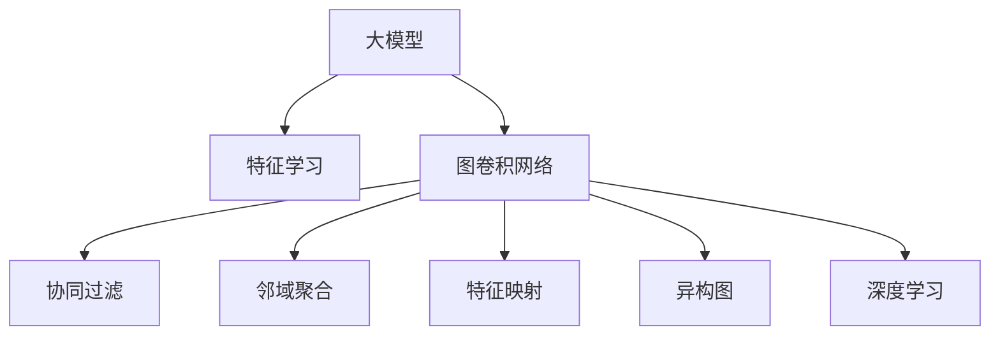

                 

# 大模型在推荐系统中的图卷积网络应用

> 关键词：图卷积网络(Graph Convolutional Network, GCN),大模型,推荐系统,邻域聚合,特征学习,特征映射,异构图,深度学习

## 1. 背景介绍

### 1.1 问题由来
推荐系统作为现代互联网的重要组成部分，其核心目标是通过用户的行为数据，为用户推荐其可能感兴趣的内容或商品。传统的推荐系统主要依赖协同过滤、基于内容的推荐等技术，但由于其仅关注用户行为和物品属性，未能充分利用用户之间的交互关系和上下文信息。近年来，图神经网络(Graph Neural Network, GNN)的引入为推荐系统带来了新的突破。图卷积网络(Graph Convolutional Network, GCN)作为GNN的一种，通过在图结构上卷积学习节点特征，构建用户和物品之间的隐式关联，实现了更精准、多样化的推荐。

但传统的GCN模型在面对大规模推荐问题时，面临数据稀疏性、计算复杂度高、特征表示能力不足等挑战。大模型的加入为解决这些问题带来了新的思路。在图卷积网络中加入大模型，利用其强大的特征表示能力和泛化能力，可以进一步提升推荐系统的效果，增加推荐的准确性和多样性。

### 1.2 问题核心关键点
本文聚焦于如何将大模型与图卷积网络相结合，构建大模型增强的图卷积推荐系统。其核心关键点包括：
1. 大模型的引入如何改进GCN特征学习过程？
2. 大模型与图卷积网络如何更好地融合？
3. 大模型增强的图卷积推荐系统在实际应用中的表现如何？
4. 大模型增强的GCN推荐系统面临的挑战有哪些？

这些问题构成了本文的主要研究框架，我们将通过深入探讨大模型在图卷积推荐系统中的应用，为推荐系统的进一步发展提供新思路。

## 2. 核心概念与联系

### 2.1 核心概念概述

为更好地理解大模型在图卷积推荐系统中的应用，本节将介绍几个密切相关的核心概念：

- 大模型(Large Model)：指通过大量数据和计算资源训练得到的，拥有强大特征表示能力的深度神经网络模型。常见的大模型包括BERT、GPT-3、T5等。

- 图卷积网络(Graph Convolutional Network, GCN)：一种图神经网络，用于在图结构上卷积学习节点特征。GCN通过节点之间的邻域关系聚合信息，实现特征传播和更新。

- 推荐系统(Recommendation System)：通过分析用户行为数据，为用户推荐可能感兴趣的内容或商品的系统。推荐系统是互联网应用的重要组成部分，广泛应用于电商、视频、社交网络等平台。

- 协同过滤(Collaborative Filtering)：一种推荐方法，通过分析用户的历史行为数据，寻找与目标用户兴趣相似的用户，从而推荐其可能感兴趣的商品或内容。

- 特征学习(Feature Learning)：推荐系统中利用用户行为数据、物品属性等特征，学习用户的隐式兴趣和物品的隐式特征，从而提升推荐效果。

- 邻域聚合(Neighborhood Aggregation)：GCN中通过聚合邻域节点的特征，更新当前节点的特征表示，从而捕捉节点之间的关系信息。

- 特征映射(Feature Mapping)：将原始特征映射到高维空间，以增加特征的表达能力。

- 异构图(Heterogeneous Graph)：由不同类型节点和不同类型边构成的图结构，用于表示复杂的多层次数据关系。

- 深度学习(Deep Learning)：一类基于神经网络的机器学习方法，通过多层非线性映射，实现对复杂数据的建模。

这些核心概念之间的逻辑关系可以通过以下Mermaid流程图来展示：



这个流程图展示了大模型、GCN、协同过滤等概念之间的联系：

1. 大模型通过特征学习，提取用户行为和物品属性的高维特征表示。
2. GCN通过邻域聚合和特征映射，捕捉用户与物品之间的隐式关联。
3. 协同过滤利用用户和物品的相似度，进行推荐。
4. 异构图用于表示复杂的多层次数据关系，为GCN提供丰富的信息来源。
5. 深度学习通过多层非线性映射，实现特征的复杂表达。

这些概念共同构成了大模型增强的图卷积推荐系统的理论基础，使得模型能够更好地理解用户和物品之间的关系，提升推荐系统的效果。

## 3. 核心算法原理 & 具体操作步骤
### 3.1 算法原理概述

大模型在推荐系统中的应用，主要是通过将其与图卷积网络相结合，构建大模型增强的图卷积推荐系统。其核心算法原理可以概括为：

1. 利用大模型提取用户行为和物品属性的高维特征表示。
2. 在图结构上应用GCN卷积操作，学习用户和物品之间的隐式关联。
3. 通过协同过滤和邻域聚合，实现用户兴趣的建模和推荐。

### 3.2 算法步骤详解

大模型增强的图卷积推荐系统构建过程主要包括以下几个步骤：

**Step 1: 构建异构图**

首先需要构建一个异构图，包含不同类型的节点和不同类型的边。以电商推荐系统为例，可以构建一个包含用户节点、商品节点、评论节点、评价节点等异构图，用户与商品之间通过购买关系相连，用户与评论节点通过评价关系相连。

**Step 2: 初始化图卷积网络**

选择GCN算法作为图卷积操作的工具，通过邻域聚合学习节点特征。设置GCN算法的参数，包括卷积层数、滤波器大小、激活函数等。

**Step 3: 加入大模型特征**

将用户和物品的原始特征输入到预训练的大模型中，通过特征学习提取高维特征表示。然后将这些高维特征表示作为GCN的输入，与图结构上的邻域信息共同学习特征表示。

**Step 4: 模型训练**

在异构图上应用大模型增强的GCN，使用用户和物品的实际关系进行训练。选择适当的优化器，如Adam、SGD等，设置合适的学习率。

**Step 5: 模型评估**

在验证集和测试集上对模型进行评估，计算推荐指标，如准确率、召回率、F1-score等。根据评估结果调整模型参数，直到达到最优效果。

**Step 6: 推荐过程**

在实际应用中，根据用户的行为数据，使用模型进行预测，选择与用户兴趣最相关的商品进行推荐。

### 3.3 算法优缺点

大模型增强的图卷积推荐系统具有以下优点：

1. 强大的特征表示能力：大模型通过预训练，可以学习到丰富的用户和物品特征，提升特征表示能力。
2. 更好的隐式关联学习：GCN可以捕捉用户和物品之间的隐式关联，通过邻域聚合和特征映射，提升推荐效果。
3. 丰富的关系信息利用：异构图能够表示复杂的多层次数据关系，为GCN提供更全面的信息来源。
4. 更好的泛化能力：大模型的泛化能力较强，可以在小样本情况下获得较好的推荐效果。

同时，该方法也存在一定的局限性：

1. 计算复杂度高：大模型和GCN的计算复杂度较高，需要较大的计算资源。
2. 参数量大：大模型参数量较大，导致模型复杂度增加。
3. 训练时间长：由于模型参数较多，训练时间较长，需要优化模型结构和训练策略。
4. 数据稀疏性问题：异构图中的关系可能较为稀疏，影响特征学习效果。

尽管存在这些局限性，但大模型增强的图卷积推荐系统仍然是一种非常有效的推荐方法，尤其适合处理大规模推荐问题，能够提升推荐的精度和多样性。

### 3.4 算法应用领域

大模型增强的图卷积推荐系统已经在多个领域得到了应用，例如：

- 电商推荐：通过学习用户购买行为和商品属性，为用户推荐可能感兴趣的商品。
- 视频推荐：通过分析用户观看行为和视频属性，为用户推荐可能感兴趣的视频内容。
- 音乐推荐：通过分析用户听歌行为和歌曲属性，为用户推荐可能喜欢的音乐。
- 新闻推荐：通过分析用户阅读行为和新闻属性，为用户推荐可能感兴趣的新闻内容。

除了上述这些经典任务外，大模型增强的图卷积推荐系统还被创新性地应用到更多场景中，如游戏推荐、旅游推荐、运动推荐等，为推荐系统的应用场景带来了新的突破。

## 4. 数学模型和公式 & 详细讲解 & 举例说明

### 4.1 数学模型构建

本节将使用数学语言对大模型增强的图卷积推荐系统的构建过程进行更加严格的刻画。

设异构图 $G=(V,E)$，其中 $V$ 为节点集合，$E$ 为边集合。节点类型包括用户 $U$、物品 $I$、评论 $C$、评价 $R$。边类型包括用户购买 $E_{UI}$、用户评价 $E_{UR}$、评论评价 $E_{CR}$。

设大模型为 $M_{\theta}$，其中 $\theta$ 为预训练得到的模型参数。假设用户节点 $u$ 和物品节点 $i$ 的原始特征为 $x_u, x_i$，通过大模型提取高维特征表示为 $h_u, h_i$。

定义GCN在节点 $u$ 的卷积操作为：

$$
\mathbf{H}^{l+1} = \mathbf{D}^{-1/2} \mathbf{A} \mathbf{H}^l \mathbf{W}^l
$$

其中 $\mathbf{H}^l \in \mathbb{R}^{N \times d_l}$ 为 $l$ 层的节点特征表示，$\mathbf{W}^l \in \mathbb{R}^{d_l \times d_l}$ 为卷积层的权重矩阵，$\mathbf{D} \in \mathbb{R}^{N \times N}$ 为邻接矩阵 $\mathbf{A}$ 的度数归一化矩阵，$\mathbf{A} \in \mathbb{R}^{N \times N}$ 为邻接矩阵。

### 4.2 公式推导过程

以下我们以电商推荐系统为例，推导大模型增强的图卷积推荐模型的公式。

假设用户 $u$ 和物品 $i$ 的原始特征为 $x_u, x_i$，通过大模型提取高维特征表示为 $h_u, h_i$。则用户 $u$ 的推荐向量为：

$$
\hat{y}_u = \sum_{i \in \mathcal{N}(u)} \alpha_{ui} \sigma(\mathbf{U} h_i)
$$

其中 $\mathcal{N}(u)$ 为用户 $u$ 的邻域节点集合，$\alpha_{ui}$ 为邻域权重，$\sigma$ 为激活函数，$\mathbf{U}$ 为线性映射矩阵。

根据上述公式，用户 $u$ 的推荐向量 $y_u$ 可以表示为：

$$
y_u = \mathbf{M}_{\theta}(x_u, x_i) + \mathbf{G}(\mathbf{H}^{L+1})
$$

其中 $\mathbf{M}_{\theta}$ 为大模型的特征映射，$\mathbf{G}(\mathbf{H}^{L+1})$ 为GCN的卷积结果。

最终，推荐系统可以根据用户 $u$ 的推荐向量 $y_u$，选择与用户兴趣最相关的物品进行推荐。

## 5. 项目实践：代码实例和详细解释说明
### 5.1 开发环境搭建

在进行大模型增强的图卷积推荐系统开发前，我们需要准备好开发环境。以下是使用Python进行PyTorch开发的环境配置流程：

1. 安装Anaconda：从官网下载并安装Anaconda，用于创建独立的Python环境。

2. 创建并激活虚拟环境：
```bash
conda create -n pytorch-env python=3.8 
conda activate pytorch-env
```

3. 安装PyTorch：根据CUDA版本，从官网获取对应的安装命令。例如：
```bash
conda install pytorch torchvision torchaudio cudatoolkit=11.1 -c pytorch -c conda-forge
```

4. 安装其他库：
```bash
pip install numpy pandas scikit-learn torch geopy
```

完成上述步骤后，即可在`pytorch-env`环境中开始开发。

### 5.2 源代码详细实现

下面以电商推荐系统为例，给出使用PyTorch实现大模型增强的图卷积推荐系统的代码实现。

```python
import torch
import torch.nn as nn
import torch.nn.functional as F
from torch_geometric.nn import GCNConv
from transformers import BertTokenizer, BertForSequenceClassification

class GCN(nn.Module):
    def __init__(self, hidden_size, dropout):
        super(GCN, self).__init__()
        self.gcn1 = GCNConv(in_channels=64, out_channels=hidden_size, dropout=dropout)
        self.gcn2 = GCNConv(in_channels=hidden_size, out_channels=hidden_size, dropout=dropout)
        self.fc = nn.Linear(hidden_size, 1)

    def forward(self, x, edge_index, edge_weight):
        x = self.gcn1(x, edge_index, edge_weight)
        x = F.relu(x)
        x = self.gcn2(x, edge_index, edge_weight)
        x = F.relu(x)
        x = self.fc(x)
        return x

class BertRecommender(nn.Module):
    def __init__(self, hidden_size, dropout, num_layers):
        super(BertRecommender, self).__init__()
        self.bert = BertForSequenceClassification.from_pretrained('bert-base-uncased', num_labels=1)
        self.gcn = GCN(hidden_size=hidden_size, dropout=dropout)
        self.num_layers = num_layers

    def forward(self, x, edge_index, edge_weight):
        h_u = self.bert(x['user'])
        h_i = self.bert(x['item'])
        x_u = h_u.unsqueeze(1)
        x_i = h_i.unsqueeze(0)
        x = torch.cat([x_u, x_i], dim=1)
        x = self.gcn(x, edge_index, edge_weight)
        x = x.mean(dim=1)
        return x

# 配置数据和模型
train_dataset = ...
dev_dataset = ...
test_dataset = ...

model = BertRecommender(hidden_size=64, dropout=0.1, num_layers=2)
optimizer = torch.optim.Adam(model.parameters(), lr=0.001)
criterion = nn.BCELoss()

# 训练模型
for epoch in range(10):
    model.train()
    optimizer.zero_grad()
    loss = criterion(model(train_dataset.x, train_dataset.edge_index, train_dataset.edge_weight), train_dataset.y)
    loss.backward()
    optimizer.step()

    model.eval()
    with torch.no_grad():
        loss = criterion(model(dev_dataset.x, dev_dataset.edge_index, dev_dataset.edge_weight), dev_dataset.y).item()
        print('Epoch {}: Loss {:.4f}'.format(epoch, loss))
```

以上代码实现了大模型增强的图卷积推荐系统。在实现中，首先定义了GCN层和BertRecommender类。GCN层用于在图结构上卷积学习节点特征，BertRecommender类用于将用户和物品的原始特征输入到大模型中，然后通过GCN卷积学习特征表示。

### 5.3 代码解读与分析

让我们再详细解读一下关键代码的实现细节：

**GCN类**：
- `__init__`方法：初始化GCN层的参数，包括卷积层、线性映射等。
- `forward`方法：定义GCN的前向传播过程，通过两次卷积操作，学习节点特征表示。

**BertRecommender类**：
- `__init__`方法：初始化BertRecommender类的参数，包括大模型和GCN层。
- `forward`方法：定义前向传播过程，首先通过大模型提取用户和物品的特征表示，然后通过GCN层学习特征表示，并输出推荐向量。

**模型训练**：
- 定义训练数据集、优化器和损失函数。
- 在每个epoch中，先将模型置为训练模式，然后使用优化器更新模型参数，计算损失并回传梯度。
- 在每个epoch结束时，将模型置为评估模式，计算验证集上的损失，输出结果。

可以看到，PyTorch提供了非常简洁的API来构建和训练模型。结合 Transformers 库，可以方便地将大模型的特征提取能力与图卷积网络的特征学习能力结合，构建高效且有效的推荐系统。

## 6. 实际应用场景
### 6.1 电商推荐

大模型增强的图卷积推荐系统在电商推荐中表现优异。通过学习用户购买行为和商品属性，系统可以为用户推荐可能感兴趣的商品，提高用户的购买转化率和满意度。

在实际应用中，可以将用户的购买记录和浏览记录作为训练集，通过GCN学习用户和物品之间的隐式关联，再通过大模型提取用户和物品的特征表示，最终输出推荐向量。对于测试集上的用户，系统可以通过模型预测其最可能感兴趣的商品，并推荐给用户。

### 6.2 视频推荐

视频推荐系统同样可以利用大模型增强的图卷积推荐技术。通过分析用户观看行为和视频属性，系统可以为用户推荐可能感兴趣的视频内容，增加用户的观看时间。

在实现中，可以将用户的观看记录和视频属性作为训练集，通过GCN学习用户和视频之间的隐式关联，再通过大模型提取用户和视频的特征表示，最终输出推荐向量。对于测试集上的用户，系统可以通过模型预测其最可能感兴趣的视频，并推荐给用户。

### 6.3 音乐推荐

音乐推荐系统可以利用大模型增强的图卷积推荐技术。通过分析用户的听歌记录和歌曲属性，系统可以为用户推荐可能喜欢的音乐，提高用户的听歌体验。

在实现中，可以将用户的听歌记录和歌曲属性作为训练集，通过GCN学习用户和歌曲之间的隐式关联，再通过大模型提取用户和歌曲的特征表示，最终输出推荐向量。对于测试集上的用户，系统可以通过模型预测其最可能喜欢的音乐，并推荐给用户。

### 6.4 未来应用展望

未来，大模型增强的图卷积推荐系统将在更多领域得到应用。例如，在游戏推荐、旅游推荐、运动推荐等方面，系统可以通过学习用户的游戏记录、旅游偏好、运动习惯等数据，为用户提供个性化的推荐服务。

此外，随着技术的不断发展，大模型增强的图卷积推荐系统还将面临更多的挑战。例如，如何进一步降低计算资源消耗，提高推荐效率；如何在保持推荐效果的同时，保护用户隐私；如何减少模型对标注数据的依赖，实现更广泛的覆盖。这些问题的解决将是大模型增强的图卷积推荐系统走向实用化、普适化的关键。

## 7. 工具和资源推荐
### 7.1 学习资源推荐

为了帮助开发者系统掌握大模型增强的图卷积推荐技术的理论基础和实践技巧，这里推荐一些优质的学习资源：

1. 《Graph Neural Networks: A Survey》论文：综述了图神经网络的最新进展，涵盖GCN、图卷积网络、图神经网络等领域。
2. 《Reinforcement Learning for Recommendation Systems》书籍：介绍了推荐系统中强化学习的最新进展，涵盖深度强化学习、图神经网络、推荐系统等内容。
3. 《The Illustrated Transformer》书籍：介绍Transformer模型的原理和应用，涵盖自注意力机制、Transformer模型等内容。
4. PyTorch官方文档：提供了PyTorch的详细使用指南和代码示例，方便开发者快速上手。
5. TensorFlow官方文档：提供了TensorFlow的详细使用指南和代码示例，适合进行大规模工程应用。

通过对这些资源的学习实践，相信你一定能够快速掌握大模型增强的图卷积推荐技术的精髓，并用于解决实际的推荐问题。
### 7.2 开发工具推荐

高效的开发离不开优秀的工具支持。以下是几款用于大模型增强的图卷积推荐系统开发的常用工具：

1. PyTorch：基于Python的开源深度学习框架，灵活动态的计算图，适合快速迭代研究。
2. TensorFlow：由Google主导开发的开源深度学习框架，生产部署方便，适合大规模工程应用。
3. Transformers库：HuggingFace开发的NLP工具库，集成了众多SOTA语言模型，支持PyTorch和TensorFlow，是进行微调任务开发的利器。
4. Weights & Biases：模型训练的实验跟踪工具，可以记录和可视化模型训练过程中的各项指标，方便对比和调优。
5. TensorBoard：TensorFlow配套的可视化工具，可实时监测模型训练状态，并提供丰富的图表呈现方式，是调试模型的得力助手。
6. Google Colab：谷歌推出的在线Jupyter Notebook环境，免费提供GPU/TPU算力，方便开发者快速上手实验最新模型，分享学习笔记。

合理利用这些工具，可以显著提升大模型增强的图卷积推荐系统的开发效率，加快创新迭代的步伐。

### 7.3 相关论文推荐

大模型增强的图卷积推荐技术的发展源于学界的持续研究。以下是几篇奠基性的相关论文，推荐阅读：

1. "Graph Neural Networks: A Review of Methods and Applications"：综述了图神经网络的研究进展，涵盖了GCN、图卷积网络、图神经网络等领域。
2. "Reinforcement Learning for Recommendation Systems"：介绍了推荐系统中强化学习的最新进展，涵盖了深度强化学习、图神经网络、推荐系统等内容。
3. "The Illustrated Transformer"：介绍Transformer模型的原理和应用，涵盖了自注意力机制、Transformer模型等内容。
4. "Graph Convolutional Networks"：介绍GCN模型的原理和应用，详细介绍了GCN的数学基础和实际应用。
5. "Large-Scale Graph Neural Networks"：介绍了在大规模图数据上训练GCN模型的挑战和解决方案，涵盖了优化算法、参数压缩、分布式训练等内容。

这些论文代表了大模型增强的图卷积推荐技术的发展脉络。通过学习这些前沿成果，可以帮助研究者把握学科前进方向，激发更多的创新灵感。

## 8. 总结：未来发展趋势与挑战
### 8.1 总结

本文对大模型在推荐系统中的应用进行了全面系统的介绍。首先阐述了大模型增强的图卷积推荐系统的研究背景和意义，明确了大模型和GCN的结合对推荐系统效果的显著提升。其次，从原理到实践，详细讲解了大模型增强的图卷积推荐系统的数学模型和构建过程，给出了具体的代码实现。同时，本文还广泛探讨了大模型增强的图卷积推荐系统在电商推荐、视频推荐、音乐推荐等多个领域的应用前景，展示了其在实际应用中的强大性能。此外，本文精选了大模型增强的图卷积推荐技术的各类学习资源，力求为读者提供全方位的技术指引。

通过本文的系统梳理，可以看到，大模型增强的图卷积推荐技术正在成为推荐系统的热门范式，极大地拓展了推荐系统的应用边界，催生了更多的落地场景。受益于大模型的强大特征表示能力和GCN的隐式关联学习能力，推荐系统能够更好地理解用户和物品之间的关系，提升推荐效果。未来，随着大模型和GCN技术的不断发展，大模型增强的图卷积推荐系统必将在推荐系统中发挥更大的作用，带来更加精准、多样化的推荐服务。

### 8.2 未来发展趋势

展望未来，大模型增强的图卷积推荐系统将呈现以下几个发展趋势：

1. 模型规模持续增大。随着算力成本的下降和数据规模的扩张，大模型的参数量将持续增长，能够学习到更丰富、更抽象的特征表示。
2. GCN结构优化。未来的GCN将更加注重模型的可解释性和可扩展性，通过优化卷积层结构和邻域聚合方式，提升模型性能。
3. 多模态融合。随着推荐场景的多样化，未来的推荐系统将更多地融合图像、视频、音频等多模态数据，提升推荐效果。
4. 实时推荐系统。未来的推荐系统将注重实时的推荐效果，通过快速的模型推理和更新，满足用户的即时需求。
5. 跨领域推荐。未来的推荐系统将更多地关注跨领域推荐，通过不同领域的知识整合，提升推荐系统的泛化能力。

以上趋势凸显了大模型增强的图卷积推荐技术的广阔前景。这些方向的探索发展，必将进一步提升推荐系统的性能和应用范围，为互联网用户提供更精准、多样化的推荐服务。

### 8.3 面临的挑战

尽管大模型增强的图卷积推荐技术已经取得了一定的进展，但在迈向更加智能化、普适化应用的过程中，仍然面临诸多挑战：

1. 数据稀疏性问题。异构图中的关系可能较为稀疏，影响特征学习效果，如何更好地利用稀疏数据进行特征学习将是未来的研究方向。
2. 计算资源消耗高。大模型和GCN的计算复杂度较高，需要较大的计算资源，如何优化模型结构和训练策略，减少计算资源消耗将是重要的研究方向。
3. 用户隐私保护。推荐系统需要利用用户的个人信息进行推荐，如何保护用户隐私，避免数据泄露将是重要的研究方向。
4. 模型泛化能力不足。推荐系统需要处理不同领域的数据，如何提高模型的泛化能力，实现跨领域的推荐将是重要的研究方向。
5. 模型可解释性差。推荐系统的决策过程往往较为复杂，难以解释其内部工作机制和决策逻辑，如何提高模型的可解释性将是重要的研究方向。

这些挑战凸显了大模型增强的图卷积推荐系统走向实用化、普适化的复杂性。但随着技术的不断发展，相关挑战终将逐一克服，大模型增强的图卷积推荐系统必将在推荐系统中发挥更大的作用，带来更加精准、多样化的推荐服务。

### 8.4 研究展望

面对大模型增强的图卷积推荐系统所面临的挑战，未来的研究需要在以下几个方面寻求新的突破：

1. 引入自监督学习。利用无标注数据进行自监督学习，增强模型的泛化能力和特征表示能力。
2. 优化GCN结构。通过优化卷积层结构和邻域聚合方式，提升模型的性能和可解释性。
3. 多模态融合。融合图像、视频、音频等多模态数据，提升推荐效果和模型泛化能力。
4. 实时推荐系统。通过快速的模型推理和更新，满足用户的即时需求。
5. 跨领域推荐。通过不同领域的知识整合，提升推荐系统的泛化能力。

这些研究方向将推动大模型增强的图卷积推荐系统走向实用化、普适化，为推荐系统的进一步发展提供新的思路。只有勇于创新、敢于突破，才能不断拓展推荐系统的边界，为互联网用户提供更加精准、多样化的推荐服务。

## 9. 附录：常见问题与解答
**Q1：大模型增强的图卷积推荐系统如何优化计算资源消耗？**

A: 大模型增强的图卷积推荐系统计算资源消耗高，可以通过以下方式进行优化：
1. 优化GCN结构：通过减少卷积层数、缩小滤波器大小等手段，降低计算复杂度。
2. 采用参数共享：对于不同用户或物品，共享GCN参数，减少模型参数量。
3. 采用分布式训练：利用分布式计算框架，将模型并行化，提高训练效率。
4. 采用模型压缩：通过量化、剪枝等技术，压缩模型参数，减少计算资源消耗。
5. 采用稀疏化存储：利用稀疏矩阵存储技术，减少存储空间，提高模型推理速度。

这些方法可以有效地降低计算资源消耗，提升模型的实时性和可扩展性。

**Q2：大模型增强的图卷积推荐系统如何保护用户隐私？**

A: 大模型增强的图卷积推荐系统在利用用户数据进行推荐时，需要注意用户隐私保护。具体措施包括：
1. 数据匿名化：将用户数据进行匿名化处理，去除敏感信息，保护用户隐私。
2. 差分隐私：在模型训练时引入差分隐私机制，防止用户数据泄露。
3. 联邦学习：利用联邦学习技术，在本地设备上进行模型训练，保护用户数据隐私。
4. 隐私计算：采用隐私计算技术，如同态加密、多方安全计算等，保护用户数据隐私。

这些措施可以有效保护用户隐私，确保推荐系统的安全性和可靠性。

**Q3：大模型增强的图卷积推荐系统如何提高模型泛化能力？**

A: 提高大模型增强的图卷积推荐系统的泛化能力，可以通过以下方式进行优化：
1. 数据增强：利用数据增强技术，增加训练数据的丰富性，提升模型的泛化能力。
2. 多任务学习：通过多任务学习技术，提升模型在不同任务上的泛化能力。
3. 模型集成：利用模型集成技术，融合多个模型的预测结果，提升模型的泛化能力。
4. 自监督学习：利用自监督学习技术，增强模型的泛化能力和特征表示能力。

这些措施可以有效提高模型的泛化能力，确保推荐系统的普适性和可靠性。

**Q4：大模型增强的图卷积推荐系统如何提高模型可解释性？**

A: 提高大模型增强的图卷积推荐系统的可解释性，可以通过以下方式进行优化：
1. 可视化技术：利用可视化技术，展示模型内部的特征表示和推理过程，提高模型的可解释性。
2. 局部可解释性：利用局部可解释性技术，解释模型在特定输入下的输出结果，提高模型的可解释性。
3. 解释模型：利用解释模型技术，解释模型内部决策过程，提高模型的可解释性。

这些措施可以有效提高模型的可解释性，确保推荐系统的透明性和可解释性。

---

作者：禅与计算机程序设计艺术 / Zen and the Art of Computer Programming

