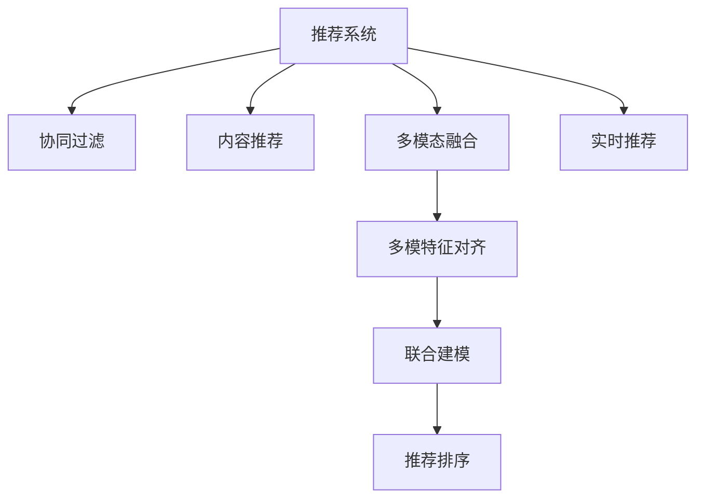

                 

# 大模型在推荐系统中的多模态融合与对齐

> 关键词：大模型, 多模态融合, 推荐系统, 协同过滤, 多模特征对齐, 用户画像, 商品画像, 实时推荐

## 1. 背景介绍

在推荐系统的构建中，如何通过多种模态数据提升推荐效果，是一个经典且重要的问题。随着技术的演进，越来越多的推荐系统开始集成多样化的数据源，如文本、图像、音频等，以丰富用户画像和商品画像。但这些数据往往分布在不同的模态空间中，如何有效地进行融合和对齐，是推荐系统设计中必须面对的挑战。

基于深度学习的推荐系统近年来快速发展，利用大模型对用户行为进行建模，极大地提升了推荐的个性化程度和效果。但单一的模态（如文本或图像）往往无法全面刻画用户和商品的真实特征。如何通过多模态融合技术，在大模型中充分利用各类数据，提高推荐的准确性和多样性，成为当前推荐系统研究的热点问题。

## 2. 核心概念与联系

### 2.1 核心概念概述

推荐系统主要分为两大类：

1. **协同过滤（Collaborative Filtering）**：基于用户行为或商品的属性，推荐相似用户或商品。早期推荐系统主要采用基于用户行为或商品特征的协同过滤技术。

2. **内容推荐（Content-Based Recommendation）**：基于用户的历史行为和物品属性，推荐相似的物品。通过丰富的特征向量表示，提升推荐的质量和多样性。

随着技术的发展，推荐系统已经可以更好地结合多模态数据进行推荐。多模态融合技术（Multimodal Fusion）就是利用不同模态的数据，对用户和商品的特征进行联合建模，提升推荐的个性化和准确性。

多模特征对齐（Multimodal Feature Alignment）是实现多模态融合的基础。它旨在将不同模态的数据映射到统一的空间，使得不同模态之间可以进行联合建模，提升推荐效果。

### 2.2 核心概念原理和架构的 Mermaid 流程图(Mermaid 流程节点中不要有括号、逗号等特殊字符)



该图展示了推荐系统的核心组件及其关系：

- 协同过滤和内容推荐是推荐系统两大基本组成模块。
- 多模态融合模块利用多模态数据进行联合建模，提升推荐效果。
- 多模特征对齐模块将不同模态的数据映射到统一的空间。
- 联合建模模块在统一空间中对用户和商品进行联合表示。
- 推荐排序模块对推荐结果进行排序，提供最终推荐。
- 实时推荐模块支持动态调整推荐结果，满足实时性需求。

## 3. 核心算法原理 & 具体操作步骤
### 3.1 算法原理概述

多模态融合与对齐的核心目标是利用多种模态数据，提升推荐系统的效果。其关键在于如何将不同模态的数据在统一空间中进行表示和建模，以实现有效融合。目前主流的算法分为以下几类：

- **单塔模型（Single-Tower Model）**：直接将不同模态的数据进行拼接，形成一个综合的特征向量。
- **双塔模型（Two-Tower Model）**：分别对用户和商品进行独立表示，再通过相似度计算进行融合。
- **混合塔模型（Hybrid Tower Model）**：结合单塔和双塔模型的优点，利用用户和商品的不同模态信息，进行综合建模。

多模特征对齐的核心算法有：

- **特征嵌入对齐（Feature Embedding Alignment）**：直接将不同模态的特征向量投影到统一空间中。
- **特征匹配对齐（Feature Matching Alignment）**：使用显式匹配模块，将不同模态的特征进行匹配对齐。

### 3.2 算法步骤详解

下面以双塔模型为例，详细介绍多模态融合与对齐的详细步骤：

**Step 1: 数据收集与预处理**

- 收集多模态数据，包括用户历史行为数据、商品属性数据、图片数据等。
- 对数据进行清洗和预处理，去除噪声和无效数据。

**Step 2: 独立表示用户和商品**

- 对用户和商品进行独立表示，分别用编码器（如Transformer）进行建模，得到高维特征向量。
- 对于用户行为数据，可以使用序列编码器进行建模；对于图片数据，可以使用卷积神经网络进行建模。

**Step 3: 特征嵌入对齐**

- 使用多层感知机（MLP）或矩阵分解等方法，将不同模态的特征向量投影到统一空间中。
- 使用预训练的嵌入矩阵对特征进行转换，得到统一的特征表示。

**Step 4: 相似度计算与联合建模**

- 计算用户和商品特征向量之间的相似度，通常使用余弦相似度或点积相似度。
- 将相似度结果输入到多层感知机中，进行联合建模，得到最终的推荐结果。

**Step 5: 推荐排序与实时推荐**

- 对推荐结果进行排序，可以使用深度学习模型进行学习。
- 在实时推荐场景中，通过在线学习机制，动态调整推荐结果。

### 3.3 算法优缺点

多模态融合与对齐技术具有以下优点：

1. **提升推荐效果**：通过多模态融合，可以更好地刻画用户和商品的特征，提高推荐的个性化和准确性。
2. **提高模型泛化能力**：多模态数据具有更丰富的特征，可以提高模型的泛化能力，避免单一模态数据带来的偏差。
3. **灵活性**：不同模态的数据可以独立进行建模，具有更好的灵活性。

但同时也存在一些缺点：

1. **模型复杂性增加**：多模态融合需要在统一空间中进行表示，增加了模型的复杂性。
2. **数据处理难度加大**：多模态数据的收集和处理比单一模态更复杂，增加了数据预处理的难度。
3. **计算成本增加**：多模态数据的联合建模增加了计算复杂度和时间成本。

### 3.4 算法应用领域

多模态融合与对齐技术广泛应用于以下领域：

1. **电商推荐**：利用用户行为数据、商品属性、图片等多模态数据，提升推荐效果。
2. **社交网络**：结合用户画像和兴趣特征，进行个性化推荐。
3. **视频推荐**：结合视频内容、用户评分等数据，提高推荐效果。
4. **音乐推荐**：结合音乐播放历史、用户画像等数据，提升推荐质量。
5. **旅游推荐**：结合用户兴趣、目的地属性等多模态数据，提升旅游体验。

## 4. 数学模型和公式 & 详细讲解 & 举例说明

### 4.1 数学模型构建

假设用户和商品特征向量分别为 $u$ 和 $v$，使用多塔模型进行独立表示，分别表示为 $u = \text{Encoder}_{\text{user}}(X_u)$，$v = \text{Encoder}_{\text{item}}(X_v)$，其中 $X_u, X_v$ 分别为用户行为数据和商品属性数据。

多模特征对齐通过一个线性变换 $\phi$，将不同模态的特征向量投影到统一空间中：

$$
u' = \phi(u), v' = \phi(v)
$$

其中 $u', v'$ 分别为投影后的用户和商品特征向量。

相似度计算通常使用余弦相似度或点积相似度：

$$
\text{similarity}(u', v') = \frac{u' \cdot v'}{\|u'\| \|v'\|}
$$

最后，将相似度结果输入多层感知机（MLP）进行联合建模，得到最终推荐结果 $y$：

$$
y = \text{MLP}(\text{similarity}(u', v'))
$$

### 4.2 公式推导过程

以余弦相似度为例，推导相似度计算公式。假设用户和商品特征向量分别为 $u = (u_1, u_2, \dots, u_n)$ 和 $v = (v_1, v_2, \dots, v_n)$，其中 $n$ 为特征维度。

$$
\text{similarity}(u, v) = \frac{u \cdot v}{\|u\| \|v\|} = \frac{\sum_{i=1}^n u_i v_i}{\sqrt{\sum_{i=1}^n u_i^2} \sqrt{\sum_{i=1}^n v_i^2}}
$$

将不同模态的特征向量投影到统一空间中，假设投影后的向量分别为 $u' = (u'_1, u'_2, \dots, u'_n)$ 和 $v' = (v'_1, v'_2, \dots, v'_n)$。则相似度计算公式为：

$$
\text{similarity}(u', v') = \frac{u' \cdot v'}{\|u'\| \|v'\|} = \frac{\sum_{i=1}^n u'_i v'_i}{\sqrt{\sum_{i=1}^n u'^2_i} \sqrt{\sum_{i=1}^n v'^2_i}}
$$

### 4.3 案例分析与讲解

以电商推荐系统为例，展示多模态融合与对齐的实际应用：

**用户画像**：收集用户的历史行为数据、用户评分、社交网络数据等，构建用户画像。
**商品画像**：收集商品的属性信息、图片信息、用户评分等，构建商品画像。
**推荐模型**：使用双塔模型对用户和商品进行独立表示，使用多模特征对齐技术，将用户行为数据、商品属性和图片数据映射到统一空间中，进行联合建模。
**推荐排序**：使用深度学习模型对推荐结果进行排序，提升推荐效果。

## 5. 项目实践：代码实例和详细解释说明

### 5.1 开发环境搭建

在进行多模态融合与对齐的实践前，需要先准备好开发环境。以下是使用Python进行TensorFlow开发的环境配置流程：

1. 安装Anaconda：从官网下载并安装Anaconda，用于创建独立的Python环境。

2. 创建并激活虚拟环境：
```bash
conda create -n tf-env python=3.8 
conda activate tf-env
```

3. 安装TensorFlow：根据CUDA版本，从官网获取对应的安装命令。例如：
```bash
conda install tensorflow tensorflow-cpu -c conda-forge -c anaconda
```

4. 安装各类工具包：
```bash
pip install numpy pandas scikit-learn matplotlib tqdm jupyter notebook ipython
```

完成上述步骤后，即可在`tf-env`环境中开始实践。

### 5.2 源代码详细实现

以下是使用TensorFlow实现双塔模型的代码示例：

```python
import tensorflow as tf
from tensorflow.keras.layers import Input, Embedding, Dot, Dense

# 定义用户和商品特征向量输入
user_input = Input(shape=(128,), name='user_input')
item_input = Input(shape=(128,), name='item_input')

# 定义独立表示用户和商品
user_embedding = Embedding(1024, 128)(user_input)
item_embedding = Embedding(1024, 128)(item_input)

# 定义多模特征对齐
user_projection = Dense(128)(user_embedding)
item_projection = Dense(128)(item_embedding)

# 定义相似度计算
similarity = Dot(axes=(2, 2))([user_projection, item_projection])

# 定义联合建模
joint_representation = Dense(64)(similarity)
predictions = Dense(1, activation='sigmoid')(joint_representation)

# 定义模型
model = tf.keras.Model(inputs=[user_input, item_input], outputs=predictions)
model.compile(loss='binary_crossentropy', optimizer='adam', metrics=['accuracy'])

# 训练模型
model.fit([train_user_data, train_item_data], train_labels, epochs=10, batch_size=32)
```

### 5.3 代码解读与分析

让我们再详细解读一下关键代码的实现细节：

**Input层**：定义用户和商品特征向量的输入，分别表示为 $u$ 和 $v$。

**Embedding层**：将用户和商品特征向量进行独立表示，得到高维特征向量 $u'$ 和 $v'$。

**Dense层**：使用全连接层对用户和商品特征进行投影，得到统一空间中的特征向量。

**Dot层**：计算用户和商品特征向量之间的相似度，得到点积相似度。

**Dense层**：对相似度结果进行联合建模，得到最终的推荐结果。

**Model层**：定义完整的模型，包含输入、输出和损失函数。

**compile方法**：编译模型，定义优化器和损失函数。

**fit方法**：对模型进行训练，输入训练数据和标签，输出训练后的模型。

可以看到，TensorFlow提供了丰富的深度学习组件，使得多模态融合与对齐的实现变得简洁高效。开发者可以通过灵活组合这些组件，实现多种不同的多模态融合模型。

### 5.4 运行结果展示

训练完成后，可以使用以下代码进行测试：

```python
test_loss, test_accuracy = model.evaluate([test_user_data, test_item_data], test_labels, batch_size=32)
print('Test Loss:', test_loss)
print('Test Accuracy:', test_accuracy)
```

## 6. 实际应用场景

### 6.1 电商推荐

基于多模态融合与对齐技术，电商推荐系统可以通过多种数据源，提升推荐效果。例如：

**用户画像**：收集用户的历史行为数据、用户评分、社交网络数据等，构建用户画像。
**商品画像**：收集商品的属性信息、图片信息、用户评分等，构建商品画像。
**推荐模型**：使用双塔模型对用户和商品进行独立表示，使用多模特征对齐技术，将用户行为数据、商品属性和图片数据映射到统一空间中，进行联合建模。
**推荐排序**：使用深度学习模型对推荐结果进行排序，提升推荐效果。

### 6.2 视频推荐

在视频推荐系统中，多模态融合与对齐技术可以结合视频内容、用户评分、用户历史行为等数据，提高推荐效果。

**用户画像**：收集用户的视频观看历史、评分等数据，构建用户画像。
**视频画像**：收集视频的属性信息、图片信息、评分等数据，构建视频画像。
**推荐模型**：使用双塔模型对用户和视频进行独立表示，使用多模特征对齐技术，将用户历史行为数据、视频属性和图片数据映射到统一空间中，进行联合建模。
**推荐排序**：使用深度学习模型对推荐结果进行排序，提升推荐效果。

### 6.3 音乐推荐

音乐推荐系统可以通过多模态融合与对齐技术，结合音乐播放历史、用户画像等数据，提升推荐质量。

**用户画像**：收集用户的音乐播放历史、评分等数据，构建用户画像。
**音乐画像**：收集音乐的属性信息、图片信息、用户评分等数据，构建音乐画像。
**推荐模型**：使用双塔模型对用户和音乐进行独立表示，使用多模特征对齐技术，将用户音乐播放历史、音乐属性和图片数据映射到统一空间中，进行联合建模。
**推荐排序**：使用深度学习模型对推荐结果进行排序，提升推荐效果。

## 7. 工具和资源推荐

### 7.1 学习资源推荐

为了帮助开发者系统掌握多模态融合与对齐的理论基础和实践技巧，这里推荐一些优质的学习资源：

1. 《推荐系统基础》系列博文：由大模型技术专家撰写，深入浅出地介绍了推荐系统的基本概念和核心算法。

2. 《深度学习推荐系统》课程：斯坦福大学开设的推荐系统明星课程，有Lecture视频和配套作业，带你入门推荐系统领域的基本概念和经典模型。

3. 《Deep Learning for Recommender Systems》书籍：推荐系统领域的经典教材，全面介绍了推荐系统的各种模型和算法，包括多模态融合技术。

4. AI Challenger推荐赛道：AI Challenger每年举办的推荐系统评测比赛，涵盖了推荐系统的各个方面，并提供丰富的数据和模型，可以实战练习推荐系统开发。

通过对这些资源的学习实践，相信你一定能够快速掌握多模态融合与对齐的精髓，并用于解决实际的推荐系统问题。

### 7.2 开发工具推荐

高效的开发离不开优秀的工具支持。以下是几款用于多模态融合与对齐开发的常用工具：

1. TensorFlow：基于Python的开源深度学习框架，灵活动态的计算图，适合快速迭代研究。

2. PyTorch：基于Python的开源深度学习框架，动态计算图，易于使用。

3. Keras：高级神经网络API，可以快速搭建模型原型。

4. Weights & Biases：模型训练的实验跟踪工具，可以记录和可视化模型训练过程中的各项指标，方便对比和调优。

5. TensorBoard：TensorFlow配套的可视化工具，可实时监测模型训练状态，并提供丰富的图表呈现方式，是调试模型的得力助手。

6. Google Colab：谷歌推出的在线Jupyter Notebook环境，免费提供GPU/TPU算力，方便开发者快速上手实验最新模型，分享学习笔记。

合理利用这些工具，可以显著提升多模态融合与对齐任务的开发效率，加快创新迭代的步伐。

### 7.3 相关论文推荐

多模态融合与对齐技术的发展源于学界的持续研究。以下是几篇奠基性的相关论文，推荐阅读：

1. Multi-Task Learning Using Pre-Trained Co-Representations for Custom Memories（多任务学习使用预训练的联合表示进行定制化记忆）：提出多任务学习框架，通过联合表示提升推荐效果。

2. Multi-Modality Networks for Recommendations：结合多模态数据，提升推荐效果。

3. Multi-Modal Recommendations Using Scene Graphs（使用场景图的多模态推荐）：提出多模态推荐模型，利用场景图表示用户和商品的多模态信息。

4. Multi-Modality Fusion for Recommendations（多模态融合进行推荐）：综合利用文本、图片、视频等多模态数据，提升推荐效果。

这些论文代表了大模型在推荐系统中的应用发展脉络。通过学习这些前沿成果，可以帮助研究者把握学科前进方向，激发更多的创新灵感。

## 8. 总结：未来发展趋势与挑战

### 8.1 总结

本文对多模态融合与对齐技术在推荐系统中的应用进行了全面系统的介绍。首先阐述了多模态融合与对齐技术的背景和意义，明确了其在提升推荐系统效果方面的独特价值。其次，从原理到实践，详细讲解了多模态融合与对齐的数学模型和关键步骤，给出了多模态融合的完整代码实现。同时，本文还广泛探讨了多模态融合与对齐技术在电商推荐、视频推荐、音乐推荐等多个领域的应用前景，展示了多模态融合的巨大潜力。此外，本文精选了多模态融合与对齐技术的各类学习资源，力求为读者提供全方位的技术指引。

通过本文的系统梳理，可以看到，多模态融合与对齐技术正在成为推荐系统研究的重要范式，极大地拓展了推荐系统应用边界，催生了更多的落地场景。得益于深度学习和多模态数据的大规模应用，推荐系统的效果和多样性得到了显著提升，推动了人工智能技术在各行各业的应用。未来，伴随技术进一步演进和产业应用的深入，推荐系统必将在更多领域大放异彩，为构建智能化的数字化世界贡献力量。

### 8.2 未来发展趋势

展望未来，多模态融合与对齐技术将呈现以下几个发展趋势：

1. **更丰富的数据源**：未来推荐系统将更广泛地结合多模态数据，提升推荐效果和多样性。

2. **更高效的融合方法**：随着模型和算法的进步，多模态融合将变得更加高效，减小计算成本和存储成本。

3. **更强的泛化能力**：多模态融合技术将使得推荐系统更具有泛化能力，适应不同领域和场景。

4. **更高的个性化程度**：通过多模态融合，推荐系统可以更好地刻画用户和商品的特征，提供更个性化的推荐。

5. **更强的鲁棒性**：未来推荐系统将更具有鲁棒性，能够处理多变的数据分布和用户行为。

6. **更高的可解释性**：推荐系统的决策过程将更具有可解释性，提升用户的信任度和满意度。

以上趋势凸显了多模态融合与对齐技术的广阔前景。这些方向的探索发展，必将进一步提升推荐系统的性能和应用范围，为构建智能化的数字化世界提供新的动力。

### 8.3 面临的挑战

尽管多模态融合与对齐技术已经取得了瞩目成就，但在迈向更加智能化、普适化应用的过程中，它仍面临着诸多挑战：

1. **数据异构性**：不同模态的数据具有不同的特征和结构，难以直接进行联合建模。

2. **模型复杂性**：多模态融合模型通常具有较高的复杂性，难以进行快速训练和推理。

3. **数据质量问题**：多模态数据的采集和标注成本高，存在噪声和偏差。

4. **计算资源消耗大**：多模态数据的融合和联合建模需要大量计算资源，难以实现实时推荐。

5. **隐私和安全问题**：多模态数据的融合和存储可能带来隐私和安全问题，需要采取有效的保护措施。

6. **模型可解释性不足**：推荐系统的决策过程通常缺乏可解释性，难以进行调试和优化。

7. **数据分布变化**：推荐系统需要持续更新数据，适应数据分布的变化，避免过拟合。

正视多模态融合与对齐面临的这些挑战，积极应对并寻求突破，将是大模型推荐系统迈向成熟的必由之路。相信随着学界和产业界的共同努力，这些挑战终将一一被克服，多模态融合与对齐技术必将在构建智能推荐系统上发挥重要作用。

### 8.4 研究展望

面对多模态融合与对齐技术所面临的挑战，未来的研究需要在以下几个方面寻求新的突破：

1. **多模态数据融合算法**：研究更高效、更鲁棒的多模态数据融合算法，提高推荐系统的性能和稳定性。

2. **跨模态对齐技术**：研究更有效的多模特征对齐技术，将不同模态的数据映射到统一空间中。

3. **多模态神经网络模型**：研究新的多模态神经网络模型，提升推荐系统的效果和泛化能力。

4. **推荐系统理论基础**：研究推荐系统的基本理论和框架，为多模态推荐提供理论指导。

5. **推荐系统应用场景**：研究推荐系统在更多领域的应用场景，如社交网络、旅游等，提升推荐效果。

6. **推荐系统可解释性**：研究推荐系统的可解释性，提高用户信任度和满意度。

这些研究方向的探索，必将引领多模态融合与对齐技术迈向更高的台阶，为构建智能推荐系统提供新的技术路径。面向未来，多模态融合与对齐技术将与其他人工智能技术进行更深入的融合，多路径协同发力，共同推动人工智能技术的发展。

## 9. 附录：常见问题与解答

**Q1：多模态融合与对齐技术适用于所有推荐系统吗？**

A: 多模态融合与对齐技术适用于多种推荐系统，但需要注意的是，不同的推荐系统需要不同的融合策略。例如，对于内容推荐，可以使用单塔模型进行融合；对于协同过滤，可以使用双塔模型进行融合。因此，需要根据具体的推荐场景和数据特点，选择合适的融合策略。

**Q2：多模态融合与对齐技术如何提高推荐效果？**

A: 多模态融合与对齐技术可以通过多种模态数据，全面刻画用户和商品的特征，提高推荐系统的泛化能力和个性化程度。不同模态的数据具有不同的特征和结构，通过融合和对齐，可以更好地理解用户和商品的真实意图，提升推荐效果。

**Q3：多模态融合与对齐技术在推荐系统中需要注意哪些问题？**

A: 多模态融合与对齐技术在推荐系统中需要注意以下问题：
1. 数据异构性：不同模态的数据具有不同的特征和结构，难以直接进行联合建模。
2. 模型复杂性：多模态融合模型通常具有较高的复杂性，难以进行快速训练和推理。
3. 数据质量问题：多模态数据的采集和标注成本高，存在噪声和偏差。
4. 计算资源消耗大：多模态数据的融合和联合建模需要大量计算资源，难以实现实时推荐。
5. 隐私和安全问题：多模态数据的融合和存储可能带来隐私和安全问题，需要采取有效的保护措施。
6. 模型可解释性不足：推荐系统的决策过程通常缺乏可解释性，难以进行调试和优化。
7. 数据分布变化：推荐系统需要持续更新数据，适应数据分布的变化，避免过拟合。

这些问题的解决，将是大模型推荐系统迈向成熟的必由之路。

**Q4：如何在推荐系统中进行多模态数据融合？**

A: 在推荐系统中进行多模态数据融合，可以采用以下几种方法：
1. 单塔模型：将不同模态的数据进行拼接，形成一个综合的特征向量，然后进行联合建模。
2. 双塔模型：对用户和商品进行独立表示，再通过相似度计算进行融合。
3. 混合塔模型：结合单塔和双塔模型的优点，利用用户和商品的不同模态信息，进行综合建模。
4. 跨模对齐技术：使用显式对齐模块，将不同模态的特征进行匹配对齐。

这些方法需要根据具体的推荐场景和数据特点，选择合适的融合策略。

**Q5：如何在推荐系统中进行多模特征对齐？**

A: 在推荐系统中进行多模特征对齐，可以采用以下几种方法：
1. 特征嵌入对齐：直接将不同模态的特征向量投影到统一空间中。
2. 特征匹配对齐：使用显式对齐模块，将不同模态的特征进行匹配对齐。
3. 联合表示对齐：使用联合表示对齐技术，将不同模态的特征向量进行联合表示。

这些方法需要根据具体的推荐场景和数据特点，选择合适的对齐策略。

---

作者：禅与计算机程序设计艺术 / Zen and the Art of Computer Programming

