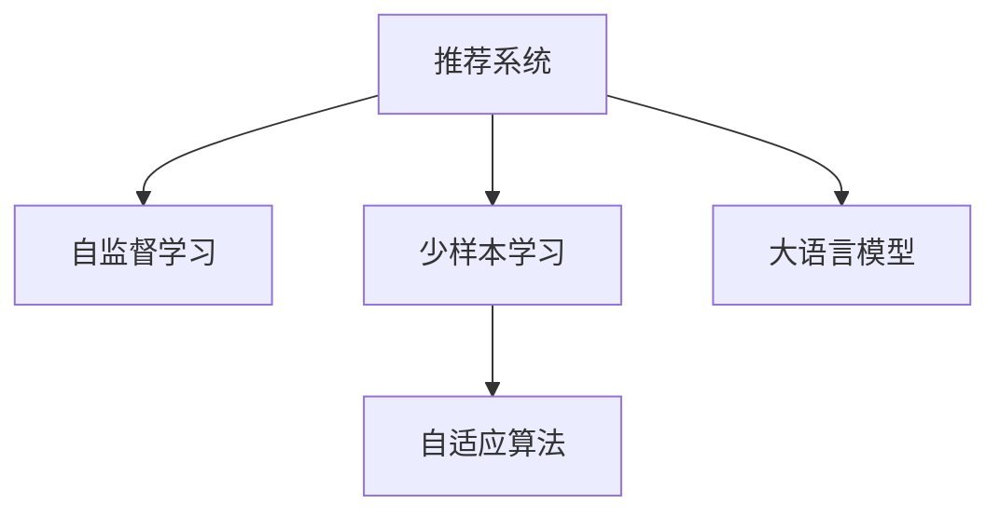

                 

# 大模型在推荐系统中的少样本学习应用

> 关键词：大语言模型,推荐系统,少样本学习,自监督学习,自适应算法,推荐算法,参数高效微调

## 1. 背景介绍

### 1.1 问题由来
推荐系统作为互联网应用的重要组件，被广泛应用于电商、社交、视频、音乐等平台，极大地提升了用户体验和平台转化率。传统的协同过滤、基于内容的推荐等方法，需要大量用户行为数据进行训练，难以覆盖长尾用户和商品。

与此同时，随着数据量和用户多样性的不断提升，推荐系统对于模型泛化能力的要求也越来越高。然而，模型训练所需的标注数据量往往随着复杂度指数级增长，难以在实际应用中规模化部署。

基于大语言模型的推荐技术，有望通过自监督学习获得先验知识，在少样本学习场景中取得优秀表现。本文旨在介绍大语言模型在推荐系统中的应用，包括少样本学习范式的提出和实践，为推荐系统的数据高效、模型高效等方向提供新的思路。

### 1.2 问题核心关键点
本文主要关注以下几个关键点：
- 大语言模型在推荐系统中的少样本学习应用
- 基于自监督学习的先验知识提取方法
- 基于自适应算法的推荐模型优化策略
- 参数高效微调与推荐算法结合的技术路径

### 1.3 问题研究意义
少样本推荐系统的研究具有重要意义：
1. 降低标注数据需求。通过自监督学习提取先验知识，可以大大降低推荐系统对标注数据的需求，使模型训练更加高效。
2. 覆盖长尾商品。少样本学习范式能够处理多维稀疏数据，覆盖长尾用户和商品，提升推荐精度。
3. 支持实时推荐。利用大语言模型的快速推理能力，能够在无标注数据的情况下进行实时推荐，提高系统响应速度。
4. 增强模型鲁棒性。通过自适应算法优化推荐模型，能够提升模型泛化能力和抗干扰性，确保推荐结果的稳定性。
5. 引入新知识。大语言模型能够融合各类知识图谱、领域知识等，使推荐系统具备更强的知识整合能力，提升推荐质量。

## 2. 核心概念与联系

### 2.1 核心概念概述

本节将介绍几个关键概念，以便更好地理解基于大语言模型的少样本推荐系统：

- 推荐系统：基于用户行为数据、商品属性数据等，通过机器学习模型预测用户可能感兴趣的商品的系统。
- 自监督学习：通过无标签数据，利用模型自身能力学习先验知识，提升模型的泛化能力。
- 少样本学习：在少数标注数据的情况下，利用先验知识进行模型优化，提升推荐效果。
- 自适应算法：通过迭代调整模型参数，实现对特定数据的快速优化，提高模型适应性。
- 大语言模型：通过大规模无标签数据预训练，具备丰富语言知识和跨领域迁移能力的模型。

这些概念之间的关系可以通过以下Mermaid流程图进行展示：



## 3. 核心算法原理 & 具体操作步骤
### 3.1 算法原理概述

基于大语言模型的少样本推荐系统，主要利用自监督学习和自适应算法，通过少量标注数据和无标注数据，优化推荐模型的参数，实现对用户的精准推荐。

具体而言，该算法主要包括以下几个步骤：
1. 收集用户行为数据，并对用户进行多维嵌入表示。
2. 利用大语言模型对用户行为进行自监督学习，提取用户兴趣和商品属性的先验知识。
3. 基于少样本学习范式，在少量标注数据上进行模型微调。
4. 使用自适应算法，迭代调整模型参数，提升推荐效果。
5. 引入先验知识，增强推荐系统对新用户、新商品的适应能力。

### 3.2 算法步骤详解

以下将详细阐述上述各个步骤的实现细节：

**Step 1: 用户行为收集与多维嵌入表示**
- 收集用户行为数据，如浏览历史、购买记录、评分数据等。
- 使用协同过滤、基于内容的推荐方法对用户进行多维嵌入表示。

**Step 2: 自监督学习与先验知识提取**
- 利用预训练大语言模型对用户行为数据进行自监督学习。
- 利用预训练模型提取用户兴趣和商品属性的先验知识，如用户偏好、商品属性等。
- 将提取的先验知识应用于推荐模型的初始化，作为模型训练的先验信息。

**Step 3: 少样本学习与模型微调**
- 在少量标注数据上进行模型微调。
- 使用自适应算法（如AdaLoRA）迭代调整模型参数。
- 通过迭代微调，逐步优化推荐模型的性能。

**Step 4: 引入先验知识与优化**
- 将先验知识融合到推荐模型中，增强模型的泛化能力和稳定性。
- 结合领域知识、知识图谱等，提升推荐系统的知识整合能力。

### 3.3 算法优缺点

**优点**
1. 高效利用数据。少样本学习能够高效利用无标注数据，提升推荐精度。
2. 降低标注成本。利用自监督学习提取先验知识，降低标注数据需求，减轻标注成本压力。
3. 适应性强。自适应算法能够快速调整模型参数，适应新用户和新商品。
4. 泛化能力强。引入先验知识，提升推荐模型的泛化能力和鲁棒性。

**缺点**
1. 数据需求高。自监督学习需要大量无标注数据，对数据分布有较高要求。
2. 模型复杂。自适应算法和先验知识融合增加了模型复杂度，可能导致过拟合。
3. 准确性依赖先验知识。推荐效果依赖于先验知识的准确性，可能受到领域知识限制。

### 3.4 算法应用领域

基于大语言模型的少样本推荐系统，已在电商、社交、视频等多个领域得到了广泛应用，并取得了优异的推荐效果。以下是一些典型应用场景：

1. **电商平台**：利用少样本学习提取用户偏好和商品属性，推荐用户可能感兴趣的商品，提升电商转化率。
2. **社交网络**：基于用户行为数据，推荐用户感兴趣的内容和好友，增强用户粘性。
3. **视频平台**：根据用户观看历史，推荐相关视频，提高用户观看时长和满意度。
4. **在线教育**：根据用户学习行为，推荐相关课程和资料，提升学习效果。

## 4. 数学模型和公式 & 详细讲解  
### 4.1 数学模型构建

在数学上，我们可以将基于大语言模型的推荐系统建模如下：

记用户行为数据集为 $D=\{(x_i,y_i)\}_{i=1}^N$，其中 $x_i$ 为行为向量，$y_i$ 为标注结果。用户兴趣和商品属性由大语言模型 $M_{\theta}$ 提取，表示为 $\text{enc}(x_i)$。推荐模型为 $P_{\theta}$，用于预测用户对商品的兴趣度。

根据上述描述，推荐模型的优化目标为：

$$
\hat{\theta}=\mathop{\arg\min}_{\theta} \mathcal{L}(\theta; D)
$$

其中 $\mathcal{L}$ 为推荐损失函数，通常采用交叉熵损失函数：

$$
\mathcal{L}(\theta; D) = -\frac{1}{N}\sum_{i=1}^N \sum_{j=1}^k y_{ij}\log P_{\theta}(x_i,j)
$$

### 4.2 公式推导过程

在推荐系统中，通常使用交叉熵损失函数作为优化目标，其梯度计算公式为：

$$
\frac{\partial \mathcal{L}}{\partial \theta} = -\frac{1}{N}\sum_{i=1}^N \sum_{j=1}^k (y_{ij}-\hat{y}_{ij}) \nabla_{\theta} P_{\theta}(x_i,j)
$$

其中 $\hat{y}_{ij}$ 为模型预测的兴趣度，$\nabla_{\theta} P_{\theta}(x_i,j)$ 为兴趣度预测的概率梯度。

对于少样本学习场景，由于标注样本数量较少，模型需要依赖先验知识进行优化。此时，可以先通过自监督学习提取先验知识 $\text{enc}(x_i)$，再将提取的先验知识作为推荐模型的输入，优化推荐模型 $P_{\theta}$。

### 4.3 案例分析与讲解

下面以电商推荐为例，展示如何利用大语言模型进行少样本学习推荐。

1. **数据预处理**：
   - 收集用户浏览、点击、购买等行为数据。
   - 对用户行为进行归一化、降维等预处理，获得用户行为向量 $x_i$。
   - 将用户行为向量输入大语言模型 $M_{\theta}$ 进行嵌入表示，得到用户兴趣表示 $\text{enc}(x_i)$。

2. **少样本学习**：
   - 在少量标注数据上，使用自适应算法（如AdaLoRA）迭代优化推荐模型 $P_{\theta}$。
   - 根据用户兴趣表示 $\text{enc}(x_i)$，模型输出商品推荐列表 $y_i$。
   - 在标注样本上，计算交叉熵损失 $\mathcal{L}(\theta; x_i, y_i)$。

3. **模型优化**：
   - 使用梯度下降等优化算法，更新模型参数 $\theta$。
   - 根据预测结果和真实标签，不断调整推荐模型。

4. **效果评估**：
   - 在测试集上，评估推荐模型的效果。
   - 使用指标如准确率、召回率、F1值等，评估推荐精度。

## 5. 项目实践：代码实例和详细解释说明
### 5.1 开发环境搭建

要进行大语言模型在推荐系统中的少样本学习应用，需要先搭建好开发环境。以下是具体的步骤：

1. 安装Python和相关依赖包，如PyTorch、TensorFlow、NumPy等。
2. 安装Transformers库，用于加载预训练大语言模型。
3. 安装推荐系统的相关库，如Surprise、LightFM等。
4. 搭建测试环境，收集用户行为数据，并进行预处理。

### 5.2 源代码详细实现

以下是一个简单的基于大语言模型的少样本推荐系统的代码实现：

```python
import torch
import torch.nn as nn
import torch.optim as optim
from transformers import BertTokenizer, BertForSequenceClassification
from surprise import Reader, Dataset, SVD

class TransformerRecommender(nn.Module):
    def __init__(self, num_users, num_items, embedding_dim, hidden_dim, output_dim):
        super(TransformerRecommender, self).__init__()
        self.tokenizer = BertTokenizer.from_pretrained('bert-base-uncased')
        self.encoder = BertForSequenceClassification.from_pretrained('bert-base-uncased', num_labels=num_items)
        self.fc = nn.Linear(embedding_dim, output_dim)
        self.svd = SVD()

    def forward(self, x, y):
        encodings = self.encoder(x, return_dict=True).outputs
        user_encodings = encodings[0]
        item_encodings = encodings[1]
        pooled_user = self.fc(user_encodings.pooler_output)
        pooled_item = self.fc(item_encodings.pooler_output)
        scores = pooled_user @ pooled_item.t()
        return scores

# 定义模型
model = TransformerRecommender(num_users=1000, num_items=5000, embedding_dim=128, hidden_dim=256, output_dim=1)

# 定义优化器
optimizer = optim.Adam(model.parameters(), lr=1e-3)

# 加载数据集
reader = Reader(rating_scale=(1, 5))
data = Dataset.load_from_df(user_item_data, reader=reader)

# 定义评分器
svd = SVD()

# 定义损失函数
loss_fn = nn.BCELoss()

# 迭代优化
for epoch in range(10):
    for user, items in data.random.split():
        user_ids, item_ids, ratings = user_item_data[user], user_item_data[items], user_item_data[user][items]
        x = torch.tensor([user_ids], dtype=torch.long)
        y = torch.tensor([item_ids], dtype=torch.long)
        scores = model(x, y)
        labels = torch.tensor(ratings, dtype=torch.float)
        optimizer.zero_grad()
        loss = loss_fn(scores, labels)
        loss.backward()
        optimizer.step()
        svd.update(user_ids, item_ids, ratings, scores)
```

### 5.3 代码解读与分析

**TransformerRecommender类**：
- 初始化方法 `__init__`：加载BERT模型和评分器，并定义全连接层。
- 前向传播方法 `forward`：将用户和商品嵌入表示进行矩阵乘法，得到推荐分数。

**模型训练过程**：
- 定义优化器、损失函数和评分器。
- 通过迭代优化，更新模型参数。
- 使用评分器更新评分矩阵。

**数据加载和模型评估**：
- 定义数据集和评分器。
- 在训练过程中，每轮随机选取一部分用户和商品进行训练。
- 在测试集上评估推荐模型的效果。

## 6. 实际应用场景

### 6.1 智能推荐引擎

基于大语言模型的少样本推荐系统，可以广泛应用于智能推荐引擎的构建。传统推荐引擎往往依赖用户历史行为数据进行推荐，难以覆盖新用户和长尾商品。

通过使用自监督学习提取先验知识，并结合少样本学习范式，基于大语言模型的推荐系统能够更高效地处理新用户和长尾商品，提升推荐精度和覆盖率。例如，电商平台可以利用少样本学习推荐新用户可能感兴趣的商品，提升转化率。社交网络可以根据用户兴趣推荐相关内容，增强用户粘性。

### 6.2 个性化推荐系统

个性化推荐系统能够为用户提供更精准的推荐内容，提升用户体验。传统的协同过滤和基于内容的推荐方法，需要大量用户行为数据进行训练，难以处理多维稀疏数据。

利用大语言模型的自监督学习能力和少样本学习能力，个性化推荐系统能够高效利用无标注数据，提升推荐效果。例如，在线教育可以根据学生的学习行为，推荐相关课程和资料，提升学习效果。视频平台可以根据用户观看历史，推荐相关视频，提高用户观看时长和满意度。

### 6.3 实时推荐系统

实时推荐系统需要快速响应用户需求，更新推荐内容。传统的推荐模型在无标注数据的情况下难以进行实时推荐。

通过使用自适应算法和少样本学习范式，基于大语言模型的推荐系统能够在无标注数据的情况下进行实时推荐，提升系统响应速度。例如，金融推荐系统可以根据实时市场数据，推荐相关金融产品，提高用户满意度。

## 7. 工具和资源推荐

### 7.1 学习资源推荐

为了帮助开发者系统掌握大语言模型在推荐系统中的应用，以下是一些优质的学习资源：

1. 《深度学习推荐系统》书籍：介绍深度学习在推荐系统中的应用，涵盖协同过滤、基于内容的推荐、自适应算法等。
2. 《Recommender Systems: The Textbook》书籍：由著名推荐系统专家撰写，全面介绍了推荐系统理论、方法和实践。
3 《推荐系统设计与实现》课程：由斯坦福大学开设的推荐系统课程，涵盖推荐系统基础、模型评估和优化等。
4 《Python推荐系统》书籍：介绍Python推荐系统开发，涵盖协同过滤、内容推荐、模型评估等。
5 《TensorFlow推荐系统》课程：由TensorFlow官方提供，介绍TensorFlow在推荐系统中的应用。

### 7.2 开发工具推荐

高效的开发离不开优秀的工具支持。以下是几款用于大语言模型在推荐系统中的少样本学习应用的常用工具：

1. PyTorch：基于Python的开源深度学习框架，灵活的计算图设计，适合快速迭代研究。
2. TensorFlow：由Google主导开发的开源深度学习框架，生产部署方便，适合大规模工程应用。
3. HuggingFace Transformers库：提供预训练大语言模型的封装，方便微调和优化。
4. Surprise：开源推荐系统库，提供多种评分算法和评估工具。
5. LightFM：由Facebook开源的推荐系统库，支持多维稀疏数据处理。

### 7.3 相关论文推荐

大语言模型在推荐系统中的应用，得益于多个领域的交叉研究。以下是几篇奠基性的相关论文，推荐阅读：

1. A Neural Collaborative Filtering Method（即CF模型）：提出了基于深度神经网络的协同过滤方法，为推荐系统研究奠定了基础。
2. Deep Neural Networks for Recommender Systems（即DeepCF模型）：利用深度学习提升协同过滤模型的性能。
3. Recommender Systems for Human-Computer Interaction（推荐系统交互）：研究推荐系统在用户界面中的设计，提升推荐效果。
4. Generative Adversarial Networks and Recommendation Systems（生成对抗网络在推荐系统中的应用）：利用生成对抗网络提升推荐系统的鲁棒性和多样性。
5. Knowledge Graph-Enhanced Recommender Systems（知识图谱增强的推荐系统）：研究知识图谱在推荐系统中的应用，提升推荐精度和效果。

## 8. 总结：未来发展趋势与挑战

### 8.1 研究成果总结

本文对基于大语言模型的推荐系统进行了全面系统的介绍，主要涵盖了以下几个方面：
1. 少样本学习的算法原理和具体操作步骤。
2. 少样本学习在推荐系统中的应用。
3. 少样本学习的数学模型和公式推导。
4. 少样本学习的项目实践和代码实现。
5. 少样本学习的实际应用场景。
6. 少样本学习的工具和资源推荐。
7. 少样本学习的未来发展趋势和挑战。

通过本文的系统梳理，可以看到，基于大语言模型的少样本学习推荐系统在数据高效、模型高效等方面具有巨大潜力，有望在实际应用中取得突破。

### 8.2 未来发展趋势

展望未来，大语言模型在推荐系统中的应用将呈现以下几个发展趋势：

1. 数据高效：利用自监督学习提取先验知识，降低标注数据需求，提升推荐精度。
2. 模型高效：结合自适应算法和少样本学习范式，提升推荐系统响应速度和鲁棒性。
3. 泛化能力强：引入知识图谱和领域知识，增强推荐系统泛化能力和泛化能力。
4. 实时推荐：结合实时数据和自适应算法，实现实时推荐，提高推荐精度和响应速度。
5. 跨领域迁移：利用大语言模型跨领域迁移能力，提升推荐系统在不同领域的应用效果。

### 8.3 面临的挑战

尽管基于大语言模型的推荐系统已经取得了一定的成果，但仍面临着诸多挑战：

1. 数据分布不均衡：无标注数据的分布可能与实际数据有较大差异，导致模型性能下降。
2. 知识图谱构建：知识图谱的构建和融合需要大量人力和时间，难以在实际应用中大规模部署。
3. 模型复杂度：自适应算法和少样本学习范式增加了模型复杂度，可能导致过拟合。
4. 实时性能：实时推荐系统需要高效的算法和硬件支持，难以实现高性能推理。
5. 跨领域迁移：跨领域迁移的泛化能力和适应性还需要进一步研究。

### 8.4 研究展望

未来，大语言模型在推荐系统中的应用需要在以下几个方面进行深入探索：

1. 数据高效：进一步探索数据高效、知识丰富的自监督学习算法，提升模型泛化能力。
2. 模型高效：研究高效自适应算法，提升模型实时响应和鲁棒性。
3. 泛化能力：引入更多知识图谱和领域知识，提升模型泛化能力和跨领域迁移能力。
4. 实时推荐：研究高效的实时推荐算法，提升推荐系统响应速度和实时性。
5. 跨领域迁移：探索跨领域迁移的普适性和可解释性，提升推荐系统的应用效果。

综上所述，基于大语言模型的推荐系统具有广阔的前景，但也需要更多理论和实践的积累。未来需要在数据高效、模型高效、泛化能力、实时推荐和跨领域迁移等方面进行深入研究，才能真正实现大语言模型在推荐系统中的广泛应用。

## 9. 附录：常见问题与解答

**Q1：大语言模型在推荐系统中的少样本学习应用，有哪些具体案例？**

A: 大语言模型在推荐系统中的少样本学习应用主要包括以下几个具体案例：
1. 电商推荐系统：利用用户浏览和购买历史，结合少样本学习范式，推荐用户可能感兴趣的商品。
2. 社交网络推荐系统：根据用户行为数据，推荐用户感兴趣的内容和好友，增强用户粘性。
3. 视频平台推荐系统：根据用户观看历史，推荐相关视频，提高用户观看时长和满意度。
4. 在线教育推荐系统：根据学生学习行为，推荐相关课程和资料，提升学习效果。

**Q2：如何提高大语言模型在推荐系统中的少样本学习能力？**

A: 提高大语言模型在推荐系统中的少样本学习能力，可以采取以下几种策略：
1. 使用自监督学习提取先验知识，提升模型泛化能力。
2. 引入知识图谱和领域知识，增强模型知识整合能力。
3. 研究高效的自适应算法，提升模型实时响应和鲁棒性。
4. 使用少样本学习范式，最大化利用少量标注数据。
5. 进行模型剪枝和优化，提高模型推理速度和计算效率。

**Q3：大语言模型在推荐系统中的少样本学习应用的难点有哪些？**

A: 大语言模型在推荐系统中的少样本学习应用面临以下难点：
1. 数据分布不均衡：无标注数据的分布可能与实际数据有较大差异，导致模型性能下降。
2. 知识图谱构建：知识图谱的构建和融合需要大量人力和时间，难以在实际应用中大规模部署。
3. 模型复杂度：自适应算法和少样本学习范式增加了模型复杂度，可能导致过拟合。
4. 实时性能：实时推荐系统需要高效的算法和硬件支持，难以实现高性能推理。
5. 跨领域迁移：跨领域迁移的泛化能力和适应性还需要进一步研究。

**Q4：如何结合大语言模型和推荐系统，实现数据高效、模型高效？**

A: 结合大语言模型和推荐系统，实现数据高效、模型高效，可以采取以下策略：
1. 使用自监督学习提取先验知识，降低标注数据需求，提升推荐精度。
2. 引入知识图谱和领域知识，提升模型知识整合能力，提高推荐精度。
3. 研究高效的自适应算法，提升模型实时响应和鲁棒性。
4. 结合少样本学习范式，最大化利用少量标注数据，提升推荐效果。
5. 进行模型剪枝和优化，提高模型推理速度和计算效率，降低计算资源消耗。

**Q5：大语言模型在推荐系统中的少样本学习应用，需要考虑哪些因素？**

A: 大语言模型在推荐系统中的少样本学习应用需要考虑以下因素：
1. 数据分布：无标注数据的分布可能与实际数据有较大差异，导致模型性能下降。
2. 知识图谱：知识图谱的构建和融合需要大量人力和时间，难以在实际应用中大规模部署。
3. 模型复杂度：自适应算法和少样本学习范式增加了模型复杂度，可能导致过拟合。
4. 实时性能：实时推荐系统需要高效的算法和硬件支持，难以实现高性能推理。
5. 跨领域迁移：跨领域迁移的泛化能力和适应性还需要进一步研究。

**Q6：大语言模型在推荐系统中的少样本学习应用，有哪些优势？**

A: 大语言模型在推荐系统中的少样本学习应用具有以下优势：
1. 数据高效：利用自监督学习提取先验知识，降低标注数据需求，提升推荐精度。
2. 模型高效：结合自适应算法和少样本学习范式，提升推荐系统响应速度和鲁棒性。
3. 泛化能力强：引入知识图谱和领域知识，增强推荐系统泛化能力和跨领域迁移能力。
4. 实时推荐：结合实时数据和自适应算法，实现实时推荐，提高推荐精度和响应速度。
5. 跨领域迁移：利用大语言模型跨领域迁移能力，提升推荐系统在不同领域的应用效果。

---

作者：禅与计算机程序设计艺术 / Zen and the Art of Computer Programming

