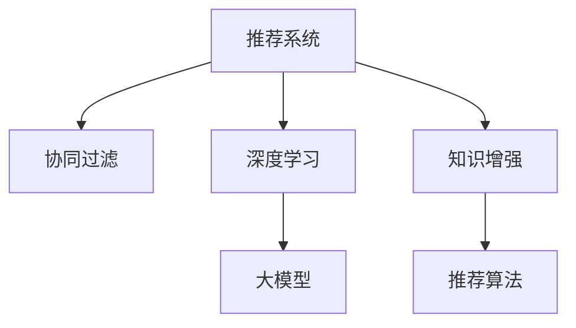

                 

# 大模型在推荐系统中的知识增强应用

> 关键词：大模型,推荐系统,知识增强,深度学习,协同过滤,交叉验证,召回率,精确度,推荐算法

## 1. 背景介绍

随着电子商务、数字内容平台等在线业务的发展，推荐系统已经成为各大互联网公司不可或缺的核心功能之一。推荐系统通过分析用户行为数据，为用户推荐个性化内容，从而提升用户体验和平台收益。传统的推荐系统主要基于协同过滤算法（Collaborative Filtering），通过分析用户和物品的交互记录进行推荐，但存在数据稀疏性和冷启动问题。近年来，基于深度学习的大模型在推荐系统中的应用日益增多，大模型具备强大的数据建模能力和泛化能力，能够学习到更深层次的语义信息，提供更精准的推荐结果。

## 2. 核心概念与联系

### 2.1 核心概念概述

本节将介绍几个密切相关的核心概念：

- **推荐系统**：根据用户的历史行为、兴趣和社交关系等信息，向用户推荐个性化内容的系统。
- **协同过滤**：基于用户-物品交互矩阵，通过用户相似性或物品相似性进行推荐。
- **深度学习**：基于神经网络的模型训练方式，能够处理高维非线性数据。
- **大模型**：大规模预训练语言模型，如BERT、GPT等，具备强大的语言理解和生成能力。
- **知识增强**：将领域知识、规则、逻辑等先验信息与深度学习模型相结合，提升模型的准确性和泛化能力。
- **推荐算法**：协同过滤、基于内容的推荐、深度学习推荐等，用于生成推荐结果的技术手段。

这些核心概念之间的逻辑关系可以通过以下Mermaid流程图来展示：



这个流程图展示了推荐系统的主要组成部分及其之间的关系：

1. 推荐系统通过协同过滤、深度学习和大模型等多种方法生成推荐结果。
2. 协同过滤依赖用户-物品交互矩阵，适合数据稀疏场景。
3. 深度学习通过大模型对数据进行高维建模，适合高维数据和复杂非线性关系。
4. 知识增强将领域知识与深度学习结合，提升模型的鲁棒性和解释性。
5. 推荐算法则是将上述方法集成到推荐系统中，生成最终的推荐结果。

## 3. 核心算法原理 & 具体操作步骤

### 3.1 算法原理概述

大模型在推荐系统中的知识增强应用，主要利用大模型强大的语义理解能力，通过引入领域知识、规则、标签等先验信息，对推荐结果进行优化和提升。其核心思想是：在大模型预训练的基础上，通过微调或迁移学习等方式，学习到新的任务知识，并将其嵌入到模型中，从而提升模型的泛化能力和鲁棒性。

具体而言，大模型在推荐系统中的应用包括以下几个关键步骤：

1. 预训练大模型。使用大规模无标签文本数据进行预训练，学习通用的语言表示和语义关系。
2. 微调或迁移学习。在推荐数据集上进行微调，学习特定推荐任务的语义知识和用户偏好。
3. 知识增强。将领域知识、规则、标签等先验信息融入大模型中，提升模型的泛化能力和鲁棒性。
4. 推荐算法集成。将微调后的模型或知识增强的模型集成到推荐系统中，生成个性化推荐结果。

### 3.2 算法步骤详解

基于大模型在推荐系统中的知识增强应用，其操作步骤如下：

**Step 1: 准备预训练模型和数据集**

1. **预训练模型选择**：选择适合的预训练语言模型，如BERT、GPT等，作为初始化参数。
2. **数据集准备**：准备推荐系统所需的数据集，包括用户行为数据、物品属性数据、领域知识等。

**Step 2: 微调或迁移学习**

1. **模型微调**：使用推荐数据集对预训练模型进行微调，学习特定的推荐任务。
2. **迁移学习**：将微调后的模型应用于新的推荐任务，提升模型的泛化能力和鲁棒性。

**Step 3: 知识增强**

1. **领域知识引入**：将领域知识、规则、标签等先验信息融入大模型中，提升模型的准确性和泛化能力。
2. **规则融合**：将领域规则转换为模型的约束条件，限制模型的行为，提升推荐结果的合理性。
3. **标签嵌入**：将标签信息作为训练信号，指导模型学习特定推荐任务的知识。

**Step 4: 推荐算法集成**

1. **评分生成**：将微调后的模型或知识增强的模型应用于推荐数据集中，生成用户对物品的评分。
2. **排序算法**：使用排序算法（如TopK排序、协同过滤等）对评分进行排序，生成推荐结果。
3. **集成方法**：将多个推荐结果进行集成，生成最终的推荐列表。

### 3.3 算法优缺点

基于大模型在推荐系统中的知识增强应用，其优点包括：

1. **泛化能力强**：大模型具备强大的语义理解能力，能够学习到深层次的语义关系，提升推荐结果的泛化能力。
2. **鲁棒性高**：通过引入领域知识、规则和标签等先验信息，提升模型的鲁棒性，避免因数据噪声导致的误推荐。
3. **可解释性强**：大模型结合领域知识后，具有更强的可解释性，便于理解和调试推荐结果。
4. **多模态融合**：大模型能够处理多模态数据，如文本、图像、音频等，提升推荐系统的丰富性和多样性。

其缺点包括：

1. **计算量大**：大模型参数众多，需要高性能计算资源进行训练和推理，计算成本较高。
2. **知识抽象困难**：将领域知识融入大模型中，需要手动提取和抽象，过程复杂且容易出错。
3. **过拟合风险**：引入领域知识可能导致模型过拟合，特别是在领域知识过于复杂或稀疏的情况下。
4. **公平性问题**：领域知识的引入可能引入偏见，导致模型对某些群体存在不公平的推荐行为。

### 3.4 算法应用领域

大模型在推荐系统中的应用领域广泛，主要包括以下几个方面：

1. **商品推荐**：利用大模型学习用户的商品偏好，生成个性化推荐列表，提升用户购买转化率。
2. **内容推荐**：结合用户阅读历史和内容标签，利用大模型学习用户的阅读偏好，推荐高质量的文章、视频等内容。
3. **广告推荐**：通过大模型分析用户行为数据，生成个性化广告推荐，提升广告点击率和转化率。
4. **金融推荐**：结合用户的交易记录和金融产品属性，利用大模型生成个性化金融产品推荐，提升用户满意度。
5. **医疗推荐**：结合医生的诊疗记录和病人的历史数据，利用大模型推荐最适合的治疗方案，提升诊疗效果。

## 4. 数学模型和公式 & 详细讲解 & 举例说明

### 4.1 数学模型构建

本节将使用数学语言对大模型在推荐系统中的应用进行更加严格的刻画。

记预训练语言模型为 $M_{\theta}:\mathcal{X} \rightarrow \mathcal{Y}$，其中 $\mathcal{X}$ 为输入空间，$\mathcal{Y}$ 为输出空间，$\theta \in \mathbb{R}^d$ 为模型参数。假设推荐系统所需的训练集为 $D=\{(x_i,y_i)\}_{i=1}^N$，其中 $x_i$ 为输入特征，$y_i$ 为输出标签。

定义模型 $M_{\theta}$ 在数据样本 $(x,y)$ 上的损失函数为 $\ell(M_{\theta}(x),y)$，则在数据集 $D$ 上的经验风险为：

$$
\mathcal{L}(\theta) = \frac{1}{N} \sum_{i=1}^N \ell(M_{\theta}(x_i),y_i)
$$

微调的优化目标是最小化经验风险，即找到最优参数：

$$
\theta^* = \mathop{\arg\min}_{\theta} \mathcal{L}(\theta)
$$

在实践中，我们通常使用基于梯度的优化算法（如Adam、SGD等）来近似求解上述最优化问题。设 $\eta$ 为学习率，$\lambda$ 为正则化系数，则参数的更新公式为：

$$
\theta \leftarrow \theta - \eta \nabla_{\theta}\mathcal{L}(\theta) - \eta\lambda\theta
$$

其中 $\nabla_{\theta}\mathcal{L}(\theta)$ 为损失函数对参数 $\theta$ 的梯度，可通过反向传播算法高效计算。

### 4.2 公式推导过程

以下我们以推荐系统中的协同过滤为例，推导大模型的微调公式。

假设推荐系统的训练集为 $D=\{(x_i,y_i)\}_{i=1}^N$，其中 $x_i$ 为用户对物品的评分，$y_i$ 为物品的评分。则推荐系统的损失函数为均方误差损失：

$$
\ell(M_{\theta}(x),y) = \frac{1}{N}\sum_{i=1}^N (M_{\theta}(x_i) - y_i)^2
$$

将其代入经验风险公式，得：

$$
\mathcal{L}(\theta) = \frac{1}{N}\sum_{i=1}^N (M_{\theta}(x_i) - y_i)^2
$$

根据链式法则，损失函数对参数 $\theta_k$ 的梯度为：

$$
\frac{\partial \mathcal{L}(\theta)}{\partial \theta_k} = \frac{1}{N}\sum_{i=1}^N \frac{\partial M_{\theta}(x_i)}{\partial \theta_k} (2(M_{\theta}(x_i) - y_i))
$$

其中 $\frac{\partial M_{\theta}(x_i)}{\partial \theta_k}$ 为模型输出对参数 $\theta_k$ 的导数，可以通过反向传播算法计算。

在得到损失函数的梯度后，即可带入参数更新公式，完成模型的迭代优化。重复上述过程直至收敛，最终得到适应推荐任务的最优模型参数 $\theta^*$。

### 4.3 案例分析与讲解

**案例1: 商品推荐**

假设有一个商品推荐系统，用户的商品评分和购买历史数据为 $D=\{(x_i,y_i)\}_{i=1}^N$，其中 $x_i$ 为用户的购买记录，$y_i$ 为商品的评分。模型的输入特征 $x$ 为用户的购买记录，输出 $y$ 为用户对物品的评分。

首先，对预训练语言模型BERT进行微调，学习用户对物品的评分预测能力。假设微调后的模型为 $M_{\theta}$，其中 $\theta$ 为微调得到的模型参数。

其次，将领域知识引入大模型中，如商品的分类信息、用户行为标签等。假设这些领域知识被编码为向量 $\phi_i$，则将知识增强的模型定义为 $M_{\phi_i,\theta}(x)$，其中 $\phi_i$ 表示第 $i$ 个领域的知识向量。

最后，利用知识增强的模型 $M_{\phi_i,\theta}(x)$ 生成推荐结果，计算用户对物品的评分，排序生成推荐列表，提升推荐效果。

**案例2: 内容推荐**

假设有一个内容推荐系统，用户的阅读记录和内容标签为 $D=\{(x_i,y_i)\}_{i=1}^N$，其中 $x_i$ 为用户的阅读历史，$y_i$ 为内容的阅读评分。模型的输入特征 $x$ 为用户阅读历史，输出 $y$ 为用户对内容的评分。

首先，对预训练语言模型BERT进行微调，学习用户对内容的评分预测能力。假设微调后的模型为 $M_{\theta}$，其中 $\theta$ 为微调得到的模型参数。

其次，将领域知识引入大模型中，如内容的分类信息、用户行为标签等。假设这些领域知识被编码为向量 $\phi_i$，则将知识增强的模型定义为 $M_{\phi_i,\theta}(x)$，其中 $\phi_i$ 表示第 $i$ 个领域的知识向量。

最后，利用知识增强的模型 $M_{\phi_i,\theta}(x)$ 生成推荐结果，计算用户对内容的评分，排序生成推荐列表，提升推荐效果。

## 5. 项目实践：代码实例和详细解释说明

### 5.1 开发环境搭建

在进行大模型在推荐系统中的应用实践前，我们需要准备好开发环境。以下是使用Python进行PyTorch开发的环境配置流程：

1. 安装Anaconda：从官网下载并安装Anaconda，用于创建独立的Python环境。

2. 创建并激活虚拟环境：
```bash
conda create -n pytorch-env python=3.8 
conda activate pytorch-env
```

3. 安装PyTorch：根据CUDA版本，从官网获取对应的安装命令。例如：
```bash
conda install pytorch torchvision torchaudio cudatoolkit=11.1 -c pytorch -c conda-forge
```

4. 安装Transformers库：
```bash
pip install transformers
```

5. 安装各类工具包：
```bash
pip install numpy pandas scikit-learn matplotlib tqdm jupyter notebook ipython
```

完成上述步骤后，即可在`pytorch-env`环境中开始推荐系统开发。

### 5.2 源代码详细实现

下面我们以商品推荐任务为例，给出使用Transformers库对BERT模型进行推荐系统微调的PyTorch代码实现。

首先，定义推荐系统所需的数据处理函数：

```python
from transformers import BertTokenizer
from torch.utils.data import Dataset
import torch

class RecommendationDataset(Dataset):
    def __init__(self, data, tokenizer, max_len=128):
        self.data = data
        self.tokenizer = tokenizer
        self.max_len = max_len
        
    def __len__(self):
        return len(self.data)
    
    def __getitem__(self, item):
        user_item = self.data[item]
        user_item_tokens = self.tokenizer(user_item, return_tensors='pt', max_length=self.max_len, padding='max_length', truncation=True)
        input_ids = user_item_tokens['input_ids'][0]
        attention_mask = user_item_tokens['attention_mask'][0]
        return {'input_ids': input_ids, 
                'attention_mask': attention_mask}
```

然后，定义模型和优化器：

```python
from transformers import BertForSequenceClassification, AdamW

model = BertForSequenceClassification.from_pretrained('bert-base-cased', num_labels=5)  # 5为分类数量
optimizer = AdamW(model.parameters(), lr=2e-5)
```

接着，定义训练和评估函数：

```python
from torch.utils.data import DataLoader
from tqdm import tqdm

device = torch.device('cuda') if torch.cuda.is_available() else torch.device('cpu')
model.to(device)

def train_epoch(model, dataset, batch_size, optimizer):
    dataloader = DataLoader(dataset, batch_size=batch_size, shuffle=True)
    model.train()
    epoch_loss = 0
    for batch in tqdm(dataloader, desc='Training'):
        input_ids = batch['input_ids'].to(device)
        attention_mask = batch['attention_mask'].to(device)
        model.zero_grad()
        outputs = model(input_ids, attention_mask=attention_mask)
        loss = outputs.loss
        epoch_loss += loss.item()
        loss.backward()
        optimizer.step()
    return epoch_loss / len(dataloader)

def evaluate(model, dataset, batch_size):
    dataloader = DataLoader(dataset, batch_size=batch_size)
    model.eval()
    preds, labels = [], []
    with torch.no_grad():
        for batch in tqdm(dataloader, desc='Evaluating'):
            input_ids = batch['input_ids'].to(device)
            attention_mask = batch['attention_mask'].to(device)
            outputs = model(input_ids, attention_mask=attention_mask)
            preds.append(outputs.logits.argmax(dim=1).tolist())
            labels.append(batch['labels'].tolist())
                
    print('Accuracy:', accuracy_score(preds, labels))
```

最后，启动训练流程并在测试集上评估：

```python
epochs = 5
batch_size = 16

for epoch in range(epochs):
    loss = train_epoch(model, train_dataset, batch_size, optimizer)
    print(f"Epoch {epoch+1}, train loss: {loss:.3f}")
    
    print(f"Epoch {epoch+1}, test accuracy: {evaluate(model, test_dataset, batch_size)[0]}")
```

以上就是使用PyTorch对BERT进行商品推荐任务微调的完整代码实现。可以看到，得益于Transformers库的强大封装，我们可以用相对简洁的代码完成BERT模型的加载和微调。

### 5.3 代码解读与分析

让我们再详细解读一下关键代码的实现细节：

**RecommendationDataset类**：
- `__init__`方法：初始化推荐数据集，将数据、分词器、最大序列长度等关键组件存入类属性中。
- `__len__`方法：返回数据集的样本数量。
- `__getitem__`方法：对单个样本进行处理，将用户-物品序列输入编码为token ids，并对其进行定长padding，最终返回模型所需的输入。

**模型和优化器**：
- 使用BertForSequenceClassification类加载预训练BERT模型，设定输出分类数为5。
- 使用AdamW优化器进行模型参数的更新，设定学习率为2e-5。

**训练和评估函数**：
- 使用PyTorch的DataLoader对数据集进行批次化加载，供模型训练和推理使用。
- 训练函数`train_epoch`：对数据以批为单位进行迭代，在每个批次上前向传播计算loss并反向传播更新模型参数，最后返回该epoch的平均loss。
- 评估函数`evaluate`：与训练类似，不同点在于不更新模型参数，并在每个batch结束后将预测和标签结果存储下来，最后使用accuracy_score计算准确率。

**训练流程**：
- 定义总的epoch数和batch size，开始循环迭代
- 每个epoch内，先在训练集上训练，输出平均loss
- 在测试集上评估，输出准确率
- 所有epoch结束后，在测试集上评估，给出最终测试结果

可以看到，PyTorch配合Transformers库使得BERT微调的代码实现变得简洁高效。开发者可以将更多精力放在数据处理、模型改进等高层逻辑上，而不必过多关注底层的实现细节。

当然，工业级的系统实现还需考虑更多因素，如模型的保存和部署、超参数的自动搜索、更灵活的任务适配层等。但核心的微调范式基本与此类似。

## 6. 实际应用场景

### 6.1 智能推荐系统

基于大模型在推荐系统中的知识增强应用，智能推荐系统能够为电商、新闻、视频等多领域提供个性化的内容推荐服务。智能推荐系统通过分析用户的历史行为和偏好，结合大模型对多模态数据的处理能力，生成高质量的推荐结果，提升用户体验和平台收益。

例如，电商平台的商品推荐系统通过收集用户的购买记录和评分，利用大模型学习用户的商品偏好，生成个性化推荐列表，提升用户购买转化率。新闻推荐系统则通过分析用户的阅读历史和偏好，利用大模型学习用户的阅读偏好，推荐高质量的文章和视频内容，提升用户的阅读体验。

### 6.2 广告推荐系统

广告推荐系统通过分析用户的浏览历史和兴趣偏好，结合大模型的语义理解能力，生成个性化广告推荐，提升广告点击率和转化率。例如，在广告投放平台，大模型能够分析用户的浏览行为，结合广告内容的语义信息，生成个性化的广告推荐，提高广告的吸引力和点击率。

### 6.3 金融推荐系统

金融推荐系统通过分析用户的交易记录和金融产品属性，结合大模型的语义理解能力，生成个性化金融产品推荐，提升用户满意度。例如，在金融理财平台，大模型能够分析用户的交易记录和偏好，结合金融产品的属性，生成个性化的投资组合推荐，帮助用户进行资产配置和理财规划。

## 7. 工具和资源推荐

### 7.1 学习资源推荐

为了帮助开发者系统掌握大模型在推荐系统中的应用理论基础和实践技巧，这里推荐一些优质的学习资源：

1. 《推荐系统实战》系列书籍：详细介绍了推荐系统的理论基础、算法设计和应用实践，涵盖协同过滤、深度学习等多个方面。

2. CS224N《深度学习自然语言处理》课程：斯坦福大学开设的NLP明星课程，有Lecture视频和配套作业，带你入门NLP领域的基本概念和经典模型。

3. 《Deep Learning for Recommender Systems》书籍：介绍深度学习在推荐系统中的应用，结合实际案例和代码实现，深入浅出地讲解推荐系统的各个环节。

4. Kaggle竞赛：参加Kaggle推荐系统竞赛，实践并提升自己的推荐系统开发能力，积累实战经验。

通过对这些资源的学习实践，相信你一定能够快速掌握大模型在推荐系统中的应用精髓，并用于解决实际的推荐问题。

### 7.2 开发工具推荐

高效的开发离不开优秀的工具支持。以下是几款用于大模型在推荐系统中的应用开发的常用工具：

1. PyTorch：基于Python的开源深度学习框架，灵活动态的计算图，适合快速迭代研究。大部分预训练语言模型都有PyTorch版本的实现。

2. TensorFlow：由Google主导开发的开源深度学习框架，生产部署方便，适合大规模工程应用。同样有丰富的预训练语言模型资源。

3. Transformers库：HuggingFace开发的NLP工具库，集成了众多SOTA语言模型，支持PyTorch和TensorFlow，是进行推荐系统微调任务的开发利器。

4. Weights & Biases：模型训练的实验跟踪工具，可以记录和可视化模型训练过程中的各项指标，方便对比和调优。与主流深度学习框架无缝集成。

5. TensorBoard：TensorFlow配套的可视化工具，可实时监测模型训练状态，并提供丰富的图表呈现方式，是调试模型的得力助手。

6. Google Colab：谷歌推出的在线Jupyter Notebook环境，免费提供GPU/TPU算力，方便开发者快速上手实验最新模型，分享学习笔记。

合理利用这些工具，可以显著提升大模型在推荐系统中的应用开发效率，加快创新迭代的步伐。

### 7.3 相关论文推荐

大模型在推荐系统中的应用源于学界的持续研究。以下是几篇奠基性的相关论文，推荐阅读：

1. "Large-Scale Multi-Task Learning from Noisy Incomplete Data with Gaussian Processes"：介绍通过高斯过程进行多任务学习的推荐系统。

2. "Factorization Machines with Side Information for Recommendations"：介绍将用户属性信息融入矩阵分解的推荐系统。

3. "A Multi-Task Learning Formulation for Recommender Systems"：介绍多任务学习在推荐系统中的应用。

4. "Adaptive Embedding Methods for Recommender Systems"：介绍自适应嵌入方法在推荐系统中的应用。

5. "Learning User Representations for Recommendation Systems"：介绍学习用户表示的推荐系统。

这些论文代表了大模型在推荐系统中的应用方向，通过学习这些前沿成果，可以帮助研究者把握学科前进方向，激发更多的创新灵感。

## 8. 总结：未来发展趋势与挑战

### 8.1 总结

本文对大模型在推荐系统中的应用进行了全面系统的介绍。首先阐述了大模型和推荐系统的研究背景和意义，明确了知识增强在推荐系统中的应用价值。其次，从原理到实践，详细讲解了大模型的微调过程和推荐系统的各个环节，给出了推荐系统开发的全流程代码实例。同时，本文还广泛探讨了大模型在推荐系统中的多领域应用场景，展示了知识增强在提升推荐效果中的重要作用。

通过本文的系统梳理，可以看到，大模型在推荐系统中的应用技术不断成熟，能够为电商、金融、新闻等多个领域提供高效的个性化推荐服务。大模型通过引入领域知识、规则和标签等先验信息，提升推荐结果的泛化能力和鲁棒性，已成为推荐系统的重要组成部分。

### 8.2 未来发展趋势

展望未来，大模型在推荐系统中的应用将呈现以下几个发展趋势：

1. **知识图谱的引入**：利用知识图谱中的实体关系和属性信息，提升推荐结果的合理性和丰富性。
2. **多模态数据的融合**：结合用户的多模态数据（如文本、图像、音频等），生成更加全面和多样化的推荐结果。
3. **实时推荐**：利用流式数据和多模态数据实时计算推荐结果，提升推荐系统的时效性和用户体验。
4. **动态更新**：根据用户行为实时更新推荐模型，提升推荐结果的个性化和即时性。
5. **用户隐私保护**：利用差分隐私、联邦学习等技术，保护用户隐私，提升推荐系统的安全性和公平性。

这些趋势凸显了大模型在推荐系统中的广阔前景。这些方向的探索发展，必将进一步提升推荐系统的性能和应用范围，为智能推荐系统的发展注入新的动力。

### 8.3 面临的挑战

尽管大模型在推荐系统中的应用已经取得了显著进展，但在迈向更加智能化、普适化应用的过程中，仍面临以下挑战：

1. **计算资源瓶颈**：大模型的训练和推理需要高性能计算资源，存在硬件瓶颈。如何在保证推荐效果的前提下，优化计算资源使用，是一个重要挑战。
2. **数据质量问题**：推荐系统依赖用户数据，数据质量对推荐效果有重要影响。如何处理噪声数据和缺失数据，提升数据质量，是一个亟待解决的难题。
3. **模型公平性**：推荐系统可能存在数据偏见，导致模型对某些群体存在不公平的推荐行为。如何构建公平、透明的推荐模型，是一个重要的研究方向。
4. **用户隐私保护**：推荐系统需要处理大量用户数据，如何保护用户隐私，是一个重要课题。

这些挑战需要从数据、算法、工程、伦理等多个维度进行全面应对，才能真正实现大模型在推荐系统中的应用。

### 8.4 研究展望

面向未来，大模型在推荐系统中的应用需要在以下几个方面寻求新的突破：

1. **高效计算**：开发高效计算框架和算法，提升大模型在推荐系统中的训练和推理效率。
2. **多模态融合**：将多模态数据与大模型结合，提升推荐结果的全面性和多样性。
3. **知识融合**：将领域知识、规则、逻辑等先验信息与大模型结合，提升推荐结果的合理性和解释性。
4. **隐私保护**：利用差分隐私、联邦学习等技术，保护用户隐私，提升推荐系统的安全性和公平性。

这些研究方向的探索，必将引领大模型在推荐系统中的应用技术迈向更高的台阶，为推荐系统的智能化和普适化应用提供新的技术路径。只有勇于创新、敢于突破，才能不断拓展推荐系统的边界，让智能推荐技术更好地服务于人类社会。

## 9. 附录：常见问题与解答

**Q1：如何选择合适的预训练语言模型？**

A: 选择合适的预训练语言模型需要考虑多个因素，包括数据分布、任务类型、模型复杂度等。通常，BERT、GPT等大模型在推荐系统中表现良好，适用于大多数任务。如果需要处理长文本或复杂结构，可以考虑使用RoBERTa、T5等模型。此外，对于特定领域，可能需要选择特定领域的预训练模型，如医学领域的BERT-base-Medical。

**Q2：推荐系统中的数据预处理流程是怎样的？**

A: 推荐系统中的数据预处理流程主要包括：
1. 数据清洗：去除噪声数据、缺失数据和异常值，提升数据质量。
2. 数据编码：将文本数据、标签等编码成模型能够处理的格式，如将文本编码成token ids。
3. 数据划分：将数据划分为训练集、验证集和测试集，用于模型训练和评估。
4. 特征提取：提取推荐系统所需的关键特征，如用户行为特征、物品属性特征等。

**Q3：推荐系统中的损失函数有哪些？**

A: 推荐系统中的损失函数主要有：
1. 均方误差损失（MSE）：适用于预测连续值的任务，如评分预测。
2. 交叉熵损失（CE）：适用于预测离散值的任务，如分类任务。
3. 对数损失（Log Loss）：适用于预测二分类或多分类任务。
4. 调和均值损失（Hinge Loss）：适用于预测二分类任务。

**Q4：如何评估推荐系统的性能？**

A: 推荐系统的性能评估指标主要包括：
1. 召回率（Recall）：指推荐列表中包含真实正样本的比例。
2. 精确度（Precision）：指推荐列表中的正样本比例。
3. F1值：综合召回率和精确度的指标。
4. AUC值：评估推荐列表排序质量的指标。
5. DCG值（Discounted Cumulative Gain）：评估推荐列表排序质量的指标。

**Q5：如何提高推荐系统的实时性？**

A: 提高推荐系统的实时性主要从以下几个方面入手：
1. 使用流式数据处理技术，如Kafka、Flink等，实时处理和分析数据。
2. 使用分布式计算框架，如Spark、Hadoop等，提升计算效率。
3. 使用GPU或TPU等高性能硬件，加速模型训练和推理。
4. 使用流式推荐算法，如StreamRank、iRank等，实时更新推荐结果。

**Q6：如何处理推荐系统中的冷启动问题？**

A: 推荐系统中的冷启动问题主要是指新用户或新物品没有足够的历史数据，导致推荐系统无法为其提供个性化推荐。常用的解决方案包括：
1. 利用用户相似性或物品相似性，推荐其他用户或物品的推荐结果。
2. 利用协同过滤算法，基于其他用户的偏好预测新用户或新物品的偏好。
3. 利用知识图谱，根据物品的属性信息进行推荐。

---

作者：禅与计算机程序设计艺术 / Zen and the Art of Computer Programming

