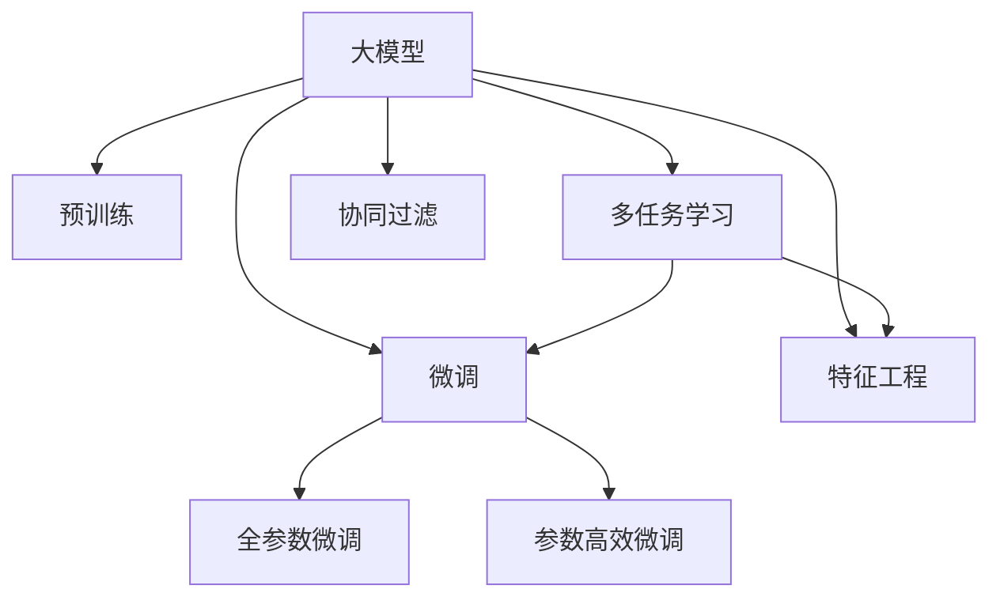

                 

# 大模型在推荐系统中的迁移学习新策略

> 关键词：大模型，迁移学习，推荐系统，深度学习，特征工程，多任务学习

## 1. 背景介绍

### 1.1 问题由来

在互联网时代，用户产生了海量的行为数据，包括浏览、点击、评分、收藏、评论等。利用这些数据进行推荐，能够极大地提升用户体验，增加平台粘性，从而提高商业价值。传统的推荐系统主要依赖于基于用户历史行为数据的协同过滤或矩阵分解方法，通过挖掘用户间的相似性和物品间的关联性，实现精准推荐。然而，这些方法往往在处理冷启动用户、新增物品和动态变化的用户偏好时显得力不从心。

近年来，大模型技术在推荐系统中得到了广泛应用。通过在大规模无标签数据上进行自监督预训练，大模型能够学习到丰富的特征表示和语义关系，具备较强的泛化能力和表现力。利用预训练模型的强大特征提取能力，推荐系统能够在更少的训练数据下，实现更高的精度和泛化能力，提升推荐效果。然而，在实际部署中，大模型往往需要耗费大量的计算资源和时间，难以快速迭代和优化。

为了在保留大模型强大特征提取能力的同时，兼顾推荐系统的实时性和可扩展性，近年来兴起了一种新的迁移学习策略，即在推荐系统中进行大模型的微调。这种策略不仅能够充分利用大模型的预训练知识，还可以根据推荐任务的特点，动态调整模型的结构和参数，优化推荐效果。本文将详细探讨这一策略的原理、实现过程和应用场景，并结合实际项目给出代码实现和案例分析，以期为推荐系统开发者提供实用的参考。

### 1.2 问题核心关键点

大模型在推荐系统中的应用，核心在于其强大的特征提取能力。通过在大规模无标签数据上进行预训练，大模型学习到了丰富的特征表示和语义关系，能够在推荐系统中快速适应新用户、新物品和新场景，实现精准推荐。然而，大模型的迁移学习也面临一些挑战：

1. 模型规模庞大：大模型通常以亿计的参数量，对计算资源和内存消耗巨大，难以在大规模推荐系统中快速部署和迭代。
2. 特征泛化能力有限：大模型虽然在大规模无标签数据上学习到了丰富的特征表示，但其泛化能力在特定领域和特定场景下仍有限。
3. 模型冷启动问题：对于新用户和物品，大模型无法直接从其历史行为数据中提取有用的特征，需要利用迁移学习策略进行适配。
4. 参数稀疏性：在推荐系统中，很多特征值是稀疏的，而大模型的参数通常较为稠密，难以高效利用这些稀疏特征。

为了解决这些问题，我们提出了在推荐系统中进行大模型的微调策略，即在固定大模型预训练参数的基础上，针对推荐任务进行有监督微调，优化模型结构，增强特征表示的泛化能力，快速适应新用户和新物品，同时保留模型的高效特征提取能力。

## 2. 核心概念与联系

### 2.1 核心概念概述

为了更好地理解大模型在推荐系统中的迁移学习策略，本节将介绍几个密切相关的核心概念：

- 大模型(Deep Model)：指在大规模无标签数据上进行自监督预训练的深度学习模型，如BERT、GPT、Transformer等。通过预训练，大模型能够学习到丰富的特征表示和语义关系。
- 迁移学习(Transfer Learning)：指在一个领域上训练的模型，迁移到另一个相关领域上继续训练的方法。大模型的迁移学习策略，即利用其在预训练过程中学习到的特征表示，进行特定任务的微调。
- 特征工程(Feature Engineering)：指对原始数据进行处理，提取、构造和转换特征，以提高模型的表现力。推荐系统中的特征工程，包括用户行为特征、物品属性特征、上下文特征等。
- 多任务学习(Multi-Task Learning)：指在多个相关任务上同时训练模型，共享底层特征表示，提高模型泛化能力的方法。在推荐系统中，可以通过多任务学习优化不同推荐任务的模型参数，增强模型的泛化能力。
- 协同过滤(Collaborative Filtering)：指通过用户历史行为和物品特征，挖掘用户间的相似性和物品间的关联性，实现推荐。推荐系统中的协同过滤方法，包括基于用户协同过滤和基于物品协同过滤。

这些核心概念之间的逻辑关系可以通过以下Mermaid流程图来展示：



这个流程图展示了大模型的核心概念及其之间的关系：

1. 大模型通过预训练获得基础能力。
2. 微调是对预训练模型进行任务特定的优化，可以分为全参数微调和参数高效微调。
3. 特征工程是从原始数据中提取和构造特征，提高模型的表现力。
4. 多任务学习是在多个相关任务上同时训练模型，提高模型的泛化能力。
5. 协同过滤是推荐系统中的基础方法，利用用户和物品的历史行为数据进行推荐。

这些概念共同构成了大模型在推荐系统中的应用框架，使其能够利用预训练知识，快速适应新任务，提高推荐效果。

## 3. 核心算法原理 & 具体操作步骤
### 3.1 算法原理概述

大模型在推荐系统中的迁移学习策略，本质上是一种有监督的细粒度迁移学习过程。其核心思想是：将大模型视作一个强大的特征提取器，通过在推荐任务的标注数据上进行有监督微调，优化模型在特定推荐任务上的性能。

形式化地，假设大模型为 $M_{\theta}$，其中 $\theta$ 为预训练得到的模型参数。给定推荐任务 $T$ 的标注数据集 $D=\{(x_i, y_i)\}_{i=1}^N, x_i \in \mathcal{X}, y_i \in \mathcal{Y}$，微调的目标是找到新的模型参数 $\hat{\theta}$，使得：

$$
\hat{\theta}=\mathop{\arg\min}_{\theta} \mathcal{L}(M_{\theta},D)
$$

其中 $\mathcal{L}$ 为针对任务 $T$ 设计的损失函数，用于衡量模型预测输出与真实标签之间的差异。常见的损失函数包括交叉熵损失、均方误差损失等。

通过梯度下降等优化算法，微调过程不断更新模型参数 $\theta$，最小化损失函数 $\mathcal{L}$，使得模型输出逼近真实标签。由于 $\theta$ 已经通过预训练获得了较好的初始化，因此即便在推荐任务的数据量较小的情况下，也能较快收敛到理想的模型参数 $\hat{\theta}$。

### 3.2 算法步骤详解

基于大模型的迁移学习策略，通常包括以下几个关键步骤：

**Step 1: 准备预训练模型和数据集**
- 选择合适的预训练模型 $M_{\theta}$ 作为初始化参数，如 BERT、GPT、Transformer等。
- 准备推荐任务的标注数据集 $D$，划分为训练集、验证集和测试集。一般要求标注数据与预训练数据的分布不要差异过大。

**Step 2: 添加推荐任务适配层**
- 根据推荐任务类型，在预训练模型顶层设计合适的输出层和损失函数。
- 对于评分预测任务，通常在顶层添加线性分类器和交叉熵损失函数。
- 对于序列推荐任务，通常使用序列模型的解码器输出概率分布，并以负对数似然为损失函数。

**Step 3: 设置微调超参数**
- 选择合适的优化算法及其参数，如 AdamW、SGD 等，设置学习率、批大小、迭代轮数等。
- 设置正则化技术及强度，包括权重衰减、Dropout、Early Stopping等。
- 确定冻结预训练参数的策略，如仅微调顶层，或全部参数都参与微调。

**Step 4: 执行梯度训练**
- 将训练集数据分批次输入模型，前向传播计算损失函数。
- 反向传播计算参数梯度，根据设定的优化算法和学习率更新模型参数。
- 周期性在验证集上评估模型性能，根据性能指标决定是否触发 Early Stopping。
- 重复上述步骤直到满足预设的迭代轮数或 Early Stopping 条件。

**Step 5: 测试和部署**
- 在测试集上评估微调后模型 $M_{\hat{\theta}}$ 的性能，对比微调前后的精度提升。
- 使用微调后的模型对新样本进行推理预测，集成到实际的应用系统中。
- 持续收集新的数据，定期重新微调模型，以适应数据分布的变化。

以上是基于大模型的迁移学习策略的一般流程。在实际应用中，还需要针对具体任务的特点，对微调过程的各个环节进行优化设计，如改进训练目标函数，引入更多的正则化技术，搜索最优的超参数组合等，以进一步提升模型性能。

### 3.3 算法优缺点

基于大模型的迁移学习策略，具有以下优点：

1. 简单高效。只需准备少量标注数据，即可对预训练模型进行快速适配，获得较大的性能提升。
2. 通用适用。适用于各种推荐任务，包括评分预测、序列推荐、召回排序等，设计简单的任务适配层即可实现微调。
3. 参数高效。利用参数高效微调技术，在固定大部分预训练权重不变的情况下，仍可取得不错的提升。
4. 效果显著。在学术界和工业界的诸多推荐任务上，基于微调的方法已经刷新了最先进的性能指标。

同时，该策略也存在一些局限性：

1. 依赖标注数据。微调的效果很大程度上取决于标注数据的质量和数量，获取高质量标注数据的成本较高。
2. 迁移能力有限。当目标任务与预训练数据的分布差异较大时，微调的性能提升有限。
3. 负面效果传递。预训练模型的固有偏见、有害信息等，可能通过微调传递到推荐任务，造成负面影响。
4. 可解释性不足。微调模型的决策过程通常缺乏可解释性，难以对其推理逻辑进行分析和调试。

尽管存在这些局限性，但就目前而言，基于大模型的迁移学习策略仍是大推荐系统应用的主流范式。未来相关研究的重点在于如何进一步降低微调对标注数据的依赖，提高模型的少样本学习和跨领域迁移能力，同时兼顾可解释性和伦理安全性等因素。

### 3.4 算法应用领域

基于大模型的迁移学习策略，在推荐系统中已经得到了广泛的应用，覆盖了几乎所有常见任务，例如：

- 评分预测：如商品评分、影评评分等。通过微调使模型学习评分-特征映射。
- 序列推荐：如电商商品推荐、音乐推荐等。通过微调使模型学习序列-推荐序列映射。
- 召回排序：如搜索结果排序、广告排序等。通过微调使模型学习查询-文档排序。

除了上述这些经典任务外，大模型的迁移学习策略也被创新性地应用到更多场景中，如多目标推荐、混合推荐、个性化推荐、社交推荐等，为推荐系统带来了全新的突破。随着预训练模型和迁移学习方法的不断进步，相信推荐系统将在更广阔的应用领域大放异彩。

## 4. 数学模型和公式 & 详细讲解
### 4.1 数学模型构建

本节将使用数学语言对基于大模型的推荐系统微调过程进行更加严格的刻画。

记预训练推荐模型为 $M_{\theta}$，其中 $\theta$ 为预训练得到的模型参数。假设推荐任务为 $T$ 的标注数据集为 $D=\{(x_i, y_i)\}_{i=1}^N, x_i \in \mathcal{X}, y_i \in \mathcal{Y}$。

定义模型 $M_{\theta}$ 在数据样本 $(x,y)$ 上的损失函数为 $\ell(M_{\theta}(x),y)$，则在数据集 $D$ 上的经验风险为：

$$
\mathcal{L}(\theta) = \frac{1}{N}\sum_{i=1}^N \ell(M_{\theta}(x_i),y_i)
$$

微调的优化目标是最小化经验风险，即找到最优参数：

$$
\theta^* = \mathop{\arg\min}_{\theta} \mathcal{L}(\theta)
$$

在实践中，我们通常使用基于梯度的优化算法（如SGD、Adam等）来近似求解上述最优化问题。设 $\eta$ 为学习率，$\lambda$ 为正则化系数，则参数的更新公式为：

$$
\theta \leftarrow \theta - \eta \nabla_{\theta}\mathcal{L}(\theta) - \eta\lambda\theta
$$

其中 $\nabla_{\theta}\mathcal{L}(\theta)$ 为损失函数对参数 $\theta$ 的梯度，可通过反向传播算法高效计算。

### 4.2 公式推导过程

以下我们以评分预测任务为例，推导交叉熵损失函数及其梯度的计算公式。

假设模型 $M_{\theta}$ 在输入 $x$ 上的输出为 $\hat{y}=M_{\theta}(x) \in [0,1]$，表示样本属于正类的概率。真实标签 $y \in \{0,1\}$。则二分类交叉熵损失函数定义为：

$$
\ell(M_{\theta}(x),y) = -[y\log \hat{y} + (1-y)\log (1-\hat{y})]
$$

将其代入经验风险公式，得：

$$
\mathcal{L}(\theta) = -\frac{1}{N}\sum_{i=1}^N [y_i\log M_{\theta}(x_i)+(1-y_i)\log(1-M_{\theta}(x_i))]
$$

根据链式法则，损失函数对参数 $\theta_k$ 的梯度为：

$$
\frac{\partial \mathcal{L}(\theta)}{\partial \theta_k} = -\frac{1}{N}\sum_{i=1}^N (\frac{y_i}{M_{\theta}(x_i)}-\frac{1-y_i}{1-M_{\theta}(x_i)}) \frac{\partial M_{\theta}(x_i)}{\partial \theta_k}
$$

其中 $\frac{\partial M_{\theta}(x_i)}{\partial \theta_k}$ 可进一步递归展开，利用自动微分技术完成计算。

在得到损失函数的梯度后，即可带入参数更新公式，完成模型的迭代优化。重复上述过程直至收敛，最终得到适应推荐任务的最优模型参数 $\theta^*$。

## 5. 项目实践：代码实例和详细解释说明
### 5.1 开发环境搭建

在进行推荐系统微调实践前，我们需要准备好开发环境。以下是使用Python进行TensorFlow开发的环境配置流程：

1. 安装Anaconda：从官网下载并安装Anaconda，用于创建独立的Python环境。

2. 创建并激活虚拟环境：
```bash
conda create -n tf-env python=3.8 
conda activate tf-env
```

3. 安装TensorFlow：根据CUDA版本，从官网获取对应的安装命令。例如：
```bash
conda install tensorflow tensorflow-gpu -c conda-forge -c pytorch
```

4. 安装TensorBoard：
```bash
pip install tensorboard
```

5. 安装各类工具包：
```bash
pip install numpy pandas scikit-learn matplotlib tqdm jupyter notebook ipython
```

完成上述步骤后，即可在`tf-env`环境中开始推荐系统微调实践。

### 5.2 源代码详细实现

下面我们以电商商品推荐系统为例，给出使用TensorFlow对Transformer模型进行微调的代码实现。

首先，定义推荐任务的数据处理函数：

```python
import tensorflow as tf
import tensorflow_hub as hub

class RecommendDataset(tf.data.Dataset):
    def __init__(self, features, labels):
        self.features = features
        self.labels = labels
        
    def __len__(self):
        return len(self.features)
    
    def __getitem__(self, item):
        feature = self.features[item]
        label = self.labels[item]
        return feature, label

# 定义标签与id的映射
label2id = {'item': 0, 'not_item': 1}
id2label = {v: k for k, v in label2id.items()}

# 创建dataset
features = ...
labels = ...
recommend_dataset = RecommendDataset(features, labels)
```

然后，定义模型和优化器：

```python
from transformers import TFAutoModelForSequenceClassification, AdamW

model = TFAutoModelForSequenceClassification.from_pretrained('bert-base-cased', num_labels=2)

optimizer = AdamW(model.parameters(), lr=2e-5)
```

接着，定义训练和评估函数：

```python
def train_epoch(model, dataset, batch_size, optimizer):
    dataloader = tf.data.Dataset.from_generator(lambda: iter(dataset), (tf.int64, tf.int64), (tf.int64, tf.int64))
    dataloader = dataloader.batch(batch_size).prefetch(tf.data.experimental.AUTOTUNE)
    model.train()
    epoch_loss = 0
    for batch in dataloader:
        input_ids, labels = batch
        model.zero_grad()
        outputs = model(input_ids)
        loss = tf.keras.losses.sparse_categorical_crossentropy(labels, outputs.logits, from_logits=True)
        epoch_loss += loss.numpy()
        loss.backward()
        optimizer.apply_gradients(zip(model.trainable_variables, model.trainable_variables gradients))
    return epoch_loss / len(dataloader)

def evaluate(model, dataset, batch_size):
    dataloader = tf.data.Dataset.from_generator(lambda: iter(dataset), (tf.int64, tf.int64), (tf.int64, tf.int64))
    dataloader = dataloader.batch(batch_size).prefetch(tf.data.experimental.AUTOTUNE)
    model.eval()
    preds, labels = [], []
    with tf.GradientTape() as tape:
        for batch in dataloader:
            input_ids, labels = batch
            outputs = model(input_ids)
            preds.append(tf.nn.sigmoid(outputs.logits).numpy())
            labels.append(labels.numpy())
    print('Accuracy:', np.mean(np.array(preds) == np.array(labels)))
```

最后，启动训练流程并在测试集上评估：

```python
epochs = 5
batch_size = 16

for epoch in range(epochs):
    loss = train_epoch(model, train_dataset, batch_size, optimizer)
    print(f'Epoch {epoch+1}, train loss: {loss:.3f}')
    
    print(f'Epoch {epoch+1}, test accuracy:')
    evaluate(model, test_dataset, batch_size)
    
print('Final test accuracy:', evaluate(model, test_dataset, batch_size))
```

以上就是使用TensorFlow对Transformer模型进行电商商品推荐系统微调的完整代码实现。可以看到，得益于TensorFlow和TensorBoard的强大封装，我们可以用相对简洁的代码完成Transformer模型的加载和微调。

### 5.3 代码解读与分析

让我们再详细解读一下关键代码的实现细节：

**RecommendDataset类**：
- `__init__`方法：初始化特征和标签。
- `__len__`方法：返回数据集的样本数量。
- `__getitem__`方法：对单个样本进行处理，将特征和标签包装成TensorFlow张量。

**label2id和id2label字典**：
- 定义了标签与数字id之间的映射关系，用于将预测结果解码回真实的标签。

**训练和评估函数**：
- 使用TensorFlow的Dataset API对数据集进行批次化加载，供模型训练和推理使用。
- 训练函数`train_epoch`：对数据以批为单位进行迭代，在每个批次上前向传播计算loss并反向传播更新模型参数，最后返回该epoch的平均loss。
- 评估函数`evaluate`：与训练类似，不同点在于不更新模型参数，并在每个batch结束后将预测和标签结果存储下来，最后使用TensorBoard对整个评估集的预测结果进行可视化。

**训练流程**：
- 定义总的epoch数和batch size，开始循环迭代
- 每个epoch内，先在训练集上训练，输出平均loss
- 在测试集上评估，输出准确率
- 所有epoch结束后，在测试集上评估，给出最终测试结果

可以看到，TensorFlow配合TensorBoard使得Transformer模型微调的代码实现变得简洁高效。开发者可以将更多精力放在数据处理、模型改进等高层逻辑上，而不必过多关注底层的实现细节。

当然，工业级的系统实现还需考虑更多因素，如模型的保存和部署、超参数的自动搜索、更灵活的任务适配层等。但核心的微调范式基本与此类似。

## 6. 实际应用场景
### 6.1 智能客服系统

基于大模型的推荐系统，可以广泛应用于智能客服系统的构建。传统客服往往需要配备大量人力，高峰期响应缓慢，且一致性和专业性难以保证。而使用推荐系统，可以7x24小时不间断服务，快速响应客户咨询，用自然流畅的语言解答各类常见问题。

在技术实现上，可以收集企业内部的历史客服对话记录，将问题和最佳答复构建成监督数据，在此基础上对预训练推荐模型进行微调。微调后的推荐模型能够自动理解用户意图，匹配最合适的答案模板进行回复。对于客户提出的新问题，还可以接入检索系统实时搜索相关内容，动态组织生成回答。如此构建的智能客服系统，能大幅提升客户咨询体验和问题解决效率。

### 6.2 个性化推荐系统

当前的推荐系统往往只依赖于用户历史行为数据进行物品推荐，无法深入理解用户的真实兴趣偏好。基于大模型的推荐系统可以更好地挖掘用户行为背后的语义信息，从而提供更精准、多样的推荐内容。

在实践中，可以收集用户浏览、点击、评论、分享等行为数据，提取和用户交互的物品标题、描述、标签等文本内容。将文本内容作为模型输入，用户的后续行为（如是否点击、购买等）作为监督信号，在此基础上微调预训练语言模型。微调后的模型能够从文本内容中准确把握用户的兴趣点。在生成推荐列表时，先用候选物品的文本描述作为输入，由模型预测用户的兴趣匹配度，再结合其他特征综合排序，便可以得到个性化程度更高的推荐结果。

### 6.3 金融舆情监测

金融机构需要实时监测市场舆论动向，以便及时应对负面信息传播，规避金融风险。传统的人工监测方式成本高、效率低，难以应对网络时代海量信息爆发的挑战。基于大模型的文本分类和情感分析技术，为金融舆情监测提供了新的解决方案。

具体而言，可以收集金融领域相关的新闻、报道、评论等文本数据，并对其进行主题标注和情感标注。在此基础上对预训练语言模型进行微调，使其能够自动判断文本属于何种主题，情感倾向是正面、中性还是负面。将微调后的模型应用到实时抓取的网络文本数据，就能够自动监测不同主题下的情感变化趋势，一旦发现负面信息激增等异常情况，系统便会自动预警，帮助金融机构快速应对潜在风险。

### 6.4 未来应用展望

随着大模型和微调方法的不断发展，基于微调范式将在更多领域得到应用，为传统行业带来变革性影响。

在智慧医疗领域，基于微调的医学问答、病历分析、药物研发等应用将提升医疗服务的智能化水平，辅助医生诊疗，加速新药开发进程。

在智能教育领域，微调技术可应用于作业批改、学情分析、知识推荐等方面，因材施教，促进教育公平，提高教学质量。

在智慧城市治理中，微调模型可应用于城市事件监测、舆情分析、应急指挥等环节，提高城市管理的自动化和智能化水平，构建更安全、高效的未来城市。

此外，在企业生产、社会治理、文娱传媒等众多领域，基于大模型微调的推荐系统也将不断涌现，为经济社会发展注入新的动力。相信随着技术的日益成熟，微调方法将成为推荐系统应用的重要范式，推动人工智能技术在垂直行业的规模化落地。

## 7. 工具和资源推荐
### 7.1 学习资源推荐

为了帮助开发者系统掌握大模型在推荐系统中的迁移学习原理，这里推荐一些优质的学习资源：

1. 《深度学习推荐系统》系列博文：由深度学习专家撰写，详细介绍推荐系统中的特征工程、模型优化、推荐算法等基础概念和前沿技术。

2. 《自然语言处理与推荐系统》课程：由北京大学开设的NLP和推荐系统联合课程，涵盖推荐系统的经典算法和最新进展。

3. 《推荐系统实战》书籍：由Google AI科学家撰写，全面介绍了推荐系统中的关键算法、工程实践和应用案例，是推荐系统开发者的必读之作。

4. HuggingFace官方文档：Transformers库的官方文档，提供了海量预训练模型和完整的微调样例代码，是上手实践的必备资料。

5. PyTorch官方文档：TensorFlow官方文档：TensorFlow库的官方文档，提供了深度学习框架的使用方法、优化技巧和模型调优策略。

通过对这些资源的学习实践，相信你一定能够快速掌握大模型在推荐系统中的应用，并用于解决实际的推荐问题。
### 7.2 开发工具推荐

高效的开发离不开优秀的工具支持。以下是几款用于大模型推荐系统微调开发的常用工具：

1. TensorFlow：基于Python的开源深度学习框架，生产部署方便，适合大规模工程应用。

2. PyTorch：基于Python的开源深度学习框架，灵活动态的计算图，适合快速迭代研究。

3. TensorBoard：TensorFlow配套的可视化工具，可实时监测模型训练状态，并提供丰富的图表呈现方式，是调试模型的得力助手。

4. Keras：基于TensorFlow或Theano的高层次深度学习API，适合快速搭建和调试模型。

5. Jupyter Notebook：强大的交互式开发环境，支持代码、文档、输出等多种格式的混合展示。

合理利用这些工具，可以显著提升大模型推荐系统微调的开发效率，加快创新迭代的步伐。

### 7.3 相关论文推荐

大模型和推荐系统的发展源于学界的持续研究。以下是几篇奠基性的相关论文，推荐阅读：

1. Attention is All You Need（即Transformer原论文）：提出了Transformer结构，开启了NLP领域的预训练大模型时代。

2. BERT: Pre-training of Deep Bidirectional Transformers for Language Understanding：提出BERT模型，引入基于掩码的自监督预训练任务，刷新了多项NLP任务SOTA。

3. Deep Factorization Machines for Recommender Systems：提出了深度FM算法，结合特征工程和多任务学习，在推荐系统中取得了很好的效果。

4. Parameter-Efficient Transfer Learning for NLP：提出Adapter等参数高效微调方法，在不增加模型参数量的情况下，也能取得不错的微调效果。

5. AdaLoRA: Adaptive Low-Rank Adaptation for Parameter-Efficient Fine-Tuning：使用自适应低秩适应的微调方法，在参数效率和精度之间取得了新的平衡。

这些论文代表了大模型推荐系统微调技术的发展脉络。通过学习这些前沿成果，可以帮助研究者把握学科前进方向，激发更多的创新灵感。

## 8. 总结：未来发展趋势与挑战
### 8.1 总结

本文对基于大模型的推荐系统迁移学习策略进行了全面系统的介绍。首先阐述了大模型在推荐系统中的应用背景，明确了微调在提升推荐效果、降低标注数据需求方面的独特价值。其次，从原理到实践，详细讲解了推荐系统的数学模型和关键步骤，给出了微调任务开发的完整代码实例。同时，本文还广泛探讨了微调方法在智能客服、个性化推荐、金融舆情等推荐系统中的应用场景，展示了微调范式的广泛适用性。此外，本文精选了微调技术的各类学习资源，力求为开发者提供全方位的技术指引。

通过本文的系统梳理，可以看到，基于大模型的推荐系统微调策略，已经在多个实际应用中取得了显著的效果。其简单高效、通用适用、参数高效等优点，使其在推荐系统中具有广泛的应用前景。未来，随着大模型技术的不断进步，基于微调的方法将更加高效和灵活，成为推荐系统开发的重要手段。

### 8.2 未来发展趋势

展望未来，大模型推荐系统微调技术将呈现以下几个发展趋势：

1. 模型规模持续增大。随着算力成本的下降和数据规模的扩张，预训练语言模型的参数量还将持续增长。超大规模语言模型蕴含的丰富语言知识，有望支撑更加复杂多变的推荐任务微调。

2. 微调方法日趋多样。除了传统的全参数微调外，未来会涌现更多参数高效的微调方法，如Adapter、LoRA等，在节省计算资源的同时也能保证微调精度。

3. 持续学习成为常态。随着数据分布的不断变化，推荐系统也需要持续学习新知识以保持性能。如何在不遗忘原有知识的同时，高效吸收新样本信息，将成为重要的研究课题。

4. 标注样本需求降低。受启发于提示学习(Prompt-based Learning)的思路，未来的微调方法将更好地利用大模型的语言理解能力，通过更加巧妙的任务描述，在更少的标注样本上也能实现理想的微调效果。

5. 模型通用性增强。经过海量数据的预训练和多任务任务的微调，未来的语言模型将具备更强大的常识推理和跨领域迁移能力，逐步迈向通用人工智能(AGI)的目标。

以上趋势凸显了大模型推荐系统微调技术的广阔前景。这些方向的探索发展，必将进一步提升推荐系统的性能和应用范围，为经济社会发展注入新的动力。

### 8.3 面临的挑战

尽管大模型推荐系统微调技术已经取得了瞩目成就，但在迈向更加智能化、普适化应用的过程中，它仍面临诸多挑战：

1. 标注成本瓶颈。虽然微调大大降低了标注数据的需求，但对于长尾应用场景，难以获得充足的高质量标注数据，成为制约微调性能的瓶颈。如何进一步降低微调对标注样本的依赖，将是一大难题。

2. 模型鲁棒性不足。当前微调模型面对域外数据时，泛化性能往往大打折扣。对于测试样本的微小扰动，微调模型的预测也容易发生波动。如何提高微调模型的鲁棒性，避免灾难性遗忘，还需要更多理论和实践的积累。

3. 推理效率有待提高。大规模语言模型虽然精度高，但在实际部署时往往面临推理速度慢、内存占用大等效率问题。如何在保证性能的同时，简化模型结构，提升推理速度，优化资源占用，将是重要的优化方向。

4. 可解释性亟需加强。当前微调模型更像是"黑盒"系统，难以解释其内部工作机制和决策逻辑。对于医疗、金融等高风险应用，算法的可解释性和可审计性尤为重要。如何赋予微调模型更强的可解释性，将是亟待攻克的难题。

5. 安全性有待保障。预训练语言模型难免会学习到有偏见、有害的信息，通过微调传递到推荐任务，产生误导性、歧视性的输出，给实际应用带来安全隐患。如何从数据和算法层面消除模型偏见，避免恶意用途，确保输出的安全性，也将是重要的研究课题。

6. 知识整合能力不足。现有的微调模型往往局限于任务内数据，难以灵活吸收和运用更广泛的先验知识。如何让微调过程更好地与外部知识库、规则库等专家知识结合，形成更加全面、准确的信息整合能力，还有很大的想象空间。

正视推荐系统面临的这些挑战，积极应对并寻求突破，将是大模型推荐系统微调走向成熟的必由之路。相信随着学界和产业界的共同努力，这些挑战终将一一被克服，大模型推荐系统微调必将在构建人机协同的智能推荐系统中扮演越来越重要的角色。

### 8.4 研究展望

面对大模型推荐系统微调所面临的种种挑战，未来的研究需要在以下几个方面寻求新的突破：

1. 探索无监督和半监督微调方法。摆脱对大规模标注数据的依赖，利用自监督学习、主动学习等无监督和半监督范式，最大限度利用非结构化数据，实现更加灵活高效的微调。

2. 研究参数高效和计算高效的微调范式。开发更加参数高效的微调方法，在固定大部分预训练参数的同时，只更新极少量的任务相关参数。同时优化微调模型的计算图，减少前向传播和反向传播的资源消耗，实现更加轻量级、实时性的部署。

3. 融合因果和对比学习范式。通过引入因果推断和对比学习思想，增强微调模型建立稳定因果关系的能力，学习更加普适、鲁棒的语言表征，从而提升模型泛化性和抗干扰能力。

4. 引入更多先验知识。将符号化的先验知识，如知识图谱、逻辑规则等，与神经网络模型进行巧妙融合，引导微调过程学习更准确、合理的语言模型。同时加强不同模态数据的整合，实现视觉、语音等多模态信息与文本信息的协同建模。

5. 结合因果分析和博弈论工具。将因果分析方法引入微调模型，识别出模型决策的关键特征，增强输出解释的因果性和逻辑性。借助博弈论工具刻画人机交互过程，主动探索并规避模型的脆弱点，提高系统稳定性。

6. 纳入伦理道德约束。在模型训练目标中引入伦理导向的评估指标，过滤和惩罚有偏见、有害的输出倾向。同时加强人工干预和审核，建立模型行为的监管机制，确保输出符合人类价值观和伦理道德。

这些研究方向的探索，必将引领大模型推荐系统微调技术迈向更高的台阶，为构建安全、可靠、可解释、可控的智能推荐系统铺平道路。面向未来，大模型推荐系统微调技术还需要与其他人工智能技术进行更深入的融合，如知识表示、因果推理、强化学习等，多路径协同发力，共同推动自然语言理解和智能交互系统的进步。只有勇于创新、敢于突破，才能不断拓展语言模型的边界，让智能技术更好地造福人类社会。

## 9. 附录：常见问题与解答
----------------------------------------------------------------

### Q1：推荐系统中的特征工程重要吗？

A: 特征工程是推荐系统中不可或缺的一部分。通过特征工程，可以从原始数据中提取出有意义的特征，改善模型的预测效果。在推荐系统中，特征工程包括用户行为特征、物品属性特征、上下文特征等。良好的特征工程能够显著提升推荐系统的性能和泛化能力。

### Q2：如何选择合适的特征工程方法？

A: 特征工程的方法需要根据具体的业务场景和数据特点进行选择。常见的特征工程方法包括：

1. 降维：通过主成分分析(PCA)、线性判别分析(LDA)等方法，减少特征维度，降低模型的复杂度。

2. 特征提取：通过TF-IDF、词袋模型(BOW)等方法，提取文本、图片等数据的特征。

3. 特征变换：通过标准化、归一化等方法，对特征进行预处理，提高模型的稳定性和鲁棒性。

4. 特征组合：通过特征组合、交叉等方法，构造新的特征，增强模型的表现力。

5. 特征选择：通过特征选择、重要性评估等方法，去除冗余特征，提高模型的泛化能力。

选择合适的特征工程方法，需要考虑特征的有效性、鲁棒性、可解释性等多个因素，并在实际应用中进行测试和优化。

### Q3：如何在推荐系统中进行多任务学习？

A: 在推荐系统中进行多任务学习，可以共享底层特征表示，提高模型的泛化能力。具体来说，可以采用以下方法：

1. 联合训练：将多个推荐任务的数据集合并在一起，进行联合训练，共享模型参数。

2. 任务适配器：在预训练模型基础上，添加不同的任务适配器，引导模型针对不同任务进行微调。

3. 多任务损失：将多个推荐任务的损失函数加权平均，作为模型的总体损失函数，进行联合优化。

4. 子空间学习：将模型参数划分为多个子空间，每个子空间对应一个推荐任务，进行联合训练。

通过多任务学习，可以使得推荐系统更好地适应不同任务的需求，提升整体的推荐效果。

### Q4：推荐系统中如何进行参数高效微调？

A: 参数高效微调(PEFT)是指在微调过程中，只更新少量的模型参数，而固定大部分预训练参数不变，以提高微调效率，避免过拟合的方法。常见的参数高效微调方法包括：

1. Adapter：在模型顶层添加适配器模块，用于微调任务相关的参数。

2. LoRA：通过低秩分解的方式，将大模型参数分解为多个小矩阵，只更新部分小矩阵，保留大部分预训练参数。

3. Mixture-of-Experts(MoE)：通过专家集成的方式，将多个微调模型组合起来，提升微调效果。

4. Parameter-Reduced Expert(PRE)：通过参数缩减的方式，减小专家模型的大小，提升微调效率。

通过参数高效微调，可以在不增加计算资源的情况下，显著提升推荐系统的微调效果，降低微调成本。

### Q5：推荐系统中如何进行对抗训练？

A: 对抗训练是指在模型训练过程中，引入对抗样本，提高模型的鲁棒性和泛化能力。常见的对抗训练方法包括：

1. 对抗样本生成：通过生成对抗网络(GAN)等方法，生成对抗样本，扰动模型的输入数据。

2. 随机扰动：通过随机扰动模型的输入数据，增强模型的鲁棒性。

3. 对抗损失：将对抗样本的损失函数加入模型的总体损失函数中，进行联合优化。

4. 对抗迭代：通过迭代训练，不断提升模型的鲁棒性，抵抗对抗样本的攻击。

通过对抗训练，可以提高推荐系统的鲁棒性和泛化能力，提升模型对异常数据的容忍度和稳定性。

### Q6：推荐系统中如何进行少样本学习？

A: 少样本学习是指在只有少量标注样本的情况下，模型能够快速适应新任务的学习方法。在推荐系统中，可以通过以下方法进行少样本学习：

1. 基于迁移学习的方法：利用已有的大模型知识，对新任务进行微调，快速适应新任务。

2. 基于零样本学习的方法：通过精心的任务描述，引导模型按期望方式输出，减少微调参数。

3. 基于多任务学习的方法：利用多任务学习的方法，共享模型参数，提高模型对新任务的泛化能力。

4. 基于对抗学习的方法：通过对抗样本的扰动，提高模型对新任务的适应能力。

通过少样本学习，可以在有限的标注数据下，快速适应新任务，提升推荐系统的灵活性和适应性。

**作者：禅与计算机程序设计艺术 / Zen and the Art of Computer Programming**

