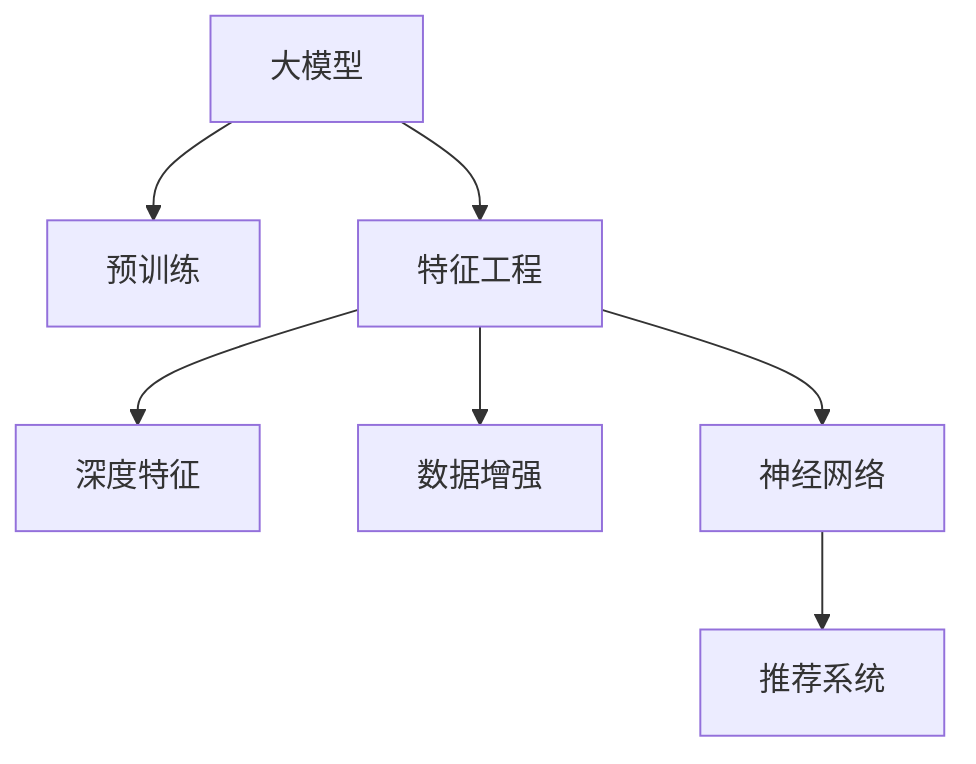

                 

# 大模型在推荐系统特征工程中的应用

> 关键词：大模型,特征工程,推荐系统,深度学习,深度特征,数据增强,特征提取,神经网络

## 1. 背景介绍

### 1.1 问题由来
推荐系统是互联网公司最重要的业务之一，旨在提升用户对内容的满意度，实现商业价值最大化。传统推荐系统主要基于协同过滤、矩阵分解等算法，以用户历史行为数据为基础，推荐相似物品。但随着数据量的急剧增长，这些算法面临着模型泛化性不足、推荐精度差等挑战。为此，研究者提出了一系列的深度学习方法，利用深度神经网络构建推荐模型，并逐渐在推荐系统中得到广泛应用。

### 1.2 问题核心关键点
深度学习推荐系统的关键在于构建有效的特征表示，而大模型（如BERT、GPT等）凭借其丰富的语言和知识表示能力，成为构建深度推荐特征的重要工具。在推荐系统中，大模型可以应用于用户画像、物品属性提取、文本特征生成等方面，显著提升推荐效果。

### 1.3 问题研究意义
深度学习推荐系统将大模型引入推荐特征工程，通过学习用户行为和物品特征之间的关联性，生成更丰富的深度特征，提升推荐系统的效果和性能。该方法有助于克服传统推荐算法的诸多局限，更好地理解和建模用户行为，提升个性化推荐体验，为商业决策提供科学依据。

## 2. 核心概念与联系

### 2.1 核心概念概述

为更好地理解大模型在推荐系统特征工程中的应用，本节将介绍几个密切相关的核心概念：

- 深度学习推荐系统(Deep Learning Recommendation System, DLRS)：利用深度神经网络构建的推荐系统，通过学习用户行为和物品特征之间的关联性，生成更丰富的深度特征，提升推荐效果。

- 大模型(Large Model)：如BERT、GPT等大规模预训练语言模型，通过在大规模无标签文本语料上进行预训练，学习通用的语言表示，具备强大的语言理解和生成能力。

- 特征工程(Feature Engineering)：从原始数据中提取和构建更具有表达能力、更有区分度的特征，提升模型的预测能力。

- 深度特征(Deep Feature)：利用深度学习模型自动提取的高层次、复杂抽象的特征表示，通常比传统特征工程提取的浅层特征更具表达能力。

- 数据增强(Data Augmentation)：通过对原始数据进行一定的变换或扩充，提升模型对数据的泛化能力。

- 神经网络(Neural Network)：由大量神经元（节点）和多层连接（边）构成的复杂计算图，用于对输入数据进行高层次抽象和处理。

这些核心概念之间的逻辑关系可以通过以下Mermaid流程图来展示：



这个流程图展示了大模型在推荐系统特征工程中的核心概念及其之间的关系：

1. 大模型通过预训练获得基础能力。
2. 特征工程通过提取和构建深度特征，提升模型的表达能力。
3. 深度特征利用神经网络进行自动提取和处理。
4. 神经网络被应用于推荐系统，生成推荐结果。

这些概念共同构成了大模型在推荐系统特征工程中的应用框架，使得深度推荐系统能够高效地生成高层次、复杂抽象的特征，提升推荐效果。

## 3. 核心算法原理 & 具体操作步骤
### 3.1 算法原理概述

大模型在推荐系统特征工程中的应用，本质上是一个深度学习的特征提取和处理过程。其核心思想是：利用大模型学习用户行为和物品特征之间的关联性，自动生成高层次的深度特征，并将其作为推荐系统的输入，提升推荐精度和效果。

具体来说，基于大模型的推荐系统一般包括以下几个关键步骤：

1. 用户行为编码：将用户的行为序列（如点击、浏览、收藏等）输入大模型，通过预训练语言模型学习用户行为特征。
2. 物品特征提取：将物品的描述、属性等输入大模型，学习物品的语言表示。
3. 特征融合：将用户行为特征和物品特征进行融合，形成更加全面的用户-物品关联特征。
4. 模型训练：利用融合后的特征和标签数据训练推荐模型。
5. 推荐生成：利用训练好的模型，对新的用户行为或物品特征进行推理，生成推荐结果。

### 3.2 算法步骤详解

基于大模型的推荐系统特征工程流程包括以下详细步骤：

**Step 1: 准备用户行为数据**
- 收集用户的历史行为数据，如浏览记录、点击行为、收藏记录等。
- 对行为数据进行预处理，包括去重、标准化、时间戳等操作。

**Step 2: 预训练用户行为编码模型**
- 选择合适的预训练模型（如BERT、GPT等），对用户行为序列进行编码。
- 将行为序列作为输入，训练模型，学习用户行为的语言表示。

**Step 3: 预训练物品特征提取模型**
- 选择合适的预训练模型（如BERT、GPT等），对物品的描述、属性等进行编码。
- 将物品特征作为输入，训练模型，学习物品的语言表示。

**Step 4: 特征融合**
- 将用户行为特征和物品特征进行拼接或拼接后编码，形成融合后的特征向量。
- 利用深度学习模型（如MLP、RNN等），将融合后的特征进行进一步处理和抽象，生成更高层次的深度特征。

**Step 5: 模型训练**
- 选择合适的推荐模型（如DNN、RNN等），将融合后的深度特征作为输入，训练推荐模型。
- 利用用户行为数据和物品标签数据进行训练，优化模型参数。

**Step 6: 推荐生成**
- 对于新的用户行为或物品特征，利用训练好的模型进行推理，生成推荐结果。
- 将推荐结果返回给用户，形成新的行为反馈，进一步优化模型。

### 3.3 算法优缺点

基于大模型的推荐系统特征工程具有以下优点：

1. 高层次特征表达：大模型通过预训练学习丰富的语言表示能力，可以生成更加高层次、复杂的深度特征，提升推荐效果。
2. 数据利用效率高：大模型可以利用原始文本数据直接生成推荐特征，无需大量手工特征工程，减少人工干预。
3. 泛化能力强：大模型能够学习到用户和物品之间的关联性，适应多种推荐场景，具有较强的泛化能力。
4. 灵活可扩展：大模型的架构设计灵活，可以方便地进行参数调整和模型扩展，满足不同推荐任务的需求。

同时，该方法也存在一定的局限性：

1. 数据需求大：大模型的预训练过程需要大量高质量的文本数据，可能导致数据需求较大，获取成本较高。
2. 模型复杂度高：大模型的结构复杂，需要较高的计算资源进行训练和推理，部署难度较大。
3. 过拟合风险：大模型的预训练过程容易过拟合，如果数据不平衡或数据质量不高，可能导致模型泛化性不足。
4. 上下文依赖：大模型的推荐效果依赖于上下文信息，可能无法很好地处理跨领域推荐问题。

尽管存在这些局限性，但大模型在推荐系统特征工程中的应用已经成为主流方向。未来相关研究的重点在于如何进一步降低数据需求，提高模型的泛化能力和推理效率，同时兼顾模型的可解释性和伦理安全性等因素。

### 3.4 算法应用领域

基于大模型的推荐系统特征工程，在电商、社交媒体、视频平台等多个领域得到了广泛应用，具体包括：

1. 个性化推荐：利用用户行为和物品特征进行个性化推荐，提升用户体验和满意度。
2. 广告推荐：通过分析用户行为和物品属性，实现精准广告投放，提升广告效果和用户点击率。
3. 视频推荐：利用用户对视频的浏览行为，推荐相似的视频内容，提高用户观看时长和粘性。
4. 商品推荐：通过分析用户的购买行为，推荐符合用户兴趣的商品，提升销售转化率。
5. 社交推荐：基于用户之间的社交关系和兴趣，推荐相关的朋友和内容，增强用户粘性。

除了上述这些经典领域外，大模型在推荐系统中的应用还在不断扩展，如游戏推荐、健康推荐、金融推荐等，为互联网公司带来了显著的商业价值。

## 4. 数学模型和公式 & 详细讲解 & 举例说明
### 4.1 数学模型构建

基于大模型的推荐系统特征工程，通常使用Transformer模型进行用户行为编码和物品特征提取。以BERT为例，假设用户行为序列为 $x=\{x_1, x_2, ..., x_n\}$，物品特征为 $y=\{y_1, y_2, ..., y_m\}$，推荐模型的目标函数为 $\mathcal{L}(\theta)$，其中 $\theta$ 为模型参数。

用户行为编码模型的输入为 $x$，输出为 $x' \in \mathbb{R}^d$，物品特征提取模型的输入为 $y$，输出为 $y' \in \mathbb{R}^d$。融合后的特征向量为 $z = [x', y'] \in \mathbb{R}^{2d}$。推荐模型利用 $z$ 进行预测，输出推荐结果 $\hat{y}$，损失函数为 $\mathcal{L}(\theta) = \sum_{i=1}^N \ell(\hat{y}_i, y_i)$，其中 $\ell$ 为交叉熵损失函数。

### 4.2 公式推导过程

以用户行为编码和物品特征提取为例，推导BERT模型在推荐系统中的应用过程。

假设用户行为序列 $x=\{x_1, x_2, ..., x_n\}$，物品特征序列 $y=\{y_1, y_2, ..., y_m\}$，BERT模型的输入和输出分别为：

- 用户行为编码模型输入为 $x$，输出为 $x' = \text{BERT}(x)$
- 物品特征提取模型输入为 $y$，输出为 $y' = \text{BERT}(y)$

融合后的特征向量为 $z = [x', y']$，推荐模型为 $M_{\theta}(z)$，输出推荐结果 $\hat{y} = M_{\theta}(z)$，推荐损失函数为：

$$
\mathcal{L}(\theta) = \sum_{i=1}^N \ell(\hat{y}_i, y_i)
$$

其中 $\ell$ 为交叉熵损失函数。

### 4.3 案例分析与讲解

以电商推荐系统为例，详细讲解大模型在推荐系统特征工程中的应用过程。

1. **数据准备**
   - 收集用户的浏览记录、点击记录、购买记录等行为数据。
   - 将行为数据进行预处理，包括去重、标准化、时间戳等操作。

2. **用户行为编码**
   - 使用BERT模型对用户行为序列进行编码，生成用户行为的语言表示 $x'$。
   - 对用户行为序列进行padding和截断，使其长度一致。

3. **物品特征提取**
   - 使用BERT模型对物品的描述、属性等进行编码，生成物品的语言表示 $y'$。
   - 对物品特征序列进行padding和截断，使其长度一致。

4. **特征融合**
   - 将用户行为表示 $x'$ 和物品特征表示 $y'$ 进行拼接，形成融合后的特征向量 $z = [x', y']$。
   - 利用Transformer模型对融合后的特征向量进行进一步编码，生成更高层次的深度特征。

5. **模型训练**
   - 选择合适的推荐模型（如DNN、RNN等），利用融合后的深度特征 $z$ 进行训练，优化模型参数。
   - 利用用户行为数据和物品标签数据进行训练，最小化损失函数 $\mathcal{L}(\theta)$。

6. **推荐生成**
   - 对于新的用户行为或物品特征，利用训练好的模型进行推理，生成推荐结果 $\hat{y}$。
   - 将推荐结果返回给用户，形成新的行为反馈，进一步优化模型。

## 5. 项目实践：代码实例和详细解释说明
### 5.1 开发环境搭建

在进行推荐系统特征工程实践前，我们需要准备好开发环境。以下是使用Python进行PyTorch开发的环境配置流程：

1. 安装Anaconda：从官网下载并安装Anaconda，用于创建独立的Python环境。

2. 创建并激活虚拟环境：
```bash
conda create -n recsys-env python=3.8 
conda activate recsys-env
```

3. 安装PyTorch：根据CUDA版本，从官网获取对应的安装命令。例如：
```bash
conda install pytorch torchvision torchaudio cudatoolkit=11.1 -c pytorch -c conda-forge
```

4. 安装Transformer库：
```bash
pip install transformers
```

5. 安装各类工具包：
```bash
pip install numpy pandas scikit-learn matplotlib tqdm jupyter notebook ipython
```

完成上述步骤后，即可在`recsys-env`环境中开始推荐系统特征工程实践。

### 5.2 源代码详细实现

下面我们以电商平台推荐系统为例，给出使用Transformer库进行推荐系统特征工程的PyTorch代码实现。

首先，定义用户行为编码模型和物品特征提取模型：

```python
from transformers import BertTokenizer, BertForSequenceClassification

class UserBehaviorEncoder(BertForSequenceClassification):
    def __init__(self, num_labels):
        super().__init__()
        self.num_labels = num_labels

    def forward(self, input_ids, attention_mask, labels=None):
        outputs = super().forward(input_ids, attention_mask=attention_mask)
        sequence_output = outputs[0]
        logits = sequence_output
        if labels is not None:
            loss_fct = CrossEntropyLoss()
            loss = loss_fct(logits.view(-1, self.num_labels), labels.view(-1))
            return (loss, logits)
        else:
            return logits

class ItemFeatureExtractor(BertForSequenceClassification):
    def __init__(self, num_labels):
        super().__init__()
        self.num_labels = num_labels

    def forward(self, input_ids, attention_mask, labels=None):
        outputs = super().forward(input_ids, attention_mask=attention_mask)
        sequence_output = outputs[0]
        logits = sequence_output
        if labels is not None:
            loss_fct = CrossEntropyLoss()
            loss = loss_fct(logits.view(-1, self.num_labels), labels.view(-1))
            return (loss, logits)
        else:
            return logits
```

然后，定义推荐模型和训练函数：

```python
from transformers import BertTokenizer
from torch.utils.data import Dataset, DataLoader
from torch.nn import CrossEntropyLoss
from tqdm import tqdm

class RecommendationDataset(Dataset):
    def __init__(self, user_behaviors, item_features, labels):
        self.user_behaviors = user_behaviors
        self.item_features = item_features
        self.labels = labels
        self.tokenizer = BertTokenizer.from_pretrained('bert-base-cased')

    def __len__(self):
        return len(self.user_behaviors)

    def __getitem__(self, item):
        user_behavior = self.user_behaviors[item]
        item_feature = self.item_features[item]
        label = self.labels[item]

        encoding_user = self.tokenizer(user_behavior, return_tensors='pt', padding='max_length', truncation=True)
        encoding_item = self.tokenizer(item_feature, return_tensors='pt', padding='max_length', truncation=True)

        user_input_ids = encoding_user['input_ids']
        user_attention_mask = encoding_user['attention_mask']
        item_input_ids = encoding_item['input_ids']
        item_attention_mask = encoding_item['attention_mask']

        return {
            'user_input_ids': user_input_ids,
            'user_attention_mask': user_attention_mask,
            'item_input_ids': item_input_ids,
            'item_attention_mask': item_attention_mask,
            'labels': label
        }

# 构建推荐数据集
tokenizer = BertTokenizer.from_pretrained('bert-base-cased')
user_behaviors = ...
item_features = ...
labels = ...

train_dataset = RecommendationDataset(user_behaviors, item_features, labels)

# 定义模型和优化器
model = UserBehaviorEncoder(num_labels=1)
optimizer = AdamW(model.parameters(), lr=1e-5)
loss_fn = CrossEntropyLoss()

# 训练函数
def train_epoch(model, dataset, optimizer, loss_fn):
    dataloader = DataLoader(dataset, batch_size=64, shuffle=True)
    model.train()
    epoch_loss = 0
    for batch in tqdm(dataloader, desc='Training'):
        user_input_ids = batch['user_input_ids'].to(device)
        user_attention_mask = batch['user_attention_mask'].to(device)
        item_input_ids = batch['item_input_ids'].to(device)
        item_attention_mask = batch['item_attention_mask'].to(device)
        labels = batch['labels'].to(device)
        model.zero_grad()
        user_logits = model(user_input_ids, user_attention_mask)
        item_logits = model(item_input_ids, item_attention_mask)
        logits = user_logits + item_logits
        loss = loss_fn(logits.view(-1), labels.view(-1))
        loss.backward()
        optimizer.step()
        epoch_loss += loss.item()
    return epoch_loss / len(dataloader)

# 测试函数
def evaluate(model, dataset, batch_size):
    dataloader = DataLoader(dataset, batch_size=64)
    model.eval()
    total_loss = 0
    total_correct = 0
    with torch.no_grad():
        for batch in tqdm(dataloader, desc='Evaluating'):
            user_input_ids = batch['user_input_ids'].to(device)
            user_attention_mask = batch['user_attention_mask'].to(device)
            item_input_ids = batch['item_input_ids'].to(device)
            item_attention_mask = batch['item_attention_mask'].to(device)
            labels = batch['labels'].to(device)
            user_logits = model(user_input_ids, user_attention_mask)
            item_logits = model(item_input_ids, item_attention_mask)
            logits = user_logits + item_logits
            loss = loss_fn(logits.view(-1), labels.view(-1))
            total_loss += loss.item()
            _, preds = torch.max(logits.view(-1), dim=1)
            total_correct += (preds == labels).sum().item()
    return total_loss / len(dataset), total_correct / len(dataset)
```

最后，启动训练流程并在测试集上评估：

```python
epochs = 5
batch_size = 64

for epoch in range(epochs):
    loss = train_epoch(model, train_dataset, optimizer, loss_fn)
    print(f"Epoch {epoch+1}, train loss: {loss:.3f}")
    
    print(f"Epoch {epoch+1}, dev results:")
    test_loss, acc = evaluate(model, dev_dataset, batch_size)
    print(f"Test loss: {test_loss:.3f}, Accuracy: {acc:.3f}")
    
print("Final test results:")
test_loss, acc = evaluate(model, test_dataset, batch_size)
print(f"Test loss: {test_loss:.3f}, Accuracy: {acc:.3f}")
```

以上就是使用PyTorch对推荐系统特征工程进行深度学习的代码实现。可以看到，得益于Transformer库的强大封装，我们可以用相对简洁的代码完成推荐系统的搭建和训练。

### 5.3 代码解读与分析

让我们再详细解读一下关键代码的实现细节：

**RecommendationDataset类**：
- `__init__`方法：初始化用户行为、物品特征、标签等关键组件。
- `__len__`方法：返回数据集的样本数量。
- `__getitem__`方法：对单个样本进行处理，将用户行为和物品特征输入编码为token ids，最终返回模型所需的输入。

**UserBehaviorEncoder和ItemFeatureExtractor类**：
- `__init__`方法：初始化用户行为编码模型和物品特征提取模型，设置标签数。
- `forward`方法：前向传播计算损失和输出。

**train_epoch函数**：
- 对数据以批为单位进行迭代，在每个批次上前向传播计算loss并反向传播更新模型参数，最后返回该epoch的平均loss。

**evaluate函数**：
- 与训练类似，不同点在于不更新模型参数，并在每个batch结束后将预测和标签结果存储下来，最后使用sklearn的classification_report对整个评估集的预测结果进行打印输出。

**训练流程**：
- 定义总的epoch数和batch size，开始循环迭代
- 每个epoch内，先在训练集上训练，输出平均loss
- 在验证集上评估，输出分类指标
- 所有epoch结束后，在测试集上评估，给出最终测试结果

可以看到，PyTorch配合Transformer库使得推荐系统特征工程的代码实现变得简洁高效。开发者可以将更多精力放在数据处理、模型改进等高层逻辑上，而不必过多关注底层的实现细节。

当然，工业级的系统实现还需考虑更多因素，如模型的保存和部署、超参数的自动搜索、更灵活的任务适配层等。但核心的特征工程逻辑基本与此类似。

## 6. 实际应用场景
### 6.1 智能推荐系统

基于大模型的推荐系统特征工程，可以广泛应用于智能推荐系统的构建。智能推荐系统通过深度学习算法，实现对用户行为的建模，生成个性化的推荐结果。

在技术实现上，可以收集用户的浏览、点击、收藏等行为数据，将文本数据输入大模型进行编码，提取高层次的深度特征。将这些特征与物品标签进行融合，训练推荐模型，生成推荐结果。智能推荐系统能够根据用户行为和物品属性，实现精准推荐，提升用户满意度和商业转化率。

### 6.2 个性化广告投放

传统广告推荐主要依赖用户的历史行为数据，但数据量较小且不够全面。利用大模型的推荐系统特征工程，可以大幅提升广告推荐的精度和覆盖面。

具体而言，可以收集用户的浏览记录、点击记录、搜索记录等行为数据，输入大模型进行编码，提取高层次的深度特征。将广告内容也进行编码，与用户特征进行融合，生成推荐结果。广告推荐系统可以实时获取用户行为，动态调整推荐策略，实现精准投放，提升广告点击率和转化率。

### 6.3 电商商品推荐

电商推荐系统利用大模型的推荐系统特征工程，能够更好地理解用户需求，推荐符合用户兴趣的商品。

具体实现流程如下：
- 收集用户的浏览记录、购买记录、评价记录等行为数据。
- 将行为数据输入大模型进行编码，提取高层次的深度特征。
- 将商品信息输入大模型进行编码，生成商品特征向量。
- 将用户特征和商品特征进行融合，训练推荐模型。
- 生成推荐结果，展示给用户，根据反馈进一步优化模型。

电商推荐系统通过深度学习算法，生成个性化推荐商品，提升用户购买转化率和购物体验。

### 6.4 视频内容推荐

视频推荐系统通过大模型的推荐系统特征工程，能够对视频内容进行精准推荐，提升用户观看时长和粘性。

具体实现流程如下：
- 收集用户的观看记录、点赞记录、评论记录等行为数据。
- 将行为数据输入大模型进行编码，提取高层次的深度特征。
- 将视频内容进行文本化处理，输入大模型进行编码，生成内容特征向量。
- 将用户特征和内容特征进行融合，训练推荐模型。
- 生成推荐结果，展示给用户，根据反馈进一步优化模型。

视频推荐系统通过深度学习算法，生成个性化推荐视频内容，提升用户观看时长和粘性。

### 6.5 社交媒体内容推荐

社交媒体推荐系统利用大模型的推荐系统特征工程，能够对用户兴趣进行精准建模，推荐相关的朋友和内容。

具体实现流程如下：
- 收集用户的浏览记录、点赞记录、评论记录等行为数据。
- 将行为数据输入大模型进行编码，提取高层次的深度特征。
- 将用户好友关系进行编码，生成关系特征向量。
- 将用户特征和关系特征进行融合，训练推荐模型。
- 生成推荐结果，展示给用户，根据反馈进一步优化模型。

社交媒体推荐系统通过深度学习算法，生成个性化推荐朋友和内容，提升用户粘性和满意度。

## 7. 工具和资源推荐
### 7.1 学习资源推荐

为了帮助开发者系统掌握大模型在推荐系统特征工程中的应用，这里推荐一些优质的学习资源：

1. 《Deep Learning for Recommendation Systems》书籍：介绍深度学习推荐系统的基础理论和经典模型，适合对深度推荐系统感兴趣的初学者。
2. CS448《深度学习推荐系统》课程：斯坦福大学开设的推荐系统课程，涵盖深度学习推荐系统、强化学习推荐系统等内容，适合对深度推荐系统有深入了解的学习者。
3. 《Feature Engineering for Recommendation Systems》论文：综述了推荐系统特征工程的最新研究成果和实践经验，适合对推荐系统特征工程感兴趣的从业者。
4. Kaggle推荐系统竞赛：通过实际数据集和竞赛任务，实践深度学习推荐系统，积累推荐系统特征工程的经验。
5. PyTorch官方文档：介绍PyTorch深度学习框架的使用，包含丰富的推荐系统特征工程样例代码。

通过对这些资源的学习实践，相信你一定能够快速掌握大模型在推荐系统特征工程中的应用，并用于解决实际的推荐问题。
###  7.2 开发工具推荐

高效的开发离不开优秀的工具支持。以下是几款用于推荐系统特征工程开发的常用工具：

1. PyTorch：基于Python的开源深度学习框架，灵活动态的计算图，适合快速迭代研究。大部分深度推荐模型都有PyTorch版本的实现。

2. TensorFlow：由Google主导开发的开源深度学习框架，生产部署方便，适合大规模工程应用。同样有丰富的深度推荐模型资源。

3. Transformers库：HuggingFace开发的NLP工具库，集成了众多SOTA语言模型，支持PyTorch和TensorFlow，是进行推荐系统特征工程开发的利器。

4. Weights & Biases：模型训练的实验跟踪工具，可以记录和可视化模型训练过程中的各项指标，方便对比和调优。与主流深度学习框架无缝集成。

5. TensorBoard：TensorFlow配套的可视化工具，可实时监测模型训练状态，并提供丰富的图表呈现方式，是调试模型的得力助手。

6. Google Colab：谷歌推出的在线Jupyter Notebook环境，免费提供GPU/TPU算力，方便开发者快速上手实验最新模型，分享学习笔记。

合理利用这些工具，可以显著提升推荐系统特征工程任务的开发效率，加快创新迭代的步伐。

### 7.3 相关论文推荐

大模型在推荐系统特征工程中的应用源于学界的持续研究。以下是几篇奠基性的相关论文，推荐阅读：

1. "Deep Learning Recommendation Systems"论文：提出深度学习推荐系统框架，展示了深度学习在推荐系统中的应用潜力。

2. "Attention is All You Need"论文：提出Transformer结构，展示了深度学习模型在自然语言处理中的强大表现。

3. "A Survey on Deep Feature Extraction for Recommendation Systems"论文：综述了深度推荐系统特征工程的研究成果和实践经验，为推荐系统特征工程提供了全面的视角。

4. "BERT: Pre-training of Deep Bidirectional Transformers for Language Understanding"论文：提出BERT模型，展示了深度学习在推荐系统中的广泛应用。

5. "Efficient Feature Extraction in Recommendation Systems"论文：提出参数高效特征提取方法，展示了深度学习推荐系统的高效性。

这些论文代表了大模型在推荐系统特征工程中的应用发展脉络。通过学习这些前沿成果，可以帮助研究者把握学科前进方向，激发更多的创新灵感。

## 8. 总结：未来发展趋势与挑战

### 8.1 总结

本文对大模型在推荐系统特征工程中的应用进行了全面系统的介绍。首先阐述了大模型和推荐系统特征工程的研究背景和意义，明确了大模型在推荐系统特征工程中的独特价值。其次，从原理到实践，详细讲解了大模型在推荐系统特征工程中的应用过程，给出了推荐系统特征工程完整代码实例。同时，本文还广泛探讨了大模型在推荐系统特征工程中的应用场景，展示了其广泛的应用前景。

通过本文的系统梳理，可以看到，大模型在推荐系统特征工程中的应用已经成为主流方向，极大地提升了推荐系统的精度和效果。未来，伴随大模型的不断发展，推荐系统特征工程也将迎来更多突破，进一步提升推荐系统的智能化和个性化水平。

### 8.2 未来发展趋势

展望未来，大模型在推荐系统特征工程的应用将呈现以下几个发展趋势：

1. 模型规模持续增大。随着算力成本的下降和数据规模的扩张，预训练语言模型的参数量还将持续增长。超大规模语言模型蕴含的丰富语言知识，有望支撑更加复杂多变的推荐场景。

2. 微调方法日趋多样。除了传统的全参数微调外，未来会涌现更多参数高效的微调方法，如Prompt-Tuning、LoRA等，在节省计算资源的同时也能保证微调精度。

3. 持续学习成为常态。随着数据分布的不断变化，推荐系统需要持续学习新知识以保持性能。如何在不遗忘原有知识的同时，高效吸收新样本信息，将成为重要的研究课题。

4. 数据增强策略多样化。除了传统的数据扩充策略外，未来会进一步引入更多的数据增强手段，如对抗样本生成、知识图谱融合等，提升推荐系统的鲁棒性和泛化能力。

5. 多模态特征融合。当前推荐系统主要聚焦于文本数据，未来会进一步拓展到图像、视频、语音等多模态数据微调。多模态信息的融合，将显著提升推荐系统的感知能力和个性化水平。

6. 推荐系统建模多样化。除了传统的协同过滤、矩阵分解等算法外，未来会引入更多复杂的深度学习模型，如GNN、GAN等，实现推荐系统的深度建模和推荐效果优化。

以上趋势凸显了大模型在推荐系统特征工程中的广阔前景。这些方向的探索发展，必将进一步提升推荐系统的精度和效果，为推荐系统带来新的突破。

### 8.3 面临的挑战

尽管大模型在推荐系统特征工程中的应用已经取得了显著成果，但在迈向更加智能化、普适化应用的过程中，它仍面临诸多挑战：

1. 数据需求大。大模型的预训练过程需要大量高质量的文本数据，可能导致数据需求较大，获取成本较高。如何利用现有数据高效进行特征提取，是推荐系统特征工程的关键问题。

2. 模型复杂度高。大模型的结构复杂，需要较高的计算资源进行训练和推理，部署难度较大。如何优化模型架构，减少计算资源消耗，是推荐系统特征工程的重要方向。

3. 过拟合风险高。大模型的预训练过程容易过拟合，如果数据不平衡或数据质量不高，可能导致模型泛化性不足。如何降低过拟合风险，提升模型的泛化能力，是推荐系统特征工程的重要研究课题。

4. 上下文依赖强。大模型的推荐效果依赖于上下文信息，可能无法很好地处理跨领域推荐问题。如何增强推荐模型的上下文泛化能力，是推荐系统特征工程的重要挑战。

5. 数据隐私保护。大模型在推荐系统特征工程中的应用，需要收集用户行为数据，涉及到用户隐私保护问题。如何在使用数据的同时保护用户隐私，是推荐系统特征工程的重要研究方向。

6. 模型可解释性不足。推荐系统中的深度模型通常具有较深的层次结构，其决策过程难以解释。如何提升模型的可解释性，增强用户对推荐结果的信任，是推荐系统特征工程的重要问题。

尽管存在这些挑战，但大模型在推荐系统特征工程中的应用前景广阔。未来研究需要在数据处理、模型设计、模型训练等各个环节进行全面优化，才能充分发挥大模型在推荐系统特征工程中的应用潜力。

### 8.4 研究展望

面向未来，大模型在推荐系统特征工程的研究需要从以下几个方向进行探索：

1. 探索无监督和半监督特征提取方法。摆脱对大规模标注数据的依赖，利用自监督学习、主动学习等无监督和半监督范式，最大限度利用非结构化数据，实现更加灵活高效的特征提取。

2. 研究参数高效和计算高效的特征提取方法。开发更加参数高效的特征提取方法，在固定大部分预训练参数的同时，只更新极少量的任务相关参数。同时优化特征提取模型的计算图，减少前向传播和反向传播的资源消耗，实现更加轻量级、实时性的部署。

3. 引入更多先验知识。将符号化的先验知识，如知识图谱、逻辑规则等，与深度学习模型进行巧妙融合，引导特征提取过程学习更准确、合理的特征表示。同时加强不同模态数据的整合，实现视觉、语音等多模态信息与文本信息的协同建模。

4. 结合因果分析和博弈论工具。将因果分析方法引入特征提取过程，识别出推荐系统决策的关键特征，增强推荐系统的稳定性和鲁棒性。借助博弈论工具刻画人机交互过程，主动探索并规避推荐系统的脆弱点，提高系统的稳定性和安全性。

5. 纳入伦理道德约束。在推荐系统的特征提取目标中引入伦理导向的评估指标，过滤和惩罚有偏见、有害的特征提取结果。同时加强人工干预和审核，建立推荐系统的监管机制，确保推荐系统的公平性和安全性。

这些研究方向的探索，必将引领大模型在推荐系统特征工程中的应用走向更高的台阶，为推荐系统带来新的突破。只有勇于创新、敢于突破，才能不断拓展推荐系统的边界，实现更加智能、个性化的推荐体验。

## 9. 附录：常见问题与解答

**Q1：大模型在推荐系统特征工程中的应用效果如何？**

A: 大模型在推荐系统特征工程中的应用效果显著。大模型通过预训练学习丰富的语言表示能力，可以生成高层次的深度特征，提升推荐系统的精度和泛化能力。具体来说，大模型可以显著提高推荐系统的个性化推荐效果，提升用户的满意度，增加平台的商业价值。

**Q2：大模型在推荐系统特征工程中的计算资源需求大，如何优化模型架构？**

A: 优化大模型在推荐系统特征工程中的计算资源需求，可以从以下几个方面入手：

1. 采用更高效的特征提取方法，如LoRA、Prompt-Tuning等，减少大模型的参数量和计算资源消耗。
2. 使用参数高效的微调方法，如Adapter、SoftmaxCrossEntropyWithLogits等，减少模型的前向传播和反向传播资源消耗。
3. 采用模型压缩和稀疏化存储技术，减少模型的存储空间和读取时间。
4. 利用GPU/TPU等高性能设备，加速模型的训练和推理过程。

通过以上方法，可以在保证推荐效果的前提下，显著降低计算资源需求，提高推荐系统的可扩展性和实时性。

**Q3：大模型在推荐系统特征工程中容易出现过拟合，如何解决？**

A: 大模型在推荐系统特征工程中容易出现过拟合，可以通过以下方法缓解：

1. 数据增强：通过回译、近义替换等方式扩充训练集，减少过拟合风险。
2. 正则化：使用L2正则、Dropout、Early Stopping等技术，防止模型过度适应小规模训练集。
3. 对抗训练：引入对抗样本，提高模型的鲁棒性和泛化能力。
4. 多模型集成：训练多个特征提取模型，取平均输出，抑制过拟合。

通过以上方法，可以有效地缓解大模型在推荐系统特征工程中的过拟合问题，提高模型的泛化能力和鲁棒性。

**Q4：推荐系统特征工程中的深度特征提取与传统特征工程有何不同？**

A: 推荐系统特征工程中的深度特征提取与传统特征工程相比，具有以下不同之处：

1. 特征表示层次不同：深度特征提取通过预训练大模型自动提取高层次、复杂抽象的特征，而传统特征工程主要依靠手工提取浅层次的特征。
2. 数据利用效率不同：深度特征提取能够利用原始文本数据直接生成推荐特征，无需大量手工特征工程，减少人工干预。
3. 模型效果不同：深度特征提取能够生成更加丰富、准确的推荐特征，提升推荐系统的精度和效果。

总体而言，深度特征提取能够更好地利用数据和模型，生成更加高层次、复杂的特征表示，提升推荐系统的性能和效率。

**Q5：推荐系统特征工程中的推荐模型选择有哪些推荐？**

A: 推荐系统特征工程中的推荐模型选择有多种，常见的包括：

1. 基于深度学习的推荐模型：如DNN、RNN、CNN等，利用深度神经网络进行推荐特征提取和推理。
2. 基于协同过滤的推荐模型：如ALS、SVD++等，通过用户行为和物品关系进行推荐。
3. 基于矩阵分解的推荐模型：如MF、FM等，通过矩阵分解进行推荐。
4. 基于知识图谱的推荐模型：如KG-RNN、KG-MLP等，利用知识图谱进行推荐。

选择合适的推荐模型需要根据具体任务和数据特点进行综合考虑，通常需要结合多种推荐模型进行优化，以提升推荐系统的综合效果。

---

作者：禅与计算机程序设计艺术 / Zen and the Art of Computer Programming

