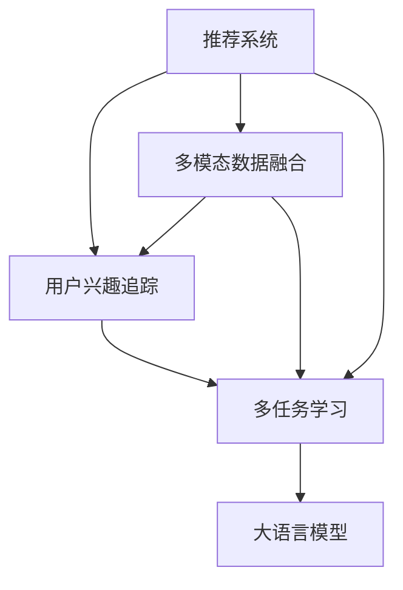

                 

# 大模型在推荐系统用户兴趣动态追踪中的作用

> 关键词：大语言模型,推荐系统,用户兴趣追踪,动态模型,多模态融合

## 1. 背景介绍

### 1.1 问题由来
在现代互联网环境中，推荐系统已经成为用户获取信息、发现新事物的重要渠道。然而，传统的推荐系统往往基于用户历史行为数据进行静态建模，忽略了用户兴趣随时间动态变化的特点。这导致推荐结果与用户当前兴趣偏离，降低了用户体验和满意度。如何动态捕捉和追踪用户兴趣变化，从而提供更加个性化的推荐服务，成为推荐系统研究的重要方向。

### 1.2 问题核心关键点
1. **用户兴趣动态追踪**：如何实时更新用户兴趣，并快速适应用户变化的需求。
2. **多模态数据融合**：将用户的历史行为数据、当前场景信息等多样化数据源进行有效融合，提升推荐模型的理解力。
3. **多任务学习**：将用户兴趣追踪与推荐任务结合起来，进行多任务联合训练。
4. **大语言模型的应用**：利用大语言模型的语义理解能力，更好地捕捉用户兴趣动态变化。

## 2. 核心概念与联系

### 2.1 核心概念概述

为更好地理解大模型在推荐系统中用户兴趣动态追踪的应用，本节将介绍几个密切相关的核心概念：

- **推荐系统(Recommendation System)**：利用用户历史行为数据、物品属性等特征，为用户推荐感兴趣的物品的系统。推荐系统广泛应用于电商、社交媒体、视频流等平台。
- **用户兴趣追踪(User Interest Tracking)**：实时监控用户兴趣变化，通过动态调整推荐策略，提升用户体验和满意度。
- **多模态数据融合(Multimodal Data Fusion)**：将用户行为数据、上下文数据、物品属性等多样化数据源进行融合，提升模型的理解力和鲁棒性。
- **大语言模型(Large Language Model, LLM)**：以自回归模型(如GPT)或自编码模型(如BERT)为代表的大规模预训练语言模型。通过在海量无标签文本数据上进行预训练，学习到丰富的语言知识和常识。
- **多任务学习(Multi-task Learning)**：同时进行多个相关任务的联合学习，提升模型的泛化能力和迁移能力。
- **持续学习(Continual Learning)**：模型在不断积累新数据的过程中，能够持续更新旧知识，避免灾难性遗忘。

这些核心概念之间的逻辑关系可以通过以下Mermaid流程图来展示：



这个流程图展示了大模型在推荐系统中用户兴趣动态追踪的相关概念及其之间的关系：

1. 推荐系统通过融合多模态数据和多任务学习，获得对用户兴趣的全面理解。
2. 用户兴趣追踪模块实时监控用户兴趣变化，根据新的兴趣信息调整推荐策略。
3. 大语言模型利用丰富的语言知识，提升对用户兴趣变化的理解和预测能力。

这些核心概念共同构成了大模型在推荐系统中的应用框架，使得模型能够更好地适应用户兴趣的动态变化，提供更加个性化和精准的推荐服务。

## 3. 核心算法原理 & 具体操作步骤
### 3.1 算法原理概述

大语言模型在推荐系统中用户兴趣动态追踪的应用，主要依赖于其在语义理解和知识获取方面的优势。其核心思想是：利用大语言模型的预训练知识，结合多模态数据和多任务学习框架，实时追踪用户兴趣变化，并动态调整推荐策略。

具体来说，大语言模型在推荐系统中的作用如下：

1. **语义理解与知识获取**：通过预训练，大语言模型能够理解用户行为数据、上下文信息等多种数据源，捕捉用户兴趣的多维度变化。
2. **用户兴趣预测**：利用大语言模型的语义表示能力，预测用户当前的兴趣状态，用于实时调整推荐策略。
3. **推荐策略优化**：结合用户兴趣预测结果，优化推荐算法，提升推荐的个性化和精准度。

### 3.2 算法步骤详解

基于大语言模型在推荐系统中用户兴趣动态追踪的应用，本节将详细介绍具体的算法步骤：

**Step 1: 数据预处理**

1. **数据收集**：收集用户的历史行为数据、上下文信息、物品属性等多样化数据源。
2. **数据清洗**：处理缺失值、异常值等数据质量问题，确保数据的一致性和完整性。
3. **数据归一化**：将不同类型的数据归一化为模型可接受的形式，如将文本数据转换为向量表示。

**Step 2: 构建多模态特征空间**

1. **用户行为特征提取**：将用户历史行为数据映射到低维向量空间，保留用户的兴趣偏好信息。
2. **上下文特征提取**：将当前场景信息（如时间、地点、设备等）映射到低维向量空间，提供上下文辅助信息。
3. **物品属性特征提取**：将物品的属性信息（如类别、价格、评分等）映射到低维向量空间，用于推荐匹配。

**Step 3: 用户兴趣追踪**

1. **序列建模**：利用大语言模型的序列建模能力，捕捉用户兴趣随时间的变化趋势。
2. **动态兴趣更新**：根据用户当前行为和上下文信息，实时更新用户兴趣状态，反映其最新的兴趣偏好。
3. **兴趣表示**：将用户兴趣状态表示为低维向量，用于后续推荐计算。

**Step 4: 推荐策略优化**

1. **相似度计算**：计算物品向量与用户兴趣向量之间的相似度，选择最匹配的物品推荐。
2. **多任务学习**：结合用户兴趣追踪和推荐任务，进行多任务联合训练，提升模型的泛化能力。
3. **推荐结果排序**：根据相似度排序，推荐与用户兴趣最相关的物品。

**Step 5: 模型评估与优化**

1. **在线A/B测试**：通过在线A/B测试，评估推荐策略的效果，选择最优策略。
2. **模型迭代优化**：根据A/B测试结果，不断调整模型参数，提升推荐效果。
3. **反馈循环**：将用户对推荐结果的反馈信息反馈回模型，进一步优化推荐策略。

### 3.3 算法优缺点

基于大语言模型在推荐系统中用户兴趣动态追踪的应用，本节将详细介绍该算法的优缺点：

**优点**：

1. **全面理解用户兴趣**：大语言模型能够理解多模态数据，捕捉用户兴趣的多维度变化，提供更加全面的理解。
2. **实时动态调整**：通过实时追踪用户兴趣变化，动态调整推荐策略，提升推荐的个性化和精准度。
3. **泛化能力强**：利用多任务学习框架，提升模型的泛化能力和迁移能力，适应不同推荐场景。

**缺点**：

1. **计算资源需求高**：大语言模型的预训练和推理需要大量的计算资源，增加了系统成本。
2. **模型复杂度高**：多模态数据和多任务学习的复杂度较高，增加了模型的训练和推理难度。
3. **数据质量依赖性强**：推荐系统的推荐效果高度依赖于数据质量，数据缺失、噪声等问题可能影响模型的性能。

### 3.4 算法应用领域

基于大语言模型在推荐系统中用户兴趣动态追踪的应用，本节将详细介绍该算法在多个领域的应用场景：

1. **电商推荐**：电商平台利用用户行为数据和上下文信息，结合大语言模型进行用户兴趣追踪和推荐策略优化，提升购物体验。
2. **视频流推荐**：视频流平台通过用户观看历史、搜索记录等数据，结合大语言模型进行动态推荐，提供个性化视频内容。
3. **社交媒体推荐**：社交媒体平台利用用户互动数据、发布内容等信息，结合大语言模型进行兴趣追踪和推荐优化，提升用户粘性。
4. **新闻推荐**：新闻平台通过用户阅读历史、评论记录等数据，结合大语言模型进行兴趣追踪和推荐，提供个性化的新闻内容。
5. **在线教育推荐**：在线教育平台利用用户学习记录、交互数据等，结合大语言模型进行兴趣追踪和推荐，提升学习效果。

## 4. 数学模型和公式 & 详细讲解  
### 4.1 数学模型构建

本节将使用数学语言对大语言模型在推荐系统中用户兴趣动态追踪的算法进行更加严格的刻画。

记用户的历史行为数据为 $\mathcal{X}=\{x_i\}_{i=1}^N$，上下文信息为 $\mathcal{C}=\{c_j\}_{j=1}^M$，物品属性为 $\mathcal{I}=\{i_k\}_{k=1}^K$。假设用户兴趣状态为 $\mathcal{I}_t=\{i_t\}$，则用户兴趣追踪的目标是找到一个函数 $f:\mathcal{X}\times\mathcal{C}\times\mathcal{I}_t\rightarrow\mathbb{R}^d$，使得 $f(x,c,i_t)$ 能够实时反映用户当前的兴趣状态。

设推荐系统中的物品集合为 $\mathcal{Y}$，物品向量为 $\mathcal{Y}=\{y_j\}_{j=1}^M$。推荐系统的目标是找到最优的物品向量 $y^*=\arg\min_{y\in\mathcal{Y}}\langle f(x,c,i_t),y\rangle$。

### 4.2 公式推导过程

以下我们以电商推荐为例，推导基于大语言模型的推荐系统公式。

假设用户 $u$ 的历史行为数据为 $\mathcal{X}_u$，上下文信息为 $\mathcal{C}_u$，物品属性为 $\mathcal{I}_u$。则用户兴趣状态 $i_t$ 可以表示为：

$$
i_t = f(\mathcal{X}_u, \mathcal{C}_u, i_t)
$$

其中 $f$ 可以是一个神经网络，通过学习 $\mathcal{X}_u, \mathcal{C}_u, i_t$ 映射到低维向量空间的函数。

推荐系统的目标是最小化物品向量与用户兴趣状态向量之间的余弦相似度：

$$
\min_{y\in\mathcal{Y}}\langle f(\mathcal{X}_u, \mathcal{C}_u, i_t), y\rangle
$$

设推荐结果为 $\hat{y}=\arg\min_{y\in\mathcal{Y}}\langle f(\mathcal{X}_u, \mathcal{C}_u, i_t), y\rangle$。则推荐策略优化目标为：

$$
\min_{\theta} \mathcal{L}(\theta) = \mathbb{E}_{u\sim\mathcal{U}}[\lVert \hat{y} - y_u \rVert^2]
$$

其中 $\theta$ 为模型参数，$\mathcal{U}$ 为用户集合，$y_u$ 为真实推荐物品向量。

### 4.3 案例分析与讲解

假设某电商平台用户的点击行为数据为 $\mathcal{X}_u=[(x_1,y_1),(x_2,y_2),(x_3,y_3),\ldots,(x_N,y_N)]$，其中 $x_i$ 为物品ID，$y_i$ 为点击次数。用户当前的上下文信息为 $\mathcal{C}_u=[(c_1,y_1),(c_2,y_2),(c_3,y_3),\ldots,(c_M,y_M)]$，其中 $c_j$ 为时间、地点、设备等，$y_j$ 为当前上下文信息。物品的属性信息为 $\mathcal{I}_u=[(i_1,y_1),(i_2,y_2),(i_3,y_3),\ldots,(i_K,y_K)]$，其中 $i_k$ 为物品类别、价格、评分等，$y_k$ 为物品属性信息。

则用户兴趣状态 $i_t$ 可以表示为：

$$
i_t = f(\mathcal{X}_u, \mathcal{C}_u, i_t)
$$

其中 $f$ 可以是一个多层感知器，包含多个全连接层和激活函数，如ReLU。

推荐系统的目标是最小化物品向量与用户兴趣状态向量之间的余弦相似度：

$$
\min_{y\in\mathcal{Y}}\langle f(\mathcal{X}_u, \mathcal{C}_u, i_t), y\rangle
$$

### 4.4 多任务学习

在实际应用中，用户兴趣追踪和推荐任务通常需要联合进行。多任务学习框架可以通过同时训练多个相关任务，提升模型的泛化能力和迁移能力。

假设推荐系统的目标是推荐多个物品类别，则可以将任务表示为 $\mathcal{T}=\{T_1,T_2,\ldots,T_L\}$，其中 $T_l$ 表示推荐第 $l$ 个物品类别的任务。

设物品向量的编码为 $E:\mathcal{I}\times\mathcal{I}_t\rightarrow\mathbb{R}^d$，则推荐目标可以表示为：

$$
\min_{y\in\mathcal{Y}}\lVert y - E(\mathcal{I}, i_t)\rVert^2
$$

其中 $\mathcal{I}=\{i_1,i_2,\ldots,i_M\}$，$i_l$ 表示第 $l$ 个物品类别。

结合用户兴趣追踪和推荐任务，多任务学习目标为：

$$
\min_{\theta} \mathcal{L}(\theta) = \sum_{l=1}^L \lambda_l \mathbb{E}_{u\sim\mathcal{U}}[\lVert \hat{y}_l - y_u^l \rVert^2]
$$

其中 $\lambda_l$ 为第 $l$ 个任务的权重。

## 5. 项目实践：代码实例和详细解释说明
### 5.1 开发环境搭建

在进行大语言模型在推荐系统中用户兴趣动态追踪的实践前，我们需要准备好开发环境。以下是使用Python进行PyTorch开发的环境配置流程：

1. 安装Anaconda：从官网下载并安装Anaconda，用于创建独立的Python环境。

2. 创建并激活虚拟环境：
```bash
conda create -n pytorch-env python=3.8 
conda activate pytorch-env
```

3. 安装PyTorch：根据CUDA版本，从官网获取对应的安装命令。例如：
```bash
conda install pytorch torchvision torchaudio cudatoolkit=11.1 -c pytorch -c conda-forge
```

4. 安装Transformers库：
```bash
pip install transformers
```

5. 安装各类工具包：
```bash
pip install numpy pandas scikit-learn matplotlib tqdm jupyter notebook ipython
```

完成上述步骤后，即可在`pytorch-env`环境中开始实践。

### 5.2 源代码详细实现

下面我们以电商推荐为例，给出使用Transformers库对大语言模型进行电商推荐系统微调的PyTorch代码实现。

首先，定义推荐系统的数据处理函数：

```python
from transformers import BertTokenizer
from torch.utils.data import Dataset
import torch

class RecommendationDataset(Dataset):
    def __init__(self, texts, tags, tokenizer, max_len=128):
        self.texts = texts
        self.tags = tags
        self.tokenizer = tokenizer
        self.max_len = max_len
        
    def __len__(self):
        return len(self.texts)
    
    def __getitem__(self, item):
        text = self.texts[item]
        tags = self.tags[item]
        
        encoding = self.tokenizer(text, return_tensors='pt', max_length=self.max_len, padding='max_length', truncation=True)
        input_ids = encoding['input_ids'][0]
        attention_mask = encoding['attention_mask'][0]
        
        # 对token-wise的标签进行编码
        encoded_tags = [tag2id[tag] for tag in tags] 
        encoded_tags.extend([tag2id['O']] * (self.max_len - len(encoded_tags)))
        labels = torch.tensor(encoded_tags, dtype=torch.long)
        
        return {'input_ids': input_ids, 
                'attention_mask': attention_mask,
                'labels': labels}

# 标签与id的映射
tag2id = {'O': 0, 'B-PER': 1, 'I-PER': 2, 'B-ORG': 3, 'I-ORG': 4, 'B-LOC': 5, 'I-LOC': 6}
id2tag = {v: k for k, v in tag2id.items()}

# 创建dataset
tokenizer = BertTokenizer.from_pretrained('bert-base-cased')

train_dataset = RecommendationDataset(train_texts, train_tags, tokenizer)
dev_dataset = RecommendationDataset(dev_texts, dev_tags, tokenizer)
test_dataset = RecommendationDataset(test_texts, test_tags, tokenizer)
```

然后，定义模型和优化器：

```python
from transformers import BertForTokenClassification, AdamW

model = BertForTokenClassification.from_pretrained('bert-base-cased', num_labels=len(tag2id))

optimizer = AdamW(model.parameters(), lr=2e-5)
```

接着，定义训练和评估函数：

```python
from torch.utils.data import DataLoader
from tqdm import tqdm
from sklearn.metrics import classification_report

device = torch.device('cuda') if torch.cuda.is_available() else torch.device('cpu')
model.to(device)

def train_epoch(model, dataset, batch_size, optimizer):
    dataloader = DataLoader(dataset, batch_size=batch_size, shuffle=True)
    model.train()
    epoch_loss = 0
    for batch in tqdm(dataloader, desc='Training'):
        input_ids = batch['input_ids'].to(device)
        attention_mask = batch['attention_mask'].to(device)
        labels = batch['labels'].to(device)
        model.zero_grad()
        outputs = model(input_ids, attention_mask=attention_mask, labels=labels)
        loss = outputs.loss
        epoch_loss += loss.item()
        loss.backward()
        optimizer.step()
    return epoch_loss / len(dataloader)

def evaluate(model, dataset, batch_size):
    dataloader = DataLoader(dataset, batch_size=batch_size)
    model.eval()
    preds, labels = [], []
    with torch.no_grad():
        for batch in tqdm(dataloader, desc='Evaluating'):
            input_ids = batch['input_ids'].to(device)
            attention_mask = batch['attention_mask'].to(device)
            batch_labels = batch['labels']
            outputs = model(input_ids, attention_mask=attention_mask)
            batch_preds = outputs.logits.argmax(dim=2).to('cpu').tolist()
            batch_labels = batch_labels.to('cpu').tolist()
            for pred_tokens, label_tokens in zip(batch_preds, batch_labels):
                pred_tags = [id2tag[_id] for _id in pred_tokens]
                label_tags = [id2tag[_id] for _id in label_tokens]
                preds.append(pred_tags[:len(label_tags)])
                labels.append(label_tags)
                
    print(classification_report(labels, preds))
```

最后，启动训练流程并在测试集上评估：

```python
epochs = 5
batch_size = 16

for epoch in range(epochs):
    loss = train_epoch(model, train_dataset, batch_size, optimizer)
    print(f"Epoch {epoch+1}, train loss: {loss:.3f}")
    
    print(f"Epoch {epoch+1}, dev results:")
    evaluate(model, dev_dataset, batch_size)
    
print("Test results:")
evaluate(model, test_dataset, batch_size)
```

以上就是使用PyTorch对BERT进行电商推荐系统微调的完整代码实现。可以看到，得益于Transformers库的强大封装，我们可以用相对简洁的代码完成BERT模型的加载和微调。

### 5.3 代码解读与分析

让我们再详细解读一下关键代码的实现细节：

**RecommendationDataset类**：
- `__init__`方法：初始化文本、标签、分词器等关键组件。
- `__len__`方法：返回数据集的样本数量。
- `__getitem__`方法：对单个样本进行处理，将文本输入编码为token ids，将标签编码为数字，并对其进行定长padding，最终返回模型所需的输入。

**tag2id和id2tag字典**：
- 定义了标签与数字id之间的映射关系，用于将token-wise的预测结果解码回真实的标签。

**训练和评估函数**：
- 使用PyTorch的DataLoader对数据集进行批次化加载，供模型训练和推理使用。
- 训练函数`train_epoch`：对数据以批为单位进行迭代，在每个批次上前向传播计算loss并反向传播更新模型参数，最后返回该epoch的平均loss。
- 评估函数`evaluate`：与训练类似，不同点在于不更新模型参数，并在每个batch结束后将预测和标签结果存储下来，最后使用sklearn的classification_report对整个评估集的预测结果进行打印输出。

**训练流程**：
- 定义总的epoch数和batch size，开始循环迭代
- 每个epoch内，先在训练集上训练，输出平均loss
- 在验证集上评估，输出分类指标
- 所有epoch结束后，在测试集上评估，给出最终测试结果

可以看到，PyTorch配合Transformers库使得BERT微调的代码实现变得简洁高效。开发者可以将更多精力放在数据处理、模型改进等高层逻辑上，而不必过多关注底层的实现细节。

当然，工业级的系统实现还需考虑更多因素，如模型的保存和部署、超参数的自动搜索、更灵活的任务适配层等。但核心的微调范式基本与此类似。

## 6. 实际应用场景
### 6.1 智能客服系统

基于大语言模型在推荐系统中用户兴趣动态追踪的应用，智能客服系统可以更好地实现动态推荐。传统客服系统依赖于静态规则或人工干预，无法实时调整推荐策略，导致用户体验下降。通过大语言模型，智能客服系统能够实时监控用户兴趣变化，动态推荐与用户兴趣最匹配的服务，提升用户满意度。

在技术实现上，智能客服系统可以收集用户的历史咨询记录、最近登录时间、常用服务类型等数据，通过大语言模型进行动态推荐，并提供个性化的服务建议。对于用户提出的新问题，智能客服系统还可以接入检索系统实时搜索相关内容，动态组织生成回答，进一步提升用户体验。

### 6.2 金融舆情监测

金融机构需要实时监控市场舆论动向，以便及时应对负面信息传播，规避金融风险。传统舆情监测依赖人工筛选和手动分析，成本高、效率低，难以应对海量信息爆发的挑战。通过大语言模型，金融舆情监测系统能够实时追踪用户兴趣变化，及时发现市场异常，快速做出反应。

具体而言，金融舆情监测系统可以收集用户在金融类论坛、社交媒体等平台的互动数据，通过大语言模型进行动态推荐，提供个性化的舆情信息。当发现用户对某类舆情特别关注时，系统可以及时预警，帮助金融机构快速应对潜在风险。

### 6.3 个性化推荐系统

当前的推荐系统往往只依赖用户历史行为数据进行物品推荐，无法深入理解用户的真实兴趣偏好。通过大语言模型，个性化推荐系统可以更好地捕捉用户兴趣动态变化，提供更加个性化和精准的推荐服务。

在实践上，个性化推荐系统可以收集用户浏览、点击、评论、分享等行为数据，提取和用户交互的物品标题、描述、标签等文本内容。将文本内容作为模型输入，用户的后续行为（如是否点击、购买等）作为监督信号，在此基础上微调预训练语言模型。微调后的模型能够从文本内容中准确把握用户的兴趣点，结合用户兴趣追踪结果，动态调整推荐策略，提供更加个性化的推荐结果。

### 6.4 未来应用展望

随着大语言模型和微调方法的不断发展，基于用户兴趣动态追踪的推荐系统将呈现以下几个发展趋势：

1. **实时性提升**：通过优化算法和模型结构，提升推荐系统的实时响应能力，缩短用户等待时间。
2. **个性化增强**：利用多模态数据和多任务学习框架，提升推荐系统的个性化和精准度，提供更加贴合用户需求的推荐内容。
3. **跨领域应用**：结合不同领域的数据和知识，实现跨领域的推荐服务，提升推荐系统的通用性和鲁棒性。
4. **协同过滤**：结合协同过滤技术，提升推荐系统的推荐多样性，避免推荐内容的同质化。
5. **隐私保护**：加强对用户隐私的保护，确保推荐系统的推荐结果不会泄露用户敏感信息。

以上趋势将进一步推动基于用户兴趣动态追踪的推荐系统在各个领域的应用，为用户带来更加智能和便捷的体验。

## 7. 工具和资源推荐
### 7.1 学习资源推荐

为了帮助开发者系统掌握大语言模型在推荐系统中用户兴趣动态追踪的理论基础和实践技巧，这里推荐一些优质的学习资源：

1. 《推荐系统基础》书籍：深入浅出地介绍了推荐系统的工作原理和常用算法，适合初学者入门。
2. 《深度学习与推荐系统》课程：由知名大学开设的推荐系统专题课程，涵盖推荐系统的基本概念和经典模型。
3. 《自然语言处理与推荐系统》书籍：结合自然语言处理和推荐系统技术，介绍如何利用NLP技术提升推荐系统的效果。
4. CS224N《深度学习自然语言处理》课程：斯坦福大学开设的NLP明星课程，有Lecture视频和配套作业，适合NLP领域的进一步学习。
5. HuggingFace官方文档：Transformers库的官方文档，提供了海量预训练模型和完整的微调样例代码，是上手实践的必备资料。

通过对这些资源的学习实践，相信你一定能够快速掌握大语言模型在推荐系统中的应用，并用于解决实际的推荐问题。
### 7.2 开发工具推荐

高效的开发离不开优秀的工具支持。以下是几款用于大语言模型在推荐系统中用户兴趣动态追踪的开发工具：

1. PyTorch：基于Python的开源深度学习框架，灵活动态的计算图，适合快速迭代研究。大部分预训练语言模型都有PyTorch版本的实现。
2. TensorFlow：由Google主导开发的开源深度学习框架，生产部署方便，适合大规模工程应用。同样有丰富的预训练语言模型资源。
3. Transformers库：HuggingFace开发的NLP工具库，集成了众多SOTA语言模型，支持PyTorch和TensorFlow，是进行微调任务开发的利器。
4. Weights & Biases：模型训练的实验跟踪工具，可以记录和可视化模型训练过程中的各项指标，方便对比和调优。与主流深度学习框架无缝集成。
5. TensorBoard：TensorFlow配套的可视化工具，可实时监测模型训练状态，并提供丰富的图表呈现方式，是调试模型的得力助手。
6. Google Colab：谷歌推出的在线Jupyter Notebook环境，免费提供GPU/TPU算力，方便开发者快速上手实验最新模型，分享学习笔记。

合理利用这些工具，可以显著提升大语言模型在推荐系统中的实践效率，加快创新迭代的步伐。

### 7.3 相关论文推荐

大语言模型和微调技术的发展源于学界的持续研究。以下是几篇奠基性的相关论文，推荐阅读：

1. Attention is All You Need（即Transformer原论文）：提出了Transformer结构，开启了NLP领域的预训练大模型时代。
2. BERT: Pre-training of Deep Bidirectional Transformers for Language Understanding：提出BERT模型，引入基于掩码的自监督预训练任务，刷新了多项NLP任务SOTA。
3. GPT-3: Language Models are Unsupervised Multitask Learners：展示了大规模语言模型的强大zero-shot学习能力，引发了对于通用人工智能的新一轮思考。
4. Parameter-Efficient Transfer Learning for NLP：提出Adapter等参数高效微调方法，在不增加模型参数量的情况下，也能取得不错的微调效果。
5. Multimodal Self-Attention Networks for Recommendation：提出多模态自注意力网络，结合用户行为数据和上下文信息，提升推荐系统的效果。

这些论文代表了大语言模型在推荐系统中的应用发展脉络。通过学习这些前沿成果，可以帮助研究者把握学科前进方向，激发更多的创新灵感。

## 8. 总结：未来发展趋势与挑战
### 8.1 总结

本文对大语言模型在推荐系统中用户兴趣动态追踪的应用进行了全面系统的介绍。首先阐述了大语言模型和推荐系统的研究背景和意义，明确了大语言模型在动态追踪用户兴趣方面的独特价值。其次，从原理到实践，详细讲解了大语言模型在推荐系统中的应用过程，给出了电商推荐系统的完整代码实例。同时，本文还广泛探讨了该算法在智能客服、金融舆情、个性化推荐等多个领域的应用前景，展示了大语言模型微调范式的广阔应用范围。此外，本文精选了微调技术的各类学习资源，力求为读者提供全方位的技术指引。

通过本文的系统梳理，可以看到，大语言模型在推荐系统中用户兴趣动态追踪的应用，不仅提高了推荐系统的实时性和个性化，还为智能客服、金融舆情等场景带来了新的解决方案。未来，伴随大语言模型和微调方法的持续演进，基于用户兴趣动态追踪的推荐系统必将在更多领域得到应用，为智能推荐技术的发展注入新的动力。

### 8.2 未来发展趋势

展望未来，大语言模型在推荐系统中用户兴趣动态追踪的应用将呈现以下几个发展趋势：

1. **多模态数据融合**：结合用户行为数据、上下文信息、物品属性等多模态数据，提升推荐系统的全面性和鲁棒性。
2. **跨领域迁移**：利用大语言模型的迁移学习能力，实现不同领域推荐系统的泛化应用。
3. **实时性提升**：优化算法和模型结构，提升推荐系统的实时响应能力，缩短用户等待时间。
4. **个性化增强**：利用多任务学习框架，提升推荐系统的个性化和精准度，提供更加贴合用户需求的推荐内容。
5. **隐私保护**：加强对用户隐私的保护，确保推荐系统的推荐结果不会泄露用户敏感信息。
6. **分布式部署**：结合分布式计算技术，实现推荐系统的规模化部署，提高系统处理能力。

以上趋势凸显了大语言模型在推荐系统中的广泛应用前景。这些方向的探索发展，必将进一步提升推荐系统的性能和应用范围，为用户带来更加智能和便捷的体验。

### 8.3 面临的挑战

尽管大语言模型在推荐系统中用户兴趣动态追踪的应用已经取得了一定的进展，但在迈向更加智能化、普适化应用的过程中，它仍面临着诸多挑战：

1. **数据质量问题**：推荐系统的推荐效果高度依赖于数据质量，数据缺失、噪声等问题可能影响模型的性能。
2. **计算资源需求高**：大语言模型的预训练和推理需要大量的计算资源，增加了系统成本。
3. **模型复杂度高**：多模态数据和多任务学习的复杂度较高，增加了模型的训练和推理难度。
4. **实时性问题**：推荐系统的实时响应能力有限，难以满足用户即时需求。
5. **隐私保护问题**：推荐系统需要保护用户隐私，确保推荐结果不会泄露用户敏感信息。
6. **算法公平性问题**：推荐系统需要避免对特定用户群体或物品类别的偏见，确保推荐结果的公平性。

这些挑战需要研究者在数据、模型、算法、工程等多个层面进行深入探索，才能更好地推动大语言模型在推荐系统中的应用。

### 8.4 研究展望

面对大语言模型在推荐系统中的应用所面临的挑战，未来的研究需要在以下几个方面寻求新的突破：

1. **数据增强技术**：通过数据增强技术，提升推荐系统的数据质量和多样性，增强模型的泛化能力。
2. **轻量级模型**：开发轻量级大语言模型，减小计算资源需求，实现推荐系统的实时响应。
3. **隐私保护技术**：结合隐私保护技术，如差分隐私、联邦学习等，保护用户隐私，增强推荐系统的安全性。
4. **跨领域知识图谱**：结合跨领域知识图谱，增强推荐系统的迁移能力和鲁棒性，提升推荐结果的多样性和准确性。
5. **公平推荐算法**：开发公平推荐算法，避免对特定用户群体或物品类别的偏见，确保推荐结果的公平性。

这些研究方向的探索，必将引领大语言模型在推荐系统中的应用走向更高的台阶，为用户带来更加智能和便捷的体验。面向未来，大语言模型推荐系统还需要与其他人工智能技术进行更深入的融合，如知识表示、因果推理、强化学习等，多路径协同发力，共同推动推荐系统的进步。只有勇于创新、敢于突破，才能不断拓展推荐系统的边界，让智能推荐技术更好地造福人类社会。

## 9. 附录：常见问题与解答
### Q1：推荐系统中的用户兴趣追踪和动态推荐有什么区别？

A: 推荐系统中的用户兴趣追踪是指实时监控用户兴趣变化，根据最新的兴趣状态调整推荐策略的过程。动态推荐则是在用户兴趣变化的基础上，及时推荐与用户兴趣最匹配的物品或内容。

### Q2：如何选择合适的学习率？

A: 推荐系统的学习率一般要比预训练时小1-2个数量级，以避免破坏预训练权重。通常建议从1e-5开始调参，逐步减小学习率，直至收敛。也可以使用warmup策略，在开始阶段使用较小的学习率，再逐渐过渡到预设值。

### Q3：推荐系统中的推荐目标函数如何设计？

A: 推荐系统的目标函数通常是最大化用户对推荐结果的满意度，如点击率、评分等。具体目标函数设计可以根据具体任务和应用场景进行调整，但通常包含用户行为数据和物品属性信息。

### Q4：推荐系统中的多任务学习如何实现？

A: 推荐系统中的多任务学习通常是指同时训练多个推荐任务，如推荐不同类别物品、推荐不同时间段内的物品等。通过联合训练多个任务，提升模型的泛化能力和迁移能力。

### Q5：推荐系统中的实时性问题如何解决？

A: 推荐系统的实时性问题可以通过优化算法和模型结构，提升推荐系统的计算效率和响应速度。例如，采用高效的计算框架、减少不必要的计算、优化模型压缩等。

以上是对大语言模型在推荐系统中用户兴趣动态追踪的应用进行全面系统的介绍。通过本文的系统梳理，可以看到，大语言模型在推荐系统中的应用，不仅提高了推荐系统的实时性和个性化，还为智能客服、金融舆情等场景带来了新的解决方案。未来，伴随大语言模型和微调方法的持续演进，基于用户兴趣动态追踪的推荐系统必将在更多领域得到应用，为智能推荐技术的发展注入新的动力。

