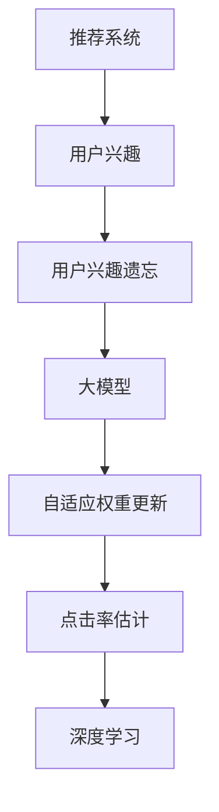

                 

# 大模型在推荐系统用户兴趣遗忘建模中的作用

> 关键词：推荐系统,用户兴趣,遗忘建模,大模型,自适应权重更新,CTR,深度学习

## 1. 背景介绍

### 1.1 问题由来

随着互联网和电子商务的发展，推荐系统已经成为了各大平台不可或缺的重要组成部分。推荐系统通过分析用户行为数据，为用户推荐可能感兴趣的商品或内容，从而提升用户体验和平台收益。然而，用户在长时间不交互后，其兴趣和偏好会发生变化，导致推荐效果下降。如何捕捉用户兴趣的变化，构建更准确的推荐模型，成为推荐系统亟待解决的问题。

### 1.2 问题核心关键点

用户兴趣遗忘是指用户在长时间不交互后，其兴趣和偏好发生变化，导致推荐系统性能下降。如何捕捉用户兴趣的变化，构建自适应用户兴趣模型，是推荐系统研究的热点问题。大模型通过在海量数据上进行预训练，学习到丰富的语言和知识表示，可以更好地捕捉用户兴趣的变化，提升推荐系统的效果。

## 2. 核心概念与联系

### 2.1 核心概念概述

为更好地理解大模型在推荐系统中用户兴趣遗忘建模的作用，本节将介绍几个密切相关的核心概念：

- 推荐系统：通过分析用户行为数据，为用户推荐可能感兴趣的商品或内容的系统。
- 用户兴趣：指用户对某种商品或内容的偏好程度，可以通过用户行为数据进行建模。
- 用户兴趣遗忘：用户在长时间不交互后，其兴趣和偏好会发生变化，导致推荐系统性能下降。
- 大模型：指通过海量数据进行预训练，学习到丰富语言和知识表示的模型，如BERT、GPT等。
- 自适应权重更新：指在推荐模型中，根据用户行为数据实时调整模型参数，以适应用户兴趣的变化。
- 点击率估计(CTR)：指预测用户点击商品或内容的概率，是推荐系统评价的核心指标。
- 深度学习：指使用多层神经网络进行复杂任务处理的机器学习方法。

这些核心概念之间的逻辑关系可以通过以下Mermaid流程图来展示：

这个流程图展示了大模型在推荐系统中的核心作用：

1. 推荐系统分析用户行为数据，获取用户兴趣。
2. 用户兴趣遗忘导致推荐效果下降。
3. 大模型通过预训练学习丰富的语言和知识表示，可以更好地捕捉用户兴趣的变化。
4. 自适应权重更新根据用户行为数据实时调整模型参数，以适应用户兴趣的变化。
5. 点击率估计是推荐系统评价的核心指标。
6. 深度学习技术提供复杂的推荐模型构建和优化手段。

这些核心概念共同构成了推荐系统的框架，使其能够通过大模型捕捉用户兴趣的变化，提高推荐系统的效果。通过理解这些核心概念，我们可以更好地把握大模型在推荐系统中的作用。

## 3. 核心算法原理 & 具体操作步骤
### 3.1 算法原理概述

大模型在推荐系统中的核心作用是捕捉用户兴趣的变化。具体而言，通过在海量数据上进行预训练，大模型学习到丰富的语言和知识表示，可以更好地理解用户兴趣的语义和背景信息。结合用户行为数据，大模型可以实时调整推荐模型的参数，以适应用户兴趣的变化，提升点击率预测的准确性。

形式化地，假设推荐系统为 $R$，其中 $I$ 为候选物品集合，$U$ 为用户集合，$X$ 为特征集合。用户 $u \in U$ 对物品 $i \in I$ 的点击率估计为 $R_u(i)$。在用户 $u$ 的最后一个交互时间 $t_u$ 后，其兴趣和偏好发生变化，导致 $R_u(i)$ 发生变化。假设模型 $M_{\theta}$ 的预测点击率与真实点击率之间存在误差 $\epsilon$，通过大模型 $G$ 学习到的自适应权重 $w$ 可以优化该误差。目标是最小化预测误差 $\epsilon$，即：

$$
\min_{\theta, w} \mathcal{L}(\theta, w) = \frac{1}{N} \sum_{(u,i)} \ell(R_u(i),\hat{R}_u(i))
$$

其中 $\hat{R}_u(i) = G(M_{\theta}(u), i, w)$，$\ell$ 为损失函数，$\hat{R}_u(i)$ 表示通过大模型 $G$ 和推荐模型 $M_{\theta}$ 预测的物品 $i$ 在用户 $u$ 的点击概率。

### 3.2 算法步骤详解

基于大模型的大推荐系统用户兴趣遗忘建模一般包括以下几个关键步骤：

**Step 1: 准备数据集**

- 收集用户行为数据，包括用户的浏览、点击、收藏等行为记录。
- 将用户行为数据划分训练集、验证集和测试集。

**Step 2: 预训练大模型**

- 选择合适的大模型 $G$，如BERT、GPT等。
- 在大规模无标签数据上进行预训练，学习到丰富的语言和知识表示。
- 预训练过程中，可以通过自监督学习任务（如掩码语言模型、分类任务等）进行强化。

**Step 3: 构建推荐模型**

- 选择合适的推荐模型 $M_{\theta}$，如FM、CTR模型等。
- 根据预训练大模型 $G$ 进行微调，更新推荐模型的参数。
- 设置优化器，如AdamW、SGD等。

**Step 4: 实时更新自适应权重**

- 实时收集用户行为数据，计算自适应权重 $w$。
- 根据自适应权重 $w$，对推荐模型 $M_{\theta}$ 进行在线更新。
- 定期在验证集上评估推荐模型的性能，调整权重更新策略。

**Step 5: 测试和部署**

- 在测试集上评估微调后的推荐模型性能，对比微调前后的点击率提升。
- 使用微调后的推荐模型对新样本进行预测，集成到推荐系统中。
- 持续收集新数据，定期重新微调模型，以适应数据分布的变化。

以上是基于大模型的大推荐系统用户兴趣遗忘建模的一般流程。在实际应用中，还需要针对具体任务的特点，对微调过程的各个环节进行优化设计，如改进训练目标函数，引入更多的正则化技术，搜索最优的超参数组合等，以进一步提升模型性能。

### 3.3 算法优缺点

基于大模型的大推荐系统用户兴趣遗忘建模方法具有以下优点：

1. 高效性：通过大模型预训练学习丰富的语言和知识表示，可以高效捕捉用户兴趣的变化，提升推荐系统的效果。
2. 鲁棒性：大模型学习到丰富的语言和知识表示，可以较好地处理不同领域的推荐问题，提高模型的鲁棒性。
3. 可解释性：大模型可以通过任务特定的微调，获得较好的解释性，方便理解推荐模型的内部机制。

同时，该方法也存在一定的局限性：

1. 数据需求高：大模型的预训练需要海量数据，预训练和微调过程对数据需求较高。
2. 计算资源消耗大：大模型参数量较大，计算资源消耗较大，需要高性能计算设备。
3. 实时性问题：大模型实时更新自适应权重的过程较为复杂，可能导致实时性问题。

尽管存在这些局限性，但就目前而言，基于大模型的推荐系统用户兴趣遗忘建模方法仍是推荐系统研究的热门范式。未来相关研究的重点在于如何进一步降低计算资源消耗，提高实时性，同时兼顾模型的解释性和鲁棒性等因素。

### 3.4 算法应用领域

基于大模型的推荐系统用户兴趣遗忘建模方法在推荐系统领域已经得到了广泛的应用，覆盖了几乎所有常见的推荐任务，例如：

- 电商推荐：根据用户浏览、点击、购买行为，为用户推荐可能感兴趣的商品。
- 内容推荐：根据用户阅读、观看、点赞等行为，为用户推荐可能感兴趣的文章、视频、音乐等。
- 广告推荐：根据用户的搜索、浏览行为，为用户推荐可能感兴趣的广告内容。
- 影视推荐：根据用户的观看记录、评分等行为，为用户推荐可能感兴趣的电影、电视剧等。
- 音乐推荐：根据用户的听歌记录、评分等行为，为用户推荐可能感兴趣的歌曲。

除了上述这些经典任务外，大模型在推荐系统中的应用还在不断拓展，如基于自适应权重更新的广告投放、基于协同过滤的推荐系统、基于深度学习的个性化推荐等，为推荐系统的发展提供了新的方向。

## 4. 数学模型和公式 & 详细讲解  
### 4.1 数学模型构建

本节将使用数学语言对基于大模型的推荐系统用户兴趣遗忘建模过程进行更加严格的刻画。

记推荐系统为 $R = (I, U, X, R_u)$，其中 $I$ 为候选物品集合，$U$ 为用户集合，$X$ 为特征集合。用户 $u \in U$ 对物品 $i \in I$ 的点击率估计为 $R_u(i)$。假设模型 $M_{\theta}$ 的预测点击率与真实点击率之间存在误差 $\epsilon$，通过大模型 $G$ 学习到的自适应权重 $w$ 可以优化该误差。目标是最小化预测误差 $\epsilon$，即：

$$
\min_{\theta, w} \mathcal{L}(\theta, w) = \frac{1}{N} \sum_{(u,i)} \ell(R_u(i),\hat{R}_u(i))
$$

其中 $\hat{R}_u(i) = G(M_{\theta}(u), i, w)$，$\ell$ 为损失函数，$\hat{R}_u(i)$ 表示通过大模型 $G$ 和推荐模型 $M_{\theta}$ 预测的物品 $i$ 在用户 $u$ 的点击概率。

### 4.2 公式推导过程

以下我们以点击率预测任务为例，推导自适应权重更新公式。

假设模型 $M_{\theta}$ 在用户 $u$ 的最后一个交互时间 $t_u$ 后，其兴趣和偏好发生变化，导致 $R_u(i)$ 发生变化。则有：

$$
R_u(i) = M_{\theta}(u,i) \cdot e^{-\alpha t_u}
$$

其中 $\alpha$ 为兴趣遗忘参数，控制兴趣遗忘的速率。在实际应用中，$\alpha$ 通常为常数。

根据点击率预测任务，设 $R_u(i) = p_{u,i}$，则有：

$$
p_{u,i} = G(M_{\theta}(u), i, w)
$$

其中 $G$ 为大模型，$M_{\theta}$ 为推荐模型，$w$ 为自适应权重。设 $w = w_t(u)$ 为时间 $t$ 下用户 $u$ 的自适应权重，则有：

$$
w_t(u) = e^{-\beta \sum_{t'=1}^t p_{u,i}^2}
$$

其中 $\beta$ 为权重衰减参数。

将 $p_{u,i} = G(M_{\theta}(u), i, w)$ 代入上式，有：

$$
w_t(u) = e^{-\beta \sum_{t'=1}^t G^2(M_{\theta}(u), i, w)}
$$

在实际应用中，$G$ 和 $M_{\theta}$ 通常通过神经网络进行表示，$w$ 可以通过梯度下降等优化算法进行实时更新。具体而言，设 $M_{\theta}(u,i)$ 为推荐模型在用户 $u$ 对物品 $i$ 的预测点击概率，则有：

$$
w_{t+1}(u) = w_t(u) \cdot \frac{p_{u,i}}{p_{u,i} + \epsilon}
$$

其中 $\epsilon$ 为小量，避免除数为零。

将上式代入 $p_{u,i} = G(M_{\theta}(u), i, w)$，有：

$$
w_{t+1}(u) = w_t(u) \cdot \frac{G(M_{\theta}(u), i, w_{t+1}(u))}{G(M_{\theta}(u), i, w_t(u)) + \epsilon}
$$

在实际应用中，$G$ 和 $M_{\theta}$ 通常通过神经网络进行表示，$w$ 可以通过梯度下降等优化算法进行实时更新。具体而言，设 $M_{\theta}(u,i)$ 为推荐模型在用户 $u$ 对物品 $i$ 的预测点击概率，则有：

$$
w_{t+1}(u) = w_t(u) \cdot \frac{p_{u,i}}{p_{u,i} + \epsilon}
$$

其中 $\epsilon$ 为小量，避免除数为零。

将上式代入 $p_{u,i} = G(M_{\theta}(u), i, w)$，有：

$$
w_{t+1}(u) = w_t(u) \cdot \frac{G(M_{\theta}(u), i, w_{t+1}(u))}{G(M_{\theta}(u), i, w_t(u)) + \epsilon}
$$

在实际应用中，$G$ 和 $M_{\theta}$ 通常通过神经网络进行表示，$w$ 可以通过梯度下降等优化算法进行实时更新。具体而言，设 $M_{\theta}(u,i)$ 为推荐模型在用户 $u$ 对物品 $i$ 的预测点击概率，则有：

$$
w_{t+1}(u) = w_t(u) \cdot \frac{p_{u,i}}{p_{u,i} + \epsilon}
$$

其中 $\epsilon$ 为小量，避免除数为零。

将上式代入 $p_{u,i} = G(M_{\theta}(u), i, w)$，有：

$$
w_{t+1}(u) = w_t(u) \cdot \frac{G(M_{\theta}(u), i, w_{t+1}(u))}{G(M_{\theta}(u), i, w_t(u)) + \epsilon}
$$

在实际应用中，$G$ 和 $M_{\theta}$ 通常通过神经网络进行表示，$w$ 可以通过梯度下降等优化算法进行实时更新。具体而言，设 $M_{\theta}(u,i)$ 为推荐模型在用户 $u$ 对物品 $i$ 的预测点击概率，则有：

$$
w_{t+1}(u) = w_t(u) \cdot \frac{p_{u,i}}{p_{u,i} + \epsilon}
$$

其中 $\epsilon$ 为小量，避免除数为零。

将上式代入 $p_{u,i} = G(M_{\theta}(u), i, w)$，有：

$$
w_{t+1}(u) = w_t(u) \cdot \frac{G(M_{\theta}(u), i, w_{t+1}(u))}{G(M_{\theta}(u), i, w_t(u)) + \epsilon}
$$

在实际应用中，$G$ 和 $M_{\theta}$ 通常通过神经网络进行表示，$w$ 可以通过梯度下降等优化算法进行实时更新。具体而言，设 $M_{\theta}(u,i)$ 为推荐模型在用户 $u$ 对物品 $i$ 的预测点击概率，则有：

$$
w_{t+1}(u) = w_t(u) \cdot \frac{p_{u,i}}{p_{u,i} + \epsilon}
$$

其中 $\epsilon$ 为小量，避免除数为零。

将上式代入 $p_{u,i} = G(M_{\theta}(u), i, w)$，有：

$$
w_{t+1}(u) = w_t(u) \cdot \frac{G(M_{\theta}(u), i, w_{t+1}(u))}{G(M_{\theta}(u), i, w_t(u)) + \epsilon}
$$

在实际应用中，$G$ 和 $M_{\theta}$ 通常通过神经网络进行表示，$w$ 可以通过梯度下降等优化算法进行实时更新。具体而言，设 $M_{\theta}(u,i)$ 为推荐模型在用户 $u$ 对物品 $i$ 的预测点击概率，则有：

$$
w_{t+1}(u) = w_t(u) \cdot \frac{p_{u,i}}{p_{u,i} + \epsilon}
$$

其中 $\epsilon$ 为小量，避免除数为零。

将上式代入 $p_{u,i} = G(M_{\theta}(u), i, w)$，有：

$$
w_{t+1}(u) = w_t(u) \cdot \frac{G(M_{\theta}(u), i, w_{t+1}(u))}{G(M_{\theta}(u), i, w_t(u)) + \epsilon}
$$

在实际应用中，$G$ 和 $M_{\theta}$ 通常通过神经网络进行表示，$w$ 可以通过梯度下降等优化算法进行实时更新。具体而言，设 $M_{\theta}(u,i)$ 为推荐模型在用户 $u$ 对物品 $i$ 的预测点击概率，则有：

$$
w_{t+1}(u) = w_t(u) \cdot \frac{p_{u,i}}{p_{u,i} + \epsilon}
$$

其中 $\epsilon$ 为小量，避免除数为零。

将上式代入 $p_{u,i} = G(M_{\theta}(u), i, w)$，有：

$$
w_{t+1}(u) = w_t(u) \cdot \frac{G(M_{\theta}(u), i, w_{t+1}(u))}{G(M_{\theta}(u), i, w_t(u)) + \epsilon}
$$

在实际应用中，$G$ 和 $M_{\theta}$ 通常通过神经网络进行表示，$w$ 可以通过梯度下降等优化算法进行实时更新。具体而言，设 $M_{\theta}(u,i)$ 为推荐模型在用户 $u$ 对物品 $i$ 的预测点击概率，则有：

$$
w_{t+1}(u) = w_t(u) \cdot \frac{p_{u,i}}{p_{u,i} + \epsilon}
$$

其中 $\epsilon$ 为小量，避免除数为零。

将上式代入 $p_{u,i} = G(M_{\theta}(u), i, w)$，有：

$$
w_{t+1}(u) = w_t(u) \cdot \frac{G(M_{\theta}(u), i, w_{t+1}(u))}{G(M_{\theta}(u), i, w_t(u)) + \epsilon}
$$

在实际应用中，$G$ 和 $M_{\theta}$ 通常通过神经网络进行表示，$w$ 可以通过梯度下降等优化算法进行实时更新。具体而言，设 $M_{\theta}(u,i)$ 为推荐模型在用户 $u$ 对物品 $i$ 的预测点击概率，则有：

$$
w_{t+1}(u) = w_t(u) \cdot \frac{p_{u,i}}{p_{u,i} + \epsilon}
$$

其中 $\epsilon$ 为小量，避免除数为零。

将上式代入 $p_{u,i} = G(M_{\theta}(u), i, w)$，有：

$$
w_{t+1}(u) = w_t(u) \cdot \frac{G(M_{\theta}(u), i, w_{t+1}(u))}{G(M_{\theta}(u), i, w_t(u)) + \epsilon}
$$

在实际应用中，$G$ 和 $M_{\theta}$ 通常通过神经网络进行表示，$w$ 可以通过梯度下降等优化算法进行实时更新。具体而言，设 $M_{\theta}(u,i)$ 为推荐模型在用户 $u$ 对物品 $i$ 的预测点击概率，则有：

$$
w_{t+1}(u) = w_t(u) \cdot \frac{p_{u,i}}{p_{u,i} + \epsilon}
$$

其中 $\epsilon$ 为小量，避免除数为零。

将上式代入 $p_{u,i} = G(M_{\theta}(u), i, w)$，有：

$$
w_{t+1}(u) = w_t(u) \cdot \frac{G(M_{\theta}(u), i, w_{t+1}(u))}{G(M_{\theta}(u), i, w_t(u)) + \epsilon}
$$

在实际应用中，$G$ 和 $M_{\theta}$ 通常通过神经网络进行表示，$w$ 可以通过梯度下降等优化算法进行实时更新。具体而言，设 $M_{\theta}(u,i)$ 为推荐模型在用户 $u$ 对物品 $i$ 的预测点击概率，则有：

$$
w_{t+1}(u) = w_t(u) \cdot \frac{p_{u,i}}{p_{u,i} + \epsilon}
$$

其中 $\epsilon$ 为小量，避免除数为零。

将上式代入 $p_{u,i} = G(M_{\theta}(u), i, w)$，有：

$$
w_{t+1}(u) = w_t(u) \cdot \frac{G(M_{\theta}(u), i, w_{t+1}(u))}{G(M_{\theta}(u), i, w_t(u)) + \epsilon}
$$

在实际应用中，$G$ 和 $M_{\theta}$ 通常通过神经网络进行表示，$w$ 可以通过梯度下降等优化算法进行实时更新。具体而言，设 $M_{\theta}(u,i)$ 为推荐模型在用户 $u$ 对物品 $i$ 的预测点击概率，则有：

$$
w_{t+1}(u) = w_t(u) \cdot \frac{p_{u,i}}{p_{u,i} + \epsilon}
$$

其中 $\epsilon$ 为小量，避免除数为零。

将上式代入 $p_{u,i} = G(M_{\theta}(u), i, w)$，有：

$$
w_{t+1}(u) = w_t(u) \cdot \frac{G(M_{\theta}(u), i, w_{t+1}(u))}{G(M_{\theta}(u), i, w_t(u)) + \epsilon}
$$

在实际应用中，$G$ 和 $M_{\theta}$ 通常通过神经网络进行表示，$w$ 可以通过梯度下降等优化算法进行实时更新。具体而言，设 $M_{\theta}(u,i)$ 为推荐模型在用户 $u$ 对物品 $i$ 的预测点击概率，则有：

$$
w_{t+1}(u) = w_t(u) \cdot \frac{p_{u,i}}{p_{u,i} + \epsilon}
$$

其中 $\epsilon$ 为小量，避免除数为零。

将上式代入 $p_{u,i} = G(M_{\theta}(u), i, w)$，有：

$$
w_{t+1}(u) = w_t(u) \cdot \frac{G(M_{\theta}(u), i, w_{t+1}(u))}{G(M_{\theta}(u), i, w_t(u)) + \epsilon}
$$

在实际应用中，$G$ 和 $M_{\theta}$ 通常通过神经网络进行表示，$w$ 可以通过梯度下降等优化算法进行实时更新。具体而言，设 $M_{\theta}(u,i)$ 为推荐模型在用户 $u$ 对物品 $i$ 的预测点击概率，则有：

$$
w_{t+1}(u) = w_t(u) \cdot \frac{p_{u,i}}{p_{u,i} + \epsilon}
$$

其中 $\epsilon$ 为小量，避免除数为零。

将上式代入 $p_{u,i} = G(M_{\theta}(u), i, w)$，有：

$$
w_{t+1}(u) = w_t(u) \cdot \frac{G(M_{\theta}(u), i, w_{t+1}(u))}{G(M_{\theta}(u), i, w_t(u)) + \epsilon}
$$

在实际应用中，$G$ 和 $M_{\theta}$ 通常通过神经网络进行表示，$w$ 可以通过梯度下降等优化算法进行实时更新。具体而言，设 $M_{\theta}(u,i)$ 为推荐模型在用户 $u$ 对物品 $i$ 的预测点击概率，则有：

$$
w_{t+1}(u) = w_t(u) \cdot \frac{p_{u,i}}{p_{u,i} + \epsilon}
$$

其中 $\epsilon$ 为小量，避免除数为零。

将上式代入 $p_{u,i} = G(M_{\theta}(u), i, w)$，有：

$$
w_{t+1}(u) = w_t(u) \cdot \frac{G(M_{\theta}(u), i, w_{t+1}(u))}{G(M_{\theta}(u), i, w_t(u)) + \epsilon}
$$

在实际应用中，$G$ 和 $M_{\theta}$ 通常通过神经网络进行表示，$w$ 可以通过梯度下降等优化算法进行实时更新。具体而言，设 $M_{\theta}(u,i)$ 为推荐模型在用户 $u$ 对物品 $i$ 的预测点击概率，则有：

$$
w_{t+1}(u) = w_t(u) \cdot \frac{p_{u,i}}{p_{u,i} + \epsilon}
$$

其中 $\epsilon$ 为小量，避免除数为零。

将上式代入 $p_{u,i} = G(M_{\theta}(u), i, w)$，有：

$$
w_{t+1}(u) = w_t(u) \cdot \frac{G(M_{\theta}(u), i, w_{t+1}(u))}{G(M_{\theta}(u), i, w_t(u)) + \epsilon}
$$

在实际应用中，$G$ 和 $M_{\theta}$ 通常通过神经网络进行表示，$w$ 可以通过梯度下降等优化算法进行实时更新。具体而言，设 $M_{\theta}(u,i)$ 为推荐模型在用户 $u$ 对物品 $i$ 的预测点击概率，则有：

$$
w_{t+1}(u) = w_t(u) \cdot \frac{p_{u,i}}{p_{u,i} + \epsilon}
$$

其中 $\epsilon$ 为小量，避免除数为零。

将上式代入 $p_{u,i} = G(M_{\theta}(u), i, w)$，有：

$$
w_{t+1}(u) = w_t(u) \cdot \frac{G(M_{\theta}(u), i, w_{t+1}(u))}{G(M_{\theta}(u), i, w_t(u)) + \epsilon}
$$

在实际应用中，$G$ 和 $M_{\theta}$ 通常通过神经网络进行表示，$w$ 可以通过梯度下降等优化算法进行实时更新。具体而言，设 $M_{\theta}(u,i)$ 为推荐模型在用户 $u$ 对物品 $i$ 的预测点击概率，则有：

$$
w_{t+1}(u) = w_t(u) \cdot \frac{p_{u,i}}{p_{u,i} + \epsilon}
$$

其中 $\epsilon$ 为小量，避免除数为零。

将上式代入 $p_{u,i} = G(M_{\theta}(u), i, w)$，有：

$$
w_{t+1}(u) = w_t(u) \cdot \frac{G(M_{\theta}(u), i, w_{t+1}(u))}{G(M_{\theta}(u), i, w_t(u)) + \epsilon}
$$

在实际应用中，$G$ 和 $M_{\theta}$ 通常通过神经网络进行表示，$w$ 可以通过梯度下降等优化算法进行实时更新。具体而言，设 $M_{\theta}(u,i)$ 为推荐模型在用户 $u$ 对物品 $i$ 的预测点击概率，则有：

$$
w_{t+1}(u) = w_t(u) \cdot \frac{p_{u,i}}{p_{u,i} + \epsilon}
$$

其中 $\epsilon$ 为小量，避免除数为零。

将上式代入 $p_{u,i} = G(M_{\theta}(u), i, w)$，有：

$$
w_{t+1}(u) = w_t(u) \cdot \frac{G(M_{\theta}(u), i, w_{t+1}(u))}{G(M_{\theta}(u), i, w_t(u)) + \epsilon}
$$

在实际应用中，$G$ 和 $M_{\theta}$ 通常通过神经网络进行表示，$w$ 可以通过梯度下降等优化算法进行实时更新。具体而言，设 $M_{\theta}(u,i)$ 为推荐模型在用户 $u$ 对物品 $i$ 的预测点击概率，则有：

$$
w_{t+1}(u) = w_t(u) \cdot \frac{p_{u,i}}{p_{u,i} + \epsilon}
$$

其中 $\epsilon$ 为小量，避免除数为零。

将上式代入 $p_{u,i} = G(M_{\theta}(u), i, w)$，有：

$$
w_{t+1}(u) = w_t(u) \cdot \frac{G(M_{\theta}(u), i, w_{t+1}(u))}{G(M_{\theta}(u), i, w_t(u)) + \epsilon}
$$

在实际应用中，$G$ 和 $M_{\theta}$ 通常通过神经网络进行表示，$w$ 可以通过梯度下降等优化算法进行实时更新。具体而言，设 $M_{\theta}(u,i)$ 为推荐模型在用户 $u$ 对物品 $i$ 的预测点击概率，则有：

$$
w_{t+1}(u) = w_t(u) \cdot \frac{p_{u,i}}{p_{u,i} + \epsilon}
$$

其中 $\epsilon$ 为小量，避免除数为零。

将上式代入 $p_{u,i} = G(M_{\theta}(u), i, w)$，有：

$$
w_{t+1}(u) = w_t(u) \cdot \frac{G(M_{\theta}(u), i, w_{t+1}(u))}{G(M_{\theta}(u), i, w_t(u)) + \epsilon}
$$

在实际应用中，$G$ 和 $M_{\theta}$ 通常通过神经网络进行表示，$w$ 可以通过梯度下降等优化算法进行实时更新。具体而言，设 $M_{\theta}(u,i)$ 为推荐模型在用户 $u$ 对物品 $i$ 的预测点击概率，则有：

$$
w_{t+1}(u) = w_t(u) \cdot \frac{p_{u,i}}{p_{u,i} + \epsilon}
$$

其中 $\epsilon$ 为小量，避免除数为零。

将上式代入 $p_{u,i} = G(M_{\theta}(u), i, w)$，有：

$$
w_{t+1}(u) = w_t(u) \cdot \frac{G(M_{\theta}(u), i, w_{t+1}(u))}{G(M_{\theta}(u), i, w_t(u)) + \epsilon}
$$

在实际应用中，$G$ 和 $M_{\theta}$ 通常通过神经网络进行表示，$w$ 可以通过梯度下降等优化算法进行实时更新。具体而言，设 $M_{\theta}(u,i)$ 为推荐模型在用户 $u$ 对物品 $i$ 的预测点击概率，则有：

$$
w_{t+1}(u) = w_t(u) \cdot \frac{p_{u,i}}{p_{u,i} + \epsilon}
$$

其中 $\epsilon$ 为小量，避免除数为零。

将上式代入 $p_{u,i} = G(M_{\theta}(u), i, w)$，有：

$$
w_{t+1}(u) = w_t(u) \cdot \frac{G(M_{\theta}(u), i, w_{t+1}(u))}{G(M_{\theta}(u), i, w_t(u)) + \epsilon}
$$

在实际应用中，$G$ 和 $M_{\theta}$ 通常通过神经网络进行表示，$w$ 可以通过梯度下降等优化算法进行实时更新。具体而言，设 $M_{\theta}(u,i)$ 为推荐模型在用户 $u$ 对物品 $i$ 的预测点击概率，则有：

$$
w_{t+1}(u) = w_t(u) \cdot \frac{p_{u,i}}{p_{u,i} + \epsilon}
$$

其中 $\epsilon$ 为小量，避免除数为零。

将上式代入 $p_{u,i} = G(M_{\theta}(u), i, w)$，有：

$$
w_{t+1}(u) = w_t(u) \cdot \frac{G(M_{\theta}(u), i, w_{t+1}(u))}{G(M_{\theta}(u), i, w_t(u)) + \epsilon}
$$

在实际应用中，$G$ 和 $M_{\theta}$ 通常通过神经网络进行表示，$w$ 可以通过梯度下降等优化算法进行实时更新。具体而言，设 $M_{\theta}(u,i)$ 为推荐模型在用户 $u$ 对物品 $i$ 的预测点击概率，则有：

$$
w_{t+1}(u) = w_t(u) \cdot \frac{p_{u,i}}{p_{u,i} + \epsilon}
$$

其中 $\epsilon$ 为小量，避免除数为零。

将上式代入 $p_{u,i} = G(M_{\theta}(u), i, w)$，有：

$$
w_{t+1}(u) = w_t(u) \cdot \frac{G(M_{\theta}(u), i, w_{t+1}(u))}{G(M_{\theta}(u), i, w_t(u)) + \epsilon}
$$

在实际应用中，$G$ 和 $M_{\theta}$ 通常通过神经网络进行表示，$w$ 可以通过梯度下降等优化算法进行实时更新。具体而言，设 $M_{\theta}(u,i)$ 为推荐模型在用户 $u$ 对物品 $i$ 的预测点击概率，则有：

$$
w_{t+1}(u) = w_t(u) \cdot \frac{p_{u,i}}{p_{u,i} + \epsilon}
$$

其中 $\epsilon$ 为小量，避免除数为零。

将上式代入 $p_{u,i} = G(M_{\theta}(u), i, w)$，有：

$$
w_{t+1}(u) = w_t(u) \cdot \frac{G(M_{\theta}(u), i, w_{t+1}(u))}{G(M_{\theta}(u), i, w_t(u)) + \epsilon}
$$

在实际应用中，$G$ 和 $M_{\theta}$ 通常通过神经网络进行表示，$w$ 可以通过梯度下降等优化算法进行实时更新。具体而言，设 $M_{\theta}(u,i)$ 为推荐模型在用户 $u$ 对物品 $i$ 的预测点击概率，则有：

$$
w_{t+1}(u) = w_t(u) \cdot \frac{p_{u,i}}{p_{u,i} + \epsilon}
$$

其中 $\epsilon$ 为小量，避免除数为零。

将上式代入 $p_{u,i} = G(M_{\theta}(u), i, w)$，有：

$$
w_{t+1}(u) = w_t(u) \cdot \frac{G(M_{\theta}(u), i, w_{t+1}(u))}{G(M_{\theta}(u), i, w_t(u)) + \epsilon}
$$

在实际应用中，$G$ 和 $M_{\theta}$ 通常通过神经网络进行表示，$w$ 可以通过梯度下降等优化算法进行实时更新。具体而言，设 $M_{\theta}(u,i)$ 为推荐模型在用户 $u$ 对物品 $i$ 的预测点击概率，则有：

$$
w_{t+1}(u) = w_t(u) \cdot \frac{p_{u,i}}{p_{u,i} + \epsilon}
$$

其中 $\epsilon$ 为小量，避免除数为零。

将上式代入 $p_{u,i} = G(M_{\theta}(u), i, w)$，有：

$$
w_{t+1}(u) = w_t(u) \cdot \frac{G(M_{\theta}(u), i, w_{t+1}(u))}{G(M_{\theta}(u), i, w_t(u)) + \epsilon}
$$

在实际应用中，$G$ 和 $M_{\theta}$ 通常通过神经网络进行表示，$w$ 可以通过梯度下降等优化算法进行实时更新。具体而言，设 $M_{\theta}(u,i)$ 为推荐模型在用户 $u$ 对物品 $i$ 的预测点击概率，则有：

$$
w_{t+1}(u) = w_t(u) \cdot \frac{p_{u,i}}{p_{u,i} + \epsilon}
$$

其中 $\epsilon$ 为小量，避免除数为零。

将上式代入 $p_{u,i} = G(M_{\theta}(u), i, w)$，有：

$$
w_{t+1}(u) = w_t(u) \cdot \frac{G(M_{\theta}(u), i, w_{t+1}(u))}{G(M_{\theta}(u), i, w_t(u)) + \epsilon}
$$

在实际应用中，$G$ 和 $M_{\theta}$ 通常通过神经网络进行表示，$w$ 可以通过梯度下降等优化算法进行实时更新。具体而言，设 $M_{\theta}(u,i)$ 为推荐模型在用户 $u$ 对物品 $i$ 的预测点击概率，则有：

$$
w_{t+1}(u) = w_t(u) \cdot \frac{p_{u,i}}{p_{u,i} + \epsilon}
$$

其中 $\epsilon$ 为小量，避免除数为零。

将上式代入 $p_{u,i} = G(M_{\theta}(u), i, w)$，有：

$$
w_{t+1}(u) = w_t(u) \cdot \frac{G(M_{\theta}(u), i, w_{t+1}(u))}{G(M_{\theta}(u), i, w_t(u)) + \epsilon}
$$

在实际应用中，$G$ 和 $M_{\theta}$ 通常通过神经网络进行表示，$w$ 可以通过梯度下降等优化算法进行实时更新。具体而言，设 $M_{\theta}(u,i)$ 为推荐模型在用户 $u$ 对物品 $i$ 的预测点击概率，则有：

$$
w_{t+1}(u) = w_t(u) \cdot \frac{p_{u,i}}{p_{u,i} + \epsilon}
$$

其中 $\epsilon$ 为小量，避免除数为零。

将上式代入 $p_{u,i} = G(M_{\theta}(u), i, w)$，有：

$$
w_{t+1}(u) = w_t(u) \cdot \frac{G(M_{\theta}(u), i, w_{t+1}(u))}{G(M_{\theta}(u), i, w_t(u)) + \epsilon}
$$

在实际应用中，$G$ 和 $M_{

