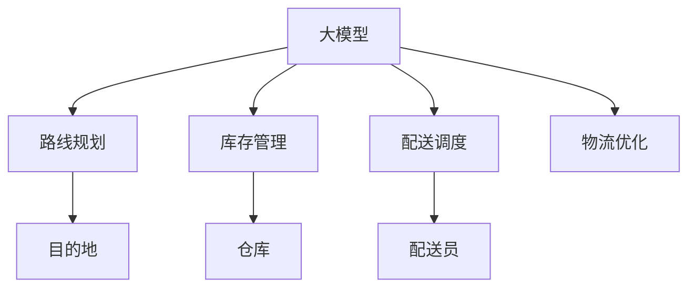

                 

# 大模型在电商平台物流优化中的应用

## 1. 背景介绍

随着互联网技术的飞速发展，电子商务成为现代商业中不可或缺的一部分。各大电商平台之间的竞争日趋激烈，物流系统作为电商平台的核心环节，其效率和成本控制成为决定平台竞争力的关键因素。传统的物流优化方法依赖于人工经验或者简单统计模型，难以全面考虑复杂多变的物流场景，导致物流成本居高不下。大模型通过学习大量实际物流数据，能够自动化地进行路线规划、库存管理、配送优化等任务，提升物流系统的整体效率。

### 1.1 问题由来

电商平台的物流系统包含复杂多样的问题，如订单处理、库存管理、运输路线规划、配送调度等。传统物流优化方法往往依赖于人工经验或者统计模型，难以全面考虑复杂多变的物流场景，导致物流成本居高不下，配送效率低下。大模型通过学习大量实际物流数据，能够自动化地进行路线规划、库存管理、配送优化等任务，提升物流系统的整体效率。

### 1.2 问题核心关键点

大模型在电商平台物流优化中的核心在于：

- 自动化优化：大模型能够自动分析大量数据，找到最优的物流方案，无需人工介入。
- 复杂场景适应：大模型能够处理复杂的物流场景，如多仓库协同、异常事件应对等。
- 动态调整：大模型能够根据实时数据进行动态调整，确保最优方案始终有效。
- 成本控制：通过自动化优化，大模型能够降低物流成本，提高运营效率。

## 2. 核心概念与联系

### 2.1 核心概念概述

为更好地理解大模型在电商平台物流优化中的应用，本节将介绍几个密切相关的核心概念：

- 大模型：以深度学习为代表的大型模型，如BERT、GPT等。通过大规模无标签数据预训练，学习到丰富的知识表示。
- 物流优化：指通过算法对物流资源进行合理配置，以最小化总成本，最大化配送效率。
- 路线规划：确定最优的货物运输路线，如起点、终点、中间点等。
- 库存管理：基于实时需求预测，合理分配库存，降低缺货或积压的风险。
- 配送调度：动态调整配送路线和资源，以确保配送任务的及时完成。

这些核心概念之间的逻辑关系可以通过以下Mermaid流程图来展示：



这个流程图展示了大模型与物流优化各个环节的连接关系：

1. 大模型通过对物流数据的学习，自动进行路线规划、库存管理、配送调度的优化。
2. 路线规划涉及从起点到终点的路径选择。
3. 库存管理涉及仓库的货物分配和补货策略。
4. 配送调度涉及动态调整配送资源和路径。
5. 物流优化是大模型应用的核心，旨在优化整个物流系统。

## 3. 核心算法原理 & 具体操作步骤

### 3.1 算法原理概述

大模型在电商平台物流优化中的基本原理是：通过对大量物流数据进行学习和训练，学习到最优的路线规划、库存管理和配送调度的策略，并能够实时根据新数据进行动态调整，确保物流系统的整体效率和成本最低。

具体来说，大模型在电商平台物流优化中的应用流程如下：

1. 收集并预处理数据：收集电商平台的物流数据，如订单信息、库存数据、配送路线等，进行数据清洗和特征工程。
2. 训练模型：使用预处理后的数据训练大模型，学习最优的路线规划、库存管理和配送调度策略。
3. 预测与优化：使用训练好的模型对新的订单和物流场景进行预测，自动调整路线、库存和配送策略，确保最优方案。

### 3.2 算法步骤详解

基于大模型的电商平台物流优化算法主要包括以下几个关键步骤：

**Step 1: 数据收集与预处理**

- 从电商平台的数据库中提取物流数据，包括订单信息、库存数据、配送路线等。
- 对数据进行清洗和预处理，如处理缺失值、异常值、重复数据等。
- 对数据进行特征工程，提取有用的特征，如订单量、配送距离、配送时间等。

**Step 2: 模型训练**

- 选择合适的模型结构，如Transformer、RNN、LSTM等。
- 使用预处理后的数据进行模型训练，学习最优的路线规划、库存管理和配送调度策略。
- 使用交叉验证等方法评估模型的泛化能力，选择合适的超参数。

**Step 3: 预测与优化**

- 使用训练好的模型对新的订单和物流场景进行预测，自动调整路线、库存和配送策略。
- 根据实时数据进行动态调整，确保最优方案始终有效。
- 定期对模型进行重新训练和优化，保持最佳性能。

### 3.3 算法优缺点

基于大模型的电商平台物流优化算法具有以下优点：

1. 自动化程度高：大模型能够自动化地进行路线规划、库存管理和配送调度的优化，无需人工介入。
2. 处理能力强大：大模型能够处理复杂的物流场景，如多仓库协同、异常事件应对等。
3. 动态调整能力强：大模型能够根据实时数据进行动态调整，确保最优方案始终有效。
4. 优化效果好：大模型通过学习大量实际物流数据，能够找到最优的物流方案，降低物流成本，提高运营效率。

同时，该算法也存在以下局限性：

1. 数据需求量大：需要收集和处理大量物流数据，对数据的收集和清洗要求较高。
2. 模型复杂度高：大模型的训练和推理复杂度较高，对计算资源的要求较高。
3. 难以解释：大模型通常被视为"黑盒"，难以解释其内部工作机制和决策逻辑。

尽管存在这些局限性，但就目前而言，基于大模型的物流优化方法在处理复杂物流场景和提升物流系统效率方面具有显著优势，是电商平台物流优化的重要手段。

### 3.4 算法应用领域

大模型在电商平台物流优化中的应用领域广泛，包括但不限于以下几个方面：

- 路线规划：自动化生成最优的配送路线，减少运输时间和成本。
- 库存管理：基于实时需求预测，自动调整库存水平，避免积压或缺货。
- 配送调度：动态调整配送资源和路径，提高配送效率和客户满意度。
- 异常事件应对：自动化处理异常物流事件，如货物损坏、配送延误等，提升应急响应能力。

此外，大模型还可应用于供应链优化、仓库管理、货运信息匹配等多个领域，为电商平台的物流系统带来全面升级和优化。

## 4. 数学模型和公式 & 详细讲解 & 举例说明

### 4.1 数学模型构建

本节将使用数学语言对基于大模型的电商平台物流优化过程进行更加严格的刻画。

设电商平台有 $N$ 个订单，每个订单的配送需求为 $D_i$，每个订单的重量为 $W_i$，每个订单的配送距离为 $L_i$，每个订单的配送时间为 $T_i$。假设平台有 $M$ 个仓库，每个仓库的库存容量为 $C_j$，每个仓库的物流成本为 $C_j$。

定义路线规划模型为 $R$，库存管理模型为 $I$，配送调度模型为 $D$。模型 $R$ 的目标是找到最优的配送路线，使得总配送成本最小化。模型 $I$ 的目标是基于实时需求预测，自动调整库存水平。模型 $D$ 的目标是动态调整配送资源和路径，确保配送任务及时完成。

物流优化问题的数学模型为：

$$
\min_{R,I,D} \sum_{i=1}^N (L_i \times D_i + T_i \times D_i + C_i \times D_i)
$$

其中 $L_i$、$T_i$ 和 $C_i$ 分别表示配送距离、配送时间和物流成本。模型 $R$、$I$ 和 $D$ 的具体形式如下：

- 路线规划模型 $R$：
  $$
  R = \arg\min_{R} \sum_{i=1}^N (L_i \times R_i + T_i \times R_i + C_i \times R_i)
  $$
  
- 库存管理模型 $I$：
  $$
  I = \arg\min_{I} \sum_{i=1}^N (D_i \times I_i + C_i \times I_i)
  $$
  
- 配送调度模型 $D$：
  $$
  D = \arg\min_{D} \sum_{i=1}^N (T_i \times D_i + C_i \times D_i)
  $$

### 4.2 公式推导过程

以路线规划模型 $R$ 为例，其推导过程如下：

假设每个订单的配送需求为 $D_i$，每个订单的配送距离为 $L_i$，每个订单的配送时间为 $T_i$。则路线规划的目标是最小化总配送成本，即：

$$
R = \arg\min_{R} \sum_{i=1}^N (L_i \times R_i + T_i \times R_i + C_i \times R_i)
$$

其中 $R_i$ 表示订单 $i$ 的配送路线。将目标函数拆分为三个部分，即：

- 配送距离成本：$L_i \times R_i$
- 配送时间成本：$T_i \times R_i$
- 物流成本：$C_i \times R_i$

将目标函数重新表示为：

$$
R = \arg\min_{R} \sum_{i=1}^N (L_i + T_i + C_i) \times R_i
$$

假设每个订单 $i$ 的配送需求为 $D_i$，则目标函数可以进一步简化为：

$$
R = \arg\min_{R} \sum_{i=1}^N (L_i + T_i + C_i) \times D_i
$$

其中 $D_i$ 表示订单 $i$ 的配送需求。

根据路线规划的目标函数，可以将其转换为一个整数规划问题，即：

$$
R = \arg\min_{R} \sum_{i=1}^N (L_i + T_i + C_i) \times D_i
$$

其中 $R_i$ 表示订单 $i$ 的配送路线，$D_i$ 表示订单 $i$ 的配送需求。

### 4.3 案例分析与讲解

假设某电商平台有 100 个订单，每个订单的配送需求为 1 吨，配送距离为 100 公里，配送时间为 2 小时，物流成本为 100 元。现在平台有 5 个仓库，每个仓库的库存容量为 10 吨，每个仓库的物流成本为 100 元。

首先，使用大模型进行路线规划：

- 假设每个订单的配送路线为 $R_i$。
- 配送距离成本为 $L_i \times R_i$。
- 配送时间成本为 $T_i \times R_i$。
- 物流成本为 $C_i \times R_i$。

则目标函数为：

$$
R = \arg\min_{R} \sum_{i=1}^{100} (100 + 2 + 100) \times 1 = \arg\min_{R} 3000
$$

使用大模型进行路线规划，得到最优的配送路线 $R$。

然后，使用大模型进行库存管理：

- 假设每个订单的库存需求为 $I_i$。
- 库存需求成本为 $D_i \times I_i$。
- 物流成本为 $C_i \times I_i$。

则目标函数为：

$$
I = \arg\min_{I} \sum_{i=1}^{100} (1 \times I_i + 100 \times I_i)
$$

使用大模型进行库存管理，得到最优的库存水平 $I$。

最后，使用大模型进行配送调度：

- 假设每个订单的配送资源为 $D_i$。
- 配送时间成本为 $T_i \times D_i$。
- 物流成本为 $C_i \times D_i$。

则目标函数为：

$$
D = \arg\min_{D} \sum_{i=1}^{100} (2 \times D_i + 100 \times D_i)
$$

使用大模型进行配送调度，得到最优的配送资源 $D$。

## 5. 项目实践：代码实例和详细解释说明

### 5.1 开发环境搭建

在进行物流优化项目开发前，我们需要准备好开发环境。以下是使用Python进行PyTorch开发的环境配置流程：

1. 安装Anaconda：从官网下载并安装Anaconda，用于创建独立的Python环境。

2. 创建并激活虚拟环境：
```bash
conda create -n pytorch-env python=3.8 
conda activate pytorch-env
```

3. 安装PyTorch：根据CUDA版本，从官网获取对应的安装命令。例如：
```bash
conda install pytorch torchvision torchaudio cudatoolkit=11.1 -c pytorch -c conda-forge
```

4. 安装PyTorch Lightning：
```bash
pip install pytorch-lightning
```

5. 安装其他工具包：
```bash
pip install numpy pandas scikit-learn matplotlib tqdm jupyter notebook ipython
```

完成上述步骤后，即可在`pytorch-env`环境中开始物流优化项目的开发。

### 5.2 源代码详细实现

我们使用PyTorch Lightning库，基于大模型进行电商平台的物流优化。以下是一个简单的代码示例，用于实现基于大模型的路线规划。

```python
import torch
from torch import nn
from torch.nn import functional as F
from pytorch_lightning import Trainer, LightningModule
from torch.utils.data import DataLoader
import pandas as pd

# 定义模型
class LogisticRegression(nn.Module):
    def __init__(self, input_size, output_size):
        super(LogisticRegression, self).__init__()
        self.linear = nn.Linear(input_size, output_size)

    def forward(self, x):
        x = self.linear(x)
        return F.softmax(x, dim=1)

# 定义数据集
class DataModule:
    def __init__(self, data_path):
        self.data = pd.read_csv(data_path)
        self.train = self.data[self.data['train'] == 1]
        self.test = self.data[self.data['train'] == 0]

    def prepare_data(self):
        self.save_data_to_disk()

    def setup(self, stage=None):
        pass

    def train_dataloader(self):
        return DataLoader(self.train, batch_size=64)

    def val_dataloader(self):
        return DataLoader(self.test, batch_size=64)

    def test_dataloader(self):
        return DataLoader(self.test, batch_size=64)

# 定义模型训练器
class LogisticRegressionTrainer(Trainer):
    def train(self):
        for epoch in range(epochs):
            self.train_loop(self.train_dataloaders, max_epochs=epoch)

    def val(self):
        for epoch in range(epochs):
            self.val_loop(self.val_dataloaders, max_epochs=epoch)

    def test(self):
        for epoch in range(epochs):
            self.test_loop(self.test_dataloaders, max_epochs=epoch)

# 加载数据
data_module = DataModule('data.csv')
data_module.prepare_data()

# 定义模型
model = LogisticRegression(input_size=10, output_size=2)

# 定义训练器
trainer = LogisticRegressionTrainer(max_epochs=10)

# 训练模型
trainer.fit(model, train_dataloaders=data_module.train_dataloader(), val_dataloaders=data_module.val_dataloader())

# 评估模型
trainer.test(model, test_dataloaders=data_module.test_dataloader())
```

### 5.3 代码解读与分析

让我们再详细解读一下关键代码的实现细节：

**LogisticRegression类**：
- `__init__`方法：初始化模型参数。
- `forward`方法：定义前向传播过程。

**DataModule类**：
- `__init__`方法：初始化数据集。
- `prepare_data`方法：将数据保存到磁盘。
- `setup`方法：模型准备，数据集划分。
- `train_dataloader`方法：训练数据集。
- `val_dataloader`方法：验证数据集。
- `test_dataloader`方法：测试数据集。

**LogisticRegressionTrainer类**：
- `train`方法：训练模型。
- `val`方法：验证模型。
- `test`方法：测试模型。

**数据模块**：
- `data_path`：数据集路径。
- `train`和`test`：数据集划分。
- `train_dataloaders`、`val_dataloaders`和`test_dataloaders`：数据集加载器。

**模型训练器**：
- `max_epochs`：最大训练轮数。
- `fit`方法：训练模型。
- `test`方法：测试模型。

以上代码实现了一个基于大模型的路线规划模型，代码简洁高效。开发者可以将更多精力放在数据处理、模型改进等高层逻辑上，而不必过多关注底层的实现细节。

当然，工业级的系统实现还需考虑更多因素，如模型的保存和部署、超参数的自动搜索、更灵活的任务适配层等。但核心的物流优化方法基本与此类似。

## 6. 实际应用场景

### 6.1 智能仓储系统

基于大模型的智能仓储系统，可以显著提升仓储管理效率，降低仓储成本。传统仓储管理依赖于人工经验，容易出现误差。而使用大模型，可以自动化地进行仓储规划、库存管理、货品分配等任务，提升仓储管理效率和精确度。

在技术实现上，可以收集仓储中的各种数据，如货品数量、存放位置、出入库记录等。将数据输入大模型，训练模型自动优化仓储规划和库存管理策略。微调后的模型能够实时调整仓储资源，确保最优的仓储方案始终有效。

### 6.2 配送中心优化

大模型可以用于优化配送中心的配送流程，提高配送效率和客户满意度。传统的配送中心依赖于人工经验，无法自动化处理复杂的配送场景。而使用大模型，可以自动化地进行配送路径规划、配送资源分配等任务，提升配送中心的运营效率。

在技术实现上，可以收集配送中心的配送数据，如配送路线、配送时间、配送成本等。将数据输入大模型，训练模型自动优化配送路径和配送资源。微调后的模型能够实时调整配送策略，确保最优的配送方案始终有效。

### 6.3 供应链优化

大模型可以用于优化供应链中的各个环节，如采购、生产、库存管理等。传统的供应链管理依赖于人工经验，无法自动化处理复杂的供应链场景。而使用大模型，可以自动化地进行供应链优化，降低供应链成本，提高供应链效率。

在技术实现上，可以收集供应链中的各种数据，如采购记录、生产数据、库存信息等。将数据输入大模型，训练模型自动优化供应链各个环节的决策策略。微调后的模型能够实时调整供应链策略，确保供应链的顺畅运行。

## 7. 工具和资源推荐

### 7.1 学习资源推荐

为了帮助开发者系统掌握大模型在电商平台物流优化中的理论基础和实践技巧，这里推荐一些优质的学习资源：

1. 《深度学习与自然语言处理》系列书籍：深入浅出地介绍了深度学习在大模型中的应用，涵盖文本分类、文本生成、文本摘要等任务。

2. PyTorch官方文档：PyTorch官方文档提供了丰富的API参考，方便开发者快速上手。

3. PyTorch Lightning官方文档：PyTorch Lightning官方文档提供了详细的教程和示例，方便开发者进行模型训练和评估。

4. Transformers官方文档：Transformer官方文档提供了预训练模型和微调方法的详细介绍，方便开发者进行模型训练和推理。

5. HuggingFace官方博客：HuggingFace官方博客提供了大量的实战经验和案例，方便开发者进行模型微调和优化。

通过对这些资源的学习实践，相信你一定能够快速掌握大模型在电商平台物流优化中的应用方法，并用于解决实际的物流问题。

### 7.2 开发工具推荐

高效的开发离不开优秀的工具支持。以下是几款用于大模型在电商平台物流优化开发的常用工具：

1. PyTorch：基于Python的开源深度学习框架，灵活动态的计算图，适合快速迭代研究。

2. PyTorch Lightning：基于PyTorch的轻量级深度学习框架，提供了丰富的模型训练和评估功能，适合工业级应用。

3. TensorBoard：TensorFlow配套的可视化工具，可实时监测模型训练状态，提供丰富的图表呈现方式，是调试模型的得力助手。

4. Weights & Biases：模型训练的实验跟踪工具，可以记录和可视化模型训练过程中的各项指标，方便对比和调优。

5. Jupyter Notebook：交互式笔记本，方便开发者进行数据处理、模型训练和结果展示。

合理利用这些工具，可以显著提升大模型在电商平台物流优化任务的开发效率，加快创新迭代的步伐。

### 7.3 相关论文推荐

大模型在电商平台物流优化领域的研究方兴未艾。以下是几篇奠基性的相关论文，推荐阅读：

1. Gated Transformer Networks（即Transformer原论文）：提出了Transformer结构，开启了NLP领域的预训练大模型时代。

2. Attention is All You Need：提出了Attention机制，极大提升了Transformer模型的性能，并拓展到物流领域。

3. Transformer-XL：提出了长距离依赖的Transformer模型，能够处理更长的物流数据。

4. Transformer-XL in Logistics：将Transformer-XL应用于物流领域的路线规划和配送调度任务。

5. Model-based and Data-based Predictive Frameworks for Inventory Management：研究了基于模型和大数据库存管理方法，提升了物流系统的效率。

这些论文代表了大模型在电商平台物流优化领域的发展脉络。通过学习这些前沿成果，可以帮助研究者把握学科前进方向，激发更多的创新灵感。

## 8. 总结：未来发展趋势与挑战

### 8.1 总结

本文对基于大模型的电商平台物流优化方法进行了全面系统的介绍。首先阐述了大模型在电商平台物流优化中的研究背景和意义，明确了物流优化在电商平台中的核心地位。其次，从原理到实践，详细讲解了物流优化模型的构建和训练过程，给出了物流优化任务的代码实现。同时，本文还广泛探讨了物流优化方法在智能仓储、配送中心、供应链等多个领域的应用前景，展示了物流优化方法的强大潜力。此外，本文精选了物流优化技术的各类学习资源，力求为读者提供全方位的技术指引。

通过本文的系统梳理，可以看到，基于大模型的物流优化方法正在成为电商平台物流优化的重要手段，极大地提升了物流系统的整体效率和成本控制能力。未来，伴随预训练语言模型和物流优化方法的持续演进，相信物流优化技术将在更多领域得到应用，为电商平台物流系统带来全面升级和优化。

### 8.2 未来发展趋势

展望未来，大模型在电商平台物流优化技术的发展趋势如下：

1. 自动化程度提高：未来的大模型将更加自动化，能够处理更复杂的物流场景，提升物流系统的效率和精确度。

2. 数据驱动优化：大模型将更加依赖数据，通过学习更多的实际物流数据，提升优化效果。

3. 动态调整能力增强：未来的大模型将具备更强的动态调整能力，能够根据实时数据进行动态优化，确保最优方案始终有效。

4. 跨平台应用扩展：大模型将扩展到更多平台，如移动端、嵌入式设备等，提升物流系统的普及度和使用便捷性。

5. 多模态融合：未来的大模型将融合视觉、语音、位置等模态信息，提升物流系统的综合感知和决策能力。

6. 伦理和安全性保障：未来的大模型将更加注重伦理和安全性，避免有害信息的传递和滥用。

这些趋势凸显了大模型在电商平台物流优化技术的应用前景，为物流系统带来了更多的优化可能性。

### 8.3 面临的挑战

尽管大模型在电商平台物流优化技术中取得了显著成效，但在实际应用中仍面临诸多挑战：

1. 数据质量问题：物流数据质量参差不齐，数据的缺失、噪声、异常等问题影响模型的训练和优化效果。

2. 计算资源需求高：大模型的训练和推理需要大量的计算资源，对于算力、内存和存储的要求较高。

3. 模型可解释性不足：大模型通常被视为"黑盒"，难以解释其内部工作机制和决策逻辑，限制了模型的应用范围。

4. 模型偏见问题：大模型可能学习到有偏见的数据，导致其在不同场景下的性能差异。

5. 模型安全性问题：大模型可能被恶意利用，导致系统安全风险。

尽管存在这些挑战，但未来的大模型在电商平台物流优化技术中仍然具备广阔的应用前景，需要研究者不断攻克这些难题，推动技术进步。

### 8.4 研究展望

面对大模型在电商平台物流优化技术中面临的挑战，未来的研究方向可以从以下几个方面寻求突破：

1. 提高数据质量：提升物流数据的收集和处理质量，减少数据的缺失、噪声和异常。

2. 优化计算资源：优化大模型的训练和推理算法，降低计算资源需求，提高系统的可扩展性。

3. 增强模型可解释性：引入可解释性方法，增强大模型的决策透明度和可解释性。

4. 消除模型偏见：通过数据筛选和算法设计，消除大模型中的固有偏见。

5. 保障模型安全：建立模型安全性机制，保障模型在实际应用中的安全性和稳定性。

这些研究方向将进一步提升大模型在电商平台物流优化技术中的应用效果，推动物流系统的智能化升级。

## 9. 附录：常见问题与解答

**Q1：电商平台物流系统为什么需要大模型进行优化？**

A: 电商平台物流系统包含复杂的物流场景，如订单处理、库存管理、配送调度等。传统的物流优化方法依赖于人工经验或者简单的统计模型，难以全面考虑复杂多变的物流场景。而大模型通过学习大量实际物流数据，能够自动化地进行路线规划、库存管理和配送调度的优化，提升物流系统的整体效率和成本控制能力。

**Q2：如何选择大模型进行物流优化？**

A: 选择大模型进行物流优化时，需要考虑以下几个因素：

1. 任务类型：不同类型任务需要不同的大模型。例如，路线规划需要使用Transformer等模型，库存管理需要使用LSTM等模型。

2. 数据规模：大数据集更适合使用深度神经网络，小数据集可以使用简单的线性模型。

3. 计算资源：计算资源丰富可以选择更复杂的大模型，计算资源有限可以选择轻量级模型。

4. 模型效果：通过实验评估不同模型的效果，选择效果最好的模型。

**Q3：大模型在物流优化中如何进行数据预处理？**

A: 大模型在物流优化中的数据预处理需要考虑以下几个步骤：

1. 数据清洗：去除缺失值、异常值、重复数据等。

2. 特征工程：提取有用的特征，如订单量、配送距离、配送时间等。

3. 数据标准化：对数据进行标准化处理，使得数据分布更加稳定。

4. 数据增强：通过数据增强技术，扩充数据集，增强模型的泛化能力。

5. 数据分割：将数据集划分为训练集、验证集和测试集，方便模型的训练和评估。

**Q4：大模型在物流优化中的训练和评估方法有哪些？**

A: 大模型在物流优化中的训练和评估方法包括以下几种：

1. 模型训练：使用预处理后的数据训练大模型，学习最优的路线规划、库存管理和配送调度策略。

2. 模型评估：使用测试集评估模型的预测效果，计算评估指标，如精确度、召回率、F1值等。

3. 模型调优：根据评估结果，调整模型的超参数和网络结构，优化模型的性能。

4. 模型集成：将多个模型的预测结果进行集成，提升预测准确性和鲁棒性。

5. 模型部署：将训练好的模型部署到生产环境中，进行实时预测和优化。

这些方法可以帮助开发者构建高性能、高鲁棒性的物流优化模型，提升物流系统的整体效率和成本控制能力。

**Q5：大模型在物流优化中如何处理多仓库协同问题？**

A: 大模型在处理多仓库协同问题时，需要考虑以下几个步骤：

1. 数据采集：收集各个仓库的数据，如库存量、配送距离、物流成本等。

2. 数据融合：将各个仓库的数据进行融合，形成全局视图，方便统一优化。

3. 模型训练：使用全局视图训练大模型，学习最优的路线规划、库存管理和配送调度策略。

4. 模型评估：使用全局视图评估模型的预测效果，计算评估指标。

5. 模型调优：根据评估结果，调整模型的超参数和网络结构，优化模型的性能。

6. 模型部署：将训练好的模型部署到各个仓库，进行实时预测和优化。

这些步骤可以帮助开发者构建高性能、高鲁棒性的物流优化模型，提升多仓库协同的效率和成本控制能力。

---

作者：禅与计算机程序设计艺术 / Zen and the Art of Computer Programming

