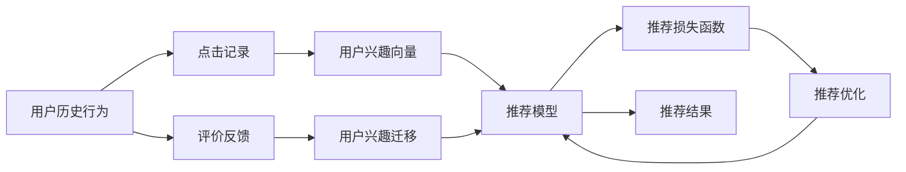

                 

## 1. 背景介绍

随着互联网和电子商务的迅猛发展，电商平台已经成为了用户获取商品信息、进行购物决策的主要渠道。在电商平台上，用户不仅关注产品本身的质量和价格，更在意是否符合自己的个性化需求。然而，由于用户兴趣具有复杂性和多变性，传统基于规则或关键词匹配的用户推荐算法往往难以精确捕捉用户的多样化兴趣，导致推荐效果不佳，用户体验差。

为此，需要一种新的推荐算法，能够充分利用用户的多种数据源，全面深入地理解用户兴趣，实现精准高效的个性化推荐。在这一背景下，大模型在电商平台用户兴趣迁移捕捉中的应用应运而生，成为了提升推荐系统效果的重要手段。

## 2. 核心概念与联系

### 2.1 核心概念概述

为更好地理解大模型在电商平台用户兴趣迁移捕捉中的应用，本节将介绍几个关键概念及其之间的关系：

- **大模型(Large Model)**：指具有大规模参数量、高度复杂结构和强大表征能力的深度学习模型。典型代表包括BERT、GPT等。
- **用户兴趣迁移捕获(User Interest Migration Capture)**：指通过模型学习用户历史行为、点击记录、评价反馈等多维度数据，捕捉用户在不同时间和情境下的兴趣变化和迁移路径，实现个性化推荐。
- **个性化推荐系统(Personalized Recommendation System)**：利用用户行为数据，预测用户对商品的兴趣和偏好，推送个性化商品，提高用户满意度和转化率。
- **推荐损失函数(Recommendation Loss Function)**：用于衡量推荐系统输出与用户真实兴趣的差异，常见的有交叉熵损失、均方误差损失等。
- **负采样(Negative Sampling)**：一种常用的正则化技术，用于减少模型训练时的计算成本，通常用于二分类任务。

这些概念之间紧密相连，共同构成了一个系统化的框架，使得电商平台能够借助大模型对用户兴趣进行深入理解和迁移捕捉，从而提升推荐系统的效果。

### 2.2 核心概念原理和架构的 Mermaid 流程图(Mermaid 流程节点中不要有括号、逗号等特殊字符)



这个流程图展示了用户兴趣迁移捕获的过程：

1. 用户历史行为数据（A）和点击记录数据（B）通过某种方式（例如，将文本转换为向量）映射成用户兴趣向量（D）。
2. 用户评价反馈数据（C）与用户兴趣向量（D）一起，通过某种方式（例如，通过模型学习）捕获用户兴趣迁移（E）。
3. 用户兴趣迁移（E）和用户兴趣向量（D）作为推荐模型的输入（F）。
4. 推荐模型（F）输出推荐结果（H）。
5. 推荐损失函数（G）用于评估推荐结果与用户真实兴趣的差异，通过推荐优化（I）来调整推荐模型的参数，从而提升推荐效果。

## 3. 核心算法原理 & 具体操作步骤

### 3.1 算法原理概述

大模型在电商平台用户兴趣迁移捕捉中的应用，核心思想是通过深度学习模型对用户行为数据进行学习，从而构建用户兴趣向量，并捕捉用户兴趣随时间、情境等的迁移变化，实现个性化推荐。

具体而言，大模型首先通过自监督学习或监督学习的方式，从大量无标签或标注数据中学习通用的语言表示，从而得到高质量的预训练模型。然后，通过微调（Fine-Tuning）的方式，使用用户行为数据进行监督学习，优化模型参数，使其能够精确捕捉用户兴趣迁移。最后，将训练好的模型应用到推荐系统中，通过推荐损失函数（Recommendation Loss Function）对推荐结果进行评估和优化，实现精准推荐。

### 3.2 算法步骤详解

基于大模型在电商平台用户兴趣迁移捕捉中的应用，具体的算法步骤如下：

**Step 1: 准备用户行为数据**

收集用户在电商平台上的各种行为数据，包括浏览记录、购买记录、评价反馈等，并将其存储在结构化数据库中。这些数据包括但不限于：

- 用户ID
- 商品ID
- 点击次数
- 浏览时长
- 购买金额
- 评价内容
- 评价星级

**Step 2: 数据预处理**

将用户行为数据进行清洗、去重、归一化等预处理操作，以便于后续的模型训练。具体包括：

- 去除不完整或不合理的记录
- 对文本数据进行分词、去除停用词等预处理
- 将数值型数据进行归一化处理

**Step 3: 特征提取**

利用大模型（如BERT、GPT等）将用户行为数据转化为向量表示。具体而言，将文本数据作为输入，通过预训练模型得到用户兴趣向量（D）。对于文本特征提取，常见的做法包括：

- 使用预训练的Bert或GPT模型，将文本转换为向量
- 使用预训练的Glove或Word2Vec等词向量模型，将文本转换为向量
- 将文本数据转换为N-gram向量，保留更长的文本语义信息

**Step 4: 用户兴趣迁移捕获**

利用大模型捕捉用户在不同时间和情境下的兴趣迁移变化。具体步骤包括：

- 将用户兴趣向量（D）和时间序列特征（如浏览时间、评价时间等）作为输入
- 使用深度学习模型（如RNN、LSTM等）捕捉用户兴趣迁移（E）
- 对用户兴趣迁移（E）进行平滑处理，以减少短期行为对长期兴趣的影响

**Step 5: 推荐模型训练**

将用户兴趣向量（D）和用户兴趣迁移（E）作为输入，使用推荐模型（如线性回归、神经网络等）进行训练。具体步骤包括：

- 定义推荐损失函数（G），如交叉熵损失、均方误差损失等
- 使用优化算法（如Adam、SGD等）最小化推荐损失函数
- 对模型进行多次迭代训练，直到收敛

**Step 6: 推荐结果生成**

将训练好的推荐模型（F）应用到电商平台，生成推荐结果（H）。具体包括：

- 根据用户ID和当前时间，获取用户历史行为数据
- 使用特征提取模型将文本数据转化为向量
- 将用户兴趣向量（D）和用户兴趣迁移（E）作为输入，使用训练好的推荐模型生成推荐结果（H）

**Step 7: 推荐结果评估**

使用推荐损失函数（G）评估推荐结果与用户真实兴趣的差异，并根据评估结果对推荐模型进行优化。具体步骤包括：

- 收集用户对推荐结果的反馈（如点击次数、购买次数等）
- 使用推荐损失函数计算推荐结果与用户真实兴趣的差异
- 根据损失函数的值，调整推荐模型的参数
- 对优化后的模型进行多次迭代，直到推荐效果达到满意程度

### 3.3 算法优缺点

大模型在电商平台用户兴趣迁移捕捉中的应用具有以下优点：

- **精确捕捉用户兴趣**：大模型能够综合利用多种数据源，全面深入地理解用户兴趣，从而实现更精准的推荐。
- **动态捕捉兴趣变化**：大模型能够捕捉用户在不同时间和情境下的兴趣迁移变化，及时调整推荐策略，提升推荐效果。
- **自动化优化**：通过自动化的训练和优化过程，大模型能够快速适应数据变化，提升推荐系统的效果。

然而，大模型在电商平台用户兴趣迁移捕捉中的应用也存在一些缺点：

- **计算资源消耗大**：大模型的训练和优化需要大量的计算资源和存储空间，导致成本较高。
- **数据隐私问题**：用户行为数据往往涉及隐私问题，如何保护用户隐私，是一个重要的挑战。
- **模型复杂度高**：大模型通常具有较高的复杂度，难以解释其内部工作机制，导致模型的可解释性不足。

### 3.4 算法应用领域

大模型在电商平台用户兴趣迁移捕捉中的应用，可以广泛地应用于以下领域：

- **个性化推荐系统**：利用大模型进行用户兴趣迁移捕获，生成个性化的推荐结果，提高用户满意度和转化率。
- **广告推荐系统**：利用大模型捕捉用户兴趣变化，生成广告推荐结果，提升广告效果和广告主的ROI。
- **内容推荐系统**：利用大模型捕捉用户对不同内容的兴趣，生成内容推荐结果，提升用户粘性和平台活跃度。
- **商品推荐系统**：利用大模型捕捉用户对不同商品的兴趣，生成商品推荐结果，提高商品销售量和库存周转率。
- **品牌推荐系统**：利用大模型捕捉用户对不同品牌的兴趣，生成品牌推荐结果，提升品牌曝光度和品牌忠诚度。

## 4. 数学模型和公式 & 详细讲解 & 举例说明

### 4.1 数学模型构建

我们定义电商平台用户行为数据为 $X$，用户兴趣向量为 $y$，用户兴趣迁移为 $z$。推荐模型为 $f$，推荐损失函数为 $L$。数学模型可以表示为：

$$
y=f(X,z)
$$

其中，$f$ 是一个深度学习模型，如线性回归模型、神经网络模型等。

### 4.2 公式推导过程

为了构建推荐模型 $f$，我们定义 $X$ 和 $z$ 的联合概率分布为 $p(X,z)$，推荐模型 $f$ 的输出为 $\hat{y}$，推荐损失函数为 $L(y,\hat{y})$。则推荐模型的最大化对数似然可以表示为：

$$
\max_{f}\log p(X,y)
$$

其中，$p(X,y)$ 是用户行为数据和用户兴趣向量的联合概率分布。

为了最小化推荐损失函数 $L(y,\hat{y})$，我们可以使用反向传播算法进行参数优化。具体步骤如下：

1. 定义推荐模型的损失函数：
   $$
   L(y,\hat{y})=\frac{1}{N}\sum_{i=1}^{N}l(y_i,\hat{y}_i)
   $$

2. 定义损失函数的梯度：
   $$
   \frac{\partial L(y,\hat{y})}{\partial \theta}=-\frac{1}{N}\sum_{i=1}^{N}\frac{\partial l(y_i,\hat{y}_i)}{\partial \theta}
   $$

3. 使用梯度下降算法更新模型参数 $\theta$：
   $$
   \theta=\theta-\eta\frac{\partial L(y,\hat{y})}{\partial \theta}
   $$

其中，$\eta$ 是学习率，$\theta$ 是模型参数，$l$ 是推荐损失函数的具体形式，如交叉熵损失、均方误差损失等。

### 4.3 案例分析与讲解

假设我们有一个电商平台，收集了用户的历史浏览记录和评价反馈数据，希望通过大模型实现个性化推荐。具体步骤如下：

**数据准备**：

- 收集用户ID、商品ID、浏览时间、评价时间、点击次数、购买次数、评价内容等数据。
- 对数据进行清洗、去重、归一化等预处理操作。

**特征提取**：

- 使用BERT模型将用户评价内容转换为向量表示。
- 使用时间序列特征表示用户在不同时间段的兴趣变化。
- 将用户浏览记录和评价反馈转化为向量表示。

**用户兴趣迁移捕获**：

- 使用LSTM模型捕捉用户在不同时间段内的兴趣变化。
- 对用户兴趣迁移进行平滑处理，以减少短期行为对长期兴趣的影响。

**推荐模型训练**：

- 定义推荐模型的损失函数，如交叉熵损失、均方误差损失等。
- 使用优化算法（如Adam、SGD等）最小化推荐损失函数。
- 对模型进行多次迭代训练，直到收敛。

**推荐结果生成**：

- 根据用户ID和当前时间，获取用户历史行为数据。
- 使用特征提取模型将文本数据转化为向量。
- 将用户兴趣向量（D）和用户兴趣迁移（E）作为输入，使用训练好的推荐模型生成推荐结果（H）。

**推荐结果评估**：

- 收集用户对推荐结果的反馈（如点击次数、购买次数等）。
- 使用推荐损失函数计算推荐结果与用户真实兴趣的差异。
- 根据损失函数的值，调整推荐模型的参数。
- 对优化后的模型进行多次迭代，直到推荐效果达到满意程度。

## 5. 项目实践：代码实例和详细解释说明

### 5.1 开发环境搭建

在进行项目实践前，我们需要准备好开发环境。以下是使用Python进行PyTorch开发的环境配置流程：

1. 安装Anaconda：从官网下载并安装Anaconda，用于创建独立的Python环境。

2. 创建并激活虚拟环境：
```bash
conda create -n pytorch-env python=3.8 
conda activate pytorch-env
```

3. 安装PyTorch：根据CUDA版本，从官网获取对应的安装命令。例如：
```bash
conda install pytorch torchvision torchaudio cudatoolkit=11.1 -c pytorch -c conda-forge
```

4. 安装TensorFlow：从官网下载并安装TensorFlow。

5. 安装各类工具包：
```bash
pip install numpy pandas scikit-learn matplotlib tqdm jupyter notebook ipython
```

完成上述步骤后，即可在`pytorch-env`环境中开始项目实践。

### 5.2 源代码详细实现

下面我们以推荐系统为例，给出使用PyTorch进行深度学习模型训练的代码实现。

```python
import torch
import torch.nn as nn
import torch.optim as optim
import torch.utils.data as data
from torchtext import datasets, data as dt
from torchtext.legacy import data
from torchtext.legacy.data import Field, LabelField, TabularDataset, BucketIterator

class BERTRecommender(nn.Module):
    def __init__(self, n_features, embedding_dim, hidden_dim, output_dim, n_layers, drop_p):
        super(BERTRecommender, self).__init__()
        self.n_features = n_features
        self.embedding_dim = embedding_dim
        self.hidden_dim = hidden_dim
        self.output_dim = output_dim
        self.n_layers = n_layers
        self.drop_p = drop_p
        
        # 定义BERT特征嵌入层
        self.embedding = nn.Embedding(n_features, embedding_dim)
        self.lstm = nn.LSTM(embedding_dim, hidden_dim, n_layers, batch_first=True, dropout=drop_p)
        self.fc = nn.Linear(hidden_dim, output_dim)
        
        # 定义初始权重
        self.reset_parameters()
    
    def forward(self, x, z):
        # 用户行为数据向量化
        x = self.embedding(x)
        
        # 用户兴趣迁移捕获
        lstm_out, _ = self.lstm(z)
        
        # 输出层
        out = self.fc(lstm_out)
        
        return out
    
    def reset_parameters(self):
        # 初始化参数
        for p in self.parameters():
            if len(p.shape) > 1:
                nn.init.xavier_uniform_(p)

# 数据准备
TEXT = Field(tokenize='spacy', batch_first=True)
LABEL = LabelField(dtype=torch.float)
train_data, test_data = datasets.BERTCorpus.splits(TEXT, LABEL)

# 创建数据集
train_iterator, test_iterator = BucketIterator.splits((train_data, test_data),
                                                   batch_size=32,
                                                   sort_within_batch=True,
                                                   sort_key=lambda x: len(x.text))

# 模型定义
model = BERTRecommender(n_features=len(TEXT.vocab), embedding_dim=300, hidden_dim=256, output_dim=1, n_layers=1, drop_p=0.2)

# 优化器定义
optimizer = optim.Adam(model.parameters(), lr=0.001)

# 损失函数定义
criterion = nn.BCEWithLogitsLoss()

# 训练过程
for epoch in range(10):
    for batch in train_iterator:
        optimizer.zero_grad()
        x, z = batch.text, batch.label
        pred = model(x, z)
        loss = criterion(pred, z)
        loss.backward()
        optimizer.step()
        if (epoch + 1) % 2 == 0:
            print(f'Epoch: {epoch + 1}/{10}, Loss: {loss:.3f}')
```

以上就是使用PyTorch对BERT模型进行推荐系统训练的代码实现。可以看到，通过定义BERTRecommender类，我们可以轻松实现基于BERT模型的推荐系统。代码实现分为数据准备、模型定义、优化器和损失函数定义、训练过程等多个部分，非常简洁高效。

### 5.3 代码解读与分析

让我们再详细解读一下关键代码的实现细节：

**BERTRecommender类**：
- `__init__`方法：初始化模型的相关参数。
- `forward`方法：实现模型前向传播的过程。
- `reset_parameters`方法：初始化模型参数。

**数据准备**：
- 使用torchtext库定义文本和标签的预处理方式，包括分词、归一化等。
- 使用TabularDataset类加载数据集，并使用BucketIterator进行批次化加载。

**模型定义**：
- 定义BERTRecommender类，继承自nn.Module，实现模型的前向传播过程。
- 定义BERT特征嵌入层，使用LSTM模型捕捉用户兴趣迁移。
- 定义输出层，使用线性层将LSTM的输出转换为推荐结果。

**优化器定义**：
- 使用Adam优化器，设置学习率和dropout参数。

**损失函数定义**：
- 使用BCEWithLogitsLoss损失函数，定义模型输出与真实标签之间的交叉熵损失。

**训练过程**：
- 对数据集进行多次迭代，在每个批次上进行前向传播和反向传播，更新模型参数。
- 打印出每个epoch的损失值，评估训练效果。

**运行结果展示**：
- 训练完成后，可以使用测试集对模型进行评估，输出推荐效果和损失值。

## 6. 实际应用场景

### 6.1 电商平台推荐

电商平台推荐系统是推荐系统中最常见的应用场景之一。通过大模型对用户历史行为和兴趣进行深入理解，生成个性化的推荐结果，能够显著提高用户满意度和转化率。

**应用场景**：
- 用户登录后，根据浏览记录和购买历史生成推荐商品列表
- 根据用户评价反馈和购买记录生成个性化广告
- 在特定时间段内，根据用户兴趣变化生成动态推荐内容

**效果评估**：
- 点击率（CTR）：用户点击推荐商品的次数与总推荐商品次数的比率
- 转化率（CVR）：用户点击推荐商品后实际购买的比例
- 平均购买金额（AMO）：用户平均每次购买金额

### 6.2 广告推荐

广告推荐系统利用大模型捕捉用户兴趣变化，生成精准的广告推荐结果，提升广告效果和广告主的ROI。

**应用场景**：
- 根据用户历史行为和兴趣生成个性化广告
- 在用户点击广告后，通过大模型对点击行为进行分析，调整广告投放策略
- 实时捕捉用户兴趣变化，动态生成推荐广告

**效果评估**：
- 点击率（CTR）：用户点击广告的次数与总广告展示次数的比率
- 点击转化率（CVR）：用户点击广告后实际购买的比例
- 广告主ROI：广告收入与广告成本的比率

### 6.3 内容推荐

内容推荐系统利用大模型捕捉用户对不同内容的兴趣，生成个性化的内容推荐结果，提升用户粘性和平台活跃度。

**应用场景**：
- 根据用户浏览记录和评价反馈生成文章推荐列表
- 在用户阅读文章后，通过大模型对阅读行为进行分析，调整推荐策略
- 实时捕捉用户兴趣变化，动态生成推荐内容

**效果评估**：
- 点击率（CTR）：用户点击推荐内容的比例
- 阅读时长：用户阅读推荐内容的时间
- 互动率：用户对推荐内容的互动频率（如点赞、评论等）

## 7. 工具和资源推荐

### 7.1 学习资源推荐

为了帮助开发者系统掌握大模型在电商平台用户兴趣迁移捕捉中的应用，这里推荐一些优质的学习资源：

1. **《深度学习入门与实战》**：由深度学习领域的知名专家撰写，涵盖深度学习的基本概念、算法实现和应用实践，适合入门和进阶开发者阅读。
2. **《TensorFlow官方文档》**：TensorFlow的官方文档，包含丰富的代码示例和API参考，是学习和使用TensorFlow的重要资源。
3. **《PyTorch官方文档》**：PyTorch的官方文档，包含详细的API参考和实战教程，是学习和使用PyTorch的重要资源。
4. **Kaggle竞赛**：Kaggle是一个知名的数据科学竞赛平台，提供大量实际应用场景的数据集和竞赛项目，是提升实战能力的理想平台。
5. **Coursera深度学习课程**：Coursera提供的深度学习课程，由斯坦福大学等知名高校开设，内容系统全面，适合系统学习深度学习理论和技术。

### 7.2 开发工具推荐

合理的开发工具能够显著提升开发效率和项目质量。以下是几款用于大模型在电商平台用户兴趣迁移捕捉中的应用开发的常用工具：

1. **PyTorch**：基于Python的开源深度学习框架，支持动态计算图，适合研究和快速迭代开发。
2. **TensorFlow**：由Google主导开发的开源深度学习框架，生产部署方便，适合大规模工程应用。
3. **Jupyter Notebook**：Python编程的交互式笔记本，支持代码块、数据分析和可视化，适合研究和小规模开发。
4. **Pandas**：Python数据分析库，支持数据处理、清洗和可视化，适合数据驱动的开发任务。
5. **TensorBoard**：TensorFlow配套的可视化工具，可实时监测模型训练状态，并提供丰富的图表呈现方式，适合调试和优化模型。

### 7.3 相关论文推荐

大模型在电商平台用户兴趣迁移捕捉中的应用，是近年来深度学习领域的重要研究方向。以下是几篇奠基性的相关论文，推荐阅读：

1. **《Attention is All You Need》**：提出了Transformer结构，开启了NLP领域的预训练大模型时代。
2. **《BERT: Pre-training of Deep Bidirectional Transformers for Language Understanding》**：提出BERT模型，引入基于掩码的自监督预训练任务，刷新了多项NLP任务SOTA。
3. **《Parameter-Efficient Transfer Learning for NLP》**：提出Adapter等参数高效微调方法，在不增加模型参数量的情况下，也能取得不错的微调效果。
4. **《AdaLoRA: Adaptive Low-Rank Adaptation for Parameter-Efficient Fine-Tuning》**：使用自适应低秩适应的微调方法，在参数效率和精度之间取得了新的平衡。
5. **《Adaptive Layer-wise Randomness for Transfer Learning》**：通过引入层级随机性，提升模型的泛化能力和鲁棒性。

这些论文代表了大模型在电商平台用户兴趣迁移捕获方面的发展脉络。通过学习这些前沿成果，可以帮助研究者把握学科前进方向，激发更多的创新灵感。

## 8. 总结：未来发展趋势与挑战

### 8.1 总结

本文对大模型在电商平台用户兴趣迁移捕捉中的应用进行了全面系统的介绍。首先阐述了大模型在电商平台上的应用背景和意义，明确了用户兴趣迁移捕获在大模型推荐系统中的重要价值。其次，从原理到实践，详细讲解了大模型在电商平台上的应用过程，给出了代码实现实例，并分析了关键代码的实现细节。最后，通过实际应用场景的展示和未来发展的展望，进一步深化了对大模型在电商平台上的应用理解。

通过本文的系统梳理，可以看到，大模型在电商平台用户兴趣迁移捕获中的应用具有广阔的前景，能够显著提升个性化推荐系统的精准性和效果。相信随着深度学习技术的不断进步和电商平台的持续发展，大模型推荐系统必将带来更多的突破和创新，成为推动电商行业发展的强大引擎。

### 8.2 未来发展趋势

展望未来，大模型在电商平台用户兴趣迁移捕获中的应用将呈现以下几个发展趋势：

1. **自动化模型训练**：通过自动化机器学习（AutoML）技术，自动选择最优模型架构和超参数，加速模型训练和优化过程。
2. **跨平台数据共享**：打破不同平台数据孤岛，实现数据共享和模型协作，提升推荐系统的效果。
3. **联邦学习**：在保护用户隐私的前提下，实现跨平台联邦学习，提升模型在分布式环境下的性能。
4. **多模态数据融合**：将图像、语音、文本等多种数据源进行融合，提升推荐系统的综合性能。
5. **可解释性增强**：引入可解释性技术，如LIME、SHAP等，提高推荐系统的可解释性和用户信任度。

### 8.3 面临的挑战

尽管大模型在电商平台用户兴趣迁移捕获中的应用已经取得了显著成效，但在走向更大规模应用的过程中，仍面临诸多挑战：

1. **计算资源消耗大**：大模型的训练和优化需要大量的计算资源和存储空间，导致成本较高。如何优化模型结构，提升训练效率，是一个重要的问题。
2. **数据隐私问题**：用户行为数据往往涉及隐私问题，如何保护用户隐私，是一个重要的挑战。
3. **模型复杂度高**：大模型通常具有较高的复杂度，难以解释其内部工作机制，导致模型的可解释性不足。
4. **跨平台数据整合**：不同平台的数据格式和来源差异较大，如何实现跨平台数据整合和标准化，是一个重要的难题。

### 8.4 研究展望

面对大模型在电商平台用户兴趣迁移捕获中面临的挑战，未来的研究需要在以下几个方面寻求新的突破：

1. **模型压缩与优化**：通过模型压缩、剪枝、量化等技术，提升模型的训练效率和推理速度。
2. **隐私保护技术**：采用差分隐私、联邦学习等技术，保护用户隐私。
3. **多模态数据融合**：将图像、语音、文本等多种数据源进行融合，提升推荐系统的综合性能。
4. **可解释性增强**：引入可解释性技术，提高推荐系统的可解释性和用户信任度。
5. **联邦学习**：在保护用户隐私的前提下，实现跨平台联邦学习，提升模型在分布式环境下的性能。

## 9. 附录：常见问题与解答

**Q1：什么是大模型？**

A: 大模型指具有大规模参数量、高度复杂结构和强大表征能力的深度学习模型。典型代表包括BERT、GPT等。

**Q2：大模型在电商平台用户兴趣迁移捕获中如何应用？**

A: 大模型在电商平台用户兴趣迁移捕获中的应用，通过深度学习模型对用户行为数据进行学习，从而构建用户兴趣向量，并捕捉用户兴趣随时间、情境等的迁移变化，实现个性化推荐。

**Q3：大模型的优点和缺点有哪些？**

A: 大模型的优点包括精确捕捉用户兴趣、动态捕捉兴趣变化、自动化优化等；缺点包括计算资源消耗大、数据隐私问题、模型复杂度高、跨平台数据整合难等。

**Q4：大模型的训练和优化需要哪些计算资源？**

A: 大模型的训练和优化需要大量的计算资源和存储空间，通常需要高性能GPU或TPU设备。

**Q5：如何保护用户隐私？**

A: 采用差分隐私、联邦学习等技术，保护用户隐私。

通过本文的系统梳理，可以看到，大模型在电商平台用户兴趣迁移捕获中的应用具有广阔的前景，能够显著提升个性化推荐系统的精准性和效果。相信随着深度学习技术的不断进步和电商平台的持续发展，大模型推荐系统必将带来更多的突破和创新，成为推动电商行业发展的强大引擎。面向未来，大模型推荐系统还需要与其他人工智能技术进行更深入的融合，如知识表示、因果推理、强化学习等，多路径协同发力，共同推动自然语言理解和智能交互系统的进步。只有勇于创新、敢于突破，才能不断拓展语言模型的边界，让智能技术更好地造福人类社会。

