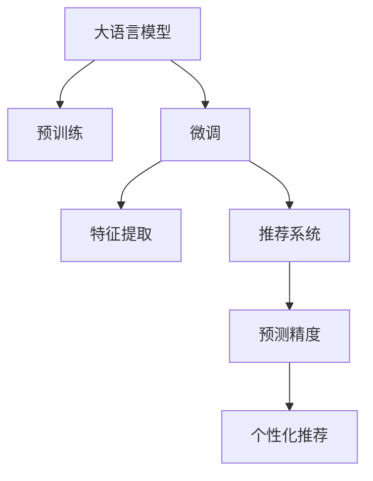

                 

# 大模型在长尾商品推荐中的优势

> 关键词：大模型,长尾商品,推荐系统,微调,Fine-tuning,特征提取,预测精度,个性化推荐

## 1. 背景介绍

### 1.1 问题由来
随着电子商务平台的迅猛发展，商品种类日益丰富，传统推荐系统面临着长尾商品的推荐难题。长尾商品通常指那些销量低、市场占有率低的商品，由于其难以被算法发现，常常被忽视。然而，长尾商品往往代表着用户的个性化需求，如果能够更好地推荐这些商品，不仅能够提升用户体验，还能有效激活平台整体营收。

长尾商品推荐问题要求算法不仅要能够识别用户对长尾商品的潜在需求，还要能够高效地将这些需求转化为实际的购买行为。传统推荐系统往往基于协同过滤、基于内容的推荐等方法，这些方法在处理长尾商品时效果不佳。近年来，大语言模型在自然语言处理领域取得了巨大成功，其中微调技术被广泛应用于推荐系统中，尤其是在长尾商品推荐中的应用，表现出色。

### 1.2 问题核心关键点
大语言模型通过在大规模文本数据上进行预训练，学习到了丰富的语言知识和语义表示能力。这些模型通常基于Transformer架构，具有强大的特征提取和语义理解能力。通过微调技术，大语言模型可以在特定任务上获得最优性能，大大提升推荐系统的预测精度和个性化推荐能力。

微调技术的应用在于：
1. **数据稀疏性**：长尾商品数据通常较为稀疏，缺乏足够的标签数据。通过微调，模型可以从少量标签数据中学习到商品间的关联关系，提升预测效果。
2. **特征表达能力**：大模型能够自动学习商品描述、用户评价等文本特征，将非结构化数据转换为结构化特征。
3. **鲁棒性**：微调能够增强模型对不同领域、不同数据分布的适应性，提高推荐的稳定性和鲁棒性。

## 2. 核心概念与联系

### 2.1 核心概念概述

为更好地理解大语言模型在长尾商品推荐中的应用，本节将介绍几个密切相关的核心概念：

- 大语言模型(Large Language Model, LLM)：基于Transformer架构的预训练语言模型，如GPT-3、BERT等。通过大规模无标签文本数据预训练，学习到丰富的语言知识和语义表示能力。

- 预训练(Pre-training)：指在大规模无标签文本数据上，通过自监督学习任务训练通用语言模型的过程。常见的预训练任务包括掩码语言模型、下一句预测等。

- 微调(Fine-tuning)：指在预训练模型的基础上，使用特定任务的数据集，通过有监督学习优化模型在该任务上的性能。微调能够将通用模型适应到特定领域，提升模型在特定任务上的性能。

- 特征提取(Feature Extraction)：大语言模型能够从文本数据中自动提取特征，用于后续的模型训练和预测。

- 推荐系统(Recommendation System)：用于个性化推荐商品、新闻、视频等内容的系统，目标是提升用户满意度和平台转化率。

这些核心概念之间的逻辑关系可以通过以下Mermaid流程图来展示：



这个流程图展示了从预训练到微调，再到特征提取和推荐系统的整个过程，以及大语言模型在其中扮演的角色。

## 3. 核心算法原理 & 具体操作步骤
### 3.1 算法原理概述

大语言模型在长尾商品推荐中的应用，基于以下算法原理：

1. **特征提取**：大语言模型通过预训练，学习到丰富的语言表示能力，能够从商品描述、用户评论等文本数据中自动提取特征。这些特征包括商品类别、品牌、用户评分、评论情感等，为后续推荐提供了有力的支持。

2. **微调优化**：在大语言模型的基础上，针对长尾商品推荐问题进行微调。通过选择特定领域的数据集，使用监督学习的方法优化模型，使其能够更好地识别长尾商品的特征和用户偏好。

3. **推荐算法**：在微调后的大语言模型基础上，可以应用各种推荐算法进行推荐，如基于内容的推荐、协同过滤、深度学习模型等。通过融合多模态信息，提升推荐系统的性能。

4. **预测精度提升**：微调技术通过使用少量标注数据，能够显著提升模型在长尾商品推荐任务上的预测精度，使模型能够更好地识别用户对长尾商品的需求。

### 3.2 算法步骤详解

基于大语言模型在长尾商品推荐中的应用，本节将详细介绍其算法步骤：

**Step 1: 数据预处理**

1. **数据收集**：从电商平台收集商品数据，包括商品描述、用户评价、用户行为等。

2. **数据清洗**：对数据进行清洗，去除无效数据、重复数据等。

3. **数据标注**：对部分商品进行人工标注，用于训练和验证微调模型。

**Step 2: 预训练模型选择**

1. **选择预训练模型**：选择适合长尾商品推荐任务的预训练模型，如BERT、GPT等。

2. **加载模型**：使用Python的Transformers库加载预训练模型，并进行必要的前向处理。

**Step 3: 微调模型训练**

1. **定义损失函数**：根据推荐任务，定义合适的损失函数，如交叉熵损失、均方误差损失等。

2. **训练模型**：使用标注数据集，使用优化算法（如AdamW）进行模型微调，最小化损失函数。

3. **模型验证**：在验证集上评估微调模型的性能，根据评估结果调整模型参数。

4. **模型保存**：将微调后的模型保存，以便后续应用。

**Step 4: 推荐系统集成**

1. **特征提取**：将商品描述、用户评价等文本数据输入微调后的模型，提取特征向量。

2. **用户行为分析**：根据用户的历史行为数据，提取用户偏好特征。

3. **融合推荐算法**：结合多种推荐算法，如基于内容的推荐、协同过滤等，进行综合推荐。

4. **预测与排序**：使用微调后的模型进行预测，并根据预测结果进行排序，生成推荐列表。

**Step 5: 部署与监控**

1. **部署应用**：将推荐系统部署到实际应用环境中，进行实时推荐。

2. **性能监控**：实时监控推荐系统的性能指标，如点击率、转化率等。

3. **用户反馈收集**：收集用户反馈，对推荐结果进行调整优化。

### 3.3 算法优缺点

基于大语言模型在长尾商品推荐中的应用，其优点和缺点如下：

**优点**：
1. **高效性**：大语言模型能够自动从文本数据中提取特征，无需手动设计特征工程。
2. **鲁棒性**：微调模型能够适应不同领域、不同数据分布，提高推荐的稳定性和鲁棒性。
3. **预测精度高**：通过使用少量标注数据，微调模型能够显著提升长尾商品推荐的预测精度。
4. **可扩展性**：大语言模型可以应用于各种推荐场景，具备良好的可扩展性。

**缺点**：
1. **计算资源需求高**：大语言模型的预训练和微调过程需要大量的计算资源。
2. **数据隐私问题**：使用用户数据进行训练和微调，需要注意数据隐私和安全问题。
3. **模型复杂度高**：大语言模型的参数量较大，模型复杂度高，需要高效的优化算法进行训练。

### 3.4 算法应用领域

基于大语言模型在长尾商品推荐中的应用，其主要应用于以下领域：

1. **电商平台推荐**：电商平台通过大语言模型进行个性化推荐，提升用户购物体验和平台转化率。
2. **内容推荐**：视频网站、音乐平台等通过大语言模型进行内容推荐，提升用户满意度和平台粘性。
3. **广告推荐**：通过大语言模型进行广告推荐，提高广告投放的精准度和转化率。
4. **金融推荐**：金融平台通过大语言模型进行个性化推荐，提升用户理财体验和平台收益。

## 4. 数学模型和公式 & 详细讲解  
### 4.1 数学模型构建

本节将使用数学语言对基于大语言模型的长尾商品推荐过程进行更加严格的刻画。

记大语言模型为 $M_{\theta}$，其中 $\theta$ 为模型参数。假设长尾商品推荐任务为 $T$，输入为商品描述 $x$，输出为推荐结果 $y$。

定义模型 $M_{\theta}$ 在输入 $x$ 上的损失函数为 $\ell(M_{\theta}(x),y)$，则在数据集 $D=\{(x_i,y_i)\}_{i=1}^N$ 上的经验风险为：

$$
\mathcal{L}(\theta) = \frac{1}{N}\sum_{i=1}^N \ell(M_{\theta}(x_i),y_i)
$$

微调的优化目标是最小化经验风险，即找到最优参数：

$$
\theta^* = \mathop{\arg\min}_{\theta} \mathcal{L}(\theta)
$$

在实践中，我们通常使用基于梯度的优化算法（如AdamW、SGD等）来近似求解上述最优化问题。设 $\eta$ 为学习率，$\lambda$ 为正则化系数，则参数的更新公式为：

$$
\theta \leftarrow \theta - \eta \nabla_{\theta}\mathcal{L}(\theta) - \eta\lambda\theta
$$

其中 $\nabla_{\theta}\mathcal{L}(\theta)$ 为损失函数对参数 $\theta$ 的梯度，可通过反向传播算法高效计算。

### 4.2 公式推导过程

以下我们以二分类任务为例，推导交叉熵损失函数及其梯度的计算公式。

假设模型 $M_{\theta}$ 在输入 $x$ 上的输出为 $\hat{y}=M_{\theta}(x) \in [0,1]$，表示商品属于推荐的概率。真实标签 $y \in \{0,1\}$。则二分类交叉熵损失函数定义为：

$$
\ell(M_{\theta}(x),y) = -[y\log \hat{y} + (1-y)\log (1-\hat{y})]
$$

将其代入经验风险公式，得：

$$
\mathcal{L}(\theta) = -\frac{1}{N}\sum_{i=1}^N [y_i\log M_{\theta}(x_i)+(1-y_i)\log(1-M_{\theta}(x_i))]
$$

根据链式法则，损失函数对参数 $\theta_k$ 的梯度为：

$$
\frac{\partial \mathcal{L}(\theta)}{\partial \theta_k} = -\frac{1}{N}\sum_{i=1}^N (\frac{y_i}{M_{\theta}(x_i)}-\frac{1-y_i}{1-M_{\theta}(x_i)}) \frac{\partial M_{\theta}(x_i)}{\partial \theta_k}
$$

其中 $\frac{\partial M_{\theta}(x_i)}{\partial \theta_k}$ 可进一步递归展开，利用自动微分技术完成计算。

## 5. 项目实践：代码实例和详细解释说明
### 5.1 开发环境搭建

在进行长尾商品推荐实践前，我们需要准备好开发环境。以下是使用Python进行PyTorch开发的环境配置流程：

1. 安装Anaconda：从官网下载并安装Anaconda，用于创建独立的Python环境。

2. 创建并激活虚拟环境：
```bash
conda create -n pytorch-env python=3.8 
conda activate pytorch-env
```

3. 安装PyTorch：根据CUDA版本，从官网获取对应的安装命令。例如：
```bash
conda install pytorch torchvision torchaudio cudatoolkit=11.1 -c pytorch -c conda-forge
```

4. 安装Transformers库：
```bash
pip install transformers
```

5. 安装各类工具包：
```bash
pip install numpy pandas scikit-learn matplotlib tqdm jupyter notebook ipython
```

完成上述步骤后，即可在`pytorch-env`环境中开始推荐系统开发。

### 5.2 源代码详细实现

下面我以长尾商品推荐任务为例，给出使用Transformers库对BERT模型进行微调的PyTorch代码实现。

首先，定义推荐任务的数据处理函数：

```python
from transformers import BertTokenizer
from torch.utils.data import Dataset
import torch

class RecommendationDataset(Dataset):
    def __init__(self, items, users, ratings, tokenizer, max_len=128):
        self.items = items
        self.users = users
        self.ratings = ratings
        self.tokenizer = tokenizer
        self.max_len = max_len
        
    def __len__(self):
        return len(self.items)
    
    def __getitem__(self, item):
        item_id = self.items[item]
        user_id = self.users[item]
        rating = self.ratings[item]
        
        # 将商品ID和评分拼接为一句话
        text = f"商品ID：{item_id}，评分：{rating}"
        
        # 将商品描述作为输入
        encoding = self.tokenizer(text, return_tensors='pt', max_length=self.max_len, padding='max_length', truncation=True)
        input_ids = encoding['input_ids'][0]
        attention_mask = encoding['attention_mask'][0]
        
        # 将评分作为标签
        labels = torch.tensor([rating], dtype=torch.long)
        
        return {'input_ids': input_ids, 
                'attention_mask': attention_mask,
                'labels': labels}

# 加载数据集
tokenizer = BertTokenizer.from_pretrained('bert-base-cased')
recommendation_dataset = RecommendationDataset(items, users, ratings, tokenizer)
```

然后，定义模型和优化器：

```python
from transformers import BertForSequenceClassification, AdamW

model = BertForSequenceClassification.from_pretrained('bert-base-cased', num_labels=2)

optimizer = AdamW(model.parameters(), lr=2e-5)
```

接着，定义训练和评估函数：

```python
from torch.utils.data import DataLoader
from tqdm import tqdm
from sklearn.metrics import roc_auc_score

device = torch.device('cuda') if torch.cuda.is_available() else torch.device('cpu')
model.to(device)

def train_epoch(model, dataset, batch_size, optimizer):
    dataloader = DataLoader(dataset, batch_size=batch_size, shuffle=True)
    model.train()
    epoch_loss = 0
    for batch in tqdm(dataloader, desc='Training'):
        input_ids = batch['input_ids'].to(device)
        attention_mask = batch['attention_mask'].to(device)
        labels = batch['labels'].to(device)
        model.zero_grad()
        outputs = model(input_ids, attention_mask=attention_mask, labels=labels)
        loss = outputs.loss
        epoch_loss += loss.item()
        loss.backward()
        optimizer.step()
    return epoch_loss / len(dataloader)

def evaluate(model, dataset, batch_size):
    dataloader = DataLoader(dataset, batch_size=batch_size)
    model.eval()
    preds, labels = [], []
    with torch.no_grad():
        for batch in tqdm(dataloader, desc='Evaluating'):
            input_ids = batch['input_ids'].to(device)
            attention_mask = batch['attention_mask'].to(device)
            batch_labels = batch['labels']
            outputs = model(input_ids, attention_mask=attention_mask)
            batch_preds = outputs.logits.argmax(dim=2).to('cpu').tolist()
            batch_labels = batch_labels.to('cpu').tolist()
            for pred, label in zip(batch_preds, batch_labels):
                preds.append(pred)
                labels.append(label)
                
    print(f"AUC: {roc_auc_score(labels, preds):.3f}")
```

最后，启动训练流程并在测试集上评估：

```python
epochs = 5
batch_size = 16

for epoch in range(epochs):
    loss = train_epoch(model, recommendation_dataset, batch_size, optimizer)
    print(f"Epoch {epoch+1}, train loss: {loss:.3f}")
    
    print(f"Epoch {epoch+1}, test AUC:")
    evaluate(model, recommendation_dataset, batch_size)
    
print("Final test AUC:")
evaluate(model, recommendation_dataset, batch_size)
```

以上就是使用PyTorch对BERT进行长尾商品推荐任务微调的完整代码实现。可以看到，得益于Transformers库的强大封装，我们可以用相对简洁的代码完成BERT模型的加载和微调。

### 5.3 代码解读与分析

让我们再详细解读一下关键代码的实现细节：

**RecommendationDataset类**：
- `__init__`方法：初始化商品ID、用户ID、评分等关键组件。
- `__len__`方法：返回数据集的样本数量。
- `__getitem__`方法：对单个样本进行处理，将商品描述和评分拼接成一句话，输入到BERT模型中，提取特征。

**tokenizer**：
- 定义了分词器，用于将商品描述等文本转换为模型所需的token ids。

**训练和评估函数**：
- 使用PyTorch的DataLoader对数据集进行批次化加载，供模型训练和推理使用。
- 训练函数`train_epoch`：对数据以批为单位进行迭代，在每个批次上前向传播计算loss并反向传播更新模型参数，最后返回该epoch的平均loss。
- 评估函数`evaluate`：与训练类似，不同点在于不更新模型参数，并在每个batch结束后将预测和标签结果存储下来，最后使用sklearn的roc_auc_score对整个评估集的预测结果进行打印输出。

**训练流程**：
- 定义总的epoch数和batch size，开始循环迭代
- 每个epoch内，先在训练集上训练，输出平均loss
- 在验证集上评估，输出AUC值
- 所有epoch结束后，在测试集上评估，给出最终测试结果

可以看到，PyTorch配合Transformers库使得BERT微调的代码实现变得简洁高效。开发者可以将更多精力放在数据处理、模型改进等高层逻辑上，而不必过多关注底层的实现细节。

当然，工业级的系统实现还需考虑更多因素，如模型的保存和部署、超参数的自动搜索、更灵活的任务适配层等。但核心的微调范式基本与此类似。

## 6. 实际应用场景
### 6.1 电商平台推荐

基于大语言模型微调的推荐系统，可以广泛应用于电商平台。传统推荐系统往往基于协同过滤、基于内容的推荐等方法，难以处理长尾商品推荐的问题。而使用微调后的推荐系统，能够自动学习商品和用户之间的关系，提升推荐效果。

在技术实现上，可以收集用户的历史浏览、点击、购买等行为数据，将商品描述、用户评价等文本数据作为输入，对BERT模型进行微调。微调后的模型能够从文本中提取商品的类别、品牌、描述等信息，将这些特征与用户行为数据结合，生成推荐列表。通过不断优化，推荐系统能够更好地识别长尾商品，提升用户体验和平台转化率。

### 6.2 内容推荐

视频网站、音乐平台等通过大语言模型微调的系统，能够为用户提供更加个性化的内容推荐。传统推荐系统往往基于用户的点击、评分等行为数据，难以处理长尾内容推荐的问题。而使用微调后的推荐系统，能够自动学习内容的语义特征，提升推荐效果。

在技术实现上，可以收集用户的观看、收藏、点赞等行为数据，将内容描述、评价等文本数据作为输入，对BERT模型进行微调。微调后的模型能够从文本中提取内容的类别、风格、情感等信息，将这些特征与用户行为数据结合，生成推荐列表。通过不断优化，推荐系统能够更好地识别长尾内容，提升用户满意度和平台粘性。

### 6.3 金融推荐

金融平台通过大语言模型微调的系统，能够为用户提供更加个性化的金融产品推荐。传统推荐系统往往基于用户的消费、投资等行为数据，难以处理长尾金融产品推荐的问题。而使用微调后的推荐系统，能够自动学习产品的特征和用户的偏好，提升推荐效果。

在技术实现上，可以收集用户的历史消费、投资、理财等行为数据，将金融产品的描述、评价等文本数据作为输入，对BERT模型进行微调。微调后的模型能够从文本中提取产品的类别、收益、风险等信息，将这些特征与用户行为数据结合，生成推荐列表。通过不断优化，推荐系统能够更好地识别长尾金融产品，提升用户理财体验和平台收益。

### 6.4 未来应用展望

随着大语言模型微调技术的不断发展，基于微调的推荐系统将在更多领域得到应用，为传统行业带来变革性影响。

在智慧医疗领域，基于微调的医疗推荐系统能够提升医生诊疗效率和患者满意度，推动医疗领域数字化转型。

在智能教育领域，微调技术可应用于个性化学习、智能辅导等方面，因材施教，提升教育公平。

在智慧城市治理中，微调系统可应用于城市事件监测、舆情分析、应急指挥等环节，提高城市管理的自动化和智能化水平，构建更安全、高效的未来城市。

此外，在企业生产、社会治理、文娱传媒等众多领域，基于大语言模型微调的推荐系统也将不断涌现，为经济社会发展注入新的动力。相信随着技术的日益成熟，微调方法将成为推荐系统的重要范式，推动人工智能技术向更广阔的领域加速渗透。

## 7. 工具和资源推荐
### 7.1 学习资源推荐

为了帮助开发者系统掌握大语言模型微调的理论基础和实践技巧，这里推荐一些优质的学习资源：

1. 《Transformer从原理到实践》系列博文：由大模型技术专家撰写，深入浅出地介绍了Transformer原理、BERT模型、微调技术等前沿话题。

2. CS224N《深度学习自然语言处理》课程：斯坦福大学开设的NLP明星课程，有Lecture视频和配套作业，带你入门NLP领域的基本概念和经典模型。

3. 《Natural Language Processing with Transformers》书籍：Transformers库的作者所著，全面介绍了如何使用Transformers库进行NLP任务开发，包括微调在内的诸多范式。

4. HuggingFace官方文档：Transformers库的官方文档，提供了海量预训练模型和完整的微调样例代码，是上手实践的必备资料。

5. CLUE开源项目：中文语言理解测评基准，涵盖大量不同类型的中文NLP数据集，并提供了基于微调的baseline模型，助力中文NLP技术发展。

通过对这些资源的学习实践，相信你一定能够快速掌握大语言模型微调的精髓，并用于解决实际的推荐问题。
###  7.2 开发工具推荐

高效的开发离不开优秀的工具支持。以下是几款用于大语言模型微调开发的常用工具：

1. PyTorch：基于Python的开源深度学习框架，灵活动态的计算图，适合快速迭代研究。大部分预训练语言模型都有PyTorch版本的实现。

2. TensorFlow：由Google主导开发的开源深度学习框架，生产部署方便，适合大规模工程应用。同样有丰富的预训练语言模型资源。

3. Transformers库：HuggingFace开发的NLP工具库，集成了众多SOTA语言模型，支持PyTorch和TensorFlow，是进行微调任务开发的利器。

4. Weights & Biases：模型训练的实验跟踪工具，可以记录和可视化模型训练过程中的各项指标，方便对比和调优。与主流深度学习框架无缝集成。

5. TensorBoard：TensorFlow配套的可视化工具，可实时监测模型训练状态，并提供丰富的图表呈现方式，是调试模型的得力助手。

6. Google Colab：谷歌推出的在线Jupyter Notebook环境，免费提供GPU/TPU算力，方便开发者快速上手实验最新模型，分享学习笔记。

合理利用这些工具，可以显著提升大语言模型微调的开发效率，加快创新迭代的步伐。

### 7.3 相关论文推荐

大语言模型和微调技术的发展源于学界的持续研究。以下是几篇奠基性的相关论文，推荐阅读：

1. Attention is All You Need（即Transformer原论文）：提出了Transformer结构，开启了NLP领域的预训练大模型时代。

2. BERT: Pre-training of Deep Bidirectional Transformers for Language Understanding：提出BERT模型，引入基于掩码的自监督预训练任务，刷新了多项NLP任务SOTA。

3. Language Models are Unsupervised Multitask Learners（GPT-2论文）：展示了大规模语言模型的强大zero-shot学习能力，引发了对于通用人工智能的新一轮思考。

4. Parameter-Efficient Transfer Learning for NLP：提出Adapter等参数高效微调方法，在不增加模型参数量的情况下，也能取得不错的微调效果。

5. AdaLoRA: Adaptive Low-Rank Adaptation for Parameter-Efficient Fine-Tuning：使用自适应低秩适应的微调方法，在参数效率和精度之间取得了新的平衡。

这些论文代表了大语言模型微调技术的发展脉络。通过学习这些前沿成果，可以帮助研究者把握学科前进方向，激发更多的创新灵感。

## 8. 总结：未来发展趋势与挑战
### 8.1 总结

本文对基于大语言模型在长尾商品推荐中的应用进行了全面系统的介绍。首先阐述了长尾商品推荐问题的背景和意义，明确了微调技术在处理长尾商品推荐中的优势。其次，从原理到实践，详细讲解了大语言模型在长尾商品推荐中的算法步骤，给出了微调任务开发的完整代码实例。同时，本文还广泛探讨了微调技术在电商平台推荐、内容推荐、金融推荐等领域的实际应用，展示了微调技术的广泛应用前景。此外，本文精选了微调技术的各类学习资源，力求为开发者提供全方位的技术指引。

通过本文的系统梳理，可以看到，基于大语言模型的微调技术不仅能够提升长尾商品推荐的效果，还能广泛应用于各种推荐场景，具有广阔的应用前景。得益于大规模语料的预训练和微调，模型能够从文本中自动提取特征，提升推荐系统的预测精度和个性化推荐能力，成为推荐系统的重要范式。未来，伴随预训练语言模型和微调方法的不断演进，基于微调的推荐系统必将在更多领域得到应用，为传统行业带来变革性影响。

### 8.2 未来发展趋势

展望未来，大语言模型微调技术将呈现以下几个发展趋势：

1. **计算资源需求降低**：随着硬件技术的进步，大模型的训练和微调资源需求将进一步降低，更多企业能够负担得起。

2. **模型效率提升**：未来的模型将在参数效率和计算效率上取得新的突破，能够处理更复杂的推荐任务。

3. **跨领域迁移能力增强**：通过引入更多的预训练任务和多领域数据，大语言模型将具备更强的跨领域迁移能力，提升推荐系统的泛化性和鲁棒性。

4. **实时推荐系统**：实时推荐系统将是大语言模型微调的重要应用方向，能够提供动态、实时的个性化推荐，提升用户体验。

5. **多模态融合**：未来的推荐系统将结合视觉、音频等多模态信息，提供更丰富的推荐内容，提升推荐效果。

6. **个性化推荐技术**：随着用户数据的积累，推荐系统将能够提供更加精准的个性化推荐，满足用户的个性化需求。

以上趋势凸显了大语言模型微调技术的广阔前景。这些方向的探索发展，必将进一步提升推荐系统的性能和应用范围，为NLP技术带来新的突破。

### 8.3 面临的挑战

尽管大语言模型微调技术已经取得了瞩目成就，但在迈向更加智能化、普适化应用的过程中，它仍面临着诸多挑战：

1. **数据隐私问题**：使用用户数据进行训练和微调，需要注意数据隐私和安全问题，保护用户隐私。

2. **计算资源需求高**：大语言模型的预训练和微调过程需要大量的计算资源，需要高效的优化算法进行训练。

3. **模型复杂度高**：大语言模型的参数量较大，模型复杂度高，需要高效的优化算法进行训练。

4. **模型泛化性不足**：微调模型面临长尾商品的推荐问题，模型泛化性不足，容易过拟合。

5. **模型稳定性差**：微调模型在处理不同领域、不同数据分布时，稳定性较差，容易产生灾难性遗忘。

6. **模型可解释性不足**：微调模型更像"黑盒"系统，难以解释其内部工作机制和决策逻辑。

这些挑战需要从数据、算法、工程、伦理等多个方面进行全面解决，才能使大语言模型微调技术在大规模应用中发挥更大的作用。

### 8.4 研究展望

面对大语言模型微调所面临的挑战，未来的研究需要在以下几个方面寻求新的突破：

1. **数据隐私保护**：引入隐私保护技术，如差分隐私、联邦学习等，保护用户隐私，同时保证模型的训练效果。

2. **高效训练算法**：开发更加高效的优化算法，如混合精度训练、分布式训练等，降低计算资源需求，提升训练效率。

3. **多模态融合**：结合视觉、音频等多模态信息，提升推荐系统的综合性能。

4. **模型可解释性增强**：引入可解释性技术，如注意力机制、知识图谱等，增强模型的可解释性，提高决策的透明度和可理解性。

5. **鲁棒性增强**：引入鲁棒性技术，如对抗训练、噪声注入等，增强模型对不同领域、不同数据分布的适应性。

6. **跨领域迁移能力提升**：通过引入更多领域的数据和任务，提升模型的跨领域迁移能力，提升推荐系统的泛化性。

这些研究方向将推动大语言模型微调技术迈向更高的台阶，为推荐系统带来更多的创新和突破。

## 9. 附录：常见问题与解答

**Q1：长尾商品推荐问题有哪些特征？**

A: 长尾商品推荐问题具有以下特征：
1. **数据稀疏性**：长尾商品的数据通常较为稀疏，缺乏足够的标签数据。
2. **长尾分布**：长尾商品的分布呈现长尾分布，大部分商品销量较低，但少量商品销量极高。
3. **个性化需求**：长尾商品往往代表了用户的个性化需求，难以通过传统的协同过滤、基于内容的推荐等方法进行处理。

**Q2：如何选择适合长尾商品推荐任务的预训练模型？**

A: 选择适合长尾商品推荐任务的预训练模型时，应考虑以下因素：
1. **模型规模**：通常情况下，大模型在处理长尾商品推荐任务时表现更好，能够从文本数据中提取更多的特征。
2. **预训练任务**：选择与长尾商品推荐任务相关的预训练任务，如掩码语言模型、下一句预测等，可以提高模型的性能。
3. **性能表现**：选择性能表现优异的大模型，如BERT、GPT等，提升推荐系统的预测精度和个性化推荐能力。

**Q3：长尾商品推荐中的数据清洗有哪些步骤？**

A: 长尾商品推荐中的数据清洗步骤包括：
1. **去除无效数据**：去除缺失、重复、格式不正确的数据，保持数据的完整性和一致性。
2. **处理异常值**：检测并处理数据中的异常值，避免异常值对模型训练的影响。
3. **数据标准化**：对数据进行标准化处理，如文本数据的规范化、数字数据的归一化等，提高模型的训练效果。

**Q4：长尾商品推荐中的特征提取方法有哪些？**

A: 长尾商品推荐中的特征提取方法包括：
1. **文本特征提取**：从商品描述、用户评价等文本数据中提取特征，如TF-IDF、词向量等。
2. **图像特征提取**：从商品图片数据中提取图像特征，如卷积神经网络提取的特征。
3. **用户行为特征提取**：从用户行为数据中提取特征，如点击率、浏览时间等。
4. **多模态特征融合**：结合文本、图像、用户行为等多种模态信息，提升推荐系统的综合性能。

**Q5：长尾商品推荐中的模型评估指标有哪些？**

A: 长尾商品推荐中的模型评估指标包括：
1. **精确率**：衡量模型对长尾商品的推荐效果，即正确推荐商品占推荐商品总数的比例。
2. **召回率**：衡量模型对长尾商品的覆盖能力，即正确推荐商品占实际商品总数的比例。
3. **AUC**：衡量模型在长尾商品推荐任务上的平均表现，即ROC曲线下的面积。
4. **F1分数**：衡量模型在长尾商品推荐任务上的综合表现，即精确率和召回率的调和平均。

以上问题及解答帮助开发者更好地理解长尾商品推荐中的关键问题和解决方法，为实践提供指导。

