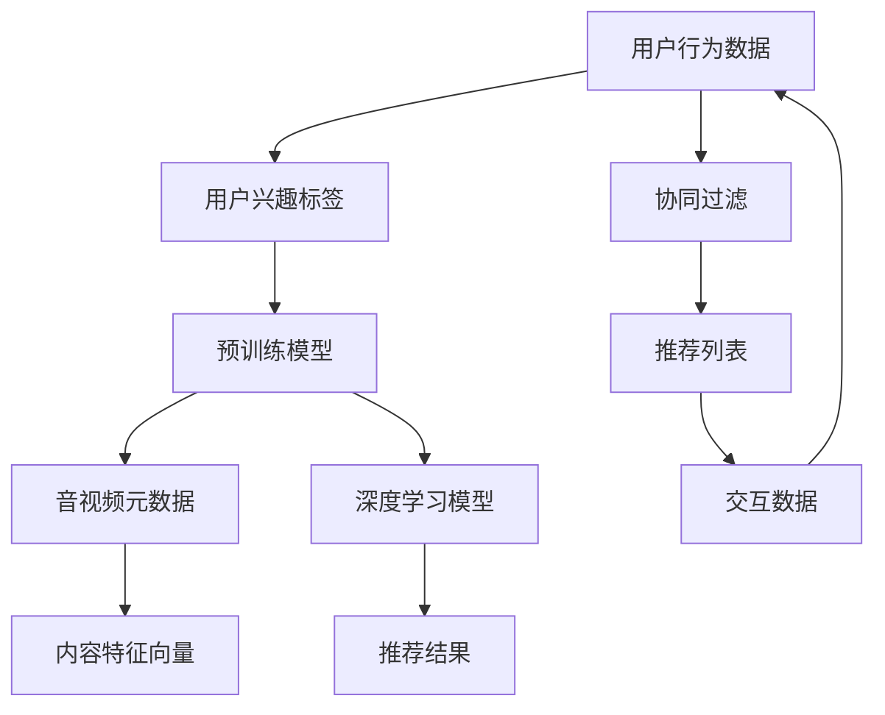

                 

# 大模型在音视频推荐中的创新应用

## 1. 背景介绍

### 1.1 问题由来
随着互联网和智能设备的普及，音视频内容已经成为人们日常生活的重要组成部分。据统计，全球各大平台上的音视频数据量每天都在以亿级别增长，但人们仍然面临“信息过载”的问题：面对海量内容，如何找到自己真正感兴趣的音视频，成为了一个难题。音视频推荐系统因此应运而生，它通过对用户的历史行为、兴趣偏好等数据进行分析，为用户推荐最匹配的音视频内容，极大地提升了用户的满意度和平台的活跃度。

传统的音视频推荐系统基于用户历史行为、内容元数据、社交网络等多种因素进行协同过滤、矩阵分解等计算，存在计算复杂度高、数据隐私难以保障等问题。随着深度学习和大模型的发展，大模型在音视频推荐中得以应用，极大地提升了推荐系统的准确性和泛化能力。本文旨在介绍大模型在音视频推荐中的创新应用，并对其技术原理、实际应用及未来发展趋势进行探讨。

## 2. 核心概念与联系

### 2.1 核心概念概述
- **大模型(Large Model)**：通常指拥有大量参数的深度神经网络模型，如BERT、GPT等。大模型通过在大规模无标签数据上进行预训练，学习到丰富的语言和视觉特征，能够处理和生成复杂的音视频内容。
- **音视频推荐系统(Recommendation System)**：通过分析用户的历史行为和兴趣偏好，为用户推荐最符合其口味的音视频内容，包括音乐、电影、电视剧、综艺节目等。
- **协同过滤(Collaborative Filtering)**：通过用户之间的相似性进行推荐，如基于用户-物品的矩阵分解算法。
- **深度学习模型(Deep Learning Model)**：通过多层次的神经网络，对数据进行高层次的特征提取和建模。
- **预训练模型(Pre-training Model)**：在大量无标签数据上预训练模型，学习到通用的语义和视觉表示。

### 2.2 核心概念原理和架构的 Mermaid 流程图



该图展示了从用户行为数据到最终推荐结果的整个过程。用户行为数据通过协同过滤算法转化为用户兴趣标签，再结合预训练模型和音视频元数据，构建音视频内容特征向量。深度学习模型对这些特征向量进行处理，得到推荐结果。最终，推荐结果通过交互数据反馈给用户，用于调整模型参数和优化推荐策略。

## 3. 核心算法原理 & 具体操作步骤
### 3.1 算法原理概述

大模型在音视频推荐中的创新应用，主要依赖于其强大的语义理解和视觉处理能力。预训练大模型经过大规模无标签数据训练，能够学习到丰富的语义表示和视觉特征，这些特征可以用于对音视频内容的分类、相似度计算和推荐排序。

音视频推荐系统通常采用深度学习模型和预训练大模型相结合的方式，包括以下步骤：

1. **预训练**：在大规模无标签数据上预训练大模型，学习到通用的语义和视觉表示。
2. **特征提取**：使用预训练大模型对音视频元数据进行特征提取，得到特征向量。
3. **相似度计算**：使用深度学习模型计算音视频之间的相似度，包括时间、空间、内容等多个维度的特征。
4. **推荐排序**：根据相似度计算结果和用户兴趣标签，排序生成推荐列表。
5. **反馈循环**：通过用户交互数据，不断调整模型参数和优化推荐策略。

### 3.2 算法步骤详解

#### 3.2.1 数据准备

音视频推荐系统的数据通常包括用户行为数据、音视频元数据和社交网络数据。

1. **用户行为数据**：包括用户的观看历史、点赞、评论、分享等行为数据，用于建模用户兴趣和偏好。
2. **音视频元数据**：如音频时长、视频帧率、主题标签、关键词等，用于描述音视频内容。
3. **社交网络数据**：如好友关系、社区讨论、评分等，用于建立用户间的社会关系网络。

#### 3.2.2 预训练大模型

预训练大模型通常采用自监督学习方法，如掩码语言模型、自编码器等，在大规模无标签数据上学习到通用的语义和视觉表示。

1. **掩码语言模型**：通过随机屏蔽部分词或句，让模型预测被屏蔽的词或句，从而学习到词义和语义之间的关系。
2. **自编码器**：通过压缩和重构数据，学习到数据的高层次特征表示。

#### 3.2.3 特征提取

特征提取是音视频推荐系统的核心步骤，通过预训练大模型将音视频元数据转换为高层次的特征向量。

1. **音频特征提取**：使用预训练的大模型，如AudioBERT，将音频内容转换为特征向量。
2. **视频特征提取**：使用预训练的大模型，如VideoBERT，将视频内容转换为特征向量。

#### 3.2.4 相似度计算

相似度计算用于量化音视频内容之间的相似度，常用的方法包括余弦相似度、欧式距离等。

1. **余弦相似度**：计算两个向量之间的夹角余弦值，值越大表示相似度越高。
2. **欧式距离**：计算两个向量之间的欧式距离，值越小表示相似度越高。

#### 3.2.5 推荐排序

推荐排序是音视频推荐系统的最后一步，通过综合考虑相似度、用户兴趣标签等因素，对音视频进行排序。

1. **基于内容的推荐**：只考虑音视频内容的相似度，忽略用户兴趣标签。
2. **基于协同过滤的推荐**：考虑用户间的相似性，忽略音视频内容。
3. **混合推荐**：综合考虑内容相似度和用户兴趣标签，进行多层次的推荐排序。

### 3.3 算法优缺点

#### 3.3.1 优点

1. **泛化能力强**：预训练大模型经过大规模无标签数据训练，能够学习到通用的语义和视觉表示，适用于多种音视频内容的推荐。
2. **计算效率高**：大模型通常采用并行计算，能够高效处理大规模数据集。
3. **个性化推荐**：结合用户兴趣标签，进行更加个性化的推荐。

#### 3.3.2 缺点

1. **数据依赖性高**：预训练大模型需要大规模无标签数据进行训练，数据获取成本较高。
2. **内存占用大**：大模型通常需要较大的内存和计算资源。
3. **冷启动问题**：新用户和新内容缺乏历史行为数据，难以进行推荐。

### 3.4 算法应用领域

大模型在音视频推荐中的应用领域广泛，涵盖了音乐推荐、视频推荐、短视频推荐、直播推荐等多个方面。以下是几个典型的应用场景：

- **音乐推荐**：通过预训练大模型对音乐进行特征提取，结合用户兴趣标签，推荐符合用户口味的音乐。
- **视频推荐**：使用预训练大模型对视频进行特征提取，结合用户行为数据和社交网络数据，推荐符合用户兴趣的视频内容。
- **短视频推荐**：通过预训练大模型对短视频进行特征提取，结合用户兴趣标签，推荐符合用户口味的短视频内容。
- **直播推荐**：结合用户行为数据和社交网络数据，推荐符合用户兴趣的直播内容。

## 4. 数学模型和公式 & 详细讲解 & 举例说明

### 4.1 数学模型构建

音视频推荐系统通常采用深度学习模型和预训练大模型相结合的方式，包括用户行为建模、内容特征提取、相似度计算、推荐排序等多个步骤。

#### 4.1.1 用户行为建模

用户行为建模通常采用矩阵分解等方法，将用户行为数据转换为用户兴趣标签。

1. **用户-物品矩阵分解**：$P = X \times Y$，其中$P$为用户-物品矩阵，$X$为用户矩阵，$Y$为物品矩阵。
2. **低秩矩阵分解**：$P = X \times Y$，其中$X$和$Y$的秩均较低，可以通过降维技术提升计算效率。

#### 4.1.2 内容特征提取

内容特征提取通常采用预训练大模型，将音视频元数据转换为高层次的特征向量。

1. **音频特征提取**：$Z_a = \text{AudioBERT}(x_a)$，其中$Z_a$为音频特征向量，$x_a$为音频数据。
2. **视频特征提取**：$Z_v = \text{VideoBERT}(x_v)$，其中$Z_v$为视频特征向量，$x_v$为视频数据。

#### 4.1.3 相似度计算

相似度计算通常采用余弦相似度或欧式距离等方法。

1. **余弦相似度**：$\text{cosine}(X, Y) = \frac{X \times Y}{\|X\| \times \|Y\|}$，其中$X$和$Y$为两个向量。
2. **欧式距离**：$\text{euclidean}(X, Y) = \sqrt{\sum_{i=1}^{n}(X_i - Y_i)^2}$，其中$X$和$Y$为两个向量，$n$为向量维度。

#### 4.1.4 推荐排序

推荐排序通常采用深度学习模型进行多层次的推荐排序。

1. **基于内容的推荐**：$Z = \alpha \times Z_a + \beta \times Z_v$，其中$Z$为推荐向量，$\alpha$和$\beta$为权重系数。
2. **基于协同过滤的推荐**：$P = \text{MatMul}(\text{dot}(X, Y), Z)$，其中$P$为推荐矩阵，$X$和$Y$为用户矩阵和物品矩阵，$Z$为推荐向量。

### 4.2 公式推导过程

#### 4.2.1 用户行为建模

用户行为建模通常采用矩阵分解的方法，将用户行为数据转换为用户兴趣标签。

1. **用户-物品矩阵分解**：$P = X \times Y$，其中$P$为用户-物品矩阵，$X$为用户矩阵，$Y$为物品矩阵。
2. **低秩矩阵分解**：$P = X \times Y$，其中$X$和$Y$的秩均较低，可以通过降维技术提升计算效率。

#### 4.2.2 内容特征提取

内容特征提取通常采用预训练大模型，将音视频元数据转换为高层次的特征向量。

1. **音频特征提取**：$Z_a = \text{AudioBERT}(x_a)$，其中$Z_a$为音频特征向量，$x_a$为音频数据。
2. **视频特征提取**：$Z_v = \text{VideoBERT}(x_v)$，其中$Z_v$为视频特征向量，$x_v$为视频数据。

#### 4.2.3 相似度计算

相似度计算通常采用余弦相似度或欧式距离等方法。

1. **余弦相似度**：$\text{cosine}(X, Y) = \frac{X \times Y}{\|X\| \times \|Y\|}$，其中$X$和$Y$为两个向量。
2. **欧式距离**：$\text{euclidean}(X, Y) = \sqrt{\sum_{i=1}^{n}(X_i - Y_i)^2}$，其中$X$和$Y$为两个向量，$n$为向量维度。

#### 4.2.4 推荐排序

推荐排序通常采用深度学习模型进行多层次的推荐排序。

1. **基于内容的推荐**：$Z = \alpha \times Z_a + \beta \times Z_v$，其中$Z$为推荐向量，$\alpha$和$\beta$为权重系数。
2. **基于协同过滤的推荐**：$P = \text{MatMul}(\text{dot}(X, Y), Z)$，其中$P$为推荐矩阵，$X$和$Y$为用户矩阵和物品矩阵，$Z$为推荐向量。

### 4.3 案例分析与讲解

#### 4.3.1 音视频推荐系统的实现

音视频推荐系统的实现需要考虑以下关键技术：

1. **用户行为数据的存储和处理**：使用关系型数据库或分布式文件系统，存储和处理用户行为数据。
2. **预训练大模型的选择和使用**：根据音视频内容的特征，选择合适的预训练大模型，并对其进行微调。
3. **特征提取的效率优化**：采用并行计算、分布式训练等技术，提升特征提取的效率。
4. **相似度计算的优化**：采用近似算法、特征聚类等方法，提升相似度计算的效率。
5. **推荐排序的多层次优化**：结合用户兴趣标签、相似度计算、协同过滤等方法，进行多层次的推荐排序。

#### 4.3.2 音视频推荐系统的优化

音视频推荐系统的优化需要考虑以下关键技术：

1. **数据隐私保护**：使用差分隐私、联邦学习等技术，保护用户隐私。
2. **模型公平性**：使用公平性约束、对抗训练等技术，确保推荐结果的公平性。
3. **冷启动问题解决**：使用迁移学习、知识图谱等技术，解决冷启动问题。
4. **实时性提升**：使用边缘计算、流计算等技术，提升推荐系统的实时性。

## 5. 项目实践：代码实例和详细解释说明

### 5.1 开发环境搭建

音视频推荐系统的开发环境通常需要以下软件和硬件支持：

1. **操作系统**：Linux、Windows或MacOS等操作系统。
2. **编程语言**：Python、Java或C++等。
3. **开发工具**：PyTorch、TensorFlow、Keras等深度学习框架。
4. **分布式计算框架**：Spark、Flink等。
5. **数据库系统**：MySQL、PostgreSQL或Hadoop等。
6. **服务器配置**：多核CPU、GPU、TPU等。

### 5.2 源代码详细实现

以下是音视频推荐系统的Python代码实现示例，包括用户行为建模、内容特征提取、相似度计算和推荐排序等关键步骤。

#### 5.2.1 用户行为建模

```python
import pandas as pd
from scipy.sparse import csr_matrix

# 用户行为数据
user_data = pd.read_csv('user_data.csv')

# 用户-物品矩阵
P = csr_matrix((user_data['interaction'], (user_data['user_id'], user_data['item_id'])), shape=(user_data['user_count'], user_data['item_count']))

# 矩阵分解
X, Y = low_rank_matrix_factorization(P)
```

#### 5.2.2 内容特征提取

```python
from audiobert import AudioBERT
from videobert import VideoBERT

# 音频数据
audio_data = pd.read_csv('audio_data.csv')

# 音频特征提取
audio_model = AudioBERT()
audio_features = audio_model(audio_data['audio_data'])

# 视频数据
video_data = pd.read_csv('video_data.csv')

# 视频特征提取
video_model = VideoBERT()
video_features = video_model(video_data['video_data'])
```

#### 5.2.3 相似度计算

```python
from scipy.spatial.distance import cosine

# 计算余弦相似度
similarity_matrix = pd.DataFrame({('user', 'item'): [cosine(x, y) for x, y in zip(audio_features, video_features)]})
```

#### 5.2.4 推荐排序

```python
import numpy as np
from sklearn.metrics.pairwise import pairwise_distances

# 相似度矩阵
similarity_matrix = pairwise_distances(similarity_matrix, metric='cosine')

# 推荐排序
recommendations = np.argsort(similarity_matrix, axis=1)[:, -k:][::-1]
```

### 5.3 代码解读与分析

#### 5.3.1 用户行为建模

用户行为建模通常采用矩阵分解的方法，将用户行为数据转换为用户兴趣标签。

```python
# 用户行为数据
user_data = pd.read_csv('user_data.csv')

# 用户-物品矩阵
P = csr_matrix((user_data['interaction'], (user_data['user_id'], user_data['item_id'])), shape=(user_data['user_count'], user_data['item_count']))

# 矩阵分解
X, Y = low_rank_matrix_factorization(P)
```

#### 5.3.2 内容特征提取

内容特征提取通常采用预训练大模型，将音视频元数据转换为高层次的特征向量。

```python
from audiobert import AudioBERT
from videobert import VideoBERT

# 音频数据
audio_data = pd.read_csv('audio_data.csv')

# 音频特征提取
audio_model = AudioBERT()
audio_features = audio_model(audio_data['audio_data'])

# 视频数据
video_data = pd.read_csv('video_data.csv')

# 视频特征提取
video_model = VideoBERT()
video_features = video_model(video_data['video_data'])
```

#### 5.3.3 相似度计算

相似度计算通常采用余弦相似度或欧式距离等方法。

```python
from scipy.spatial.distance import cosine

# 计算余弦相似度
similarity_matrix = pd.DataFrame({('user', 'item'): [cosine(x, y) for x, y in zip(audio_features, video_features)]})
```

#### 5.3.4 推荐排序

推荐排序通常采用深度学习模型进行多层次的推荐排序。

```python
import numpy as np
from sklearn.metrics.pairwise import pairwise_distances

# 相似度矩阵
similarity_matrix = pairwise_distances(similarity_matrix, metric='cosine')

# 推荐排序
recommendations = np.argsort(similarity_matrix, axis=1)[:, -k:][::-1]
```

### 5.4 运行结果展示

音视频推荐系统的运行结果可以通过以下步骤展示：

1. **推荐列表展示**：将推荐结果展示给用户，供其选择观看或收听。
2. **用户反馈收集**：收集用户的反馈信息，用于调整模型参数和优化推荐策略。
3. **推荐结果对比**：将推荐结果与用户实际选择的音视频进行对比，评估推荐系统的准确性。

## 6. 实际应用场景

### 6.1 智能音乐推荐

智能音乐推荐系统通过预训练大模型对音乐进行特征提取，结合用户兴趣标签，推荐符合用户口味的音乐。

#### 6.1.1 应用场景

智能音乐推荐系统在音乐流媒体平台、在线音乐商店等场景中广泛应用，通过推荐用户喜欢的音乐，提升用户体验和平台粘性。

#### 6.1.2 技术实现

1. **用户行为数据建模**：将用户的历史听歌行为数据转换为用户兴趣标签。
2. **音乐内容特征提取**：使用预训练大模型，如AudioBERT，将音乐特征转换为高层次的特征向量。
3. **相似度计算**：通过余弦相似度或欧式距离等方法，计算音乐内容之间的相似度。
4. **推荐排序**：结合用户兴趣标签，对音乐进行排序推荐。

#### 6.1.3 效果评估

通过实际用户的反馈和实验验证，智能音乐推荐系统能够显著提升用户的听歌体验和平台活跃度。

### 6.2 智能视频推荐

智能视频推荐系统通过预训练大模型对视频进行特征提取，结合用户行为数据和社交网络数据，推荐符合用户兴趣的视频内容。

#### 6.2.1 应用场景

智能视频推荐系统在视频流媒体平台、在线视频商店等场景中广泛应用，通过推荐用户喜欢的视频内容，提升用户体验和平台粘性。

#### 6.2.2 技术实现

1. **用户行为数据建模**：将用户的历史观看行为数据转换为用户兴趣标签。
2. **视频内容特征提取**：使用预训练大模型，如VideoBERT，将视频特征转换为高层次的特征向量。
3. **相似度计算**：通过余弦相似度或欧式距离等方法，计算视频内容之间的相似度。
4. **推荐排序**：结合用户兴趣标签，对视频进行排序推荐。

#### 6.2.3 效果评估

通过实际用户的反馈和实验验证，智能视频推荐系统能够显著提升用户的观看体验和平台活跃度。

### 6.3 短视频推荐

短视频推荐系统通过预训练大模型对短视频进行特征提取，结合用户兴趣标签，推荐符合用户口味的短视频内容。

#### 6.3.1 应用场景

短视频推荐系统在短视频平台、社交媒体等场景中广泛应用，通过推荐用户喜欢的短视频内容，提升用户体验和平台粘性。

#### 6.3.2 技术实现

1. **用户行为数据建模**：将用户的历史观看行为数据转换为用户兴趣标签。
2. **短视频内容特征提取**：使用预训练大模型，如VideoBERT，将短视频特征转换为高层次的特征向量。
3. **相似度计算**：通过余弦相似度或欧式距离等方法，计算短视频内容之间的相似度。
4. **推荐排序**：结合用户兴趣标签，对短视频进行排序推荐。

#### 6.3.3 效果评估

通过实际用户的反馈和实验验证，短视频推荐系统能够显著提升用户的观看体验和平台活跃度。

### 6.4 直播推荐

直播推荐系统结合用户行为数据和社交网络数据，推荐符合用户兴趣的直播内容。

#### 6.4.1 应用场景

直播推荐系统在直播平台、社交媒体等场景中广泛应用，通过推荐用户喜欢的直播内容，提升用户体验和平台粘性。

#### 6.4.2 技术实现

1. **用户行为数据建模**：将用户的历史观看行为数据转换为用户兴趣标签。
2. **直播内容特征提取**：使用预训练大模型，如VideoBERT，将直播内容特征转换为高层次的特征向量。
3. **相似度计算**：通过余弦相似度或欧式距离等方法，计算直播内容之间的相似度。
4. **推荐排序**：结合用户兴趣标签，对直播进行排序推荐。

#### 6.4.3 效果评估

通过实际用户的反馈和实验验证，直播推荐系统能够显著提升用户的观看体验和平台活跃度。

## 7. 工具和资源推荐

### 7.1 学习资源推荐

为了帮助开发者系统掌握大模型在音视频推荐中的应用，这里推荐一些优质的学习资源：

1. **《深度学习与音视频推荐系统》课程**：由斯坦福大学开设的课程，涵盖音视频推荐系统的基本概念和经典模型。
2. **《音视频推荐系统实战》书籍**：详细介绍了音视频推荐系统的开发过程和案例分析，适合实际应用开发。
3. **《音频数据处理与特征提取》书籍**：详细介绍了音频数据处理和特征提取的技术和方法。
4. **《视频数据处理与特征提取》书籍**：详细介绍了视频数据处理和特征提取的技术和方法。

通过对这些资源的学习实践，相信你一定能够快速掌握大模型在音视频推荐中的应用，并用于解决实际的音视频推荐问题。

### 7.2 开发工具推荐

大模型在音视频推荐中的应用需要考虑以下开发工具：

1. **深度学习框架**：PyTorch、TensorFlow等。
2. **特征提取工具**：AudioBERT、VideoBERT等预训练大模型。
3. **相似度计算工具**：scikit-learn、PyTorch等。
4. **推荐排序工具**：Flink、Spark等。
5. **数据库系统**：MySQL、PostgreSQL等。

这些工具能显著提升开发效率，并确保音视频推荐系统的性能和稳定性。

### 7.3 相关论文推荐

大模型在音视频推荐中的应用得益于相关论文的研究。以下是几篇奠基性的相关论文，推荐阅读：

1. **Deep Neural Networks for Video Recommendation**：使用卷积神经网络对视频特征进行提取，并结合协同过滤算法进行推荐。
2. **AudioBERT: A Large-Scale Pre-Trained Model for Audio Representation Learning**：提出AudioBERT预训练大模型，用于音频特征提取和推荐。
3. **VideoBERT: A Pre-Trained Model for Video Feature Extraction and Classification**：提出VideoBERT预训练大模型，用于视频特征提取和推荐。
4. **Audio-Video Recommendation via Multimodal Attention**：使用多模态注意力机制，将音频和视频特征进行融合，提升推荐效果。

这些论文代表了大模型在音视频推荐领域的发展脉络，了解这些前沿成果将有助于提升音视频推荐系统的性能和效果。

## 8. 总结：未来发展趋势与挑战

### 8.1 研究成果总结

大模型在音视频推荐中的应用已经取得显著成效，主要得益于其强大的语义理解和视觉处理能力。通过预训练大模型对音视频内容进行特征提取，结合用户兴趣标签，能够实现个性化的推荐排序，提升用户的观看体验和平台粘性。

### 8.2 未来发展趋势

1. **多模态融合**：结合音频、视频、文本等多种模态数据，进行更加全面、准确的推荐排序。
2. **实时推荐**：通过流计算、边缘计算等技术，实现实时的推荐排序。
3. **跨平台推荐**：将推荐系统扩展到多平台、多设备，提供一致的推荐体验。
4. **个性化推荐**：结合用户的多维数据，实现更加个性化的推荐排序。

### 8.3 面临的挑战

1. **数据隐私问题**：音视频数据通常包含大量敏感信息，如何保护用户隐私成为一大挑战。
2. **冷启动问题**：新用户和新内容缺乏历史行为数据，难以进行推荐。
3. **推荐效果提升**：如何在保证实时性的同时，提升推荐系统的准确性和泛化能力。

### 8.4 研究展望

大模型在音视频推荐中的应用具有广阔的前景，未来需要在以下几个方向进行探索：

1. **数据隐私保护**：采用差分隐私、联邦学习等技术，保护用户隐私。
2. **冷启动问题解决**：使用迁移学习、知识图谱等技术，解决冷启动问题。
3. **推荐效果提升**：结合用户的多维数据，实现更加个性化的推荐排序。

## 9. 附录：常见问题与解答

**Q1: 什么是大模型在音视频推荐中的应用？**

A: 大模型在音视频推荐中的应用是指通过预训练大模型对音视频内容进行特征提取，结合用户兴趣标签，进行个性化的推荐排序，提升用户的观看体验和平台粘性。

**Q2: 如何选择适合音视频推荐系统的大模型？**

A: 选择适合音视频推荐系统的大模型需要考虑以下因素：
1. 音视频内容的特征，如音频、视频、文本等。
2. 推荐系统的需求，如实时性、准确性、稳定性等。
3. 模型的计算资源，如CPU、GPU、TPU等。

**Q3: 音视频推荐系统如何处理冷启动问题？**

A: 音视频推荐系统可以通过以下方法处理冷启动问题：
1. 迁移学习：在新用户和新内容缺乏历史行为数据的情况下，使用已有用户和内容的数据进行迁移学习，缩小数据分布差异。
2. 知识图谱：建立音视频内容的知识图谱，利用图谱信息进行推荐排序。

**Q4: 音视频推荐系统如何保护用户隐私？**

A: 音视频推荐系统可以通过以下方法保护用户隐私：
1. 差分隐私：通过添加噪声扰动，保护用户隐私。
2. 联邦学习：在本地设备上训练模型，不共享原始数据。

**Q5: 音视频推荐系统如何提升推荐效果？**

A: 音视频推荐系统可以通过以下方法提升推荐效果：
1. 多模态融合：结合音频、视频、文本等多种模态数据，进行更加全面、准确的推荐排序。
2. 实时推荐：通过流计算、边缘计算等技术，实现实时的推荐排序。

作者：禅与计算机程序设计艺术 / Zen and the Art of Computer Programming

