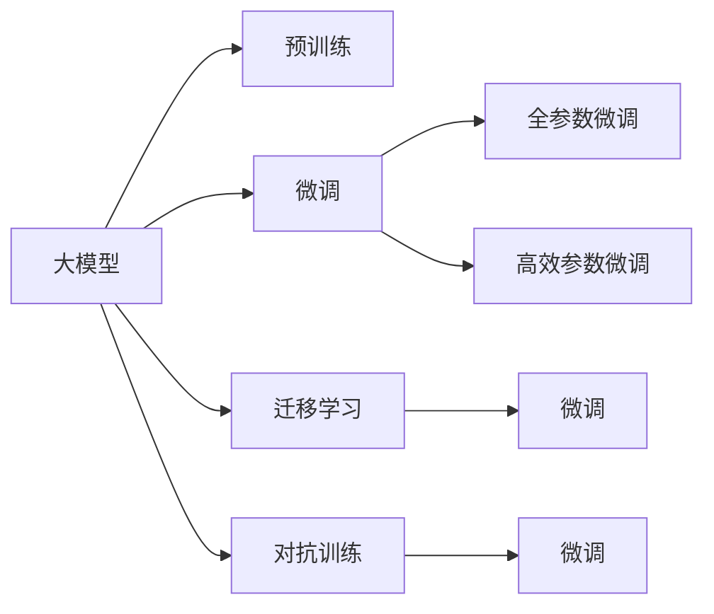

                 

# 大模型应用的关键：价格其次，AI解决实际问题的能力才是重点

> 关键词：人工智能, 大模型, 实际问题解决, 效率, 应用落地, 资源优化

## 1. 背景介绍

### 1.1 问题由来

近年来，人工智能(AI)技术迅猛发展，其中大模型（Large Model）成为了行业关注的焦点。大模型通过在海量数据上进行预训练，具备强大的语言、图像、语音等理解和生成能力，能够解决各类复杂的现实问题。然而，随之而来的是高昂的计算成本和存储需求，让许多机构和企业望而却步。如何在大模型和高成本之间找到平衡，成为业界亟需解决的难题。

### 1.2 问题核心关键点

本文聚焦于探讨大模型应用的关键，认为价格只是其中的次要因素，AI解决实际问题的能力才是重点。讨论的核心问题包括：

- 大模型在实际问题解决中的应用现状和能力
- 如何在大模型应用中提高资源利用率，降低成本
- 如何让AI技术更好地服务于实际业务，提升效率和效果

## 2. 核心概念与联系

### 2.1 核心概念概述

- 大模型（Large Model）：通过在大规模数据上进行预训练的大型神经网络模型，如GPT-3、BERT等。其特点是可以处理复杂、大规模的输入，具备强大的学习和推理能力。

- 预训练（Pre-training）：在大规模无标签数据上训练模型，使其学习到通用的语言、视觉等知识，可以迁移到下游任务中。

- 微调（Fine-tuning）：在预训练模型基础上，使用特定任务的少量标签数据进行有监督的调整，使其适应新的任务需求。

- 迁移学习（Transfer Learning）：将一个任务中学到的知识迁移到另一个相关任务中，减少新任务的训练时间和数据需求。

- 对抗训练（Adversarial Training）：通过对抗样本训练模型，提高模型的鲁棒性和泛化能力。

- 高效参数微调（Efficient Parameter Fine-tuning）：仅调整模型中的一部分参数，以提高微调效率和模型效果。

### 2.2 核心概念原理和架构的 Mermaid 流程图



此图展示了从大模型预训练到微调的流程：大模型在大规模数据上进行预训练，然后通过微调适应具体任务，同时可以通过迁移学习和对抗训练等技术进一步提高模型的性能。

## 3. 核心算法原理 & 具体操作步骤

### 3.1 算法原理概述

大模型应用的核心在于利用其在预训练阶段学习到的知识，解决实际问题。通过微调等技术，可以使大模型在特定任务上表现更佳。其基本原理如下：

- 预训练阶段：在大规模数据集上训练大模型，学习通用的语言、视觉等知识。
- 微调阶段：在特定任务的少量标签数据上，使用有监督学习调整大模型参数，使其适应新任务。
- 迁移学习：将预训练模型的知识迁移到新的任务中，减少新任务的训练时间和数据需求。

### 3.2 算法步骤详解

具体步骤如下：

**Step 1: 准备数据和环境**

- 收集并准备预训练数据集和目标任务的数据集。
- 选择合适的硬件环境，如GPU、TPU等，进行模型训练和推理。

**Step 2: 加载预训练模型**

- 使用预训练模型（如GPT-3、BERT等）进行初始化。
- 设置模型的输入输出格式和超参数。

**Step 3: 进行微调**

- 使用目标任务的数据集进行有监督学习，调整模型参数。
- 使用验证集进行模型评估，选择最优参数。
- 在测试集上测试微调后的模型性能。

**Step 4: 应用到实际场景**

- 将微调后的模型集成到实际应用中。
- 持续收集数据，定期更新和微调模型。

### 3.3 算法优缺点

#### 优点：

- 大模型具备强大的学习和推理能力，能够处理复杂任务。
- 微调等技术可以显著提高模型在特定任务上的性能。
- 迁移学习可以减少新任务的训练时间和数据需求。

#### 缺点：

- 大模型计算成本和存储需求高。
- 微调过程对数据量和质量要求高，易过拟合。
- 模型调整过程复杂，需要大量计算资源。

### 3.4 算法应用领域

大模型和微调技术广泛应用于各类实际问题解决中，包括但不限于：

- 自然语言处理（NLP）：机器翻译、文本摘要、情感分析等。
- 计算机视觉（CV）：图像分类、目标检测、图像生成等。
- 语音处理：语音识别、语音合成、说话人识别等。
- 推荐系统：个性化推荐、广告投放优化等。
- 金融风控：欺诈检测、风险评估等。

## 4. 数学模型和公式 & 详细讲解 & 举例说明

### 4.1 数学模型构建

以文本分类为例，构建大模型的数学模型如下：

- 输入文本 $x$ 经过预训练模型后得到隐藏表示 $h_x$。
- 使用线性层和softmax层对 $h_x$ 进行分类，得到分类概率 $p(y|x)$。
- 目标函数为交叉熵损失函数 $L = -\log p(y|x)$。

### 4.2 公式推导过程

- 预训练模型输出隐藏表示：$h_x = M_{\theta}(x)$。
- 分类概率计算：$p(y|x) = softmax(W_x h_x + b_x)$。
- 交叉熵损失函数推导：$L = -\log p(y|x) = -\log \frac{e^{W_x h_x + b_x}}{\sum_{k=1}^{C} e^{W_x h_x + b_x}}$。

### 4.3 案例分析与讲解

以情感分析为例，分析其数学模型和公式的推导过程。

- 输入文本 $x$ 经过BERT模型得到隐藏表示 $h_x$。
- 使用线性层和softmax层对 $h_x$ 进行分类，得到分类概率 $p(y|x)$。
- 交叉熵损失函数 $L = -\log p(y|x)$。

其中，$W_x$ 和 $b_x$ 为分类层的参数。

## 5. 项目实践：代码实例和详细解释说明

### 5.1 开发环境搭建

- 安装Python 3.x版本。
- 安装TensorFlow、PyTorch等深度学习框架。
- 安装相关库，如NumPy、Pandas、Scikit-learn等。

### 5.2 源代码详细实现

以情感分析为例，展示使用BERT模型进行微调的代码实现：

```python
import torch
import tensorflow as tf
from transformers import BertTokenizer, BertForSequenceClassification

# 加载BERT模型和tokenizer
model = BertForSequenceClassification.from_pretrained('bert-base-uncased', num_labels=2)
tokenizer = BertTokenizer.from_pretrained('bert-base-uncased')

# 准备数据
train_data = ...
train_labels = ...
val_data = ...
val_labels = ...
test_data = ...
test_labels = ...

# 定义训练函数
def train_epoch(model, data, labels, batch_size):
    ...
    return loss

# 训练模型
for epoch in range(5):
    train_loss = train_epoch(model, train_data, train_labels, batch_size)
    val_loss = evaluate(model, val_data, val_labels, batch_size)
    test_loss = evaluate(model, test_data, test_labels, batch_size)
```

### 5.3 代码解读与分析

- 使用BertTokenizer对输入文本进行分词和编码。
- 使用BertForSequenceClassification定义分类模型。
- 定义训练函数，进行模型训练和评估。
- 在多个epoch上进行训练，获取测试集上的性能指标。

### 5.4 运行结果展示

- 训练后模型在测试集上的准确率、召回率等指标。
- 模型的预测结果示例。

## 6. 实际应用场景

### 6.1 医疗诊断

大模型在医疗领域的应用可以显著提高诊断准确率。以放射学为例，使用大模型进行图像分类，可以有效识别肿瘤、结节等异常区域。

- 准备放射学图像数据集。
- 使用大模型进行图像分类。
- 生成诊断报告，辅助医生进行决策。

### 6.2 金融风险控制

大模型在金融领域可以用于欺诈检测、信用评分等任务。通过分析用户行为数据和交易记录，预测风险等级，及时进行风险预警。

- 准备用户行为和交易记录数据集。
- 使用大模型进行特征提取和分类。
- 生成风险评估报告，辅助决策。

### 6.3 零售推荐系统

大模型在零售领域可以用于个性化推荐，提升用户体验和销售转化率。通过分析用户行为数据，推荐合适的商品和优惠活动。

- 准备用户行为和商品数据集。
- 使用大模型进行用户画像和商品推荐。
- 实时生成推荐结果，推送给用户。

### 6.4 未来应用展望

随着技术进步，大模型将广泛应用于更多领域，如智能制造、智慧城市、智慧农业等。通过解决实际问题，提升效率和效果，进一步拓展其应用范围。

- 在智能制造中，使用大模型进行生产流程优化和质量控制。
- 在智慧城市中，使用大模型进行交通流量预测和城市治理。
- 在智慧农业中，使用大模型进行农作物监测和病虫害预测。

## 7. 工具和资源推荐

### 7.1 学习资源推荐

- 《深度学习入门》书籍：详细介绍深度学习的基本概念和实践方法。
- Coursera《Deep Learning Specialization》课程：斯坦福大学教授Andrew Ng主讲的深度学习系列课程。
- arXiv《Large-Scale Deep Learning with GPUs》论文：详细讨论了GPU加速大模型的训练和推理。

### 7.2 开发工具推荐

- TensorFlow：Google开发的深度学习框架，支持大规模模型训练和分布式计算。
- PyTorch：Facebook开发的深度学习框架，灵活易用，支持多种模型和算法。
- TensorBoard：TensorFlow配套的可视化工具，帮助调试和优化模型。

### 7.3 相关论文推荐

- 《Attention is All You Need》论文：提出Transformer模型，开启了大模型时代。
- 《BERT: Pre-training of Deep Bidirectional Transformers for Language Understanding》论文：提出BERT模型，在大规模数据上进行预训练。
- 《Large-Scale Deep Learning with GPUs》论文：讨论GPU加速大模型的训练和推理。

## 8. 总结：未来发展趋势与挑战

### 8.1 研究成果总结

大模型在实际问题解决中展现了强大的能力，但也面临高成本和资源瓶颈等挑战。未来需探索高效微调、低成本部署等技术，推动大模型落地应用。

### 8.2 未来发展趋势

- 大模型将进一步增大，具备更强的学习和推理能力。
- 高效微调、低成本部署等技术将不断完善，提高模型应用效率。
- 多模态数据融合将更加广泛，拓展模型的应用场景。

### 8.3 面临的挑战

- 高成本和资源瓶颈仍是主要问题。
- 模型的稳定性和可解释性需要进一步提升。
- 如何平衡模型性能和资源消耗，仍是重要课题。

### 8.4 研究展望

未来需深入研究高效微调、多模态融合、模型可解释性等技术，推动大模型在更多领域的应用落地。

## 9. 附录：常见问题与解答

**Q1: 大模型的计算成本高，如何降低？**

A: 优化模型结构和算法，如剪枝、量化、模型并行等技术。同时，选择合适的硬件环境，如GPU、TPU等，减少训练时间和成本。

**Q2: 如何平衡模型性能和资源消耗？**

A: 使用高效微调技术，仅调整模型中的一部分参数。同时，优化训练和推理算法，减少计算资源消耗。

**Q3: 大模型如何应用于实际场景？**

A: 针对具体任务进行微调，集成到实际应用中。持续收集数据，定期更新和微调模型，提高模型效果。

作者：禅与计算机程序设计艺术 / Zen and the Art of Computer Programming

