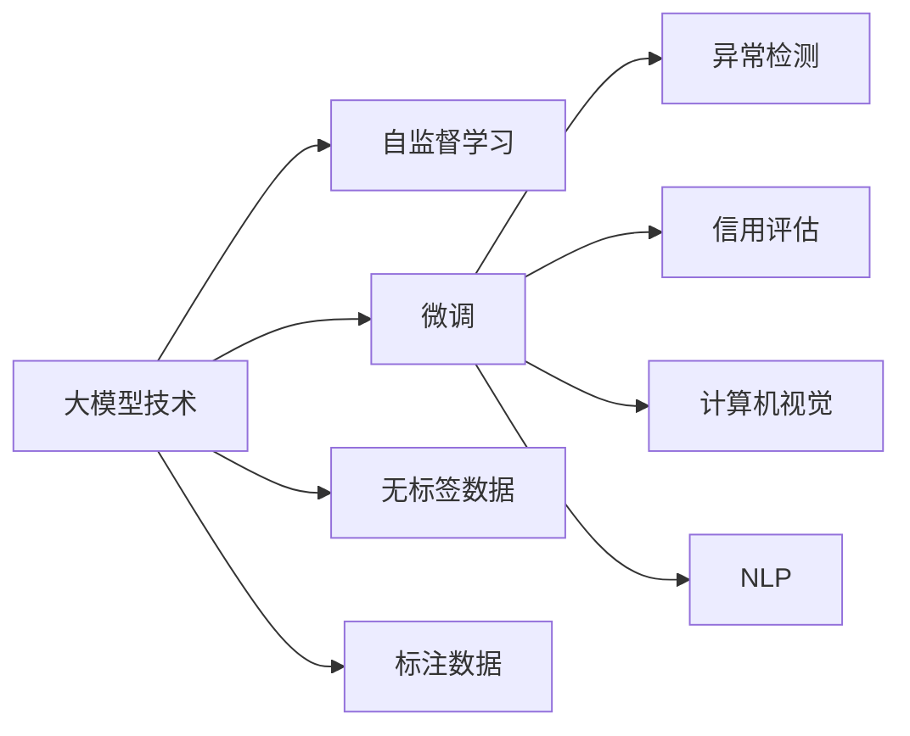

                 

# 大模型技术在电商反欺诈系统中的应用

> 关键词：大模型技术,反欺诈,自然语言处理(NLP),计算机视觉(CV),电商行业,信用评估,异常检测,数据驱动

## 1. 背景介绍

### 1.1 问题由来

随着电商行业的迅速发展，用户数量和交易规模的激增带来了诸多挑战，其中包括日益严重的欺诈行为。电商欺诈不仅严重影响商家的营收和信任，也给消费者带来潜在的经济损失。据统计，全球电商欺诈每年给商家造成的损失高达数百亿美元。因此，构建一套高效、准确的反欺诈系统，成为电商平台保护自身利益和消费者权益的当务之急。

传统反欺诈系统主要依赖规则引擎和机器学习模型，通过提取特征、构建模型、设计规则等手段，对交易数据进行实时或批处理。虽然这些方法在一定程度上提高了反欺诈的准确率，但也存在以下问题：

1. 规则引擎的构建需要大量的人工经验和手动调整，工作量巨大，且规则的完备性和复杂度直接影响模型效果。
2. 机器学习模型在面对新的欺诈手法时，需要重新训练和调整，耗时较长且难以灵活应对不断变化的欺诈模式。
3. 特征工程复杂，需要提取、融合大量非结构化数据，且特征的选择和处理不当会引入噪音，影响模型性能。
4. 对数据分布和特征空间假设较强，难以处理多模态数据和动态变化的交易场景。

大模型技术作为一种新兴的技术范式，以其强大的语言理解、视觉感知和模式识别能力，为反欺诈系统带来了新的解决方案。通过在大模型基础上进行微调，可以显著提升反欺诈系统的智能化水平，降低对人工干预的依赖，提高欺诈检测的准确率和响应速度。

## 2. 核心概念与联系

### 2.1 核心概念概述

本节将介绍几个在大模型技术应用于反欺诈系统时至关重要的核心概念：

- 大模型技术（Large Model Technology）：指利用Transformer等架构的深度神经网络模型，在大规模无标签数据上进行的自监督预训练。如GPT、BERT、DALL-E等。
- 自监督学习（Self-supervised Learning）：一种无需显式标注数据的训练方式，通过在原始数据上构建假标签，利用模型自身的能力学习到通用的语言/视觉表示。
- 微调（Fine-tuning）：在自监督预训练模型的基础上，利用少量标注数据进行有监督学习，对特定任务进行适配，提升模型在该任务上的性能。
- 异常检测（Anomaly Detection）：检测数据中的异常或偏差，常用于检测欺诈行为、异常交易等。
- 计算机视觉（Computer Vision, CV）：利用深度神经网络模型，实现对图像、视频等视觉数据的处理和分析。
- 自然语言处理（Natural Language Processing, NLP）：利用深度神经网络模型，实现对文本数据的处理和分析。
- 信用评估（Credit Scoring）：根据用户的历史行为数据，对其信用水平进行评估，常用于金融风控等领域。

这些核心概念之间的联系和作用关系，可以通过以下Mermaid流程图来展示：



这个流程图展示了从大模型技术的预训练到微调的整个过程，以及各个步骤之间的关系：

1. 大模型技术在无标签数据上进行预训练，学习到通用的语言/视觉表示。
2. 通过微调，在大模型基础上适配特定任务，如异常检测、信用评估、计算机视觉等。
3. 异常检测和信用评估需要数据标注，可以用于检测欺诈行为、评估用户信用等。
4. 计算机视觉和NLP分别处理图像和文本数据，为反欺诈提供多模态的特征支持。

通过理解这些核心概念，我们可以更好地把握大模型技术在反欺诈系统中的应用逻辑。

## 3. 核心算法原理 & 具体操作步骤
### 3.1 算法原理概述

基于大模型技术的反欺诈系统，本质上是将大模型作为强大的特征提取器，通过微调适配特定任务（如异常检测、信用评估等），实现对欺诈行为的高效检测和分类。

假设大模型为 $M_{\theta}$，其中 $\theta$ 为预训练得到的模型参数。对于反欺诈系统，下游任务为异常检测或信用评估。假设标注数据集为 $D=\{(x_i,y_i)\}_{i=1}^N$，其中 $x_i$ 为交易数据，$y_i \in \{0,1\}$ 表示是否为欺诈行为。微调的目标是找到新的模型参数 $\hat{\theta}$，使得模型在特定任务上的性能最大化：

$$
\hat{\theta}=\mathop{\arg\min}_{\theta} \mathcal{L}(M_{\theta},D)
$$

其中 $\mathcal{L}$ 为针对任务设计的损失函数，用于衡量模型预测输出与真实标签之间的差异。常见的损失函数包括交叉熵损失、均方误差损失等。

通过梯度下降等优化算法，微调过程不断更新模型参数 $\theta$，最小化损失函数 $\mathcal{L}$，使得模型输出逼近真实标签。由于 $\theta$ 已经通过预训练获得了较好的初始化，因此即便在标注数据有限的情况下，仍能较快收敛到理想的模型参数 $\hat{\theta}$。

### 3.2 算法步骤详解

基于大模型技术的反欺诈系统，主要包括以下几个关键步骤：

**Step 1: 准备预训练模型和数据集**
- 选择合适的预训练大模型 $M_{\theta}$ 作为初始化参数，如BERT、GPT、DALL-E等。
- 准备下游任务的标注数据集 $D$，划分为训练集、验证集和测试集。一般要求标注数据与预训练数据的分布不要差异过大。

**Step 2: 添加任务适配层**
- 根据任务类型，在预训练模型顶层设计合适的输出层和损失函数。
- 对于分类任务，通常在顶层添加线性分类器和交叉熵损失函数。
- 对于生成任务，通常使用语言模型的解码器输出概率分布，并以负对数似然为损失函数。
- 对于计算机视觉任务，可以使用深度神经网络模型进行特征提取，并在顶层添加分类器或回归器。

**Step 3: 设置微调超参数**
- 选择合适的优化算法及其参数，如 AdamW、SGD 等，设置学习率、批大小、迭代轮数等。
- 设置正则化技术及强度，包括权重衰减、Dropout、Early Stopping 等。
- 确定冻结预训练参数的策略，如仅微调顶层，或全部参数都参与微调。

**Step 4: 执行梯度训练**
- 将训练集数据分批次输入模型，前向传播计算损失函数。
- 反向传播计算参数梯度，根据设定的优化算法和学习率更新模型参数。
- 周期性在验证集上评估模型性能，根据性能指标决定是否触发 Early Stopping。
- 重复上述步骤直到满足预设的迭代轮数或 Early Stopping 条件。

**Step 5: 测试和部署**
- 在测试集上评估微调后模型 $M_{\hat{\theta}}$ 的性能，对比微调前后的精度提升。
- 使用微调后的模型对新样本进行推理预测，集成到实际的应用系统中。
- 持续收集新的数据，定期重新微调模型，以适应数据分布的变化。

以上是基于大模型技术的反欺诈系统的一般流程。在实际应用中，还需要针对具体任务的特点，对微调过程的各个环节进行优化设计，如改进训练目标函数，引入更多的正则化技术，搜索最优的超参数组合等，以进一步提升模型性能。

### 3.3 算法优缺点

基于大模型技术的反欺诈系统具有以下优点：
1. 泛化能力强。由于大模型在大量无标签数据上进行预训练，学习到丰富的语言/视觉特征，能够在标注数据较少的情况下仍取得不错的效果。
2. 适应性强。大模型可以灵活适配不同任务，如异常检测、信用评估等，实现多模态特征的融合。
3. 可解释性差。大模型的复杂结构和大量参数使得模型的决策过程难以解释，难以进行调试和优化。
4. 计算资源需求高。大模型的计算和内存需求较大，需要高性能计算资源支持。
5. 实时性要求高。在大规模数据流上实时处理和预测，对模型的推理速度和响应时间提出了高要求。

尽管存在这些局限性，但就目前而言，基于大模型技术的反欺诈系统仍是一种高效、准确且灵活的解决方案，广泛应用于各类电商平台和金融风控场景。

### 3.4 算法应用领域

基于大模型技术的反欺诈系统，在多个电商和金融领域得到了广泛应用，具体包括：

- 电商交易欺诈检测：利用预训练的大模型，检测交易中的异常行为，如虚假交易、刷单等。
- 金融信用评估：基于用户的历史行为数据，利用大模型预测其信用评分，评估其贷款风险。
- 网络诈骗识别：对用户行为进行建模，识别潜在的网络诈骗行为。
- 客服异常对话监测：监控客服对话中的异常情绪和行为，识别潜在的用户投诉和欺诈。
- 物流异常监控：监控物流数据中的异常信息，如虚假地址、伪造单据等。

除了上述这些核心应用领域外，大模型技术还能够在供应链管理、产品推荐、用户行为分析等诸多场景中发挥作用，为电商和金融行业带来新的变革和机遇。

## 4. 数学模型和公式 & 详细讲解  
### 4.1 数学模型构建

本节将使用数学语言对基于大模型技术的反欺诈系统进行更加严格的刻画。

记预训练大模型为 $M_{\theta}$，其中 $\theta$ 为预训练得到的模型参数。假设反欺诈任务为异常检测，标注数据集为 $D=\{(x_i,y_i)\}_{i=1}^N$，其中 $x_i$ 为交易数据，$y_i \in \{0,1\}$。

定义模型 $M_{\theta}$ 在数据样本 $(x,y)$ 上的损失函数为 $\ell(M_{\theta}(x),y)$，则在数据集 $D$ 上的经验风险为：

$$
\mathcal{L}(\theta) = \frac{1}{N} \sum_{i=1}^N \ell(M_{\theta}(x_i),y_i)
$$

微调的优化目标是最小化经验风险，即找到最优参数：

$$
\theta^* = \mathop{\arg\min}_{\theta} \mathcal{L}(\theta)
$$

在实践中，我们通常使用基于梯度的优化算法（如SGD、Adam等）来近似求解上述最优化问题。设 $\eta$ 为学习率，$\lambda$ 为正则化系数，则参数的更新公式为：

$$
\theta \leftarrow \theta - \eta \nabla_{\theta}\mathcal{L}(\theta) - \eta\lambda\theta
$$

其中 $\nabla_{\theta}\mathcal{L}(\theta)$ 为损失函数对参数 $\theta$ 的梯度，可通过反向传播算法高效计算。

### 4.2 公式推导过程

以下我们以二分类任务为例，推导交叉熵损失函数及其梯度的计算公式。

假设模型 $M_{\theta}$ 在输入 $x$ 上的输出为 $\hat{y}=M_{\theta}(x) \in [0,1]$，表示样本属于正类的概率。真实标签 $y \in \{0,1\}$。则二分类交叉熵损失函数定义为：

$$
\ell(M_{\theta}(x),y) = -[y\log \hat{y} + (1-y)\log (1-\hat{y})]
$$

将其代入经验风险公式，得：

$$
\mathcal{L}(\theta) = -\frac{1}{N}\sum_{i=1}^N [y_i\log M_{\theta}(x_i)+(1-y_i)\log(1-M_{\theta}(x_i))]
$$

根据链式法则，损失函数对参数 $\theta_k$ 的梯度为：

$$
\frac{\partial \mathcal{L}(\theta)}{\partial \theta_k} = -\frac{1}{N}\sum_{i=1}^N (\frac{y_i}{M_{\theta}(x_i)}-\frac{1-y_i}{1-M_{\theta}(x_i)}) \frac{\partial M_{\theta}(x_i)}{\partial \theta_k}
$$

其中 $\frac{\partial M_{\theta}(x_i)}{\partial \theta_k}$ 可进一步递归展开，利用自动微分技术完成计算。

在得到损失函数的梯度后，即可带入参数更新公式，完成模型的迭代优化。重复上述过程直至收敛，最终得到适应反欺诈任务的最优模型参数 $\theta^*$。

## 5. 项目实践：代码实例和详细解释说明
### 5.1 开发环境搭建

在进行反欺诈系统微调实践前，我们需要准备好开发环境。以下是使用Python进行PyTorch开发的环境配置流程：

1. 安装Anaconda：从官网下载并安装Anaconda，用于创建独立的Python环境。

2. 创建并激活虚拟环境：
```bash
conda create -n pytorch-env python=3.8 
conda activate pytorch-env
```

3. 安装PyTorch：根据CUDA版本，从官网获取对应的安装命令。例如：
```bash
conda install pytorch torchvision torchaudio cudatoolkit=11.1 -c pytorch -c conda-forge
```

4. 安装Transformers库：
```bash
pip install transformers
```

5. 安装各类工具包：
```bash
pip install numpy pandas scikit-learn matplotlib tqdm jupyter notebook ipython
```

完成上述步骤后，即可在`pytorch-env`环境中开始微调实践。

### 5.2 源代码详细实现

下面我们以异常检测任务为例，给出使用Transformers库对BERT模型进行微调的PyTorch代码实现。

首先，定义异常检测任务的数据处理函数：

```python
from transformers import BertTokenizer
from torch.utils.data import Dataset
import torch

class AnomalyDetectionDataset(Dataset):
    def __init__(self, texts, labels, tokenizer, max_len=128):
        self.texts = texts
        self.labels = labels
        self.tokenizer = tokenizer
        self.max_len = max_len
        
    def __len__(self):
        return len(self.texts)
    
    def __getitem__(self, item):
        text = self.texts[item]
        label = self.labels[item]
        
        encoding = self.tokenizer(text, return_tensors='pt', max_length=self.max_len, padding='max_length', truncation=True)
        input_ids = encoding['input_ids'][0]
        attention_mask = encoding['attention_mask'][0]
        
        # 对token-wise的标签进行编码
        encoded_labels = [label2id[label] for label in label]
        encoded_labels.extend([label2id['normal']] * (self.max_len - len(encoded_labels)))
        labels = torch.tensor(encoded_labels, dtype=torch.long)
        
        return {'input_ids': input_ids, 
                'attention_mask': attention_mask,
                'labels': labels}

# 标签与id的映射
label2id = {'normal': 0, 'abnormal': 1}
id2label = {v: k for k, v in label2id.items()}

# 创建dataset
tokenizer = BertTokenizer.from_pretrained('bert-base-cased')

train_dataset = AnomalyDetectionDataset(train_texts, train_labels, tokenizer)
dev_dataset = AnomalyDetectionDataset(dev_texts, dev_labels, tokenizer)
test_dataset = AnomalyDetectionDataset(test_texts, test_labels, tokenizer)
```

然后，定义模型和优化器：

```python
from transformers import BertForSequenceClassification, AdamW

model = BertForSequenceClassification.from_pretrained('bert-base-cased', num_labels=len(label2id))

optimizer = AdamW(model.parameters(), lr=2e-5)
```

接着，定义训练和评估函数：

```python
from torch.utils.data import DataLoader
from tqdm import tqdm
from sklearn.metrics import accuracy_score

device = torch.device('cuda') if torch.cuda.is_available() else torch.device('cpu')
model.to(device)

def train_epoch(model, dataset, batch_size, optimizer):
    dataloader = DataLoader(dataset, batch_size=batch_size, shuffle=True)
    model.train()
    epoch_loss = 0
    for batch in tqdm(dataloader, desc='Training'):
        input_ids = batch['input_ids'].to(device)
        attention_mask = batch['attention_mask'].to(device)
        labels = batch['labels'].to(device)
        model.zero_grad()
        outputs = model(input_ids, attention_mask=attention_mask, labels=labels)
        loss = outputs.loss
        epoch_loss += loss.item()
        loss.backward()
        optimizer.step()
    return epoch_loss / len(dataloader)

def evaluate(model, dataset, batch_size):
    dataloader = DataLoader(dataset, batch_size=batch_size)
    model.eval()
    preds, labels = [], []
    with torch.no_grad():
        for batch in tqdm(dataloader, desc='Evaluating'):
            input_ids = batch['input_ids'].to(device)
            attention_mask = batch['attention_mask'].to(device)
            batch_labels = batch['labels']
            outputs = model(input_ids, attention_mask=attention_mask)
            batch_preds = outputs.logits.argmax(dim=2).to('cpu').tolist()
            batch_labels = batch_labels.to('cpu').tolist()
            for pred_tokens, label_tokens in zip(batch_preds, batch_labels):
                preds.append(pred_tokens[:len(label_tokens)])
                labels.append(label_tokens)
                
    print('Accuracy:', accuracy_score(labels, preds))
```

最后，启动训练流程并在测试集上评估：

```python
epochs = 5
batch_size = 16

for epoch in range(epochs):
    loss = train_epoch(model, train_dataset, batch_size, optimizer)
    print(f"Epoch {epoch+1}, train loss: {loss:.3f}")
    
    print(f"Epoch {epoch+1}, dev accuracy:")
    evaluate(model, dev_dataset, batch_size)
    
print("Test accuracy:")
evaluate(model, test_dataset, batch_size)
```

以上就是使用PyTorch对BERT进行异常检测任务微调的完整代码实现。可以看到，得益于Transformers库的强大封装，我们可以用相对简洁的代码完成BERT模型的加载和微调。

### 5.3 代码解读与分析

让我们再详细解读一下关键代码的实现细节：

**AnomalyDetectionDataset类**：
- `__init__`方法：初始化文本、标签、分词器等关键组件。
- `__len__`方法：返回数据集的样本数量。
- `__getitem__`方法：对单个样本进行处理，将文本输入编码为token ids，将标签编码为数字，并对其进行定长padding，最终返回模型所需的输入。

**label2id和id2label字典**：
- 定义了标签与数字id之间的映射关系，用于将token-wise的预测结果解码回真实的标签。

**训练和评估函数**：
- 使用PyTorch的DataLoader对数据集进行批次化加载，供模型训练和推理使用。
- 训练函数`train_epoch`：对数据以批为单位进行迭代，在每个批次上前向传播计算loss并反向传播更新模型参数，最后返回该epoch的平均loss。
- 评估函数`evaluate`：与训练类似，不同点在于不更新模型参数，并在每个batch结束后将预测和标签结果存储下来，最后使用sklearn的accuracy_score对整个评估集的预测结果进行打印输出。

**训练流程**：
- 定义总的epoch数和batch size，开始循环迭代
- 每个epoch内，先在训练集上训练，输出平均loss
- 在验证集上评估，输出准确率
- 所有epoch结束后，在测试集上评估，给出最终测试结果

可以看到，PyTorch配合Transformers库使得BERT微调的代码实现变得简洁高效。开发者可以将更多精力放在数据处理、模型改进等高层逻辑上，而不必过多关注底层的实现细节。

当然，工业级的系统实现还需考虑更多因素，如模型的保存和部署、超参数的自动搜索、更灵活的任务适配层等。但核心的微调范式基本与此类似。

## 6. 实际应用场景
### 6.1 电商平台异常检测

在大模型技术辅助下，电商平台的反欺诈系统可以通过实时监控交易数据，自动识别和拦截异常交易行为，降低损失。具体应用场景包括：

1. **虚假交易检测**：监控交易中的异常行为，如恶意刷单、虚假支付等。通过学习正常交易行为的模式，识别并拦截异常交易。
2. **物流欺诈监测**：检测物流数据中的异常信息，如虚假订单、伪造单据等。确保物流数据的真实性和安全性。
3. **用户行为异常检测**：监控用户行为中的异常模式，如异常登录、频繁更换设备等。预防账户被盗用和恶意操作。

通过在大模型基础上进行微调，电商平台的反欺诈系统可以实时处理海量交易数据，快速识别出潜在的欺诈行为，有效保护商家和消费者的权益。

### 6.2 金融风控系统

在金融领域，大模型技术同样被广泛应用于风险评估和欺诈检测。具体场景包括：

1. **信用评估与贷款审批**：基于用户的历史行为数据，利用大模型预测其信用评分，评估其贷款风险。帮助金融机构做出更准确的贷款决策。
2. **信用卡欺诈检测**：监控信用卡交易中的异常行为，如异地交易、大额消费等。及时识别并阻止潜在欺诈行为，保护用户资产安全。
3. **反洗钱监测**：检测可疑交易行为，如异常资金转移、大额现金交易等。预防洗钱和非法活动，维护金融市场秩序。

通过大模型技术的辅助，金融风控系统能够更精准地识别潜在风险，降低损失，提升用户信任度。

### 6.3 智能客服与客户投诉管理

智能客服系统通过大模型技术的微调，可以实时监测客服对话，识别潜在的用户投诉和欺诈行为。具体场景包括：

1. **客户投诉检测**：监控客服对话中的异常情绪和行为，识别用户的不满情绪和投诉意图。及时介入，提升客户满意度。
2. **欺诈行为识别**：分析客服对话中的关键信息，识别潜在的网络诈骗行为。帮助客服识别并阻止欺诈行为。
3. **客户行为分析**：通过分析客服对话中的用户行为模式，发现潜在的用户流失风险。及时采取措施，提升客户忠诚度。

通过大模型技术的微调，智能客服系统能够更准确地理解客户需求，快速响应客户问题，提升客户体验和信任度。

### 6.4 未来应用展望

随着大模型技术和大数据技术的不断进步，基于大模型技术的反欺诈系统将在更多领域得到应用，为金融、电商、物流等行业带来新的解决方案。

在智慧医疗领域，基于大模型技术的反欺诈系统可以帮助医疗机构识别和预防医疗欺诈行为，提升医疗服务的质量和安全性。

在智能交通领域，反欺诈系统可以监控交通数据，识别异常行为，预防交通事故和违规行为，提升交通安全和效率。

在智能家居领域，通过监控家居设备的使用情况，识别异常行为，预防安全隐患，提升家庭安全性。

此外，在企业生产、社会治理、安全监控等众多领域，大模型技术都将发挥重要作用，为构建更加安全、智能的社会提供新的动力。

## 7. 工具和资源推荐
### 7.1 学习资源推荐

为了帮助开发者系统掌握大模型技术在反欺诈系统中的应用，这里推荐一些优质的学习资源：

1. 《Transformers in Action》系列博文：由大模型技术专家撰写，深入浅出地介绍了Transformer原理、BERT模型、微调技术等前沿话题。

2. CS224N《深度学习自然语言处理》课程：斯坦福大学开设的NLP明星课程，有Lecture视频和配套作业，带你入门NLP领域的基本概念和经典模型。

3. 《Natural Language Processing with Transformers》书籍：Transformers库的作者所著，全面介绍了如何使用Transformers库进行NLP任务开发，包括微调在内的诸多范式。

4. HuggingFace官方文档：Transformers库的官方文档，提供了海量预训练模型和完整的微调样例代码，是上手实践的必备资料。

5. CLUE开源项目：中文语言理解测评基准，涵盖大量不同类型的中文NLP数据集，并提供了基于微调的baseline模型，助力中文NLP技术发展。

通过对这些资源的学习实践，相信你一定能够快速掌握大模型技术在反欺诈系统中的应用，并用于解决实际的NLP问题。

### 7.2 开发工具推荐

高效的开发离不开优秀的工具支持。以下是几款用于大模型技术在反欺诈系统中的应用开发的常用工具：

1. PyTorch：基于Python的开源深度学习框架，灵活动态的计算图，适合快速迭代研究。大部分预训练语言模型都有PyTorch版本的实现。

2. TensorFlow：由Google主导开发的开源深度学习框架，生产部署方便，适合大规模工程应用。同样有丰富的预训练语言模型资源。

3. Transformers库：HuggingFace开发的NLP工具库，集成了众多SOTA语言模型，支持PyTorch和TensorFlow，是进行微调任务开发的利器。

4. Weights & Biases：模型训练的实验跟踪工具，可以记录和可视化模型训练过程中的各项指标，方便对比和调优。与主流深度学习框架无缝集成。

5. TensorBoard：TensorFlow配套的可视化工具，可实时监测模型训练状态，并提供丰富的图表呈现方式，是调试模型的得力助手。

6. Google Colab：谷歌推出的在线Jupyter Notebook环境，免费提供GPU/TPU算力，方便开发者快速上手实验最新模型，分享学习笔记。

合理利用这些工具，可以显著提升大模型技术在反欺诈系统中的应用开发效率，加快创新迭代的步伐。

### 7.3 相关论文推荐

大模型技术和大数据技术的发展源于学界的持续研究。以下是几篇奠基性的相关论文，推荐阅读：

1. Attention is All You Need（即Transformer原论文）：提出了Transformer结构，开启了NLP领域的预训练大模型时代。

2. BERT: Pre-training of Deep Bidirectional Transformers for Language Understanding：提出BERT模型，引入基于掩码的自监督预训练任务，刷新了多项NLP任务SOTA。

3. Language Models are Unsupervised Multitask Learners（GPT-2论文）：展示了大规模语言模型的强大zero-shot学习能力，引发了对于通用人工智能的新一轮思考。

4. Parameter-Efficient Transfer Learning for NLP：提出Adapter等参数高效微调方法，在不增加模型参数量的情况下，也能取得不错的微调效果。

5. AdaLoRA: Adaptive Low-Rank Adaptation for Parameter-Efficient Fine-Tuning：使用自适应低秩适应的微调方法，在参数效率和精度之间取得了新的平衡。

这些论文代表了大模型技术和大数据技术的发展脉络。通过学习这些前沿成果，可以帮助研究者把握学科前进方向，激发更多的创新灵感。

## 8. 总结：未来发展趋势与挑战
### 8.1 总结

本文对基于大模型技术的反欺诈系统进行了全面系统的介绍。首先阐述了反欺诈系统的背景和意义，明确了基于大模型技术的微调方法在大规模数据流处理、实时性要求高的场景中的独特价值。其次，从原理到实践，详细讲解了基于大模型技术的微调过程，给出了微调任务开发的完整代码实例。同时，本文还广泛探讨了基于大模型技术的反欺诈系统在电商、金融、智能客服等领域的实际应用场景，展示了微调范式的强大潜力。此外，本文精选了微调技术的各类学习资源，力求为读者提供全方位的技术指引。

通过本文的系统梳理，可以看到，基于大模型技术的微调方法在大规模数据流处理、实时性要求高的场景中具有显著优势，能够实时处理和预测海量数据，有效防范欺诈行为。未来，随着大模型技术的不断演进，基于大模型技术的反欺诈系统将具备更强的适应性和泛化能力，为金融、电商、智能客服等领域带来新的解决方案。

### 8.2 未来发展趋势

展望未来，基于大模型技术的反欺诈系统将呈现以下几个发展趋势：

1. 模型规模持续增大。随着算力成本的下降和数据规模的扩张，预训练语言模型的参数量还将持续增长。超大规模语言模型蕴含的丰富语言知识，有望支撑更加复杂多变的下游任务微调。

2. 微调方法日趋多样。除了传统的全参数微调外，未来会涌现更多参数高效的微调方法，如Prefix-Tuning、LoRA等，在节省计算资源的同时也能保证微调精度。

3. 持续学习成为常态。随着数据分布的不断变化，微调模型也需要持续学习新知识以保持性能。如何在不遗忘原有知识的同时，高效吸收新样本信息，将成为重要的研究课题。

4. 标注样本需求降低。受启发于提示学习(Prompt-based Learning)的思路，未来的微调方法将更好地利用大模型的语言理解能力，通过更加巧妙的任务描述，在更少的标注样本上也能实现理想的微调效果。

5. 实时性要求提高。在大规模数据流上实时处理和预测，对模型的推理速度和响应时间提出了高要求。如何在保证性能的同时，简化模型结构，提升推理速度，优化资源占用，将是重要的优化方向。

6. 多模态微调崛起。当前的微调主要聚焦于纯文本数据，未来会进一步拓展到图像、视频、语音等多模态数据微调。多模态信息的融合，将显著提升语言模型对现实世界的理解和建模能力。

以上趋势凸显了大模型技术在反欺诈系统中的应用前景。这些方向的探索发展，必将进一步提升反欺诈系统的智能化水平，降低对人工干预的依赖，提高欺诈检测的准确率和响应速度。

### 8.3 面临的挑战

尽管基于大模型技术的反欺诈系统已经取得了瞩目成就，但在迈向更加智能化、普适化应用的过程中，它仍面临着诸多挑战：

1. 标注成本瓶颈。虽然微调大大降低了标注数据的需求，但对于长尾应用场景，难以获得充足的高质量标注数据，成为制约微调性能的瓶颈。如何进一步降低微调对标注样本的依赖，将是一大难题。

2. 模型鲁棒性不足。当前微调模型面对域外数据时，泛化性能往往大打折扣。对于测试样本的微小扰动，微调模型的预测也容易发生波动。如何提高微调模型的鲁棒性，避免灾难性遗忘，还需要更多理论和实践的积累。

3. 推理效率有待提高。大规模语言模型虽然精度高，但在实际部署时往往面临推理速度慢、内存占用大等效率问题。如何在保证性能的同时，简化模型结构，提升推理速度，优化资源占用，将是重要的优化方向。

4. 可解释性亟需加强。当前微调模型更像是"黑盒"系统，难以解释其内部工作机制和决策逻辑。对于医疗、金融等高风险应用，算法的可解释性和可审计性尤为重要。如何赋予微调模型更强的可解释性，将是亟待攻克的难题。

5. 安全性有待保障。预训练语言模型难免会学习到有偏见、有害的信息，通过微调传递到下游任务，产生误导性、歧视性的输出，给实际应用带来安全隐患。如何从数据和算法层面消除模型偏见，避免恶意用途，确保输出的安全性，也将是重要的研究课题。

6. 知识整合能力不足。现有的微调模型往往局限于任务内数据，难以灵活吸收和运用更广泛的先验知识。如何让微调过程更好地与外部知识库、规则库等专家知识结合，形成更加全面、准确的信息整合能力，还有很大的想象空间。

正视微调面临的这些挑战，积极应对并寻求突破，将是大模型技术在反欺诈系统中走向成熟的必由之路。相信随着学界和产业界的共同努力，这些挑战终将一一被克服，大模型技术在反欺诈系统中的应用将更加广泛和深入。

### 8.4 研究展望

面向未来，大模型技术在反欺诈系统中的应用需要在以下几个方面寻求新的突破：

1. 探索无监督和半监督微调方法。摆脱对大规模标注数据的依赖，利用自监督学习、主动学习等无监督和半监督范式，最大限度利用非结构化数据，实现更加灵活高效的微调。

2. 研究参数高效和计算高效的微调范式。开发更加参数高效的微调方法，在固定大部分预训练参数的同时，只更新极少量的任务相关参数。同时优化微调模型的计算图，减少前向传播和反向传播的资源消耗，实现更加轻量级、实时性的部署。

3. 融合因果和对比学习范式。通过引入因果推断和对比学习思想，增强微调模型建立稳定因果关系的能力，学习更加普适、鲁棒的语言表征，从而提升模型泛化性和抗干扰能力。

4. 引入更多先验知识。将符号化的先验知识，如知识图谱、逻辑规则等，与神经网络模型进行巧妙融合，引导微调过程学习更准确、合理的语言模型。同时加强不同模态数据的整合，实现视觉、语音等多模态信息与文本信息的协同建模。

5. 结合因果分析和博弈论工具。将因果分析方法引入微调模型，识别出模型决策的关键特征，增强输出解释的因果性和逻辑性。借助博弈论工具刻画人机交互过程，主动探索并规避模型的脆弱点，提高系统稳定性。

6. 纳入伦理道德约束。在模型训练目标中引入伦理导向的评估指标，过滤和惩罚有偏见、有害的输出倾向。同时加强人工干预和审核，建立模型行为的监管机制，确保输出符合人类价值观和伦理道德。

这些研究方向的探索，必将引领大模型技术在反欺诈系统中的应用迈向更高的台阶，为构建安全、可靠、可解释、可控的智能系统铺平道路。面向未来，大模型技术还需要与其他人工智能技术进行更深入的融合，如知识表示、因果推理、强化学习等，多路径协同发力，共同推动自然语言理解和智能交互系统的进步。只有勇于创新、敢于突破，才能不断拓展大模型技术的边界，让智能技术更好地造福人类社会。

## 9. 附录：常见问题与解答

**Q1：基于大模型技术的反欺诈系统是否适用于所有应用场景？**

A: 基于大模型技术的反欺诈系统在大规模数据流处理、实时性要求高的场景中具有显著优势，适用于电商、金融、智能客服等领域的欺诈检测。但对于一些特定领域，如医疗、法律等，需要进一步优化微调方法和模型结构，才能获得理想的效果。此外，对于一些需要实时性非常高的应用场景，如交易秒级检测等，大模型技术也需要进一步优化和优化。

**Q2：如何选择合适的学习率？**

A: 基于大模型技术的反欺诈系统通常使用较小的学习率，以避免破坏预训练权重。一般建议从1e-5开始调参，逐步减小学习率，直至收敛。也可以使用warmup策略，在开始阶段使用较小的学习率，再逐渐过渡到预设值。需要注意的是，不同的优化器(如AdamW、Adafactor等)以及不同的学习率调度策略，可能需要设置不同的学习率阈值。

**Q3：微调过程中如何缓解过拟合问题？**

A: 微调过程中过拟合是常见的问题，尤其是在标注数据较少的情况下。常见的缓解策略包括：
1. 数据增强：通过回译、近义替换等方式扩充训练集
2. 正则化：使用L2正则、Dropout、Early Stopping等避免过拟合
3. 对抗训练：引入对抗样本，提高模型鲁棒性
4. 参数高效微调：只调整少量参数(如Adapter、Prefix等)，减小过拟合风险
5. 多模型集成：训练多个微调模型，取平均输出，抑制过拟合

这些策略往往需要根据具体任务和数据特点进行灵活组合。只有在数据、模型、训练、推理等各环节进行全面优化，才能最大限度地发挥大模型技术的优势。

**Q4：如何优化基于大模型技术的反欺诈系统？**

A: 基于大模型技术的反欺诈系统需要考虑多方面的优化，包括但不限于：
1. 数据预处理：对原始数据进行清洗、去噪、特征提取等预处理，提高数据质量。
2. 模型选择：根据任务特点选择适合的预训练模型，如BERT、GPT、DALL-E等。
3. 模型微调：通过微调适配特定任务，提升模型性能。
4. 超参数调优：调整学习率、批大小、迭代轮数等超参数，优化模型训练过程。
5. 模型压缩：对大模型进行剪枝、量化等压缩，减小模型尺寸，提升推理速度。
6. 推理加速：通过优化计算图、使用GPU/TPU等高性能设备，提升模型推理速度。

通过全面优化，可以显著提升基于大模型技术的反欺霜系统的性能和效率，降低成本，提高响应速度。

---

作者：禅与计算机程序设计艺术 / Zen and the Art of Computer Programming

