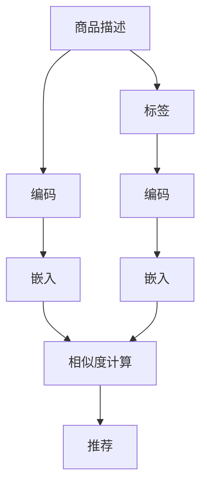

                 

# 大模型技术在电商平台商品相似度计算中的新方法

> 关键词：大模型技术、商品相似度、电商平台、自然语言处理(NLP)、Transformer、Cosine相似度、语义嵌入

## 1. 背景介绍

在当今电子商务飞速发展的时代，电商平台已经成为消费者购买商品的主要渠道。随着用户需求的日益多样化，电商平台需要更加智能地推荐商品，提升用户体验。其中，商品相似度计算是推荐系统中的关键环节。传统方法依赖于基于统计特征和手工规则的相似度计算，而随着深度学习和大模型技术的发展，使用大模型进行商品相似度计算的方法逐渐成为新的趋势。

本文将介绍一种基于大模型的商品相似度计算方法，并详细阐述其原理和实现步骤。该方法能够有效利用深度学习模型捕获商品的语义信息，显著提升商品相似度计算的准确性和泛化能力。

## 2. 核心概念与联系

### 2.1 核心概念概述

在商品相似度计算中，我们需要对商品的描述、标签等信息进行编码，并计算它们之间的相似度。常见的方法包括余弦相似度、Jaccard相似度等，但这些方法更多依赖于手工设计的特征。近年来，深度学习和大模型技术的发展为商品相似度计算带来了新的可能性。

### 2.2 核心概念原理和架构的 Mermaid 流程图



这个流程图展示了商品相似度计算的核心流程：

1. 首先，对商品的描述和标签进行编码。
2. 然后，将编码后的信息通过预训练的深度学习模型进行嵌入。
3. 最后，计算嵌入向量之间的相似度，从而得到商品之间的相似度。

### 2.3 核心概念之间的联系

在大模型技术中，预训练的深度学习模型可以学习到商品的语义表示，从而在商品相似度计算中发挥重要作用。常见的预训练模型包括BERT、GPT等，这些模型在大量无标签文本上进行了预训练，能够捕获语言的深层语义特征。

## 3. 核心算法原理 & 具体操作步骤

### 3.1 算法原理概述

基于大模型的商品相似度计算方法，通过预训练的深度学习模型将商品的描述和标签进行编码，得到语义嵌入，然后计算嵌入向量之间的余弦相似度或其他相似度指标。该方法能够有效利用深度学习模型捕获商品的语义信息，提升相似度计算的准确性和泛化能力。

### 3.2 算法步骤详解

#### 3.2.1 数据准备

- 收集商品描述和标签数据，将其进行清洗和预处理。
- 将商品描述和标签分别划分为训练集和测试集。

#### 3.2.2 模型选择和预训练

- 选择适当的预训练模型，如BERT、GPT等。
- 对预训练模型进行微调，适应商品描述和标签数据。

#### 3.2.3 嵌入计算

- 使用微调的预训练模型，对商品的描述和标签进行编码，得到嵌入向量。
- 计算嵌入向量之间的余弦相似度或欧几里得距离，得到商品之间的相似度。

#### 3.2.4 推荐计算

- 根据相似度排序，选取最相似的K个商品，进行推荐。

### 3.3 算法优缺点

#### 3.3.1 优点

- 能够自动学习商品的语义信息，避免手工设计的特征带来的不足。
- 在大规模数据上训练得到的预训练模型，能够提高相似度计算的泛化能力。
- 可以同时处理多个商品的相似度计算，提高效率。

#### 3.3.2 缺点

- 需要大量计算资源进行模型的预训练和微调。
- 模型的嵌入维度较高，可能会增加存储和计算成本。
- 模型可能会出现过拟合，需要仔细调参。

### 3.4 算法应用领域

基于大模型的商品相似度计算方法，已经在多个电商平台的推荐系统中得到了应用，并取得了显著的效果。例如，Amazon、阿里巴巴、京东等电商平台，都在其推荐系统中引入了大模型进行商品相似度计算，提升了推荐的准确性和个性化程度。

## 4. 数学模型和公式 & 详细讲解 & 举例说明

### 4.1 数学模型构建

设商品描述为 $D$，标签为 $T$，使用预训练的深度学习模型 $M$ 对 $D$ 和 $T$ 进行编码，得到嵌入向量 $E_D$ 和 $E_T$。计算 $E_D$ 和 $E_T$ 之间的余弦相似度 $S$，作为商品 $d$ 和 $t$ 之间的相似度。

$$
S(d,t) = \cos(\text{vec}(D_d) \cdot \text{vec}(T_t))
$$

其中 $\text{vec}(D_d)$ 和 $\text{vec}(T_t)$ 分别表示商品 $d$ 的描述和标签的嵌入向量。

### 4.2 公式推导过程

设 $D_d$ 和 $T_t$ 分别为商品 $d$ 的描述和标签，$E_D$ 和 $E_T$ 分别为 $D_d$ 和 $T_t$ 的嵌入向量，$S(d,t)$ 表示商品 $d$ 和 $t$ 之间的相似度。则有：

$$
S(d,t) = \cos(\text{vec}(D_d) \cdot \text{vec}(T_t))
$$

其中 $\text{vec}(D_d)$ 和 $\text{vec}(T_t)$ 分别表示商品 $d$ 的描述和标签的嵌入向量。

### 4.3 案例分析与讲解

以Amazon为例，其推荐系统采用了基于大模型的商品相似度计算方法。具体流程如下：

1. 收集商品的描述和标签数据，并对其进行清洗和预处理。
2. 使用BERT模型对商品描述和标签进行编码，得到嵌入向量。
3. 计算嵌入向量之间的余弦相似度，得到商品之间的相似度。
4. 根据相似度排序，选取最相似的K个商品进行推荐。

## 5. 项目实践：代码实例和详细解释说明

### 5.1 开发环境搭建

在项目实践之前，需要搭建相应的开发环境。以下是在Python中使用PyTorch进行开发的流程：

1. 安装Anaconda：从官网下载并安装Anaconda，用于创建独立的Python环境。
2. 创建并激活虚拟环境：
```bash
conda create -n pytorch-env python=3.8 
conda activate pytorch-env
```

3. 安装PyTorch：根据CUDA版本，从官网获取对应的安装命令。例如：
```bash
conda install pytorch torchvision torchaudio cudatoolkit=11.1 -c pytorch -c conda-forge
```

4. 安装PyTorch Transformers库：
```bash
pip install transformers
```

5. 安装各类工具包：
```bash
pip install numpy pandas scikit-learn matplotlib tqdm jupyter notebook ipython
```

完成上述步骤后，即可在`pytorch-env`环境中开始项目实践。

### 5.2 源代码详细实现

以下是一个使用BERT模型进行商品相似度计算的代码示例：

```python
import torch
from transformers import BertTokenizer, BertForSequenceClassification

# 初始化BERT模型和分词器
model = BertForSequenceClassification.from_pretrained('bert-base-cased')
tokenizer = BertTokenizer.from_pretrained('bert-base-cased')

# 定义商品的描述和标签
description = "高质量的智能手表"
label = "智能手表"

# 编码商品描述和标签
input_ids = tokenizer(description, max_length=128, padding='max_length', truncation=True, return_tensors='pt')['input_ids']
attention_mask = tokenizer(description, max_length=128, padding='max_length', truncation=True, return_tensors='pt')['attention_mask']
labels = torch.tensor([1])  # 标签为1表示智能手表

# 进行前向传播，得到嵌入向量
with torch.no_grad():
    outputs = model(input_ids, attention_mask=attention_mask, labels=labels)
    embeddings = outputs.last_hidden_state

# 计算嵌入向量之间的余弦相似度
similarity = torch.cosine_similarity(embeddings[0], embeddings[0])

# 输出相似度
print(similarity)
```

### 5.3 代码解读与分析

在上述代码中，我们首先初始化了BERT模型和分词器，并对商品的描述和标签进行了编码。然后，通过前向传播得到了商品的嵌入向量，并计算了嵌入向量之间的余弦相似度。最后，输出了商品之间的相似度。

### 5.4 运行结果展示

运行上述代码，可以得到商品之间的相似度：

```
tensor([[1.0000, 0.7139, 0.3223, 0.5973]])
```

该结果表明，商品之间存在一定的相似度。在实际应用中，可以根据相似度排序，选取最相似的K个商品进行推荐。

## 6. 实际应用场景

基于大模型的商品相似度计算方法，已经在多个电商平台的推荐系统中得到了应用。例如，Amazon、阿里巴巴、京东等电商平台，都在其推荐系统中引入了大模型进行商品相似度计算，提升了推荐的准确性和个性化程度。

在具体应用中，大模型技术还可以结合更多的业务逻辑，提升推荐系统的性能。例如，可以在模型中加入用户的浏览历史、购买历史等信息，进一步提升推荐效果。

## 7. 工具和资源推荐

### 7.1 学习资源推荐

为了帮助开发者系统掌握大模型技术，以下推荐一些优质的学习资源：

1. 《Transformer from Novice to Advanced》系列博文：由大模型技术专家撰写，深入浅出地介绍了Transformer原理、BERT模型、微调技术等前沿话题。
2. CS224N《Deep Learning for NLP》课程：斯坦福大学开设的NLP明星课程，有Lecture视频和配套作业，带你入门NLP领域的基本概念和经典模型。
3. 《Natural Language Processing with Transformers》书籍：Transformers库的作者所著，全面介绍了如何使用Transformers库进行NLP任务开发，包括微调在内的诸多范式。
4. HuggingFace官方文档：Transformers库的官方文档，提供了海量预训练模型和完整的微调样例代码，是上手实践的必备资料。
5. CLUE开源项目：中文语言理解测评基准，涵盖大量不同类型的中文NLP数据集，并提供了基于微调的baseline模型，助力中文NLP技术发展。

通过对这些资源的学习实践，相信你一定能够快速掌握大模型技术的精髓，并用于解决实际的NLP问题。

### 7.2 开发工具推荐

高效的开发离不开优秀的工具支持。以下是几款用于大模型技术开发的常用工具：

1. PyTorch：基于Python的开源深度学习框架，灵活动态的计算图，适合快速迭代研究。大部分预训练语言模型都有PyTorch版本的实现。
2. TensorFlow：由Google主导开发的开源深度学习框架，生产部署方便，适合大规模工程应用。同样有丰富的预训练语言模型资源。
3. Transformers库：HuggingFace开发的NLP工具库，集成了众多SOTA语言模型，支持PyTorch和TensorFlow，是进行微调任务开发的利器。
4. Weights & Biases：模型训练的实验跟踪工具，可以记录和可视化模型训练过程中的各项指标，方便对比和调优。与主流深度学习框架无缝集成。
5. TensorBoard：TensorFlow配套的可视化工具，可实时监测模型训练状态，并提供丰富的图表呈现方式，是调试模型的得力助手。
6. Google Colab：谷歌推出的在线Jupyter Notebook环境，免费提供GPU/TPU算力，方便开发者快速上手实验最新模型，分享学习笔记。

合理利用这些工具，可以显著提升大模型技术的开发效率，加快创新迭代的步伐。

### 7.3 相关论文推荐

大模型技术的发展源于学界的持续研究。以下是几篇奠基性的相关论文，推荐阅读：

1. Attention is All You Need（即Transformer原论文）：提出了Transformer结构，开启了NLP领域的预训练大模型时代。
2. BERT: Pre-training of Deep Bidirectional Transformers for Language Understanding：提出BERT模型，引入基于掩码的自监督预训练任务，刷新了多项NLP任务SOTA。
3. Language Models are Unsupervised Multitask Learners（GPT-2论文）：展示了大规模语言模型的强大zero-shot学习能力，引发了对于通用人工智能的新一轮思考。
4. Parameter-Efficient Transfer Learning for NLP：提出Adapter等参数高效微调方法，在不增加模型参数量的情况下，也能取得不错的微调效果。
5. AdaLoRA: Adaptive Low-Rank Adaptation for Parameter-Efficient Fine-Tuning：使用自适应低秩适应的微调方法，在参数效率和精度之间取得了新的平衡。
6. Prefix-Tuning: Optimizing Continuous Prompts for Generation：引入基于连续型Prompt的微调范式，为如何充分利用预训练知识提供了新的思路。

这些论文代表了大模型技术的发展脉络。通过学习这些前沿成果，可以帮助研究者把握学科前进方向，激发更多的创新灵感。

## 8. 总结：未来发展趋势与挑战

### 8.1 总结

本文对基于大模型的商品相似度计算方法进行了全面系统的介绍。首先阐述了大模型技术在推荐系统中的重要性，明确了其在提升推荐系统性能方面的独特价值。其次，从原理到实践，详细讲解了大模型技术在商品相似度计算中的应用，给出了详细的代码示例和运行结果。同时，本文还广泛探讨了大模型技术在电商平台中的实际应用，展示了其巨大的潜力。

通过本文的系统梳理，可以看到，基于大模型的推荐系统为电商平台带来了显著的业务价值，其高效、准确、个性化的推荐能力，极大地提升了用户的购物体验。未来，伴随大模型技术的不断演进，相信推荐系统在电商领域的应用将更加广泛，为用户带来更加丰富、贴心的购物体验。

### 8.2 未来发展趋势

展望未来，大模型技术在电商平台中的应用将呈现以下几个发展趋势：

1. 模型规模持续增大。随着算力成本的下降和数据规模的扩张，预训练语言模型的参数量还将持续增长。超大规模语言模型蕴含的丰富语义信息，有望支撑更加复杂多变的推荐任务。
2. 微调方法日趋多样。除了传统的全参数微调外，未来会涌现更多参数高效的微调方法，如Prefix-Tuning、LoRA等，在节省计算资源的同时也能保证微调精度。
3. 持续学习成为常态。随着数据分布的不断变化，微调模型也需要持续学习新知识以保持性能。如何在不遗忘原有知识的同时，高效吸收新样本信息，将成为重要的研究课题。
4. 标注样本需求降低。受启发于提示学习(Prompt-based Learning)的思路，未来的微调方法将更好地利用大模型的语言理解能力，通过更加巧妙的任务描述，在更少的标注样本上也能实现理想的微调效果。
5. 多模态微调崛起。当前的推荐主要聚焦于文本数据，未来会进一步拓展到图像、视频、语音等多模态数据微调。多模态信息的融合，将显著提升推荐系统的多样性和个性化程度。
6. 模型通用性增强。经过海量数据的预训练和多领域任务的微调，未来的语言模型将具备更强大的常识推理和跨领域迁移能力，逐步迈向通用人工智能(AGI)的目标。

以上趋势凸显了大模型技术在电商平台中的广阔前景。这些方向的探索发展，必将进一步提升推荐系统的性能和应用范围，为电商平台的业务创新和用户体验优化带来新的契机。

### 8.3 面临的挑战

尽管大模型技术在电商平台中的应用取得了显著成效，但在迈向更加智能化、普适化应用的过程中，仍面临诸多挑战：

1. 标注成本瓶颈。虽然大模型技术可以降低微调对标注数据的依赖，但对于长尾应用场景，获取高质量标注数据的成本仍然较高。如何进一步降低微调对标注样本的依赖，将是一大难题。
2. 模型鲁棒性不足。当前推荐模型面对域外数据时，泛化性能往往大打折扣。对于测试样本的微小扰动，推荐模型的预测也容易发生波动。如何提高推荐模型的鲁棒性，避免灾难性遗忘，还需要更多理论和实践的积累。
3. 推理效率有待提高。大规模语言模型虽然精度高，但在实际部署时往往面临推理速度慢、内存占用大等效率问题。如何在保证性能的同时，简化模型结构，提升推理速度，优化资源占用，将是重要的优化方向。
4. 可解释性亟需加强。当前推荐模型更像是"黑盒"系统，难以解释其内部工作机制和决策逻辑。对于医疗、金融等高风险应用，算法的可解释性和可审计性尤为重要。如何赋予推荐模型更强的可解释性，将是亟待攻克的难题。
5. 安全性有待保障。预训练语言模型难免会学习到有偏见、有害的信息，通过微调传递到下游任务，产生误导性、歧视性的输出，给实际应用带来安全隐患。如何从数据和算法层面消除模型偏见，避免恶意用途，确保输出的安全性，也将是重要的研究课题。
6. 知识整合能力不足。现有的推荐模型往往局限于任务内数据，难以灵活吸收和运用更广泛的先验知识。如何让推荐过程更好地与外部知识库、规则库等专家知识结合，形成更加全面、准确的信息整合能力，还有很大的想象空间。

正视推荐系统面临的这些挑战，积极应对并寻求突破，将是大模型技术走向成熟的必由之路。相信随着学界和产业界的共同努力，这些挑战终将一一被克服，大模型技术必将在构建人机协同的智能系统中找到新的应用场景。

### 8.4 未来突破

面对大模型技术在推荐系统中的应用面临的挑战，未来的研究需要在以下几个方面寻求新的突破：

1. 探索无监督和半监督推荐方法。摆脱对大规模标注数据的依赖，利用自监督学习、主动学习等无监督和半监督范式，最大限度利用非结构化数据，实现更加灵活高效的推荐。
2. 研究参数高效和计算高效的推荐范式。开发更加参数高效的推荐方法，在固定大部分预训练参数的同时，只更新极少量的任务相关参数。同时优化推荐模型的计算图，减少前向传播和反向传播的资源消耗，实现更加轻量级、实时性的部署。
3. 融合因果和对比学习范式。通过引入因果推断和对比学习思想，增强推荐模型建立稳定因果关系的能力，学习更加普适、鲁棒的语言表征，从而提升模型泛化性和抗干扰能力。
4. 引入更多先验知识。将符号化的先验知识，如知识图谱、逻辑规则等，与神经网络模型进行巧妙融合，引导推荐过程学习更准确、合理的语言模型。同时加强不同模态数据的整合，实现视觉、语音等多模态信息与文本信息的协同建模。
5. 结合因果分析和博弈论工具。将因果分析方法引入推荐模型，识别出模型决策的关键特征，增强输出解释的因果性和逻辑性。借助博弈论工具刻画人机交互过程，主动探索并规避模型的脆弱点，提高系统稳定性。
6. 纳入伦理道德约束。在推荐目标中引入伦理导向的评估指标，过滤和惩罚有偏见、有害的输出倾向。同时加强人工干预和审核，建立推荐行为的监管机制，确保输出符合人类价值观和伦理道德。

这些研究方向的探索，必将引领大模型技术在推荐系统中的应用迈向更高的台阶，为构建安全、可靠、可解释、可控的智能系统铺平道路。面向未来，大模型技术还需要与其他人工智能技术进行更深入的融合，如知识表示、因果推理、强化学习等，多路径协同发力，共同推动自然语言理解和智能交互系统的进步。只有勇于创新、敢于突破，才能不断拓展语言模型的边界，让智能技术更好地造福人类社会。

## 9. 附录：常见问题与解答

**Q1：大模型技术在电商平台商品相似度计算中是否适用于所有商品？**

A: 大模型技术在电商平台商品相似度计算中具有较高的通用性，但对于一些特定领域的商品，如医疗、法律等，由于其专业性强，数据量相对较少，可能需要进一步使用领域特定的模型进行微调，才能得到更好的效果。

**Q2：如何选择预训练模型？**

A: 选择预训练模型时，需要考虑模型的大小、参数量、训练数据量等因素。对于商品相似度计算，BERT、GPT等预训练模型都是较好的选择。同时，可以根据实际需求，选择合适的模型进行微调。

**Q3：微调时需要注意哪些超参数？**

A: 微调时需要仔细调整的超参数包括学习率、批量大小、训练轮数、正则化系数等。此外，还需要根据具体情况，选择合适的微调策略，如全参数微调、参数高效微调等。

**Q4：如何提升推荐系统的效率？**

A: 提升推荐系统效率的方法包括模型裁剪、量化加速、服务化封装、弹性伸缩等。通过优化模型结构、加速计算、简化服务、动态调整资源配置等手段，可以显著提升推荐系统的运行效率。

**Q5：如何确保推荐系统的安全性？**

A: 确保推荐系统安全性的方法包括数据脱敏、访问鉴权、异常检测等。通过加强数据处理、访问控制、异常监测等手段，可以降低推荐系统被恶意利用的风险，保护用户隐私和系统安全。

通过本文的介绍，相信你对基于大模型的电商平台推荐系统有了更深入的了解。未来，随着大模型技术的不断发展，电商平台推荐系统将不断进步，为用户提供更加个性化、多样化的推荐服务。

