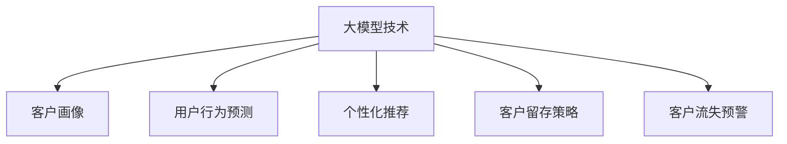

                 

# 大模型技术在电商平台客户生命周期管理中的应用

> 关键词：电商平台, 客户生命周期管理, 大模型技术, 客户画像, 用户行为预测, 个性化推荐, 客户留存, 客户流失预警

## 1. 背景介绍

### 1.1 问题由来

随着互联网技术的发展和电子商务的崛起，电商平台已成为广大消费者购物的主要渠道。面对海量的用户数据，电商平台必须通过有效的客户生命周期管理(Customer Lifecycle Management, CLM)策略，对客户进行精准分类、预测和营销，从而实现客户留存、转化和流失预警。传统的客户生命周期管理方法大多依赖于基于规则的逻辑推理和历史数据分析，难以覆盖多样化的客户行为和潜在的未知需求。

近年来，随着大模型技术的兴起，基于深度学习、自然语言处理(NLP)等人工智能技术的方法逐渐成为电商领域的热点。大模型通过学习大规模数据集的通用特征，具备强大的数据建模和预测能力，能够自动发现数据中的复杂模式，为电商平台提供了一种全新的客户生命周期管理手段。

### 1.2 问题核心关键点

大模型技术在电商平台客户生命周期管理中的应用主要集中在以下几个方面：

- **客户画像**：利用大模型提取用户行为特征，形成更加全面、准确的客户画像，便于电商平台进行个性化营销。
- **用户行为预测**：通过分析用户历史行为数据，利用大模型进行行为预测，识别出可能流失的用户。
- **个性化推荐**：根据用户的兴趣偏好和行为数据，通过大模型生成个性化的商品推荐，提升用户购物体验。
- **客户留存策略**：基于用户行为预测和个性化推荐，设计合理的留存策略，有效减少用户流失，提升客户忠诚度。
- **客户流失预警**：利用大模型分析用户行为变化，及时发现客户流失征兆，提前采取预警措施。

这些关键点构成了电商平台客户生命周期管理的核心环节，大模型技术通过提升数据建模和分析能力，为电商企业提供了一种更高效、更智能的客户管理手段。

## 2. 核心概念与联系

### 2.1 核心概念概述

为更好地理解大模型技术在电商平台客户生命周期管理中的应用，本节将介绍几个密切相关的核心概念：

- **大模型技术**：以Transformer架构为代表，通过大规模数据集预训练获得通用语言表示的深度学习模型。常见的预训练模型包括BERT、GPT等，它们在各种NLP任务上取得了优异的表现。
- **客户画像**：通过用户行为、消费历史、社交数据等，利用机器学习和大模型技术，对客户进行精准分类和特征描述。
- **用户行为预测**：利用历史行为数据，通过大模型预测用户未来的购买行为、流失倾向等，帮助电商平台进行个性化营销和流失预警。
- **个性化推荐**：根据用户兴趣和行为数据，通过大模型生成个性化的商品推荐，提升用户满意度和转化率。
- **客户留存策略**：通过分析用户流失原因，设计针对性策略，如优惠券、奖励积分等，提高客户留存率。
- **客户流失预警**：利用大模型分析用户行为变化，识别流失征兆，提前采取预警措施，避免客户流失。

这些核心概念之间的逻辑关系可以通过以下Mermaid流程图来展示：



这个流程图展示了大模型技术的核心概念及其之间的关系：

1. 大模型技术通过对大量数据进行预训练，学习到通用的语言表示，具备强大的数据建模能力。
2. 客户画像和大模型技术结合，可以提取用户行为特征，形成精准的客户描述。
3. 用户行为预测利用大模型进行历史行为数据建模，预测未来行为。
4. 个性化推荐根据用户行为数据，生成个性化推荐。
5. 客户留存策略基于用户行为预测和个性化推荐，设计留存方案。
6. 客户流失预警利用大模型分析用户行为变化，提前预警客户流失。

## 3. 核心算法原理 & 具体操作步骤

### 3.1 算法原理概述

基于大模型技术的电商平台客户生命周期管理，本质上是一种数据驱动的决策支持系统。其核心思想是：利用大模型学习用户的隐性行为特征，构建用户画像，并通过预测模型和推荐系统，帮助电商平台实现客户管理与营销。

具体而言，算法流程包括以下几个步骤：

1. **数据收集与预处理**：收集用户行为数据，如浏览记录、购买历史、评价内容等，并对数据进行清洗、归一化等预处理操作。
2. **特征提取**：利用大模型提取用户行为特征，形成用户画像。
3. **用户行为预测**：基于用户画像，利用大模型进行行为预测，识别出流失用户。
4. **个性化推荐**：根据用户画像，生成个性化推荐。
5. **客户留存策略设计**：基于预测结果和个性化推荐，设计合理的客户留存策略。
6. **客户流失预警**：通过实时监控用户行为变化，提前发现流失征兆，采取预警措施。

### 3.2 算法步骤详解

以下是具体算法步骤的详细介绍：

#### 步骤1: 数据收集与预处理

电商平台需要收集用户的各类行为数据，如浏览记录、购买历史、评价内容等。数据收集方式包括：

- **日志文件**：从服务器日志中提取用户行为数据，如访问时间、访问路径、停留时间等。
- **订单记录**：从订单系统中提取用户的购买记录、支付金额、消费频率等。
- **评论数据**：从商品评价系统中提取用户对商品的评价内容和情感倾向。

收集的数据需要进行预处理，包括数据清洗、归一化、缺失值处理等。例如，对于缺失数据，可以采用均值、中位数填充，或者删除缺失严重的记录。

#### 步骤2: 特征提取

特征提取是利用大模型构建用户画像的关键步骤。常见的特征提取方法包括：

- **词向量表示**：利用预训练的大模型（如BERT），将用户行为数据转化为词向量表示。例如，将评价内容转化为词向量，用于计算用户情感倾向。
- **序列特征**：将用户的浏览记录、购买历史等转化为时间序列数据，利用LSTM、GRU等序列模型进行特征提取。
- **组合特征**：将用户的多维特征进行组合，生成更丰富的特征向量，例如将用户性别、年龄、消费金额等特征组合成单一的特征向量。

特征提取的目的是将用户行为数据转化为模型可以处理的向量形式，以便后续的预测和推荐。

#### 步骤3: 用户行为预测

用户行为预测是电商平台进行客户管理的重要手段，常见的预测方法包括：

- **分类模型**：利用大模型对用户是否流失进行二分类预测，常用的模型包括Logistic回归、SVM、决策树等。
- **回归模型**：利用大模型对用户未来的消费金额进行回归预测，常用的模型包括线性回归、随机森林、XGBoost等。
- **序列模型**：利用RNN、LSTM、GRU等序列模型对用户未来的行为进行预测，例如预测用户的购买频率、购买金额等。

用户行为预测的目的是通过历史数据，预测用户未来的行为，识别出可能流失的用户。

#### 步骤4: 个性化推荐

个性化推荐是电商平台提高用户满意度和转化率的重要手段，常见的推荐方法包括：

- **协同过滤**：利用大模型计算用户之间的相似度，为用户推荐相似用户的购买记录。
- **基于内容的推荐**：利用大模型提取商品特征，将用户兴趣和商品特征进行匹配，推荐相似的商品。
- **混合推荐**：将协同过滤和基于内容的推荐进行组合，生成更精准的推荐结果。

个性化推荐的目的是根据用户兴趣和行为数据，生成个性化的商品推荐，提升用户购物体验。

#### 步骤5: 客户留存策略设计

客户留存策略设计是电商平台进行客户管理的重要环节，常见的策略包括：

- **优惠券**：根据用户的购买历史和行为数据，生成个性化的优惠券，吸引用户回访。
- **奖励积分**：根据用户的消费金额和行为数据，生成奖励积分，激励用户长期消费。
- **个性化营销**：利用大模型生成个性化的营销信息，提升用户的粘性和忠诚度。

客户留存策略设计的目的是通过个性化推荐和优惠券等策略，提升用户留存率，减少流失。

#### 步骤6: 客户流失预警

客户流失预警是电商平台进行客户管理的重要环节，常见的预警方法包括：

- **行为监控**：利用大模型实时监控用户的浏览、购买等行为，识别出行为异常的用户。
- **情感分析**：利用大模型对用户的评论、反馈等情感数据进行分析，识别出负面情绪的用户。
- **流失预测**：利用大模型对用户流失概率进行预测，提前采取预警措施。

客户流失预警的目的是通过实时监控用户行为和情感，识别出流失征兆，提前采取预警措施。

### 3.3 算法优缺点

大模型技术在电商平台客户生命周期管理中的应用具有以下优点：

- **数据建模能力强**：大模型能够自动发现数据中的复杂模式，构建精准的客户画像，识别出流失用户，生成个性化推荐。
- **泛化能力强**：大模型学习到通用的语言表示，能够应对多样化的客户行为和未知需求，提高预测和推荐的准确性。
- **可解释性差**：大模型的决策过程较为复杂，难以解释其内部工作机制和决策逻辑，需要结合业务经验进行调参和优化。
- **计算资源消耗大**：大模型的参数量庞大，训练和推理所需计算资源较多，需要在高效算力下进行优化。
- **依赖数据质量**：大模型的效果依赖于数据的质量和数量，需要不断优化数据收集和预处理流程。

尽管存在这些局限性，但大模型技术在电商平台客户生命周期管理中的应用，通过其强大的数据建模能力，已经取得了显著的效果。

### 3.4 算法应用领域

大模型技术在电商平台客户生命周期管理中的应用主要集中在以下几个方面：

- **电商零售**：利用大模型进行客户画像、行为预测和个性化推荐，提升用户满意度和转化率。
- **物流配送**：利用大模型进行客户行为预测和个性化推荐，优化配送路线和用户体验。
- **金融服务**：利用大模型进行客户画像和行为预测，设计合理的留存策略，提升客户忠诚度。
- **在线教育**：利用大模型进行学生行为分析，推荐个性化课程，提高学习效果。
- **医疗健康**：利用大模型进行患者行为分析，设计个性化诊疗方案，提升治疗效果。

这些应用场景展示了大模型技术在电商平台客户生命周期管理中的广泛适用性。

## 4. 数学模型和公式 & 详细讲解

### 4.1 数学模型构建

大模型技术在电商平台客户生命周期管理中的应用，可以通过以下数学模型进行描述：

设用户i的特征向量为 $x_i$，流失概率为 $p_i$，消费金额为 $y_i$。利用大模型进行预测的数学模型如下：

- 二分类预测：$p_i = \sigma(\mathbf{W}x_i + b)$，其中 $\sigma$ 为 sigmoid 函数，$\mathbf{W}$ 和 $b$ 为模型参数。
- 回归预测：$y_i = \mathbf{W}x_i + b$，其中 $\mathbf{W}$ 和 $b$ 为模型参数。
- 序列预测：利用 RNN、LSTM、GRU 等序列模型，预测用户未来的行为，如购买频率、购买金额等。

### 4.2 公式推导过程

以二分类预测为例，推导公式如下：

设 $x_i = (x_{i1}, x_{i2}, \dots, x_{in})$，其中 $x_{ij}$ 表示用户i的第j个特征， $y_i = [0, 1]$ 表示用户i是否流失。则二分类预测的数学模型如下：

$$
p_i = \sigma(\mathbf{W}x_i + b)
$$

其中 $\sigma$ 为 sigmoid 函数，$\mathbf{W}$ 和 $b$ 为模型参数。

对于每个用户i，预测其流失概率 $p_i$ 的公式如下：

$$
p_i = \frac{1}{1 + \exp(-(\mathbf{W}x_i + b))
$$

将 $p_i$ 与实际标签 $y_i$ 进行比较，计算损失函数：

$$
L = -\frac{1}{N} \sum_{i=1}^N (y_i \log p_i + (1-y_i) \log (1-p_i))
$$

利用梯度下降等优化算法，不断更新模型参数 $\mathbf{W}$ 和 $b$，最小化损失函数 $L$，最终得到最优模型参数 $\hat{\mathbf{W}}$ 和 $\hat{b}$。

### 4.3 案例分析与讲解

假设电商平台收集了1000个用户的浏览记录和购买历史，利用大模型进行二分类预测，识别出可能流失的用户。

1. **数据收集与预处理**：
   - 从服务器日志中提取用户浏览记录，包括访问时间、停留时间、浏览路径等。
   - 从订单系统中提取用户购买记录，包括购买时间、商品名称、金额等。
   - 利用大模型将评价内容转化为词向量，用于计算用户情感倾向。

2. **特征提取**：
   - 利用大模型将用户浏览记录、购买历史等转化为词向量表示。
   - 利用LSTM模型对用户浏览记录进行序列特征提取，生成用户行为序列。
   - 将用户性别、年龄、消费金额等特征组合成单一的特征向量。

3. **用户行为预测**：
   - 利用大模型对用户流失概率进行预测，构建二分类模型。
   - 训练模型，利用交叉验证评估模型性能。
   - 利用测试集评估模型预测效果，识别出可能流失的用户。

4. **个性化推荐**：
   - 利用协同过滤和基于内容的推荐方法，生成个性化推荐。
   - 将推荐结果反馈给用户，提升用户购物体验。

5. **客户留存策略设计**：
   - 根据流失预测结果，设计优惠券、奖励积分等留存策略。
   - 对流失用户进行针对性营销，提升客户留存率。

6. **客户流失预警**：
   - 实时监控用户行为变化，识别出流失征兆。
   - 提前采取预警措施，减少用户流失。

## 5. 项目实践：代码实例和详细解释说明

### 5.1 开发环境搭建

在进行大模型应用实践前，我们需要准备好开发环境。以下是使用Python进行PyTorch开发的环境配置流程：

1. 安装Anaconda：从官网下载并安装Anaconda，用于创建独立的Python环境。

2. 创建并激活虚拟环境：
```bash
conda create -n pytorch-env python=3.8 
conda activate pytorch-env
```

3. 安装PyTorch：根据CUDA版本，从官网获取对应的安装命令。例如：
```bash
conda install pytorch torchvision torchaudio cudatoolkit=11.1 -c pytorch -c conda-forge
```

4. 安装Transformers库：
```bash
pip install transformers
```

5. 安装各类工具包：
```bash
pip install numpy pandas scikit-learn matplotlib tqdm jupyter notebook ipython
```

完成上述步骤后，即可在`pytorch-env`环境中开始微调实践。

### 5.2 源代码详细实现

下面我们以电商平台客户生命周期管理中的用户行为预测为例，给出使用Transformers库对BERT模型进行微调的PyTorch代码实现。

首先，定义二分类任务的数据处理函数：

```python
from transformers import BertTokenizer
from torch.utils.data import Dataset
import torch

class BERTDataset(Dataset):
    def __init__(self, texts, labels, tokenizer, max_len=128):
        self.texts = texts
        self.labels = labels
        self.tokenizer = tokenizer
        self.max_len = max_len
        
    def __len__(self):
        return len(self.texts)
    
    def __getitem__(self, item):
        text = self.texts[item]
        label = self.labels[item]
        
        encoding = self.tokenizer(text, return_tensors='pt', max_length=self.max_len, padding='max_length', truncation=True)
        input_ids = encoding['input_ids'][0]
        attention_mask = encoding['attention_mask'][0]
        
        # 将标签转化为0/1形式
        label = torch.tensor(label == '流失', dtype=torch.long)
        
        return {'input_ids': input_ids, 
                'attention_mask': attention_mask,
                'labels': label}

# 标签与id的映射
label2id = {'流失': 1, '不流失': 0}
id2label = {v: k for k, v in label2id.items()}

# 创建dataset
tokenizer = BertTokenizer.from_pretrained('bert-base-cased')

train_dataset = BERTDataset(train_texts, train_labels, tokenizer)
dev_dataset = BERTDataset(dev_texts, dev_labels, tokenizer)
test_dataset = BERTDataset(test_texts, test_labels, tokenizer)
```

然后，定义模型和优化器：

```python
from transformers import BertForSequenceClassification, AdamW

model = BertForSequenceClassification.from_pretrained('bert-base-cased', num_labels=len(label2id))

optimizer = AdamW(model.parameters(), lr=2e-5)
```

接着，定义训练和评估函数：

```python
from torch.utils.data import DataLoader
from tqdm import tqdm
from sklearn.metrics import classification_report

device = torch.device('cuda') if torch.cuda.is_available() else torch.device('cpu')
model.to(device)

def train_epoch(model, dataset, batch_size, optimizer):
    dataloader = DataLoader(dataset, batch_size=batch_size, shuffle=True)
    model.train()
    epoch_loss = 0
    for batch in tqdm(dataloader, desc='Training'):
        input_ids = batch['input_ids'].to(device)
        attention_mask = batch['attention_mask'].to(device)
        labels = batch['labels'].to(device)
        model.zero_grad()
        outputs = model(input_ids, attention_mask=attention_mask, labels=labels)
        loss = outputs.loss
        epoch_loss += loss.item()
        loss.backward()
        optimizer.step()
    return epoch_loss / len(dataloader)

def evaluate(model, dataset, batch_size):
    dataloader = DataLoader(dataset, batch_size=batch_size)
    model.eval()
    preds, labels = [], []
    with torch.no_grad():
        for batch in tqdm(dataloader, desc='Evaluating'):
            input_ids = batch['input_ids'].to(device)
            attention_mask = batch['attention_mask'].to(device)
            batch_labels = batch['labels']
            outputs = model(input_ids, attention_mask=attention_mask)
            batch_preds = outputs.logits.argmax(dim=2).to('cpu').tolist()
            batch_labels = batch_labels.to('cpu').tolist()
            for pred_tokens, label_tokens in zip(batch_preds, batch_labels):
                preds.append(pred_tokens[:len(label_tokens)])
                labels.append(label_tokens)
                
    print(classification_report(labels, preds))
```

最后，启动训练流程并在测试集上评估：

```python
epochs = 5
batch_size = 16

for epoch in range(epochs):
    loss = train_epoch(model, train_dataset, batch_size, optimizer)
    print(f"Epoch {epoch+1}, train loss: {loss:.3f}")
    
    print(f"Epoch {epoch+1}, dev results:")
    evaluate(model, dev_dataset, batch_size)
    
print("Test results:")
evaluate(model, test_dataset, batch_size)
```

以上就是使用PyTorch对BERT进行电商平台客户生命周期管理中用户行为预测的完整代码实现。可以看到，得益于Transformers库的强大封装，我们可以用相对简洁的代码完成BERT模型的加载和微调。

### 5.3 代码解读与分析

让我们再详细解读一下关键代码的实现细节：

**BERTDataset类**：
- `__init__`方法：初始化文本、标签、分词器等关键组件。
- `__len__`方法：返回数据集的样本数量。
- `__getitem__`方法：对单个样本进行处理，将文本输入编码为token ids，将标签转化为0/1形式，并对其进行定长padding，最终返回模型所需的输入。

**label2id和id2label字典**：
- 定义了标签与数字id之间的映射关系，用于将预测结果解码回真实的标签。

**训练和评估函数**：
- 使用PyTorch的DataLoader对数据集进行批次化加载，供模型训练和推理使用。
- 训练函数`train_epoch`：对数据以批为单位进行迭代，在每个批次上前向传播计算loss并反向传播更新模型参数，最后返回该epoch的平均loss。
- 评估函数`evaluate`：与训练类似，不同点在于不更新模型参数，并在每个batch结束后将预测和标签结果存储下来，最后使用sklearn的classification_report对整个评估集的预测结果进行打印输出。

**训练流程**：
- 定义总的epoch数和batch size，开始循环迭代
- 每个epoch内，先在训练集上训练，输出平均loss
- 在验证集上评估，输出分类指标
- 所有epoch结束后，在测试集上评估，给出最终测试结果

可以看到，PyTorch配合Transformers库使得BERT微调的代码实现变得简洁高效。开发者可以将更多精力放在数据处理、模型改进等高层逻辑上，而不必过多关注底层的实现细节。

当然，工业级的系统实现还需考虑更多因素，如模型的保存和部署、超参数的自动搜索、更灵活的任务适配层等。但核心的微调范式基本与此类似。

## 6. 实际应用场景

### 6.1 智能客服系统

基于大模型技术的电商平台智能客服系统，可以显著提升用户咨询体验。智能客服系统利用大模型进行行为预测和情感分析，实时生成响应，解答用户问题。通过不断学习用户反馈，智能客服系统能够不断提升对话质量，降低人工客服的工作量。

### 6.2 个性化推荐系统

个性化推荐系统利用大模型进行用户画像和行为预测，生成个性化推荐。通过分析用户历史行为数据，利用大模型生成个性化推荐，提升用户购物体验。通过实时监控用户行为变化，提前发现流失征兆，采取预警措施。

### 6.3 营销活动优化

电商平台利用大模型进行用户行为预测和流失预警，优化营销活动。通过预测用户流失概率，针对高流失风险用户设计个性化营销方案，提升用户留存率。通过实时监控用户行为变化，识别流失征兆，提前采取预警措施，避免客户流失。

### 6.4 智能广告投放

基于大模型技术的智能广告投放系统，利用用户画像和行为预测，精准定位用户，提高广告投放效果。通过分析用户兴趣和行为数据，利用大模型生成个性化广告，提升广告点击率和转化率。通过实时监控用户行为变化，识别流失征兆，提前采取预警措施，避免用户流失。

### 6.5 客户价值评估

电商平台利用大模型进行客户价值评估，识别高价值客户。通过分析用户行为数据，利用大模型计算用户价值评分，识别出高价值客户。通过精准营销，提升高价值客户的忠诚度。

### 6.6 商品推荐优化

电商平台利用大模型进行商品推荐优化，提升推荐效果。通过分析用户行为数据，利用大模型生成个性化推荐，提升推荐准确性。通过实时监控用户行为变化，识别流失征兆，提前采取预警措施，避免用户流失。

## 7. 工具和资源推荐

### 7.1 学习资源推荐

为了帮助开发者系统掌握大模型技术在电商平台客户生命周期管理中的应用，这里推荐一些优质的学习资源：

1. 《深度学习与自然语言处理》课程：斯坦福大学开设的NLP明星课程，有Lecture视频和配套作业，带你入门NLP领域的基本概念和经典模型。

2. 《Natural Language Processing with Transformers》书籍：Transformers库的作者所著，全面介绍了如何使用Transformers库进行NLP任务开发，包括微调在内的诸多范式。

3. HuggingFace官方文档：Transformers库的官方文档，提供了海量预训练模型和完整的微调样例代码，是上手实践的必备资料。

4. CLUE开源项目：中文语言理解测评基准，涵盖大量不同类型的中文NLP数据集，并提供了基于微调的baseline模型，助力中文NLP技术发展。

通过对这些资源的学习实践，相信你一定能够快速掌握大模型技术在电商平台客户生命周期管理中的应用精髓，并用于解决实际的NLP问题。
###  7.2 开发工具推荐

高效的开发离不开优秀的工具支持。以下是几款用于大模型技术应用开发的常用工具：

1. PyTorch：基于Python的开源深度学习框架，灵活动态的计算图，适合快速迭代研究。大部分预训练语言模型都有PyTorch版本的实现。

2. TensorFlow：由Google主导开发的开源深度学习框架，生产部署方便，适合大规模工程应用。同样有丰富的预训练语言模型资源。

3. Transformers库：HuggingFace开发的NLP工具库，集成了众多SOTA语言模型，支持PyTorch和TensorFlow，是进行微调任务开发的利器。

4. Weights & Biases：模型训练的实验跟踪工具，可以记录和可视化模型训练过程中的各项指标，方便对比和调优。与主流深度学习框架无缝集成。

5. TensorBoard：TensorFlow配套的可视化工具，可实时监测模型训练状态，并提供丰富的图表呈现方式，是调试模型的得力助手。

6. Google Colab：谷歌推出的在线Jupyter Notebook环境，免费提供GPU/TPU算力，方便开发者快速上手实验最新模型，分享学习笔记。

合理利用这些工具，可以显著提升大模型技术应用开发的效率，加快创新迭代的步伐。

### 7.3 相关论文推荐

大模型技术在电商平台客户生命周期管理中的应用源于学界的持续研究。以下是几篇奠基性的相关论文，推荐阅读：

1. Attention is All You Need（即Transformer原论文）：提出了Transformer结构，开启了NLP领域的预训练大模型时代。

2. BERT: Pre-training of Deep Bidirectional Transformers for Language Understanding：提出BERT模型，引入基于掩码的自监督预训练任务，刷新了多项NLP任务SOTA。

3. Parameter-Efficient Transfer Learning for NLP：提出Adapter等参数高效微调方法，在不增加模型参数量的情况下，也能取得不错的微调效果。

4. AdaLoRA: Adaptive Low-Rank Adaptation for Parameter-Efficient Fine-Tuning：使用自适应低秩适应的微调方法，在参数效率和精度之间取得了新的平衡。

5. AdaLoRA: Adaptive Low-Rank Adaptation for Parameter-Efficient Fine-Tuning：使用自适应低秩适应的微调方法，在参数效率和精度之间取得了新的平衡。

这些论文代表了大模型技术在电商平台客户生命周期管理中的应用发展脉络。通过学习这些前沿成果，可以帮助研究者把握学科前进方向，激发更多的创新灵感。

## 8. 总结：未来发展趋势与挑战

### 8.1 总结

本文对大模型技术在电商平台客户生命周期管理中的应用进行了全面系统的介绍。首先阐述了大模型技术在电商平台客户生命周期管理中的应用背景和意义，明确了大模型在数据建模和预测中的独特价值。其次，从原理到实践，详细讲解了大模型在客户画像、行为预测、个性化推荐、客户留存策略和流失预警等核心环节中的应用，给出了大模型微调的完整代码实例。最后，探讨了大模型在电商平台客户生命周期管理中的应用场景，展示了其广泛的应用前景。

通过本文的系统梳理，可以看到，大模型技术在电商平台客户生命周期管理中的应用，通过其强大的数据建模能力，已经取得了显著的效果。未来，随着预训练模型和微调方法的持续演进，大模型技术必将在更广阔的应用领域大放异彩，深刻影响电商行业的客户管理和营销策略。

### 8.2 未来发展趋势

展望未来，大模型技术在电商平台客户生命周期管理中的应用将呈现以下几个发展趋势：

1. 数据规模不断扩大。随着电商数据的持续积累，大模型能够学习到更加丰富的用户行为和商品特征，提升预测和推荐的准确性。
2. 模型规模持续增大。随着算力成本的下降和数据规模的扩张，大模型参数量还将持续增长。超大规模语言模型蕴含的丰富语言知识，有望支撑更加复杂多变的客户行为预测和推荐。
3. 微调方法日趋多样。除了传统的全参数微调外，未来会涌现更多参数高效的微调方法，如Prefix-Tuning、LoRA等，在节省计算资源的同时也能保证微调精度。
4. 模型通用性增强。经过海量数据的预训练和多领域任务的微调，大模型将具备更强的常识推理和跨领域迁移能力，逐步迈向通用人工智能(AGI)的目标。
5. 持续学习成为常态。随着数据分布的不断变化，微调模型也需要持续学习新知识以保持性能。如何在不遗忘原有知识的同时，高效吸收新样本信息，将成为重要的研究课题。
6. 标注样本需求降低。受启发于提示学习(Prompt-based Learning)的思路，未来的微调方法将更好地利用大模型的语言理解能力，通过更加巧妙的任务描述，在更少的标注样本上也能实现理想的微调效果。

以上趋势凸显了大模型技术在电商平台客户生命周期管理中的应用前景。这些方向的探索发展，必将进一步提升电商平台的客户管理能力和营销效果，为电商行业带来变革性影响。

### 8.3 面临的挑战

尽管大模型技术在电商平台客户生命周期管理中的应用已经取得了显著效果，但在迈向更加智能化、普适化应用的过程中，它仍面临着诸多挑战：

1. 标注成本瓶颈。虽然微调大大降低了标注数据的需求，但对于长尾应用场景，难以获得充足的高质量标注数据，成为制约微调性能的瓶颈。如何进一步降低微调对标注样本的依赖，将是一大难题。
2. 模型鲁棒性不足。当前微调模型面对域外数据时，泛化性能往往大打折扣。对于测试样本的微小扰动，微调模型的预测也容易发生波动。如何提高微调模型的鲁棒性，避免灾难性遗忘，还需要更多理论和实践的积累。
3. 推理效率有待提高。大规模语言模型虽然精度高，但在实际部署时往往面临推理速度慢、内存占用大等效率问题。如何在保证性能的同时，简化模型结构，提升推理速度，优化资源占用，将是重要的优化方向。
4. 可解释性亟需加强。当前微调模型更像是"黑盒"系统，难以解释其内部工作机制和决策逻辑，需要结合业务经验进行调参和优化。
5. 安全性有待保障。预训练语言模型难免会学习到有偏见、有害的信息，通过微调传递到下游任务，产生误导性、歧视性的输出，给实际应用带来安全隐患。如何从数据和算法层面消除模型偏见，避免恶意用途，确保输出的安全性，也将是重要的研究课题。
6. 知识整合能力不足。现有的微调模型往往局限于任务内数据，难以灵活吸收和运用更广泛的先验知识。如何让微调过程更好地与外部知识库、规则库等专家知识结合，形成更加全面、准确的信息整合能力，还有很大的想象空间。

正视微调面临的这些挑战，积极应对并寻求突破，将是大模型技术走向成熟的必由之路。相信随着学界和产业界的共同努力，这些挑战终将一一被克服，大模型技术必将在构建人机协同的智能时代中扮演越来越重要的角色。

### 8.4 研究展望

面对大模型技术在电商平台客户生命周期管理中所面临的挑战，未来的研究需要在以下几个方面寻求新的突破：

1. 探索无监督和半监督微调方法。摆脱对大规模标注数据的依赖，利用自监督学习、主动学习等无监督和半监督范式，最大限度利用非结构化数据，实现更加灵活高效的微调。
2. 研究参数高效和计算高效的微调范式。开发更加参数高效的微调方法，在固定大部分预训练参数的同时，只更新极少量的任务相关参数。同时优化微调模型的计算图，减少前向传播和反向传播的资源消耗，实现更加轻量级、实时性的部署。
3. 融合因果和对比学习范式。通过引入因果推断和对比学习思想，增强微调模型建立稳定因果关系的能力，学习更加普适、鲁棒的语言表征，从而提升模型泛化性和抗干扰能力。
4. 引入更多先验知识。将符号化的先验知识，如知识图谱、逻辑规则等，与神经网络模型进行巧妙融合，引导微调过程学习更准确、合理的语言模型。同时加强不同模态数据的整合，实现视觉、语音等多模态信息与文本信息的协同建模。
5. 结合因果分析和博弈论工具。将因果分析方法引入微调模型，识别出模型决策的关键特征，增强输出解释的因果性和逻辑性。借助博弈论工具刻画人机交互过程，主动探索并规避模型的脆弱点，提高系统稳定性。
6. 纳入伦理道德约束。在模型训练目标中引入伦理导向的评估指标，过滤和惩罚有偏见、有害的输出倾向。同时加强人工干预和审核，建立模型行为的监管机制，确保输出符合人类价值观和伦理道德。

这些研究方向的探索，必将引领大模型技术在电商平台客户生命周期管理中的应用迈向更高的台阶，为构建安全、可靠、可解释、可控的智能系统铺平道路。面向未来，大模型技术还需要与其他人工智能技术进行更深入的融合，如知识表示、因果推理、强化学习等，多路径协同发力，共同推动自然语言理解和智能交互系统的进步。只有勇于创新、敢于突破，才能不断拓展语言模型的边界，让智能技术更好地造福人类社会。

## 9. 附录：常见问题与解答

**Q1：大模型技术在电商平台客户生命周期管理中的应用是否适合所有场景？**

A: 大模型技术在电商平台客户生命周期管理中的应用具有广泛的适用性，尤其适用于数据量较大、场景多样的电商平台。但对于数据量较小、场景较为单一的电商平台，可能需要结合其他方法进行优化。

**Q2：微调过程中如何选择合适的学习率？**

A: 微调的学习率一般要比预训练时小1-2个数量级，如果使用过大的学习率，容易破坏预训练权重，导致过拟合。一般建议从1e-5开始调参，逐步减小学习率，直至收敛。也可以使用warmup策略，在开始阶段使用较小的学习率，再逐渐过渡到预设值。

**Q3：采用大模型微调时会面临哪些资源瓶颈？**

A: 目前主流的预训练大模型动辄以亿计的参数规模，对算力、内存、存储都提出了很高的要求。GPU/TPU等高性能设备是必不可少的，但即便如此，超大批次的训练和推理也可能遇到显存不足的问题。因此需要采用一些资源优化技术，如梯度积累、混合精度训练、模型并行等，来突破硬件瓶颈。同时，模型的存储和读取也可能占用大量时间和空间，需要采用模型压缩、稀疏化存储等方法进行优化。

**Q4：如何缓解微调过程中的过拟合问题？**

A: 过拟合是微调面临的主要挑战，尤其是在标注数据不足的情况下。常见的缓解策略包括：
1. 数据增强：通过回译、近义替换等方式扩充训练集
2. 正则化：使用L2正则、Dropout、Early Stopping等避免过拟合
3. 对抗训练：引入对抗样本，提高模型鲁棒性
4. 参数高效微调：只调整少量参数(如Adapter、Prefix等)，减小过拟合风险
5. 多模型集成：训练多个微调模型，取平均输出，抑制过拟合

这些策略往往需要根据具体任务和数据特点进行灵活组合。只有在数据、模型、训练、推理等各环节进行全面优化，才能最大限度地发挥大模型微调的威力。

**Q5：微调模型在落地部署时需要注意哪些问题？**

A: 将微调模型转化为实际应用，还需要考虑以下因素：
1. 模型裁剪：去除不必要的层和参数，减小模型尺寸，加快推理速度
2. 量化加速：将浮点模型转为定点模型，压缩存储空间，提高计算效率
3. 服务化封装：将模型封装为标准化服务接口，便于集成调用
4. 弹性伸缩：根据请求流量动态调整资源配置，平衡服务质量和成本
5. 监控告警：实时采集系统指标，设置异常告警阈值，确保服务稳定性
6. 安全防护：采用访问鉴权、数据脱敏等措施，保障数据和模型安全

大模型微调为NLP应用开启了广阔的想象空间，但如何将强大的性能转化为稳定、高效、安全的业务价值，还需要工程实践的不断打磨。唯有从数据、算法、工程、业务等多个维度协同发力，才能真正实现人工智能技术在垂直行业的规模化落地。总之，微调需要开发者根据具体任务，不断迭代和优化模型、数据和算法，方能得到理想的效果。

---

作者：禅与计算机程序设计艺术 / Zen and the Art of Computer Programming

