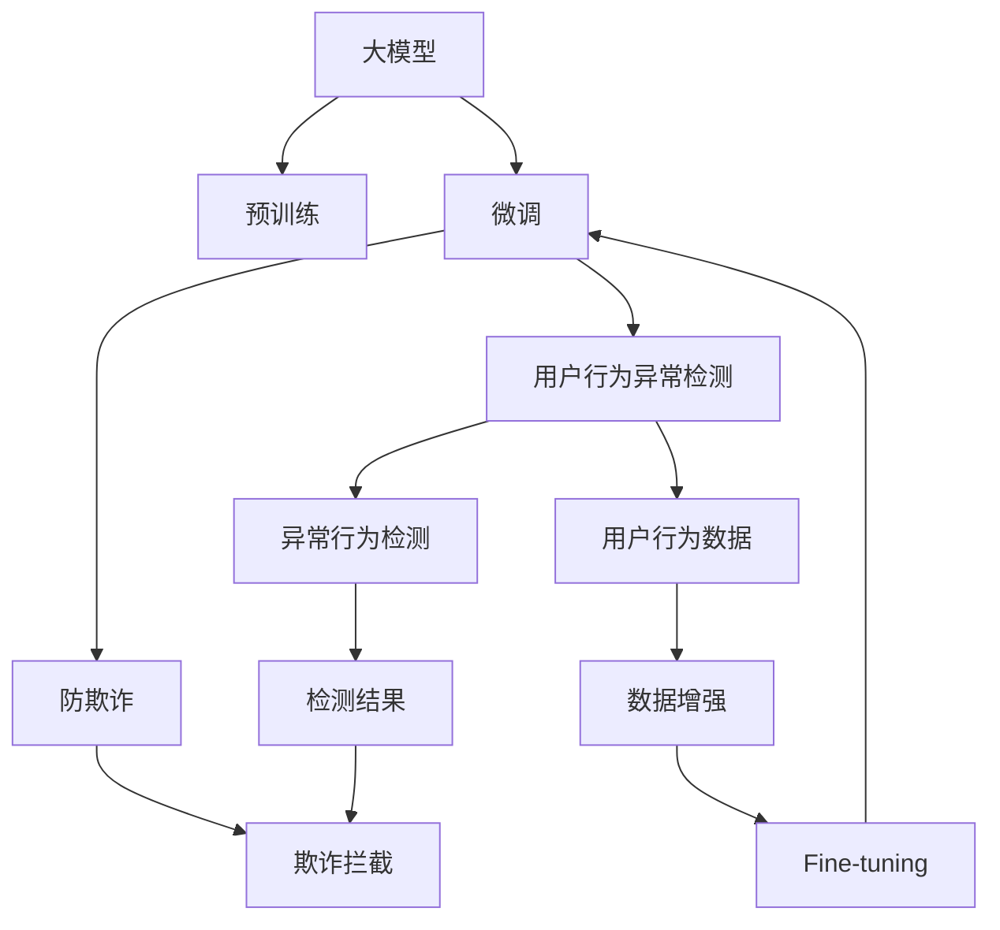

                 

# 大模型技术在电商平台用户行为异常检测与防欺诈中的应用

## 1. 背景介绍

### 1.1 问题由来

电商平台在不断发展过程中，用户行为数据日益丰富，如何识别出异常行为和潜在欺诈风险，成为了电商平台亟需解决的重要问题。传统的机器学习算法和规则引擎主要依赖人工设定的特征工程和异常阈值，难以应对用户行为的多样性和实时性变化。大模型技术通过深度学习，能够从海量数据中自动学习用户行为的隐含模式，具备较强的泛化能力和自适应性。

近年来，深度学习模型在电商平台中的应用逐渐广泛，特别是在用户行为异常检测和防欺诈领域。大模型技术通过预训练和微调，能够在无监督和有监督的设定下，学习到用户行为的高级表示，显著提升了异常检测和欺诈防范的准确率。

### 1.2 问题核心关键点

大模型技术在电商平台用户行为异常检测和防欺诈应用中，涉及的核心关键点主要包括：

- 大模型预训练：通过大规模无标签数据训练大模型，学习用户行为的基础表示。
- 下游任务微调：在预训练模型的基础上，利用标注数据训练模型，适应特定任务。
- 特征表示学习：大模型学习到复杂的特征表示，能够捕捉用户行为的非线性关系。
- 实时性需求：电商平台需要实时处理海量用户行为数据，大模型应具备较高的推理效率。
- 可解释性要求：电商平台需要解释检测结果，赋予用户一定的自主决策权。

### 1.3 问题研究意义

研究大模型在电商平台用户行为异常检测和防欺诈应用中，对于提升电商平台的安全性和用户体验，具有重要的实际意义：

1. 降低风险损失：识别出潜在的欺诈行为，减少电商平台和用户双方的经济损失。
2. 增强用户信任：提高异常检测的准确率，提升用户对平台的信任感和忠诚度。
3. 优化用户体验：合理应用异常检测结果，提供个性化推荐和用户关怀，提升用户满意度。
4. 提升运营效率：自动化处理异常检测任务，释放更多人力资源投入到其他业务环节。
5. 推动技术创新：结合大模型技术和大数据应用，探索更多高效、智能的电商平台治理方法。

## 2. 核心概念与联系

### 2.1 核心概念概述

为更好地理解大模型在电商平台用户行为异常检测和防欺诈中的应用，本节将介绍几个密切相关的核心概念：

- 大模型(大语言模型)：指通过大规模无标签数据训练得到的深度神经网络模型，具有强大的特征学习和表示能力。
- 预训练(Pre-training)：指在大规模无标签数据上，通过自监督学习任务训练通用模型的过程，使模型具备广泛的通用表示。
- 微调(Fine-tuning)：指在预训练模型的基础上，利用下游任务的有标签数据进行微调，优化模型在该任务上的性能。
- 用户行为异常检测：指通过检测用户行为数据中的异常行为，识别出潜在的欺诈风险或用户流失行为。
- 防欺诈(Fraud Prevention)：指通过检测异常行为，及时发现并拦截欺诈行为，保护平台和用户利益。
- 特征表示学习(Feature Representation Learning)：指通过深度学习模型自动学习用户行为的高级特征表示，捕捉行为之间的复杂关系。

这些核心概念之间的逻辑关系可以通过以下Mermaid流程图来展示：



这个流程图展示了大模型在电商平台用户行为异常检测和防欺诈中的核心概念及其之间的关系：

1. 大模型通过预训练学习到用户行为的基础表示。
2. 在预训练的基础上，通过微调学习到特定任务（如异常检测和防欺诈）的高级表示。
3. 利用学习到的特征表示，识别出异常行为，进行欺诈拦截。
4. 结合数据增强，提高模型在特定任务上的泛化能力。

## 3. 核心算法原理 & 具体操作步骤
### 3.1 算法原理概述

基于大模型的电商平台用户行为异常检测和防欺诈方法，主要依赖于模型的预训练-微调范式。其核心思想是：通过预训练学习到用户行为的基础表示，再在微调过程中通过标注数据学习到特定任务的高维特征表示，从而实现精准的异常检测和欺诈防范。

形式化地，假设大模型为 $M_{\theta}$，其中 $\theta$ 为模型参数。假设电商平台异常检测和防欺诈任务的标注数据集为 $D=\{(x_i,y_i)\}_{i=1}^N$，其中 $x_i$ 为用户的点击、浏览、支付等行为数据，$y_i$ 为正常或异常标记。微调的目标是找到新的模型参数 $\hat{\theta}$，使得模型在异常检测和防欺诈任务上的表现最优，即：

$$
\hat{\theta}=\mathop{\arg\min}_{\theta} \mathcal{L}(M_{\theta},D)
$$

其中 $\mathcal{L}$ 为针对任务设计的损失函数，用于衡量模型预测结果与真实标签之间的差异。常见的损失函数包括交叉熵损失、均方误差损失等。

通过梯度下降等优化算法，微调过程不断更新模型参数 $\theta$，最小化损失函数 $\mathcal{L}$，使得模型输出逼近真实标签。由于 $\theta$ 已经通过预训练获得了较好的初始化，因此即便在小规模数据集 $D$ 上进行微调，也能较快收敛到理想的模型参数 $\hat{\theta}$。

### 3.2 算法步骤详解

基于大模型的电商平台用户行为异常检测和防欺诈的微调一般包括以下几个关键步骤：

**Step 1: 准备预训练模型和数据集**
- 选择合适的预训练大模型 $M_{\theta}$ 作为初始化参数，如BERT、GPT等。
- 准备异常检测和防欺诈任务的标注数据集 $D$，划分为训练集、验证集和测试集。一般要求标注数据与预训练数据的分布不要差异过大。

**Step 2: 添加任务适配层**
- 根据任务类型，在预训练模型顶层设计合适的输出层和损失函数。
- 对于异常检测任务，通常设计二分类或多分类输出层，以预测行为是否异常。
- 对于防欺诈任务，通常使用概率图模型输出预测结果，并定义交叉熵损失函数。

**Step 3: 设置微调超参数**
- 选择合适的优化算法及其参数，如 AdamW、SGD 等，设置学习率、批大小、迭代轮数等。
- 设置正则化技术及强度，包括权重衰减、Dropout、Early Stopping等。
- 确定冻结预训练参数的策略，如仅微调顶层，或全部参数都参与微调。

**Step 4: 执行梯度训练**
- 将训练集数据分批次输入模型，前向传播计算损失函数。
- 反向传播计算参数梯度，根据设定的优化算法和学习率更新模型参数。
- 周期性在验证集上评估模型性能，根据性能指标决定是否触发 Early Stopping。
- 重复上述步骤直到满足预设的迭代轮数或 Early Stopping 条件。

**Step 5: 测试和部署**
- 在测试集上评估微调后模型 $M_{\hat{\theta}}$ 的性能，对比微调前后的精度提升。
- 使用微调后的模型对新样本进行推理预测，集成到实际的应用系统中。
- 持续收集新的数据，定期重新微调模型，以适应数据分布的变化。

以上是基于大模型的电商平台用户行为异常检测和防欺诈的一般流程。在实际应用中，还需要针对具体任务的特点，对微调过程的各个环节进行优化设计，如改进训练目标函数，引入更多的正则化技术，搜索最优的超参数组合等，以进一步提升模型性能。

### 3.3 算法优缺点

基于大模型的电商平台用户行为异常检测和防欺诈方法具有以下优点：
1. 强大的特征表示能力：通过深度学习自动学习用户行为的高级特征表示，捕捉行为之间的复杂关系。
2. 泛化能力强：大模型在预训练和微调过程中，利用大规模数据集学习，具备较强的泛化能力。
3. 自适应性强：模型能够适应用户行为的实时性变化，动态更新异常检测阈值。
4. 精确度高：利用大模型的高维表示学习，提高了异常检测和防欺诈的准确率。
5. 可解释性强：大模型的中间表示可以用于可视化，解释模型的检测逻辑。

同时，该方法也存在一定的局限性：
1. 数据标注成本高：标注高质量的数据集需要大量人力和时间。
2. 计算资源需求大：大模型的训练和推理需要高算力、大内存的支持。
3. 模型复杂度高：大模型结构复杂，推理速度较慢。
4. 可能存在偏差：大模型在预训练过程中可能存在数据偏见，影响检测结果。

尽管存在这些局限性，但就目前而言，基于大模型的微调方法仍是电商平台用户行为异常检测和防欺诈应用的最主流范式。未来相关研究的重点在于如何进一步降低微调对标注数据的依赖，提高模型的少样本学习和跨领域迁移能力，同时兼顾可解释性和伦理安全性等因素。

### 3.4 算法应用领域

基于大模型的电商平台用户行为异常检测和防欺诈方法，在多个电商平台的实际应用中已经取得了显著效果，覆盖了以下领域：

- 异常交易检测：对用户支付、退货等交易行为进行检测，及时识别出潜在欺诈。
- 账号异常行为检测：对用户登录、操作等账号行为进行监控，防范账号被盗风险。
- 广告点击异常检测：对广告点击行为进行检测，防止恶意点击和点击滥用。
- 恶意评价检测：对用户评价内容进行检测，识别出恶意评价和刷单行为。
- 商品退换货异常检测：对商品退换货行为进行检测，识别出退换货滥用行为。

除了上述这些经典应用外，大模型技术还被创新性地应用到更多场景中，如社交网络行为检测、物流配送异常检测等，为电商平台治理提供了新的技术路径。随着大模型技术的不断演进，相信其在电商平台用户行为异常检测和防欺诈领域的应用将更加广泛和深入。

## 4. 数学模型和公式 & 详细讲解  
### 4.1 数学模型构建

本节将使用数学语言对基于大模型的电商平台用户行为异常检测和防欺诈方法进行更加严格的刻画。

记预训练大模型为 $M_{\theta}$，其中 $\theta$ 为模型参数。假设异常检测任务的标注数据集为 $D=\{(x_i,y_i)\}_{i=1}^N$，其中 $x_i$ 为用户的点击、浏览、支付等行为数据，$y_i$ 为正常或异常标记。

定义模型 $M_{\theta}$ 在数据样本 $(x,y)$ 上的损失函数为 $\ell(M_{\theta}(x),y)$，则在数据集 $D$ 上的经验风险为：

$$
\mathcal{L}(\theta) = \frac{1}{N} \sum_{i=1}^N \ell(M_{\theta}(x_i),y_i)
$$

微调的优化目标是最小化经验风险，即找到最优参数：

$$
\theta^* = \mathop{\arg\min}_{\theta} \mathcal{L}(\theta)
$$

在实践中，我们通常使用基于梯度的优化算法（如SGD、Adam等）来近似求解上述最优化问题。设 $\eta$ 为学习率，$\lambda$ 为正则化系数，则参数的更新公式为：

$$
\theta \leftarrow \theta - \eta \nabla_{\theta}\mathcal{L}(\theta) - \eta\lambda\theta
$$

其中 $\nabla_{\theta}\mathcal{L}(\theta)$ 为损失函数对参数 $\theta$ 的梯度，可通过反向传播算法高效计算。

### 4.2 公式推导过程

以下我们以二分类任务为例，推导交叉熵损失函数及其梯度的计算公式。

假设模型 $M_{\theta}$ 在输入 $x$ 上的输出为 $\hat{y}=M_{\theta}(x) \in [0,1]$，表示样本属于正类的概率。真实标签 $y \in \{0,1\}$。则二分类交叉熵损失函数定义为：

$$
\ell(M_{\theta}(x),y) = -[y\log \hat{y} + (1-y)\log (1-\hat{y})]
$$

将其代入经验风险公式，得：

$$
\mathcal{L}(\theta) = -\frac{1}{N}\sum_{i=1}^N [y_i\log M_{\theta}(x_i)+(1-y_i)\log(1-M_{\theta}(x_i))]
$$

根据链式法则，损失函数对参数 $\theta_k$ 的梯度为：

$$
\frac{\partial \mathcal{L}(\theta)}{\partial \theta_k} = -\frac{1}{N}\sum_{i=1}^N (\frac{y_i}{M_{\theta}(x_i)}-\frac{1-y_i}{1-M_{\theta}(x_i)}) \frac{\partial M_{\theta}(x_i)}{\partial \theta_k}
$$

其中 $\frac{\partial M_{\theta}(x_i)}{\partial \theta_k}$ 可进一步递归展开，利用自动微分技术完成计算。

在得到损失函数的梯度后，即可带入参数更新公式，完成模型的迭代优化。重复上述过程直至收敛，最终得到适应下游任务的最优模型参数 $\theta^*$。

## 5. 项目实践：代码实例和详细解释说明
### 5.1 开发环境搭建

在进行电商平台用户行为异常检测和防欺诈的微调实践前，我们需要准备好开发环境。以下是使用Python进行PyTorch开发的环境配置流程：

1. 安装Anaconda：从官网下载并安装Anaconda，用于创建独立的Python环境。

2. 创建并激活虚拟环境：
```bash
conda create -n pytorch-env python=3.8 
conda activate pytorch-env
```

3. 安装PyTorch：根据CUDA版本，从官网获取对应的安装命令。例如：
```bash
conda install pytorch torchvision torchaudio cudatoolkit=11.1 -c pytorch -c conda-forge
```

4. 安装Transformers库：
```bash
pip install transformers
```

5. 安装各类工具包：
```bash
pip install numpy pandas scikit-learn matplotlib tqdm jupyter notebook ipython
```

完成上述步骤后，即可在`pytorch-env`环境中开始微调实践。

### 5.2 源代码详细实现

这里我们以异常检测任务为例，给出使用Transformers库对BERT模型进行微调的PyTorch代码实现。

首先，定义异常检测任务的数据处理函数：

```python
from transformers import BertTokenizer
from torch.utils.data import Dataset
import torch

class AnomalyDetectionDataset(Dataset):
    def __init__(self, texts, labels, tokenizer, max_len=128):
        self.texts = texts
        self.labels = labels
        self.tokenizer = tokenizer
        self.max_len = max_len
        
    def __len__(self):
        return len(self.texts)
    
    def __getitem__(self, item):
        text = self.texts[item]
        label = self.labels[item]
        
        encoding = self.tokenizer(text, return_tensors='pt', max_length=self.max_len, padding='max_length', truncation=True)
        input_ids = encoding['input_ids'][0]
        attention_mask = encoding['attention_mask'][0]
        
        # 对label进行one-hot编码
        encoded_label = torch.tensor([[label]], dtype=torch.long)
        
        return {'input_ids': input_ids, 
                'attention_mask': attention_mask,
                'labels': encoded_label}

# 标签与id的映射
label2id = {'normal': 0, 'anomaly': 1}
id2label = {v: k for k, v in label2id.items()}

# 创建dataset
tokenizer = BertTokenizer.from_pretrained('bert-base-cased')

train_dataset = AnomalyDetectionDataset(train_texts, train_labels, tokenizer)
dev_dataset = AnomalyDetectionDataset(dev_texts, dev_labels, tokenizer)
test_dataset = AnomalyDetectionDataset(test_texts, test_labels, tokenizer)
```

然后，定义模型和优化器：

```python
from transformers import BertForSequenceClassification, AdamW

model = BertForSequenceClassification.from_pretrained('bert-base-cased', num_labels=len(label2id))

optimizer = AdamW(model.parameters(), lr=2e-5)
```

接着，定义训练和评估函数：

```python
from torch.utils.data import DataLoader
from tqdm import tqdm
from sklearn.metrics import classification_report

device = torch.device('cuda') if torch.cuda.is_available() else torch.device('cpu')
model.to(device)

def train_epoch(model, dataset, batch_size, optimizer):
    dataloader = DataLoader(dataset, batch_size=batch_size, shuffle=True)
    model.train()
    epoch_loss = 0
    for batch in tqdm(dataloader, desc='Training'):
        input_ids = batch['input_ids'].to(device)
        attention_mask = batch['attention_mask'].to(device)
        labels = batch['labels'].to(device)
        model.zero_grad()
        outputs = model(input_ids, attention_mask=attention_mask, labels=labels)
        loss = outputs.loss
        epoch_loss += loss.item()
        loss.backward()
        optimizer.step()
    return epoch_loss / len(dataloader)

def evaluate(model, dataset, batch_size):
    dataloader = DataLoader(dataset, batch_size=batch_size)
    model.eval()
    preds, labels = [], []
    with torch.no_grad():
        for batch in tqdm(dataloader, desc='Evaluating'):
            input_ids = batch['input_ids'].to(device)
            attention_mask = batch['attention_mask'].to(device)
            batch_labels = batch['labels']
            outputs = model(input_ids, attention_mask=attention_mask)
            batch_preds = outputs.logits.argmax(dim=1).to('cpu').tolist()
            batch_labels = batch_labels.to('cpu').tolist()
            for pred, label in zip(batch_preds, batch_labels):
                preds.append(pred)
                labels.append(label)
                
    print(classification_report(labels, preds))
```

最后，启动训练流程并在测试集上评估：

```python
epochs = 5
batch_size = 16

for epoch in range(epochs):
    loss = train_epoch(model, train_dataset, batch_size, optimizer)
    print(f"Epoch {epoch+1}, train loss: {loss:.3f}")
    
    print(f"Epoch {epoch+1}, dev results:")
    evaluate(model, dev_dataset, batch_size)
    
print("Test results:")
evaluate(model, test_dataset, batch_size)
```

以上就是使用PyTorch对BERT进行电商平台用户行为异常检测任务微调的完整代码实现。可以看到，得益于Transformers库的强大封装，我们可以用相对简洁的代码完成BERT模型的加载和微调。

### 5.3 代码解读与分析

让我们再详细解读一下关键代码的实现细节：

**AnomalyDetectionDataset类**：
- `__init__`方法：初始化文本、标签、分词器等关键组件。
- `__len__`方法：返回数据集的样本数量。
- `__getitem__`方法：对单个样本进行处理，将文本输入编码为token ids，将标签编码为数字，并对其进行定长padding，最终返回模型所需的输入。

**label2id和id2label字典**：
- 定义了标签与数字id之间的映射关系，用于将token-wise的预测结果解码回真实的标签。

**训练和评估函数**：
- 使用PyTorch的DataLoader对数据集进行批次化加载，供模型训练和推理使用。
- 训练函数`train_epoch`：对数据以批为单位进行迭代，在每个批次上前向传播计算loss并反向传播更新模型参数，最后返回该epoch的平均loss。
- 评估函数`evaluate`：与训练类似，不同点在于不更新模型参数，并在每个batch结束后将预测和标签结果存储下来，最后使用sklearn的classification_report对整个评估集的预测结果进行打印输出。

**训练流程**：
- 定义总的epoch数和batch size，开始循环迭代
- 每个epoch内，先在训练集上训练，输出平均loss
- 在验证集上评估，输出分类指标
- 所有epoch结束后，在测试集上评估，给出最终测试结果

可以看到，PyTorch配合Transformers库使得BERT微调的代码实现变得简洁高效。开发者可以将更多精力放在数据处理、模型改进等高层逻辑上，而不必过多关注底层的实现细节。

当然，工业级的系统实现还需考虑更多因素，如模型的保存和部署、超参数的自动搜索、更灵活的任务适配层等。但核心的微调范式基本与此类似。

## 6. 实际应用场景
### 6.1 智能客服系统

基于大模型微调的电商平台用户行为异常检测和防欺诈技术，可以广泛应用于智能客服系统的构建。传统的客服往往需要配备大量人力，高峰期响应缓慢，且一致性和专业性难以保证。而使用微调后的检测和防欺诈模型，可以7x24小时不间断服务，快速响应客户咨询，用智能化的方式识别异常行为并进行处理。

在技术实现上，可以收集电商平台的历史交易数据，将异常行为和正常行为构建成监督数据，在此基础上对预训练模型进行微调。微调后的模型能够自动理解用户行为模式，实时监测交易行为，检测出潜在欺诈行为，及时进行报警和拦截。

### 6.2 金融舆情监测

电商平台需要实时监测市场舆论动向，以便及时应对负面信息传播，规避金融风险。传统的文本监测方式成本高、效率低，难以应对网络时代海量信息爆发的挑战。基于大模型微调的文本分类和情感分析技术，为金融舆情监测提供了新的解决方案。

具体而言，可以收集金融领域相关的新闻、报道、评论等文本数据，并对其进行主题标注和情感标注。在此基础上对预训练语言模型进行微调，使其能够自动判断文本属于何种主题，情感倾向是正面、中性还是负面。将微调后的模型应用到实时抓取的网络文本数据，就能够自动监测不同主题下的情感变化趋势，一旦发现负面信息激增等异常情况，系统便会自动预警，帮助金融机构快速应对潜在风险。

### 6.3 个性化推荐系统

当前的推荐系统往往只依赖用户的历史行为数据进行物品推荐，无法深入理解用户的真实兴趣偏好。基于大模型微调技术，个性化推荐系统可以更好地挖掘用户行为背后的语义信息，从而提供更精准、多样的推荐内容。

在实践中，可以收集用户浏览、点击、评论、分享等行为数据，提取和用户交互的物品标题、描述、标签等文本内容。将文本内容作为模型输入，用户的后续行为（如是否点击、购买等）作为监督信号，在此基础上微调预训练语言模型。微调后的模型能够从文本内容中准确把握用户的兴趣点。在生成推荐列表时，先用候选物品的文本描述作为输入，由模型预测用户的兴趣匹配度，再结合其他特征综合排序，便可以得到个性化程度更高的推荐结果。

### 6.4 未来应用展望

随着大模型和微调方法的不断发展，基于微调范式将在更多领域得到应用，为传统行业带来变革性影响。

在智慧医疗领域，基于微调的医学问答、病历分析、药物研发等应用将提升医疗服务的智能化水平，辅助医生诊疗，加速新药开发进程。

在智能教育领域，微调技术可应用于作业批改、学情分析、知识推荐等方面，因材施教，促进教育公平，提高教学质量。

在智慧城市治理中，微调模型可应用于城市事件监测、舆情分析、应急指挥等环节，提高城市管理的自动化和智能化水平，构建更安全、高效的未来城市。

此外，在企业生产、社会治理、文娱传媒等众多领域，基于大模型微调的人工智能应用也将不断涌现，为经济社会发展注入新的动力。相信随着技术的日益成熟，微调方法将成为人工智能落地应用的重要范式，推动人工智能技术在垂直行业的规模化落地。

## 7. 工具和资源推荐
### 7.1 学习资源推荐

为了帮助开发者系统掌握大模型在电商平台用户行为异常检测和防欺诈中的应用，这里推荐一些优质的学习资源：

1. 《深度学习理论与实践》系列博文：由大模型技术专家撰写，深入浅出地介绍了深度学习的基本概念和前沿技术。

2. CS231n《深度学习课程》课程：斯坦福大学开设的计算机视觉课程，涵盖了深度学习在图像、视频等领域的广泛应用。

3. 《深度学习自然语言处理》书籍：Transformer库的作者所著，全面介绍了如何使用Transformers库进行NLP任务开发，包括微调在内的诸多范式。

4. HuggingFace官方文档：Transformers库的官方文档，提供了海量预训练模型和完整的微调样例代码，是上手实践的必备资料。

5. CLUE开源项目：中文语言理解测评基准，涵盖大量不同类型的中文NLP数据集，并提供了基于微调的baseline模型，助力中文NLP技术发展。

通过对这些资源的学习实践，相信你一定能够快速掌握大模型在电商平台用户行为异常检测和防欺诈中的应用精髓，并用于解决实际的NLP问题。
###  7.2 开发工具推荐

高效的开发离不开优秀的工具支持。以下是几款用于电商平台用户行为异常检测和防欺诈开发的常用工具：

1. PyTorch：基于Python的开源深度学习框架，灵活动态的计算图，适合快速迭代研究。大部分预训练语言模型都有PyTorch版本的实现。

2. TensorFlow：由Google主导开发的开源深度学习框架，生产部署方便，适合大规模工程应用。同样有丰富的预训练语言模型资源。

3. Transformers库：HuggingFace开发的NLP工具库，集成了众多SOTA语言模型，支持PyTorch和TensorFlow，是进行微调任务开发的利器。

4. Weights & Biases：模型训练的实验跟踪工具，可以记录和可视化模型训练过程中的各项指标，方便对比和调优。与主流深度学习框架无缝集成。

5. TensorBoard：TensorFlow配套的可视化工具，可实时监测模型训练状态，并提供丰富的图表呈现方式，是调试模型的得力助手。

6. Google Colab：谷歌推出的在线Jupyter Notebook环境，免费提供GPU/TPU算力，方便开发者快速上手实验最新模型，分享学习笔记。

合理利用这些工具，可以显著提升电商平台用户行为异常检测和防欺诈任务的开发效率，加快创新迭代的步伐。

### 7.3 相关论文推荐

大模型和微调技术的发展源于学界的持续研究。以下是几篇奠基性的相关论文，推荐阅读：

1. Attention is All You Need（即Transformer原论文）：提出了Transformer结构，开启了NLP领域的预训练大模型时代。

2. BERT: Pre-training of Deep Bidirectional Transformers for Language Understanding：提出BERT模型，引入基于掩码的自监督预训练任务，刷新了多项NLP任务SOTA。

3. Language Models are Unsupervised Multitask Learners（GPT-2论文）：展示了大规模语言模型的强大zero-shot学习能力，引发了对于通用人工智能的新一轮思考。

4. Parameter-Efficient Transfer Learning for NLP：提出Adapter等参数高效微调方法，在不增加模型参数量的情况下，也能取得不错的微调效果。

5. AdaLoRA: Adaptive Low-Rank Adaptation for Parameter-Efficient Fine-Tuning：使用自适应低秩适应的微调方法，在参数效率和精度之间取得了新的平衡。

这些论文代表了大模型和微调技术的发展脉络。通过学习这些前沿成果，可以帮助研究者把握学科前进方向，激发更多的创新灵感。

## 8. 总结：未来发展趋势与挑战
### 8.1 总结

本文对基于大模型的电商平台用户行为异常检测和防欺诈方法进行了全面系统的介绍。首先阐述了大模型和微调技术在电商平台中的研究背景和意义，明确了微调在提升电商平台安全性和用户体验方面的独特价值。其次，从原理到实践，详细讲解了微调过程的数学原理和关键步骤，给出了电商平台用户行为异常检测和防欺诈任务的完整代码实例。同时，本文还广泛探讨了微调方法在多个电商平台的实际应用场景，展示了微调范式的巨大潜力。此外，本文精选了微调技术的各类学习资源，力求为读者提供全方位的技术指引。

通过本文的系统梳理，可以看到，基于大模型的微调方法在电商平台用户行为异常检测和防欺诈领域的应用，对于电商平台治理的安全性和高效性提升，具有重要的实际意义。未来，伴随预训练语言模型和微调方法的持续演进，相信在更多电商平台的实际应用中，大模型微调技术将发挥更大的作用，助力电商平台智能化治理的进一步发展。

### 8.2 未来发展趋势

展望未来，大模型在电商平台用户行为异常检测和防欺诈应用中，将呈现以下几个发展趋势：

1. 模型规模持续增大。随着算力成本的下降和数据规模的扩张，预训练语言模型的参数量还将持续增长。超大规模语言模型蕴含的丰富语言知识，有望支撑更加复杂多变的异常检测和防欺诈任务。

2. 微调方法日趋多样。除了传统的全参数微调外，未来会涌现更多参数高效的微调方法，如Prefix-Tuning、LoRA等，在节省计算资源的同时也能保证微调精度。

3. 持续学习成为常态。随着数据分布的不断变化，微调模型也需要持续学习新知识以保持性能。如何在不遗忘原有知识的同时，高效吸收新样本信息，将成为重要的研究课题。

4. 标注样本需求降低。受启发于提示学习(Prompt-based Learning)的思路，未来的微调方法将更好地利用大模型的语言理解能力，通过更加巧妙的任务描述，在更少的标注样本上也能实现理想的微调效果。

5. 多模态微调崛起。当前的微调主要聚焦于纯文本数据，未来会进一步拓展到图像、视频、语音等多模态数据微调。多模态信息的融合，将显著提升语言模型对现实世界的理解和建模能力。

6. 模型通用性增强。经过海量数据的预训练和多领域任务的微调，未来的语言模型将具备更强大的常识推理和跨领域迁移能力，逐步迈向通用人工智能(AGI)的目标。

以上趋势凸显了大模型微调技术在电商平台应用中的广阔前景。这些方向的探索发展，必将进一步提升电商平台的安全性和用户体验，为电商平台的智能化治理带来新的突破。

### 8.3 面临的挑战

尽管大模型在电商平台用户行为异常检测和防欺诈领域已经取得了显著成效，但在迈向更加智能化、普适化应用的过程中，仍面临诸多挑战：

1. 数据标注成本高。标注高质量的数据集需要大量人力和时间，对于电商平台的大规模数据集尤为困难。如何进一步降低微调对标注数据的依赖，是未来需要重点解决的问题。

2. 模型鲁棒性不足。当前微调模型面对域外数据时，泛化性能往往大打折扣。对于测试样本的微小扰动，微调模型的预测也容易发生波动。如何提高微调模型的鲁棒性，避免灾难性遗忘，还需要更多理论和实践的积累。

3. 推理效率有待提高。大模型的训练和推理需要高算力、大内存的支持，推理速度较慢，难以实时响应。如何在保证性能的同时，优化推理速度，提高资源利用率，将是重要的优化方向。

4. 可解释性亟需加强。当前微调模型更像是"黑盒"系统，难以解释其内部工作机制和决策逻辑。对于金融、医疗等高风险应用，算法的可解释性和可审计性尤为重要。如何赋予微调模型更强的可解释性，将是亟待攻克的难题。

5. 安全性有待保障。预训练语言模型难免会学习到有偏见、有害的信息，通过微调传递到下游任务，产生误导性、歧视性的输出，给实际应用带来安全隐患。如何从数据和算法层面消除模型偏见，避免恶意用途，确保输出的安全性，也将是重要的研究课题。

6. 知识整合能力不足。现有的微调模型往往局限于任务内数据，难以灵活吸收和运用更广泛的先验知识。如何让微调过程更好地与外部知识库、规则库等专家知识结合，形成更加全面、准确的信息整合能力，还有很大的想象空间。

正视微调面临的这些挑战，积极应对并寻求突破，将是大模型微调技术在电商平台落地应用的关键。相信随着学界和产业界的共同努力，这些挑战终将一一被克服，大模型微调必将在电商平台治理中发挥更大的作用。

### 8.4 研究展望

面对大模型在电商平台用户行为异常检测和防欺诈应用中面临的诸多挑战，未来的研究需要在以下几个方面寻求新的突破：

1. 探索无监督和半监督微调方法。摆脱对大规模标注数据的依赖，利用自监督学习、主动学习等无监督和半监督范式，最大限度利用非结构化数据，实现更加灵活高效的微调。

2. 研究参数高效和计算高效的微调范式。开发更加参数高效的微调方法，在固定大部分预训练参数的同时，只更新极少量的任务相关参数。同时优化微调模型的计算图，减少前向传播和反向传播的资源消耗，实现更加轻量级、实时性的部署。

3. 引入因果和对比学习范式。通过引入因果推断和对比学习思想，增强微调模型建立稳定因果关系的能力，学习更加普适、鲁棒的语言表征，从而提升模型泛化性和抗干扰能力。

4. 结合因果分析和博弈论工具。将因果分析方法引入微调模型，识别出模型决策的关键特征，增强输出解释的因果性和逻辑性。借助博弈论工具刻画人机交互过程，主动探索并规避模型的脆弱点，提高系统稳定性。

5. 纳入伦理道德约束。在模型训练目标中引入伦理导向的评估指标，过滤和惩罚有偏见、有害的输出倾向。同时加强人工干预和审核，建立模型行为的监管机制，确保输出符合人类价值观和伦理道德。

这些研究方向的探索，必将引领大模型微调技术在电商平台应用中迈向更高的台阶，为电商平台治理提供更高效、智能、可解释的技术方案。面向未来，大模型微调技术还需要与其他人工智能技术进行更深入的融合，如知识表示、因果推理、强化学习等，多路径协同发力，共同推动电商平台治理的智能化进程。只有勇于创新、敢于突破，才能不断拓展大模型的应用边界，让智能技术更好地服务于电商平台的用户体验和业务价值。

## 9. 附录：常见问题与解答
**Q1：电商平台用户行为异常检测和防欺诈任务中，数据标注成本高，如何降低？**

A: 数据标注成本高是电商平台异常检测和防欺诈任务中的主要挑战之一。为降低标注成本，可以考虑以下策略：

1. 利用无监督学习：利用聚类、降维等无监督学习方法，初步筛选出异常数据，减少人工标注的样本量。

2. 引入半监督学习：结合少量标注数据和大量未标注数据，进行半监督学习，提高模型的泛化能力。

3. 主动学习：在每次迭代中，利用当前模型对数据进行标注，选择最难分类的样本进行人工标注，减少标注成本。

4. 数据增强：通过回译、改写等技术，扩充训练集样本，增加模型训练的多样性。

5. 迁移学习：利用预训练模型在相关领域的迁移学习能力，减少当前任务标注数据的依赖。

6. 正则化和对抗训练：通过正则化、对抗训练等技术，提高模型的鲁棒性，减少对标注数据的依赖。

通过这些策略，可以在一定程度上降低标注成本，提升模型性能。

**Q2：电商平台异常检测和防欺诈模型中的模型鲁棒性不足，如何提升？**

A: 电商平台异常检测和防欺诈模型中的模型鲁棒性不足，可以通过以下策略进行提升：

1. 数据增强：通过回译、改写等技术，扩充训练集样本，增加模型训练的多样性，提升模型的泛化能力。

2. 对抗训练：在训练过程中，加入对抗样本，提高模型的鲁棒性。

3. 正则化：通过L2正则、Dropout等技术，减少模型的过拟合现象，提升模型的泛化能力。

4. 多模型集成：训练多个异常检测和防欺诈模型，取平均输出，抑制过拟合，提升模型的鲁棒性。

5. 知识图谱和规则库：结合知识图谱和规则库，增强模型的解释性和鲁棒性。

6. 持续学习：在模型训练过程中，不断更新数据和知识库，提升模型的自适应能力。

通过这些策略，可以在一定程度上提升电商平台的异常检测和防欺诈模型的鲁棒性，增强模型的泛化能力和应用效果。

**Q3：电商平台异常检测和防欺诈模型中的推理效率有待提高，如何解决？**

A: 电商平台异常检测和防欺诈模型中的推理效率有待提高，可以通过以下策略进行优化：

1. 模型裁剪：去除不必要的层和参数，减小模型尺寸，加快推理速度。

2. 量化加速：将浮点模型转为定点模型，压缩存储空间，提高计算效率。

3. 模型并行：采用分布式计算和并行计算技术，提升模型的推理速度。

4. 硬件优化：利用GPU、TPU等高性能设备，加速模型的推理过程。

5. 模型压缩：采用模型压缩和稀疏化存储技术，优化模型的存储空间和计算效率。

6. 多任务学习：结合多个任务，共享模型参数，提升模型的推理效率。

通过这些策略，可以在一定程度上提高电商平台的异常检测和防欺诈模型的推理效率，增强模型的实时性和应用效果。

**Q4：电商平台异常检测和防欺诈模型中的可解释性亟需加强，如何处理？**

A: 电商平台异常检测和防欺诈模型中的可解释性亟需加强，可以通过以下策略进行优化：

1. 可视化技术：通过可视化中间表示和决策路径，增强模型的可解释性。

2. 局部可解释性方法：利用局部可解释性方法，如LIME、SHAP等，对模型在特定输入下的决策过程进行解释。

3. 特征重要性分析：通过特征重要性分析，了解模型对不同特征的依赖关系，提高模型的可解释性。

4. 规则结合模型：结合规则和模型，增强模型的可解释性，避免"黑盒"问题。

5. 模型解释性评估：在模型训练和评估过程中，引入可解释性评估指标，指导模型的改进方向。

通过这些策略，可以在一定程度上提高电商平台的异常检测和防欺诈模型的可解释性，增强模型的透明度和应用效果。

**Q5：电商平台异常检测和防欺诈模型中的安全性有待保障，如何解决？**

A: 电商平台异常检测和防欺诈模型中的安全性有待保障，可以通过以下策略进行优化：

1. 数据隐私保护：采用差分隐私、联邦学习等技术，保护用户隐私数据。

2. 模型公平性：引入公平性评估指标，避免模型对特定群体的歧视性。

3. 模型安全评估：定期对模型进行安全评估，检测模型中的漏洞和风险。

4. 用户授权机制：引入用户授权机制，增强用户对模型应用的控制权。

5. 第三方审计：引入第三方审计机制，确保模型应用的合规性和安全性。

6. 数据脱敏：在模型训练过程中，对敏感数据进行脱敏处理，减少隐私泄露风险。

通过这些策略，可以在一定程度上提高电商平台的异常检测和防欺诈模型的安全性，保障模型的应用效果和用户利益。

---

作者：禅与计算机程序设计艺术 / Zen and the Art of Computer Programming

