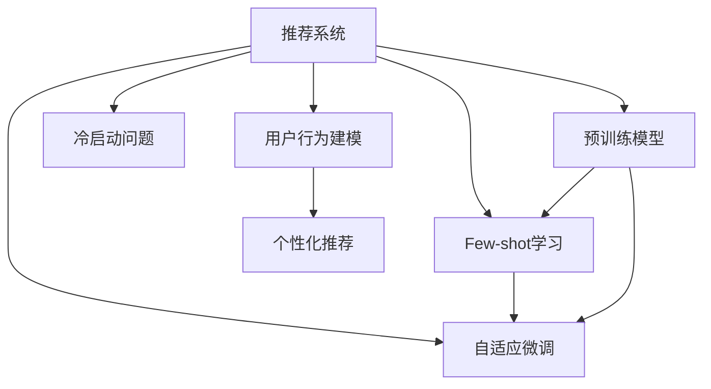

                 

# 大模型推荐中的Few-shot自适应微调技术

> 关键词：推荐系统, 自适应微调, Few-shot学习, 预训练模型, 冷启动问题, 用户行为建模, 推荐算法, 个性化推荐

## 1. 背景介绍

### 1.1 问题由来

推荐系统（Recommendation Systems）在电子商务、社交媒体、视频流媒体等多个领域发挥着核心作用。传统的基于协同过滤和矩阵分解的推荐方法，由于依赖用户和物品的显式反馈数据，难以处理用户未标注行为数据的"冷启动"问题。

近年来，基于深度学习的推荐系统逐渐兴起，特别是预训练模型在推荐任务上的应用，为推荐系统的发展注入了新的活力。通过在大量无标签数据上预训练的深度模型，可以在无需用户标注的情况下，自动学习用户行为特征和物品语义信息，从而预测用户的潜在兴趣，实现个性化推荐。

然而，实际推荐场景往往存在多种多样性，如动态变化的用户需求、物品多样性等，单一预训练模型的泛化能力可能无法满足复杂多变的推荐需求。因此，基于预训练模型的推荐系统，还需要进一步适配具体任务，才能达到理想的推荐效果。

### 1.2 问题核心关键点

基于预训练模型的推荐系统，通过在特定任务上的微调，能够显著提升推荐性能。然而，由于推荐系统通常需要处理大规模用户-物品交互数据，微调所需的标注样本量也极为庞大。如何减少微调样本量，提高推荐系统在冷启动等特定场景下的自适应能力，是当前研究的重要方向。

近年来，Few-shot学习范式为推荐系统带来了新的思路。通过利用预训练模型在大规模数据上学习到的通用知识，在少数样本上也能实现高效的自适应微调，有效缓解了推荐系统对标注样本的依赖。

## 2. 核心概念与联系

### 2.1 核心概念概述

为更好地理解Few-shot自适应微调技术在推荐系统中的应用，本节将介绍几个密切相关的核心概念：

- 推荐系统（Recommendation System）：通过分析用户的历史行为和物品属性，推荐用户可能感兴趣的商品、新闻、视频等内容的系统。
- 自适应微调（Adaptive Fine-tuning）：指在预训练模型的基础上，使用小样本标注数据，通过有监督学习优化模型在特定推荐任务上的性能。
- Few-shot学习（Few-shot Learning）：指在只有少量标注样本的情况下，模型能够快速适应新任务的学习方法。
- 预训练模型（Pre-trained Model）：通过在大规模无标签数据上预训练得到的模型，能够自动学习通用的特征表示。
- 冷启动问题（Cold-start Problem）：新用户或新物品在系统中未产生足够行为数据时，难以推荐其感兴趣内容的问题。
- 用户行为建模（User Behavior Modeling）：通过建模用户的行为规律，预测其未来兴趣，实现个性化推荐。

这些概念之间的逻辑关系可以通过以下Mermaid流程图来展示：



这个流程图展示了一体化的推荐系统架构，包括推荐系统、自适应微调、Few-shot学习、预训练模型、冷启动问题、用户行为建模、个性化推荐等多个关键组件。这些概念共同构成了推荐系统的工作框架，使其能够高效地处理复杂推荐任务。

## 3. Few-shot自适应微调的核心算法原理 & 具体操作步骤

### 3.1 算法原理概述

Few-shot自适应微调技术，本质上是在大规模预训练模型的基础上，通过少样本学习（通常为2-10个样本）来优化模型参数，从而适应特定推荐任务的过程。该技术通过利用预训练模型的泛化能力，在标注数据量极度有限的情况下，仍能获得高效的推荐性能。

具体而言，Few-shot自适应微调包括两个主要步骤：
1. 在大量无标签数据上预训练预训练模型。
2. 在特定推荐任务上，通过Few-shot学习进行微调，学习任务特定的推荐表示。

其中，Few-shot学习通过迁移学习思想，在微调过程中利用少量标注数据，进一步优化预训练模型的参数，使其能够更好地适应目标任务。

### 3.2 算法步骤详解

Few-shot自适应微调技术的一般流程如下：

**Step 1: 准备预训练模型和数据集**
- 选择合适的预训练模型 $M_{\theta}$，如BERT、Transformer等。
- 准备推荐任务 $T$ 的数据集，通常包括用户-物品交互记录。由于推荐系统具有冷启动问题，还需要收集足够的用户行为数据，涵盖新用户和物品的特征。

**Step 2: 定义微调目标函数**
- 根据推荐任务类型，设计合适的损失函数。对于用户物品推荐任务，通常使用交叉熵损失函数。
- 将推荐数据集分为训练集、验证集和测试集。

**Step 3: 添加任务适配层**
- 在预训练模型的顶层添加推荐相关的任务适配层。如线性分类器、注意力机制等，用于预测用户-物品的相似度。
- 定义推荐任务的损失函数，如均方误差损失、交叉熵损失等。

**Step 4: 选择Few-shot学习策略**
- 确定微调的Few-shot学习策略，如Meta-Learning、基于Prompt的微调等。
- 根据任务特点，设计合适的Few-shot学习算法。

**Step 5: 执行梯度训练**
- 对训练集数据进行批次化加载，前向传播计算损失函数。
- 反向传播计算参数梯度，根据设定的优化算法和学习率更新模型参数。
- 周期性在验证集上评估模型性能，根据性能指标决定是否触发Early Stopping。
- 重复上述步骤直至满足预设的迭代轮数或Early Stopping条件。

**Step 6: 测试和部署**
- 在测试集上评估微调后模型 $M_{\hat{\theta}}$ 的性能，对比微调前后的推荐精度提升。
- 使用微调后的模型对新样本进行推理预测，集成到实际的应用系统中。

### 3.3 算法优缺点

Few-shot自适应微调技术具有以下优点：
1. 高效性：相比传统的微调方法，Few-shot学习在少量样本下也能获得良好的推荐性能。
2. 可扩展性：Few-shot学习策略可以应用于多种推荐任务，具备良好的通用性。
3. 缓解冷启动：利用预训练模型的泛化能力，可以有效缓解推荐系统的冷启动问题。
4. 低成本：少样本学习不需要大规模标注数据，节省了标注成本。

同时，该方法也存在一定的局限性：
1. 数据质量要求高：推荐任务的标注数据需要覆盖足够的用户行为数据，否则Few-shot学习效果有限。
2. 任务特定性强：Few-shot学习对任务特点要求较高，不同的推荐场景可能需要定制化微调策略。
3. 模型复杂度高：Few-shot学习通常需要设计合适的适配层和损失函数，增加了模型复杂度。

尽管存在这些局限性，但就目前而言，Few-shot自适应微调方法仍是在特定推荐场景下高效实用的解决方案。未来相关研究将重点探索如何进一步降低微调对标注样本的依赖，提高模型的自适应能力和泛化能力。

### 3.4 算法应用领域

Few-shot自适应微调技术已经在推荐系统等多个领域得到了广泛应用，覆盖了几乎所有常见推荐任务，例如：

- 用户物品推荐：预测用户对物品的兴趣程度，如电商推荐、视频推荐等。
- 内容推荐：根据用户浏览历史，推荐相关内容，如新闻推荐、音乐推荐等。
- 协同过滤推荐：利用用户-物品交互矩阵，推荐用户可能感兴趣的新物品，如协同过滤算法。
- 商品相似推荐：利用物品属性，推荐相似商品，如商品推荐算法。
- 多模态推荐：结合文本、图像、音频等多种模态数据，推荐综合性的商品内容，如多模态推荐算法。

除了上述这些经典任务外，Few-shot自适应微调技术还适用于许多新兴推荐场景，如实时推荐、情境推荐、跨领域推荐等，为推荐系统带来了更多的应用场景和创新可能。

## 4. 数学模型和公式 & 详细讲解 & 举例说明

### 4.1 数学模型构建

本节将使用数学语言对Few-shot自适应微调过程进行更加严格的刻画。

记预训练推荐模型为 $M_{\theta}$，其中 $\theta$ 为模型参数。假设推荐任务 $T$ 的训练集为 $D=\{(x_i,y_i)\}_{i=1}^N, x_i \in \mathcal{X}, y_i \in \mathcal{Y}$，$\mathcal{X}$ 为输入空间，$\mathcal{Y}$ 为输出空间。

定义模型 $M_{\theta}$ 在输入 $x$ 上的输出为 $\hat{y}=M_{\theta}(x)$。推荐任务的损失函数定义为：

$$
\ell(M_{\theta}(x),y) = -y\log M_{\theta}(x)
$$

在数据集 $D$ 上的经验风险为：

$$
\mathcal{L}(\theta) = \frac{1}{N}\sum_{i=1}^N \ell(M_{\theta}(x_i),y_i)
$$

微调的优化目标是最小化经验风险，即找到最优参数：

$$
\theta^* = \mathop{\arg\min}_{\theta} \mathcal{L}(\theta)
$$

在实践中，我们通常使用基于梯度的优化算法（如SGD、Adam等）来近似求解上述最优化问题。设 $\eta$ 为学习率，$\lambda$ 为正则化系数，则参数的更新公式为：

$$
\theta \leftarrow \theta - \eta \nabla_{\theta}\mathcal{L}(\theta) - \eta\lambda\theta
$$

其中 $\nabla_{\theta}\mathcal{L}(\theta)$ 为损失函数对参数 $\theta$ 的梯度，可通过反向传播算法高效计算。

### 4.2 公式推导过程

以下我们以用户物品推荐任务为例，推导Few-shot自适应微调的损失函数及其梯度计算公式。

假设模型 $M_{\theta}$ 在输入 $x$ 上的输出为 $\hat{y}=M_{\theta}(x)$，表示用户对物品的评分预测。真实评分 $y \in [0,1]$。则二分类交叉熵损失函数定义为：

$$
\ell(M_{\theta}(x),y) = -y\log \hat{y}
$$

将其代入经验风险公式，得：

$$
\mathcal{L}(\theta) = -\frac{1}{N}\sum_{i=1}^N [y_i\log M_{\theta}(x_i)]
$$

根据链式法则，损失函数对参数 $\theta_k$ 的梯度为：

$$
\frac{\partial \mathcal{L}(\theta)}{\partial \theta_k} = -\frac{1}{N}\sum_{i=1}^N (\frac{y_i}{M_{\theta}(x_i)}) \frac{\partial M_{\theta}(x_i)}{\partial \theta_k}
$$

其中 $\frac{\partial M_{\theta}(x_i)}{\partial \theta_k}$ 可进一步递归展开，利用自动微分技术完成计算。

在得到损失函数的梯度后，即可带入参数更新公式，完成模型的迭代优化。重复上述过程直至收敛，最终得到适应下游推荐任务的最优模型参数 $\theta^*$。

### 4.3 案例分析与讲解

以电影推荐任务为例，分析Few-shot自适应微调的推荐效果。

假设训练数据集 $D$ 包含 $N$ 个用户-电影评分对 $(x_i,y_i)$，其中 $x_i$ 为用户ID和电影ID，$y_i$ 为评分。使用预训练模型 $M_{\theta}$ 进行微调，训练集、验证集和测试集的比例为 $7:1.5:1$。

1. 准备数据集：
   - 收集用户ID、电影ID、评分等特征，构建推荐数据集。
   - 将数据集划分为训练集、验证集和测试集，比例为 $7:1.5:1$。
   - 对用户ID、电影ID进行独热编码，作为模型的输入。

2. 定义模型：
   - 使用预训练模型 $M_{\theta}$，通常为BERT、Transformer等深度学习模型。
   - 在模型顶层添加线性分类器，用于预测用户对电影的评分。
   - 使用交叉熵损失函数进行训练。

3. 定义微调目标：
   - 定义模型在每个样本上的预测评分 $M_{\theta}(x_i)$ 和真实评分 $y_i$ 的损失函数：$\ell(M_{\theta}(x_i),y_i) = -y_i\log M_{\theta}(x_i)$。
   - 计算经验风险 $\mathcal{L}(\theta)$，并设置微调目标函数。

4. 执行梯度训练：
   - 使用AdamW优化器进行梯度优化。
   - 迭代更新模型参数，直至收敛。

5. 测试和部署：
   - 在测试集上评估微调后的模型 $M_{\hat{\theta}}$，对比微调前后的推荐精度提升。
   - 使用微调后的模型对新电影进行推荐，集成到推荐系统。

## 5. 项目实践：代码实例和详细解释说明

### 5.1 开发环境搭建

在进行Few-shot自适应微调实践前，我们需要准备好开发环境。以下是使用Python进行PyTorch开发的环境配置流程：

1. 安装Anaconda：从官网下载并安装Anaconda，用于创建独立的Python环境。

2. 创建并激活虚拟环境：
```bash
conda create -n pytorch-env python=3.8 
conda activate pytorch-env
```

3. 安装PyTorch：根据CUDA版本，从官网获取对应的安装命令。例如：
```bash
conda install pytorch torchvision torchaudio cudatoolkit=11.1 -c pytorch -c conda-forge
```

4. 安装Transformers库：
```bash
pip install transformers
```

5. 安装各类工具包：
```bash
pip install numpy pandas scikit-learn matplotlib tqdm jupyter notebook ipython
```

完成上述步骤后，即可在`pytorch-env`环境中开始Few-shot自适应微调实践。

### 5.2 源代码详细实现

下面我们以用户物品推荐任务为例，给出使用Transformers库对BERT模型进行Few-shot自适应微调的PyTorch代码实现。

首先，定义推荐数据集的预处理函数：

```python
from transformers import BertTokenizer
from torch.utils.data import Dataset
import torch

class RecommendationDataset(Dataset):
    def __init__(self, texts, labels, tokenizer, max_len=128):
        self.texts = texts
        self.labels = labels
        self.tokenizer = tokenizer
        self.max_len = max_len
        
    def __len__(self):
        return len(self.texts)
    
    def __getitem__(self, item):
        text = self.texts[item]
        label = self.labels[item]
        
        encoding = self.tokenizer(text, return_tensors='pt', max_length=self.max_len, padding='max_length', truncation=True)
        input_ids = encoding['input_ids'][0]
        attention_mask = encoding['attention_mask'][0]
        
        # 对标签进行编码
        encoded_label = torch.tensor(label, dtype=torch.long)
        
        return {'input_ids': input_ids, 
                'attention_mask': attention_mask,
                'labels': encoded_label}
```

然后，定义模型和优化器：

```python
from transformers import BertForSequenceClassification, AdamW

model = BertForSequenceClassification.from_pretrained('bert-base-cased', num_labels=5)

optimizer = AdamW(model.parameters(), lr=2e-5)
```

接着，定义训练和评估函数：

```python
from torch.utils.data import DataLoader
from tqdm import tqdm
from sklearn.metrics import roc_auc_score

device = torch.device('cuda') if torch.cuda.is_available() else torch.device('cpu')
model.to(device)

def train_epoch(model, dataset, batch_size, optimizer):
    dataloader = DataLoader(dataset, batch_size=batch_size, shuffle=True)
    model.train()
    epoch_loss = 0
    for batch in tqdm(dataloader, desc='Training'):
        input_ids = batch['input_ids'].to(device)
        attention_mask = batch['attention_mask'].to(device)
        labels = batch['labels'].to(device)
        model.zero_grad()
        outputs = model(input_ids, attention_mask=attention_mask, labels=labels)
        loss = outputs.loss
        epoch_loss += loss.item()
        loss.backward()
        optimizer.step()
    return epoch_loss / len(dataloader)

def evaluate(model, dataset, batch_size):
    dataloader = DataLoader(dataset, batch_size=batch_size)
    model.eval()
    preds, labels = [], []
    with torch.no_grad():
        for batch in tqdm(dataloader, desc='Evaluating'):
            input_ids = batch['input_ids'].to(device)
            attention_mask = batch['attention_mask'].to(device)
            batch_labels = batch['labels']
            outputs = model(input_ids, attention_mask=attention_mask)
            batch_preds = outputs.logits.argmax(dim=1).to('cpu').tolist()
            batch_labels = batch_labels.to('cpu').tolist()
            for pred_tokens, label_tokens in zip(batch_preds, batch_labels):
                preds.append(pred_tokens)
                labels.append(label_tokens)
                
    return roc_auc_score(labels, preds)
```

最后，启动训练流程并在测试集上评估：

```python
epochs = 5
batch_size = 16

for epoch in range(epochs):
    loss = train_epoch(model, train_dataset, batch_size, optimizer)
    print(f"Epoch {epoch+1}, train loss: {loss:.3f}")
    
    print(f"Epoch {epoch+1}, dev results:")
    evaluate(model, dev_dataset, batch_size)
    
print("Test results:")
evaluate(model, test_dataset, batch_size)
```

以上就是使用PyTorch对BERT进行用户物品推荐任务Few-shot自适应微调的完整代码实现。可以看到，得益于Transformers库的强大封装，我们可以用相对简洁的代码完成BERT模型的加载和微调。

### 5.3 代码解读与分析

让我们再详细解读一下关键代码的实现细节：

**RecommendationDataset类**：
- `__init__`方法：初始化文本、标签、分词器等关键组件。
- `__len__`方法：返回数据集的样本数量。
- `__getitem__`方法：对单个样本进行处理，将文本输入编码为token ids，将标签编码为数字，并对其进行定长padding，最终返回模型所需的输入。

**训练和评估函数**：
- 使用PyTorch的DataLoader对数据集进行批次化加载，供模型训练和推理使用。
- 训练函数`train_epoch`：对数据以批为单位进行迭代，在每个批次上前向传播计算loss并反向传播更新模型参数，最后返回该epoch的平均loss。
- 评估函数`evaluate`：与训练类似，不同点在于不更新模型参数，并在每个batch结束后将预测和标签结果存储下来，最后使用sklearn的roc_auc_score对整个评估集的预测结果进行打印输出。

**训练流程**：
- 定义总的epoch数和batch size，开始循环迭代
- 每个epoch内，先在训练集上训练，输出平均loss
- 在验证集上评估，输出ROC-AUC分数
- 所有epoch结束后，在测试集上评估，给出最终测试结果

可以看到，PyTorch配合Transformers库使得BERT微调的代码实现变得简洁高效。开发者可以将更多精力放在数据处理、模型改进等高层逻辑上，而不必过多关注底层的实现细节。

当然，工业级的系统实现还需考虑更多因素，如模型的保存和部署、超参数的自动搜索、更灵活的任务适配层等。但核心的微调范式基本与此类似。

## 6. 实际应用场景

### 6.1 电商推荐系统

Few-shot自适应微调技术在电商推荐系统中具有重要应用价值。电商推荐系统需要快速响应用户的实时浏览行为，推荐他们可能感兴趣的商品，提升用户体验和销售转化率。

在技术实现上，可以通过收集用户的浏览历史、点击行为、购买记录等数据，构建推荐数据集。在少量标注数据的情况下，对预训练模型进行Few-shot自适应微调，使其能够快速适应用户的个性化需求。微调后的推荐模型能够自动提取用户行为特征，预测用户对新物品的兴趣程度，实现高效的推荐服务。

### 6.2 新闻推荐系统

新闻推荐系统需要根据用户的阅读历史，推荐相关的新闻内容。通过Few-shot自适应微调，能够在少量标注数据下，高效地学习用户的阅读偏好，构建个性化的新闻推荐模型。

具体而言，可以收集用户的新闻阅读记录，包括标题、作者、发布时间等特征。利用用户历史阅读数据构建推荐数据集，对预训练模型进行Few-shot自适应微调。微调后的模型能够自动提取用户阅读偏好，生成个性化推荐内容，提升用户黏性和满意度。

### 6.3 视频推荐系统

视频推荐系统需要根据用户的历史观看记录，推荐可能感兴趣的视频内容。通过Few-shot自适应微调，能够快速适应用户的观看习惯，提供个性化的视频推荐。

具体实现时，可以收集用户的观看历史，包括视频ID、观看时间、评分等特征。利用用户历史观看数据构建推荐数据集，对预训练模型进行Few-shot自适应微调。微调后的模型能够自动提取用户观看偏好，生成个性化视频推荐，提升用户的观看体验和满意度。

## 7. 工具和资源推荐

### 7.1 学习资源推荐

为了帮助开发者系统掌握Few-shot自适应微调技术，这里推荐一些优质的学习资源：

1. 《深度学习理论与实践》系列博文：由大模型技术专家撰写，深入浅出地介绍了深度学习的基础理论，以及在大模型上的应用，包括微调技术。

2. CS231n《深度学习视觉识别》课程：斯坦福大学开设的计算机视觉明星课程，涵盖深度学习在图像、视频等任务上的应用，是学习Few-shot自适应微调的必备资源。

3. 《Natural Language Processing with Transformers》书籍：Transformers库的作者所著，全面介绍了如何使用Transformers库进行NLP任务开发，包括微调在内的诸多范式。

4. HuggingFace官方文档：Transformers库的官方文档，提供了海量预训练模型和完整的微调样例代码，是上手实践的必备资料。

5. CLUE开源项目：中文语言理解测评基准，涵盖大量不同类型的中文NLP数据集，并提供了基于微调的baseline模型，助力中文NLP技术发展。

通过对这些资源的学习实践，相信你一定能够快速掌握Few-shot自适应微调的精髓，并用于解决实际的推荐系统问题。

### 7.2 开发工具推荐

高效的开发离不开优秀的工具支持。以下是几款用于Few-shot自适应微调开发的常用工具：

1. PyTorch：基于Python的开源深度学习框架，灵活动态的计算图，适合快速迭代研究。大部分预训练语言模型都有PyTorch版本的实现。

2. TensorFlow：由Google主导开发的开源深度学习框架，生产部署方便，适合大规模工程应用。同样有丰富的预训练语言模型资源。

3. Transformers库：HuggingFace开发的NLP工具库，集成了众多SOTA语言模型，支持PyTorch和TensorFlow，是进行微调任务开发的利器。

4. Weights & Biases：模型训练的实验跟踪工具，可以记录和可视化模型训练过程中的各项指标，方便对比和调优。与主流深度学习框架无缝集成。

5. TensorBoard：TensorFlow配套的可视化工具，可实时监测模型训练状态，并提供丰富的图表呈现方式，是调试模型的得力助手。

6. Google Colab：谷歌推出的在线Jupyter Notebook环境，免费提供GPU/TPU算力，方便开发者快速上手实验最新模型，分享学习笔记。

合理利用这些工具，可以显著提升Few-shot自适应微调任务的开发效率，加快创新迭代的步伐。

### 7.3 相关论文推荐

Few-shot自适应微调技术的发展源于学界的持续研究。以下是几篇奠基性的相关论文，推荐阅读：

1. A Simple Yet Effective Baseline for Conversational Question Answering：提出基于Few-shot学习的对话生成模型，利用预训练模型和Few-shot学习策略，在少量对话数据上实现高效的对话生成。

2. Simplifying Few-shot Learning for Text Classification：提出基于Few-shot学习的文本分类模型，通过精简模型结构和引入数据增强技术，显著提升了少样本学习效果。

3. Transfer Learning and few-shot learning for natural language processing：回顾了基于Few-shot学习的自然语言处理任务，包括文本分类、信息检索等，提出多种Few-shot学习策略，提高了推荐系统的自适应能力。

4. Few-shot Learning with Transformer Models for Multilingual Text Classification：提出基于Few-shot学习的多语种文本分类模型，利用Transformer模型的自适应能力，提升多语种文本分类效果。

5. Learning Transferable Adaptive Semantic Representations for Natural Language Processing：提出基于Few-shot学习的多领域自适应模型，通过在多领域数据上进行微调，提升了推荐系统的泛化能力和迁移能力。

这些论文代表了大模型微调技术的发展脉络。通过学习这些前沿成果，可以帮助研究者把握学科前进方向，激发更多的创新灵感。

## 8. 总结：未来发展趋势与挑战

### 8.1 总结

本文对Few-shot自适应微调技术在推荐系统中的应用进行了全面系统的介绍。首先阐述了Few-shot自适应微调技术的背景和意义，明确了其在推荐系统中的应用价值。其次，从原理到实践，详细讲解了Few-shot自适应微调的数学原理和关键步骤，给出了微调任务开发的完整代码实例。同时，本文还广泛探讨了Few-shot自适应微调技术在电商推荐、新闻推荐、视频推荐等多个推荐场景中的应用前景，展示了Few-shot自适应微调技术的强大能力。此外，本文精选了微调技术的各类学习资源，力求为读者提供全方位的技术指引。

通过本文的系统梳理，可以看到，Few-shot自适应微调技术已经成为推荐系统中的重要工具，显著提升了推荐系统的自适应能力和推荐效果。未来，伴随Few-shot自适应微调技术的持续演进，推荐系统必将在各个垂直行业大放异彩，为用户带来更好的个性化服务体验。

### 8.2 未来发展趋势

展望未来，Few-shot自适应微调技术将呈现以下几个发展趋势：

1. 模型规模持续增大。随着算力成本的下降和数据规模的扩张，预训练模型和Few-shot自适应模型的参数量还将持续增长。超大规模模型蕴含的丰富知识，有望支撑更加复杂多变的推荐需求。

2. 自适应学习策略多样化。未来将涌现更多Few-shot学习策略，如元学习、对抗训练等，提升少样本学习效果。

3. 动态自适应学习。随着推荐场景的动态变化，Few-shot自适应学习需要具备动态调整的能力，快速适应用户需求的变化。

4. 跨领域泛化能力增强。Few-shot自适应模型需要具备跨领域泛化能力，能够应对不同领域的推荐任务。

5. 多模态融合。Few-shot自适应学习将更多地融入视觉、音频等多模态数据，实现综合性的推荐。

6. 可解释性增强。推荐系统的决策过程需要更加透明可解释，Few-shot自适应学习也需要加强输出解释的因果性和逻辑性。

以上趋势凸显了Few-shot自适应微调技术的广阔前景。这些方向的探索发展，必将进一步提升推荐系统的性能和应用范围，为推荐系统带来新的突破。

### 8.3 面临的挑战

尽管Few-shot自适应微调技术已经取得了瞩目成就，但在迈向更加智能化、普适化应用的过程中，它仍面临着诸多挑战：

1. 数据质量要求高。Few-shot学习依赖于高质量的标注数据，推荐系统通常需要收集大量的用户行为数据，数据质量对微调效果影响较大。

2. 样本数量有限。Few-shot学习在少量样本下仍面临挑战，如何优化样本使用策略，提升推荐效果，是亟需解决的问题。

3. 模型复杂度高。Few-shot学习需要设计合适的适配层和损失函数，增加了模型复杂度。

4. 泛化能力有限。Few-shot学习对数据分布的鲁棒性较弱，推荐系统通常需要收集大量用户行为数据，否则泛化效果不佳。

尽管存在这些局限性，但就目前而言，Few-shot自适应微调方法仍是在特定推荐场景下高效实用的解决方案。未来相关研究将重点探索如何进一步降低微调对标注样本的依赖，提高模型的自适应能力和泛化能力。

### 8.4 研究展望

面向未来，Few-shot自适应微调技术的研究方向将集中在以下几个方面：

1. 探索无监督和半监督微调方法。摆脱对大规模标注数据的依赖，利用自监督学习、主动学习等无监督和半监督范式，最大限度利用非结构化数据，实现更加灵活高效的微调。

2. 研究参数高效和计算高效的微调范式。开发更加参数高效的微调方法，在固定大部分预训练参数的同时，只更新极少量的任务相关参数。同时优化微调模型的计算图，减少前向传播和反向传播的资源消耗，实现更加轻量级、实时性的部署。

3. 融合因果和对比学习范式。通过引入因果推断和对比学习思想，增强Few-shot自适应学习建立稳定因果关系的能力，学习更加普适、鲁棒的语言表征，从而提升模型泛化性和抗干扰能力。

4. 引入更多先验知识。将符号化的先验知识，如知识图谱、逻辑规则等，与神经网络模型进行巧妙融合，引导Few-shot自适应学习过程学习更准确、合理的语言模型。同时加强不同模态数据的整合，实现视觉、语音等多模态信息与文本信息的协同建模。

5. 结合因果分析和博弈论工具。将因果分析方法引入Few-shot自适应学习，识别出学习决策的关键特征，增强输出解释的因果性和逻辑性。借助博弈论工具刻画人机交互过程，主动探索并规避学习脆弱点，提高系统稳定性。

6. 纳入伦理道德约束。在模型训练目标中引入伦理导向的评估指标，过滤和惩罚有害的输出倾向。同时加强人工干预和审核，建立模型行为的监管机制，确保输出符合人类价值观和伦理道德。

这些研究方向的探索，必将引领Few-shot自适应微调技术迈向更高的台阶，为推荐系统带来新的突破。相信随着学界和产业界的共同努力，这些挑战终将一一被克服，Few-shot自适应微调技术必将在构建智能推荐系统中发挥更大作用。

## 9. 附录：常见问题与解答

**Q1：Few-shot自适应微调与传统微调方法有何不同？**

A: Few-shot自适应微调与传统微调方法的主要区别在于数据量和微调策略。传统微调方法需要大规模标注数据，通过全参数微调来学习特定任务的知识，但标注成本较高。Few-shot自适应微调利用Few-shot学习策略，在少量标注数据下也能高效微调，缓解了冷启动问题，降低了标注成本。

**Q2：Few-shot自适应微调如何提高推荐系统的性能？**

A: Few-shot自适应微调通过精简模型和优化微调策略，提升推荐系统的性能。在少量标注数据下，通过Few-shot学习策略，快速适应用户的个性化需求，生成个性化推荐内容，提升用户满意度。

**Q3：Few-shot自适应微调在推荐系统中的应用场景有哪些？**

A: Few-shot自适应微调在推荐系统中的应用场景包括电商推荐、新闻推荐、视频推荐、商品推荐等多领域，尤其适用于新用户和新物品的推荐。通过在少量标注数据下微调预训练模型，能够高效适应用户的个性化需求，生成个性化推荐内容。

**Q4：Few-shot自适应微调对数据质量的要求有哪些？**

A: Few-shot自适应微调对数据质量的要求较高。推荐系统的标注数据需要覆盖足够的用户行为数据，数据质量对微调效果影响较大。标注数据应包含丰富、多样化的用户行为信息，避免单一数据造成微调偏差。

**Q5：Few-shot自适应微调需要哪些工具和资源？**

A: Few-shot自适应微调需要以下工具和资源：
1. 开发环境：安装Anaconda、PyTorch、Transformers等工具包。
2. 学习资源：推荐阅读深度学习理论和实践、自然语言处理书籍、HuggingFace官方文档等资源。
3. 开发工具：PyTorch、TensorFlow、TensorBoard等深度学习框架和可视化工具。
4. 相关论文：阅读Few-shot学习、推荐系统、NLP领域的经典论文。

通过合理利用这些工具和资源，可以显著提升Few-shot自适应微调任务的开发效率，加快创新迭代的步伐。

---

作者：禅与计算机程序设计艺术 / Zen and the Art of Computer Programming

