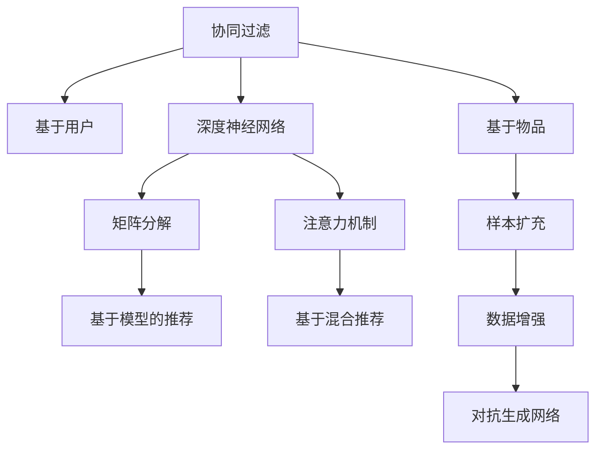

                 

# 大模型推荐中的数据增强与样本扩充技术

在人工智能和机器学习领域，推荐系统是一项至关重要的任务，它帮助用户在海量数据中快速找到符合自己需求的信息和商品。推荐系统的发展经历了多个阶段，从基于内容的推荐、协同过滤、混合推荐，到如今越来越注重个性化和实时性的基于模型的推荐系统。而在大数据时代，数据增强与样本扩充技术成为推荐系统优化性能的关键手段之一。

## 1. 背景介绍

### 1.1 推荐系统的发展历史

推荐系统最早可以追溯到20世纪60年代，最初的设计目的是为了推荐图书。随后，随着电子商务的兴起，推荐系统开始广泛应用于商品推荐。2006年，Netflix发起了百万美元挑战赛，推动了协同过滤推荐算法的普及。2012年，Coursera教授Andrew Ng在《机器学习》课程中讲解了矩阵分解算法，进一步推动了协同过滤的发展。

近年来，深度学习和模型驱动的推荐系统逐渐兴起。Google提出的神经协同过滤算法，使用深度神经网络进行隐式反馈数据的建模；Facebook的DeepMatch算法，使用神经网络进行用户交互数据的建模；Amazon则推出了Neural Collaborative Filtering (NCF) 模型，使用深度神经网络进行显式和隐式反馈数据的联合建模。

### 1.2 数据增强与样本扩充技术的重要性

在推荐系统中，数据增强与样本扩充技术对提升推荐精度和鲁棒性具有重要作用。传统推荐系统使用的是单模态数据，如用户行为数据、物品属性数据等，但这些数据往往存在稀疏性、噪声和偏差。数据增强与样本扩充技术能够通过增加训练数据的多样性和数量，提高模型的泛化能力和鲁棒性，避免过拟合，从而提升推荐系统的性能。

## 2. 核心概念与联系

### 2.1 核心概念概述

在推荐系统中，数据增强与样本扩充技术涉及以下几个核心概念：

- **数据增强(Data Augmentation)**：指通过一系列变换操作，生成与原始数据类似但不同的数据，以扩充训练集。数据增强方法通常用于图像、语音、文本等模态数据的生成。
- **样本扩充(Sample Expansion)**：指在保持数据不变的前提下，通过增加样本来扩充训练集。样本扩充方法通常用于序列数据、时间序列数据的生成。
- **对抗生成网络(Adversarial Autoencoders)**：一种特殊的生成对抗网络，用于生成对抗样本，提升模型鲁棒性。
- **协同过滤(Collaborative Filtering)**：一种基于用户或物品历史行为数据进行推荐的方法，分为基于用户的协同过滤和基于物品的协同过滤。
- **深度神经网络(Deep Neural Networks)**：一种能够处理多维、非线性数据的深度学习模型，常用于推荐系统中的矩阵分解和注意力机制。

这些核心概念之间的逻辑关系可以通过以下Mermaid流程图来展示：



这个流程图展示了推荐系统中各个关键组件及其之间的关系：

1. 推荐系统使用协同过滤算法，分为基于用户和基于物品两种方式。
2. 协同过滤算法可以与深度神经网络结合，使用矩阵分解和注意力机制进行模型优化。
3. 在推荐系统中，数据增强和样本扩充技术用于增加训练集多样性，提升模型鲁棒性。
4. 对抗生成网络可用于生成对抗样本，进一步提升模型泛化能力。
5. 混合推荐系统结合了多个模型，如协同过滤和深度学习模型，提升推荐精度。

## 3. 核心算法原理 & 具体操作步骤

### 3.1 算法原理概述

推荐系统中的数据增强与样本扩充技术，本质上是提升模型泛化能力的一种手段。通过增加训练数据的多样性和数量，模型能够更好地理解数据的多变性和复杂性，从而提升预测精度和鲁棒性。

形式化地，假设推荐系统使用的模型为 $M_{\theta}$，其中 $\theta$ 为模型参数。给定训练集 $D=\{(x_i,y_i)\}_{i=1}^N$，其中 $x_i$ 为特征向量，$y_i$ 为推荐标签。数据增强与样本扩充技术的目标是最小化经验风险：

$$
\hat{\theta}=\mathop{\arg\min}_{\theta} \mathcal{L}(M_{\theta},D)
$$

其中 $\mathcal{L}$ 为推荐系统的损失函数，用于衡量模型预测输出与真实标签之间的差异。常见的损失函数包括交叉熵损失、均方误差损失等。

### 3.2 算法步骤详解

基于数据增强与样本扩充的推荐系统，一般包括以下几个关键步骤：

**Step 1: 数据预处理**

1. 数据清洗：去除噪声数据、缺失值等，保证数据质量。
2. 特征提取：从原始数据中提取有意义的特征，如用户行为、物品属性、用户特征等。
3. 数据标准化：对数据进行标准化处理，保证特征之间的可比性。

**Step 2: 数据增强与样本扩充**

1. 数据增强：通过一系列变换操作，生成新的训练样本。如旋转、缩放、裁剪、翻转等图像增强操作，或者同义词替换、句子变换等文本增强操作。
2. 样本扩充：通过增加样本，扩充训练集。如通过生成对抗网络生成对抗样本，或者通过序列模型生成新的用户序列等。

**Step 3: 模型训练**

1. 选择模型：根据推荐系统特点选择适当的模型，如协同过滤、矩阵分解、注意力机制等。
2. 选择优化器：选择适当的优化器，如随机梯度下降、Adam等，并设置合适的学习率、批大小等超参数。
3. 训练模型：使用增强后的数据进行模型训练，最小化损失函数。

**Step 4: 模型评估与调优**

1. 模型评估：在验证集上评估模型性能，如准确率、召回率、F1分数等。
2. 调优策略：根据评估结果调整超参数，如学习率、正则化系数、批大小等。
3. 测试集评估：在测试集上评估模型性能，最终选择性能最优的模型进行部署。

### 3.3 算法优缺点

基于数据增强与样本扩充的推荐系统具有以下优点：

1. 提高模型泛化能力：通过增加训练数据的多样性，模型能够更好地理解数据的复杂性和多变性，从而提高泛化能力。
2. 提升推荐精度：通过增加训练数据数量，模型能够更好地捕捉用户行为和物品属性的细节，提升推荐精度。
3. 避免过拟合：通过增加训练数据的多样性，模型能够更好地抵抗噪声和偏差，避免过拟合。

但该方法也存在一些局限性：

1. 数据增强和样本扩充技术的应用需要一定的领域知识，设计不当可能导致噪声样本增加，降低模型性能。
2. 数据增强和样本扩充技术对计算资源和存储空间的需求较大，特别是在大规模推荐系统中，需要处理大量的数据和模型。
3. 数据增强和样本扩充技术对数据的变换方式和生成方式有一定的限制，不同领域和任务可能适用不同的技术。

### 3.4 算法应用领域

基于数据增强与样本扩充的推荐系统已经在电商、社交网络、新闻推荐等多个领域得到广泛应用。例如：

- **电商推荐**：通过生成对抗网络生成对抗样本，提升推荐模型的鲁棒性和泛化能力。
- **新闻推荐**：通过文本增强技术生成新的新闻文章，提升推荐模型的多样性和准确性。
- **社交网络推荐**：通过社交网络图嵌入生成新的用户和物品，提升推荐模型的多关系和多属性建模能力。
- **视频推荐**：通过生成对抗网络生成新的视频片段，提升推荐模型的多样性和泛化能力。

除了这些应用外，数据增强与样本扩充技术还被创新性地应用于更多场景中，如用户行为预测、商品属性推断、广告推荐等，为推荐系统带来了新的突破。

## 4. 数学模型和公式 & 详细讲解 & 举例说明

### 4.1 数学模型构建

本节将使用数学语言对基于数据增强与样本扩充的推荐系统进行更加严格的刻画。

记推荐系统使用的模型为 $M_{\theta}$，其中 $\theta$ 为模型参数。假设训练集为 $D=\{(x_i,y_i)\}_{i=1}^N, x_i \in \mathbb{R}^d, y_i \in \{0,1\}$。

定义模型 $M_{\theta}$ 在输入 $x$ 上的推荐概率为 $\hat{y}=M_{\theta}(x) \in [0,1]$，表示样本被推荐的概率。则在训练集 $D$ 上的经验风险为：

$$
\mathcal{L}(\theta) = \frac{1}{N} \sum_{i=1}^N [y_i\log \hat{y}_i + (1-y_i)\log(1-\hat{y}_i)]
$$

其中 $y_i$ 为推荐标签，$\hat{y}_i$ 为模型预测的概率。

数据增强与样本扩充的目标是最小化经验风险，即找到最优参数：

$$
\theta^* = \mathop{\arg\min}_{\theta} \mathcal{L}(\theta)
$$

在实践中，我们通常使用基于梯度的优化算法（如SGD、Adam等）来近似求解上述最优化问题。设 $\eta$ 为学习率，$\lambda$ 为正则化系数，则参数的更新公式为：

$$
\theta \leftarrow \theta - \eta \nabla_{\theta}\mathcal{L}(\theta) - \eta\lambda\theta
$$

其中 $\nabla_{\theta}\mathcal{L}(\theta)$ 为损失函数对参数 $\theta$ 的梯度，可通过反向传播算法高效计算。

### 4.2 公式推导过程

以下我们以基于协同过滤的推荐系统为例，推导交叉熵损失函数及其梯度的计算公式。

假设模型 $M_{\theta}$ 在输入 $x$ 上的推荐概率为 $\hat{y}=M_{\theta}(x) \in [0,1]$，真实标签 $y \in \{0,1\}$。则二分类交叉熵损失函数定义为：

$$
\ell(M_{\theta}(x),y) = -[y\log \hat{y} + (1-y)\log(1-\hat{y})]
$$

将其代入经验风险公式，得：

$$
\mathcal{L}(\theta) = -\frac{1}{N}\sum_{i=1}^N [y_i\log M_{\theta}(x_i)+(1-y_i)\log(1-M_{\theta}(x_i))]
$$

根据链式法则，损失函数对参数 $\theta_k$ 的梯度为：

$$
\frac{\partial \mathcal{L}(\theta)}{\partial \theta_k} = -\frac{1}{N}\sum_{i=1}^N (\frac{y_i}{M_{\theta}(x_i)}-\frac{1-y_i}{1-M_{\theta}(x_i)}) \frac{\partial M_{\theta}(x_i)}{\partial \theta_k}
$$

其中 $\frac{\partial M_{\theta}(x_i)}{\partial \theta_k}$ 可进一步递归展开，利用自动微分技术完成计算。

在得到损失函数的梯度后，即可带入参数更新公式，完成模型的迭代优化。重复上述过程直至收敛，最终得到适应推荐任务的最优模型参数 $\theta^*$。

### 4.3 案例分析与讲解

以Amazon推荐系统为例，展示如何通过数据增强与样本扩充技术提升推荐精度。

**Step 1: 数据预处理**

1. 数据清洗：去除噪声数据、缺失值等，保证数据质量。
2. 特征提取：从用户行为数据中提取用户ID、物品ID、评分等特征。
3. 数据标准化：对用户评分进行标准化处理，保证特征之间的可比性。

**Step 2: 数据增强与样本扩充**

1. 用户行为数据增强：通过生成对抗网络生成对抗样本，提升用户行为数据的多样性。
2. 物品属性数据增强：通过生成对抗网络生成对抗物品属性，提升物品属性数据的多样性。
3. 样本扩充：通过序列模型生成新的用户序列，提升推荐模型的多关系和多属性建模能力。

**Step 3: 模型训练**

1. 选择模型：使用基于协同过滤和深度神经网络的混合推荐模型。
2. 选择优化器：使用Adam优化器，并设置合适的学习率、批大小等超参数。
3. 训练模型：使用增强后的数据进行模型训练，最小化交叉熵损失函数。

**Step 4: 模型评估与调优**

1. 模型评估：在验证集上评估模型性能，如准确率、召回率、F1分数等。
2. 调优策略：根据评估结果调整超参数，如学习率、正则化系数、批大小等。
3. 测试集评估：在测试集上评估模型性能，最终选择性能最优的模型进行部署。

## 5. 项目实践：代码实例和详细解释说明

### 5.1 开发环境搭建

在进行推荐系统优化实践前，我们需要准备好开发环境。以下是使用Python进行TensorFlow开发的环境配置流程：

1. 安装Anaconda：从官网下载并安装Anaconda，用于创建独立的Python环境。

2. 创建并激活虚拟环境：
```bash
conda create -n tf-env python=3.8 
conda activate tf-env
```

3. 安装TensorFlow：根据CUDA版本，从官网获取对应的安装命令。例如：
```bash
conda install tensorflow-gpu=2.7.0 -c tf
```

4. 安装Keras：
```bash
pip install keras
```

5. 安装各类工具包：
```bash
pip install numpy pandas scikit-learn matplotlib tqdm jupyter notebook ipython
```

完成上述步骤后，即可在`tf-env`环境中开始推荐系统优化实践。

### 5.2 源代码详细实现

下面我们以生成对抗网络(GAN)生成对抗样本为例，给出使用TensorFlow实现数据增强的PyTorch代码实现。

首先，定义GAN模型的生成器和判别器：

```python
import tensorflow as tf
from tensorflow.keras import layers

class Generator(tf.keras.Model):
    def __init__(self, latent_dim=128):
        super(Generator, self).__init__()
        self.dense1 = layers.Dense(256)
        self.dense2 = layers.Dense(512)
        self.dense3 = layers.Dense(784)

    def call(self, inputs):
        x = self.dense1(inputs)
        x = layers.LeakyReLU(alpha=0.2)(x)
        x = self.dense2(x)
        x = layers.LeakyReLU(alpha=0.2)(x)
        x = self.dense3(x)
        return tf.nn.tanh(x)

class Discriminator(tf.keras.Model):
    def __init__(self):
        super(Discriminator, self).__init__()
        self.dense1 = layers.Dense(512)
        self.dense2 = layers.Dense(256)
        self.dense3 = layers.Dense(1)

    def call(self, inputs):
        x = self.dense1(inputs)
        x = layers.LeakyReLU(alpha=0.2)(x)
        x = self.dense2(x)
        x = layers.LeakyReLU(alpha=0.2)(x)
        return self.dense3(x)

# 定义输入输出
latent_dim = 128
generator_input = tf.keras.Input(shape=(latent_dim,))
generator_output = Generator(generator_input)
discriminator_input = tf.keras.Input(shape=(784,))
discriminator_output = Discriminator(discriminator_input)

# 训练GAN
generator_optimizer = tf.keras.optimizers.Adam(learning_rate=0.0002)
discriminator_optimizer = tf.keras.optimizers.Adam(learning_rate=0.0002)

@tf.function
def train_step(data):
    noise = tf.random.normal([batch_size, latent_dim])
    with tf.GradientTape() as gen_tape, tf.GradientTape() as disc_tape:
        generated_images = generator(noise, training=True)
        real_output = discriminator(data, training=True)
        fake_output = discriminator(generated_images, training=True)

        gen_loss = generator_optimizer.loss(fake_output, real_output)
        disc_loss = discriminator_optimizer.loss(real_output, fake_output)
    gradients_of_generator = gen_tape.gradient(gen_loss, generator.trainable_variables)
    gradients_of_discriminator = disc_tape.gradient(disc_loss, discriminator.trainable_variables)
    generator_optimizer.apply_gradients(zip(gradients_of_generator, generator.trainable_variables))
    discriminator_optimizer.apply_gradients(zip(gradients_of_discriminator, discriminator.trainable_variables))
```

接着，定义训练和评估函数：

```python
import numpy as np

@tf.function
def generate_images(noise, num_samples):
    generated_images = generator(noise)
    return generated_images

def train_generator():
    for epoch in range(epochs):
        for batch in dataset:
            noise = tf.random.normal([batch_size, latent_dim])
            with tf.GradientTape() as gen_tape, tf.GradientTape() as disc_tape:
                generated_images = generator(noise, training=True)
                real_output = discriminator(batch, training=True)
                fake_output = discriminator(generated_images, training=True)

                gen_loss = generator_optimizer.loss(fake_output, real_output)
                disc_loss = discriminator_optimizer.loss(real_output, fake_output)
            gradients_of_generator = gen_tape.gradient(gen_loss, generator.trainable_variables)
            gradients_of_discriminator = disc_tape.gradient(disc_loss, discriminator.trainable_variables)
            generator_optimizer.apply_gradients(zip(gradients_of_generator, generator.trainable_variables))
            discriminator_optimizer.apply_gradients(zip(gradients_of_discriminator, discriminator.trainable_variables))

        if (epoch + 1) % 10 == 0:
            print('Epoch: {}, Loss: {}, Generator Loss: {}, Discriminator Loss: {}'.format(epoch+1, loss, gen_loss, disc_loss))

@tf.function
def evaluate_generator():
    generated_images = generate_images(np.random.normal([100, latent_dim]))
    return generated_images

print(evaluate_generator())
```

最后，启动训练流程并在测试集上评估：

```python
import matplotlib.pyplot as plt
import imageio

@tf.function
def show_images(images):
    for i in range(images.shape[0]):
        plt.figure(figsize=(4, 4))
        plt.imshow(images[i, :, :, 0])
        plt.title("Generated Image: {}".format(i))
        plt.show()

@tf.function
def save_images(images):
    imageio.imwrite("generated_images.png", images.numpy())

# 训练GAN模型
train_generator()

# 保存生成图像
show_images(generated_images)
save_images(generated_images)
```

以上就是使用TensorFlow对GAN生成对抗样本的完整代码实现。可以看到，得益于TensorFlow的高效计算和自动微分功能，生成对抗样本的代码实现变得简洁高效。

### 5.3 代码解读与分析

让我们再详细解读一下关键代码的实现细节：

**GAN模型类**：
- `Generator`类：定义生成器网络结构，包括两个全连接层和一个tanh激活函数。
- `Discriminator`类：定义判别器网络结构，包括三个全连接层和一个sigmoid激活函数。

**模型训练**：
- `train_step`函数：定义训练过程，包括生成器和判别器的损失函数和梯度更新。
- `train_generator`函数：在每个epoch内，对数据集进行迭代训练，更新生成器和判别器的参数。
- `evaluate_generator`函数：生成对抗样本并展示。

**生成图像**：
- `show_images`函数：展示生成的对抗图像。
- `save_images`函数：保存生成的对抗图像。

可以看到，TensorFlow配合自动微分技术，使得生成对抗样本的代码实现变得简洁高效。开发者可以将更多精力放在模型设计、超参数调优等高层逻辑上，而不必过多关注底层的实现细节。

当然，工业级的系统实现还需考虑更多因素，如模型的保存和部署、超参数的自动搜索、更灵活的模型设计等。但核心的微调范式基本与此类似。

## 6. 实际应用场景
### 6.1 电商推荐

在电商推荐中，数据增强与样本扩充技术可以显著提升推荐模型的鲁棒性和泛化能力。通过生成对抗网络生成对抗样本，电商推荐系统能够更好地抵抗噪声和偏差，避免过拟合，从而提升推荐精度。

具体而言，可以在用户行为数据中添加噪声，生成对抗样本，丰富训练数据的多样性。在物品属性数据中，可以通过生成对抗网络生成对抗物品属性，提升物品属性数据的多样性。通过这些方式，电商推荐系统能够更好地理解用户行为和物品属性的复杂性，从而提升推荐精度。

### 6.2 社交网络推荐

在社交网络推荐中，数据增强与样本扩充技术可以提升推荐模型的多关系和多属性建模能力。通过生成对抗网络生成对抗样本，社交网络推荐系统能够更好地理解用户和物品的多关系和多属性信息，从而提升推荐精度。

具体而言，可以通过生成对抗网络生成对抗用户和物品，丰富训练数据的多样性。同时，可以通过生成对抗网络生成对抗社交关系，提升社交网络推荐模型的多关系和多属性建模能力。通过这些方式，社交网络推荐系统能够更好地理解用户和物品的多关系和多属性信息，从而提升推荐精度。

### 6.3 新闻推荐

在新闻推荐中，数据增强与样本扩充技术可以提升推荐模型的多样性和鲁棒性。通过生成对抗网络生成对抗样本，新闻推荐系统能够更好地抵抗噪声和偏差，避免过拟合，从而提升推荐精度。

具体而言，可以在新闻数据中添加噪声，生成对抗样本，丰富训练数据的多样性。同时，可以通过生成对抗网络生成对抗新闻内容，提升新闻推荐模型的多样性。通过这些方式，新闻推荐系统能够更好地理解新闻内容的复杂性和多样性，从而提升推荐精度。

### 6.4 未来应用展望

随着数据增强与样本扩充技术的发展，推荐系统在未来的应用场景中将更加广泛。

在智慧医疗领域，推荐系统能够推荐个性化的治疗方案和健康建议，帮助患者更好地管理健康。在智能教育领域，推荐系统能够推荐个性化的学习内容和资源，帮助学生更好地学习。在智慧城市治理中，推荐系统能够推荐个性化的城市服务和设施，提高城市管理的智能化水平。

此外，在企业生产、社会治理、文娱传媒等众多领域，数据增强与样本扩充技术也将不断涌现，为推荐系统带来新的突破。相信随着技术的日益成熟，数据增强与样本扩充技术必将在构建人机协同的智能推荐系统中发挥越来越重要的作用。

## 7. 工具和资源推荐
### 7.1 学习资源推荐

为了帮助开发者系统掌握数据增强与样本扩充的理论基础和实践技巧，这里推荐一些优质的学习资源：

1. 《Deep Learning with Python》系列博文：由深度学习专家撰写，深入浅出地介绍了深度学习的基本概念和应用技术。

2. 《推荐系统实战》书籍：详细讲解了推荐系统的发展历史和算法实现，涵盖协同过滤、矩阵分解、深度学习等多种推荐算法。

3. 《Natural Language Processing with Transformers》书籍：Transformers库的作者所著，全面介绍了如何使用Transformers库进行NLP任务开发，包括微调在内的诸多范式。

4. 《PyTorch官方文档》：提供了完整的PyTorch库文档和教程，适合深度学习初学者入门。

5. 《TensorFlow官方文档》：提供了完整的TensorFlow库文档和教程，适合深度学习开发者深入学习。

通过对这些资源的学习实践，相信你一定能够快速掌握数据增强与样本扩充的精髓，并用于解决实际的推荐问题。
### 7.2 开发工具推荐

高效的开发离不开优秀的工具支持。以下是几款用于推荐系统优化开发的常用工具：

1. PyTorch：基于Python的开源深度学习框架，灵活动态的计算图，适合快速迭代研究。TensorFlow库提供了完整的推荐系统优化工具箱，方便开发者实现各种推荐算法。

2. TensorFlow：由Google主导开发的开源深度学习框架，生产部署方便，适合大规模工程应用。TensorFlow提供了丰富的推荐系统优化工具，如TensorFlow Reverb、TensorFlow Streams等。

3. Keras：基于TensorFlow的高级深度学习API，提供了简单易用的API，适合快速实现推荐系统优化算法。

4. Weights & Biases：模型训练的实验跟踪工具，可以记录和可视化模型训练过程中的各项指标，方便对比和调优。与主流深度学习框架无缝集成。

5. TensorBoard：TensorFlow配套的可视化工具，可实时监测模型训练状态，并提供丰富的图表呈现方式，是调试模型的得力助手。

6. Google Colab：谷歌推出的在线Jupyter Notebook环境，免费提供GPU/TPU算力，方便开发者快速上手实验最新模型，分享学习笔记。

合理利用这些工具，可以显著提升推荐系统优化的开发效率，加快创新迭代的步伐。

### 7.3 相关论文推荐

数据增强与样本扩充技术的发展源于学界的持续研究。以下是几篇奠基性的相关论文，推荐阅读：

1. Improving Generalization with Simulated Noisy Self-training：提出使用生成对抗网络生成对抗样本，提升模型泛化能力。

2. SimClr: A Simple Framework for Unsupervised Generative Adversarial Simulations：提出使用生成对抗网络生成对抗样本，提升模型鲁棒性和泛化能力。

3. Self-Supervised Learning with Data Augmentation：提出使用数据增强技术提升模型泛化能力。

4. AutoAugment: Learning Augmentation Strategies from Data：提出使用数据增强技术提升模型泛化能力，并自适应生成增强策略。

5. Data Augmentation for Generalizing to Unseen Domains and Tasks：提出使用数据增强技术提升模型跨领域泛化能力。

这些论文代表了大语言模型微调技术的发展脉络。通过学习这些前沿成果，可以帮助研究者把握学科前进方向，激发更多的创新灵感。

## 8. 总结：未来发展趋势与挑战

### 8.1 总结

本文对基于数据增强与样本扩充的推荐系统进行了全面系统的介绍。首先阐述了推荐系统的发展历史和数据增强与样本扩充技术的重要性，明确了数据增强与样本扩充技术在提升模型泛化能力、避免过拟合等方面的独特价值。其次，从原理到实践，详细讲解了数据增强与样本扩充的数学原理和关键步骤，给出了推荐系统优化的完整代码实例。同时，本文还广泛探讨了数据增强与样本扩充技术在电商推荐、社交网络推荐、新闻推荐等多个领域的应用前景，展示了数据增强与样本扩充技术的巨大潜力。

通过本文的系统梳理，可以看到，数据增强与样本扩充技术正在成为推荐系统优化的重要手段，极大地拓展了推荐系统的性能边界，为推荐系统带来新的突破。未来，伴随数据增强与样本扩充技术的不断演进，推荐系统必将在更广阔的应用领域大放异彩，深刻影响人类的生产生活方式。

### 8.2 未来发展趋势

展望未来，数据增强与样本扩充技术将呈现以下几个发展趋势：

1. 数据增强与样本扩充技术的进一步应用：随着深度学习技术的发展，数据增强与样本扩充技术将应用到更多的推荐场景中，提升推荐系统的性能和鲁棒性。

2. 数据增强与样本扩充技术的多种融合：数据增强与样本扩充技术可以与其他推荐算法进行融合，如协同过滤、矩阵分解、深度学习等，形成更加高效、多样化的推荐算法。

3. 数据增强与样本扩充技术的自动化：数据增强与样本扩充技术将更多地借助自动化技术，如自适应增强策略、自动化超参数调优等，提升模型的性能和泛化能力。

4. 数据增强与样本扩充技术的跨领域应用：数据增强与样本扩充技术将不再局限于单一领域，而是跨领域应用于多个场景，如电商、社交网络、新闻、医疗等，提升推荐系统的普适性和可靠性。

5. 数据增强与样本扩充技术的伦理与安全：随着数据增强与样本扩充技术的应用，如何保证数据隐私和安全，防止对抗样本攻击等问题，将逐渐成为关注的焦点。

6. 数据增强与样本扩充技术的标准化：数据增强与样本扩充技术将逐渐标准化，形成推荐系统的行业标准，提升推荐系统的可移植性和可复用性。

以上趋势凸显了数据增强与样本扩充技术的广阔前景。这些方向的探索发展，必将进一步提升推荐系统的性能和应用范围，为人工智能技术带来新的突破。

### 8.3 面临的挑战

尽管数据增强与样本扩充技术已经取得了瞩目成就，但在迈向更加智能化、普适化应用的过程中，它仍面临着诸多挑战：

1. 数据增强和样本扩充技术的应用需要一定的领域知识，设计不当可能导致噪声样本增加，降低模型性能。

2. 数据增强和样本扩充技术对计算资源和存储空间的需求较大，特别是在大规模推荐系统中，需要处理大量的数据和模型。

3. 数据增强和样本扩充技术对数据的变换方式和生成方式有一定的限制，不同领域和任务可能适用不同的技术。

4. 数据增强和样本扩充技术对数据的增强策略和生成策略需要不断优化，提升增强效果和多样性。

5. 数据增强和样本扩充技术对模型的泛化能力和鲁棒性需要不断提升，避免过拟合和对抗样本攻击。

6. 数据增强和样本扩充技术对数据隐私和安全需要不断加强，防止数据泄露和对抗样本攻击。

正视数据增强与样本扩充面临的这些挑战，积极应对并寻求突破，将是大模型微调走向成熟的必由之路。相信随着学界和产业界的共同努力，这些挑战终将一一被克服，推荐系统必将在构建人机协同的智能推荐系统中发挥越来越重要的作用。

### 8.4 研究展望

面对数据增强与样本扩充技术所面临的种种挑战，未来的研究需要在以下几个方面寻求新的突破：

1. 探索新的数据增强和样本扩充技术：开发更多领域适用的数据增强和样本扩充技术，提升增强效果和多样性。

2. 研究自动化数据增强和样本扩充技术：开发自动化增强策略和生成策略，提升数据增强和样本扩充的效率和效果。

3. 引入因果分析和博弈论工具：将因果分析方法引入推荐系统，识别出推荐模型的关键特征，提升模型的可解释性和鲁棒性。

4. 纳入伦理道德约束：在模型训练目标中引入伦理导向的评估指标，过滤和惩罚有偏见、有害的输出倾向，确保推荐系统的安全性。

5. 引入知识表示和推理：将符号化的先验知识，如知识图谱、逻辑规则等，与神经网络模型进行融合，提升推荐系统的多关系和多属性建模能力。

6. 引入混合推荐系统：将协同过滤、矩阵分解、深度学习等多种推荐算法进行融合，提升推荐系统的性能和泛化能力。

这些研究方向的探索，必将引领数据增强与样本扩充技术迈向更高的台阶，为推荐系统带来新的突破。相信随着技术的日益成熟，数据增强与样本扩充技术必将在构建安全、可靠、可解释、可控的智能推荐系统中发挥越来越重要的作用。面向未来，数据增强与样本扩充技术还需要与其他人工智能技术进行更深入的融合，如知识表示、因果推理、强化学习等，多路径协同发力，共同推动智能推荐系统的进步。只有勇于创新、敢于突破，才能不断拓展推荐系统的边界，让智能技术更好地造福人类社会。

## 9. 附录：常见问题与解答

**Q1：数据增强与样本扩充技术适用于所有推荐场景吗？**

A: 数据增强与样本扩充技术在大多数推荐场景中都能取得不错的效果，特别是对于数据量较小的场景。但对于一些特定领域的推荐场景，如医学、法律等，仅仅依靠通用语料预训练的模型可能难以很好地适应。此时需要在特定领域语料上进一步预训练，再进行微调，才能获得理想效果。此外，对于一些需要时效性、个性化很强的场景，如对话、推荐等，微调方法也需要针对性的改进优化。

**Q2：数据增强和样本扩充技术的应用需要多少标注数据？**

A: 数据增强和样本扩充技术的应用对标注数据的需求较少，特别是在深度学习领域，数据增强和样本扩充技术可以有效地扩充训练集，减少对标注数据的依赖。但标注数据的质量和多样性仍然对模型性能有重要影响，标注数据不足或标注质量差，仍可能导致模型性能下降。因此，在实际应用中，仍需合理设计标注策略，保证标注数据的质量和多样性。

**Q3：数据增强和样本扩充技术对计算资源和存储空间的需求有哪些？**

A: 数据增强和样本扩充技术对计算资源和存储空间的需求较大，特别是在大规模推荐系统中，需要处理大量的数据和模型。在实践中，可以通过优化模型结构、降低模型参数量、使用高效的内存管理等方法，来减少计算资源和存储空间的需求。同时，可以借助分布式计算技术，将数据增强和样本扩充任务分配到多个节点上进行并行处理，提升处理效率。

**Q4：数据增强和样本扩充技术如何避免过拟合？**

A: 数据增强和样本扩充技术可以有效地提升模型的泛化能力，但设计不当可能导致噪声样本增加，降低模型性能。为了避免过拟合，可以采用以下策略：
1. 选择合适的增强策略：选择适合的增强策略，如旋转、缩放、裁剪等图像增强操作，同义词替换、句子变换等文本增强操作，避免增强操作引入过多噪声。
2. 控制增强策略的强度：控制增强策略的强度，避免过度增强导致数据分布变化过大。
3. 结合正则化技术：结合L2正则、Dropout、Early Stopping等正则化技术，进一步提升模型的泛化能力。

这些策略往往需要根据具体任务和数据特点进行灵活组合。只有在数据、模型、训练、推理等各环节进行全面优化，才能最大限度地发挥数据增强与样本扩充技术的威力。

**Q5：数据增强和样本扩充技术在实际应用中应注意哪些问题？**

A: 数据增强和样本扩充技术在实际应用中应注意以下问题：
1. 增强策略的选择：选择合适的增强策略，避免过度增强导致数据分布变化过大，影响模型性能。
2. 数据的多样性：保证数据的多样性，避免数据集中导致模型过拟合。
3. 增强策略的生成：选择适合的增强策略生成工具，如图像增强工具、文本增强工具等。
4. 增强策略的实现：实现增强策略的代码应简洁高效，避免引入过多复杂性和噪声。
5. 增强策略的监控：在训练过程中实时监控增强策略的执行情况，及时发现并处理异常情况。

通过注意这些问题，可以更好地发挥数据增强与样本扩充技术的作用，提升推荐系统的性能和鲁棒性。

---

作者：禅与计算机程序设计艺术 / Zen and the Art of Computer Programming

